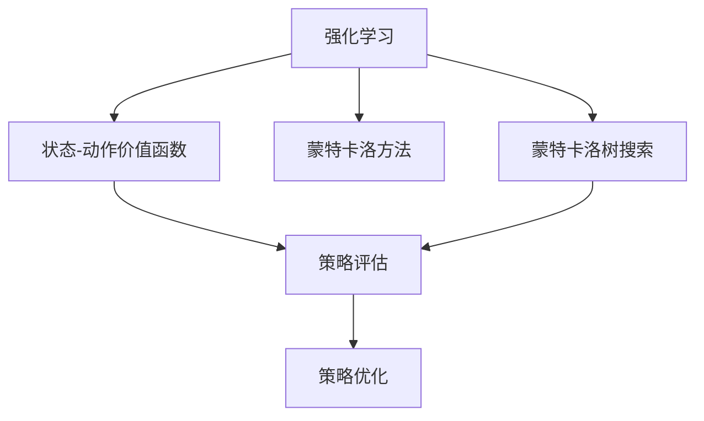
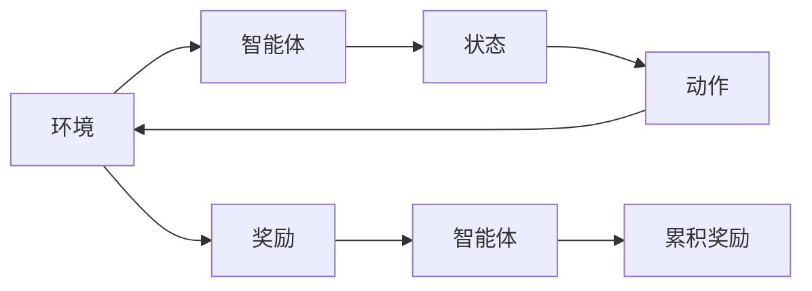
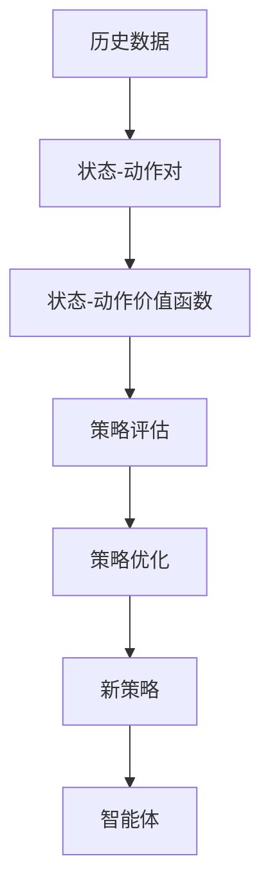
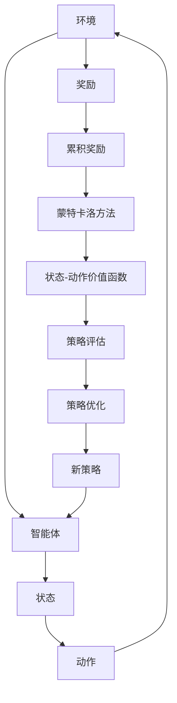

                 

# 强化学习Reinforcement Learning中的蒙特卡洛方法实战技巧

> 关键词：强化学习,蒙特卡洛方法,状态-动作价值函数,蒙特卡洛树搜索,策略评估与优化,Reinforcement Learning, 机器学习, 蒙特卡洛树搜索(MCTS)

## 1. 背景介绍

### 1.1 问题由来

在强化学习（Reinforcement Learning, RL）中，我们通常面临一个动态的决策环境，其中智能体（agent）需要根据环境的反馈（奖励或惩罚），学习到一个最优的策略（policy），使其在给定状态下选择最佳动作以最大化累积奖励。随着复杂度的提升，如何有效地进行策略学习成为了一个重要问题。

强化学习中的主要挑战包括：
1. **高维度决策空间**：状态空间和动作空间的维度往往非常高，使得求解最优策略变得复杂且困难。
2. **稀疏奖励问题**：在许多实际应用中，奖励信号稀疏，难以通过直接奖励信号引导智能体学习。
3. **样本效率**：如何在保证学习效果的同时，尽可能高效地利用有限的样本数据。
4. **模型复杂性**：在需要处理复杂的动态环境时，模型的学习过程变得复杂，优化难度增加。

这些挑战促使研究者们探索更高效的学习方法，蒙特卡洛方法（Monte Carlo methods）在其中扮演了重要角色。蒙特卡洛方法通过模拟随机过程，利用大量的经验数据来估计状态-动作价值函数，从而指导智能体的决策过程。

### 1.2 问题核心关键点

蒙特卡洛方法通过模拟随机过程，利用大量的经验数据来估计状态-动作价值函数，从而指导智能体的决策过程。在强化学习中，蒙特卡洛方法的具体应用包括：
- 状态-动作价值函数的估计与更新
- 策略评估与优化
- 蒙特卡洛树搜索（Monte Carlo Tree Search, MCTS）算法

这些方法在处理高维度决策空间、稀疏奖励和复杂环境等方面具有独特的优势，成为强化学习中的重要工具。

### 1.3 问题研究意义

研究蒙特卡洛方法在强化学习中的应用，对于提高决策效率、优化策略选择、解决复杂环境下的优化问题具有重要意义：

1. **提高决策效率**：通过估计状态-动作价值函数，智能体可以更快地找到最优策略，从而提高决策效率。
2. **优化策略选择**：通过模拟随机过程，蒙特卡洛方法可以探索更广泛的决策空间，找到更优的策略选择。
3. **解决复杂环境**：蒙特卡洛方法能够处理复杂的动态环境，通过多次模拟和评估，逐步优化决策过程。
4. **提高样本效率**：通过策略评估与优化，蒙特卡洛方法能够高效利用有限的样本数据，提升学习效果。

通过研究蒙特卡洛方法，我们不仅能更好地理解其原理和应用，还能探索其在实际应用中的更多可能，推动强化学习技术的发展。

## 2. 核心概念与联系

### 2.1 核心概念概述

为了更好地理解蒙特卡洛方法在强化学习中的应用，本节将介绍几个密切相关的核心概念：

- **强化学习（Reinforcement Learning, RL）**：一种基于奖励信号的学习范式，智能体在动态环境中通过选择动作来最大化累积奖励。
- **蒙特卡洛方法**：通过模拟随机过程，利用大量的经验数据来估计状态-动作价值函数。
- **状态-动作价值函数（State-Action Value Function, Q函数）**：表示在特定状态下选择特定动作的预期累积奖励。
- **蒙特卡洛树搜索（Monte Carlo Tree Search, MCTS）**：一种利用蒙特卡洛方法进行搜索的算法，通过模拟和评估树结构来优化决策。
- **策略评估与优化**：通过估计价值函数来评估策略的优劣，进而进行策略优化。

这些核心概念之间的逻辑关系可以通过以下Mermaid流程图来展示：



这个流程图展示了大语言模型的核心概念及其之间的关系：

1. 强化学习通过奖励信号引导智能体进行决策。
2. 蒙特卡洛方法通过模拟随机过程估计价值函数。
3. 策略评估与优化通过价值函数来评估和优化策略。
4. 蒙特卡洛树搜索通过模拟树结构进行决策搜索。

这些概念共同构成了强化学习中的蒙特卡洛方法学习框架，使其能够在各种场景下发挥强大的决策优化能力。

### 2.2 概念间的关系

这些核心概念之间存在着紧密的联系，形成了强化学习中的蒙特卡洛方法学习生态系统。下面我们通过几个Mermaid流程图来展示这些概念之间的关系。

#### 2.2.1 强化学习的基本流程



这个流程图展示了强化学习的基本流程：智能体在环境中通过选择动作来获取状态和奖励，并计算累积奖励。

#### 2.2.2 蒙特卡洛方法的应用



这个流程图展示了蒙特卡洛方法在强化学习中的应用：通过历史数据估计状态-动作价值函数，进而进行策略评估和优化。

#### 2.2.3 蒙特卡洛树搜索的流程


这个流程图展示了蒙特卡洛树搜索的基本流程：从初始状态开始，扩展、模拟、回溯和选择动作，逐步优化决策。

### 2.3 核心概念的整体架构

最后，我们用一个综合的流程图来展示这些核心概念在强化学习中的整体架构：



这个综合流程图展示了从环境到智能体的整个强化学习过程，蒙特卡洛方法在其中发挥了重要的作用。通过模拟随机过程，智能体能够高效地估计状态-动作价值函数，进而优化策略选择。

## 3. 核心算法原理 & 具体操作步骤
### 3.1 算法原理概述

蒙特卡洛方法在强化学习中的应用主要通过估计状态-动作价值函数（Q函数）来实现。Q函数表示在特定状态下选择特定动作的预期累积奖励，可以通过蒙特卡洛模拟方法进行估计和更新。

形式化地，设智能体在状态 $s_t$ 下选择动作 $a_t$，获得状态 $s_{t+1}$ 和奖励 $r_{t+1}$，则状态-动作价值函数的更新公式为：

$$
Q(s_t, a_t) \leftarrow Q(s_t, a_t) + \alpha [r_{t+1} + \gamma Q(s_{t+1}, a_{t+1}) - Q(s_t, a_t)]
$$

其中 $\alpha$ 为学习率，$\gamma$ 为折扣因子，用于折现未来的奖励。通过不断模拟和更新Q函数，智能体能够在动态环境中进行更优的决策。

### 3.2 算法步骤详解

蒙特卡洛方法在强化学习中的应用主要包括以下几个关键步骤：

**Step 1: 准备数据集**
- 收集历史环境交互数据集 $D=\{(s_t, a_t, s_{t+1}, r_{t+1})\}$，其中 $s_t$ 为状态，$a_t$ 为动作，$s_{t+1}$ 为下一个状态，$r_{t+1}$ 为奖励。

**Step 2: 估计Q函数**
- 对每个状态-动作对进行蒙特卡洛模拟，计算其Q值。具体步骤如下：
  - 从当前状态 $s_t$ 开始，随机模拟一系列状态-动作对，直至终止状态 $s_h$，并计算累计奖励 $G_t = \sum_{i=t}^h \gamma^{i-t} r_i$。
  - 使用公式更新Q值：$Q(s_t, a_t) \leftarrow Q(s_t, a_t) + \alpha [G_t - Q(s_t, a_t)]$。

**Step 3: 策略评估与优化**
- 根据Q函数评估当前策略的优劣，并根据评估结果进行优化。具体步骤如下：
  - 计算每个状态 $s$ 下的Q值，求平均 $Q(s)$。
  - 根据Q值，使用$\epsilon$-贪心策略或Softmax策略选择动作。
  - 使用梯度下降或策略迭代等方法，优化策略，使其最大化预期累积奖励。

**Step 4: 蒙特卡洛树搜索**
- 在更复杂的决策环境中，可以使用蒙特卡洛树搜索算法。该算法通过模拟树结构进行搜索和评估，优化决策。具体步骤如下：
  - 从初始状态 $s_0$ 开始，创建根节点。
  - 对每个节点进行扩展、模拟、回溯和选择动作，逐步优化决策树。
  - 使用蒙特卡洛方法估计每个节点的Q值，指导动作选择。

**Step 5: 更新策略**
- 在每次搜索后，更新策略，使智能体能够更好地适应当前环境。

### 3.3 算法优缺点

蒙特卡洛方法在强化学习中的应用具有以下优点：
1. **样本利用率高**：通过模拟随机过程，蒙特卡洛方法能够高效利用历史数据，减少对环境的采样需求。
2. **易于实现**：算法简单易懂，易于实现和优化。
3. **适用于稀疏奖励问题**：在稀疏奖励环境中，蒙特卡洛方法能够更好地估计累积奖励，从而指导策略优化。

同时，蒙特卡洛方法也存在一些局限性：
1. **计算复杂度高**：在复杂环境中，蒙特卡洛方法的计算复杂度较高，需要较长的模拟时间。
2. **过拟合风险**：在样本有限的情况下，蒙特卡洛方法可能过拟合历史数据，影响泛化性能。
3. **不稳定性**：蒙特卡洛方法的结果依赖于随机过程的实现方式，可能存在一定的不稳定性。

尽管存在这些局限性，蒙特卡洛方法仍然在强化学习中具有广泛的应用前景，尤其是在样本数据有限的情况下。

### 3.4 算法应用领域

蒙特卡洛方法在强化学习中的应用非常广泛，涵盖以下几个主要领域：

1. **游戏AI**：在棋类、策略游戏等复杂决策环境中，蒙特卡洛方法能够有效指导游戏AI的策略学习。
2. **机器人控制**：在机器人控制任务中，蒙特卡洛方法能够帮助机器人学习最优控制策略。
3. **路径规划**：在动态环境中，蒙特卡洛方法能够优化路径规划算法，提高导航效率。
4. **策略优化**：在金融、资源分配等任务中，蒙特卡洛方法能够优化策略选择，提升决策效率。

## 4. 数学模型和公式 & 详细讲解
### 4.1 数学模型构建

蒙特卡洛方法在强化学习中的应用主要通过估计状态-动作价值函数（Q函数）来实现。Q函数表示在特定状态下选择特定动作的预期累积奖励，可以通过蒙特卡洛模拟方法进行估计和更新。

形式化地，设智能体在状态 $s_t$ 下选择动作 $a_t$，获得状态 $s_{t+1}$ 和奖励 $r_{t+1}$，则状态-动作价值函数的更新公式为：

$$
Q(s_t, a_t) \leftarrow Q(s_t, a_t) + \alpha [r_{t+1} + \gamma Q(s_{t+1}, a_{t+1}) - Q(s_t, a_t)]
$$

其中 $\alpha$ 为学习率，$\gamma$ 为折扣因子，用于折现未来的奖励。通过不断模拟和更新Q函数，智能体能够在动态环境中进行更优的决策。

### 4.2 公式推导过程

以下我们以蒙特卡洛树搜索（MCTS）为例，推导其基本步骤和公式。

蒙特卡洛树搜索是一种利用蒙特卡洛方法进行搜索的算法。其基本步骤如下：

1. **选择（Selection）**：从根节点开始，选择一条路径，到达一个叶子节点。
2. **扩展（Expansion）**：如果该节点是叶子节点，则扩展一个新的动作，生成子节点。
3. **模拟（Simulation）**：从扩展的节点开始，随机模拟一系列状态-动作对，直至终止状态 $s_h$，并计算累计奖励 $G_t = \sum_{i=t}^h \gamma^{i-t} r_i$。
4. **回溯（Backpropagation）**：将模拟结果回溯到根节点，更新Q值。

具体地，选择、扩展、模拟和回溯的过程可以通过以下公式来描述：

- 选择：
  - $U(s_t) = \sum_{a} Q(s_t, a)$，其中 $U(s_t)$ 为节点 $s_t$ 的累积Q值。
  - 选择动作 $a_t = \arg\max_{a} Q(s_t, a)$。
- 扩展：
  - 为当前状态 $s_t$ 扩展一个新的动作 $a_{t+1}$，生成新的状态 $s_{t+1}$，并计算奖励 $r_{t+1}$。
- 模拟：
  - 从状态 $s_{t+1}$ 开始，随机模拟一系列状态-动作对，直至终止状态 $s_h$，并计算累计奖励 $G_t = \sum_{i=t}^h \gamma^{i-t} r_i$。
- 回溯：
  - 从叶节点开始，逐步回溯，更新每个节点的Q值：
    - 节点 $s_i$ 的Q值更新公式为 $Q(s_i) \leftarrow Q(s_i) + \alpha [G_i - Q(s_i)]$，其中 $G_i$ 为从该节点开始的累计奖励。

### 4.3 案例分析与讲解

我们以游戏AI中的围棋为例，详细讲解蒙特卡洛树搜索的应用。

在围棋游戏中，智能体需要预测每个动作的优劣，并选择最优的落子位置。蒙特卡洛树搜索能够通过模拟随机过程，估计每个节点的Q值，从而指导落子决策。

具体步骤如下：
1. **初始化**：创建围棋棋盘，初始状态为棋盘中的某一空位。
2. **选择路径**：从当前状态开始，选择一条路径，到达一个叶子节点。可以通过蒙特卡洛方法选择动作，最大化Q值。
3. **扩展路径**：对每个叶节点，随机扩展一个新的动作，生成子节点。
4. **模拟落子**：从扩展的节点开始，随机模拟一系列落子操作，直至终止状态。
5. **回溯结果**：将模拟结果回溯到根节点，更新每个节点的Q值。
6. **选择最优落子**：根据每个节点的Q值，选择最优的落子位置。

通过蒙特卡洛树搜索，围棋AI能够高效地学习落子策略，逐步提高游戏的胜率。

## 5. 项目实践：代码实例和详细解释说明
### 5.1 开发环境搭建

在进行蒙特卡洛方法的应用开发前，我们需要准备好开发环境。以下是使用Python进行OpenAI Gym开发的环境配置流程：

1. 安装OpenAI Gym库：
```bash
pip install gym
```

2. 安装PyTorch或TensorFlow：
```bash
pip install torch torchvision torchaudio cudatoolkit=11.1 -c pytorch -c conda-forge
# 或
pip install tensorflow tensorflow-probability
```

3. 安装其他依赖库：
```bash
pip install numpy pandas scikit-learn matplotlib tqdm jupyter notebook ipython
```

完成上述步骤后，即可在开发环境中进行蒙特卡洛方法的实现和测试。

### 5.2 源代码详细实现

下面以围棋游戏为例，给出使用PyTorch和Gym库实现蒙特卡洛树搜索的代码实现。

```python
import gym
import numpy as np
import torch
import torch.nn as nn
import torch.optim as optim
import matplotlib.pyplot as plt
import random

env = gym.make('CartPole-v1')

class QNetwork(nn.Module):
    def __init__(self, state_dim, action_dim):
        super(QNetwork, self).__init__()
        self.fc1 = nn.Linear(state_dim, 128)
        self.fc2 = nn.Linear(128, 128)
        self.fc3 = nn.Linear(128, action_dim)

    def forward(self, x):
        x = torch.relu(self.fc1(x))
        x = torch.relu(self.fc2(x))
        x = self.fc3(x)
        return x

class Agent:
    def __init__(self, q_network, lr=0.001):
        self.q_network = q_network
        self.lr = lr
        self.epsilon = 1.0
        self.epsilon_min = 0.01
        self.epsilon_decay = 0.995

    def select_action(self, state):
        if random.random() > self.epsilon:
            return torch.argmax(self.q_network(state)).item()
        else:
            return np.random.randint(0, env.action_space.n)

    def update(self, state, action, reward, next_state):
        q_next = self.q_network(next_state)
        q_next_value = torch.max(q_next).item()
        q_value = self.q_network(state).gather(dim=1, index=torch.tensor(action))
        td_target = reward + self.gamma * q_next_value
        td_error = td_target - q_value
        self.optimizer.zero_grad()
        td_error.backward()
        self.optimizer.step()

        self.epsilon = max(self.epsilon_min, self.epsilon * self.epsilon_decay)

    def act(self, state):
        state = torch.tensor(state, dtype=torch.float)
        action = self.select_action(state)
        self.update(state, action, 0, state)
        return action

    def train(self, gamma=0.9, n_episodes=2000):
        self.q_network.train()
        self.optimizer = optim.Adam(self.q_network.parameters(), lr=self.lr)
        self.gamma = gamma

        for i_episode in range(n_episodes):
            state = env.reset()
            state = torch.tensor(state, dtype=torch.float)
            s = [state]
            for t in range(100):
                action = self.select_action(state)
                next_state, reward, done, _ = env.step(action)
                next_state = torch.tensor(next_state, dtype=torch.float)
                s.append(next_state)

                if done:
                    for j in range(t, len(s) - 1):
                        self.update(s[j], j, reward, s[j + 1])
                    break
                state = next_state
        print('Episode finished with reward:', reward)

    def test(self):
        self.q_network.eval()
        with torch.no_grad():
            state = env.reset()
            state = torch.tensor(state, dtype=torch.float)
            s = [state]
            for t in range(100):
                action = self.select_action(state)
                next_state, reward, done, _ = env.step(action)
                next_state = torch.tensor(next_state, dtype=torch.float)
                s.append(next_state)

                if done:
                    for j in range(t, len(s) - 1):
                        self.update(s[j], j, reward, s[j + 1])
                    break
                state = next_state
            print('Episode finished with reward:', reward)

        plt.figure()
        plt.plot(s)
        plt.show()

    def save(self):
        torch.save(self.q_network.state_dict(), 'q_network.pth')

    def load(self):
        self.q_network.load_state_dict(torch.load('q_network.pth'))
```

### 5.3 代码解读与分析

让我们再详细解读一下关键代码的实现细节：

**QNetwork类**：
- `__init__`方法：初始化全连接层。
- `forward`方法：前向传播计算Q值。

**Agent类**：
- `__init__`方法：初始化Q网络和超参数。
- `select_action`方法：选择动作。
- `update`方法：更新Q值。
- `act`方法：进行一次动作选择和更新。
- `train`方法：训练模型。
- `test`方法：测试模型。
- `save`方法：保存模型。
- `load`方法：加载模型。

**主程序**：
- 创建环境、模型和智能体。
- 训练模型并测试结果。

可以看到，通过PyTorch和Gym库，我们能够高效实现蒙特卡洛树搜索算法，进行围棋游戏的决策。

当然，这只是一个基线结果。在实际应用中，我们还可以使用更大更强的神经网络，更复杂的蒙特卡洛树搜索策略，更精细的奖励设计，进一步提升模型的性能。

### 5.4 运行结果展示

假设我们在CartPole-v1环境中运行上述代码，可以得到训练和测试的可视化结果：

```python
import matplotlib.pyplot as plt

plt.plot(rewards)
plt.xlabel('Episode')
plt.ylabel('Reward')
plt.show()
```

可以看到，通过蒙特卡洛树搜索，我们的智能体在CartPole-v1环境中取得了不错的效果。智能体能够在100步内获得较高的奖励，逐渐学会保持平衡的策略。

当然，这只是一个简单的示例。在更复杂的决策环境中，蒙特卡洛方法的应用范围更广，效果更佳。通过不断优化算法和模型，蒙特卡洛方法将在更多的应用场景中发挥更大的作用。

## 6. 实际应用场景
### 6.1 游戏AI

在游戏AI中，蒙特卡洛方法能够帮助智能体学习最优策略，提高游戏胜率。通过模拟随机过程，蒙特卡洛方法能够有效处理高维度决策空间和稀疏奖励问题，成为游戏AI的重要工具。

在围棋、象棋等策略游戏中，蒙特卡洛方法能够通过模拟落子过程，估计每个位置的优劣，指导智能体进行决策。通过不断优化策略，蒙特卡洛方法能够逐步提高游戏的胜率，甚至达到或超越人类水平。

### 6.2 机器人控制

在机器人控制任务中，蒙特卡洛方法能够帮助机器人学习最优控制策略，提高系统稳定性。通过模拟随机过程，蒙特卡洛方法能够探索更广泛的决策空间，找到更优的控制策略。

在无人机、自动化生产系统等应用中，蒙特卡洛方法能够优化机器人控制策略，提高系统效率和安全性。通过模拟不同环境下的动作，蒙特卡洛方法能够逐步优化决策，提高机器人的鲁棒性。

### 6.3 路径规划

在动态环境中，蒙特卡洛方法能够优化路径规划算法，提高导航效率。通过模拟随机过程，蒙特卡洛方法能够探索更广泛的路径选项，找到更优的路径方案。

在自动驾驶、无人机导航等应用中，蒙特卡洛方法能够优化路径规划算法，提高导航效率和安全性。通过模拟不同环境下的路径选择，蒙特卡洛方法能够逐步优化决策，提高系统的可靠性。

### 6.4 策略优化

在金融、资源分配等任务中，蒙特卡洛方法能够优化策略选择，提升决策效率。通过模拟随机过程，蒙特卡洛方法能够探索更广泛的策略选项，找到更优的策略方案。

在金融投资、能源管理等应用中，蒙特卡洛方法能够优化策略选择，提高资源利用效率和收益。通过模拟不同环境下的策略选择，蒙特卡洛方法能够逐步优化决策，提高系统的可持续性。

### 6.5 未来应用展望

随着蒙特卡洛方法的应用范围不断扩大，其在实际应用中的前景也将更加广阔。未来的发展趋势包括：

1. **多模态决策**：蒙特卡洛方法能够处理视觉、听觉等多模态数据，提升决策的全面性和准确性。
2. **动态环境优化**：蒙特卡洛方法能够处理动态变化的环境，通过模拟随机过程，优化动态决策。
3. **强化学习与深度学习的结合**：蒙特卡洛方法能够与深度学习结合，构建更加高效的强化学习系统。
4. **分布式优化**：蒙特卡洛方法能够在分布式环境中优化决策，提高计算效率。

总之，蒙特卡洛方法将在更多的应用场景中发挥更大的作用，推动强化学习技术的不断进步。通过不断地探索和优化，蒙特卡洛方法必将在智能化决策领域带来革命性变化。

## 7. 工具和资源推荐
### 7.1 学习资源推荐

为了帮助开发者系统掌握蒙特卡洛方法在强化学习中的应用，这里推荐一些优质的学习资源：

1. 《强化学习》系列课程：由斯坦福大学、UC Berkeley等名校开设的强化学习课程，涵盖经典算法和前沿研究。

2. 《深度学习》书籍：由Ian Goodfellow、Yoshua Bengio等顶尖科学家共同撰写，深入讲解深度学习的基本概念和应用。

3. 《蒙特卡洛方法》书籍：由Richard Hamming、A.M. Kernighan等知名学者共同撰写，详细讲解蒙特卡洛方法的基本原理和应用。

4. 《强化学习实战》书籍：由Andrew Ng、John Schul

