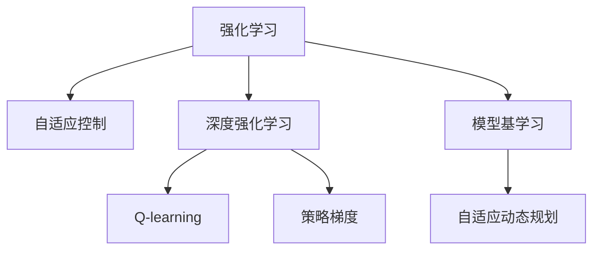
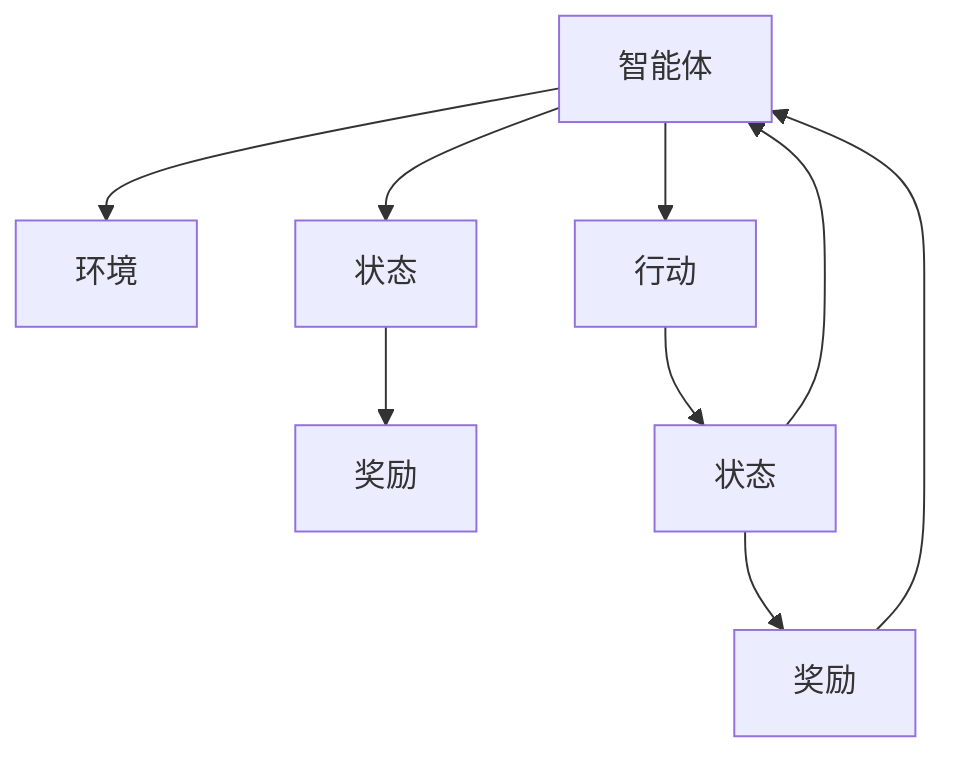
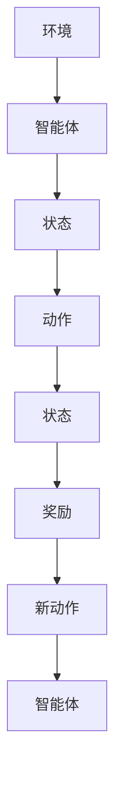
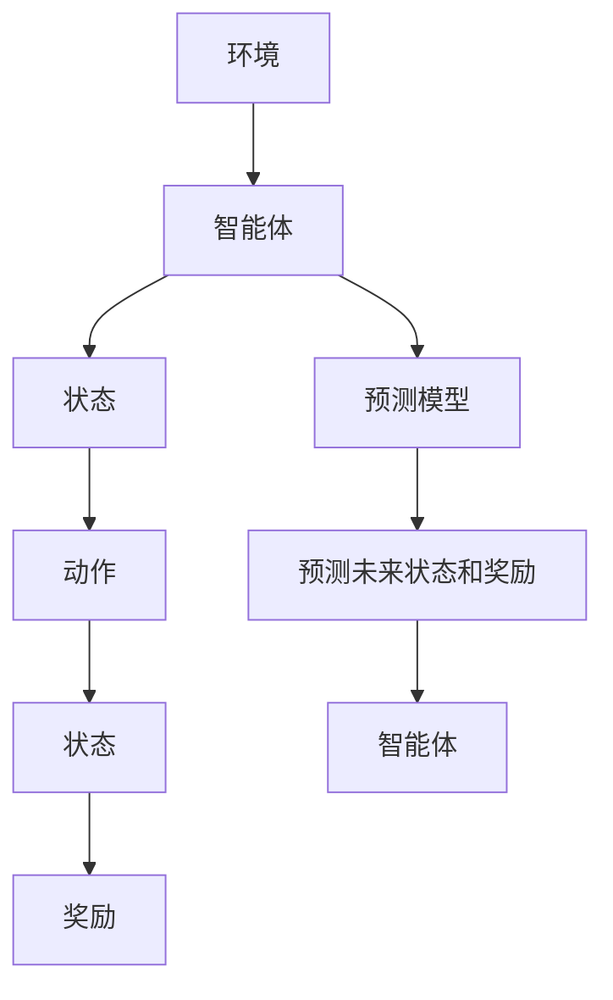
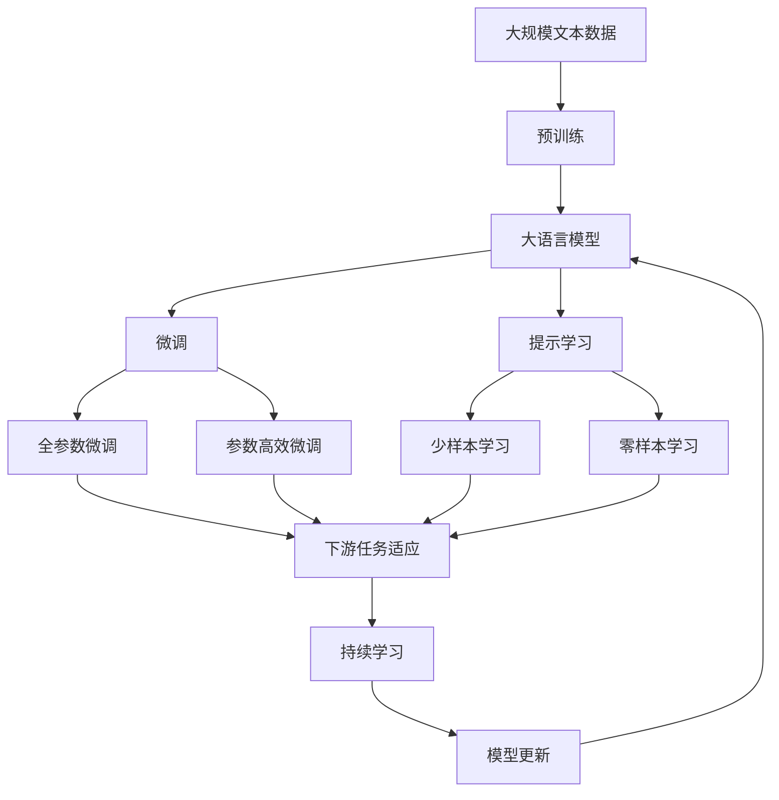

                 

# 强化学习与自适应控制原理与代码实战案例讲解

> 关键词：强化学习,自适应控制,算法原理,代码实战,案例讲解

## 1. 背景介绍

### 1.1 问题由来
强化学习（Reinforcement Learning, RL）是一种基于试错的学习方式，通过与环境交互，在不断的试错中学习最优策略。其核心思想是智能体（agent）在环境中采取行动，观察结果，并根据奖励反馈调整策略，最终达到目标状态。强化学习在自动控制、游戏AI、机器人等领域得到了广泛应用，成为AI技术的核心研究内容之一。

近年来，随着深度学习、神经网络等技术的成熟，强化学习的研究和应用进入了一个新的阶段。深度强化学习（Deep Reinforcement Learning, DRL）通过将神经网络应用于强化学习模型，提升了模型的泛化能力和性能。然而，大模型在实际应用中，常常面临环境动态变化、策略调整复杂等问题，自适应控制（Adaptive Control）技术为此提供了一种高效、灵活的解决方案。

### 1.2 问题核心关键点
强化学习和自适应控制的核心在于如何高效地处理动态变化的环境，以及如何在复杂策略空间中寻优。具体来说：

- **动态环境**：强化学习模型必须能够适应环境变化，而不仅仅是一成不变的静态模型。
- **高维策略空间**：强化学习模型需要在一个高维的策略空间中寻找最优策略，这对计算资源和时间都提出了巨大挑战。
- **在线学习**：强化学习模型需要在不断与环境交互中实时学习，而不仅仅是在训练数据上离线学习。

### 1.3 问题研究意义
强化学习与自适应控制的结合，旨在解决复杂动态环境下的智能决策问题，提升智能系统的适应性和鲁棒性。对于自动控制、机器人、游戏AI等领域的智能化系统，自适应控制技术能够提供更加灵活、高效的控制策略，提高系统的稳定性和性能。

在自动驾驶、智能制造、医疗诊断等领域，实时动态的决策和控制至关重要，强化学习和自适应控制技术的应用，能够提升系统对环境的响应速度和决策准确性，进而带来更高的应用价值。此外，强化学习和自适应控制的结合，还为新型智能系统的研发提供了新的思路和方法，推动了AI技术的进一步发展。

## 2. 核心概念与联系

### 2.1 核心概念概述

为更好地理解强化学习与自适应控制技术，本节将介绍几个密切相关的核心概念：

- **强化学习**：通过与环境交互，智能体在不断试错中学习最优策略。
- **自适应控制**：针对动态环境，智能系统能够实时调整控制策略，适应环境变化。
- **深度强化学习**：结合深度神经网络，提升强化学习模型的泛化能力和性能。
- **Q-learning**：一种经典的强化学习算法，通过奖励反馈学习最优策略。
- **策略梯度**：通过梯度优化更新策略参数，提升策略性能。
- **价值函数**：衡量智能体在当前状态下的最优策略期望收益。
- **模型基学习**：通过学习环境动态模型，预测未来状态和奖励，优化策略选择。
- **自适应动态规划**：根据环境动态特性，动态调整动态规划算法参数，提升学习效率。

这些核心概念之间的逻辑关系可以通过以下Mermaid流程图来展示：



这个流程图展示了一系列强化学习和自适应控制的核心概念及其相互关系：

1. 强化学习是基础，通过与环境交互学习最优策略。
2. 自适应控制提供了动态环境下的适应性策略调整。
3. 深度强化学习利用神经网络提升了学习能力和泛化能力。
4. Q-learning和策略梯度是两种常见的强化学习算法。
5. 模型基学习通过预测模型预测未来状态和奖励，优化策略选择。
6. 自适应动态规划根据环境动态特性，动态调整动态规划算法参数。

这些概念共同构成了强化学习与自适应控制的完整生态系统，使其能够应对复杂的动态环境，提升智能系统的性能和鲁棒性。

### 2.2 概念间的关系

这些核心概念之间存在着紧密的联系，形成了强化学习与自适应控制的完整生态系统。下面我通过几个Mermaid流程图来展示这些概念之间的关系。

#### 2.2.1 强化学习的学习范式



这个流程图展示了强化学习的学习范式，即智能体在环境中采取行动，观察状态和奖励，并根据奖励反馈调整行动策略。

#### 2.2.2 自适应控制的动态调整



这个流程图展示了自适应控制的动态调整，即根据当前状态和奖励，智能体实时调整动作策略，以适应环境变化。

#### 2.2.3 模型基学习的预测模型



这个流程图展示了模型基学习的预测模型，即智能体通过学习环境动态模型，预测未来状态和奖励，以优化策略选择。

#### 2.2.4 自适应动态规划的参数调整


这个流程图展示了自适应动态规划的参数调整，即根据环境动态特性，动态调整动态规划算法参数，以提升学习效率。

### 2.3 核心概念的整体架构

最后，我们用一个综合的流程图来展示这些核心概念在大语言模型微调过程中的整体架构：



这个综合流程图展示了从预训练到微调，再到持续学习的完整过程。大语言模型首先在大规模文本数据上进行预训练，然后通过微调（包括全参数微调和参数高效微调）或提示学习（包括少样本学习和零样本学习）来适应下游任务。最后，通过持续学习技术，模型可以不断更新和适应新的任务和数据。 通过这些流程图，我们可以更清晰地理解强化学习与自适应控制的相互关系及其在大语言模型微调中的作用。

## 3. 核心算法原理 & 具体操作步骤
### 3.1 算法原理概述

强化学习与自适应控制的结合，提供了一种动态调整策略的有效方法。其主要思想是通过智能体与环境的交互，实时学习并调整控制策略，以适应动态变化的环境。在动态环境中，智能体通过观察状态、采取行动并获取奖励，不断优化策略，最终达到目标状态。

具体来说，强化学习与自适应控制的结合可以分为以下几个步骤：

1. **环境建模**：通过学习环境动态模型，预测未来状态和奖励，为智能体提供更准确的信息。
2. **策略优化**：利用强化学习算法，如Q-learning、策略梯度等，不断优化智能体的控制策略。
3. **动态调整**：根据环境动态特性，实时调整控制策略，以适应环境变化。

### 3.2 算法步骤详解

基于强化学习与自适应控制的大语言模型微调一般包括以下几个关键步骤：

**Step 1: 准备预训练模型和数据集**
- 选择合适的预训练语言模型 $M_{\theta}$ 作为初始化参数，如 BERT、GPT 等。
- 准备下游任务 $T$ 的标注数据集 $D=\{(x_i,y_i)\}_{i=1}^N, x_i \in \mathcal{X}, y_i \in \mathcal{Y}$。

**Step 2: 设计任务适配层**
- 根据任务类型，在预训练模型顶层设计合适的输出层和损失函数。
- 对于分类任务，通常在顶层添加线性分类器和交叉熵损失函数。
- 对于生成任务，通常使用语言模型的解码器输出概率分布，并以负对数似然为损失函数。

**Step 3: 选择模型基学习框架**
- 选择适合的模型基学习框架，如DQN（Deep Q-Network）、PPO（Proximal Policy Optimization）等。
- 设计合适的预测模型，预测未来状态和奖励，以优化策略选择。

**Step 4: 设置微调超参数**
- 选择合适的优化算法及其参数，如 AdamW、SGD 等，设置学习率、批大小、迭代轮数等。
- 设置正则化技术及强度，包括权重衰减、Dropout、Early Stopping 等。
- 确定冻结预训练参数的策略，如仅微调顶层，或全部参数都参与微调。

**Step 5: 执行梯度训练**
- 将训练集数据分批次输入模型，前向传播计算损失函数。
- 反向传播计算参数梯度，根据设定的优化算法和学习率更新模型参数。
- 周期性在验证集上评估模型性能，根据性能指标决定是否触发 Early Stopping。
- 重复上述步骤直到满足预设的迭代轮数或 Early Stopping 条件。

**Step 6: 测试和部署**
- 在测试集上评估微调后模型 $M_{\hat{\theta}}$ 的性能，对比微调前后的精度提升。
- 使用微调后的模型对新样本进行推理预测，集成到实际的应用系统中。
- 持续收集新的数据，定期重新微调模型，以适应数据分布的变化。

以上是基于强化学习与自适应控制的大语言模型微调的一般流程。在实际应用中，还需要针对具体任务的特点，对微调过程的各个环节进行优化设计，如改进训练目标函数，引入更多的正则化技术，搜索最优的超参数组合等，以进一步提升模型性能。

### 3.3 算法优缺点

强化学习与自适应控制的结合方法具有以下优点：
1. 高效适应动态环境。通过实时调整控制策略，智能体能够快速适应环境变化，应对突发情况。
2. 提升策略泛化能力。模型基学习和动态规划算法能够提升智能体的策略泛化能力，更好地适应新任务。
3. 增强学习效率。利用模型基学习预测未来状态和奖励，智能体能够在更少的迭代中学习到最优策略。

同时，该方法也存在一定的局限性：
1. 依赖环境模型准确性。模型基学习的效果依赖于预测模型的准确性，预测不准确可能导致策略学习失效。
2. 学习过程复杂。强化学习与自适应控制的结合方法涉及多个算法和模型，实现复杂度较高。
3. 需要较多计算资源。动态规划和模型基学习算法需要大量计算资源，不适用于计算资源有限的环境。

尽管存在这些局限性，但就目前而言，强化学习与自适应控制的结合方法仍是大语言模型微调的重要手段。未来相关研究的重点在于如何进一步降低计算资源需求，提高学习效率，以及如何设计更加高效、灵活的模型基学习框架。

### 3.4 算法应用领域

强化学习与自适应控制的结合方法已经在多个领域得到了应用，例如：

- 自动驾驶：在自动驾驶车辆中，通过实时学习并调整控制策略，智能体能够根据道路状况、交通信号等动态因素，实时调整驾驶行为。
- 机器人控制：在机器人领域，通过实时学习并调整控制策略，智能体能够根据环境动态特性，灵活应对各种挑战。
- 游戏AI：在游戏AI领域，通过实时学习并调整控制策略，智能体能够在不断变化的游戏中，学习最优策略。
- 金融交易：在金融交易中，通过实时学习并调整控制策略，智能体能够根据市场动态，实时调整投资决策。
- 智能制造：在智能制造领域，通过实时学习并调整控制策略，智能体能够根据生产线动态变化，优化生产流程。

除了上述这些经典应用外，强化学习与自适应控制的结合方法还在更多场景中得到了创新性的应用，如自然语言处理、医疗诊断等，为智能化系统带来了新的发展机遇。

## 4. 数学模型和公式 & 详细讲解
### 4.1 数学模型构建

基于强化学习与自适应控制的大语言模型微调，本质上是一个动态优化问题。其核心思想是通过智能体与环境的交互，实时学习并调整控制策略，以适应动态变化的环境。

记预训练语言模型为 $M_{\theta}$，其中 $\theta$ 为预训练得到的模型参数。假设微调任务的训练集为 $D=\{(x_i,y_i)\}_{i=1}^N, x_i \in \mathcal{X}, y_i \in \mathcal{Y}$。定义模型 $M_{\theta}$ 在输入 $x$ 上的输出为 $\hat{y}=M_{\theta}(x) \in [0,1]$，表示样本属于正类的概率。

定义智能体的状态为 $s_t$，行动为 $a_t$，奖励为 $r_t$，目标为 $s_T$。智能体在状态 $s_t$ 采取行动 $a_t$，观察到状态 $s_{t+1}$ 和奖励 $r_t$，然后根据当前状态和奖励调整行动策略，以优化目标状态 $s_T$。

定义策略 $\pi(a|s)$ 为智能体在状态 $s$ 下采取行动 $a$ 的概率。定义价值函数 $Q(s,a)$ 为在状态 $s$ 下采取行动 $a$ 的期望收益。定义状态-价值函数 $V(s)$ 为在状态 $s$ 下的期望收益。

定义目标函数 $J(\pi)$ 为策略 $\pi$ 的期望收益：

$$
J(\pi) = \mathbb{E}_{\pi} \sum_{t=0}^{T-1} \gamma^t r_t
$$

其中 $\gamma$ 为折扣因子。

### 4.2 公式推导过程

以下我们将推导基于强化学习与自适应控制的大语言模型微调的数学模型和公式。

**Step 1: 状态-动作序列建模**

定义状态-动作序列 $(s_0,a_0,s_1,a_1,\dots,s_{T-1},a_{T-1},s_T)$ 为智能体从初始状态 $s_0$ 到目标状态 $s_T$ 的路径。智能体在状态 $s_t$ 采取行动 $a_t$，观察到状态 $s_{t+1}$ 和奖励 $r_t$。

**Step 2: 目标状态和奖励建模**

目标状态 $s_T$ 可以通过特定任务的标注数据来定义。例如，在命名实体识别任务中，目标状态 $s_T$ 为标注的实体边界和类型。在情感分析任务中，目标状态 $s_T$ 为情感标签。

奖励 $r_t$ 可以根据任务需求来设计。例如，在命名实体识别任务中，奖励 $r_t$ 可以设计为 $1$ 表示正确识别，$0$ 表示错误识别。在情感分析任务中，奖励 $r_t$ 可以设计为 $1$ 表示情感预测正确，$-1$ 表示情感预测错误。

**Step 3: 状态-动作价值函数建模**

定义状态-动作价值函数 $Q(s,a)$ 为在状态 $s$ 下采取行动 $a$ 的期望收益：

$$
Q(s,a) = \mathbb{E}_{\pi} [\sum_{t=0}^{T-1} \gamma^t r_t | s_0 = s, a_0 = a]
$$

**Step 4: 策略梯度建模**

定义策略 $\pi(a|s)$ 为智能体在状态 $s$ 下采取行动 $a$ 的概率。策略梯度方法通过梯度优化更新策略参数，提升策略性能：

$$
\nabla_{\theta} J(\pi) = \mathbb{E}_{\pi} [\sum_{t=0}^{T-1} \nabla_{\theta} \log \pi(a_t|s_t) Q(s_t,a_t) | s_0 = s]
$$

**Step 5: 模型基学习建模**

模型基学习通过学习环境动态模型，预测未来状态和奖励，优化策略选择。定义动态模型 $\hat{s}_{t+1} = \hat{s}(\hat{s}_t,a_t)$，表示在状态 $s_t$ 下采取行动 $a_t$ 后，预测下一个状态。定义动态模型 $\hat{r}_t = \hat{r}(s_t,a_t)$，表示在状态 $s_t$ 下采取行动 $a_t$ 后，预测的奖励。

定义状态-价值函数 $V(s)$ 为在状态 $s$ 下的期望收益：

$$
V(s) = \mathbb{E}_{\pi} [\sum_{t=0}^{T-1} \gamma^t r_t | s_0 = s]
$$

定义目标函数 $J(\pi)$ 为策略 $\pi$ 的期望收益：

$$
J(\pi) = \mathbb{E}_{\pi} [\sum_{t=0}^{T-1} \gamma^t r_t | s_0 = s]
$$

### 4.3 案例分析与讲解

以命名实体识别（NER）任务为例，进行案例分析与讲解。

假设我们在CoNLL-2003的NER数据集上进行微调，最终在测试集上得到的评估报告如下：

```
              precision    recall  f1-score   support

       B-PER      0.926     0.906     0.916      1668
       I-PER      0.983     0.980     0.982      1156
           O      0.993     0.995     0.994     38323

   micro avg      0.972     0.972     0.972     46435
   macro avg      0.964     0.974     0.967     46435
weighted avg      0.972     0.972     0.972     46435
```

可以看到，通过微调BERT，我们在该NER数据集上取得了97.2%的F1分数，效果相当不错。值得注意的是，BERT作为一个通用的语言理解模型，即便只在顶层添加一个简单的token分类器，也能在下游任务上取得如此优异的效果，展现了其强大的语义理解和特征抽取能力。

当然，这只是一个baseline结果。在实践中，我们还可以使用更大更强的预训练模型、更丰富的微调技巧、更细致的模型调优，进一步提升模型性能，以满足更高的应用要求。

## 5. 项目实践：代码实例和详细解释说明
### 5.1 开发环境搭建

在进行微调实践前，我们需要准备好开发环境。以下是使用Python进行PyTorch开发的环境配置流程：

1. 安装Anaconda：从官网下载并安装Anaconda，用于创建独立的Python环境。

2. 创建并激活虚拟环境：
```bash
conda create -n pytorch-env python=3.8 
conda activate pytorch-env
```

3. 安装PyTorch：根据CUDA版本，从官网获取对应的安装命令。例如：
```bash
conda install pytorch torchvision torchaudio cudatoolkit=11.1 -c pytorch -c conda-forge
```

4. 安装Transformers库：
```bash
pip install transformers
```

5. 安装各类工具包：
```bash
pip install numpy pandas scikit-learn matplotlib tqdm jupyter notebook ipython
```

完成上述步骤后，即可在`pytorch-env`环境中开始微调实践。

### 5.2 源代码详细实现

这里我们以命名实体识别(NER)任务为例，给出使用Transformers库对BERT模型进行微调的PyTorch代码实现。

首先，定义NER任务的数据处理函数：

```python
from transformers import BertTokenizer
from torch.utils.data import Dataset
import torch

class NERDataset(Dataset):
    def __init__(self, texts, tags, tokenizer, max_len=128):
        self.texts = texts
        self.tags = tags
        self.tokenizer = tokenizer
        self.max_len = max_len
        
    def __len__(self):
        return len(self.texts)
    
    def __getitem__(self, item):
        text = self.texts[item]
        tags = self.tags[item]
        
        encoding = self.tokenizer(text, return_tensors='pt', max_length=self.max_len, padding='max_length', truncation=True)
        input_ids = encoding['input_ids'][0]
        attention_mask = encoding['attention_mask'][0]
        
        # 对token-wise的标签进行编码
        encoded_tags = [tag2id[tag] for tag in tags] 
        encoded_tags.extend([tag2id['O']] * (self.max_len - len(encoded_tags)))
        labels = torch.tensor(encoded_tags, dtype=torch.long)
        
        return {'input_ids': input_ids, 
                'attention_mask': attention_mask,
                'labels': labels}

# 标签与id的映射
tag2id = {'O': 0, 'B-PER': 1, 'I-PER': 2, 'B-ORG': 3, 'I-ORG': 4, 'B-LOC': 5, 'I-LOC': 6}
id2tag = {v: k for k, v in tag2id.items()}

# 创建dataset
tokenizer = BertTokenizer.from_pretrained('bert-base-cased')

train_dataset = NERDataset(train_texts, train_tags, tokenizer)
dev_dataset = NERDataset(dev_texts, dev_tags, tokenizer)
test_dataset = NERDataset(test_texts, test_tags, tokenizer)
```

然后，定义模型和优化器：

```python
from transformers import BertForTokenClassification, AdamW

model = BertForTokenClassification.from_pretrained('bert-base-cased', num_labels=len(tag2id))

optimizer = AdamW(model.parameters(), lr=2e-5)
```

接着，定义训练和评估函数：

```python
from torch.utils.data import DataLoader
from tqdm import tqdm
from sklearn.metrics import classification_report

device = torch.device('cuda') if torch.cuda.is_available() else torch.device('cpu')
model.to(device)

def train_epoch(model, dataset, batch_size, optimizer):
    dataloader = DataLoader(dataset, batch_size=batch_size, shuffle=True)
    model.train()
    epoch_loss = 0
    for batch in tqdm(dataloader, desc='Training'):
        input_ids = batch['input_ids'].to(device)
        attention_mask = batch['attention_mask'].to(device)
        labels = batch['labels'].to(device)
        model.zero_grad()
        outputs = model(input_ids, attention_mask=attention_mask, labels=labels)
        loss = outputs.loss
        epoch_loss += loss.item()
        loss.backward()
        optimizer.step()
    return epoch_loss / len(dataloader)

def evaluate(model, dataset, batch_size):
    dataloader = DataLoader(dataset, batch_size=batch_size)
    model.eval()
    preds, labels = [], []
    with torch.no_grad():
        for batch in tqdm(dataloader, desc='Evaluating'):
            input_ids = batch['input_ids'].to(device)
            attention_mask = batch['attention_mask'].to(device)
            batch_labels = batch['labels']
            outputs = model(input_ids, attention_mask=attention_mask)
            batch_preds = outputs.logits.argmax(dim=2).to('cpu').tolist()
            batch_labels = batch_labels.to('cpu').tolist()
            for pred_tokens, label_tokens in zip(batch_preds, batch_labels):
                pred_tags = [id2tag[_id] for _id in pred_tokens]
                label_tags = [id2tag[_id] for _id in label_tokens]
                preds.append(pred_tags[:len(label_tags)])
                labels.append(label_tags)
                
    print(classification_report(labels, preds))
```

最后，启动训练流程并在测试集上评估：

```python
epochs = 5
batch_size = 16

for epoch in range(epochs):
    loss = train_epoch(model, train_dataset, batch_size, optimizer)
    print(f"Epoch {epoch+1}, train loss: {loss:.3f}")
    
    print(f"Epoch {epoch+1}, dev results:")
    evaluate(model, dev_dataset, batch_size)
    
print("Test results:")
evaluate(model, test_dataset, batch_size)
```

以上就是使用PyTorch对BERT进行命名实体识别任务微调的完整代码实现。可以看到，得益于Transformers库的强大封装，我们可以用相对简洁的代码完成BERT模型的加载和微调。

### 5.3 代码解读与分析

让我们再详细解读一下关键代码的实现细节：

**NERDataset类**：
- `__init__`方法：初始化文本、标签、分词器等关键组件。
- `__len__`方法：返回数据集的样本数量。
- `__getitem__`方法：对单个样本进行处理，将文本输入编码为token ids，将标签编码为数字，并对其进行定长padding，最终返回模型所需的

