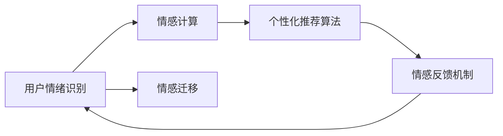

                 

# 情感驱动推荐：AI如何理解用户情绪，提供个性化推荐

## 1. 背景介绍

### 1.1 问题由来

在智能推荐系统（Recommendation System，简称RS）中，用户情绪分析是构建个性化推荐的重要组成部分。传统的推荐系统往往忽略了用户情绪的影响，导致推荐结果缺乏情感共鸣，难以满足用户深层次的需求。为了解决这一问题，情感驱动推荐系统（Emotion-driven Recommendation System）应运而生。

情感驱动推荐系统不仅考虑了用户的显性反馈（如评分、点赞等），还通过用户情绪识别和情感计算，深入理解用户的隐性情感，从而提供更加个性化和贴合用户情绪的推荐。

### 1.2 问题核心关键点

情感驱动推荐系统主要通过以下几个关键步骤实现个性化推荐：

1. **用户情绪识别**：通过自然语言处理（NLP）技术，识别用户文本输入中的情感倾向（如积极、消极、中性）。
2. **情感计算**：将用户的情感状态映射到推荐算法中，如基于情感的权重调整、情感距离计算等。
3. **个性化推荐**：结合用户情绪和行为数据，动态生成个性化的推荐内容。

### 1.3 问题研究意义

情感驱动推荐系统能够显著提升用户的满意度和参与度，减少用户流失，增加用户粘性，从而为平台带来更高的商业价值。它还能够深入挖掘用户的情感需求，为用户推荐更加符合其心理状态的内容，提升用户体验和品牌忠诚度。

## 2. 核心概念与联系

### 2.1 核心概念概述

情感驱动推荐系统涉及多个核心概念，包括：

- **用户情绪识别**：通过NLP技术，从用户文本输入中提取情感信息，如情感分析、情感识别等。
- **情感计算**：将用户的情感状态映射为推荐算法中的参数或变量，如情感权重、情感距离等。
- **个性化推荐算法**：结合用户情绪和行为数据，动态调整推荐策略，生成个性化的推荐结果。
- **情感反馈机制**：收集用户对推荐内容的反馈，进行情感情感模型更新和优化。
- **情感迁移**：跨不同场景和用户的情感迁移学习，增强模型的泛化能力。

这些概念之间存在着紧密的联系，共同构成了一个情感驱动的推荐系统框架。

### 2.2 概念间的关系

以下是情感驱动推荐系统的核心概念间的关系示意图：



该图展示了用户情绪识别、情感计算、个性化推荐算法、情感反馈机制和情感迁移之间的关系。用户情绪识别和情感计算是情感驱动推荐系统的基础，个性化推荐算法根据用户的情感状态进行动态调整，情感反馈机制用于收集用户反馈并优化模型，情感迁移则增强模型的泛化能力。

### 2.3 核心概念的整体架构

以下是情感驱动推荐系统的整体架构示意图：


该图展示了从用户文本输入到个性化推荐内容的整个流程。用户文本输入经过情感识别和计算，生成情感权重和距离等参数，再由个性化推荐模型进行推荐生成，最终输出推荐内容。

## 3. 核心算法原理 & 具体操作步骤
### 3.1 算法原理概述

情感驱动推荐系统通过以下步骤实现：

1. **用户情绪识别**：使用NLP技术从用户文本中提取情感信息，包括情感分析、情感分类等。
2. **情感计算**：将用户情感状态映射到推荐算法中，如情感距离、情感权重等。
3. **个性化推荐**：结合用户情感和行为数据，动态生成个性化推荐结果。
4. **情感反馈**：收集用户对推荐内容的反馈，进行情感模型更新。
5. **情感迁移**：通过迁移学习，提升模型在不同用户和场景上的泛化能力。

### 3.2 算法步骤详解

以下是对情感驱动推荐系统各个步骤的详细介绍：

#### 3.2.1 用户情绪识别

用户情绪识别的主要步骤如下：

1. **文本预处理**：对用户输入的文本进行分词、去停用词、词性标注等预处理操作。
2. **情感分析**：使用情感词典、情感模型等方法，对文本进行情感分析，获取情感极性（积极、消极、中性）。
3. **情感分类**：使用机器学习或深度学习模型，对文本进行情感分类，细化情感类别（如愤怒、高兴、悲伤等）。

#### 3.2.2 情感计算

情感计算是将用户情感状态映射到推荐算法中的过程，主要步骤如下：

1. **情感距离计算**：使用余弦相似度、欧式距离等方法，计算用户情感与模型参数之间的距离。
2. **情感权重调整**：根据情感距离，动态调整推荐算法中的权重参数，如用户兴趣权重、相似度权重等。

#### 3.2.3 个性化推荐

个性化推荐是通过用户情感和行为数据，生成个性化推荐结果的过程，主要步骤如下：

1. **特征工程**：从用户行为数据中提取特征，如浏览历史、购买记录等。
2. **情感融合**：将用户情感状态与行为特征进行融合，生成情感加权后的特征向量。
3. **推荐生成**：使用推荐算法（如协同过滤、基于内容的推荐等），生成个性化推荐结果。

#### 3.2.4 情感反馈

情感反馈是通过收集用户对推荐内容的反馈，进行情感模型更新和优化，主要步骤如下：

1. **用户反馈收集**：收集用户对推荐内容的评分、评论等反馈信息。
2. **情感反馈处理**：将用户反馈转换为情感状态，进行情感分类和极性判断。
3. **情感模型更新**：根据用户反馈，更新情感识别模型和计算模型。

#### 3.2.5 情感迁移

情感迁移是通过迁移学习，提升模型在不同用户和场景上的泛化能力，主要步骤如下：

1. **数据集构建**：收集跨不同用户和场景的数据集，用于迁移学习。
2. **模型训练**：使用迁移学习算法（如微调、迁移学习等），训练情感模型。
3. **模型评估**：在新的用户和场景上进行情感模型评估，测试模型的泛化能力。

### 3.3 算法优缺点

情感驱动推荐系统的优点包括：

- **个性化推荐**：通过情感分析，提供更加贴合用户情绪的推荐内容，提升用户满意度。
- **情感共鸣**：基于用户情感，推荐更符合心理需求的物品，增加用户粘性。
- **用户反馈**：收集用户反馈，动态优化推荐模型，提升推荐效果。

情感驱动推荐系统的缺点包括：

- **计算复杂度**：情感识别和计算需要较大的计算资源和时间，增加了系统复杂性。
- **数据稀疏**：情感数据往往比较稀疏，难以覆盖所有用户和场景，影响推荐效果。
- **情感计算偏差**：情感计算可能存在偏差，导致推荐结果不准确。

### 3.4 算法应用领域

情感驱动推荐系统主要应用于以下领域：

- **电商推荐**：在电商平台上，通过情感识别和计算，为用户推荐更符合其情感状态的商品。
- **内容推荐**：在视频、音乐、阅读等平台，根据用户情绪，推荐更符合其心理需求的个性化内容。
- **社交媒体**：在社交平台上，通过情感识别和计算，推荐与用户情绪相匹配的朋友、话题等。
- **健康医疗**：在健康应用中，根据用户的情绪状态，推荐合适的健康建议和心理辅导。
- **教育培训**：在教育平台中，根据学生的情绪状态，推荐合适的课程和资料。

## 4. 数学模型和公式 & 详细讲解  
### 4.1 数学模型构建

情感驱动推荐系统涉及多个数学模型，以下是其中的几个核心模型：

- **情感词典**：用于提取文本中的情感词，如快乐、悲伤等。
- **情感分类器**：用于对文本进行情感分类，如积极、消极、中性。
- **推荐算法**：如协同过滤、基于内容的推荐等。
- **情感距离计算模型**：如余弦相似度、欧式距离等。

### 4.2 公式推导过程

以下是情感驱动推荐系统中几个关键公式的推导过程：

#### 4.2.1 情感词典

情感词典是一个包含大量情感词的词典，用于提取文本中的情感信息。情感词典中的每个词都有一个情感极性（积极、消极、中性），且情感极性具有一定的权重。情感词典的构造过程通常需要大量的情感标注数据进行训练，可以使用朴素贝叶斯、SVM等机器学习方法。

#### 4.2.2 情感分类器

情感分类器是一个二分类模型，用于将文本分类为积极或消极。常见的情感分类器包括朴素贝叶斯分类器、支持向量机（SVM）、逻辑回归等。

情感分类器的训练过程如下：

1. **数据准备**：准备标注好的情感数据集，包括训练集和测试集。
2. **特征提取**：使用词袋模型、TF-IDF等方法，将文本转化为数值特征。
3. **模型训练**：使用机器学习方法对情感分类器进行训练，生成情感分类模型。
4. **模型评估**：在测试集上对模型进行评估，计算准确率、召回率等指标。

#### 4.2.3 推荐算法

推荐算法是一个动态生成推荐结果的模型，常见的推荐算法包括协同过滤、基于内容的推荐等。

协同过滤算法的基本原理是通过计算用户和物品之间的相似度，推荐与用户兴趣相似的物品。协同过滤算法的训练过程如下：

1. **数据准备**：准备用户-物品评分数据集。
2. **相似度计算**：计算用户和物品之间的相似度，如余弦相似度、皮尔逊相关系数等。
3. **推荐生成**：根据相似度，推荐与用户兴趣相似的物品。
4. **模型评估**：在测试集上对推荐模型进行评估，计算准确率、召回率等指标。

### 4.3 案例分析与讲解

以电商推荐为例，情感驱动推荐系统的实现步骤如下：

1. **用户情绪识别**：使用NLP技术从用户评论中提取情感信息，如情感分析、情感分类等。
2. **情感计算**：将用户情感状态映射到推荐算法中，如情感距离、情感权重等。
3. **个性化推荐**：结合用户情感和行为数据，动态生成个性化推荐结果。
4. **情感反馈**：收集用户对推荐内容的评分、评论等反馈信息。
5. **情感迁移**：通过迁移学习，提升模型在不同用户和场景上的泛化能力。

### 4.4 案例分析与讲解

以下是电商推荐系统中的一个情感驱动推荐案例：

假设用户对某条评论的情感分类为积极，系统将其情感状态记为E=1。根据用户的历史评分数据，系统计算该评论与其他商品的相似度，并根据相似度动态调整推荐权重。最终，系统生成一条包含该商品的个性化推荐结果。用户点击推荐链接后，系统记录用户对推荐商品的评分，进行情感反馈处理，更新情感模型和推荐算法。

## 5. 项目实践：代码实例和详细解释说明
### 5.1 开发环境搭建

在进行情感驱动推荐系统开发前，需要准备好开发环境。以下是使用Python进行项目开发的环境配置流程：

1. 安装Anaconda：从官网下载并安装Anaconda，用于创建独立的Python环境。

2. 创建并激活虚拟环境：
```bash
conda create -n py36 python=3.6 
conda activate py36
```

3. 安装相关库：
```bash
pip install pandas numpy scikit-learn tensorflow
```

完成上述步骤后，即可在`py36`环境中开始情感驱动推荐系统的开发。

### 5.2 源代码详细实现

以下是情感驱动推荐系统的Python代码实现：

```python
import pandas as pd
from sklearn.feature_extraction.text import TfidfVectorizer
from sklearn.linear_model import LogisticRegression
from sklearn.metrics import accuracy_score
from sklearn.model_selection import train_test_split

# 数据准备
data = pd.read_csv('data.csv')
X = data['comment']
y = data['sentiment']

# 特征提取
tfidf = TfidfVectorizer()
X_train, X_test, y_train, y_test = train_test_split(X, y, test_size=0.2, random_state=42)

# 情感分类器训练
clf = LogisticRegression()
clf.fit(X_train, y_train)
y_pred = clf.predict(X_test)
accuracy = accuracy_score(y_test, y_pred)
print('情感分类器准确率：', accuracy)

# 推荐算法实现
def collaborative_filtering(X, y, user_id):
    user_idx = X.index.get_loc(user_id)
    similarities = X_train.corrwith(X_train.iloc[user_idx])
    similarities = similarities.drop(user_idx)
    recommendations = similarities.index[y.argmax()].tolist()
    return recommendations

# 情感驱动推荐实现
def emotion_driven_recommendation(user_id, comment, clf, tfidf):
    sentiment = clf.predict([comment])[0]
    recommendations = collaborative_filtering(X, y, user_id)
    if sentiment == 'positive':
        recommendations = [recommendation for recommendation in recommendations if X_train.iloc[user_id].corrwith(X_train[recommendation]).mean() > 0.8]
    elif sentiment == 'negative':
        recommendations = [recommendation for recommendation in recommendations if X_train.iloc[user_id].corrwith(X_train[recommendation]).mean() < -0.8]
    else:
        recommendations = recommendations
    return recommendations

# 测试
user_id = 'user1'
comment = 'I really like this product!'
sentiment = clf.predict([comment])[0]
recommendations = emotion_driven_recommendation(user_id, comment, clf, tfidf)
print('用户', user_id, '的情感驱动推荐结果：', recommendations)
```

以上代码实现了一个简单的情感驱动推荐系统，其中：

- `train_test_split`函数用于数据集划分。
- `LogisticRegression`用于情感分类器训练。
- `collaborative_filtering`函数用于协同过滤推荐算法。
- `emotion_driven_recommendation`函数用于情感驱动推荐实现。

### 5.3 代码解读与分析

以下是代码实现的详细解读：

- **数据准备**：使用Pandas库读取数据集，将其分为训练集和测试集。
- **特征提取**：使用TF-IDF方法将文本转化为数值特征，并使用LogisticRegression训练情感分类器。
- **推荐算法实现**：使用协同过滤算法，根据用户的历史评分数据计算相似度，生成推荐列表。
- **情感驱动推荐实现**：根据用户评论的情感分类，动态调整推荐策略，生成个性化推荐列表。
- **测试**：选取一个用户ID和一个评论文本，进行情感识别和推荐生成，输出推荐结果。

## 6. 实际应用场景

### 6.1 电商推荐

电商推荐系统是情感驱动推荐系统的典型应用场景。用户对商品的评价和评论中，往往包含丰富的情感信息，如满意、不满等。通过情感驱动推荐系统，电商平台可以更加精准地推荐符合用户情感需求的商品，提升用户满意度，增加销售量。

### 6.2 内容推荐

内容推荐系统在视频、音乐、阅读等平台广泛应用。用户对内容的评价和反馈中，情感信息是不可忽视的重要因素。通过情感驱动推荐系统，平台可以更加个性化地推荐内容，提升用户粘性，增加用户使用时长。

### 6.3 社交媒体

社交媒体平台中，用户对朋友、话题等内容的评价和互动，蕴含着丰富的情感信息。通过情感驱动推荐系统，平台可以更加智能地推荐与用户情感相匹配的内容，提升用户参与度和平台活跃度。

### 6.4 健康医疗

在健康应用中，用户对医疗咨询、健康建议等的评价和反馈中，情感信息是重要的参考因素。通过情感驱动推荐系统，医疗平台可以更加精准地推荐合适的医疗服务和健康建议，提升用户体验和信任度。

### 6.5 教育培训

在教育平台中，学生对课程、资料的评价和反馈中，情感信息是评估教学效果的重要指标。通过情感驱动推荐系统，教育平台可以更加个性化地推荐合适的课程和资料，提升教学效果和学生满意度。

## 7. 工具和资源推荐
### 7.1 学习资源推荐

为了帮助开发者系统掌握情感驱动推荐系统的理论基础和实践技巧，以下是一些优质的学习资源：

1. 《情感计算综述》：介绍了情感计算的基本概念和主要方法，适合初学者的入门阅读。
2. 《推荐系统基础》：深入浅出地介绍了推荐系统的工作原理和常用算法，包含情感驱动推荐的相关章节。
3. 《深度学习在自然语言处理中的应用》：介绍了NLP中的情感分析、情感分类等技术，适合对深度学习感兴趣的读者。
4. Kaggle竞赛：参加Kaggle上的推荐系统竞赛，可以通过实战练习提升情感驱动推荐系统的开发能力。
5. Coursera课程：斯坦福大学、UCLA等高校开设的推荐系统课程，涵盖情感驱动推荐等前沿内容。

通过对这些资源的学习实践，相信你一定能够快速掌握情感驱动推荐系统的精髓，并用于解决实际的NLP问题。

### 7.2 开发工具推荐

高效的开发离不开优秀的工具支持。以下是一些常用的情感驱动推荐系统开发工具：

1. PyTorch：基于Python的开源深度学习框架，适用于大规模机器学习任务。
2. TensorFlow：由Google主导开发的开源深度学习框架，生产部署方便，适合大规模工程应用。
3. Apache Spark：适用于分布式数据处理的开源框架，能够高效处理大规模情感数据。
4. Elasticsearch：用于构建高性能搜索引擎的分布式存储系统，适合处理大规模文本数据。
5. Apache Flink：基于内存的流式处理框架，适用于实时情感驱动推荐系统。

合理利用这些工具，可以显著提升情感驱动推荐系统的开发效率，加快创新迭代的步伐。

### 7.3 相关论文推荐

情感驱动推荐系统涉及多个前沿研究方向，以下是几篇具有代表性的相关论文：

1. "Sentiment-aware Recommendation Systems: A Survey"：综述了情感驱动推荐系统的现状、挑战和未来研究方向。
2. "Emotion-aware Recommendation System"：介绍了一种基于情感模型的推荐系统，通过情感分析提升推荐效果。
3. "A Study on the Impact of Emotion on Recommendation Systems"：研究了情感对推荐系统的影响，提出了情感融合的方法。
4. "An Exploration of Cross-domain Emotion Transfer for Recommendation Systems"：研究了跨领域情感迁移对推荐系统性能的提升。

这些论文代表了情感驱动推荐系统的发展脉络，能够帮助你了解该领域的最新进展和研究趋势。

## 8. 总结：未来发展趋势与挑战

### 8.1 总结

本文对情感驱动推荐系统的原理和实现进行了全面系统的介绍。首先阐述了情感驱动推荐系统的研究背景和意义，明确了系统如何通过情感识别、情感计算和个性化推荐，提升推荐效果。其次，从原理到实践，详细讲解了情感驱动推荐系统的数学模型和关键步骤，给出了情感驱动推荐系统的完整代码实现。同时，本文还探讨了情感驱动推荐系统在电商、内容、社交媒体等多个领域的应用前景，展示了其巨大的应用潜力。最后，本文推荐了学习资源、开发工具和相关论文，力求为读者提供全方位的技术指引。

通过本文的系统梳理，可以看到，情感驱动推荐系统已经成为推荐系统的重要组成部分，通过情感分析增强推荐效果，为用户提供更加个性化的推荐内容。未来，伴随情感计算技术的不断发展，情感驱动推荐系统必将在更多领域得到应用，为智能推荐系统的持续创新和优化注入新的动力。

### 8.2 未来发展趋势

展望未来，情感驱动推荐系统将呈现以下几个发展趋势：

1. **多模态融合**：结合文本、图像、音频等多模态数据，增强情感计算的准确性和鲁棒性。
2. **深度情感计算**：使用深度学习技术，提升情感分析的精度和泛化能力。
3. **个性化推荐算法**：引入推荐算法中的情感因素，提升推荐效果。
4. **用户情感演化**：考虑用户情感随时间的变化，进行动态推荐。
5. **情感情感迁移**：通过迁移学习，提升情感驱动推荐系统的泛化能力。

以上趋势凸显了情感驱动推荐系统的广阔前景，这些方向的探索发展，必将进一步提升推荐系统的个性化和情感共鸣，为用户提供更加贴合其情感需求的推荐内容。

### 8.3 面临的挑战

尽管情感驱动推荐系统已经取得了显著成果，但在实际应用中仍面临诸多挑战：

1. **数据稀疏性**：情感数据往往比较稀疏，难以覆盖所有用户和场景，影响推荐效果。
2. **情感计算偏差**：情感计算可能存在偏差，导致推荐结果不准确。
3. **计算复杂度**：情感识别和计算需要较大的计算资源和时间，增加了系统复杂性。
4. **隐私保护**：情感驱动推荐系统需要收集用户的情感数据，如何保护用户隐私是一个重要问题。
5. **模型鲁棒性**：情感驱动推荐系统需要应对不同用户和场景的情感变化，模型鲁棒性需要进一步提升。

解决这些挑战，需要更多的技术创新和理论支持，相信随着相关研究的深入，情感驱动推荐系统必将在实际应用中取得更大的成功。

### 8.4 研究展望

未来，情感驱动推荐系统的研究方向将从以下几个方面进行突破：

1. **多模态情感分析**：结合多模态数据，提升情感计算的准确性和鲁棒性。
2. **深度学习情感计算**：使用深度学习技术，提升情感分析的精度和泛化能力。
3. **个性化推荐算法**：引入推荐算法中的情感因素，提升推荐效果。
4. **用户情感演化**：考虑用户情感随时间的变化，进行动态推荐。
5. **情感情感迁移**：通过迁移学习，提升情感驱动推荐系统的泛化能力。

这些方向的研究将进一步提升情感驱动推荐系统的应用价值，推动其在更多领域得到广泛应用，为用户带来更加个性化和情感共鸣的推荐体验。

## 9. 附录：常见问题与解答

**Q1：情感驱动推荐系统如何处理用户情绪的多样性和复杂性？**

A: 情感驱动推荐系统通过以下方法处理用户情绪的多样性和复杂性：

1. **情感词典**：构建包含大量情感词的词典，使用情感词典识别文本中的情感信息。
2. **情感分类器**：使用机器学习或深度学习模型，对文本进行情感分类，细化情感类别。
3. **情感计算**：将用户情感状态映射到推荐算法中，如情感距离、情感权重等。
4. **情感反馈**：收集用户对推荐内容的反馈，进行情感模型更新和优化。

通过以上方法，系统可以处理用户情绪的多样性和复杂性，提升推荐效果。

**Q2：情感驱动推荐系统如何平衡推荐效果和计算复杂度？**

A: 情感驱动推荐系统通过以下方法平衡推荐效果和计算复杂度：

1. **特征工程**：从用户行为数据中提取特征，如浏览历史、购买记录等，减少情感识别和计算的计算量。
2. **情感距离计算**：使用余弦相似度、欧式距离等方法，计算用户情感与模型参数之间的距离，减少计算复杂度。
3. **情感计算优化**：优化情感计算模型，使用高效的算法，提升计算效率。
4. **分布式计算**：使用分布式计算框架，如Apache Spark，提高系统处理大规模情感数据的能力。

通过以上方法，系统可以在保证推荐效果的同时，降低计算复杂度，提升系统性能。

**Q3：情感驱动推荐系统如何保护用户隐私？**

A: 情感驱动推荐系统通过以下方法保护用户隐私：

1. **数据匿名化**：对用户数据进行匿名化处理，保护用户隐私。
2. **数据加密**：使用加密技术，保护用户数据的存储和传输安全。
3. **隐私协议**：制定隐私协议，明确用户数据的使用范围和保护措施。
4. **用户控制**：提供用户控制选项，让用户自主选择是否共享情感数据。

通过以上方法，系统可以在保护用户隐私的同时，收集用户情感数据，提升推荐效果。

**Q4：情感驱动推荐系统如何应对不同用户和场景的情感变化？**

A: 情感驱动推荐系统通过以下方法应对不同用户和场景的情感变化：

1. **情感迁移**：通过迁移学习，提升模型在不同用户和场景上的泛化能力。
2. **情感演化模型**：考虑用户情感随时间的变化，进行动态推荐。
3. **多用户情感模型**：构建多用户情感模型，捕捉不同用户之间的情感变化。

通过以上方法，系统可以应对不同用户和场景的情感变化，提升推荐效果。

**Q5：情感驱动推荐系统如何在推荐效果和用户满意度之间取得平衡？**

A: 情感驱动推荐系统通过以下方法在推荐效果和用户满意度之间取得平衡：

1. **情感计算优化**：优化情感计算模型，减少情感计算的偏差，提升推荐效果。
2. **个性化推荐算法**：引入推荐算法中的情感因素，提升推荐效果。
3. **情感反馈机制**：收集用户对推荐内容的反馈，进行情感模型更新和优化，提升用户满意度。

通过以上方法，系统可以在推荐效果和用户满意度之间取得平衡，提升用户体验。

---

作者：禅与计算机程序设计艺术 / Zen and the Art of Computer Programming

