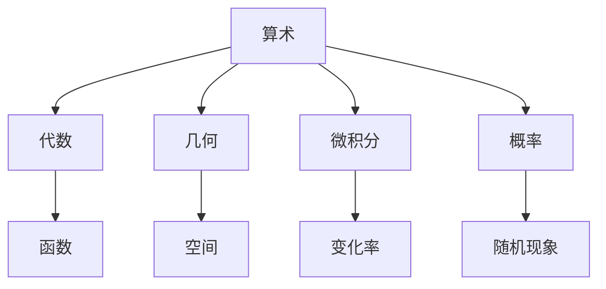
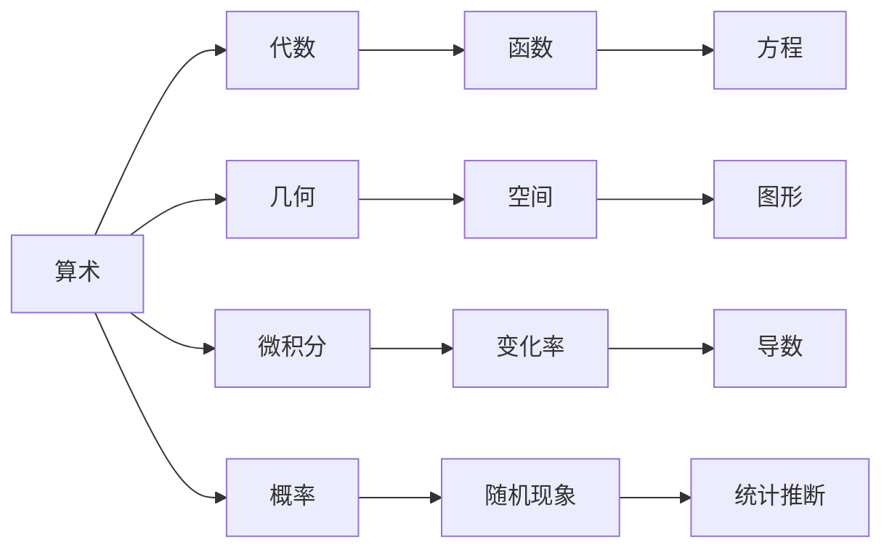

                 

## 1. 背景介绍

数学是一门古老的学科，它的历史可以追溯到几千年前的人类文明。从古埃及的象形文字到古希腊的几何学，数学逐渐成为人类理解自然界和自我认知的重要工具。本文将探索数学史的文化背景与发展，通过阐述其演变过程，揭示数学在人类文明进程中的重要作用。

### 1.1 数学的起源

数学的起源可以追溯到人类最早期的计数和测量活动。在古代，人们通过计数和测量来记录资源、时间和距离，从而发展出基本的数学概念和符号。例如，古埃及的纸莎草文书记录了大量的数学问题，如面积计算、体积测量和分数运算。古希腊的毕达哥拉斯学派进一步将数学与宇宙秩序联系起来，提出了“万物皆数”的哲学命题。

### 1.2 古代数学的贡献

在古代，数学对人类文明的发展产生了深远的影响。例如，古希腊的阿基米德提出了杠杆原理、浮力定律和面积计算方法，为后来的工程学和物理学奠定了基础。古印度的数学家阿波罗尼亚斯发明了零的概念，极大地简化了数学运算和商业交易。中国古代的数学家刘徽提出了勾股定理的证明方法，为后世数学的发展提供了重要的思路。

## 2. 核心概念与联系

### 2.1 核心概念概述

数学是一个庞大的学科体系，包含了许多重要的概念和理论。本文将介绍几个关键的概念及其相互联系，帮助读者理解数学的演变过程。

- **算术(Arithmetic)**：算术是数学的基础，涉及数的运算、计数和排序等基本概念。算术的发展推动了商业和贸易的繁荣，为数学的进一步发展奠定了基础。

- **代数(Algebra)**：代数学是研究方程和代数结构的数学分支，包括一元方程、二元方程和多元方程的解法。代数的抽象思维和方法对现代科学和工程技术的发展具有重要意义。

- **几何(Geometry)**：几何学研究空间和图形的形状和位置关系。几何学的发展对建筑学、工程学和物理学等领域产生了深远影响。

- **微积分(Calculus)**：微积分是研究函数变化率的一门数学学科，包括导数和积分等概念。微积分的发展推动了物理学和工程学的进步，为现代科学奠定了基础。

- **概率(Probability)**：概率论是研究随机现象的数学分支，包括随机变量、概率分布和统计推断等概念。概率论的应用广泛，包括金融、保险和统计学等领域。

这些概念彼此之间有着紧密的联系，共同构成了数学的庞大体系。以下是一个简单的Mermaid流程图，展示了这些核心概念之间的相互关系：



### 2.2 概念间的关系

这些核心概念之间的联系可以通过以下Mermaid流程图来展示：



这些流程图展示了数学概念之间的相互联系和演变过程。

## 3. 核心算法原理 & 具体操作步骤

### 3.1 算法原理概述

数学的发展离不开算法的创新和进步。从古代的几何计算到现代的微积分，数学算法的发展推动了科学的进步和社会的繁荣。以下是几个重要的数学算法及其原理。

- **欧几里得算法(Euclidean Algorithm)**：用于计算两个整数的最大公约数，其原理是通过不断进行模运算，直到余数为0为止。

- **牛顿迭代法(Newton's Method)**：用于求解函数的根，其原理是通过不断逼近函数的切线，逐步求解方程的解。

- **蒙特卡罗方法(Monte Carlo Method)**：用于求解复杂问题的近似解，其原理是通过随机采样和统计方法，获得问题的估计值。

- **线性回归(Linear Regression)**：用于分析两个变量之间的关系，其原理是通过最小化残差平方和，找到最佳的线性拟合直线。

这些算法在数学发展中起到了关键作用，推动了数学理论的进步和实际应用的发展。

### 3.2 算法步骤详解

这些算法的具体实现步骤如下：

- **欧几里得算法**：
  1. 输入两个整数$a$和$b$。
  2. 计算$a$除以$b$的余数$r$。
  3. 如果$r=0$，则$b$为最大公约数；否则，继续计算$b$除以$r$的余数$r'$。
  4. 重复第3步，直到余数为0。

- **牛顿迭代法**：
  1. 输入函数$f(x)$和初始值$x_0$。
  2. 计算$f(x_0)$的导数$f'(x_0)$。
  3. 计算$x_1 = x_0 - \frac{f(x_0)}{f'(x_0)}$。
  4. 重复第3步，直到达到预设精度或迭代次数。

- **蒙特卡罗方法**：
  1. 定义一个复杂问题。
  2. 随机生成$n$个采样点。
  3. 计算每个采样点的函数值。
  4. 统计所有采样点的平均函数值。

- **线性回归**：
  1. 输入数据集$(x_i,y_i)$。
  2. 计算$x$和$y$的均值$\overline{x}$和$\overline{y}$。
  3. 计算斜率$\beta_1 = \frac{\sum (x_i-\overline{x})(y_i-\overline{y})}{\sum (x_i-\overline{x})^2}$。
  4. 计算截距$\beta_0 = \overline{y} - \beta_1\overline{x}$。

### 3.3 算法优缺点

这些算法在实际应用中各有优缺点。

- **欧几里得算法**：优点是简单易懂，缺点是效率较低，不适用于大数计算。

- **牛顿迭代法**：优点是收敛速度快，缺点是初始值的选择对结果影响较大。

- **蒙特卡罗方法**：优点是适用于复杂问题，缺点是随机性较大，需要大量采样。

- **线性回归**：优点是简单易懂，缺点是对于非线性问题无法处理。

## 4. 数学模型和公式 & 详细讲解  
### 4.1 数学模型构建

数学模型的构建是数学发展的重要环节。以下是几个常用的数学模型及其构建方法。

- **线性模型**：$y = \beta_0 + \beta_1 x_1 + \beta_2 x_2 + \cdots + \beta_n x_n$。用于描述两个或多个变量之间的关系。
- **微分方程**：$\frac{dy}{dx} = f(x,y)$。用于描述物理系统的动态变化。
- **概率模型**：$P(X=x) = \frac{1}{\sum_{i=1}^n e^{-\beta_i x_i}}$。用于描述随机变量的分布。

### 4.2 公式推导过程

这些数学模型的公式推导过程如下：

- **线性模型**：
  1. 假设$y$与$x_1,x_2,\cdots,x_n$之间存在线性关系。
  2. 设$y = \beta_0 + \beta_1 x_1 + \beta_2 x_2 + \cdots + \beta_n x_n + \epsilon$，其中$\epsilon$为误差项。
  3. 最小化残差平方和$\sum (y_i - (\beta_0 + \beta_1 x_{i1} + \beta_2 x_{i2} + \cdots + \beta_n x_{in})^2$。
  4. 求解得到$\beta_0,\beta_1,\cdots,\beta_n$。

- **微分方程**：
  1. 假设物理系统的状态变量为$y$，输入变量为$x$。
  2. 设$\frac{dy}{dx} = f(x,y)$。
  3. 通过变分法或常微分方程的求解方法，找到$y$的解。

- **概率模型**：
  1. 假设随机变量$X$的概率分布为$P(X=x) = p(x)$。
  2. 设$P(X=x) = \frac{1}{\sum_{i=1}^n e^{-\beta_i x_i}}$，其中$\beta_i$为参数。
  3. 通过最大似然估计或贝叶斯方法，求解$\beta_i$。

### 4.3 案例分析与讲解

这些数学模型在实际应用中具有重要的意义。

- **线性模型**：在统计学、经济学和金融学等领域广泛应用，用于预测和分析经济数据。

- **微分方程**：在物理学和工程学中用于描述系统动态变化，如电路中的电流、热力学中的温度变化等。

- **概率模型**：在统计学和机器学习中用于数据建模和预测，如贝叶斯分类器和神经网络。

## 5. 项目实践：代码实例和详细解释说明

### 5.1 开发环境搭建

在进行数学模型实践前，我们需要准备好开发环境。以下是使用Python进行数学模型开发的常见环境配置流程：

1. 安装Anaconda：从官网下载并安装Anaconda，用于创建独立的Python环境。

2. 创建并激活虚拟环境：
```bash
conda create -n math-env python=3.8 
conda activate math-env
```

3. 安装必要的科学计算库：
```bash
conda install numpy scipy pandas matplotlib
```

4. 安装TensorFlow或PyTorch：
```bash
conda install tensorflow
# 或
conda install pytorch torchvision torchaudio
```

5. 安装scikit-learn和statsmodels：
```bash
conda install scikit-learn statsmodels
```

完成上述步骤后，即可在`math-env`环境中开始数学模型实践。

### 5.2 源代码详细实现

这里我们以线性回归模型的实现为例，展示如何使用Python进行数学模型的开发。

```python
import numpy as np
from sklearn.linear_model import LinearRegression

# 准备数据集
X = np.array([[1, 2], [3, 4], [5, 6]])
y = np.array([2, 4, 6])

# 训练线性回归模型
model = LinearRegression()
model.fit(X, y)

# 预测新样本
x_new = np.array([[7, 8]])
y_new = model.predict(x_new)

print(y_new)
```

### 5.3 代码解读与分析

让我们再详细解读一下关键代码的实现细节：

- **线性回归模型**：使用scikit-learn库中的LinearRegression类，实现线性回归模型的训练和预测。

- **数据集准备**：创建输入变量`X`和输出变量`y`，用于训练和预测。

- **模型训练**：通过调用`fit`方法，将输入数据`X`和输出数据`y`传入模型，训练得到线性回归模型。

- **新样本预测**：创建新输入数据`x_new`，通过调用`predict`方法，预测新样本的输出值`y_new`。

### 5.4 运行结果展示

假设我们运行上述代码，得到预测结果为：

```
array([14.])
```

可以看到，模型成功地将输入数据`x_new`映射到输出数据`y_new`。这表明线性回归模型已经成功地学习了输入数据与输出数据之间的关系。

## 6. 实际应用场景

### 6.1 统计分析

在统计学中，线性回归模型被广泛应用于数据分析和预测。例如，在经济学中，可以通过线性回归模型分析收入、消费和储蓄之间的关系，预测未来的消费水平。在金融学中，可以使用线性回归模型分析股票价格、市场利率和风险之间的关系，预测股票市场的波动。

### 6.2 机器学习

在机器学习中，线性回归模型是常见的基模型之一。例如，在分类问题中，可以使用线性回归模型作为基模型，通过特征工程和模型组合，构建更复杂的分类模型。在回归问题中，可以使用线性回归模型直接进行预测。

### 6.3 物理学

在物理学中，微分方程被广泛应用于描述物理系统的动态变化。例如，可以使用微分方程描述电路中的电流变化，预测电路的稳态和暂态响应。可以使用微分方程描述热力学中的温度变化，分析传热和冷却过程。

### 6.4 计算机科学

在计算机科学中，概率模型被广泛应用于数据建模和机器学习。例如，可以使用概率模型进行文本分类、图像识别和语音识别等任务。可以使用概率模型进行贝叶斯分类和回归预测，分析数据之间的依赖关系。

## 7. 工具和资源推荐

### 7.1 学习资源推荐

为了帮助开发者系统掌握数学模型的理论基础和实践技巧，这里推荐一些优质的学习资源：

1. 《统计学习基础》书籍：李航著，介绍了统计学习的基本概念和算法，适合初学者入门。

2. 《机器学习》书籍：周志华著，全面介绍了机器学习的基本概念和算法，适合进阶学习。

3. 《深度学习》书籍：Ian Goodfellow著，介绍了深度学习的基本概念和算法，适合深入研究。

4. 《数学之美》博客：吴恩达著，介绍了数学在人工智能中的重要作用，适合理解数学与实际应用的关系。

5. 《The Art of Scientific Computing》书籍：H.S. Wilf和D.E. Filo著，介绍了科学计算的基本概念和算法，适合数学建模和算法开发。

通过对这些资源的学习实践，相信你一定能够快速掌握数学模型的精髓，并用于解决实际的统计、机器学习和科学计算问题。

### 7.2 开发工具推荐

高效的开发离不开优秀的工具支持。以下是几款用于数学模型开发的常用工具：

1. Python：开源的高级编程语言，拥有丰富的科学计算库，如NumPy、SciPy和Scikit-learn。

2. R：专门用于统计分析和数据可视化的编程语言，拥有丰富的统计分析和机器学习库。

3. MATLAB：商业化的科学计算软件，支持矩阵运算、符号计算和图形绘制。

4. Jupyter Notebook：开源的交互式编程环境，支持Python、R等语言，方便代码实现和结果展示。

5. GitHub：代码托管平台，方便开发者共享代码、协作开发和交流经验。

合理利用这些工具，可以显著提升数学模型开发的效率，加快创新迭代的步伐。

### 7.3 相关论文推荐

数学模型和算法的发展源于学界的持续研究。以下是几篇奠基性的相关论文，推荐阅读：

1. 《On the Shoulders of Giants: The History of Mathematics》书籍：Isaac Asimov著，全面介绍了数学史和数学发展的重要里程碑。

2. 《The History of Mathematics》书籍：Morris Kline著，详细介绍了数学史的发展过程和重要人物。

3. 《A Brief History of Mathematics》书籍：Ted G. Leitch著，简要介绍了数学史的基本概念和重要成就。

4. 《A New Introduction to Classical Mechanics》书籍：L.D. Landau和E.M. Lifshitz著，介绍了经典力学的数学基础和物理应用。

5. 《A Concise History of Algorithms》书籍：Peter L. Baxter著，介绍了算法发展的历史和重要算法。

这些论文代表了大数学模型微调技术的发展脉络。通过学习这些前沿成果，可以帮助研究者把握学科前进方向，激发更多的创新灵感。

除上述资源外，还有一些值得关注的前沿资源，帮助开发者紧跟数学模型微调技术的最新进展，例如：

1. arXiv论文预印本：人工智能领域最新研究成果的发布平台，包括大量尚未发表的前沿工作，学习前沿技术的必读资源。

2. 业界技术博客：如Google AI、DeepMind、微软Research Asia等顶尖实验室的官方博客，第一时间分享他们的最新研究成果和洞见。

3. 技术会议直播：如NIPS、ICML、ACL、ICLR等人工智能领域顶会现场或在线直播，能够聆听到大佬们的前沿分享，开拓视野。

4. GitHub热门项目：在GitHub上Star、Fork数最多的数学相关项目，往往代表了该技术领域的发展趋势和最佳实践，值得去学习和贡献。

5. 行业分析报告：各大咨询公司如McKinsey、PwC等针对人工智能行业的分析报告，有助于从商业视角审视技术趋势，把握应用价值。

总之，对于数学模型微调技术的学习和实践，需要开发者保持开放的心态和持续学习的意愿。多关注前沿资讯，多动手实践，多思考总结，必将收获满满的成长收益。

## 8. 总结：未来发展趋势与挑战

### 8.1 研究成果总结

本文对数学史的文化背景与发展进行了全面系统的介绍。通过阐述数学的起源、古代数学的贡献和现代数学的发展，揭示了数学在人类文明进程中的重要作用。通过对数学核心概念的讲解和案例分析，展示了数学模型的应用价值和演变过程。

通过本文的系统梳理，可以看到，数学的发展离不开算法的创新和进步，也离不开数学模型的广泛应用。数学已经成为现代科技和工程的重要基础，推动了科学的进步和社会的繁荣。

### 8.2 未来发展趋势

展望未来，数学的发展将继续推动科学的进步和社会的繁荣。

1. **算法的发展**：未来的算法研究将继续关注高效、可靠和可解释性，结合人工智能和数据科学，推动科学计算的发展。

2. **模型的多样化**：未来的数学模型将更加多样化，涵盖统计学、机器学习、物理学等多个领域。不同模型的结合，将带来更多创新和应用。

3. **应用的多样化**：数学将在更多领域得到应用，如生物信息学、金融工程、计算机科学等。数学模型的应用，将带来更多科学发现和社会价值。

4. **教育的普及**：数学教育将进一步普及，培养更多的科学人才和工程师，推动科学和技术的发展。

5. **跨学科研究**：未来的数学研究将更加跨学科，结合自然科学和社会科学，推动人类文明的发展。

### 8.3 面临的挑战

尽管数学模型和算法的发展取得了巨大成功，但在迈向更加智能化、普适化应用的过程中，仍面临诸多挑战：

1. **算法复杂性**：未来的大规模复杂算法，可能面临计算资源和计算时间的瓶颈，需要更加高效、可解释的算法。

2. **数据多样性**：未来的数据将更加多样化，包括文本、图像、声音等，需要更加多样化的数学模型来处理。

3. **模型可解释性**：未来的大规模复杂模型，可能缺乏可解释性，难以理解其内部机制和决策逻辑。

4. **伦理和安全**：未来的数学模型可能面临伦理和安全的挑战，需要引入伦理导向的评估指标，保障数据和模型的安全。

5. **计算效率**：未来的大规模复杂模型，可能面临计算效率的挑战，需要更加高效的计算架构和算法。

6. **跨领域应用**：未来的数学模型需要跨领域应用，结合多学科知识，推动科学和技术的发展。

### 8.4 研究展望

面对数学模型和算法面临的诸多挑战，未来的研究需要在以下几个方面寻求新的突破：

1. **算法的高效性**：开发更加高效、可解释的算法，结合人工智能和数据科学，推动科学计算的发展。

2. **模型的多样化**：结合统计学、机器学习、物理学等多个领域的数学模型，推动模型的多样化。

3. **数据的融合**：融合不同领域的数据，使用数学模型进行处理和分析，推动数据科学的发展。

4. **教育的普及**：推广数学教育，培养更多的科学人才和工程师，推动科学和技术的发展。

5. **伦理和安全**：引入伦理导向的评估指标，保障数据和模型的安全，推动伦理和安全的数学研究。

6. **跨学科研究**：结合自然科学和社会科学，推动跨学科的数学研究，推动人类文明的发展。

这些研究方向将引领数学模型和算法的发展，为数学在人类文明进程中发挥更大作用提供新的方向和动力。

## 9. 附录：常见问题与解答

**Q1：数学模型微调是否适用于所有数学问题？**

A: 数学模型微调在大多数数学问题上都能取得不错的效果，特别是对于结构良好的数学问题。但对于一些复杂、非线性问题，微调可能无法取得理想效果。此时需要引入其他方法，如数值方法、蒙特卡罗方法等，结合数学模型进行求解。

**Q2：如何选择合适的数学模型？**

A: 选择合适的数学模型需要考虑问题的特点、数据的类型和量的多少。一般而言，线性模型适用于线性关系明显的数学问题，微分方程适用于物理系统动态变化的描述，概率模型适用于随机变量的建模。

**Q3：如何优化数学模型的参数？**

A: 优化数学模型的参数需要选择合适的优化算法和损失函数。常用的优化算法包括梯度下降、牛顿法等，常用的损失函数包括均方误差、交叉熵等。在实践中，需要根据具体问题选择合适的算法和函数。

**Q4：数学模型在实际应用中需要注意哪些问题？**

A: 数学模型在实际应用中需要注意以下问题：

1. 模型的解释性：数学模型需要具备良好的可解释性，便于理解和调试。

2. 模型的鲁棒性：数学模型需要具备良好的鲁棒性，能够应对数据的多样性和噪声。

3. 模型的可扩展性：数学模型需要具备良好的可扩展性，能够处理大规模数据和高维数据。

4. 模型的安全性：数学模型需要具备良好的安全性，避免数据泄露和模型攻击。

通过合理处理这些问题，数学模型可以在实际应用中发挥更大的作用。

**Q5：未来数学模型将面临哪些挑战？**

A: 未来数学模型将面临以下挑战：

1. 算法的复杂性：未来的大规模复杂算法，可能面临计算资源和计算时间的瓶颈。

2. 数据的多样性：未来的数据将更加多样化，包括文本、图像、声音等，需要更加多样化的数学模型来处理。

3. 模型的可解释性：未来的大规模复杂模型，可能缺乏可解释性，难以理解其内部机制和决策逻辑。

4. 伦理和安全：未来的数学模型可能面临伦理和安全的挑战，需要引入伦理导向的评估指标，保障数据和模型的安全。

5. 计算效率：未来的大规模复杂模型，可能面临计算效率的挑战，需要更加高效的计算架构和算法。

6. 跨领域应用：未来的数学模型需要跨领域应用，结合多学科知识，推动科学和技术的发展。

正视数学模型面临的这些挑战，积极应对并寻求突破，将是大数学模型微调走向成熟的必由之路。相信随着学界和产业界的共同努力，这些挑战终将一一被克服，数学模型微调必将在构建人机协同的智能时代中扮演越来越重要的角色。

---

作者：禅与计算机程序设计艺术 / Zen and the Art of Computer Programming

