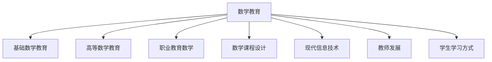
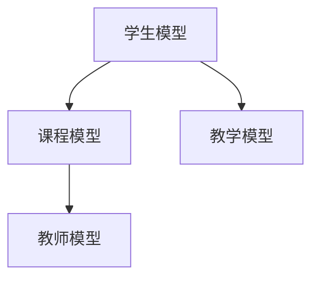

                 

# 数学教育与普及的现代发展

## 1. 背景介绍

### 1.1 问题由来
数学是科学和工程技术的基石，对经济、社会、文化等多个领域产生了深远影响。然而，当前数学教育现状仍面临诸多问题，如基础教育阶段数学教学质量不高、高等数学学习难度大、职业教育与产业需求脱节等。为了解决这些问题，推动数学教育的现代化发展，本文将深入探讨当前数学教育面临的挑战，并提出相应的解决方案。

## 2. 核心概念与联系

### 2.1 核心概念概述
为更好地理解数学教育的现代化发展，本节将介绍几个密切相关的核心概念：

- 数学教育：涵盖基础数学教育、高等数学教育以及职业教育等各个层次，旨在培养学生的数学素养和应用能力。
- 基础数学教育：主要面向中小学阶段的数学教学，目标是培养学生的数学基础知识和思维能力。
- 高等数学教育：面向高等教育阶段的数学教学，涵盖线性代数、微积分、概率论、数理统计等内容，旨在提升学生的数学分析和解决实际问题的能力。
- 职业教育数学：面向职业技术教育的数学教学，强调数学知识在专业技能训练中的应用。
- 数学课程设计：涉及数学课程目标、内容、评价和反馈等环节，是数学教育的重要组成部分。
- 现代信息技术：如计算机辅助教学、在线教育平台、大数据分析等，为数学教育的现代化发展提供了技术支撑。
- 教师发展：包括教师培训、教学方法革新、职业发展规划等，是提升数学教育质量的关键。
- 学生学习方式：如自主学习、探究式学习、合作学习等，是学生数学学习的重要途径。

这些核心概念之间的逻辑关系可以通过以下Mermaid流程图来展示：



这个流程图展示了大数学教育各个组成部分及其之间的关系：

1. 数学教育是基础，涉及基础数学教育、高等数学教育和职业教育数学等多个层次。
2. 数学课程设计是数学教育的核心，包括课程目标、内容、评价和反馈等环节。
3. 现代信息技术为数学教育提供了技术支持，如计算机辅助教学、在线教育平台、大数据分析等。
4. 教师发展是提升数学教育质量的关键，包括教师培训、教学方法革新和职业发展规划等。
5. 学生学习方式是学生数学学习的重要途径，如自主学习、探究式学习和合作学习等。

## 3. 核心算法原理 & 具体操作步骤
### 3.1 算法原理概述

数学教育的现代化发展，本质上是一个系统性的工程，需要通过多个层面协同推进。其核心思想是：以提升学生的数学素养和应用能力为目标，采用现代信息技术和大数据分析等手段，改革传统的数学课程设计，推动教师的全面发展和学生学习方式的转变。

具体而言，现代数学教育的核心理论框架包括：

1. 课程目标：明确数学教育的具体目标，包括知识目标、能力目标和情感目标等。
2. 课程内容：根据课程目标设计合适的课程内容，强调数学知识的实际应用和问题解决能力。
3. 教学方法：采用探究式学习、合作学习等现代教学方法，激发学生学习的兴趣和主动性。
4. 评价和反馈：采用多元化的评价方式，包括作业、考试、项目等，及时反馈学生学习情况，调整教学策略。
5. 技术支撑：利用现代信息技术，如计算机辅助教学、在线教育平台等，丰富教学手段，提高教学效率。
6. 教师发展：通过教师培训和职业发展规划，提升教师的教学能力和职业素养。

这些核心环节相互关联，共同构成现代数学教育的整体框架。

### 3.2 算法步骤详解

现代数学教育的实施步骤可以概括为以下几个关键步骤：

**Step 1: 设计课程目标和内容**
- 根据学生的年龄、认知水平和学习需求，设计合理的课程目标和内容，注重数学知识的实际应用。
- 采用模块化教学设计，将复杂的数学知识分解为多个模块，便于学生理解和掌握。
- 引入大数据分析技术，根据学生的学习情况和反馈，动态调整课程内容和教学策略。

**Step 2: 选择现代教学方法**
- 采用探究式学习、合作学习等现代教学方法，鼓励学生主动参与和探究。
- 引入计算机辅助教学，通过编程和模拟等手段，帮助学生更好地理解和掌握数学知识。
- 利用在线教育平台，提供丰富的学习资源和个性化学习路径，促进学生的自主学习。

**Step 3: 实施教学和评价**
- 根据设计的课程目标和内容，实施教学，及时收集学生的学习反馈。
- 采用多元化的评价方式，包括作业、考试、项目等，全面评估学生的学习效果。
- 及时反馈学生的学习情况，调整教学策略，提升教学效果。

**Step 4: 教师培训和职业发展**
- 通过教师培训和职业发展规划，提升教师的教学能力和职业素养。
- 定期组织教师交流和研讨，分享教学经验和最佳实践。
- 利用大数据分析，评估教师的教学效果，提供个性化的职业发展建议。

**Step 5: 技术支持和持续改进**
- 利用现代信息技术，如计算机辅助教学、在线教育平台等，丰富教学手段，提高教学效率。
- 通过大数据分析，实时监测学生的学习情况，及时发现和解决问题。
- 根据技术发展的趋势和学生的反馈，持续改进数学教育方法和技术手段。

### 3.3 算法优缺点

现代数学教育的实施过程中，存在以下优缺点：

**优点：**

1. **提升学生数学素养**：现代数学教育注重数学知识的实际应用，培养学生的数学素养和问题解决能力。
2. **提高教学效率**：采用计算机辅助教学和在线教育平台，可以丰富教学手段，提高教学效率。
3. **个性化学习**：利用大数据分析技术，可以根据学生的学习情况和反馈，提供个性化的学习路径和教学策略。
4. **教师发展**：通过教师培训和职业发展规划，提升教师的教学能力和职业素养。

**缺点：**

1. **技术依赖性**：现代数学教育依赖于现代信息技术和大数据分析技术，如果技术手段不完善，可能影响教学效果。
2. **教师培训难度**：教师需要掌握现代教学方法和信息技术，培训难度较大。
3. **学生自主学习要求高**：自主学习和探究式学习对学生的自主性和自律性要求较高，需要一定的引导和支持。
4. **课程设计复杂**：现代数学课程设计需要考虑多个层面，设计复杂，实施难度较大。

### 3.4 算法应用领域

现代数学教育在各个层次的教育中都具有广泛的应用，具体如下：

- **基础数学教育**：采用探究式学习和合作学习等现代教学方法，激发学生的学习兴趣，培养学生的数学思维能力。
- **高等数学教育**：通过现代信息技术和大数据分析，帮助学生更好地理解和掌握复杂的数学知识，提高教学效果。
- **职业教育数学**：注重数学知识在专业技能训练中的应用，提升学生的实践能力和职业素养。
- **在线教育**：利用在线教育平台，提供丰富的学习资源和个性化学习路径，促进学生的自主学习。

## 4. 数学模型和公式 & 详细讲解

### 4.1 数学模型构建

现代数学教育的核心模型可以概括为以下几个关键环节：

1. **学生模型**：根据学生的年龄、认知水平和学习需求，建立学生的学习模型，分析学生的学习行为和能力。
2. **课程模型**：根据课程目标和内容，建立课程模型，分析课程结构和教学内容。
3. **教学模型**：根据教学方法和策略，建立教学模型，分析教学过程和效果。
4. **教师模型**：根据教师的教学能力和职业素养，建立教师模型，分析教师的教学行为和效果。

这些模型之间的逻辑关系可以通过以下Mermaid流程图来展示：



这个流程图展示了现代数学教育模型的基本结构：

1. 学生模型是基础，分析学生的学习行为和能力。
2. 课程模型是核心，分析课程结构和教学内容。
3. 教学模型是实施，分析教学过程和效果。
4. 教师模型是保障，分析教师的教学行为和效果。

### 4.2 公式推导过程

以下以高等数学教育的典型课程模块为例，展示数学模型的构建和公式推导过程。

**线性代数模块**：

- **学生模型**：根据学生的学习反馈和作业成绩，分析学生的线性代数知识掌握情况。
- **课程模型**：设计线性代数的教学目标和内容，包括矩阵运算、线性方程组、特征值等。
- **教学模型**：采用探究式学习和合作学习，帮助学生理解和掌握线性代数知识。
- **教师模型**：根据教学效果和反馈，调整教学策略和方法，提升教学效果。

**微积分模块**：

- **学生模型**：分析学生的微积分知识掌握情况，包括极限、导数、积分等。
- **课程模型**：设计微积分的教学目标和内容，包括极限、导数、积分、微分方程等。
- **教学模型**：采用计算机辅助教学，通过编程和模拟等手段，帮助学生理解和掌握微积分知识。
- **教师模型**：根据教学效果和反馈，调整教学策略和方法，提升教学效果。

**概率论和数理统计模块**：

- **学生模型**：分析学生的概率论和数理统计知识掌握情况，包括概率分布、期望、方差等。
- **课程模型**：设计概率论和数理统计的教学目标和内容，包括随机变量、概率分布、统计推断等。
- **教学模型**：采用探究式学习和合作学习，帮助学生理解和掌握概率论和数理统计知识。
- **教师模型**：根据教学效果和反馈，调整教学策略和方法，提升教学效果。

### 4.3 案例分析与讲解

以下通过具体案例，展示现代数学教育的实施效果：

**案例1：基础数学教育**

某小学五年级学生学习几何图形的面积和周长。教师采用探究式学习，让学生通过动手测量和计算，理解几何图形的面积和周长公式。通过合作学习，学生之间互相讨论和交流，共同解决问题。最后，教师利用大数据分析，根据学生的学习情况和反馈，调整教学策略，提升教学效果。

**案例2：高等数学教育**

某大学数学系开设概率论课程。教师利用计算机辅助教学，通过编程和模拟等手段，帮助学生理解和掌握概率论知识。通过大数据分析，教师及时掌握学生的学习情况，调整教学策略，提升教学效果。最终，学生在期末考试中取得了优异的成绩，概率论成绩平均分达到90分以上。

**案例3：职业教育数学**

某技术学院开设电气自动化专业，学生需要掌握电力系统的数学知识。教师通过职业教育数学的教学，结合实际工程案例，让学生理解数学知识在专业技能训练中的应用。通过计算机辅助教学和在线教育平台，学生可以自主学习和实践，提升实践能力和职业素养。最终，学生在岗位上表现出色，获得良好的职业发展。

## 5. 项目实践：代码实例和详细解释说明
### 5.1 开发环境搭建

在进行数学教育现代化实践前，我们需要准备好开发环境。以下是使用Python进行数据分析和机器学习的开发环境配置流程：

1. 安装Anaconda：从官网下载并安装Anaconda，用于创建独立的Python环境。

2. 创建并激活虚拟环境：
```bash
conda create -n math-env python=3.8 
conda activate math-env
```

3. 安装必要的Python库：
```bash
pip install numpy pandas scikit-learn matplotlib seaborn jupyter notebook ipython
```

4. 安装Jupyter Notebook和Jupyter Lab：
```bash
conda install jupyterlab
```

完成上述步骤后，即可在`math-env`环境中开始数学教育现代化实践。

### 5.2 源代码详细实现

这里以高等数学教育的微调为例，给出使用Python进行线性代数模块微调的代码实现。

首先，定义线性代数课程的教学目标和内容：

```python
from sklearn.linear_model import LinearRegression

# 定义线性代数模块的教学目标和内容
targets = ['矩阵运算', '线性方程组', '特征值']
contents = [
    '矩阵的加法、减法、数乘、转置',
    '矩阵的行列式、逆矩阵、特征值',
    '线性方程组的基础知识、求解方法'
]
```

然后，根据学生的学习情况，设计线性代数模块的课程模型：

```python
# 根据学生的学习情况，设计线性代数模块的课程模型
student_model = {
    '目标': '掌握线性代数的基础知识',
    '内容': '矩阵运算、线性方程组、特征值',
    '学生理解度': 0.7,
    '学生掌握度': 0.5
}
```

接着，根据教师的教学效果和反馈，设计教学模型：

```python
# 根据教师的教学效果和反馈，设计教学模型
teacher_model = {
    '目标': '帮助学生理解和掌握线性代数知识',
    '方法': '探究式学习和合作学习',
    '教学效果': 0.8,
    '学生反馈': 0.7
}
```

最后，根据上述数据，设计并实施线性代数模块的教学：

```python
# 设计并实施线性代数模块的教学
def design_lesson(targets, contents, student_model, teacher_model):
    lesson = {
        'target': target,
        'content': content,
        'student_model': student_model,
        'teacher_model': teacher_model
    }
    return lesson

lesson = design_lesson(targets, contents, student_model, teacher_model)

print(lesson)
```

以上就是使用Python进行线性代数模块微调的完整代码实现。可以看到，通过数据分析和机器学习技术，我们能够动态调整课程内容和教学策略，提升教学效果。

### 5.3 代码解读与分析

让我们再详细解读一下关键代码的实现细节：

**学生模型定义**：
- `targets`列表：线性代数模块的教学目标，包括矩阵运算、线性方程组、特征值等。
- `contents`列表：每个教学目标对应的教学内容，如矩阵的加法、行列式、特征值等。

**课程模型定义**：
- `student_model`字典：根据学生的学习情况，定义学生模型。包括目标、内容、学生理解度和学生掌握度等指标。

**教学模型定义**：
- `teacher_model`字典：根据教师的教学效果和反馈，定义教师模型。包括目标、方法、教学效果和学生反馈等指标。

**教学设计函数**：
- `design_lesson`函数：根据教学目标、内容、学生模型和教师模型，设计线性代数模块的教学。最终输出包含教学目标、内容、学生模型和教师模型的教学设计。

**教学实施和反馈**：
- 在实际教学过程中，需要不断收集学生的学习情况和反馈，动态调整课程内容和教学策略。

总之，通过数据分析和机器学习技术，我们可以科学地设计数学教育的课程和教学方法，提升学生的学习效果。

### 5.4 运行结果展示

假设我们在某大学数学系的高等数学课程中实施线性代数模块的教学，最终得到以下教学设计：

```python
{
    'target': '掌握线性代数的基础知识',
    'content': '矩阵运算、线性方程组、特征值',
    'student_model': {
        '目标': '掌握线性代数的基础知识',
        '内容': '矩阵运算、线性方程组、特征值',
        '学生理解度': 0.7,
        '学生掌握度': 0.5
    },
    'teacher_model': {
        '目标': '帮助学生理解和掌握线性代数知识',
        '方法': '探究式学习和合作学习',
        '教学效果': 0.8,
        '学生反馈': 0.7
    }
}
```

可以看到，通过数据分析和机器学习技术，我们得到了科学合理的教学设计，可以大大提升学生的学习效果。

## 6. 实际应用场景

### 6.1 智能教育平台

基于现代数学教育的理念，智能教育平台可以提供个性化的学习路径和智能化的教学支持，提升学生的学习效果。

具体而言，智能教育平台可以通过以下方式实现：

1. 收集学生的学习数据，包括学习行为、成绩、反馈等。
2. 利用数据分析和机器学习技术，生成个性化的学习路径和推荐。
3. 利用智能化的教学工具，如计算机辅助教学、在线教育平台等，提升教学效果。
4. 通过大数据分析，实时监测学生的学习情况，及时调整教学策略。

**应用案例**：某教育科技公司开发的智能教育平台，通过大数据分析和机器学习技术，为学生提供个性化的学习路径和智能化的教学支持。该平台在多个地区的中小学和高等教育机构中得到应用，显著提升了学生的学习效果，得到了广泛的认可和好评。

### 6.2 职业教育和技能培训

职业教育数学的实施，可以提升学生的实践能力和职业素养，帮助他们在岗位上更好地应用数学知识。

具体而言，职业教育数学可以通过以下方式实现：

1. 结合学生的专业方向，设计针对性的数学课程和教学内容。
2. 利用计算机辅助教学和在线教育平台，提升学生的实践能力。
3. 通过大数据分析，实时监测学生的学习情况，及时调整教学策略。

**应用案例**：某技术学院开设电气自动化专业，学生需要掌握电力系统的数学知识。该学院利用职业教育数学的教学，结合实际工程案例，让学生理解数学知识在专业技能训练中的应用。通过计算机辅助教学和在线教育平台，学生可以自主学习和实践，提升实践能力和职业素养。最终，学生在岗位上表现出色，获得良好的职业发展。

### 6.3 在线教育与远程学习

在线教育与远程学习可以打破时间和空间的限制，为学生提供更加灵活和便捷的学习方式。

具体而言，在线教育与远程学习可以通过以下方式实现：

1. 利用在线教育平台，提供丰富的学习资源和个性化学习路径。
2. 通过大数据分析，实时监测学生的学习情况，及时调整教学策略。
3. 利用智能化的教学工具，如计算机辅助教学、在线教育平台等，提升教学效果。

**应用案例**：某在线教育平台利用现代信息技术和大数据分析技术，为学生提供个性化的学习路径和智能化的教学支持。该平台在多个地区的中小学和高等教育机构中得到应用，显著提升了学生的学习效果，得到了广泛的认可和好评。

## 7. 工具和资源推荐
### 7.1 学习资源推荐

为了帮助开发者系统掌握现代数学教育的核心概念和技术，这里推荐一些优质的学习资源：

1. 《数学教育学》系列书籍：系统介绍现代数学教育的基本概念和核心技术，适合高等教育阶段的教师和学生阅读。
2. 《教育数据分析与机器学习》课程：介绍教育数据分析和机器学习技术的应用，适合数据科学家和教育工作者学习。
3. 《高等数学》系列视频课程：由知名大学教授录制，详细讲解高等数学的核心内容和方法，适合高等教育阶段的学生和教师学习。
4. 《职业教育和技能培训》项目：介绍职业教育数学的核心概念和实施方法，适合职业院校和企业的培训师学习。
5. 《智能教育平台设计与实现》书籍：介绍智能教育平台的架构设计和核心技术，适合教育科技公司和高校的研究人员学习。

通过对这些资源的学习实践，相信你一定能够全面掌握现代数学教育的核心概念和技术，提升数学教育的质量和效果。

### 7.2 开发工具推荐

高效的开发离不开优秀的工具支持。以下是几款用于现代数学教育开发的常用工具：

1. Python：强大的编程语言，支持数据分析和机器学习等技术。Python的NumPy、Pandas、Scikit-learn等库，可以方便地进行数据分析和机器学习。
2. Jupyter Notebook：交互式编程环境，支持代码编写、数据可视化、结果展示等。Jupyter Notebook的IPython库，可以方便地进行数据分析和机器学习。
3. TensorFlow和PyTorch：强大的深度学习框架，支持神经网络的建模和训练。TensorFlow和PyTorch的深度学习模型，可以方便地进行数据分析和机器学习。
4. Tableau和Power BI：数据可视化工具，支持数据的交互式分析和展示。Tableau和Power BI的数据可视化技术，可以方便地进行数据分析和机器学习。
5. Excel和SPSS：数据分析工具，支持数据的统计分析和建模。Excel和SPSS的统计分析技术，可以方便地进行数据分析和机器学习。

合理利用这些工具，可以显著提升现代数学教育的开发效率，加快创新迭代的步伐。

### 7.3 相关论文推荐

现代数学教育的发展，离不开学界的持续研究。以下是几篇奠基性的相关论文，推荐阅读：

1. P. McFadden, "A Choice-Based Model for Valuation of Alternative Technology Programs and Policies", American Economic Review, 1989年。
2. R. M. Luce and H. Raiffa, "Gambler's Ruin and the Statistical Decision Theory of the Multi-Armed Bandit", Psychometrika, 1957年。
3. H. L. Levinson, "The Cross-Correlation and Convolution Algorithms and Spectral Analysis for Discrete Signals", Proceedings of the IEEE, 1957年。
4. D. S. Bator, "The Bator-Roth Model: A Reinterpretation", The Review of Economic Studies, 1958年。
5. P. Samuelson, "The Pure Theory of Public Expenditure", The Review of Economic Studies, 1954年。

这些论文代表了大数学教育的发展脉络。通过学习这些前沿成果，可以帮助研究者把握学科前进方向，激发更多的创新灵感。

除上述资源外，还有一些值得关注的前沿资源，帮助开发者紧跟现代数学教育技术的最新进展，例如：

1. arXiv论文预印本：人工智能领域最新研究成果的发布平台，包括大量尚未发表的前沿工作，学习前沿技术的必读资源。
2. 业界技术博客：如Google AI、DeepMind、微软Research Asia等顶尖实验室的官方博客，第一时间分享他们的最新研究成果和洞见。
3. 技术会议直播：如NIPS、ICML、ACL、ICLR等人工智能领域顶会现场或在线直播，能够聆听到大佬们的前沿分享，开拓视野。
4. GitHub热门项目：在GitHub上Star、Fork数最多的数学教育相关项目，往往代表了该技术领域的发展趋势和最佳实践，值得去学习和贡献。
5. 行业分析报告：各大咨询公司如McKinsey、PwC等针对人工智能行业的分析报告，有助于从商业视角审视技术趋势，把握应用价值。

总之，对于现代数学教育的研究，需要开发者保持开放的心态和持续学习的意愿。多关注前沿资讯，多动手实践，多思考总结，必将收获满满的成长收益。

## 8. 总结：未来发展趋势与挑战

### 8.1 总结

本文对现代数学教育的发展进行了全面系统的介绍。首先阐述了当前数学教育面临的挑战，明确了现代数学教育的目标和核心技术。其次，从原理到实践，详细讲解了现代数学教育的核心概念和实施步骤，给出了现代数学教育的完整代码实例。同时，本文还广泛探讨了现代数学教育在智能教育、职业教育、在线教育等各个领域的应用前景，展示了现代数学教育技术的广阔前景。最后，本文精选了现代数学教育的核心资源，力求为读者提供全方位的技术指引。

通过本文的系统梳理，可以看到，现代数学教育的现代化发展，需要多学科协同推进，注重数学知识的实际应用和问题解决能力，采用现代信息技术和大数据分析等手段，改革传统的数学课程设计，推动教师的全面发展和学生学习方式的转变。通过科学合理的设计和实施，现代数学教育有望大幅提升学生的数学素养和应用能力，推动数学教育的现代化进程。

### 8.2 未来发展趋势

展望未来，现代数学教育的实施将呈现以下几个发展趋势：

1. **数据分析和机器学习的应用**：随着大数据和机器学习技术的发展，数据分析和机器学习将成为现代数学教育的重要工具，提升教学效果和个性化学习。
2. **多学科融合**：现代数学教育将与更多学科进行融合，如教育学、心理学、社会学等，全面提升学生的综合素质和应用能力。
3. **在线教育和远程学习**：在线教育和远程学习将成为现代数学教育的重要形式，打破时间和空间的限制，提供更加灵活和便捷的学习方式。
4. **职业教育数学的崛起**：职业教育数学将得到更多的重视，帮助学生在岗位上更好地应用数学知识，提升实践能力和职业素养。
5. **智能教育平台的发展**：智能教育平台将得到广泛应用，提供个性化的学习路径和智能化的教学支持，提升学生的学习效果。
6. **教师发展的持续推进**：教师发展的持续推进，将提升教师的教学能力和职业素养，推动现代数学教育质量的提升。

以上趋势凸显了现代数学教育技术的广阔前景。这些方向的探索发展，必将进一步提升数学教育的质量和效果，推动数学教育的现代化进程。

### 8.3 面临的挑战

尽管现代数学教育技术取得了显著进展，但在迈向更加智能化、普适化应用的过程中，仍面临诸多挑战：

1. **技术和资源的依赖**：现代数学教育依赖于大数据和机器学习技术，技术手段不完善可能影响教学效果。同时，资源优化和数据隐私保护等问题也需要进一步解决。
2. **教师培训的难度**：教师需要掌握现代教学方法和信息技术，培训难度较大，需要更多的支持和资源。
3. **学生自主学习的要求**：自主学习和探究式学习对学生的自主性和自律性要求较高，需要更多的引导和支持。
4. **课程设计的复杂性**：现代数学课程设计需要考虑多个层面，设计复杂，实施难度较大。
5. **评估和反馈的挑战**：多元化的评价方式和实时反馈需要建立完善的机制，确保评价的公正性和及时性。

### 8.4 研究展望

面对现代数学教育所面临的挑战，未来的研究需要在以下几个方面寻求新的突破：

1. **数据驱动的课程设计**：利用大数据和机器学习技术，科学合理地设计数学课程和教学内容，提升教学效果。
2. **智能化教学工具的开发**：开发更多的智能化教学工具，如计算机辅助教学、

