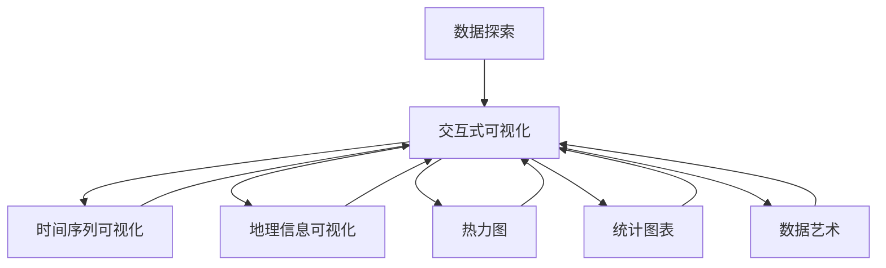

                 

# 数据可视化 原理与代码实例讲解

> 关键词：数据可视化, 数据探索, 交互式可视化, 时间序列, 地理信息可视化, 热力图, 统计图表, 数据艺术

## 1. 背景介绍

数据可视化是一种以图形方式呈现数据的技术，可以帮助我们更直观地理解数据。通过数据可视化，可以发现数据背后的模式、趋势和异常，从而更好地进行数据探索和分析。在人工智能领域，数据可视化不仅是数据分析师和科学家的必备技能，也成为了机器学习工程师和数据科学家必不可少的工具之一。

随着大数据和人工智能技术的发展，数据量和数据类型不断增加，数据可视化也变得更加重要。如何高效、准确、美观地呈现数据，成为了研究热点。本文将详细讲解数据可视化的原理，并通过具体的代码实例，展示如何使用Python中的Matplotlib和Seaborn库，实现常见的数据可视化。

## 2. 核心概念与联系

### 2.1 核心概念概述

数据可视化涉及多个核心概念，包括：

- 数据探索（Data Exploration）：通过可视化的方式，探索数据的分布、结构、异常等信息。
- 交互式可视化（Interactive Visualization）：通过交互式界面，使用户能够动态地探索数据。
- 时间序列可视化（Time Series Visualization）：以时间序列数据为输入，展示数据随时间的变化趋势。
- 地理信息可视化（Geographical Visualization）：将地理空间信息与数据结合，展示空间分布特征。
- 热力图（Heatmap）：通过颜色变化，展示数据在二维平面上的分布情况。
- 统计图表（Statistical Chart）：展示数据的基本统计特征，如平均值、标准差等。
- 数据艺术（Data Art）：通过创意和艺术手法，以美的形式展示数据。

这些概念通过以下Mermaid流程图展示了相互之间的关系：



这些核心概念共同构成了数据可视化的完整生态系统，使我们可以从多个角度理解数据，并以不同的形式展示数据。

### 2.2 概念间的关系

这些概念之间的联系主要体现在两个方面：

1. 技术基础：数据探索、交互式可视化、时间序列可视化等概念，都基于统计学和图形学的基本原理，如分布图、散点图、折线图等。
2. 应用场景：不同类型的数据可以通过不同的方法进行可视化，如地理数据可以通过地图展示，时间序列数据可以通过折线图展示，统计数据可以通过柱状图展示等。

## 3. 核心算法原理 & 具体操作步骤

### 3.1 算法原理概述

数据可视化的核心算法原理包括：

- 统计分析：对数据进行描述性统计分析，找出数据的分布、趋势、异常等信息。
- 图形绘制：将统计分析结果转化为图形，如折线图、散点图、柱状图等。
- 交互设计：设计交互式界面，使用户能够动态地探索数据。
- 动态更新：根据用户的操作，动态更新图形内容。

这些算法原理通过以下Mermaid流程图展示了数据可视化的整体流程：


### 3.2 算法步骤详解

数据可视化的具体操作步骤包括：

1. 数据收集：收集需要可视化的数据，包括原始数据和计算得到的统计结果。
2. 数据预处理：对数据进行清洗、归一化、标准化等处理，以便更好地展示。
3. 选择可视化类型：根据数据类型和展示目的，选择合适的可视化类型，如折线图、散点图、柱状图等。
4. 数据绘制：使用可视化库（如Matplotlib、Seaborn、D3.js等）绘制图形。
5. 交互设计：设计交互式界面，允许用户对图形进行缩放、旋转、拖拽等操作。
6. 动态更新：根据用户的操作，动态更新图形内容，如动态更新数据、动态改变颜色等。

### 3.3 算法优缺点

数据可视化的优点包括：

- 直观性：图形化的展示方式使得数据更直观、易懂。
- 交互性：交互式界面可以动态展示数据，帮助用户更好地理解数据。
- 发现异常：通过可视化可以发现数据中的异常值和趋势。

数据可视化的缺点包括：

- 数据量限制：可视化图形的复杂度往往受到数据量的限制，需要合理选择展示的数据。
- 展示空间限制：图形展示需要一定的空间，对于大屏幕或者多个屏幕，需要合理布局。
- 数据表达能力限制：图形只能展示部分数据特征，不能完整表达所有数据信息。

### 3.4 算法应用领域

数据可视化广泛应用于多个领域，包括：

- 数据科学：在数据分析、数据挖掘等任务中，通过可视化帮助科学家更好地理解数据。
- 商业智能：在商业决策、市场分析等任务中，通过可视化帮助企业更好地理解市场趋势。
- 医学研究：在医学图像分析、病人数据可视化等任务中，通过可视化帮助医生更好地理解病人数据。
- 环境监测：在环境数据监测、气候变化分析等任务中，通过可视化帮助环保部门更好地理解环境数据。
- 社会研究：在社会调查、社会网络分析等任务中，通过可视化帮助社会学家更好地理解社会现象。

## 4. 数学模型和公式 & 详细讲解 & 举例说明

### 4.1 数学模型构建

数据可视化的数学模型包括：

- 统计描述：如均值、中位数、标准差、分布密度等。
- 图形描述：如折线图、散点图、柱状图等。
- 交互描述：如鼠标悬停提示、选中高亮等。

### 4.2 公式推导过程

以折线图为例，其数学模型包括：

- 横轴表示时间，纵轴表示数值。
- 横轴和纵轴的刻度单位根据数据范围自动调整。
- 数据点以点或连线形式表示，其中点的大小、颜色等可以根据需求进行调整。

### 4.3 案例分析与讲解

以下以时间序列数据为例，展示如何使用Matplotlib绘制折线图：

```python
import matplotlib.pyplot as plt
import numpy as np

# 创建时间序列数据
x = np.arange(0, 10, 0.1)
y = np.sin(x)

# 绘制折线图
plt.plot(x, y)

# 添加标题和标签
plt.title('Sine Wave')
plt.xlabel('X-axis')
plt.ylabel('Y-axis')

# 显示图形
plt.show()
```

运行上述代码，将生成一张简单的折线图，展示正弦波的变化趋势。

## 5. 项目实践：代码实例和详细解释说明

### 5.1 开发环境搭建

要进行数据可视化，需要安装Python环境及相关库。

1. 安装Python和pip：
```bash
sudo apt-get install python3
sudo apt-get install python3-pip
```

2. 安装Matplotlib和Seaborn库：
```bash
pip install matplotlib seaborn
```

### 5.2 源代码详细实现

以下是一个使用Matplotlib和Seaborn库绘制热力图的示例代码：

```python
import numpy as np
import matplotlib.pyplot as plt
import seaborn as sns

# 创建随机矩阵
data = np.random.rand(5, 5)

# 绘制热力图
plt.figure(figsize=(8, 6))
sns.heatmap(data, annot=True, fmt='.2f', cmap='YlGnBu', vmin=0, vmax=1, xticklabels=['A', 'B', 'C', 'D', 'E'], yticklabels=['F', 'G', 'H', 'I', 'J'])
plt.title('Heatmap Example')
plt.show()
```

运行上述代码，将生成一张热力图，展示随机矩阵中的数据分布情况。

### 5.3 代码解读与分析

- `numpy`库用于创建随机矩阵。
- `matplotlib.pyplot`库用于绘制图形，并通过`seaborn`库绘制热力图。
- `heatmap`函数用于绘制热力图，`data`参数为输入数据，`annot`参数用于是否展示数据标签，`fmt`参数用于标签格式，`cmap`参数用于颜色映射，`vmin`和`vmax`参数用于设置颜色映射的范围。
- `xticklabels`和`yticklabels`参数用于设置坐标轴标签。
- `title`函数用于添加图形标题。

### 5.4 运行结果展示

运行上述代码，将生成一张热力图，展示了随机矩阵中的数据分布情况。


## 6. 实际应用场景

### 6.1 金融数据分析

金融分析师可以使用数据可视化工具，绘制股票价格走势图、市场指数变化图等，帮助其更好地理解市场趋势，做出投资决策。

### 6.2 医疗数据分析

医疗专家可以使用数据可视化工具，绘制病人病情变化图、实验室检测结果图等，帮助其更好地理解病人病情，制定治疗方案。

### 6.3 环境数据分析

环保部门可以使用数据可视化工具，绘制空气质量变化图、水污染指数变化图等，帮助其更好地理解环境变化趋势，制定环境保护政策。

### 6.4 社交数据分析

社交学家可以使用数据可视化工具，绘制社交网络关系图、用户行为分布图等，帮助其更好地理解社交现象，进行社会研究。

## 7. 工具和资源推荐

### 7.1 学习资源推荐

- 《Python数据科学手册》：全面介绍了Python在数据科学中的应用，包括数据可视化。
- 《数据可视化之美》：通过大量案例展示了数据可视化的艺术之美，推荐阅读。
- 《Python可视化库Matplotlib实战》：详细讲解了Matplotlib库的使用，适合初学者入门。
- 《Python可视化库Seaborn实战》：详细讲解了Seaborn库的使用，适合进一步提升可视化能力。

### 7.2 开发工具推荐

- Jupyter Notebook：开源的交互式编程环境，支持Python等语言的开发。
- Anaconda：Python环境管理工具，方便创建和管理Python环境。
- PyCharm：Python开发工具，支持代码编写、调试、测试等功能。

### 7.3 相关论文推荐

- 《数据可视化：数据探索与信息表达》：介绍了数据可视化的基本概念和技术。
- 《交互式数据可视化技术》：介绍了交互式数据可视化的基本原理和应用。
- 《时间序列数据可视化》：介绍了时间序列数据可视化的基本方法。
- 《地理数据可视化》：介绍了地理数据可视化的基本方法。

## 8. 总结：未来发展趋势与挑战

### 8.1 研究成果总结

数据可视化技术已经取得了很大的进展，在多个领域得到了广泛应用。未来，随着人工智能技术的发展，数据可视化的应用将更加深入，帮助人们更好地理解数据，做出更好的决策。

### 8.2 未来发展趋势

- 自适应数据可视化：根据用户需求，动态调整图形类型、大小、颜色等，提升用户体验。
- 交互式可视化：通过交互式界面，使用户能够动态地探索数据，帮助用户更好地理解数据。
- 三维可视化：使用三维图形展示数据，提升数据可视化效果。
- 增强现实可视化：结合虚拟现实技术，展示数据在虚拟世界中的分布。

### 8.3 面临的挑战

- 数据量过大：数据量过大，无法在屏幕上完整展示，需要选择合适的展示方式。
- 数据类型复杂：数据类型复杂多样，需要选择合适的可视化方式。
- 数据分布不均：数据分布不均，需要选择合适的数据分割方式。

### 8.4 研究展望

未来的研究需要关注以下几个方面：

- 大数据可视化：研究如何处理大规模数据集，选择合适的展示方式。
- 多维数据可视化：研究如何处理高维数据集，选择合适的展示方式。
- 多变量数据可视化：研究如何处理多变量数据集，选择合适的展示方式。
- 数据可视化算法：研究新的数据可视化算法，提升可视化效果。

## 9. 附录：常见问题与解答

**Q1：数据可视化有哪些常用工具？**

A: 数据可视化常用的工具包括：

- Matplotlib：Python中最常用的可视化库，支持绘制多种类型的图形。
- Seaborn：基于Matplotlib，提供了更高级别的接口，适合绘制统计图表。
- Plotly：支持交互式可视化，适合绘制动态图形。
- Tableau：商业化的可视化工具，支持多种数据源和可视化方式。

**Q2：数据可视化有哪些基本步骤？**

A: 数据可视化的基本步骤如下：

1. 数据收集和预处理：收集需要可视化的数据，进行清洗和归一化处理。
2. 选择合适的可视化类型：根据数据类型和展示目的，选择合适的可视化类型，如折线图、散点图、柱状图等。
3. 数据绘制：使用可视化库绘制图形。
4. 交互设计：设计交互式界面，允许用户对图形进行缩放、旋转、拖拽等操作。
5. 动态更新：根据用户的操作，动态更新图形内容。

**Q3：数据可视化需要注意哪些细节？**

A: 数据可视化需要注意以下几个细节：

1. 数据准确性：确保数据的准确性，避免错误展示数据。
2. 数据一致性：确保数据的一致性，避免前后数据不一致。
3. 数据可读性：确保数据的可读性，避免用户难以理解数据。
4. 数据可操作性：确保数据的可操作性，允许用户动态探索数据。

---

作者：禅与计算机程序设计艺术 / Zen and the Art of Computer Programming

