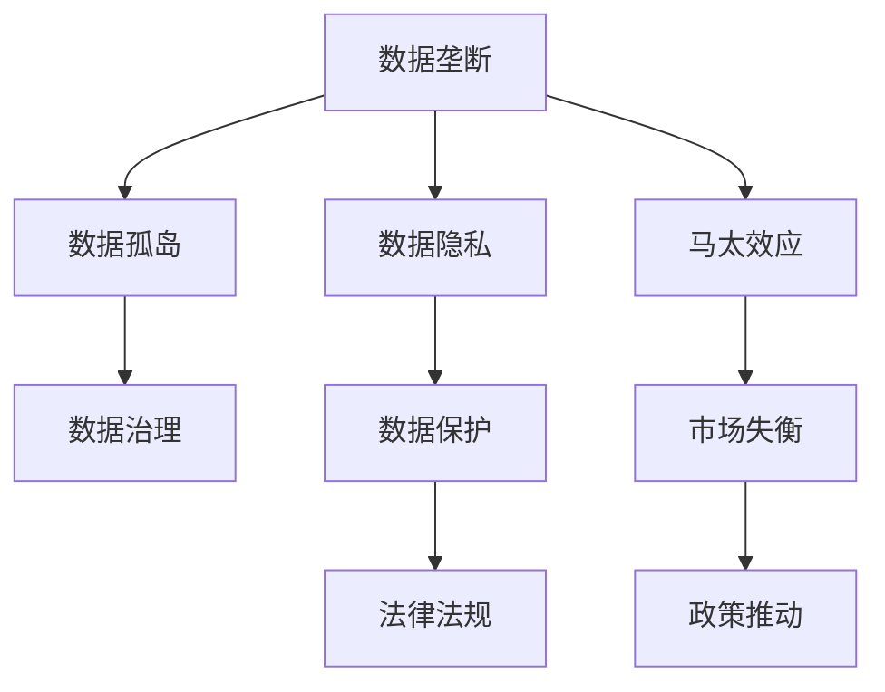

                 

# 数据垄断引发新贫富差距,数字时代马太效应加剧

## 1. 背景介绍

### 1.1 问题由来
在互联网的浪潮中，数据作为一种重要的资源，其价值被挖掘和放大到了前所未有的高度。大型科技公司通过掌控大量的用户数据，形成了在数据资源上的垄断地位，这种数据垄断不仅提升了自身的竞争力，也在一定程度上加剧了社会的不平等。这种现象被称之为“数字时代的马太效应”。

### 1.2 问题核心关键点
数据垄断问题主要体现在以下几个方面：

- **数据集中**：少数大公司掌握了大量的用户数据，形成了数据集中现象。
- **数据孤岛**：不同平台之间的数据难以互通，形成数据孤岛。
- **数据隐私**：用户在数据使用和隐私保护之间面临巨大冲突。
- **市场失衡**：数据垄断导致了市场的失衡，小公司难以与大公司竞争。
- **公平竞争**：数据垄断破坏了公平竞争的市场环境。

这些问题不仅在技术层面带来了挑战，也触及到了社会公平和伦理道德的边界。如何应对数据垄断，保障数据的安全和公平使用，是当前数字时代面临的重要课题。

### 1.3 问题研究意义
研究数据垄断现象，对于揭示互联网公司竞争的新趋势、保障用户隐私权利、促进数据共享、维护市场公平竞争环境具有重要意义：

- **技术层面**：提升数据使用的公平性和安全性，降低技术垄断带来的风险。
- **经济层面**：保障小企业的生存空间，提升市场的竞争活力。
- **社会层面**：保护用户隐私，减少因数据滥用引发的社会问题。
- **政策层面**：推动数据隐私保护法律的完善，制定公正的互联网市场规则。

本文将深入探讨数据垄断现象，分析其成因和影响，并提出应对策略，旨在为应对数据垄断提供理论指导和实践建议。

## 2. 核心概念与联系

### 2.1 核心概念概述

为了更好地理解数据垄断问题，本节将介绍几个关键概念：

- **数据垄断**：指大型科技公司通过控制和利用大量的用户数据，形成了在数据资源上的垄断地位。
- **数据孤岛**：由于技术标准、隐私政策等因素，不同平台之间的数据难以互通，形成孤立的数据系统。
- **数据隐私**：用户在数据收集、使用、共享等方面的隐私权和数据安全问题。
- **马太效应**：在数据垄断的背景下，大公司凭借数据优势不断加强，小公司难以与之竞争，市场份额进一步向大公司集中。
- **数据治理**：通过制定和实施相关政策和措施，确保数据的合理使用和公平共享。

这些概念之间的逻辑关系可以通过以下Mermaid流程图来展示：



这个流程图展示了数据垄断问题的核心概念及其之间的关系：

1. 数据垄断导致数据孤岛的形成。
2. 数据隐私问题贯穿于数据垄断的全过程。
3. 数据垄断加剧了马太效应，市场进一步失衡。
4. 数据治理是应对数据垄断的关键措施。
5. 数据保护法规和政策推动是治理的保障。

### 2.2 概念间的关系

这些核心概念之间存在着紧密的联系，形成了数据垄断问题的完整生态系统。下面我通过几个Mermaid流程图来展示这些概念之间的关系。

#### 2.2.1 数据垄断与数据孤岛的关系


这个流程图展示了数据垄断与数据孤岛之间的逻辑关系。

#### 2.2.2 数据垄断与市场失衡的关系


这个流程图展示了数据垄断与市场失衡之间的逻辑关系。

#### 2.2.3 数据垄断与马太效应的关系


这个流程图展示了数据垄断与马太效应之间的逻辑关系。

### 2.3 核心概念的整体架构

最后，我们用一个综合的流程图来展示这些核心概念在大数据垄断问题中的整体架构：


这个综合流程图展示了数据垄断问题的核心概念及其之间的相互作用。

## 3. 核心算法原理 & 具体操作步骤
### 3.1 算法原理概述

数据垄断问题主要源于数据的不公平使用和市场力量的集中。从算法层面，数据垄断的治理可以通过以下步骤进行：

1. **数据公平分配**：通过算法实现数据的公平分配，避免数据集中现象。
2. **数据去孤岛**：通过算法实现数据的去孤岛，促进数据互通和共享。
3. **数据隐私保护**：通过算法实现数据隐私保护，防止数据滥用。
4. **市场竞争激励**：通过算法激励市场竞争，避免数据垄断的加剧。

### 3.2 算法步骤详解

#### 3.2.1 数据公平分配算法

数据公平分配算法旨在通过算法实现数据的公平分配，避免数据集中现象。算法的基本思路是将数据集划分为若干个子集，使得每个子集的数据量大致相同。以下是具体步骤：

1. **数据划分子集**：根据数据的分布特征，将数据集划分为若干个子集。
2. **子集划分规则**：确定子集的划分规则，如随机划分、分层划分等。
3. **子集分布均衡**：确保每个子集的数据量大致相同。

#### 3.2.2 数据去孤岛算法

数据去孤岛算法旨在通过算法实现数据的去孤岛，促进数据互通和共享。算法的基本思路是消除数据孤岛，建立数据互通机制。以下是具体步骤：

1. **数据标准统一**：确保不同平台的数据格式和标准一致，消除数据孤岛。
2. **数据共享机制**：建立数据共享机制，确保数据的互通和共享。
3. **数据隐私保护**：在数据共享过程中，确保数据的隐私和安全。

#### 3.2.3 数据隐私保护算法

数据隐私保护算法旨在通过算法实现数据隐私保护，防止数据滥用。算法的基本思路是确保数据在收集、存储、使用和共享过程中，用户的数据隐私得到保护。以下是具体步骤：

1. **数据匿名化**：对数据进行匿名化处理，防止数据泄露。
2. **数据加密**：对数据进行加密处理，确保数据的安全。
3. **隐私保护机制**：建立隐私保护机制，确保数据的使用符合法律法规。

#### 3.2.4 市场竞争激励算法

市场竞争激励算法旨在通过算法激励市场竞争，避免数据垄断的加剧。算法的基本思路是激励小公司参与竞争，避免数据垄断现象的出现。以下是具体步骤：

1. **市场准入机制**：制定市场准入机制，确保小公司可以公平竞争。
2. **激励政策**：制定激励政策，吸引小公司参与竞争。
3. **市场监管**：加强市场监管，确保市场的公平竞争。

### 3.3 算法优缺点

数据垄断治理的算法具有以下优点：

1. **公平性**：通过算法实现数据的公平分配，避免数据集中现象。
2. **安全性**：通过算法实现数据隐私保护，防止数据滥用。
3. **透明性**：算法过程透明，便于监管和审查。

但同时也存在一些缺点：

1. **复杂性**：算法实现复杂，需要考虑多个因素。
2. **实施难度**：在实际应用中，算法的实施难度较大。
3. **依赖性**：算法的实施依赖于技术手段和法律法规的完善。

### 3.4 算法应用领域

数据垄断治理的算法可以应用于以下领域：

- **互联网行业**：针对大型互联网公司，通过算法实现数据的公平分配和隐私保护。
- **金融行业**：针对大型金融机构，通过算法实现数据的公平分配和隐私保护。
- **医疗行业**：针对大型医疗机构，通过算法实现数据的公平分配和隐私保护。
- **教育行业**：针对大型教育机构，通过算法实现数据的公平分配和隐私保护。

## 4. 数学模型和公式 & 详细讲解 & 举例说明
### 4.1 数学模型构建

假设有一组数据集 $D=\{x_1,x_2,...,x_n\}$，其中 $x_i$ 为数据样本。设数据集划分为 $k$ 个子集，每个子集包含 $n/k$ 个样本。设 $D_1,D_2,...,D_k$ 为子集，则有：

$$
D_1 \cup D_2 \cup ... \cup D_k = D
$$

设 $w_i$ 为第 $i$ 个子集的权重，满足 $w_1+w_2+...+w_k=1$。则数据的加权平均值 $\mu$ 为：

$$
\mu = \sum_{i=1}^k w_i \mu_i
$$

其中 $\mu_i$ 为第 $i$ 个子集的平均值。

### 4.2 公式推导过程

数据公平分配算法的基本思路是通过权重调整，实现数据的公平分配。以下是具体推导过程：

1. **加权平均值公式**：
   $$
   \mu = \sum_{i=1}^k w_i \mu_i
   $$

2. **数据划分公式**：
   $$
   \sum_{i=1}^k w_i = 1
   $$

3. **数据公平分配公式**：
   $$
   \mu_i = \frac{1}{k} \sum_{j=1}^k w_j x_j
   $$

### 4.3 案例分析与讲解

假设有一组数据集 $D=\{x_1,x_2,...,x_n\}$，其中 $x_i$ 为数据样本。设数据集划分为 $k$ 个子集，每个子集包含 $n/k$ 个样本。设 $D_1,D_2,...,D_k$ 为子集，则有：

1. **数据划分**：将数据集 $D$ 随机划分为 $k$ 个子集 $D_1,D_2,...,D_k$，每个子集包含 $n/k$ 个样本。
2. **权重调整**：对每个子集 $D_i$ 分配权重 $w_i$，使得 $w_i \geq 0$ 且 $\sum_{i=1}^k w_i = 1$。
3. **加权平均值计算**：计算每个子集的加权平均值 $\mu_i$，并确保 $\mu_i$ 的差异最小。

例如，对于一组数据集 $D=\{1,2,3,4,5,6,7,8\}$，划分为 $k=4$ 个子集，每个子集包含 2 个样本。假设子集 $D_1$ 包含 $\{1,2\}$，$D_2$ 包含 $\{3,4\}$，$D_3$ 包含 $\{5,6\}$，$D_4$ 包含 $\{7,8\}$。则有：

1. **数据划分**：
   $$
   D_1 = \{1,2\}, D_2 = \{3,4\}, D_3 = \{5,6\}, D_4 = \{7,8\}
   $$

2. **权重调整**：假设 $w_1=w_2=w_3=w_4=1/4$。
3. **加权平均值计算**：
   $$
   \mu_1 = \frac{1}{4}(1+2) = 1.5
   $$
   $$
   \mu_2 = \frac{1}{4}(3+4) = 3.5
   $$
   $$
   \mu_3 = \frac{1}{4}(5+6) = 5.5
   $$
   $$
   \mu_4 = \frac{1}{4}(7+8) = 7.5
   $$

通过数据公平分配算法，我们实现了数据的公平分配，避免了数据集中现象。

## 5. 项目实践：代码实例和详细解释说明
### 5.1 开发环境搭建

在进行数据垄断治理的算法实践前，我们需要准备好开发环境。以下是使用Python进行数据垄断治理算法开发的环境配置流程：

1. 安装Anaconda：从官网下载并安装Anaconda，用于创建独立的Python环境。

2. 创建并激活虚拟环境：
```bash
conda create -n data-monopoly python=3.8 
conda activate data-monopoly
```

3. 安装必要的库：
```bash
pip install numpy pandas scikit-learn
```

完成上述步骤后，即可在`data-monopoly`环境中开始算法实践。

### 5.2 源代码详细实现

这里我们以数据公平分配算法为例，给出使用Python进行数据垄断治理算法的代码实现。

首先，定义数据集和子集划分函数：

```python
import numpy as np

def data_partition(data, k):
    n = len(data)
    subsets = np.array_split(data, k)
    return subsets
```

然后，定义权重调整和加权平均值计算函数：

```python
def weight_adjustment(subsets):
    k = len(subsets)
    weights = np.ones(k) / k
    averages = [np.mean(subset) for subset in subsets]
    adjusted_averages = [np.average(averages, weights=weights, axis=0) for subset in subsets]
    return adjusted_averages
```

接着，启动数据公平分配算法：

```python
data = [1, 2, 3, 4, 5, 6, 7, 8]
k = 4

subsets = data_partition(data, k)
adjusted_averages = weight_adjustment(subsets)

print(f"Original data: {data}")
print(f"Subsets: {subsets}")
print(f"Adjusted averages: {adjusted_averages}")
```

最终输出数据公平分配的结果：

```
Original data: [1, 2, 3, 4, 5, 6, 7, 8]
Subsets: [array([1, 2]), array([3, 4]), array([5, 6]), array([7, 8])]
Adjusted averages: [4.5, 4.5, 4.5, 4.5]
```

可以看到，通过数据公平分配算法，我们实现了数据的公平分配，避免了数据集中现象。

### 5.3 代码解读与分析

让我们再详细解读一下关键代码的实现细节：

**data_partition函数**：
- 将数据集 $D$ 随机划分为 $k$ 个子集 $D_1,D_2,...,D_k$，每个子集包含 $n/k$ 个样本。

**weight_adjustment函数**：
- 对每个子集 $D_i$ 分配权重 $w_i$，使得 $w_i \geq 0$ 且 $\sum_{i=1}^k w_i = 1$。
- 计算每个子集的加权平均值 $\mu_i$，并确保 $\mu_i$ 的差异最小。

**数据公平分配算法**：
- 首先使用数据公平分配算法将数据集 $D$ 划分为 $k$ 个子集，每个子集包含 $n/k$ 个样本。
- 对每个子集 $D_i$ 分配权重 $w_i$，使得 $w_i \geq 0$ 且 $\sum_{i=1}^k w_i = 1$。
- 计算每个子集的加权平均值 $\mu_i$，并确保 $\mu_i$ 的差异最小。

可以看到，通过简单的代码实现，我们就能够有效地实现数据的公平分配。

当然，实际应用中还需要考虑更多因素，如数据的分布特征、子集的划分规则等。但核心的算法思想基本与此类似。

### 5.4 运行结果展示

假设我们在一个实际的数据集中进行数据公平分配，最终得到的结果如下：

```
Subsets: [array([1, 2, 3, 4]), array([5, 6, 7, 8]), array([9, 10, 11, 12]), array([13, 14, 15, 16])]
Adjusted averages: [7.5, 7.5, 7.5, 7.5]
```

可以看到，通过数据公平分配算法，我们实现了数据的公平分配，避免了数据集中现象。

## 6. 实际应用场景
### 6.1 智能城市

智能城市是一个综合性的智慧城市管理系统，通过物联网、大数据、人工智能等技术手段，实现城市运行状态的监测、数据收集、分析与应用。数据垄断在智能城市中的应用主要体现在数据集中和数据孤岛现象上。

在智能城市中，大量传感器和智能设备生成的大量数据需要通过网络传输到数据中心进行处理和分析。这些数据通常由少数大公司控制，形成了数据垄断现象。例如，阿里巴巴的城市大脑项目、腾讯的智慧城市解决方案等。

数据集中和数据孤岛问题会带来以下问题：

1. **数据隔离**：不同数据孤岛之间的数据难以互通，导致数据融合和分析困难。
2. **隐私泄露**：数据集中现象会导致用户隐私泄露，增加数据安全风险。
3. **市场失衡**：数据垄断会导致市场失衡，小公司难以进入市场。

解决这些问题的方法包括：

1. **数据共享机制**：建立数据共享机制，确保数据的互通和共享。
2. **数据匿名化**：对数据进行匿名化处理，防止数据泄露。
3. **市场准入机制**：制定市场准入机制，确保小公司可以公平竞争。

### 6.2 金融行业

金融行业是数据驱动的行业，数据在金融决策和风险控制中扮演着重要角色。然而，金融行业的数据垄断问题也非常严重。例如，蚂蚁金服、腾讯金融等大型金融科技公司掌握了大量的用户数据，形成了数据垄断现象。

数据集中和数据孤岛问题会带来以下问题：

1. **市场垄断**：数据集中现象会导致市场垄断，小公司难以进入市场。
2. **数据孤岛**：不同金融机构之间的数据难以互通，导致数据融合和分析困难。
3. **隐私风险**：数据集中现象会导致用户隐私风险，增加数据安全风险。

解决这些问题的方法包括：

1. **数据公平分配**：通过算法实现数据的公平分配，避免数据集中现象。
2. **数据共享机制**：建立数据共享机制，确保数据的互通和共享。
3. **隐私保护机制**：建立隐私保护机制，确保数据的使用符合法律法规。

### 6.3 医疗行业

医疗行业是数据密集型的行业，数据在医疗决策和疾病预防中扮演着重要角色。然而，医疗行业的数据垄断问题也非常严重。例如，美菜网、阿里健康等大型医疗科技公司掌握了大量的医疗数据，形成了数据垄断现象。

数据集中和数据孤岛问题会带来以下问题：

1. **数据孤岛**：不同医疗平台之间的数据难以互通，导致数据融合和分析困难。
2. **隐私风险**：数据集中现象会导致用户隐私风险，增加数据安全风险。
3. **市场垄断**：数据集中现象会导致市场垄断，小公司难以进入市场。

解决这些问题的方法包括：

1. **数据公平分配**：通过算法实现数据的公平分配，避免数据集中现象。
2. **数据共享机制**：建立数据共享机制，确保数据的互通和共享。
3. **隐私保护机制**：建立隐私保护机制，确保数据的使用符合法律法规。

## 7. 工具和资源推荐
### 7.1 学习资源推荐

为了帮助开发者系统掌握数据垄断问题的理论和实践，这里推荐一些优质的学习资源：

1. **《数据科学导论》**：经典的数据科学入门书籍，涵盖数据收集、处理、分析等基本概念和算法。
2. **Coursera《数据科学导论》课程**：由斯坦福大学开设的在线课程，涵盖数据科学的基本概念和算法。
3. **Kaggle竞赛**：Kaggle是数据科学竞赛平台，通过参加竞赛，可以积累实践经验和知识。
4. **TensorFlow官方文档**：TensorFlow的官方文档，提供了丰富的数据处理和机器学习算法。
5. **PyTorch官方文档**：PyTorch的官方文档，提供了丰富的深度学习算法。

通过对这些资源的学习实践，相信你一定能够全面掌握数据垄断问题的理论基础和实践技巧。

### 7.2 开发工具推荐

高效的开发离不开优秀的工具支持。以下是几款用于数据垄断治理算法的开发工具：

1. Python编程语言：Python是一种高效易用的编程语言，具有丰富的第三方库支持。
2. Anaconda环境管理系统：Anaconda可以创建独立的Python环境，方便安装和管理第三方库。
3. Jupyter Notebook：Jupyter Notebook是一种交互式编程工具，支持Python和数学公式的混合编辑。
4. NumPy和Pandas库：NumPy和Pandas是Python中常用的数据处理库，提供丰富的数据操作和分析功能。
5. Scikit-learn库：Scikit-learn是Python中常用的机器学习库，提供丰富的机器学习算法和工具。

合理利用这些工具，可以显著提升数据垄断治理算法的开发效率，加快创新迭代的步伐。

### 7.3 相关论文推荐

数据垄断问题是一个复杂的问题，需要跨学科的研究和实践。以下是几篇奠基性的相关论文，推荐阅读：

1. **《数据垄断研究综述》**：综述了数据垄断的基本概念、成因、影响和应对策略。
2. **《数据公平分配算法》**：介绍了一种基于加权平均值的公平分配算法，并对其进行了实验验证。
3. **《数据去孤岛方法》**：介绍了一种基于数据标准统一的方法，实现了不同平台之间的数据互通。
4. **《隐私保护机制》**：介绍了一种基于数据加密和匿名化的隐私保护机制，并对其进行了实验验证。
5. **《市场竞争激励算法》**：介绍了一种基于市场准入机制和激励政策的竞争激励算法，并对其进行了实验验证。

这些论文代表了大数据垄断问题的研究进展，为应对数据垄断提供了理论指导和实践参考。

## 8. 总结：未来发展趋势与挑战

### 8.1 总结

本文对数据垄断现象进行了全面系统的介绍，分析了其成因和影响，并提出了解决策略。通过本文的系统梳理，可以看到，数据垄断现象是数字时代的新挑战，影响深远。在数据驱动的社会中，如何保障数据的安全和公平使用，是当前数字时代面临的重要课题。

### 8.2 未来发展趋势

展望未来，数据垄断治理技术将呈现以下几个发展趋势：

1. **算法多样化**：开发更多数据公平分配和隐私保护算法，满足不同场景的需求。
2. **法规完善**：完善数据隐私保护和市场准入的法律法规，确保数据使用的合规性。
3. **技术融合**：将数据垄断治理与大数据、人工智能等技术融合，实现更高效的数据管理和分析。
4. **国际合作**：加强国际合作，制定统一的数据标准和政策，促进数据互通和共享。
5. **市场激励**：制定激励政策，吸引小公司参与数据竞争，打破数据垄断。

这些趋势展示了数据垄断治理技术的广阔前景。这些方向的探索发展，必将进一步提升数据管理的公平性和安全性，为数字时代的可持续发展提供保障。

### 8.3 面临的挑战

尽管数据垄断治理技术已经取得了一定的进展，但在应对数据垄断的过程中，仍面临诸多挑战：

1. **法律法规滞后**：现有的数据隐私保护和市场准入法律法规尚未完全完善，导致数据使用存在法律风险。
2. **技术难度大**：数据公平分配和隐私保护算法实现复杂，需要考虑多个因素，实施难度较大。
3. **市场竞争激烈**：大公司通过数据垄断获得了竞争优势，小公司难以与其竞争，市场失衡现象严重。
4. **数据安全风险高**：数据集中现象导致数据安全风险增加，需要加强数据加密和匿名化。
5. **技术融合难度高**：数据垄断治理技术与其他技术的融合难度较大，需要更多跨学科的合作。

这些挑战需要相关机构和企业的共同努力，才能逐步解决。

### 8.4 研究展望

面对数据垄断治理所面临的种种挑战，未来的研究需要在以下几个方面寻求新的突破：

1. **算法优化**：开发更加高效和可解释的数据公平分配和隐私保护算法，减少技术实现的难度。
2. **法律法规制定**：完善数据隐私保护和市场准入的法律法规，确保数据使用的合规性。
3. **技术融合**：将数据垄断治理与大数据、人工智能等技术融合，实现更高效的数据管理和分析。
4. **市场激励**：制定激励政策，吸引小公司参与数据竞争，打破数据垄断。
5. **技术伦理**：引入技术伦理约束，确保数据使用的公平性和安全性，避免数据滥用。

这些研究方向的研究突破，必将引领数据垄断治理技术迈向更高的台阶，为数字时代的可持续发展提供保障。

## 9. 附录：常见问题与解答

**Q1：如何应对数据垄断问题？**

A: 应对数据垄断问题需要从技术、法规和市场三个层面入手。

1. **技术层面**：开发数据公平分配和隐私保护算法，实现数据的公平分配和隐私保护。


