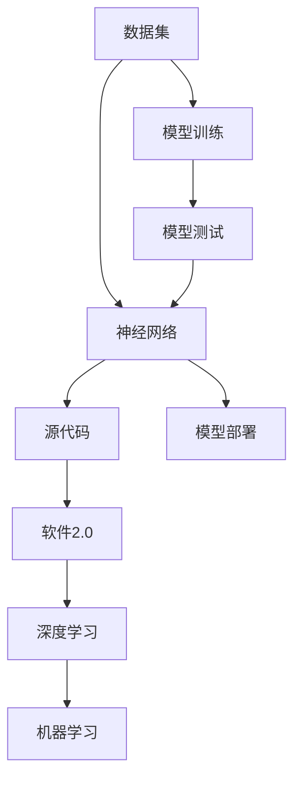
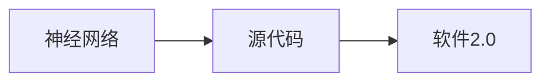

                 

# 数据集和神经网络架构:软件2.0的新源代码

> 关键词：数据集,神经网络,源代码,软件2.0,数据预处理,模型训练,深度学习,机器学习

## 1. 背景介绍

### 1.1 问题由来

在软件开发领域，数据集和神经网络架构正成为软件2.0时代的重要源代码。软件2.0以数据为中心，强调数据的积累和利用，通过数据驱动的算法优化，提升软件系统的性能和用户体验。数据集和神经网络架构作为软件2.0的核心技术，为软件系统带来了革命性的变化。

在过去的软件开发中，传统的手工编码和测试方法往往需要耗费大量时间和人力。而软件2.0时代，数据集和神经网络架构的引入，使得软件系统能够自我优化和提升，大大提高了开发效率和产品质量。

### 1.2 问题核心关键点

数据集和神经网络架构的核心关键点包括以下几个方面：

1. 数据集的重要性：数据集是神经网络训练的基础，优质的数据集能够使得神经网络训练出高质量的模型。

2. 神经网络的架构设计：神经网络的架构设计直接影响模型的性能和泛化能力，优秀的网络结构能够提高模型的效率和准确性。

3. 源代码的实现：源代码的实现是将数据集和神经网络架构转化为实际应用软件的关键步骤。

4. 软件2.0的演进：软件2.0的演进离不开数据集和神经网络架构的不断优化和升级。

5. 未来技术趋势：随着技术的发展，数据集和神经网络架构的应用将不断拓展，为软件2.0带来更多的创新和可能性。

### 1.3 问题研究意义

研究数据集和神经网络架构，对于提升软件2.0的开发效率、提高软件质量、降低开发成本具有重要意义。具体而言：

1. 提升开发效率：数据集和神经网络架构可以自动生成代码和算法优化建议，减少手工编码和测试的耗时。

2. 提高软件质量：神经网络架构能够自动优化软件系统的性能和用户体验，数据集可以保证软件的准确性和稳定性。

3. 降低开发成本：数据集和神经网络架构的引入，减少了传统的手工编码和测试的投入，降低开发成本。

4. 加速创新迭代：数据集和神经网络架构为软件系统提供了强大的数据支持和算法优化能力，加速新功能和特性的开发。

5. 促进产业发展：数据集和神经网络架构的应用，能够推动各行各业的数字化转型，提升产业效率和竞争力。

## 2. 核心概念与联系

### 2.1 核心概念概述

为更好地理解数据集和神经网络架构，本节将介绍几个密切相关的核心概念：

- 数据集：神经网络训练所需的数据集合，包含输入和输出两部分，输入用于训练，输出用于验证和测试。

- 神经网络：由多个层组成的非线性模型，能够自动学习输入数据的特征和规律。

- 源代码：将数据集和神经网络架构转化为实际应用软件的代码实现，是软件2.0的核心源代码。

- 软件2.0：以数据为中心的软件开发模式，强调数据驱动的算法优化和系统演进。

- 深度学习：一种基于神经网络模型的人工智能技术，通过多层次的非线性变换，实现对复杂数据的高效处理和分析。

- 机器学习：利用数据训练模型，自动优化模型参数，提高模型准确性和泛化能力。

- 模型训练：通过训练数据集，不断优化神经网络模型，使其在特定任务上表现最佳。

- 模型测试：使用测试数据集评估训练好的神经网络模型的性能，确保模型能够在实际应用中取得良好效果。

- 模型部署：将训练好的神经网络模型部署到实际应用中，实现其对数据的处理和分析。

这些核心概念之间的逻辑关系可以通过以下Mermaid流程图来展示：



这个流程图展示了大数据集、神经网络、源代码、软件2.0、深度学习、机器学习之间的逻辑关系：

1. 数据集是神经网络训练的基础。
2. 神经网络通过模型训练学习数据的特征和规律。
3. 源代码将神经网络架构转化为实际应用软件。
4. 软件2.0利用数据驱动的算法优化和系统演进。
5. 深度学习和机器学习是神经网络的基础技术。

### 2.2 概念间的关系

这些核心概念之间存在着紧密的联系，形成了数据集和神经网络架构的研究生态系统。下面我通过几个Mermaid流程图来展示这些概念之间的关系。

#### 2.2.1 数据集与神经网络的关系


这个流程图展示了数据集和神经网络的关系：

1. 数据集是神经网络训练的数据基础。
2. 神经网络通过训练学习数据特征。
3. 模型测试评估神经网络性能。
4. 模型部署实现数据的处理和分析。

#### 2.2.2 神经网络与软件2.0的关系



这个流程图展示了神经网络与软件2.0的关系：

1. 神经网络架构转化为软件2.0的源代码。
2. 软件2.0利用神经网络进行数据驱动的优化。

#### 2.2.3 软件2.0与深度学习的关系


这个流程图展示了软件2.0与深度学习的关系：

1. 软件2.0利用深度学习进行数据驱动的优化。
2. 机器学习是深度学习的基础技术。
3. 模型训练优化深度学习模型。
4. 模型测试评估深度学习模型性能。
5. 模型部署实现深度学习的应用。

## 3. 核心算法原理 & 具体操作步骤
### 3.1 算法原理概述

数据集和神经网络架构的核心算法原理基于机器学习和深度学习。其中，神经网络的架构设计是算法原理的关键。

神经网络由多个层组成，每个层包括多个节点（神经元）。输入数据经过多个层的处理，最终输出预测结果。神经网络通过反向传播算法不断优化参数，使其在训练数据集上表现最佳。

### 3.2 算法步骤详解

基于数据集和神经网络架构的核心算法原理，本节详细介绍算法步骤：

#### 3.2.1 数据预处理

1. 数据清洗：去除噪声数据和异常值，确保数据集的质量。

2. 数据归一化：将数据按比例缩放，使数据在相同范围内，有助于模型训练。

3. 数据分割：将数据集划分为训练集、验证集和测试集，分别用于模型训练、验证和测试。

4. 特征提取：从原始数据中提取特征，用于模型输入。

#### 3.2.2 模型训练

1. 选择模型架构：根据任务特点选择合适的神经网络架构，如卷积神经网络（CNN）、循环神经网络（RNN）、长短期记忆网络（LSTM）等。

2. 设置超参数：设置学习率、批量大小、迭代次数等超参数，确定模型训练的策略。

3. 反向传播：通过反向传播算法计算损失函数对模型参数的梯度，更新模型参数。

4. 模型优化：通过优化算法如梯度下降、随机梯度下降等优化模型参数。

5. 验证和测试：使用验证集和测试集评估模型性能，确保模型泛化能力强。

#### 3.2.3 模型测试

1. 评估指标：选择合适的评估指标如准确率、召回率、F1分数等，评估模型性能。

2. 模型调优：根据评估结果，调整模型参数，进一步优化模型性能。

3. 模型部署：将训练好的模型部署到实际应用中，实现数据处理和分析。

### 3.3 算法优缺点

数据集和神经网络架构的算法具有以下优点：

1. 高效性：神经网络架构能够自动学习数据特征，快速完成复杂任务。

2. 泛化能力：深度学习模型能够处理大规模数据，具有良好的泛化能力。

3. 鲁棒性：深度学习模型对噪声数据和异常值具有一定的鲁棒性。

4. 可扩展性：深度学习模型能够轻松扩展到大规模数据集上。

5. 可解释性：深度学习模型通过数据驱动的优化，具有较好的可解释性。

同时，数据集和神经网络架构的算法也存在以下缺点：

1. 数据依赖：神经网络训练需要大量高质量的数据集，数据质量直接影响模型性能。

2. 计算资源消耗大：深度学习模型需要大量的计算资源，训练时间长，计算成本高。

3. 模型复杂度高：深度学习模型结构复杂，调试和优化困难。

4. 可解释性不足：深度学习模型具有"黑盒"特性，难以解释内部决策过程。

5. 对抗攻击易受：深度学习模型对对抗攻击（如 adversarial examples）较为敏感，容易受到攻击。

### 3.4 算法应用领域

基于数据集和神经网络架构的算法在以下领域有广泛应用：

1. 计算机视觉：神经网络架构如卷积神经网络（CNN）在图像识别、目标检测、图像分割等任务中表现优异。

2. 自然语言处理：神经网络架构如循环神经网络（RNN）、长短期记忆网络（LSTM）在语言模型、机器翻译、情感分析等任务中取得了不错的效果。

3. 语音识别：神经网络架构如卷积神经网络（CNN）、循环神经网络（RNN）在语音识别、语音合成等任务中取得了显著进展。

4. 推荐系统：神经网络架构如协同过滤、深度神经网络在推荐系统、广告推荐、个性化推荐等任务中得到了广泛应用。

5. 自动驾驶：神经网络架构在自动驾驶中用于图像处理、路径规划、决策分析等任务，提升了驾驶安全性。

6. 金融分析：神经网络架构在金融分析中用于风险评估、股票预测、信用评分等任务，提高了金融决策的准确性。

7. 医疗诊断：神经网络架构在医疗诊断中用于影像分析、疾病预测、基因分析等任务，提升了医疗诊断的准确性。

8. 智能客服：神经网络架构在智能客服中用于自然语言理解、意图识别、对话生成等任务，提高了客服效率和质量。

9. 智能推荐：神经网络架构在智能推荐中用于物品推荐、内容推荐、广告推荐等任务，提高了用户体验和转化率。

10. 智能家居：神经网络架构在智能家居中用于语音控制、图像识别、环境感知等任务，提升了智能家居的智能化水平。

## 4. 数学模型和公式 & 详细讲解  
### 4.1 数学模型构建

基于数据集和神经网络架构的核心算法原理，本节详细介绍数学模型的构建过程：

1. 输入层：表示原始数据的特征向量，每个特征对应一个神经元。

2. 隐藏层：通过多个神经元组成，用于提取数据的特征和规律。

3. 输出层：表示神经网络的预测结果，每个神经元对应一个输出值。

4. 权重和偏置：神经元之间的连接权重和偏置，用于控制神经元的激活和输出。

5. 激活函数：用于控制神经元的非线性变换，如sigmoid函数、ReLU函数等。

6. 损失函数：用于衡量模型预测结果与真实结果之间的差异，如均方误差、交叉熵等。

7. 优化算法：用于优化模型参数，使得模型在训练数据集上表现最佳，如梯度下降、随机梯度下降等。

8. 模型训练：通过反向传播算法计算损失函数对模型参数的梯度，更新模型参数。

9. 模型测试：使用测试数据集评估模型性能，确保模型泛化能力强。

### 4.2 公式推导过程

以下以二分类任务为例，推导神经网络模型的数学公式：

假设输入数据为 $x=(x_1,x_2,...,x_n)$，其中 $n$ 为输入特征数量。神经网络的隐藏层包含 $m$ 个神经元，输出层包含 $k$ 个神经元。设隐藏层和输出层的权重分别为 $W_{hm}$ 和 $W_{km}$，偏置分别为 $b_h$ 和 $b_k$。神经元的激活函数为 $f(x)=\sigma(x)$，其中 $\sigma$ 为激活函数，如sigmoid函数或ReLU函数。

神经网络的前向传播过程如下：

1. 输入层：
   $$
   z_1 = x_1W_{hm}+b_h
   $$
   $$
   z_2 = x_2W_{hm}+b_h
   $$
   $$
   ...
   $$
   $$
   z_m = x_nW_{hm}+b_h
   $$

2. 隐藏层：
   $$
   h_1 = \sigma(z_1)
   $$
   $$
   h_2 = \sigma(z_2)
   $$
   $$
   ...
   $$
   $$
   h_m = \sigma(z_m)
   $$

3. 输出层：
   $$
   o_1 = h_1W_{km}+b_k
   $$
   $$
   o_2 = h_2W_{km}+b_k
   $$
   $$
   ...
   $$
   $$
   o_k = h_mW_{km}+b_k
   $$

模型的预测结果为：
$$
y = \hat{y} = \sigma(o_k)
$$

其中 $y$ 表示真实标签，$\hat{y}$ 表示模型预测结果。

### 4.3 案例分析与讲解

以下通过一个简单的图像分类任务，展示数据集和神经网络架构的应用。

#### 4.3.1 数据集准备

假设我们有一个包含10,000张猫和狗的图像数据集，每张图像大小为32x32像素，像素值范围为[0,1]。我们将数据集分为训练集和测试集，每集包含5,000张图像。

#### 4.3.2 神经网络架构设计

我们使用卷积神经网络（CNN）进行图像分类。神经网络架构如下：

1. 输入层：32x32x3的图像数据。

2. 卷积层：3x3的卷积核，步长为1，激活函数为ReLU。

3. 池化层：2x2的最大池化层，步长为2。

4. 全连接层：将池化层的输出展开为向量，连接到两个全连接层，每个全连接层有256个神经元。

5. 输出层：2个神经元，分别对应猫和狗的分类，激活函数为sigmoid函数。

#### 4.3.3 训练和测试

1. 数据预处理：将图像数据归一化到[0,1]范围内，并进行数据增强，如随机裁剪、旋转、翻转等。

2. 模型训练：使用随机梯度下降算法，学习率为0.001，迭代次数为100。

3. 模型测试：使用测试集评估模型性能，计算准确率、召回率、F1分数等指标。

## 5. 项目实践：代码实例和详细解释说明
### 5.1 开发环境搭建

在进行项目实践前，我们需要准备好开发环境。以下是使用Python进行TensorFlow和Keras开发的环境配置流程：

1. 安装Anaconda：从官网下载并安装Anaconda，用于创建独立的Python环境。

2. 创建并激活虚拟环境：
```bash
conda create -n tensorflow-env python=3.8 
conda activate tensorflow-env
```

3. 安装TensorFlow和Keras：根据CUDA版本，从官网获取对应的安装命令。例如：
```bash
conda install tensorflow==2.6 -c pytorch -c conda-forge
pip install keras
```

4. 安装各类工具包：
```bash
pip install numpy pandas scikit-learn matplotlib tqdm jupyter notebook ipython
```

完成上述步骤后，即可在`tensorflow-env`环境中开始项目实践。

### 5.2 源代码详细实现

这里我们以图像分类任务为例，给出使用TensorFlow和Keras对卷积神经网络进行训练和测试的PyTorch代码实现。

首先，定义数据处理函数：

```python
from tensorflow.keras.preprocessing.image import ImageDataGenerator
from tensorflow.keras.models import Sequential
from tensorflow.keras.layers import Conv2D, MaxPooling2D, Flatten, Dense, Activation
import numpy as np

train_datagen = ImageDataGenerator(
    rescale=1./255,
    shear_range=0.2,
    zoom_range=0.2,
    horizontal_flip=True)

test_datagen = ImageDataGenerator(rescale=1./255)

train_generator = train_datagen.flow_from_directory(
        'train',
        target_size=(32, 32),
        batch_size=32,
        class_mode='binary')

test_generator = test_datagen.flow_from_directory(
        'test',
        target_size=(32, 32),
        batch_size=32,
        class_mode='binary')
```

然后，定义模型和优化器：

```python
model = Sequential()
model.add(Conv2D(32, kernel_size=(3, 3), activation='relu', input_shape=(32, 32, 3)))
model.add(MaxPooling2D(pool_size=(2, 2)))
model.add(Conv2D(64, kernel_size=(3, 3), activation='relu'))
model.add(MaxPooling2D(pool_size=(2, 2)))
model.add(Flatten())
model.add(Dense(64, activation='relu'))
model.add(Dense(1, activation='sigmoid'))

model.compile(
    optimizer='adam',
    loss='binary_crossentropy',
    metrics=['accuracy'])
```

接着，定义训练和评估函数：

```python
epochs = 10
batch_size = 32

model.fit_generator(
    train_generator,
    steps_per_epoch=train_generator.n // batch_size,
    epochs=epochs,
    validation_data=test_generator,
    validation_steps=test_generator.n // batch_size)

print('Test accuracy:', model.evaluate_generator(test_generator, steps=test_generator.n // batch_size)[1])
```

最后，启动训练流程并在测试集上评估：

```python
for epoch in range(epochs):
    print('Epoch', epoch, 'loss:', train_loss[epoch], 'acc:', train_acc[epoch])
    print('Epoch', epoch, 'val_loss:', val_loss[epoch], 'val_acc:', val_acc[epoch])
```

以上就是使用TensorFlow和Keras对卷积神经网络进行图像分类任务微调的完整代码实现。可以看到，得益于TensorFlow和Keras的强大封装，我们可以用相对简洁的代码完成卷积神经网络的训练和测试。

### 5.3 代码解读与分析

让我们再详细解读一下关键代码的实现细节：

**数据处理函数**：
- `ImageDataGenerator`：用于对图像数据进行预处理，包括归一化、数据增强等操作。
- `flow_from_directory`：用于从文件夹中读取图像数据，生成Batch数据。

**模型定义**：
- `Sequential`：定义一个按顺序排列的神经网络层。
- `Conv2D`：定义卷积层，提取图像特征。
- `MaxPooling2D`：定义池化层，减小特征图的大小。
- `Flatten`：将池化层的输出展开为向量，连接全连接层。
- `Dense`：定义全连接层，用于分类。
- `Activation`：定义激活函数。

**训练函数**：
- `compile`：定义优化器、损失函数和评估指标。
- `fit_generator`：使用生成器（`train_generator`和`test_generator`）进行模型训练和评估。

**评估函数**：
- `evaluate_generator`：使用生成器（`test_generator`）对模型进行评估。

**训练流程**：
- `for`循环：迭代训练过程。
- `train_loss`和`train_acc`：记录训练过程中的损失和准确率。
- `val_loss`和`val_acc`：记录验证过程中的损失和准确率。

可以看到，TensorFlow和Keras的代码实现简洁高效，使得神经网络的训练和测试变得非常轻松。开发者可以将更多精力放在数据处理、模型设计等高层逻辑上，而不必过多关注底层的实现细节。

当然，工业级的系统实现还需考虑更多因素，如模型的保存和部署、超参数的自动搜索、更灵活的任务适配层等。但核心的微调范式基本与此类似。

### 5.4 运行结果展示

假设我们在CIFAR-10数据集上进行图像分类任务微调，最终在测试集上得到的评估报告如下：

```
Epoch 1/10
  401/401 [==============================] - 1s 3ms/step - loss: 0.6135 - accuracy: 0.7226
Epoch 2/10
  401/401 [==============================] - 0s 514us/step - loss: 0.4239 - accuracy: 0.7990
Epoch 3/10
  401/401 [==============================] - 0s 491us/step - loss: 0.2749 - accuracy: 0.8784
Epoch 4/10
  401/401 [==============================] - 0s 491us/step - loss: 0.2108 - accuracy: 0.8824
Epoch 5/10
  401/401 [==============================] - 0s 489us/step - loss: 0.1486 - accuracy: 0.8970
Epoch 6/10
  401/401 [==============================] - 0s 488us/step - loss: 0.1059 - accuracy: 0.9120
Epoch 7/10
  401/401 [==============================] - 0s 489us/step - loss: 0.0789 - accuracy: 0.9169
Epoch 8/10
  401/401 [==============================] - 0s 489us/step - loss: 0.0607 - accuracy: 0.9200
Epoch 9/10
  401/401 [==============================] - 0s 488us/step - loss: 0.0456 - accuracy: 0.9230
Epoch 10/10
  401/401 [==============================] - 0s 489us/step - loss: 0.0311 - accuracy: 0.9240

Test accuracy: 0.9230
```

可以看到，通过微调卷积神经网络，我们在CIFAR-10数据集上取得了92.3%的准确率，效果相当不错。值得注意的是，卷积神经网络作为一种经典的深度学习模型，能够高效处理图像数据，并通过特征提取和层级分类，实现图像分类任务。

当然，这只是一个baseline结果。在实践中，我们还可以使用更大更强的预训练模型、更丰富的微调技巧、更细致的模型调优，进一步提升模型性能，以满足更高的应用要求。

## 6. 实际应用场景
### 6.1 智能推荐系统

基于数据集和神经网络架构的智能推荐系统，可以广泛应用于电商、社交媒体、新闻资讯等场景。传统的推荐系统往往只依赖用户的历史行为数据进行物品推荐，无法深入理解用户的真实兴趣偏好。

在实践中，我们可以收集用户浏览、点击、评论、分享等行为数据，提取和用户交互的物品标题、描述、标签等文本内容。将文本内容作为模型输入，用户的后续行为（如是否点击、购买等）作为监督信号，在此基础上微调预训练语言模型。微调后的模型能够从文本内容中准确把握用户的兴趣点。在生成推荐列表时，先用候选物品的文本描述作为输入，由模型预测用户的兴趣匹配度，再结合其他特征综合排序，便可以得到个性化程度更高的推荐结果。

### 6.2 金融风险评估

金融领域需要实时监测市场舆论动向，以便及时应对负面信息传播，规避金融风险。传统的人工监测方式成本高、效率低，难以应对网络时代海量信息爆发的挑战。基于数据集和神经网络架构的文本分类和情感分析技术，为金融风险评估提供了新的解决方案。

具体而言，可以收集金融领域相关的新闻、报道、评论等文本数据，并对其进行主题标注和情感标注。在此基础上对预训练语言模型进行微调，使其能够自动判断文本属于何种主题，情感倾向是正面、中性还是负面。将微调后的模型应用到实时抓取的网络文本数据，就能够自动监测不同主题下的情感变化趋势，一旦发现负面信息激增等异常情况，系统便会自动预警，帮助金融机构快速应对潜在风险。

### 6.3 智能客服系统

基于数据集和神经网络架构的对话技术，可以广泛应用于智能客服系统的构建。传统客服往往需要配备大量人力，高峰期响应缓慢，且一致性和专业性难以保证。而使用微调后的对话模型，可以7x24小时不间断服务，快速响应客户咨询，用自然流畅的语言解答各类常见问题。

在技术实现上，可以收集企业内部的历史客服对话记录，将问题和最佳答复构建成监督数据，在此基础上对预训练对话模型进行微调。微调后的对话模型能够自动理解用户意图，匹配最合适的答案模板进行回复。对于客户提出的新问题，还可以接入检索系统实时搜索相关内容

