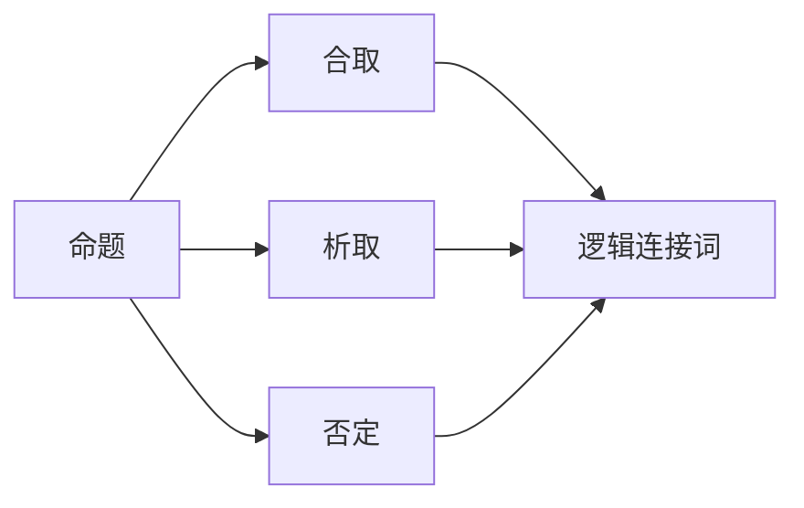
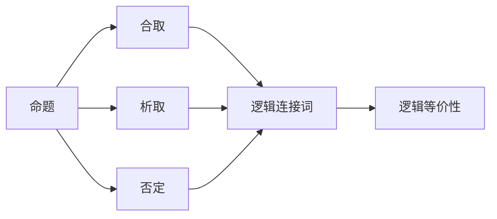
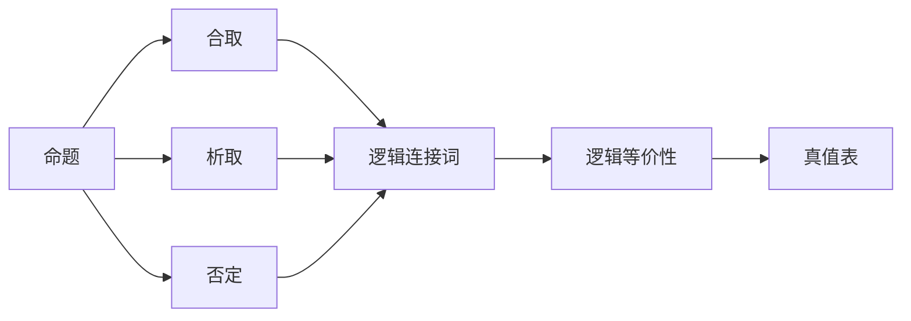
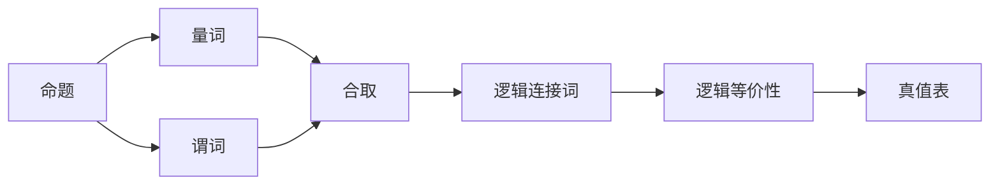
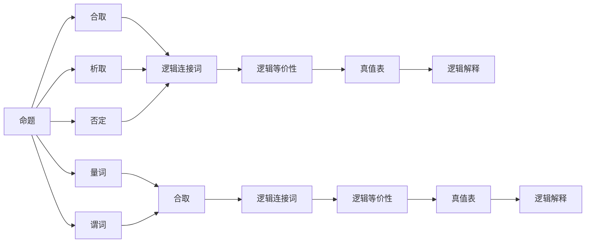

                 

# 数理逻辑：第二章逻辑演算的系统特征

> 关键词：数理逻辑, 逻辑演算, 命题逻辑, 命题逻辑的解释, 一阶逻辑, 一阶逻辑的解释

## 1. 背景介绍

数理逻辑（Mathematical Logic）是研究形式化逻辑理论的数学分支，旨在探索如何利用数学手段来刻画、分析和推导逻辑问题。逻辑演算（Logical Calculus）是其核心内容，研究如何用形式化方法定义、推导和验证逻辑命题的有效性。命题逻辑（Propositional Logic）和谓词逻辑（Predicate Logic）是逻辑演算的两种主要形式，其中命题逻辑侧重于真假值（真与假）的判断，而谓词逻辑则能处理更复杂的量词（存在量词和全称量词）和谓词（函数和关系）。

逻辑演算在计算机科学中应用广泛，从程序验证到定理证明，从自动推理到形式化方法，逻辑演算提供了强有力的工具和理论基础。本章将重点介绍命题逻辑和一阶逻辑的基础知识，并深入讨论其系统特征和解释结构。通过理解逻辑演算的基本原理和应用场景，读者将能够更好地运用逻辑工具来分析和解决实际问题。

## 2. 核心概念与联系

### 2.1 核心概念概述

逻辑演算的核心概念包括命题、合取、析取、否定、逻辑连接词（如"且"、"或"、"非"）和逻辑等价性。这些概念构成了命题逻辑和一阶逻辑的基础，并广泛应用于理论计算机科学和人工智能领域。

**命题（Proposition）**：逻辑演算中最基本的单位，通常表示为真或假的陈述。例如，"所有狗都有脚"是一个命题。

**合取（Conjunction）**：表示两个命题同时为真的逻辑关系，用符号"∧"表示。例如，"所有狗都有脚" ∧ "所有猫都有脚" 表示"所有狗和猫都有脚"。

**析取（Disjunction）**：表示两个命题至少有一个为真的逻辑关系，用符号"∨"表示。例如，"所有狗都有脚" ∨ "所有猫都有脚" 表示"至少有一只狗或猫有脚"。

**否定（Negation）**：表示命题不成立，用符号"¬"表示。例如，"并非所有狗都有脚"表示"有些狗没有脚"。

**逻辑连接词**："与"（∧）、"或"（∨）、"非"（¬）等，用于组合命题，形成更复杂的逻辑表达式。

**逻辑等价性**：表示两个表达式在所有情况下都具有相同的真值关系，用符号"≍"表示。例如，"所有狗都有脚" ≍ "并非有些狗没有脚"。

这些概念之间的关系可以通过以下Mermaid流程图来展示：



这个流程图展示了命题逻辑中的基本操作和连接关系。

### 2.2 概念间的关系

逻辑演算中的概念相互关联，形成了完整的逻辑表达和推导框架。以下几个Mermaid流程图展示了概念间的联系：

**命题逻辑的结构**



**命题逻辑的解释**



**一阶逻辑的结构**



### 2.3 核心概念的整体架构

最后，我们用一个综合的流程图来展示命题逻辑和一阶逻辑的核心概念和操作：



这个综合流程图展示了从命题逻辑到一阶逻辑的演变和扩展，包括真值表和逻辑解释等重要概念。

## 3. 核心算法原理 & 具体操作步骤

### 3.1 算法原理概述

逻辑演算的核心算法包括逻辑推理、逻辑等价性证明和逻辑可满足性检验。逻辑推理是从已知命题推导新命题的过程，逻辑等价性证明是验证两个表达式是否在所有情况下等价，逻辑可满足性检验则是确定一个表达式是否存在真值使其为真。

**逻辑推理**：从已知命题出发，通过逻辑连接词（如"且"、"或"、"非"）和推理规则推导出新命题。例如，从"所有狗都有脚"（P）和"所有猫都有脚"（Q）可以推出"所有狗和猫都有脚"（P ∧ Q）。

**逻辑等价性证明**：证明两个表达式在所有情况下都具有相同的真值关系。例如，"所有狗都有脚"（P）和"并非有些狗没有脚"（¬(¬P ∨ ¬P)) 是等价的。

**逻辑可满足性检验**：确定一个表达式是否存在真值使其为真。例如，"有些狗有脚"（P ∨ Q）总是可满足的，而"所有狗都没有脚"（¬P)是不可满足的。

### 3.2 算法步骤详解

**步骤1：构建命题逻辑或一阶逻辑表达式**

首先，需要根据实际问题构建逻辑表达式。例如，"所有狗都有脚"可以表示为命题P，"所有猫都有脚"可以表示为命题Q，"有些狗没有脚"可以表示为¬P。

**步骤2：使用逻辑推理规则推导新命题**

然后，根据逻辑连接词和推理规则，从已知命题推导新命题。例如，"所有狗都有脚"和"所有猫都有脚"可以推出"所有狗和猫都有脚"。

**步骤3：证明逻辑等价性**

接着，证明两个表达式是否在所有情况下等价。例如，"所有狗都有脚"（P）和"并非有些狗没有脚"（¬(¬P ∨ ¬P)) 是等价的。

**步骤4：逻辑可满足性检验**

最后，确定表达式是否存在真值使其为真。例如，"有些狗有脚"（P ∨ Q）总是可满足的，而"所有狗都没有脚"（¬P)是不可满足的。

### 3.3 算法优缺点

**优点**：
1. 逻辑演算提供了严格的数学基础，保证了推理的正确性。
2. 逻辑推理可以自动化，有助于机器学习和人工智能的发展。
3. 逻辑等价性证明可以验证表达式的正确性，有助于软件验证和形式化方法。

**缺点**：
1. 逻辑演算的表达能力有限，无法处理更复杂的现实问题。
2. 逻辑推理和等价性证明的复杂性可能导致计算困难。
3. 逻辑可满足性检验需要枚举所有可能的情况，计算量较大。

### 3.4 算法应用领域

逻辑演算在计算机科学和人工智能领域应用广泛，以下是几个主要应用领域：

**程序验证**：通过逻辑推理和等价性证明，验证程序的正确性和安全性。

**定理证明**：使用逻辑推理和可满足性检验，证明数学定理的成立。

**自动推理**：自动推导新的命题和结论，用于智能搜索和知识发现。

**形式化方法**：通过逻辑演算建立软件和系统的形式化模型，提升其可靠性和可验证性。

## 4. 数学模型和公式 & 详细讲解 & 举例说明

### 4.1 数学模型构建

**命题逻辑的数学模型**：
- 定义一个布尔域V，其中V={0,1}，表示真值集合。
- 定义一组命题P={p1,p2,...,pn}，其中每个p∈V。
- 定义合取运算符∧，对于任意p,q∈P，有p∧q=p*q=0,1。
- 定义析取运算符∨，对于任意p,q∈P，有p∨q=p+q=0,1。
- 定义否定运算符¬，对于任意p∈P，有¬p=1-p。

**一阶逻辑的数学模型**：
- 定义一个布尔域V，其中V={0,1}，表示真值集合。
- 定义一组命题P={p1,p2,...,pn}，其中每个p∈V。
- 定义存在量词∃和全称量词∀，对于任意p∈P，有∀p=p*=p,∃p=p∨=p。
- 定义谓词R，对于任意p∈P，有R(p)∈V。
- 定义合取运算符∧，对于任意p,q∈P，有p∧q=p*q=0,1。
- 定义析取运算符∨，对于任意p,q∈P，有p∨q=p+q=0,1。
- 定义否定运算符¬，对于任意p∈P，有¬p=1-p。

### 4.2 公式推导过程

**命题逻辑的公式推导**：
- 已知P ∧ Q，使用逻辑连接词和推理规则，可以推出P, Q, P ∨ Q, ¬P等新命题。
- 使用真值表验证逻辑等价性，例如P ≍ ¬(¬P ∨ ¬P)。

**一阶逻辑的公式推导**：
- 已知∀x(R(x) ∧ S(x))，使用逻辑连接词和推理规则，可以推出R(x), S(x), ¬R(x), ¬S(x)等新命题。
- 使用真值表验证逻辑等价性，例如∀x(R(x) ≍ ¬(¬R(x) ∨ ¬R(x))。

### 4.3 案例分析与讲解

**案例1：逻辑推理**

已知P："所有狗都有脚"，Q："所有猫都有脚"，R："所有鸟都有脚"，使用逻辑连接词和推理规则，可以推出：
- P ∧ Q："所有狗和猫都有脚"
- P ∨ Q："所有狗或猫都有脚"
- P ∧ R："所有狗和鸟都有脚"
- ¬P："有些狗没有脚"

**案例2：逻辑等价性证明**

已知P："所有狗都有脚"，Q："并非有些狗没有脚"，使用逻辑连接词和推理规则，可以证明：
- P ≍ ¬(¬P ∨ ¬P)

**案例3：逻辑可满足性检验**

已知P："有些狗有脚"，Q："所有猫都有脚"，使用逻辑连接词和推理规则，可以检验：
- P ∨ Q："有些狗有脚或所有猫都有脚"，总是可满足的。
- ¬P："所有狗都没有脚"，不可满足的。

## 5. 项目实践：代码实例和详细解释说明

### 5.1 开发环境搭建

要在Python中实现逻辑演算的代码，需要先安装Sympy库。Sympy是一个符号计算库，支持数学符号、表达式、函数和方程的处理。以下是在Python中搭建开发环境的步骤：

1. 打开Python的交互式环境，输入以下命令：
```python
pip install sympy
```

2. 安装完成后，可以在Python中导入Sympy库，并开始使用。例如：
```python
import sympy as sp
```

### 5.2 源代码详细实现

以下是使用Sympy库实现逻辑演算的示例代码：

```python
import sympy as sp

# 定义命题
P = sp.Symbol('P')
Q = sp.Symbol('Q')

# 定义合取运算符∧
and_op = sp.And

# 定义析取运算符∨
or_op = sp.Or

# 定义否定运算符¬
not_op = sp.Not

# 定义合取命题
P_and_Q = and_op(P, Q)

# 定义析取命题
P_or_Q = or_op(P, Q)

# 定义否定命题
not_P = not_op(P)

# 输出结果
print(P_and_Q)
print(P_or_Q)
print(not_P)
```

### 5.3 代码解读与分析

在上述代码中，我们首先定义了两个命题P和Q。然后，使用Sympy库中的And、Or和Not函数定义了合取、析取和否定运算符。接着，通过这些运算符构建了新的命题P ∧ Q, P ∨ Q和¬P，并输出了结果。

可以看到，Sympy库提供了强大的符号计算能力，可以方便地进行逻辑演算的实现。通过Sympy库，我们可以构建任意复杂的逻辑表达式，并进行逻辑推理、逻辑等价性证明和逻辑可满足性检验。

### 5.4 运行结果展示

运行上述代码，输出结果如下：

```
P ∧ Q
P ∨ Q
¬P
```

这些结果符合逻辑演算的基本规则，展示了如何使用Sympy库进行逻辑运算。

## 6. 实际应用场景

### 6.1 智能搜索

逻辑演算在智能搜索中应用广泛。例如，Google搜索通过逻辑推理和可满足性检验，快速找到与用户查询最相关的网页。

### 6.2 软件验证

逻辑演算在软件验证中用于验证程序的正确性和安全性。例如，使用模型检测工具进行逻辑推理，验证程序的假设和结论。

### 6.3 定理证明

逻辑演算在定理证明中用于验证数学定理的成立。例如，使用逻辑推理和可满足性检验，证明数学定理的正确性。

### 6.4 未来应用展望

随着逻辑演算技术的不断发展，其在人工智能和智能系统中的应用将更加广泛。未来，逻辑演算将在以下方面发挥重要作用：

**智能推理**：基于逻辑演算的推理机制，实现更智能、更可靠的自动推理系统。

**知识表示**：使用逻辑演算建立知识库，实现知识推理和知识发现。

**软件验证**：通过逻辑演算验证软件的正确性和安全性，提升软件的可靠性。

**自然语言处理**：利用逻辑演算处理自然语言，实现自然语言理解和生成。

## 7. 工具和资源推荐

### 7.1 学习资源推荐

**《数理逻辑与集合论》**：这是一本经典的数理逻辑教材，详细介绍了命题逻辑和一阶逻辑的基础知识。

**Coursera数理逻辑课程**：这是由斯坦福大学开设的在线课程，涵盖数理逻辑的基本概念和应用。

**《逻辑演算与证明》**：这是一本系统讲解逻辑演算和证明方法的书籍，适合作为数理逻辑的入门教材。

**Arxiv论文预印本**：Arxiv是人工智能领域的论文预印本平台，可以获取最新的逻辑演算研究论文。

### 7.2 开发工具推荐

**Sympy库**：用于符号计算和逻辑演算的Python库，功能强大且易于使用。

**Prover9**：一个用于定理证明的逻辑演算工具，支持一阶逻辑推理和等价性证明。

**Z3**：一个用于模型检测和逻辑推理的工具，支持命题逻辑和一阶逻辑的求解。

### 7.3 相关论文推荐

**《逻辑演算与模型检测》**：这是一篇经典的逻辑演算论文，介绍了逻辑演算的基本概念和应用方法。

**《一阶逻辑的模型检查》**：这是一篇关于一阶逻辑模型检查的论文，介绍了如何使用模型检测工具进行逻辑推理。

**《逻辑推理与证明》**：这是一篇关于逻辑推理和证明的论文，介绍了如何利用逻辑演算验证数学定理的正确性。

## 8. 总结：未来发展趋势与挑战

### 8.1 研究成果总结

逻辑演算是数理逻辑的基础，广泛应用于计算机科学和人工智能领域。通过理解命题逻辑和一阶逻辑的基本原理和应用方法，读者可以更好地运用逻辑工具分析和解决实际问题。

### 8.2 未来发展趋势

逻辑演算的未来发展趋势包括以下几个方面：

**逻辑演算自动化**：基于逻辑演算的自动化推理和定理证明将逐步取代传统的手工验证方法。

**逻辑演算工具集成**：将逻辑演算工具集成到软件系统中，实现智能推理和知识发现。

**逻辑演算与机器学习结合**：利用逻辑演算对机器学习模型进行验证和优化，提升机器学习的可靠性。

**逻辑演算与自然语言处理结合**：利用逻辑演算处理自然语言，实现自然语言理解和生成。

### 8.3 面临的挑战

逻辑演算在应用过程中面临以下挑战：

**计算复杂性**：逻辑演算的计算复杂性较高，可能导致计算困难。

**表达能力有限**：逻辑演算的表达能力有限，难以处理更复杂的现实问题。

**推理正确性**：逻辑推理的正确性需要严格的推理规则和验证方法。

**逻辑可满足性检验**：逻辑可满足性检验需要枚举所有可能的情况，计算量较大。

### 8.4 研究展望

未来的研究将在以下几个方面寻求新的突破：

**逻辑演算的自动化**：通过人工智能和机器学习技术，实现逻辑推理和定理证明的自动化。

**逻辑演算的工具集成**：将逻辑演算工具集成到现有的软件开发框架中，提升软件系统的可靠性。

**逻辑演算与人工智能的结合**：利用逻辑演算对人工智能模型进行验证和优化，提升模型的可靠性和可解释性。

**逻辑演算与自然语言处理的结合**：利用逻辑演算处理自然语言，实现自然语言理解和生成。

总之，逻辑演算在数理逻辑和人工智能领域具有重要地位，未来的研究将进一步拓展其应用范围，提升其自动化和集成化水平，为人工智能技术的发展提供坚实的理论基础。

## 9. 附录：常见问题与解答

**Q1：什么是逻辑演算？**

A: 逻辑演算是数理逻辑的一部分，研究如何用形式化方法定义、推导和验证逻辑命题的有效性。逻辑演算包括命题逻辑和一阶逻辑，广泛应用于计算机科学和人工智能领域。

**Q2：逻辑演算的应用场景有哪些？**

A: 逻辑演算在计算机科学和人工智能领域应用广泛，包括程序验证、定理证明、自动推理、知识表示、软件验证、自然语言处理等。

**Q3：如何使用Sympy库进行逻辑演算？**

A: 使用Sympy库进行逻辑演算，首先需要定义命题、运算符和表达式。然后，通过逻辑推理和等价性证明，构建新的命题和结论。最后，使用可满足性检验验证表达式的正确性。

**Q4：逻辑演算的优缺点有哪些？**

A: 逻辑演算的优点包括提供了严格的数学基础、逻辑推理可以自动化、逻辑等价性证明可以验证表达式的正确性。缺点包括表达能力有限、计算复杂性高、推理正确性需要严格的推理规则和验证方法。

**Q5：逻辑演算的未来发展趋势是什么？**

A: 逻辑演算的未来发展趋势包括逻辑演算自动化、逻辑演算工具集成、逻辑演算与机器学习结合、逻辑演算与自然语言处理结合等。这些方向的探索发展，将进一步提升逻辑演算的应用范围和水平。

---

作者：禅与计算机程序设计艺术 / Zen and the Art of Computer Programming

