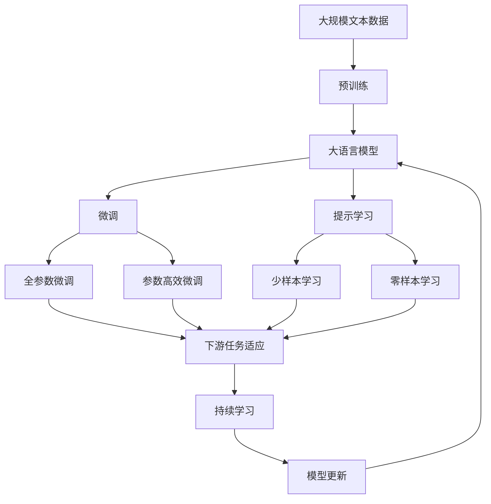

                 

# 机器学习在广告投放优化中的应用

> 关键词：广告投放, 点击率预测, 广告预算优化, 行为数据分析, 模型集成, 实时广告竞价

## 1. 背景介绍

### 1.1 问题由来

在数字广告行业中，广告主希望在有限的预算内，最大化广告的曝光和转化效果，以实现更高的投资回报率(ROI)。随着互联网用户的行为数据不断增加，机器学习技术被广泛应用于广告投放的各个环节，包括广告创意优化、点击率预测、广告预算分配等。机器学习技术通过分析用户行为数据，预测广告的效果和转化率，为广告投放决策提供科学依据。

近年来，随着深度学习技术的快速发展，尤其是神经网络、强化学习等算法的广泛应用，广告投放的效果和精准度得到了显著提升。特别是基于点击率预测和广告预算优化的深度学习模型，被广告主广泛应用于广告投放优化中，显著提高了广告投放的效果和ROI。

### 1.2 问题核心关键点

广告投放优化的问题核心在于如何利用机器学习技术，最大化广告投放的曝光和转化效果。其主要包括以下几个关键点：

1. **点击率预测**：预测用户对广告的点击概率，以指导广告投放的展示位置和时间，提升广告的点击率和转化率。
2. **广告预算优化**：在有限的预算内，根据广告效果进行动态分配，确保预算的使用效率最大化。
3. **行为数据分析**：分析用户的行为数据，挖掘用户的兴趣偏好和行为特征，为广告投放提供更精准的目标人群。
4. **模型集成**：结合多种模型和算法，提高广告投放的决策效率和精准度。
5. **实时广告竞价**：实时调整广告出价策略，根据广告投放的效果和预算动态调整，以最优的价格获取最佳的曝光和转化效果。

这些关键点通过机器学习技术的有机结合，形成了一个完整的广告投放优化系统，帮助广告主实现精准投放，最大化广告ROI。

### 1.3 问题研究意义

广告投放优化是数字广告行业的重要环节，通过机器学习技术的应用，可以有效提升广告投放的精准度和效果，帮助广告主在激烈的市场竞争中占据有利位置。具体来说，广告投放优化具有以下重要意义：

1. **提高广告投放精准度**：通过点击率预测和行为数据分析，精确识别用户需求和兴趣，实现定向投放，提高广告的点击率和转化率。
2. **优化广告预算分配**：根据广告效果动态调整预算分配，确保资金投入高效利用，实现最大化广告ROI。
3. **增强广告竞价能力**：通过实时竞价，根据广告投放效果和预算动态调整广告出价，确保以最优价格获取最佳曝光和转化效果。
4. **提升广告投放自动化水平**：利用机器学习技术自动化广告投放决策，减少人工干预，提高投放效率和效果。
5. **促进广告业务智能化转型**：通过深度学习等先进技术，推动广告业务向智能化、精准化、自动化方向发展，提升广告业务的整体竞争力。

## 2. 核心概念与联系

### 2.1 核心概念概述

广告投放优化涉及多个核心概念，这些概念通过机器学习技术进行有机结合，形成了完整的广告投放优化系统。下面对主要概念进行详细阐述：

- **点击率预测**：通过机器学习模型预测用户对广告的点击概率，指导广告投放的位置和时间，提升广告的点击率和转化率。
- **广告预算优化**：根据广告效果和预算动态调整，确保资金投入高效利用，最大化广告ROI。
- **行为数据分析**：分析用户的行为数据，挖掘用户的兴趣偏好和行为特征，为广告投放提供更精准的目标人群。
- **模型集成**：结合多种模型和算法，提高广告投放的决策效率和精准度。
- **实时广告竞价**：根据广告投放效果和预算动态调整广告出价，确保以最优价格获取最佳曝光和转化效果。

这些核心概念之间的联系通过以下Mermaid流程图来展示：

这个流程图展示了广告投放优化中各个核心概念之间的关系：

1. 广告预算优化在点击率预测的基础上进行，以最大化广告ROI。
2. 行为数据分析为广告预算优化和模型集成提供支持，挖掘用户兴趣和行为特征。
3. 模型集成为广告预算优化和实时广告竞价提供决策支持，结合多种模型提升广告投放的精准度。
4. 实时广告竞价根据广告投放效果和预算动态调整广告出价，确保最优投放效果。

### 2.2 概念间的关系

这些核心概念之间存在着紧密的联系，形成了广告投放优化的完整生态系统。下面我们通过几个Mermaid流程图来展示这些概念之间的关系：

#### 2.2.1 广告投放流程

这个流程图展示了广告投放的完整流程：

1. 用户行为数据作为广告投放的起点，通过点击率预测和行为数据分析，生成用户兴趣和行为特征。
2. 结合多种模型进行模型集成，生成广告投放策略。
3. 在广告预算优化和实时广告竞价的指导下，进行广告投放。
4. 根据广告点击率反馈，对模型进行微调（如BERT微调），持续提升广告投放效果。

#### 2.2.2 广告预算分配

这个流程图展示了广告预算优化的流程：

1. 广告预算作为广告投放的预算约束，通过广告效果和点击率预测，评估广告投放的效果。
2. 结合点击率转换率和用户行为数据，进行广告效果分析。
3. 根据广告效果和预算，进行动态预算优化，确保资金投入的高效利用。

#### 2.2.3 实时广告竞价

这个流程图展示了实时广告竞价的流程：

1. 广告预算和广告效果作为实时广告竞价的基础。
2. 结合点击率预测，进行实时广告竞价。
3. 根据广告投放效果和预算，动态调整广告出价，确保最优广告效果。

### 2.3 核心概念的整体架构

最后，我们用一个综合的流程图来展示这些核心概念在大语言模型微调过程中的整体架构：

这个综合流程图展示了从预训练到微调，再到持续学习的完整过程。广告投放优化中的各个核心概念共同构成了广告投放优化的完整生态系统，使其能够实现精准投放，最大化广告ROI。

## 3. 核心算法原理 & 具体操作步骤
### 3.1 算法原理概述

广告投放优化涉及多个核心算法，这些算法通过机器学习技术进行有机结合，形成了完整的广告投放优化系统。下面对主要算法进行详细阐述：

#### 3.1.1 点击率预测算法

点击率预测的核心目标是通过机器学习模型预测用户对广告的点击概率。常用的算法包括逻辑回归、线性回归、决策树、随机森林、支持向量机、神经网络等。这里以深度学习中的卷积神经网络(CNN)为例，介绍点击率预测的基本原理。

假设广告样本的特征向量为 $x \in \mathbb{R}^d$，广告标签为 $y \in \{0, 1\}$，表示用户是否点击广告。则点击率预测的目标是找到最优的参数 $\theta$，使得模型能够最小化预测误差。假设使用神经网络模型进行预测，模型的输出层为 sigmoid 激活函数，则损失函数为：

$$
\ell(\theta) = -\frac{1}{N}\sum_{i=1}^N [y_i\log \hat{y}_i + (1-y_i)\log(1-\hat{y}_i)]
$$

其中 $\hat{y}_i$ 为模型对样本 $x_i$ 的预测概率，$N$ 为样本数量。

通过梯度下降等优化算法，不断更新模型参数 $\theta$，最小化损失函数 $\ell(\theta)$，使得模型输出逼近真实标签。在实际应用中，通常将广告样本和点击率标签构建为监督数据集，用于训练点击率预测模型。

#### 3.1.2 广告预算优化算法

广告预算优化的核心目标是在有限的预算内，最大化广告的曝光和转化效果。常用的算法包括线性规划、整数规划、动态规划等。这里以线性规划为例，介绍广告预算优化的基本原理。

假设广告预算为 $B$，广告样本 $x_i$ 的点击率预测为 $\hat{y}_i$，则广告效果（点击量和转化量）可以表示为 $y_i = \hat{y}_i \times \delta$，其中 $\delta$ 为转化率。广告预算优化目标是在预算约束下，最大化广告效果，即最大化总点击量和转化量。假设广告投放的时间窗口为 $T$，则广告预算优化问题可以表示为线性规划问题：

$$
\max \sum_{i=1}^N y_i \\
\text{s.t.} \quad \sum_{i=1}^N \delta_i \leq B \\
\delta_i = \hat{y}_i \cdot \delta
$$

其中 $\delta_i$ 表示广告样本 $x_i$ 的预算分配量，$N$ 为样本数量，$B$ 为广告预算。通过线性规划求解，可以得到最优的广告预算分配方案。

#### 3.1.3 行为数据分析算法

行为数据分析的核心目标是通过分析用户的行为数据，挖掘用户的兴趣偏好和行为特征，为广告投放提供更精准的目标人群。常用的算法包括聚类分析、关联规则挖掘、协同过滤等。这里以聚类分析为例，介绍行为数据分析的基本原理。

假设用户的行为数据为 $D = \{x_i\}_{i=1}^N$，其中 $x_i$ 表示用户的行为特征向量。则聚类分析的目标是将用户分成若干个兴趣相似的群组，使得同一组群内的用户行为相似，不同组群内的用户行为差异明显。假设使用 k-means 算法进行聚类，则聚类分析的目标函数为：

$$
\min_{C} \sum_{i=1}^N \min_{c \in C} \| x_i - \mu_c \|^2
$$

其中 $C$ 为聚类结果，$\mu_c$ 为第 $c$ 个聚类中心的向量，$N$ 为样本数量。通过 k-means 算法求解，可以得到用户分成的聚类结果，进而为广告投放提供更精准的目标人群。

#### 3.1.4 模型集成算法

模型集成算法是将多种模型和算法有机结合，提高广告投放的决策效率和精准度。常用的模型集成方法包括 Bagging、Boosting、Stacking 等。这里以 Stacking 为例，介绍模型集成的基本原理。

假设存在 $K$ 种不同的机器学习模型，分别为 $M_1, M_2, \cdots, M_K$，每种模型对样本 $x_i$ 的预测结果分别为 $y_{ik}$，则模型集成的目标是通过结合多种模型的预测结果，生成最终的预测结果 $y_i$。假设使用 Stacking 方法进行模型集成，则集成算法的目标函数为：

$$
\min_{W} \sum_{i=1}^N (y_i - W^T \hat{y}_i)^2
$$

其中 $W$ 为模型集成的权重向量，$\hat{y}_i$ 为多种模型的预测结果，$N$ 为样本数量。通过 Stacking 算法求解，可以得到最优的模型集成权重向量 $W$，进而生成最终的预测结果 $y_i$。

#### 3.1.5 实时广告竞价算法

实时广告竞价的核心目标是根据广告投放效果和预算，动态调整广告出价，确保以最优价格获取最佳的曝光和转化效果。常用的算法包括第一价格拍卖、第二价格拍卖、荷兰式拍卖等。这里以第一价格拍卖为例，介绍实时广告竞价的基本原理。

假设广告投放的实际出价为 $p_i$，广告的点击率预测为 $\hat{y}_i$，广告的预算为 $B$，则第一价格拍卖的目标是在预算约束下，最大化广告的点击率和转化率。假设广告样本 $x_i$ 的实际出价为 $p_i$，则广告预算优化问题可以表示为第一价格拍卖问题：

$$
\max \sum_{i=1}^N \hat{y}_i \\
\text{s.t.} \quad \sum_{i=1}^N p_i \leq B \\
p_i = \max\{p_{i-1}, y_i\}
$$

其中 $p_{i-1}$ 为前一广告的实际出价，$N$ 为样本数量，$B$ 为广告预算。通过第一价格拍卖求解，可以得到最优的广告出价策略。

### 3.2 算法步骤详解

广告投放优化的主要算法步骤如下：

#### 3.2.1 数据准备

1. 收集用户的行为数据，包括浏览记录、点击记录、购买记录等。
2. 收集广告的历史投放数据，包括广告的点击率、转化率、展示次数等。
3. 对数据进行预处理和清洗，去除噪声和异常值，确保数据质量。
4. 将用户行为数据和广告历史数据进行合并，构建监督数据集。

#### 3.2.2 点击率预测

1. 选择适当的机器学习模型，如卷积神经网络、随机森林等。
2. 使用历史广告数据和点击数据进行模型训练，生成点击率预测模型。
3. 对新的广告样本进行点击率预测，生成点击率预测结果。

#### 3.2.3 广告预算优化

1. 根据广告预算和广告效果，设定预算约束和广告效果目标。
2. 结合点击率预测结果，使用线性规划等优化算法，求解最优广告预算分配方案。
3. 根据预算分配方案进行广告投放，并实时监测广告效果。

#### 3.2.4 行为数据分析

1. 选择适当的聚类算法，如 k-means 聚类等。
2. 使用用户行为数据进行聚类分析，生成用户兴趣群组。
3. 根据用户兴趣群组，进行定向广告投放。

#### 3.2.5 模型集成

1. 选择适当的集成算法，如 Stacking 集成等。
2. 使用多种机器学习模型进行预测，生成初步预测结果。
3. 结合初步预测结果，使用 Stacking 集成算法生成最终的预测结果。

#### 3.2.6 实时广告竞价

1. 根据广告效果和预算，设定实时竞价规则。
2. 结合点击率预测结果，使用第一价格拍卖等优化算法，求解最优广告出价策略。
3. 根据出价策略进行广告投放，并实时监测广告效果和预算使用情况。

### 3.3 算法优缺点

广告投放优化的主要算法具有以下优缺点：

#### 3.3.1 优点

1. 预测精度高：通过机器学习模型进行点击率预测，能够准确把握用户对广告的兴趣，提升广告的点击率和转化率。
2. 预算利用效率高：使用预算优化算法，能够在有限的预算内，最大化广告的曝光和转化效果，提升广告ROI。
3. 定向投放精准：通过行为数据分析和模型集成，能够挖掘用户兴趣群组，进行定向广告投放，提升广告效果。
4. 实时竞价灵活：使用实时广告竞价算法，能够根据广告效果和预算动态调整出价策略，确保最优广告效果。
5. 自动化程度高：广告投放优化的各个环节可以通过算法实现自动化，减少人工干预，提高投放效率。

#### 3.3.2 缺点

1. 数据需求高：广告投放优化依赖于大量高质量的数据，数据获取和预处理成本较高。
2. 模型复杂度高：广告投放优化算法涉及多种模型和算法，模型复杂度高，调参难度大。
3. 算力需求高：广告投放优化的各个环节需要大量计算资源，算力成本较高。
4. 模型鲁棒性不足：广告投放优化算法在面对异常数据和噪声时，模型鲁棒性不足，容易产生错误预测。
5. 可解释性差：广告投放优化算法通常采用深度学习模型，模型内部黑盒化，缺乏可解释性。

### 3.4 算法应用领域

广告投放优化算法广泛应用于广告投放的各个环节，涵盖了从广告创意设计、投放策略制定、预算分配到效果评估的全过程。以下是一些常见的应用领域：

- **广告创意优化**：使用点击率预测模型评估广告创意的效果，指导创意设计和优化。
- **投放策略制定**：结合点击率预测结果和预算优化算法，制定最优的投放策略。
- **定向广告投放**：通过行为数据分析和模型集成，进行定向广告投放，提升广告效果。
- **实时广告竞价**：使用实时广告竞价算法，根据广告效果和预算动态调整出价策略，确保最优广告效果。
- **效果评估**：使用广告效果评估模型，评估广告投放的效果和ROI，指导后续优化。

这些应用领域展示了广告投放优化算法在不同场景下的广泛应用，为广告主提供了全面的广告投放解决方案。

## 4. 数学模型和公式 & 详细讲解 & 举例说明
### 4.1 数学模型构建

广告投放优化的数学模型涉及多个方面，包括点击率预测、广告预算优化、行为数据分析和模型集成等。下面对主要数学模型进行详细阐述：

#### 4.1.1 点击率预测模型

假设广告样本的特征向量为 $x \in \mathbb{R}^d$，广告标签为 $y \in \{0, 1\}$，表示用户是否点击广告。则点击率预测的目标是找到最优的参数 $\theta$，使得模型能够最小化预测误差。假设使用神经网络模型进行预测，模型的输出层为 sigmoid 激活函数，则损失函数为：

$$
\ell(\theta) = -\frac{1}{N}\sum_{i=1}^N [y_i\log \hat{y}_i + (1-y_i)\log(1-\hat{y}_i)]
$$

其中 $\hat{y}_i$ 为模型对样本 $x_i$ 的预测概率，$N$ 为样本数量。

#### 4.1.2 广告预算优化模型

广告预算优化的目标是在有限的预算内，最大化广告的曝光和转化效果。假设广告预算为 $B$，广告样本 $x_i$ 的点击率预测为 $\hat{y}_i$，则广告效果（点击量和转化量）可以表示为 $y_i = \hat{y}_i \times \delta$，其中 $\delta$ 为转化率。广告预算优化目标是在预算约束下，最大化广告效果，即最大化总点击量和转化量。假设广告投放的时间窗口为 $T$，则广告预算优化问题可以表示为线性规划问题：

$$
\max \sum_{i=1}^N y_i \\
\text{s.t.} \quad \sum_{i=1}^N \delta_i \leq B \\
\delta_i = \hat{y}_i \cdot \delta
$$

其中 $\delta_i$ 表示广告样本 $x_i$ 的预算分配量，$N$ 为样本数量，$B$ 为广告预算。

#### 4.1.3 行为数据分析模型

行为数据分析的目标是通过分析用户的行为数据，挖掘用户的兴趣偏好和行为特征，为广告投放提供更精准的目标人群。假设用户的行为数据为 $D = \{x_i\}_{i=1}^N$，其中 $x_i$ 表示用户的行为特征向量。则聚类分析的目标是将用户分成若干个兴趣相似的群组，使得同一组群内的用户行为相似，不同组群内的用户行为差异明显。假设使用 k-means 算法进行聚类，则聚类分析的目标函数为：

$$
\min_{C} \sum_{i=1}^N \min_{c \in C} \| x_i - \mu_c \|^2
$$

其中 $C$ 为聚类结果，$\mu_c$ 为第 $c$ 个聚类中心的向量，$N$ 为样本数量。

#### 4.1.4 模型集成模型

模型集成的目标是通过结合多种模型的预测结果，生成最终的预测结果。假设存在 $K$ 种不同的机器学习模型，分别为 $M_1, M_2, \cdots, M_K$，每种模型对样本 $x_i$ 的预测结果分别为 $y_{ik}$，则模型集成的目标函数为：

$$
\min_{W} \sum_{i=1}^N (y_i - W^T \hat{y}_i)^2
$$

其中 $W$ 为模型集成的权重向量，$\hat{y}_i$ 为多种模型的预测结果，$N$ 为样本数量。

#### 4.1.5 实时广告竞价模型

实时广告竞价的目的是根据广告投放效果和预算，动态调整广告出价，确保以最优价格获取最佳的曝光和转化效果。假设广告投放的实际出价为 $p_i$，广告的点击率预测为 $\hat{y}_i$，广告的预算为 $B$，则第一价格拍卖的目标是在预算约束下，最大化广告的点击率和转化率。假设广告样本 $x_i$ 的实际出价为 $p_i$，则广告预算优化问题可以表示为第一价格拍卖问题：

$$
\max \sum_{i=1}^N \hat{y}_i \\
\text{s.t.} \quad \sum_{i=1}^N p_i \leq B \\
p_i = \max\{p_{i-1}, y_i\}
$$

其中 $p_{i-1}$ 为前一广告的实际出价，$N$ 为样本数量，$B$ 为广告预算。

### 4.2 公式推导过程

下面对广告投放优化中的关键公式进行详细推导：

#### 4.2.1 点击率预测公式推导

假设使用神经网络模型进行点击率预测，模型的输出层为 sigmoid 激活函数，则损失函数为：

$$
\ell(\theta) = -\frac{1}{N}\sum_{i=1}^N [y_i\log \hat{y}_i + (1-y_i)\log(1-\hat{y}_i)]
$$

其中 $\hat{y}_i$ 为模型对样本 $x_i$ 的预测概率，$N$ 为样本数量。通过梯度下降等优化算法，不断更新模型参数 $\theta$，最小化损失函数 $\ell(\theta)$，使得模型输出逼近真实标签。

#### 4.2.2 广告预算优化公式推导

广告预算优化的目标是在有限的预算内，最大化广告的曝光和转化效果。假设广告预算为 $B$，广告样本 $x_i$ 的点击率预测为 $\hat{y}_i$，则广告效果（点击量和转化量）可以表示为 $y_i = \hat{y}_i \times \delta$，其中 $\delta$ 为转化率。广告预算优化目标是在预算约束下，最大化广告效果，即最大化总点击量和转化量。假设广告投放的时间窗口为 $T$，则广告预算优化问题可以表示为线性规划问题：

$$
\max \sum_{i=1}^N y_i \\
\text{s.t.} \quad \sum_{i=1}^N \delta_i \leq B \\
\delta_i = \hat{y}_i \cdot \delta
$$

其中 $\delta_i$ 表示广告样本 $x_i$ 的预算分配量，$N$ 为样本数量，$B$ 为广告预算。通过线性规划求解，可以得到最优的广告预算分配方案。

#### 4.2.3 行为数据分析公式推导

行为数据分析的目标是通过分析用户的行为数据，挖掘用户的兴趣偏好和行为特征，为广告投放提供更精准的目标人群。假设用户的行为数据为 $D = \{x_i\}_{i=1}^N$，其中 $x_i$ 表示用户的行为特征向量。则聚类分析的目标是将用户分成若干个兴趣相似的群组，使得同一组群内的用户行为相似，不同组群内的用户行为差异明显。假设使用 k-means 算法进行聚类，则聚类分析的目标函数为：

$$
\min_{C} \sum_{i=1}^N \min_{c \in C} \|

