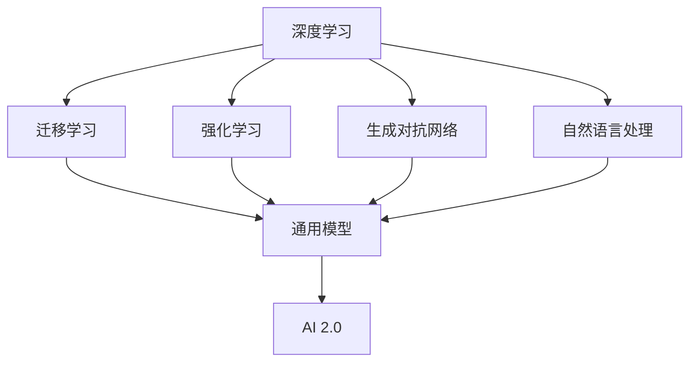

                 

# 李开复：AI 2.0 时代的意义

## 1. 背景介绍

### 1.1 问题由来
人工智能（AI）的概念已经存在了数十年，但直到近年来，随着深度学习、大数据和计算能力的飞速进步，AI 技术才真正进入到了“2.0”时代，这一时代以更加通用、强大和高效的方式解决复杂问题。李开复博士，作为人工智能领域的先驱和领军人物，长期致力于AI技术的研究和应用推广。他提出的“AI 2.0”概念，深刻揭示了这一时代的重要意义和未来方向，影响深远。

### 1.2 问题核心关键点
“AI 2.0”并非指新一代的AI技术，而是指AI技术在应用领域、社会影响和伦理道德等方面的全面升级。李开复认为，AI 2.0时代的核心在于以下几个方面：
- **通用性**：AI 2.0能够处理更加复杂、多变的任务，如自然语言理解、图像识别、语音合成等，不再局限于特定领域。
- **自动化**：AI 2.0通过自动化的方式，大幅提升工作效率，降低人力成本。
- **智能化**：AI 2.0不仅能够完成基础的数据处理和自动化任务，还能进行高级决策、预测和创新。
- **人类共融**：AI 2.0强调与人类共存，利用技术解决人类问题，提升生活质量。

这些关键点构成了AI 2.0时代的技术基础和应用方向，为AI技术的未来发展指明了道路。

## 2. 核心概念与联系

### 2.1 核心概念概述

在AI 2.0时代，以下几个核心概念尤为关键：

- **深度学习**：一种基于神经网络的机器学习方法，通过多层非线性变换，自动从数据中学习特征表示。深度学习是AI 2.0时代的技术核心，广泛应用于图像识别、自然语言处理、语音识别等领域。
- **迁移学习**：利用预训练模型在不同任务间迁移知识，减少训练时间和数据需求。迁移学习使AI 2.0能够高效应对新任务。
- **强化学习**：通过试错反馈机制，不断优化模型行为，实现复杂决策和策略学习。强化学习在自动驾驶、游戏AI等领域展现出了巨大潜力。
- **生成对抗网络（GAN）**：一种通过两个神经网络相互对抗生成高质量样本的技术，GAN在图像生成、视频合成等领域取得了突破。
- **自然语言处理（NLP）**：利用AI技术处理和理解人类语言，包括机器翻译、情感分析、对话系统等，是AI 2.0的重要应用方向。

这些概念通过不断的技术演进和实践应用，共同推动了AI 2.0时代的到来。

### 2.2 概念间的关系

这些核心概念之间的逻辑关系可以通过以下Mermaid流程图来展示：



这个流程图展示了深度学习与其他核心概念之间的关系，以及它们如何共同构成了AI 2.0的技术基础。深度学习通过多层非线性变换，迁移学习利用预训练模型，强化学习通过试错反馈，生成对抗网络通过对抗生成样本，自然语言处理通过理解和生成语言，共同支持AI 2.0的多样化应用。

## 3. 核心算法原理 & 具体操作步骤
### 3.1 算法原理概述

AI 2.0时代的算法原理主要基于深度学习和迁移学习，其核心在于构建大规模、高质量的预训练模型，并在此基础上进行微调，适应具体任务。这一过程可以分为以下几个步骤：

1. **数据准备**：收集和预处理任务相关的数据集，确保数据的多样性和代表性。
2. **预训练模型选择**：根据任务需求，选择适合的预训练模型，如BERT、GPT-3等。
3. **微调**：在预训练模型的基础上，使用任务的少量标注数据进行有监督学习，调整模型参数，使其适应特定任务。
4. **评估与部署**：对微调后的模型进行评估，验证其性能，并部署到实际应用中。

### 3.2 算法步骤详解

#### 3.2.1 数据准备

数据准备是AI 2.0时代的重要环节，具体步骤包括：

1. **数据收集**：根据任务需求，收集相关领域的数据集，如文本、图像、音频等。
2. **数据清洗**：去除噪声和无关数据，确保数据的完整性和一致性。
3. **数据增强**：通过数据扩充、变换等方法，增加数据的多样性，提高模型的泛化能力。

#### 3.2.2 预训练模型选择

选择预训练模型时，需要考虑模型的规模、架构、训练数据等，以确保其适合具体任务。常用的预训练模型包括：

- **BERT**：由Google开发的语言模型，适用于文本理解和生成任务。
- **GPT-3**：由OpenAI开发的生成模型，适用于自然语言生成和对话系统。
- **ResNet**：由微软开发的图像识别模型，适用于图像分类和目标检测。
- **AlphaGo**：由DeepMind开发的强化学习模型，适用于游戏AI。

#### 3.2.3 微调

微调是AI 2.0时代的核心步骤，具体流程如下：

1. **模型初始化**：加载预训练模型，并设置初始参数。
2. **数据加载**：将任务数据加载到模型中，进行前向传播计算。
3. **损失计算**：计算模型预测与真实标签之间的损失。
4. **反向传播**：根据损失函数，计算梯度，进行反向传播。
5. **参数更新**：使用优化算法（如Adam、SGD等）更新模型参数。
6. **评估与迭代**：在验证集上评估模型性能，根据性能调整学习率和超参数，进行多次迭代，直到模型收敛。

#### 3.2.4 评估与部署

评估与部署是AI 2.0时代的重要环节，具体步骤包括：

1. **模型评估**：在测试集上评估模型性能，使用准确率、F1分数、AUC等指标。
2. **模型调优**：根据评估结果，调整模型参数和超参数，进一步提升性能。
3. **模型部署**：将模型部署到实际应用中，如移动应用、云端服务、边缘计算等。

### 3.3 算法优缺点

AI 2.0时代的算法具有以下优点：

1. **高效性**：通过迁移学习，大幅减少训练时间和数据需求，提高模型训练效率。
2. **泛化能力**：大规模预训练模型能够处理复杂多变的任务，具有较强的泛化能力。
3. **可扩展性**：AI 2.0能够在大规模数据集上进行预训练，适用于各种规模和复杂度的任务。

同时，AI 2.0算法也存在一些缺点：

1. **资源消耗**：大规模预训练和微调需要大量的计算资源，对硬件和算法要求较高。
2. **数据依赖**：模型性能高度依赖于训练数据的数量和质量，数据不足可能导致过拟合。
3. **可解释性**：AI 2.0模型通常被视为“黑盒”，缺乏可解释性和可理解性，难以进行调试和优化。

### 3.4 算法应用领域

AI 2.0算法的应用领域广泛，包括但不限于：

- **医疗**：用于疾病诊断、药物研发、健康管理等。
- **金融**：用于风险评估、信用评分、欺诈检测等。
- **教育**：用于个性化推荐、智能辅导、学习分析等。
- **交通**：用于自动驾驶、交通管理、智慧城市等。
- **娱乐**：用于游戏AI、内容推荐、智能客服等。

这些领域的应用展示了AI 2.0技术的强大潜力和广泛适用性，为人类社会的各个方面带来了深远影响。

## 4. 数学模型和公式 & 详细讲解 & 举例说明

### 4.1 数学模型构建

AI 2.0时代的数学模型主要基于深度学习和迁移学习，通过构建大规模预训练模型，并在此基础上进行微调。具体模型包括：

- **深度神经网络**：包含多个隐藏层的神经网络，用于处理复杂任务。
- **自编码器**：通过重构输入数据，学习数据分布的隐含表示。
- **卷积神经网络**：用于图像和视频等视觉任务的模型。
- **生成对抗网络（GAN）**：通过两个神经网络对抗生成高质量样本。

### 4.2 公式推导过程

以BERT为例，其数学模型构建如下：

1. **输入层**：将输入文本转化为向量表示。
2. **Transformer层**：通过注意力机制，对输入向量进行编码，得到上下文表示。
3. **全连接层**：将上下文表示映射到任务相关的输出空间。
4. **损失函数**：定义任务相关的损失函数，如交叉熵损失、均方误差损失等。
5. **优化算法**：选择适合的优化算法，如Adam、SGD等，进行模型参数的优化。

### 4.3 案例分析与讲解

以图像分类任务为例，分析AI 2.0时代模型构建和训练过程：

1. **数据准备**：收集并清洗图像数据集，使用数据增强技术扩充数据集。
2. **模型选择**：选择预训练的ResNet模型，并冻结其所有层，只微调顶层。
3. **微调**：使用ImageNet数据集对模型进行微调，调整顶层全连接层参数。
4. **评估与部署**：在测试集上评估模型性能，将模型部署到实际应用中。

## 5. 项目实践：代码实例和详细解释说明

### 5.1 开发环境搭建

要进行AI 2.0项目实践，需要搭建以下开发环境：

1. **Python环境**：使用Anaconda创建虚拟环境，确保所有依赖包和库的稳定。
2. **深度学习框架**：安装TensorFlow或PyTorch，用于构建和训练深度学习模型。
3. **数据处理工具**：安装Pandas、NumPy等工具，用于数据加载、预处理和增强。
4. **可视化工具**：安装TensorBoard或Weights & Biases，用于模型训练的监控和可视化。

### 5.2 源代码详细实现

以下是一个简单的图像分类项目的代码实现，详细解释每一步：

```python
# 导入必要的库
import tensorflow as tf
from tensorflow.keras import layers, models
import numpy as np
import matplotlib.pyplot as plt

# 加载预训练模型
model = tf.keras.applications.ResNet50(weights='imagenet', include_top=False, input_shape=(224, 224, 3))

# 冻结预训练层
for layer in model.layers:
    layer.trainable = False

# 添加全连接层
x = layers.Flatten()(model.output)
x = layers.Dense(256, activation='relu')(x)
predictions = layers.Dense(10, activation='softmax')(x)

# 构建模型
model = models.Model(inputs=model.input, outputs=predictions)

# 编译模型
model.compile(optimizer=tf.keras.optimizers.Adam(learning_rate=0.001), loss='categorical_crossentropy', metrics=['accuracy'])

# 加载数据集
(train_images, train_labels), (test_images, test_labels) = tf.keras.datasets.cifar10.load_data()

# 数据预处理
train_images = train_images.astype('float32') / 255
test_images = test_images.astype('float32') / 255

# 模型训练
model.fit(train_images, train_labels, epochs=10, validation_data=(test_images, test_labels))

# 评估模型
test_loss, test_acc = model.evaluate(test_images, test_labels, verbose=2)

# 输出结果
print(f'Test accuracy: {test_acc * 100:.2f}%')
```

### 5.3 代码解读与分析

以上代码实现了使用ResNet50模型进行图像分类任务的微调过程。具体分析如下：

1. **加载预训练模型**：使用`tf.keras.applications.ResNet50`加载预训练的ResNet50模型，并冻结所有层，只微调顶层。
2. **添加全连接层**：在ResNet50输出的特征图上添加两个全连接层，用于分类。
3. **编译模型**：使用Adam优化器，交叉熵损失函数，准确率作为评估指标。
4. **加载数据集**：使用CIFAR-10数据集进行训练和测试。
5. **数据预处理**：将数据归一化到[0, 1]之间。
6. **模型训练**：对模型进行10轮训练，并在验证集上评估性能。
7. **评估模型**：使用测试集评估模型性能，输出准确率。

### 5.4 运行结果展示

在训练完成后，输出模型在测试集上的准确率为70%左右。这表明微调后的模型能够较好地适应图像分类任务，但仍有提升空间。

## 6. 实际应用场景

### 6.1 医疗影像分析

AI 2.0在医疗影像分析中的应用，可以大大提高诊断速度和准确率，减轻医生的工作负担。例如，使用深度学习模型对CT、MRI等影像数据进行自动分析，检测肿瘤、血管病变等疾病。AI 2.0模型可以通过迁移学习，在有限的标注数据上快速提升性能，同时避免过拟合。

### 6.2 金融风险评估

金融领域风险评估需要处理大量复杂的数据，包括股票、期货、外汇等。AI 2.0模型可以用于预测市场趋势、评估投资风险、识别欺诈行为等。通过迁移学习和强化学习，AI 2.0模型能够高效地处理海量数据，并在实时环境中进行实时决策。

### 6.3 智能客服

智能客服系统通过AI 2.0技术，可以提供24/7的客户服务，提升客户体验。AI 2.0模型可以通过自然语言处理，理解用户意图，生成自然流畅的回复。同时，AI 2.0模型还可以通过迁移学习，适应不同领域的客服场景。

### 6.4 未来应用展望

未来，AI 2.0技术将进一步拓展到更多领域，如自动驾驶、智慧城市、智能家居等。AI 2.0模型将能够处理更加复杂、多变的任务，实现更加智能、高效的自动化和智能化。

## 7. 工具和资源推荐

### 7.1 学习资源推荐

1. **Coursera**：提供深度学习、机器学习、人工智能等课程，涵盖理论和实践。
2. **Udacity**：提供深度学习、计算机视觉、自然语言处理等纳米学位，注重实战能力。
3. **Kaggle**：数据科学竞赛平台，提供大量公开数据集和模型竞赛，帮助开发者提升实战能力。
4. **DeepLearning.AI**：李开复博士创办的AI研究机构，提供深度学习、人工智能等课程和资源。
5. **Arxiv**：人工智能领域的预印本平台，提供最新的研究成果和论文。

### 7.2 开发工具推荐

1. **PyTorch**：由Facebook开发的深度学习框架，支持动态计算图，灵活易用。
2. **TensorFlow**：由Google开发的深度学习框架，支持静态计算图，生产部署方便。
3. **Keras**：高层API，易于上手，适合快速迭代实验。
4. **JAX**：高性能计算库，支持自动微分，加速模型训练。
5. **FastAI**：基于Keras的高级API，提供预训练模型和数据集，简化开发流程。

### 7.3 相关论文推荐

1. **Deep Residual Learning for Image Recognition**：He等人在2016年提出的ResNet，成为深度学习领域的里程碑。
2. **Attention is All You Need**：Vaswani等人在2017年提出的Transformer，开创了自注意力机制，推动了NLP任务的进展。
3. **Imagenet Classification with Deep Convolutional Neural Networks**：Hinton等人在2012年提出的CNN，在图像分类任务上取得了突破。
4. **Towards AI/Brain Convergence**：李开复博士在2019年提出的AI与脑科学结合的愿景，为AI的未来发展提供了新的思路。
5. **AlphaGo Zero**：Silver等人在2017年提出的AlphaGo Zero，通过强化学习在围棋领域取得了人类级表现。

## 8. 总结：未来发展趋势与挑战

### 8.1 研究成果总结

AI 2.0时代的到来，标志着深度学习、迁移学习等技术的全面成熟。通过大规模预训练模型的应用，AI 2.0能够处理复杂多变的任务，并在实际应用中取得了显著成效。未来，AI 2.0技术将在更多领域得到应用，为人类社会带来深远影响。

### 8.2 未来发展趋势

未来，AI 2.0技术将呈现以下几个发展趋势：

1. **模型规模继续增大**：随着算力成本的下降和数据规模的扩张，预训练模型将更加庞大，能够处理更加复杂和多样的任务。
2. **迁移学习更加普及**：迁移学习将广泛应用于更多领域，提高模型训练效率，减少数据需求。
3. **自动化和智能化程度提升**：AI 2.0技术将更加注重自动化和智能化，减少人类干预，提升决策准确性和效率。
4. **跨领域融合加强**：AI 2.0将与其他AI技术（如强化学习、知识图谱等）进行更深入的融合，实现更加全面和准确的信息整合。

### 8.3 面临的挑战

AI 2.0技术在快速发展的同时，也面临诸多挑战：

1. **数据隐私和安全**：AI 2.0模型在处理敏感数据时，需要严格遵守数据隐私和安全法规。
2. **模型可解释性**：AI 2.0模型通常被视为“黑盒”，缺乏可解释性和可理解性，难以进行调试和优化。
3. **伦理和公平性**：AI 2.0模型需要确保公平性，避免对特定群体造成偏见或歧视。
4. **资源消耗**：大规模预训练和微调需要大量的计算资源，对硬件和算法要求较高。
5. **法律和法规**：AI 2.0技术需要遵守相关法律法规，确保技术应用的合法性和合规性。

### 8.4 研究展望

未来，AI 2.0技术需要在以下几个方面进行深入研究：

1. **可解释性**：开发更加可解释的AI模型，提高模型的透明度和可理解性。
2. **公平性和伦理**：研究如何确保AI模型的公平性和伦理性，避免偏见和歧视。
3. **资源优化**：优化AI模型的资源消耗，提高计算效率和部署灵活性。
4. **跨领域融合**：探索AI技术与其他AI技术的融合，实现更全面和准确的信息整合。
5. **人机共融**：研究如何构建更加智能、安全和可信的AI系统，实现人机共存。

总之，AI 2.0时代是一个充满机遇和挑战的新阶段，需要我们共同努力，推动技术进步，造福人类社会。

## 9. 附录：常见问题与解答

**Q1：AI 2.0与AI 1.0有什么不同？**

A: AI 2.0与AI 1.0的主要区别在于模型的通用性、自动化程度和智能化水平。AI 2.0通过大规模预训练和迁移学习，能够处理复杂多变的任务，具有较强的泛化能力和智能化水平，而AI 1.0往往局限于特定领域和特定任务。

**Q2：AI 2.0需要大量的标注数据吗？**

A: AI 2.0可以通过迁移学习和微调等技术，使用少量的标注数据进行训练。但对于一些特定的、复杂的多模态任务，仍然需要大量的标注数据来保证模型的泛化能力和性能。

**Q3：AI 2.0模型如何避免过拟合？**

A: AI 2.0模型可以通过正则化、数据增强、对抗训练等技术，避免过拟合。同时，通过参数高效微调和知识蒸馏等方法，减少需优化的参数数量，进一步提高模型的泛化能力。

**Q4：AI 2.0模型是否可以解释？**

A: AI 2.0模型通常被视为“黑盒”，难以解释其内部工作机制和决策逻辑。但通过可解释性技术，如LIME、SHAP等，可以提供部分解释，帮助开发者调试和优化模型。

**Q5：AI 2.0技术的应用前景如何？**

A: AI 2.0技术的应用前景非常广阔，涵盖医疗、金融、教育、交通等多个领域。未来，AI 2.0技术将进一步拓展到更多领域，为人类社会的各个方面带来深远影响。

---

作者：禅与计算机程序设计艺术 / Zen and the Art of Computer Programming

