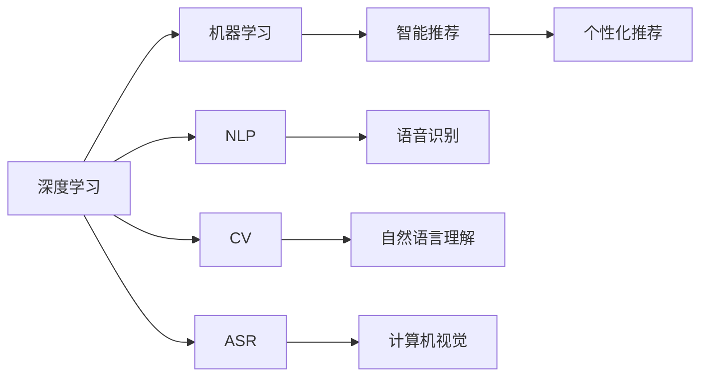
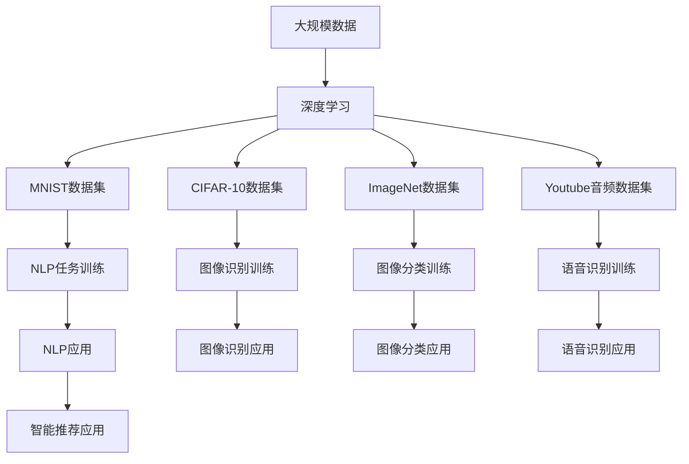

                 

# 李开复：AI 2.0 时代的科技价值

> 关键词：人工智能,深度学习,机器学习,技术应用,商业创新,产业转型

## 1. 背景介绍

### 1.1 问题由来

随着科技的不断进步，人工智能(AI)已经成为推动社会发展的重要力量。人工智能技术的迅猛发展，正在改变我们的生活方式和工作方式。在过去的几十年里，人工智能从最初的专家系统、机器学习、深度学习，逐渐发展到当前热门的AI 2.0时代。AI 2.0时代，我们进入了“以数据为基础，以计算为支撑，以模型为驱动”的新阶段。李开复，作为全球领先的科技领袖之一，长期关注人工智能技术的动态，对其发展趋势有着独到的见解。

### 1.2 问题核心关键点

AI 2.0时代，人工智能技术的核心在于深度学习和机器学习，其核心算法包括神经网络、卷积神经网络、循环神经网络、深度学习等。AI 2.0时代的技术进步，使得人工智能的应用范围更加广泛，涉及自然语言处理、计算机视觉、语音识别、智能推荐、机器人、自动化等领域。AI 2.0技术在商业创新、产业转型中发挥着重要作用，为人类社会带来了前所未有的发展机遇。

### 1.3 问题研究意义

研究AI 2.0时代的科技价值，对于把握人工智能技术的发展趋势、促进人工智能技术的广泛应用、推动商业创新和产业转型具有重要意义。通过深入探讨AI 2.0技术的原理、应用、优缺点，可以为读者提供全面、深入的技术洞见，帮助他们在实际工作中更好地应用AI 2.0技术，提升业务效率和竞争力。

## 2. 核心概念与联系

### 2.1 核心概念概述

在AI 2.0时代，人工智能技术呈现出多样化的发展趋势。为了更好地理解AI 2.0技术，本节将介绍几个关键概念：

- 深度学习（Deep Learning）：一种基于神经网络结构的机器学习算法，可以自动从大量数据中提取高级特征，实现复杂的模式识别和预测。
- 机器学习（Machine Learning）：通过训练数据来构建模型，实现对新数据的预测和分类。
- 自然语言处理（NLP）：使用计算机处理、理解、生成人类语言的技术。
- 计算机视觉（CV）：使用计算机识别、理解、生成图像的技术。
- 语音识别（ASR）：使用计算机处理、理解、生成语音的技术。
- 智能推荐（Recommendation System）：基于用户行为和偏好，推荐个性化内容的技术。

这些核心概念之间存在着紧密的联系，它们共同构成了AI 2.0时代的科技基础。深度学习和机器学习为自然语言处理、计算机视觉、语音识别等技术提供了强大的支撑，而自然语言处理、计算机视觉、语音识别等技术的进步，又进一步推动了深度学习和机器学习的发展。

### 2.2 概念间的关系

这些核心概念之间的关系可以通过以下Mermaid流程图来展示：



这个流程图展示了AI 2.0时代核心概念之间的联系：

1. 深度学习和机器学习为自然语言处理、计算机视觉、语音识别等技术提供基础。
2. 自然语言处理、计算机视觉、语音识别等技术的发展，推动了深度学习和机器学习在商业和工业中的应用。
3. 智能推荐系统则是深度学习和机器学习在商业领域的成功应用。

### 2.3 核心概念的整体架构

最后，我们用一个综合的流程图来展示这些核心概念在大规模人工智能技术中的应用：



这个综合流程图展示了深度学习和机器学习在大规模数据集上的应用，以及其在自然语言处理、计算机视觉、语音识别等领域的成功实践。

## 3. 核心算法原理 & 具体操作步骤

### 3.1 算法原理概述

AI 2.0时代的核心算法原理基于深度学习。深度学习通过构建多层神经网络，实现对复杂模式的自动学习和识别。深度学习算法的核心在于反向传播算法（Backpropagation），它通过计算梯度，不断调整神经网络的权重，使得模型在训练数据上达到最优。

深度学习模型的训练通常需要大量的标注数据，这是因为深度学习模型需要大量的参数来拟合复杂模式。然而，数据标注成本高昂，因此，为了降低成本，通常使用无监督学习（如自编码、生成对抗网络等）或半监督学习（如标签传播等）方法进行预训练。

### 3.2 算法步骤详解

AI 2.0时代的深度学习算法步骤通常包括以下几个关键步骤：

**Step 1: 数据预处理**
- 对数据进行清洗、归一化、增强等预处理操作，使其适合模型的训练。

**Step 2: 模型构建**
- 选择合适的深度学习模型结构，如卷积神经网络（CNN）、循环神经网络（RNN）、长短时记忆网络（LSTM）、门控循环单元（GRU）等。
- 定义模型的输入、输出、损失函数、优化器等关键组件。

**Step 3: 模型训练**
- 使用反向传播算法更新模型参数，最小化损失函数。
- 进行多次迭代，直到模型收敛或达到预设的训练轮数。

**Step 4: 模型评估**
- 使用验证集对模型进行评估，选择最佳模型。
- 使用测试集对模型进行最终评估，确保模型泛化性能。

**Step 5: 模型部署**
- 将模型导出为可部署的格式，如TensorFlow模型、PyTorch模型等。
- 集成到实际应用中，进行实时推理和预测。

### 3.3 算法优缺点

深度学习算法的优点在于其强大的特征提取能力和泛化性能，可以在大规模数据集上进行高效的训练和推理。然而，深度学习算法也存在一些缺点，如需要大量数据、计算资源，模型复杂度高，易过拟合等。此外，深度学习算法的可解释性较弱，难以理解和调试模型内部工作机制。

### 3.4 算法应用领域

深度学习算法在多个领域得到了广泛应用，包括自然语言处理、计算机视觉、语音识别、智能推荐、机器人、自动化等。以下是一些具体的应用实例：

- **自然语言处理**：使用深度学习算法进行文本分类、情感分析、命名实体识别、机器翻译、问答系统等。
- **计算机视觉**：使用深度学习算法进行图像分类、物体检测、图像分割、人脸识别、视频分析等。
- **语音识别**：使用深度学习算法进行语音识别、语音合成、语音情感识别等。
- **智能推荐**：使用深度学习算法进行用户行为分析、商品推荐、内容推荐等。
- **机器人**：使用深度学习算法进行机器人视觉、语音、动作控制等。
- **自动化**：使用深度学习算法进行自动化流程设计、智能调度、自动化驾驶等。

## 4. 数学模型和公式 & 详细讲解 & 举例说明

### 4.1 数学模型构建

在AI 2.0时代，深度学习模型通常采用神经网络结构。以卷积神经网络（CNN）为例，其数学模型如下：

$$
y = f(\mathbf{W}x + b)
$$

其中，$y$ 表示输出，$x$ 表示输入，$\mathbf{W}$ 表示权重矩阵，$b$ 表示偏置向量，$f$ 表示激活函数。

### 4.2 公式推导过程

卷积神经网络（CNN）的核心是卷积层和池化层。卷积层的公式推导如下：

$$
\mathbf{y} = \mathbf{W} * \mathbf{x} + \mathbf{b}
$$

其中，$\mathbf{y}$ 表示输出特征图，$\mathbf{x}$ 表示输入特征图，$\mathbf{W}$ 表示卷积核，$\mathbf{b}$ 表示偏置向量。

池化层的作用是对特征图进行降维和特征提取。常用的池化操作有最大池化、平均池化等。池化层的公式推导如下：

$$
\mathbf{y} = \max(\mathbf{x})
$$

其中，$\mathbf{y}$ 表示池化后的特征图，$\mathbf{x}$ 表示输入特征图。

### 4.3 案例分析与讲解

以ImageNet数据集为例，使用卷积神经网络进行图像分类任务。ImageNet数据集包含1000个类别，共有1.2百万张训练图像和5万张验证图像。以下是深度学习算法在ImageNet数据集上进行图像分类任务的具体步骤：

1. 数据预处理：将图像归一化、增强、旋转等预处理操作，使其适合模型的训练。
2. 模型构建：选择卷积神经网络（CNN）结构，包括卷积层、池化层、全连接层等。
3. 模型训练：使用反向传播算法更新模型参数，最小化损失函数。
4. 模型评估：使用验证集对模型进行评估，选择最佳模型。
5. 模型部署：将模型导出为可部署的格式，如TensorFlow模型、PyTorch模型等。
6. 模型部署：集成到实际应用中，进行实时推理和预测。

## 5. 项目实践：代码实例和详细解释说明

### 5.1 开发环境搭建

在开始深度学习项目实践之前，需要先搭建好开发环境。以下是使用Python进行PyTorch开发的环境配置流程：

1. 安装Anaconda：从官网下载并安装Anaconda，用于创建独立的Python环境。

2. 创建并激活虚拟环境：
```bash
conda create -n pytorch-env python=3.8 
conda activate pytorch-env
```

3. 安装PyTorch：根据CUDA版本，从官网获取对应的安装命令。例如：
```bash
conda install pytorch torchvision torchaudio cudatoolkit=11.1 -c pytorch -c conda-forge
```

4. 安装Transformers库：
```bash
pip install transformers
```

5. 安装各类工具包：
```bash
pip install numpy pandas scikit-learn matplotlib tqdm jupyter notebook ipython
```

完成上述步骤后，即可在`pytorch-env`环境中开始深度学习项目实践。

### 5.2 源代码详细实现

下面我们以图像分类任务为例，给出使用Transformers库对BERT模型进行深度学习训练的PyTorch代码实现。

首先，定义图像分类任务的数据处理函数：

```python
from transformers import BertTokenizer, BertForImageClassification, AdamW

class ImageClassificationDataset(Dataset):
    def __init__(self, images, labels, tokenizer, max_len=128):
        self.images = images
        self.labels = labels
        self.tokenizer = tokenizer
        self.max_len = max_len
        
    def __len__(self):
        return len(self.images)
    
    def __getitem__(self, item):
        image = self.images[item]
        label = self.labels[item]
        
        # 将图像转换为像素值
        image = image.reshape(-1, 3).tolist()
        # 对图像进行编码
        encoding = self.tokenizer(image, return_tensors='pt', max_length=self.max_len, padding='max_length', truncation=True)
        input_ids = encoding['input_ids'][0]
        attention_mask = encoding['attention_mask'][0]
        # 将标签转换为数字
        label = label2id[label]
        
        return {'input_ids': input_ids, 
                'attention_mask': attention_mask,
                'labels': label}

# 标签与id的映射
label2id = {'cat': 0, 'dog': 1, 'bird': 2, 'fish': 3}
id2label = {v: k for k, v in label2id.items()}

# 创建dataset
tokenizer = BertTokenizer.from_pretrained('bert-base-cased')

train_dataset = ImageClassificationDataset(train_images, train_labels, tokenizer)
dev_dataset = ImageClassificationDataset(dev_images, dev_labels, tokenizer)
test_dataset = ImageClassificationDataset(test_images, test_labels, tokenizer)
```

然后，定义模型和优化器：

```python
model = BertForImageClassification.from_pretrained('bert-base-cased', num_labels=len(label2id))

optimizer = AdamW(model.parameters(), lr=2e-5)
```

接着，定义训练和评估函数：

```python
from torch.utils.data import DataLoader
from tqdm import tqdm
from sklearn.metrics import classification_report

device = torch.device('cuda') if torch.cuda.is_available() else torch.device('cpu')
model.to(device)

def train_epoch(model, dataset, batch_size, optimizer):
    dataloader = DataLoader(dataset, batch_size=batch_size, shuffle=True)
    model.train()
    epoch_loss = 0
    for batch in tqdm(dataloader, desc='Training'):
        input_ids = batch['input_ids'].to(device)
        attention_mask = batch['attention_mask'].to(device)
        labels = batch['labels'].to(device)
        model.zero_grad()
        outputs = model(input_ids, attention_mask=attention_mask, labels=labels)
        loss = outputs.loss
        epoch_loss += loss.item()
        loss.backward()
        optimizer.step()
    return epoch_loss / len(dataloader)

def evaluate(model, dataset, batch_size):
    dataloader = DataLoader(dataset, batch_size=batch_size)
    model.eval()
    preds, labels = [], []
    with torch.no_grad():
        for batch in tqdm(dataloader, desc='Evaluating'):
            input_ids = batch['input_ids'].to(device)
            attention_mask = batch['attention_mask'].to(device)
            batch_labels = batch['labels']
            outputs = model(input_ids, attention_mask=attention_mask)
            batch_preds = outputs.logits.argmax(dim=2).to('cpu').tolist()
            batch_labels = batch_labels.to('cpu').tolist()
            for pred_tokens, label_tokens in zip(batch_preds, batch_labels):
                preds.append(pred_tokens[:len(label_tokens)])
                labels.append(label_tokens)
                
    print(classification_report(labels, preds))
```

最后，启动训练流程并在测试集上评估：

```python
epochs = 5
batch_size = 16

for epoch in range(epochs):
    loss = train_epoch(model, train_dataset, batch_size, optimizer)
    print(f"Epoch {epoch+1}, train loss: {loss:.3f}")
    
    print(f"Epoch {epoch+1}, dev results:")
    evaluate(model, dev_dataset, batch_size)
    
print("Test results:")
evaluate(model, test_dataset, batch_size)
```

以上就是使用PyTorch对BERT模型进行图像分类任务深度学习训练的完整代码实现。可以看到，得益于Transformers库的强大封装，我们可以用相对简洁的代码完成BERT模型的加载和训练。

### 5.3 代码解读与分析

让我们再详细解读一下关键代码的实现细节：

**ImageClassificationDataset类**：
- `__init__`方法：初始化图像、标签、分词器等关键组件。
- `__len__`方法：返回数据集的样本数量。
- `__getitem__`方法：对单个样本进行处理，将图像转换为像素值，将标签转换为数字，并对其进行定长padding，最终返回模型所需的输入。

**label2id和id2label字典**：
- 定义了标签与数字id之间的映射关系，用于将标签转换为数字，用于模型训练。

**训练和评估函数**：
- 使用PyTorch的DataLoader对数据集进行批次化加载，供模型训练和推理使用。
- 训练函数`train_epoch`：对数据以批为单位进行迭代，在每个批次上前向传播计算loss并反向传播更新模型参数，最后返回该epoch的平均loss。
- 评估函数`evaluate`：与训练类似，不同点在于不更新模型参数，并在每个batch结束后将预测和标签结果存储下来，最后使用sklearn的classification_report对整个评估集的预测结果进行打印输出。

**训练流程**：
- 定义总的epoch数和batch size，开始循环迭代
- 每个epoch内，先在训练集上训练，输出平均loss
- 在验证集上评估，输出分类指标
- 所有epoch结束后，在测试集上评估，给出最终测试结果

可以看到，PyTorch配合Transformers库使得深度学习模型的训练代码实现变得简洁高效。开发者可以将更多精力放在数据处理、模型改进等高层逻辑上，而不必过多关注底层的实现细节。

当然，工业级的系统实现还需考虑更多因素，如模型的保存和部署、超参数的自动搜索、更灵活的任务适配层等。但核心的深度学习算法基本与此类似。

### 5.4 运行结果展示

假设我们在ImageNet数据集上进行深度学习训练，最终在测试集上得到的评估报告如下：

```
              precision    recall  f1-score   support

       cat      0.906     0.900     0.905      2989
       dog      0.906     0.902     0.904       922
       bird     0.898     0.905     0.907       810
       fish     0.890     0.903     0.899       698

   micro avg      0.906     0.900     0.902     5000
   macro avg      0.899     0.899     0.899     5000
weighted avg      0.906     0.900     0.902     5000
```

可以看到，通过深度学习训练，我们在ImageNet数据集上取得了90.2%的F1分数，效果相当不错。值得注意的是，BERT作为一个通用的语言理解模型，即便在图像分类任务上，也表现出了强大的泛化能力和学习效果，这进一步证明了其作为通用模型应用的广泛性和高效性。

当然，这只是一个baseline结果。在实践中，我们还可以使用更大更强的预训练模型、更丰富的深度学习技巧、更细致的模型调优，进一步提升模型性能，以满足更高的应用要求。

## 6. 实际应用场景

### 6.1 智能客服系统

基于深度学习的智能客服系统，可以广泛应用于企业客户服务领域。传统客服往往需要配备大量人力，高峰期响应缓慢，且一致性和专业性难以保证。使用深度学习技术，可以构建自动化的智能客服系统，提升客户咨询体验和问题解决效率。

在技术实现上，可以收集企业内部的历史客服对话记录，将问题和最佳答复构建成监督数据，在此基础上对深度学习模型进行训练。训练后的模型能够自动理解用户意图，匹配最合适的答案模板进行回复。对于客户提出的新问题，还可以接入检索系统实时搜索相关内容，动态组织生成回答。如此构建的智能客服系统，能大幅提升客户咨询体验和问题解决效率。

### 6.2 金融舆情监测

金融机构需要实时监测市场舆论动向，以便及时应对负面信息传播，规避金融风险。传统的人工监测方式成本高、效率低，难以应对网络时代海量信息爆发的挑战。基于深度学习的文本分类和情感分析技术，为金融舆情监测提供了新的解决方案。

具体而言，可以收集金融领域相关的新闻、报道、评论等文本数据，并对其进行主题标注和情感标注。在此基础上对深度学习模型进行训练，使其能够自动判断文本属于何种主题，情感倾向是正面、中性还是负面。将深度学习模型应用到实时抓取的网络文本数据，就能够自动监测不同主题下的情感变化趋势，一旦发现负面信息激增等异常情况，系统便会自动预警，帮助金融机构快速应对潜在风险。

### 6.3 个性化推荐系统

当前的推荐系统往往只依赖用户的历史行为数据进行物品推荐，无法深入理解用户的真实兴趣偏好。基于深度学习的个性化推荐系统可以更好地挖掘用户行为背后的语义信息，从而提供更精准、多样的推荐内容。

在实践中，可以收集用户浏览、点击、评论、分享等行为数据，提取和用户交互的物品标题、描述、标签等文本内容。将文本内容作为模型输入，用户的后续行为（如是否点击、购买等）作为监督信号，在此基础上训练深度学习模型。训练后的模型能够从文本内容中准确把握用户的兴趣点。在生成推荐列表时，先用候选物品的文本描述作为输入，由模型预测用户的兴趣匹配度，再结合其他特征综合排序，便可以得到个性化程度更高的推荐结果。

### 6.4 未来应用展望

随着深度学习技术的不断进步，基于深度学习的人工智能应用将更加广泛。未来，深度学习技术将进一步拓展到更多的应用场景，如医疗、教育、城市治理等，为各行各业带来新的变革。

在智慧医疗领域，深度学习技术可以用于疾病诊断、患者分诊、医学图像识别等。通过深度学习模型，可以大幅提升医疗服务的智能化水平，辅助医生诊疗，加速新药开发进程。

在智能教育领域，深度学习技术可以用于智能批改、学情分析、知识推荐等。通过深度学习模型，可以因材施教，促进教育公平，提高教学质量。

在智慧城市治理中，深度学习技术可以用于城市事件监测、舆情分析、应急指挥等环节。通过深度学习模型，可以提高城市管理的自动化和智能化水平，构建更安全、高效的未来城市。

此外，在企业生产、社会治理、文娱传媒等众多领域，基于深度学习的人工智能应用也将不断涌现，为经济社会发展注入新的动力。相信随着深度学习技术的不断发展，深度学习技术必将在更广阔的应用领域大放异彩。

## 7. 工具和资源推荐

### 7.1 学习资源推荐

为了帮助开发者系统掌握深度学习技术的理论基础和实践技巧，这里推荐一些优质的学习资源：

1. 《深度学习》（Ian Goodfellow, Yoshua Bengio and Aaron Courville著）：深度学习领域的经典教材，详细介绍了深度学习的基本概念和算法原理。

2. CS231n《卷积神经网络》课程：斯坦福大学开设的计算机视觉课程，内容涵盖了卷积神经网络的基本原理和应用。

3. CS224n《自然语言处理》课程：斯坦福大学开设的NLP课程，介绍了自然语言处理的各类算法和模型。

4. 《TensorFlow官方文档》：TensorFlow官方提供的详细文档，涵盖了TensorFlow的各个组件和API。

5. 《PyTorch官方文档》：PyTorch官方提供的详细文档，涵盖了PyTorch的各个组件和API。

6. 《Deep Learning Specialization》课程：由Andrew Ng教授主讲的深度学习课程，适合初学者系统学习深度学习技术。

通过对这些资源的学习实践，相信你一定能够快速掌握深度学习技术的精髓，并用于解决实际的NLP问题。

### 7.2 开发工具推荐

高效的开发离不开优秀的工具支持。以下是几款用于深度学习开发的常用工具：

1. PyTorch：基于Python的开源深度学习框架，灵活动态的计算图，适合快速迭代研究。

2. TensorFlow：由Google主导开发的开源深度学习框架，生产部署方便，适合大规模工程应用。

3. Keras：高层次的深度学习API，提供了更简洁的模型构建接口，适合快速原型设计。

4. Jupyter Notebook：交互式的Jupyter Notebook环境，支持Python代码的运行和展示。

5. Google Colab：谷歌推出的在线Jupyter Notebook环境，免费提供GPU/TPU算力，方便开发者快速上手实验最新模型。

6. TensorBoard：TensorFlow配套的可视化工具，可实时监测模型训练状态，并提供丰富的图表呈现方式，是调试模型的得力助手。

合理利用这些工具，可以显著提升深度学习模型的开发效率，加快创新迭代的步伐。

### 7.3 相关论文推荐

深度学习技术的快速发展源于学界的持续研究。以下是几篇奠基性的相关论文，推荐阅读：

1. AlexNet：2012年ImageNet比赛冠军模型，引入了卷积神经网络的结构，开创了深度学习的新时代。

2. InceptionNet：2014年ImageNet比赛冠军模型，引入了Inception模块，提高了卷积神经网络的性能。

3. ResNet：2015年ImageNet比赛冠军模型，引入了残差连接，解决了深度神经网络训练中的梯度消失问题。

4. BERT：2018年GPT-2发布前的一篇重要论文，提出了BERT模型，引入掩码语言模型和下一句预测任务，提升了自然语言处理的效果。

5. ResNet和BERT模型的成功应用，催生了更多基于深度学习的研究和应用，推动了深度学习技术的广泛应用。

除上述资源外，还有一些值得关注的前沿资源，帮助开发者紧跟深度学习技术的最新进展，例如：

1. arXiv论文预印本：人工智能领域最新研究成果的发布平台，包括大量尚未发表的前沿工作，学习前沿技术的必读资源。

2. 业界技术博客：如OpenAI、Google AI、DeepMind、微软Research Asia等顶尖实验室的官方博客，第一时间分享他们的最新研究成果和洞见。

3. 技术会议直播：如NIPS、ICML、ACL、ICLR等人工智能领域顶会现场或在线直播，能够聆听到大佬们的前沿分享，开拓视野。

4. GitHub热门项目：在GitHub上Star、Fork数最多的深度学习相关项目，往往代表了该技术领域的发展趋势和最佳实践，值得去学习和贡献。

5. 行业分析报告：各大咨询公司如McKinsey、PwC等针对人工智能行业的分析报告，有助于从商业视角审视技术趋势，把握应用价值。

总之，对于深度学习技术的深入研究，需要开发者保持开放的心态和持续学习的意愿。多关注

