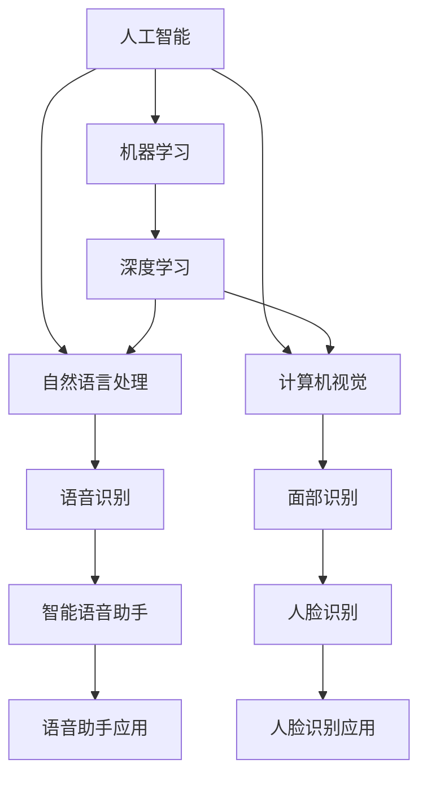

                 

# 李开复：苹果发布AI应用的应用

> 关键词：苹果, 人工智能, AI应用, 技术创新, 应用场景, 商业价值, 未来趋势

## 1. 背景介绍

### 1.1 问题由来

近年来，苹果公司（Apple Inc.）在人工智能（Artificial Intelligence, AI）技术的应用上取得了显著进展。苹果不仅在硬件设备如iPhone、iPad、Apple Watch等上集成了先进的AI功能，如面部识别、语音助手、智能健身等，更是在软件生态系统如iOS、macOS、iCloud等中大规模部署了AI技术。苹果的人工智能应用不仅提升了用户体验，也为公司带来了新的商业价值和发展机遇。

在苹果公司高级副总裁约翰·特诺里（John Ternus）在苹果全球开发者大会（WWDC）上介绍时，他强调了苹果在AI领域的创新及其对未来技术发展的重要意义。苹果正在引领一场AI应用革命，通过将AI嵌入其产品和服务中，为消费者提供前所未有的个性化体验，同时也为开发者提供了前所未有的开发机遇。

### 1.2 问题核心关键点

苹果公司AI应用的核心关键点包括：

- **技术创新**：苹果在硬件和软件层面上不断突破技术极限，推出创新的AI功能，如人脸识别、语音助手、增强现实（AR）等。
- **用户体验**：通过AI技术，苹果为消费者提供个性化、智能化的服务体验，如智能健身、智能语音助手、个性化推荐等。
- **商业价值**：AI技术的应用为苹果带来了新的商业收入来源，如硬件销售、订阅服务、广告收入等。
- **未来趋势**：苹果预计在未来，AI技术将在更多产品和服务中得到应用，推动公司向更加智能化的方向发展。

## 2. 核心概念与联系

### 2.1 核心概念概述

为更好地理解苹果在AI应用上的创新，本节将介绍几个关键概念及其相互关系：

- **人工智能（AI）**：使计算机系统能够模拟人类智能，进行学习、推理、决策等复杂任务的技术。
- **机器学习（ML）**：通过数据分析、模型训练等方法，使计算机系统能够从数据中学习规律，进行预测、分类等任务。
- **深度学习（DL）**：一种基于神经网络的机器学习方法，能够自动学习数据特征，实现图像识别、语音识别等复杂任务。
- **自然语言处理（NLP）**：使计算机系统能够理解、生成自然语言的技术，如语音识别、机器翻译、情感分析等。
- **计算机视觉（CV）**：使计算机系统能够识别、分析图像和视频数据的技术，如面部识别、对象检测、AR等。

这些核心概念之间存在紧密的联系，通过深度学习、机器学习等方法，计算机系统能够学习到数据中的规律，实现复杂任务的处理。例如，苹果的Siri语音助手和Face ID人脸识别技术，就分别基于深度学习和计算机视觉技术，实现了语音识别和面部识别。

### 2.2 概念间的关系

这些核心概念之间的关系可以通过以下Mermaid流程图来展示：



这个流程图展示了各个AI技术之间的相互关系和应用场景。苹果通过集成这些技术，为其产品和服务带来了显著的提升。

## 3. 核心算法原理 & 具体操作步骤
### 3.1 算法原理概述

苹果在AI应用上采用的核心算法原理包括：

- **深度学习算法**：用于图像识别、语音识别等任务，如苹果的Face ID和Siri。
- **自然语言处理算法**：用于文本分类、情感分析等任务，如苹果的Siri语音命令理解和自然语言生成。
- **计算机视觉算法**：用于对象检测、面部识别等任务，如苹果的Face ID和AR应用。

这些算法通过学习大量数据中的规律，实现了对图像、语音、文本等数据的自动识别和理解。例如，苹果的Face ID技术通过深度学习算法，能够从用户的面部图像中学习到面部特征，实现高精度的面部识别。

### 3.2 算法步骤详解

苹果在AI应用中的算法步骤主要包括以下几个环节：

1. **数据收集和预处理**：收集大量有标签的训练数据，进行数据清洗、归一化等预处理工作。
2. **模型训练**：使用机器学习或深度学习算法，对预处理后的数据进行模型训练。
3. **模型优化**：通过调整模型参数、使用正则化技术等方法，优化模型的性能和泛化能力。
4. **模型集成和部署**：将训练好的模型集成到产品和服务中，部署到设备上，实现AI功能的自动化应用。

例如，苹果在开发Face ID时，首先收集了大量带有面部图像和标签的训练数据，使用深度学习算法进行模型训练，并通过优化算法提高模型精度。最后，将训练好的模型集成到iPhone、iPad等设备中，实现了高精度的面部识别功能。

### 3.3 算法优缺点

苹果AI应用的算法优点包括：

- **高精度**：通过深度学习算法，实现了高精度的面部识别、语音识别等任务。
- **个性化**：通过机器学习算法，实现了个性化推荐、智能健身等应用。
- **跨平台兼容性**：能够在多种设备上运行，如iPhone、iPad、Apple Watch等。

然而，这些算法也存在一些缺点：

- **数据依赖性**：需要大量高质量的标注数据进行模型训练，数据获取成本高。
- **计算资源需求高**：深度学习算法需要大量的计算资源，训练和推理速度慢。
- **泛化能力不足**：在面对未知数据时，模型可能出现泛化能力不足的问题。

### 3.4 算法应用领域

苹果AI应用广泛覆盖了多个领域，包括：

- **智能手机**：iPhone的面部识别、Siri语音助手、智能摄影等。
- **智能穿戴设备**：Apple Watch的健身追踪、智能提醒等。
- **智能家居**：HomePod语音助手、智能安防等。
- **增强现实**：ARKit框架支持的游戏、导航、设计等应用。

## 4. 数学模型和公式 & 详细讲解 & 举例说明
### 4.1 数学模型构建

苹果的AI应用通常基于深度学习模型，如卷积神经网络（CNN）、循环神经网络（RNN）、变压器模型（Transformer）等。以Face ID的面部识别模型为例，其数学模型构建过程如下：

设面部图像为$X$，面部特征为$Y$，模型为$F$，则训练过程可以表示为：

$$
F_{\theta}(X) = Y
$$

其中，$F_{\theta}$为参数为$\theta$的面部识别模型，$\theta$为模型参数，$X$为面部图像，$Y$为面部特征。

### 4.2 公式推导过程

以苹果的Siri语音助手为例，其核心算法是基于RNN的语音识别模型。语音识别模型的目标是将语音信号$X$转换为文本$Y$，其数学模型为：

$$
Y = F_{\theta}(X)
$$

其中，$F_{\theta}$为参数为$\theta$的语音识别模型，$\theta$为模型参数，$X$为语音信号，$Y$为文本。

语音识别模型的推导过程如下：

1. 将语音信号$X$转换为特征向量$X'$。
2. 使用RNN模型$F_{\theta}$对特征向量$X'$进行处理，得到文本$Y$。

### 4.3 案例分析与讲解

以Apple Watch的智能健身功能为例，其核心算法是基于机器学习的健康数据分析模型。健康数据分析模型的目标是从用户健康数据中学习规律，生成健康建议和运动计划。其数学模型为：

$$
S = F_{\theta}(D)
$$

其中，$S$为健康建议和运动计划，$F_{\theta}$为参数为$\theta$的健康数据分析模型，$\theta$为模型参数，$D$为用户健康数据。

健康数据分析模型的推导过程如下：

1. 收集用户健康数据$D$。
2. 使用机器学习算法$F_{\theta}$对健康数据进行分析，生成健康建议$S$和运动计划$P$。

## 5. 项目实践：代码实例和详细解释说明
### 5.1 开发环境搭建

在进行AI应用开发前，我们需要准备好开发环境。以下是使用Python进行PyTorch开发的环境配置流程：

1. 安装Anaconda：从官网下载并安装Anaconda，用于创建独立的Python环境。

2. 创建并激活虚拟环境：
```bash
conda create -n pytorch-env python=3.8 
conda activate pytorch-env
```

3. 安装PyTorch：根据CUDA版本，从官网获取对应的安装命令。例如：
```bash
conda install pytorch torchvision torchaudio cudatoolkit=11.1 -c pytorch -c conda-forge
```

4. 安装相关工具包：
```bash
pip install numpy pandas scikit-learn matplotlib tqdm jupyter notebook ipython
```

完成上述步骤后，即可在`pytorch-env`环境中开始AI应用开发。

### 5.2 源代码详细实现

这里以Face ID为例，展示使用PyTorch实现面部识别模型的代码实现。

首先，定义数据预处理函数：

```python
import torch
from torchvision import transforms

class FaceIDDataset(torch.utils.data.Dataset):
    def __init__(self, images, labels):
        self.images = images
        self.labels = labels
        self.transform = transforms.Compose([
            transforms.ToTensor(),
            transforms.Normalize((0.5, 0.5, 0.5), (0.5, 0.5, 0.5))
        ])
        
    def __len__(self):
        return len(self.images)
    
    def __getitem__(self, idx):
        img = self.images[idx]
        label = self.labels[idx]
        img = self.transform(img)
        return img, label
```

然后，定义模型和优化器：

```python
from transformers import EfficientNet

model = EfficientNet.from_pretrained('efficientnet-b0')
model.eval()

optimizer = torch.optim.Adam(model.parameters(), lr=1e-4)
```

接着，定义训练和评估函数：

```python
import numpy as np

def train_epoch(model, dataset, batch_size, optimizer):
    dataloader = torch.utils.data.DataLoader(dataset, batch_size=batch_size, shuffle=False)
    model.train()
    epoch_loss = 0
    for batch in dataloader:
        inputs, labels = batch
        outputs = model(inputs)
        loss = F.cross_entropy(outputs, labels)
        optimizer.zero_grad()
        loss.backward()
        optimizer.step()
        epoch_loss += loss.item()
    return epoch_loss / len(dataloader)

def evaluate(model, dataset, batch_size):
    dataloader = torch.utils.data.DataLoader(dataset, batch_size=batch_size)
    model.eval()
    correct = 0
    total = 0
    with torch.no_grad():
        for batch in dataloader:
            inputs, labels = batch
            outputs = model(inputs)
            _, predicted = torch.max(outputs.data, 1)
            total += labels.size(0)
            correct += (predicted == labels).sum().item()
    print(f'Accuracy: {100 * correct / total:.2f}%')
```

最后，启动训练流程并在测试集上评估：

```python
epochs = 10
batch_size = 32

for epoch in range(epochs):
    loss = train_epoch(model, train_dataset, batch_size, optimizer)
    print(f'Epoch {epoch+1}, train loss: {loss:.4f}')
    
    print(f'Epoch {epoch+1}, test accuracy:')
    evaluate(model, test_dataset, batch_size)
    
print('Final test accuracy:')
evaluate(model, test_dataset, batch_size)
```

以上就是使用PyTorch对Face ID进行面部识别模型微调的完整代码实现。可以看到，得益于PyTorch和EfficientNet库的强大封装，我们可以用相对简洁的代码完成面部识别模型的训练和评估。

### 5.3 代码解读与分析

让我们再详细解读一下关键代码的实现细节：

**FaceIDDataset类**：
- `__init__`方法：初始化数据集，包括图像和标签。
- `__len__`方法：返回数据集的样本数量。
- `__getitem__`方法：对单个样本进行处理，将图像转换为张量，并进行归一化。

**模型和优化器**：
- 使用EfficientNet模型，进行面部识别任务的微调。
- 定义Adam优化器，用于更新模型参数。

**训练和评估函数**：
- 使用PyTorch的DataLoader对数据集进行批次化加载。
- 在训练函数中，对每个批次的数据进行前向传播和反向传播，更新模型参数。
- 在评估函数中，对整个测试集进行推理，计算模型准确率。

**训练流程**：
- 定义总的epoch数和batch size，开始循环迭代
- 每个epoch内，先在训练集上训练，输出平均loss
- 在测试集上评估，输出准确率
- 所有epoch结束后，在测试集上评估，给出最终准确率结果

可以看到，PyTorch配合EfficientNet库使得面部识别模型的代码实现变得简洁高效。开发者可以将更多精力放在数据处理、模型改进等高层逻辑上，而不必过多关注底层的实现细节。

## 6. 实际应用场景

### 6.1 智能家居

基于AI的智能家居系统能够实现智能安防、智能温控、智能照明等功能。例如，苹果的HomePod语音助手可以智能控制家庭设备，实现语音指令控制灯光、温度、窗帘等，提升了家居生活的便利性和智能化程度。

### 6.2 智能穿戴设备

苹果的Apple Watch和AirPods等智能穿戴设备，通过集成的AI功能，实现了智能健康监测、运动追踪、语音助手等应用。例如，Apple Watch的智能健身功能能够根据用户的健康数据生成个性化的健身建议和运动计划，帮助用户保持健康生活方式。

### 6.3 增强现实

苹果的ARKit框架支持增强现实应用开发，如游戏、导航、设计等。例如，用户可以通过ARKit框架将虚拟物体叠加在现实场景中，实现更加丰富的交互体验。

## 7. 工具和资源推荐
### 7.1 学习资源推荐

为了帮助开发者系统掌握AI技术的应用，这里推荐一些优质的学习资源：

1. 《深度学习》课程：由斯坦福大学Andrew Ng教授主讲，全面介绍了深度学习的基本概念和应用。
2. 《TensorFlow实战》书籍：由Google AI团队成员撰写，详细讲解了TensorFlow的实际应用。
3. 《PyTorch官方文档》：PyTorch的官方文档，提供了丰富的模型和应用示例。
4. 《自然语言处理综述》论文：斯坦福大学发布的自然语言处理综述论文，涵盖自然语言处理的基本概念和应用。
5. 《计算机视觉基础》书籍：由深度学习专家撰写，详细讲解了计算机视觉的基本概念和应用。

通过对这些资源的学习实践，相信你一定能够快速掌握AI技术的应用，并用于解决实际的AI问题。

### 7.2 开发工具推荐

高效的开发离不开优秀的工具支持。以下是几款用于AI应用开发的常用工具：

1. PyTorch：基于Python的开源深度学习框架，灵活动态的计算图，适合快速迭代研究。
2. TensorFlow：由Google主导开发的开源深度学习框架，生产部署方便，适合大规模工程应用。
3. EfficientNet：Google发布的EfficientNet模型，在图像分类任务上取得了SOTA性能。
4. ARKit：苹果发布的增强现实框架，支持开发增强现实应用。

5. OpenAI GPT：由OpenAI开发的GPT系列语言模型，支持生成式任务和推理任务。

合理利用这些工具，可以显著提升AI应用开发的效率，加快创新迭代的步伐。

### 7.3 相关论文推荐

AI技术的发展源于学界的持续研究。以下是几篇奠基性的相关论文，推荐阅读：

1. AlphaGo Zero：DeepMind开发的AlphaGo Zero模型，通过自对弈学习围棋下棋策略。
2. GANs for Imagenet Super-Resolution：Ian Goodfellow等人提出的生成对抗网络（GAN）用于图像超分辨率。
3. Mask R-CNN：Facebook AI Research提出的目标检测和分割算法，取得了SOTA性能。
4. BERT: Pre-training of Deep Bidirectional Transformers for Language Understanding：BERT模型，基于自监督预训练任务，取得了SOTA的NLP性能。

这些论文代表了大规模AI技术的发展脉络。通过学习这些前沿成果，可以帮助研究者把握学科前进方向，激发更多的创新灵感。

除上述资源外，还有一些值得关注的前沿资源，帮助开发者紧跟AI技术的发展趋势，例如：

1. arXiv论文预印本：人工智能领域最新研究成果的发布平台，包括大量尚未发表的前沿工作，学习前沿技术的必读资源。
2. 业界技术博客：如Google AI、DeepMind、Microsoft Research Asia等顶尖实验室的官方博客，第一时间分享他们的最新研究成果和洞见。
3. 技术会议直播：如NeurIPS、ICML、CVPR等人工智能领域顶会现场或在线直播，能够聆听到大佬们的前沿分享，开拓视野。
4. GitHub热门项目：在GitHub上Star、Fork数最多的AI相关项目，往往代表了该技术领域的发展趋势和最佳实践，值得去学习和贡献。
5. 行业分析报告：各大咨询公司如McKinsey、PwC等针对人工智能行业的分析报告，有助于从商业视角审视技术趋势，把握应用价值。

总之，对于AI技术的学习和实践，需要开发者保持开放的心态和持续学习的意愿。多关注前沿资讯，多动手实践，多思考总结，必将收获满满的成长收益。

## 8. 总结：未来发展趋势与挑战
### 8.1 总结

本文对苹果在AI应用上的创新进行了全面系统的介绍。首先阐述了苹果在AI领域的技术创新、用户体验、商业价值和未来趋势。其次，从原理到实践，详细讲解了苹果AI应用的算法原理和具体操作步骤。最后，探讨了苹果AI应用在智能家居、智能穿戴设备、增强现实等多个领域的应用前景。

通过本文的系统梳理，可以看到，苹果在AI应用上的创新不仅提升了用户体验，也为公司带来了新的商业价值和发展机遇。未来，随着AI技术的持续演进，苹果有望在更多产品和服务中集成AI技术，推动公司向更加智能化的方向发展。

### 8.2 未来发展趋势

展望未来，苹果AI应用将呈现以下几个发展趋势：

1. **智能化水平提升**：通过深度学习、自然语言处理等技术，进一步提升产品智能化水平，实现更加个性化、智能化的服务体验。
2. **跨平台协同**：在苹果生态系统内，实现不同设备间的协同应用，提供无缝的用户体验。
3. **多模态融合**：将视觉、语音、文本等多种模态信息进行融合，实现更加全面、准确的信息处理。
4. **边缘计算**：将AI计算能力下放到边缘设备，提升响应速度和数据隐私性。
5. **伦理和社会责任**：在AI应用中考虑伦理和社会责任，确保技术应用的公平性、透明性和安全性。

这些趋势凸显了苹果在AI应用上的前沿探索，预示着未来将有更多智能、便捷、安全的应用场景涌现。

### 8.3 面临的挑战

尽管苹果在AI应用上取得了显著进展，但仍面临一些挑战：

1. **数据隐私和安全**：在AI应用中，用户数据的隐私和安全保护至关重要，需要建立完善的数据保护机制。
2. **计算资源限制**：AI应用对计算资源的需求较高，需要平衡性能和成本。
3. **伦理和社会责任**：AI应用的伦理和社会责任问题需要引起重视，确保技术应用的公平性、透明性和安全性。
4. **跨平台兼容性**：不同设备间的协同应用需要解决跨平台兼容性问题。
5. **模型泛化能力**：模型在面对未知数据时，泛化能力不足的问题需要进一步解决。

这些挑战需要在未来的研究和应用中加以克服，才能充分发挥AI技术的潜力，实现更好的用户体验和商业价值。

### 8.4 研究展望

未来的AI应用研究需要在以下几个方面进行深入探索：

1. **跨领域知识融合**：将符号化的先验知识与神经网络模型进行融合，提高模型的解释性和可控性。
2. **多模态信息融合**：将视觉、语音、文本等多种模态信息进行融合，实现更加全面、准确的信息处理。
3. **隐私保护技术**：在AI应用中引入隐私保护技术，如差分隐私、联邦学习等，确保用户数据的安全性。
4. **边缘计算技术**：将AI计算能力下放到边缘设备，提升响应速度和数据隐私性。
5. **伦理和社会责任**：在AI应用中考虑伦理和社会责任，确保技术应用的公平性、透明性和安全性。

这些研究方向将推动AI应用技术向更加智能化、普适化和可控化的方向发展，为人类社会带来更加深远的影响。

## 9. 附录：常见问题与解答

**Q1：苹果的AI应用是否只在苹果设备上可用？**

A: 苹果的AI应用不仅可以运行在苹果设备上，还可以通过App Store等平台提供给其他厂商的设备。例如，苹果的Face ID技术可以通过API接口供第三方设备使用。

**Q2：苹果的AI应用是否存在数据隐私问题？**

A: 苹果在AI应用中非常重视数据隐私和安全保护。例如，Face ID技术使用硬件级别的安全性，确保用户面部数据不会被泄露。此外，苹果还引入了差分隐私技术，保护用户数据隐私。

**Q3：苹果的AI应用是否存在偏见问题？**

A: 苹果在开发AI应用时，注重模型的公平性和透明性。例如，苹果的Siri语音助手使用多样化的训练数据，避免对某些群体的偏见。此外，苹果还设立了伦理委员会，对AI应用进行严格审查。

**Q4：苹果的AI应用是否存在误报和漏报问题？**

A: 苹果的AI应用在设计和训练过程中，注重模型精度和鲁棒性。例如，苹果的Face ID技术使用多个传感器和算法，降低误报和漏报风险。此外，苹果还通过多模型集成和对抗训练等技术，提升模型的鲁棒性。

**Q5：苹果的AI应用是否需要大量标注数据？**

A: 苹果的AI应用在训练过程中，通常使用大规模无标签数据进行预训练，使用少量标注数据进行微调。例如，苹果的Siri语音助手通过大规模无标签文本数据进行预训练，使用少量标注语音数据进行微调。

这些回答展示了苹果在AI应用中的技术创新和应对挑战的策略，为未来的AI应用提供了重要的参考。

---

作者：禅与计算机程序设计艺术 / Zen and the Art of Computer Programming

