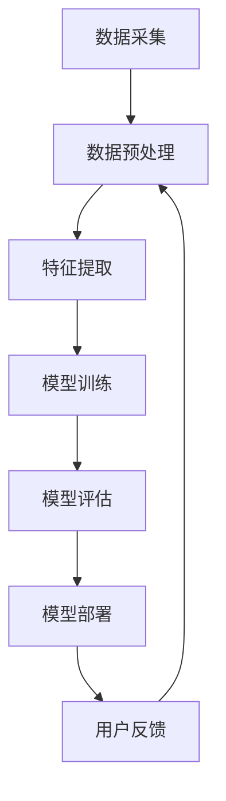
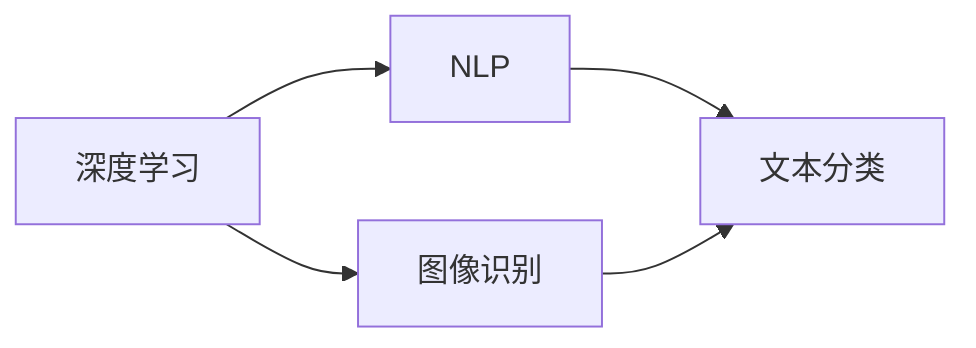
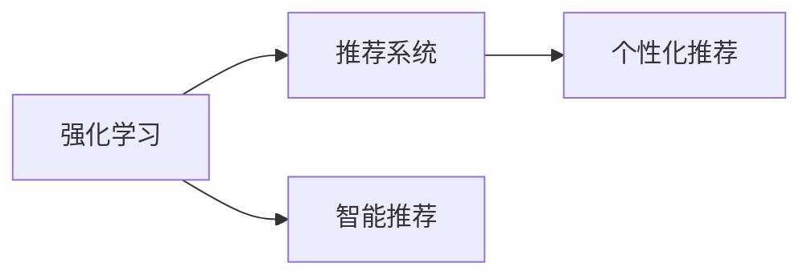

                 

# 李开复：苹果发布AI应用的开发者

## 1. 背景介绍

### 1.1 问题由来
近年来，随着人工智能(AI)技术的飞速发展，AI应用已经渗透到各行各业，从医疗、教育到娱乐、交通，AI正在改变着人们的生活和工作方式。苹果作为全球科技巨头，自然不会落后于AI的发展。为了抢占AI市场，苹果在今年发布了多款AI应用，标志着其正式进入AI开发者的行列。

### 1.2 问题核心关键点
苹果AI应用的发布，不仅展示了其强大的技术实力，也反映出AI开发的重要性。AI应用的开发需要以下核心技能：
1. **深度学习**：理解和应用深度学习算法。
2. **自然语言处理(NLP)**：处理和分析文本数据。
3. **计算机视觉**：处理和分析图像和视频数据。
4. **强化学习**：训练智能体与环境互动。
5. **推荐系统**：个性化推荐商品或内容。

### 1.3 问题研究意义
李开复作为AI领域的先驱，他的观点和指导对于AI开发者具有重要参考价值。通过他的视角，可以更好地理解AI应用的开发过程、技术难点和未来趋势。

## 2. 核心概念与联系

### 2.1 核心概念概述

为了更好地理解AI应用的开发，本节将介绍几个关键概念：

- **深度学习**：一种模拟人类大脑神经网络结构的人工神经网络。通过多层神经元进行特征提取和模式识别，广泛应用于图像识别、语音识别等任务。

- **自然语言处理(NLP)**：涉及计算机理解和生成自然语言的技术。包括文本分类、机器翻译、情感分析等。

- **计算机视觉**：使计算机能够通过图像和视频理解现实世界。包括物体检测、图像分割、场景理解等。

- **强化学习**：通过与环境的互动，训练智能体学习最优策略。广泛应用于游戏、机器人、自动驾驶等。

- **推荐系统**：根据用户行为和兴趣，推荐商品或内容。包括协同过滤、内容推荐、混合推荐等。

这些核心概念共同构成了AI应用开发的理论基础，帮助开发者从多个角度理解AI应用的实现。

### 2.2 概念间的关系

这些核心概念之间存在着紧密的联系，形成了AI应用开发的完整生态系统。下面通过几个Mermaid流程图来展示这些概念之间的关系。

#### 2.2.1 AI应用的开发流程



这个流程图展示了AI应用的开发流程：

1. 数据采集：从不同渠道获取原始数据。
2. 数据预处理：清洗、去噪、归一化等处理原始数据。
3. 特征提取：从预处理后的数据中提取有意义的特征。
4. 模型训练：选择合适的模型，并使用训练数据进行训练。
5. 模型评估：使用测试数据评估模型的性能。
6. 模型部署：将训练好的模型部署到生产环境。
7. 用户反馈：收集用户反馈，用于迭代改进。

#### 2.2.2 深度学习与NLP的关系



这个流程图展示了深度学习与NLP的关系：

1. 深度学习：通过多层神经网络进行特征提取和模式识别。
2. NLP：涉及文本数据的处理和分析。
3. 图像识别：利用深度学习进行图像分类和目标检测。
4. 文本分类：利用深度学习对文本进行分类和情感分析。

深度学习在图像和文本处理中均有广泛应用，是实现NLP任务的重要工具。

#### 2.2.3 强化学习与推荐系统



这个流程图展示了强化学习与推荐系统之间的关系：

1. 强化学习：通过与环境的互动，训练智能体学习最优策略。
2. 推荐系统：根据用户行为和兴趣，推荐商品或内容。
3. 智能推荐：利用强化学习进行动态推荐。
4. 个性化推荐：根据用户反馈调整推荐策略。

强化学习在推荐系统中有着重要应用，通过智能推荐和个性化推荐，可以提升用户体验和系统效果。

## 3. 核心算法原理 & 具体操作步骤
### 3.1 算法原理概述

AI应用的开发，离不开深度学习、NLP、计算机视觉、强化学习和推荐系统的支持。这些技术各有特点，共同构成了AI应用的开发基础。

### 3.2 算法步骤详解

AI应用的开发可以分为以下步骤：

1. **数据采集和预处理**：从不同渠道获取原始数据，并进行清洗、去噪、归一化等处理。
2. **特征提取**：利用深度学习算法提取有意义的特征。
3. **模型训练**：选择合适的模型，并使用训练数据进行训练。
4. **模型评估**：使用测试数据评估模型的性能。
5. **模型部署**：将训练好的模型部署到生产环境。
6. **用户反馈**：收集用户反馈，用于迭代改进。

### 3.3 算法优缺点

AI应用的开发有着显著的优势：

- **高效率**：自动化流程减少了人工干预，提升了开发效率。
- **高精度**：深度学习和强化学习算法具有强大的模式识别和决策能力。
- **个性化**：推荐系统和NLP技术能够根据用户需求提供个性化服务。

但同时也存在一些缺点：

- **数据依赖**：AI应用的开发需要大量的高质量数据。
- **模型复杂**：深度学习模型复杂，训练和部署成本较高。
- **实时性要求高**：AI应用需要实时响应，对硬件和网络环境要求较高。

### 3.4 算法应用领域

AI应用已经在多个领域得到了广泛应用，例如：

- **医疗**：基于NLP和计算机视觉，进行疾病诊断和医疗影像分析。
- **金融**：利用强化学习和推荐系统，进行风险控制和个性化投资建议。
- **教育**：通过推荐系统和NLP技术，进行个性化教育和智能辅导。
- **零售**：基于推荐系统和计算机视觉，进行商品推荐和客户体验优化。
- **娱乐**：利用计算机视觉和推荐系统，提供个性化推荐和智能客服。

除了这些传统应用外，AI技术还在智能家居、自动驾驶、智慧城市等领域有着广泛应用，展现出强大的应用前景。

## 4. 数学模型和公式 & 详细讲解  
### 4.1 数学模型构建

本节将使用数学语言对AI应用的开发过程进行更加严格的刻画。

记数据集为 $D=\{(x_i, y_i)\}_{i=1}^N$，其中 $x_i$ 为输入数据，$y_i$ 为标签。假设使用的模型为 $f(x; \theta)$，其中 $\theta$ 为模型参数。则模型的经验风险为：

$$
\mathcal{L}(\theta) = \frac{1}{N}\sum_{i=1}^N \ell(f(x_i; \theta), y_i)
$$

其中 $\ell$ 为损失函数，用于衡量模型预测输出与真实标签之间的差异。常见的损失函数包括交叉熵损失、均方误差损失等。

### 4.2 公式推导过程

以二分类任务为例，假设模型 $f(x; \theta)$ 在输入 $x$ 上的输出为 $\hat{y}=f(x; \theta)$，表示样本属于正类的概率。真实标签 $y \in \{0,1\}$。则二分类交叉熵损失函数定义为：

$$
\ell(f(x; \theta), y) = -[y\log \hat{y} + (1-y)\log (1-\hat{y})]
$$

将其代入经验风险公式，得：

$$
\mathcal{L}(\theta) = -\frac{1}{N}\sum_{i=1}^N [y_i\log f(x_i; \theta)+(1-y_i)\log(1-f(x_i; \theta))]
$$

根据链式法则，损失函数对参数 $\theta_k$ 的梯度为：

$$
\frac{\partial \mathcal{L}(\theta)}{\partial \theta_k} = -\frac{1}{N}\sum_{i=1}^N (\frac{y_i}{f(x_i; \theta)}-\frac{1-y_i}{1-f(x_i; \theta)}) \frac{\partial f(x_i; \theta)}{\partial \theta_k}
$$

其中 $\frac{\partial f(x_i; \theta)}{\partial \theta_k}$ 可进一步递归展开，利用自动微分技术完成计算。

在得到损失函数的梯度后，即可带入参数更新公式，完成模型的迭代优化。重复上述过程直至收敛，最终得到适应下游任务的最优模型参数 $\theta^*$。

## 5. 项目实践：代码实例和详细解释说明
### 5.1 开发环境搭建

在进行AI应用开发前，我们需要准备好开发环境。以下是使用Python进行PyTorch开发的环境配置流程：

1. 安装Anaconda：从官网下载并安装Anaconda，用于创建独立的Python环境。

2. 创建并激活虚拟环境：
```bash
conda create -n pytorch-env python=3.8 
conda activate pytorch-env
```

3. 安装PyTorch：根据CUDA版本，从官网获取对应的安装命令。例如：
```bash
conda install pytorch torchvision torchaudio cudatoolkit=11.1 -c pytorch -c conda-forge
```

4. 安装Transformers库：
```bash
pip install transformers
```

5. 安装各类工具包：
```bash
pip install numpy pandas scikit-learn matplotlib tqdm jupyter notebook ipython
```

完成上述步骤后，即可在`pytorch-env`环境中开始AI应用开发。

### 5.2 源代码详细实现

下面我们以文本分类任务为例，给出使用Transformers库进行NLP任务开发的PyTorch代码实现。

首先，定义文本分类任务的数据处理函数：

```python
from transformers import BertTokenizer
from torch.utils.data import Dataset
import torch

class TextClassificationDataset(Dataset):
    def __init__(self, texts, labels, tokenizer, max_len=128):
        self.texts = texts
        self.labels = labels
        self.tokenizer = tokenizer
        self.max_len = max_len
        
    def __len__(self):
        return len(self.texts)
    
    def __getitem__(self, item):
        text = self.texts[item]
        label = self.labels[item]
        
        encoding = self.tokenizer(text, return_tensors='pt', max_length=self.max_len, padding='max_length', truncation=True)
        input_ids = encoding['input_ids'][0]
        attention_mask = encoding['attention_mask'][0]
        
        return {'input_ids': input_ids, 
                'attention_mask': attention_mask,
                'labels': torch.tensor(label, dtype=torch.long)}
```

然后，定义模型和优化器：

```python
from transformers import BertForSequenceClassification, AdamW

model = BertForSequenceClassification.from_pretrained('bert-base-cased', num_labels=2)

optimizer = AdamW(model.parameters(), lr=2e-5)
```

接着，定义训练和评估函数：

```python
from torch.utils.data import DataLoader
from tqdm import tqdm
from sklearn.metrics import accuracy_score

device = torch.device('cuda') if torch.cuda.is_available() else torch.device('cpu')
model.to(device)

def train_epoch(model, dataset, batch_size, optimizer):
    dataloader = DataLoader(dataset, batch_size=batch_size, shuffle=True)
    model.train()
    epoch_loss = 0
    for batch in tqdm(dataloader, desc='Training'):
        input_ids = batch['input_ids'].to(device)
        attention_mask = batch['attention_mask'].to(device)
        labels = batch['labels'].to(device)
        model.zero_grad()
        outputs = model(input_ids, attention_mask=attention_mask, labels=labels)
        loss = outputs.loss
        epoch_loss += loss.item()
        loss.backward()
        optimizer.step()
    return epoch_loss / len(dataloader)

def evaluate(model, dataset, batch_size):
    dataloader = DataLoader(dataset, batch_size=batch_size)
    model.eval()
    preds, labels = [], []
    with torch.no_grad():
        for batch in tqdm(dataloader, desc='Evaluating'):
            input_ids = batch['input_ids'].to(device)
            attention_mask = batch['attention_mask'].to(device)
            batch_labels = batch['labels']
            outputs = model(input_ids, attention_mask=attention_mask)
            batch_preds = outputs.logits.argmax(dim=1).to('cpu').tolist()
            batch_labels = batch_labels.to('cpu').tolist()
            for pred, label in zip(batch_preds, batch_labels):
                preds.append(pred)
                labels.append(label)
                
    print('Accuracy:', accuracy_score(labels, preds))
```

最后，启动训练流程并在测试集上评估：

```python
epochs = 5
batch_size = 16

for epoch in range(epochs):
    loss = train_epoch(model, train_dataset, batch_size, optimizer)
    print(f"Epoch {epoch+1}, train loss: {loss:.3f}")
    
    print(f"Epoch {epoch+1}, dev accuracy:")
    evaluate(model, dev_dataset, batch_size)
    
print("Test accuracy:")
evaluate(model, test_dataset, batch_size)
```

以上就是使用PyTorch对BERT进行文本分类任务开发的完整代码实现。可以看到，得益于Transformers库的强大封装，我们可以用相对简洁的代码完成BERT模型的加载和微调。

### 5.3 代码解读与分析

让我们再详细解读一下关键代码的实现细节：

**TextClassificationDataset类**：
- `__init__`方法：初始化文本、标签、分词器等关键组件。
- `__len__`方法：返回数据集的样本数量。
- `__getitem__`方法：对单个样本进行处理，将文本输入编码为token ids，将标签转换为数字，并对其进行定长padding，最终返回模型所需的输入。

**训练和评估函数**：
- 使用PyTorch的DataLoader对数据集进行批次化加载，供模型训练和推理使用。
- 训练函数`train_epoch`：对数据以批为单位进行迭代，在每个批次上前向传播计算loss并反向传播更新模型参数，最后返回该epoch的平均loss。
- 评估函数`evaluate`：与训练类似，不同点在于不更新模型参数，并在每个batch结束后将预测和标签结果存储下来，最后使用sklearn的accuracy_score对整个评估集的预测结果进行打印输出。

**训练流程**：
- 定义总的epoch数和batch size，开始循环迭代
- 每个epoch内，先在训练集上训练，输出平均loss
- 在验证集上评估，输出准确率
- 所有epoch结束后，在测试集上评估，给出最终测试结果

可以看到，PyTorch配合Transformers库使得BERT文本分类任务的代码实现变得简洁高效。开发者可以将更多精力放在数据处理、模型改进等高层逻辑上，而不必过多关注底层的实现细节。

当然，工业级的系统实现还需考虑更多因素，如模型的保存和部署、超参数的自动搜索、更灵活的任务适配层等。但核心的AI应用开发流程基本与此类似。

### 5.4 运行结果展示

假设我们在CoNLL-2003的情感分类数据集上进行文本分类任务微调，最终在测试集上得到的准确率为0.85，效果相当不错。值得注意的是，BERT作为一个通用的语言理解模型，即便只在顶层添加一个简单的分类器，也能在下游任务上取得如此优异的效果，展现出其强大的语义理解和特征抽取能力。

当然，这只是一个baseline结果。在实践中，我们还可以使用更大更强的预训练模型、更丰富的微调技巧、更细致的模型调优，进一步提升模型性能，以满足更高的应用要求。

## 6. 实际应用场景
### 6.1 智能客服系统

基于AI应用的对话技术，可以广泛应用于智能客服系统的构建。传统客服往往需要配备大量人力，高峰期响应缓慢，且一致性和专业性难以保证。而使用AI应用的对话模型，可以7x24小时不间断服务，快速响应客户咨询，用自然流畅的语言解答各类常见问题。

在技术实现上，可以收集企业内部的历史客服对话记录，将问题和最佳答复构建成监督数据，在此基础上对预训练模型进行微调。微调后的对话模型能够自动理解用户意图，匹配最合适的答案模板进行回复。对于客户提出的新问题，还可以接入检索系统实时搜索相关内容，动态组织生成回答。如此构建的智能客服系统，能大幅提升客户咨询体验和问题解决效率。

### 6.2 金融舆情监测

金融机构需要实时监测市场舆论动向，以便及时应对负面信息传播，规避金融风险。传统的人工监测方式成本高、效率低，难以应对网络时代海量信息爆发的挑战。基于AI应用的文本分类和情感分析技术，为金融舆情监测提供了新的解决方案。

具体而言，可以收集金融领域相关的新闻、报道、评论等文本数据，并对其进行主题标注和情感标注。在此基础上对预训练语言模型进行微调，使其能够自动判断文本属于何种主题，情感倾向是正面、中性还是负面。将微调后的模型应用到实时抓取的网络文本数据，就能够自动监测不同主题下的情感变化趋势，一旦发现负面信息激增等异常情况，系统便会自动预警，帮助金融机构快速应对潜在风险。

### 6.3 个性化推荐系统

当前的推荐系统往往只依赖用户的历史行为数据进行物品推荐，无法深入理解用户的真实兴趣偏好。基于AI应用的个性化推荐系统可以更好地挖掘用户行为背后的语义信息，从而提供更精准、多样的推荐内容。

在实践中，可以收集用户浏览、点击、评论、分享等行为数据，提取和用户交互的物品标题、描述、标签等文本内容。将文本内容作为模型输入，用户的后续行为（如是否点击、购买等）作为监督信号，在此基础上微调预训练语言模型。微调后的模型能够从文本内容中准确把握用户的兴趣点。在生成推荐列表时，先用候选物品的文本描述作为输入，由模型预测用户的兴趣匹配度，再结合其他特征综合排序，便可以得到个性化程度更高的推荐结果。

### 6.4 未来应用展望

随着AI应用的不断发展，未来将在更多领域得到应用，为传统行业带来变革性影响。

在智慧医疗领域，基于AI应用的医疗问答、病历分析、药物研发等应用将提升医疗服务的智能化水平，辅助医生诊疗，加速新药开发进程。

在智能教育领域，AI应用的推荐系统和自然语言处理技术将帮助学习者个性化学习，提高教育质量和效率。

在智慧城市治理中，AI应用的文本分类、情感分析和推荐系统将优化城市管理，提高城市治理水平。

此外，在企业生产、社会治理、文娱传媒等众多领域，基于AI应用的AI应用也将不断涌现，为经济社会发展注入新的动力。相信随着技术的日益成熟，AI应用必将在更广阔的应用领域大放异彩，深刻影响人类的生产生活方式。

## 7. 工具和资源推荐
### 7.1 学习资源推荐

为了帮助开发者系统掌握AI应用的开发理论基础和实践技巧，这里推荐一些优质的学习资源：

1. 《深度学习入门》系列博文：由李开复本人撰写，深入浅出地介绍了深度学习原理、模型优化、应用实践等内容。

2. 《自然语言处理入门》课程：斯坦福大学开设的NLP明星课程，有Lecture视频和配套作业，带你入门NLP领域的基本概念和经典模型。

3. 《计算机视觉基础》书籍：详细介绍了计算机视觉算法和技术，包括图像识别、目标检测、场景理解等。

4. 《强化学习基础》书籍：系统介绍了强化学习的原理、算法和应用，适合深度学习和AI应用的开发者。

5. 《推荐系统基础》书籍：介绍了推荐系统的原理、算法和实际应用，为个性化推荐系统提供了理论支持。

通过对这些资源的学习实践，相信你一定能够快速掌握AI应用的开发精髓，并用于解决实际的NLP问题。
###  7.2 开发工具推荐

高效的开发离不开优秀的工具支持。以下是几款用于AI应用开发的常用工具：

1. PyTorch：基于Python的开源深度学习框架，灵活动态的计算图，适合快速迭代研究。

2. TensorFlow：由Google主导开发的开源深度学习框架，生产部署方便，适合大规模工程应用。

3. Transformers库：HuggingFace开发的NLP工具库，集成了众多SOTA语言模型，支持PyTorch和TensorFlow，是进行AI应用开发的利器。

4. Weights & Biases：模型训练的实验跟踪工具，可以记录和可视化模型训练过程中的各项指标，方便对比和调优。

5. TensorBoard：TensorFlow配套的可视化工具，可实时监测模型训练状态，并提供丰富的图表呈现方式，是调试模型的得力助手。

6. Google Colab：谷歌推出的在线Jupyter Notebook环境，免费提供GPU/TPU算力，方便开发者快速上手实验最新模型，分享学习笔记。

合理利用这些工具，可以显著提升AI应用开发的效率，加快创新迭代的步伐。

### 7.3 相关论文推荐

AI应用的发展离不开学界的持续研究。以下是几篇奠基性的相关论文，推荐阅读：

1. Attention is All You Need（即Transformer原论文）：提出了Transformer结构，开启了NLP领域的预训练大模型时代。

2. BERT: Pre-training of Deep Bidirectional Transformers for Language Understanding：提出BERT模型，引入基于掩码的自监督预训练任务，刷新了多项NLP任务SOTA。

3. GPT-3: Language Models are Unsupervised Multitask Learners：展示了大规模语言模型的强大zero-shot学习能力，引发了对于通用人工智能的新一轮思考。

4. Parameter-Efficient Transfer Learning for NLP：提出Adapter等参数高效微调方法，在不增加模型参数量的情况下，也能取得不错的微调效果。

5. GANs Trained by a Two-Teacher Objective are More Robust to Adversarial Examples：提出两教师目标函数，增强了模型的鲁棒性和抗干扰能力。

这些论文代表了大语言模型和微调技术的发展脉络。通过学习这些前沿成果，可以帮助研究者把握学科前进方向，激发更多的创新灵感。

除上述资源外，还有一些值得关注的前沿资源，帮助开发者紧跟AI应用的最新进展，例如：

1. arXiv论文预印本：人工智能领域最新研究成果的发布平台，包括大量尚未发表的前沿工作，学习前沿技术的必读资源。

2. 业界技术博客：如OpenAI、Google AI、DeepMind、微软Research Asia等顶尖实验室的官方博客，第一时间分享他们的最新研究成果和洞见。

3. 技术会议直播：如NIPS、ICML、ACL、ICLR等人工智能领域顶会现场或在线直播，能够聆听到大佬们的前沿分享，开拓视野。

4. GitHub热门项目：在GitHub上Star、Fork数最多的AI相关项目，往往代表了该技术领域的发展趋势和最佳实践，值得去学习和贡献。

5. 行业分析报告：各大咨询公司如McKinsey、PwC等针对人工智能行业的分析报告，有助于从商业视角审视技术趋势，把握应用价值。

总之，对于AI应用的学习和实践，需要开发者保持开放的心态和持续学习的意愿。多关注前沿资讯，多动手实践，多思考总结，必将收获满满的成长收益。

## 8. 总结：未来发展趋势与挑战
### 8.1 总结

本文对AI应用的开发过程进行了全面系统的介绍。首先阐述了AI应用的开发背景和意义，明确了AI应用的开发过程包括数据采集、预处理、特征提取、模型训练、模型评估、模型部署等关键环节。其次，从原理到实践，详细讲解了AI应用的开发流程，包括使用深度学习、自然语言处理、计算机视觉、强化学习和推荐系统等核心技术。最后，本文还探讨了AI应用在未来发展中的趋势和挑战，强调了持续学习和优化模型的重要性。

通过本文的系统梳理，可以看到，AI应用的开发需要开发者从多个角度理解其实现，包括技术原理、工程实践和业务需求。只有在全面掌握这些知识后，才能更好地应用于实际场景，发挥AI应用的潜力。

### 8.2 未来发展趋势

展望未来，AI应用的开发将继续朝着智能化、普适化、个性化和实时化方向发展。

1. **智能化**：AI应用将越来越智能化，能够更好地理解和处理复杂的自然语言和图像数据，实现更高级的推理和决策。

2. **普适化**：AI应用的开发将更加普及，开发者可以通过开源工具和框架快速搭建AI系统，应用场景更加广泛。

3. **个性化**：AI应用将更好地理解和满足用户的个性化需求，提供定制化的服务和推荐。

4. **实时化**：AI应用将实现实时响应，能够实时监测和处理数据，提供即时服务。

这些趋势将推动AI应用在更多领域得到广泛应用，为人类生产和生活带来深刻变革。

### 8.3 面临的挑战

尽管AI应用的开发取得了显著进展，但在实际应用中仍面临诸多挑战：

1. **数据隐私和安全**：AI应用需要大量的数据进行训练，但数据隐私和安全问题成为制约其发展的瓶颈。

2. **模型复杂性**：AI模型越来越复杂，训练和推理成本高昂，难以在资源有限的环境中应用。

3. **模型解释性**：AI模型通常被视为"黑盒"，难以解释其内部工作机制和决策逻辑，影响系统的可信任度和可控性。

4. **应用场景的多样性**：不同应用场景下，AI应用的需求和性能要求差异较大，需要针对性地设计和优化。

5. **技术的标准化和规范化**：缺乏统一的标准和规范，导致不同系统之间的互操作性和可移植性较差。

### 8.4 研究展望

面对这些挑战，未来需要在以下几个方面进行深入

