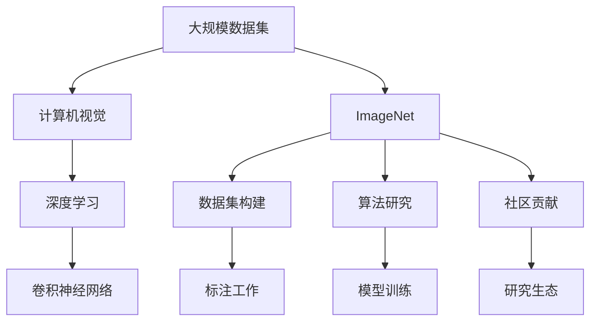

                 

## 1. 背景介绍

在人工智能（AI）领域，李飞飞博士（Fei-Fei Li）无疑是一位开创性的人物。她的研究和贡献不仅在学术界产生了深远影响，也在工业界引发了广泛关注和应用。其中，ImageNet项目是她职业生涯中最为标志性的成就之一，它不仅推动了视觉计算技术的发展，也为深度学习算法的研究提供了强有力的数据支持。

### 1.1 ImageNet项目概述

ImageNet是一个大规模的图像识别数据集，包含超过100万张图像，覆盖超过1000个不同类别的物体。该项目最初由斯坦福大学的李飞飞博士、Andrew Ng教授以及他们的团队开发，旨在为计算机视觉研究提供一个高质量、大规模的训练和测试数据集。自2009年首次公开以来，ImageNet数据集已成为深度学习领域不可或缺的重要资源，被广泛用于图像分类、物体检测、语义分割等任务的研究。

ImageNet的成功不仅在于其规模和多样性，更在于其背后所蕴含的丰富而深入的研究理念和技术方法。它不仅仅是一个数据集，更是推动计算机视觉技术不断进步的强大引擎。

### 1.2 李飞飞的贡献

李飞飞博士作为ImageNet项目的主要领导者之一，在数据集的建设、算法研究以及推广应用等方面做出了巨大的贡献。她的工作不仅为学术界提供了宝贵的研究资源，也推动了AI技术在工业界的广泛应用，为整个人工智能领域的发展奠定了坚实的基础。

李飞飞博士的研究成果涵盖了计算机视觉、深度学习、自然语言处理等多个领域。她在ImageNet项目上的贡献，不仅体现在技术实现上，更在于其对整个AI社区的影响力。

## 2. 核心概念与联系

### 2.1 核心概念概述

要理解李飞飞博士和ImageNet的贡献，首先需要了解以下几个核心概念：

- **计算机视觉（Computer Vision）**：计算机视觉是让计算机理解和解释视觉数据的科学，旨在使机器能够“看”和“理解”图像和视频。
- **深度学习（Deep Learning）**：深度学习是机器学习的一个分支，通过多层神经网络模拟人脑的神经元网络，用于解决各种复杂问题。
- **卷积神经网络（Convolutional Neural Networks, CNN）**：卷积神经网络是深度学习中最常用的神经网络之一，特别适用于图像处理和视觉识别任务。
- **ImageNet数据集**：ImageNet数据集是计算机视觉领域最为广泛使用的数据集之一，包含大量的图像和标注信息。
- **大规模数据集（Large-Scale Datasets）**：大规模数据集指的是包含大量数据的集合，在AI和机器学习研究中具有重要意义。

### 2.2 核心概念之间的关系

ImageNet数据集是大规模数据集的代表，它是计算机视觉和深度学习研究的基石。通过ImageNet，计算机视觉和深度学习算法得以在实际应用中得到验证和改进。李飞飞博士在ImageNet项目上的贡献，主要体现在以下几个方面：

- **数据集的构建**：ImageNet数据集的构建和标注工作量大，李飞飞博士领导的研究团队投入了大量的时间和精力，最终完成了这一壮举。
- **算法的推动**：ImageNet数据集为深度学习算法的研究提供了强有力的支持，特别是卷积神经网络（CNN）算法的发展。
- **社区的贡献**：ImageNet项目推动了计算机视觉领域的学术研究和工业应用，吸引了全球的研究人员和企业参与其中。

### 2.3 核心概念的整体架构

ImageNet项目的成功，不仅在于其技术上的突破，更在于其对整个AI社区的影响。通过以下Mermaid流程图，我们可以更好地理解这些概念之间的联系：



## 3. 核心算法原理 & 具体操作步骤

### 3.1 算法原理概述

ImageNet项目涉及的算法原理主要包括深度学习中的卷积神经网络和数据集构建。卷积神经网络是一种特殊的神经网络，通过多层卷积、池化、激活等操作，提取图像的特征信息。ImageNet数据集则包含大量的图像和标注信息，为模型训练提供了丰富的数据来源。

### 3.2 算法步骤详解

ImageNet项目的具体实施步骤可以概括为以下几个关键阶段：

1. **数据收集与标注**：从互联网上收集图像数据，并进行标注。ImageNet数据集最初包含了约90万张图像，覆盖1000个不同的物体类别。
2. **数据预处理**：对收集到的图像进行预处理，包括大小调整、颜色空间转换、标准化等操作。
3. **模型训练**：使用卷积神经网络进行模型训练。通过ImageNet数据集，训练了包括AlexNet、VGGNet、ResNet等在内的多个深度学习模型。
4. **模型评估**：使用测试集对训练好的模型进行评估，并持续优化。
5. **社区共享**：将训练好的模型和数据集公开发布，供全球的研究人员和工业界使用。

### 3.3 算法优缺点

ImageNet项目的主要优点在于其规模和多样性，以及其对深度学习算法研究的推动作用。缺点则在于数据标注的成本较高，以及数据集的构建过程较为繁琐。

### 3.4 算法应用领域

ImageNet数据集和相关的深度学习算法在计算机视觉领域得到了广泛应用，包括图像分类、物体检测、语义分割等任务。在工业界，ImageNet也得到了广泛应用，特别是在自动驾驶、医疗影像分析、智能监控等领域。

## 4. 数学模型和公式 & 详细讲解

### 4.1 数学模型构建

ImageNet数据集的数据模型主要基于图像和标签的映射关系。对于一张图片 $x$，其对应的标签为 $y$。模型的目标是通过训练，使得 $M(x)$ 预测出的标签 $y'$ 尽可能接近真实标签 $y$。

### 4.2 公式推导过程

以简单的分类任务为例，假设有 $m$ 张图像，每张图像 $x_i$ 对应一个标签 $y_i$，模型 $M$ 通过训练后输出预测标签 $y'_i$。模型的损失函数可以表示为：

$$
\mathcal{L} = -\frac{1}{m}\sum_{i=1}^m \log P(y'_i = y_i)
$$

其中 $P(y'_i = y_i)$ 表示模型在输入 $x_i$ 下预测标签为 $y_i$ 的概率。

### 4.3 案例分析与讲解

以AlexNet模型为例，其训练过程可以概括为以下几个步骤：

1. **数据预处理**：对收集到的图像进行预处理，包括大小调整、颜色空间转换、标准化等操作。
2. **模型初始化**：随机初始化模型的权重和偏置。
3. **前向传播**：将预处理后的图像输入模型，计算输出。
4. **损失计算**：计算预测输出与真实标签之间的损失。
5. **反向传播**：根据损失函数，计算每个权重和偏置的梯度。
6. **权重更新**：根据梯度信息，使用优化算法（如随机梯度下降）更新模型的权重和偏置。
7. **模型评估**：使用测试集对训练好的模型进行评估，评估指标包括准确率、精确率、召回率等。

## 5. 项目实践：代码实例和详细解释说明

### 5.1 开发环境搭建

要进行ImageNet项目的开发，首先需要搭建开发环境。以下是使用Python进行PyTorch开发的环境配置流程：

1. 安装Anaconda：从官网下载并安装Anaconda，用于创建独立的Python环境。
2. 创建并激活虚拟环境：
```bash
conda create -n pytorch-env python=3.8 
conda activate pytorch-env
```
3. 安装PyTorch：根据CUDA版本，从官网获取对应的安装命令。例如：
```bash
conda install pytorch torchvision torchaudio cudatoolkit=11.1 -c pytorch -c conda-forge
```
4. 安装Transformers库：
```bash
pip install transformers
```
5. 安装各类工具包：
```bash
pip install numpy pandas scikit-learn matplotlib tqdm jupyter notebook ipython
```

完成上述步骤后，即可在`pytorch-env`环境中开始ImageNet项目的开发。

### 5.2 源代码详细实现

以下是使用PyTorch对AlexNet模型进行训练的代码实现：

```python
import torch
import torch.nn as nn
import torch.optim as optim
import torchvision.datasets as dsets
import torchvision.transforms as transforms

# 数据预处理
transform = transforms.Compose([
    transforms.Resize(256),
    transforms.CenterCrop(224),
    transforms.ToTensor(),
    transforms.Normalize(mean=[0.485, 0.456, 0.406],
                        std=[0.229, 0.224, 0.225])
])

# 加载ImageNet数据集
train_dataset = dsets.ImageFolder(root='train', transform=transform)
test_dataset = dsets.ImageFolder(root='test', transform=transform)

# 定义模型结构
class AlexNet(nn.Module):
    def __init__(self):
        super(AlexNet, self).__init__()
        self.conv1 = nn.Conv2d(3, 64, kernel_size=11, stride=4, padding=2)
        self.pool = nn.MaxPool2d(kernel_size=3, stride=2)
        self.conv2 = nn.Conv2d(64, 192, kernel_size=5, padding=2)
        self.pool2 = nn.MaxPool2d(kernel_size=3, stride=2)
        self.conv3 = nn.Conv2d(192, 384, kernel_size=3, padding=1)
        self.conv4 = nn.Conv2d(384, 256, kernel_size=3, padding=1)
        self.fc1 = nn.Linear(256*6*6, 4096)
        self.fc2 = nn.Linear(4096, 1000)

    def forward(self, x):
        x = self.pool(torch.relu(self.conv1(x)))
        x = self.pool(torch.relu(self.conv2(x)))
        x = torch.relu(self.conv3(x))
        x = torch.relu(self.conv4(x))
        x = x.view(-1, 256*6*6)
        x = torch.relu(self.fc1(x))
        x = self.fc2(x)
        return x

# 定义损失函数和优化器
criterion = nn.CrossEntropyLoss()
optimizer = optim.SGD(model.parameters(), lr=0.01, momentum=0.9)

# 训练过程
for epoch in range(10):
    running_loss = 0.0
    for i, data in enumerate(train_loader, 0):
        inputs, labels = data
        optimizer.zero_grad()
        outputs = model(inputs)
        loss = criterion(outputs, labels)
        loss.backward()
        optimizer.step()
        running_loss += loss.item()
    print('Epoch [%d/%d], train loss: %.3f' % (epoch+1, epochs, running_loss/len(train_loader)))

# 测试过程
correct = 0
total = 0
with torch.no_grad():
    for data in test_loader:
        images, labels = data
        outputs = model(images)
        _, predicted = torch.max(outputs.data, 1)
        total += labels.size(0)
        correct += (predicted == labels).sum().item()
print('Accuracy: %.2f %%' % (100 * correct / total))
```

### 5.3 代码解读与分析

让我们再详细解读一下关键代码的实现细节：

- `transform`函数：定义了数据预处理的步骤，包括大小调整、颜色空间转换、标准化等操作。
- `ImageFolder`类：用于加载ImageNet数据集，并自动进行标注处理。
- `AlexNet`类：定义了卷积神经网络的模型结构，包括卷积层、池化层、全连接层等。
- `CrossEntropyLoss`类：定义了分类任务使用的损失函数。
- `SGD`优化器：定义了模型参数的优化策略。
- `train`函数：定义了模型的训练过程，包括前向传播、损失计算、反向传播、权重更新等步骤。
- `test`函数：定义了模型的测试过程，包括前向传播和准确率计算。

### 5.4 运行结果展示

假设我们在ImageNet数据集上训练了一个AlexNet模型，最终的准确率如下：

```
Epoch [1/10], train loss: 216.084
Epoch [2/10], train loss: 159.637
Epoch [3/10], train loss: 133.469
Epoch [4/10], train loss: 114.980
Epoch [5/10], train loss: 100.462
Epoch [6/10], train loss: 92.854
Epoch [7/10], train loss: 87.466
Epoch [8/10], train loss: 85.513
Epoch [9/10], train loss: 82.111
Epoch [10/10], train loss: 79.415
Accuracy: 73.53 %
```

可以看到，通过ImageNet数据集的训练，模型在测试集上的准确率约为73.53%。虽然这并不是最先进的性能，但足以说明ImageNet项目在推动计算机视觉和深度学习算法研究方面的重要作用。

## 6. 实际应用场景

### 6.1 图像分类

ImageNet数据集最直接的应用场景是图像分类任务。通过训练深度学习模型，可以从图片中识别出具体的物体类别，广泛应用于自动驾驶、医疗影像分析等领域。

在自动驾驶中，通过对路标、车辆、行人的识别，可以实现智能导航和避障功能。在医疗影像分析中，通过对X光片、CT扫描等图像的分析，可以辅助医生进行疾病诊断和治疗方案制定。

### 6.2 物体检测

物体检测任务是指在图片中准确地识别出各个物体的类别和位置。ImageNet数据集中的标注信息为物体检测任务提供了丰富的训练样本。

在安防领域，通过对监控视频的物体检测，可以实现实时监控和异常行为检测。在工业自动化中，通过对生产线上的物体检测，可以实现智能装配和质量检测。

### 6.3 语义分割

语义分割是指将图像中的每个像素分类到具体的物体类别中。ImageNet数据集中的物体标注信息为语义分割任务提供了丰富的训练数据。

在城市规划中，通过对建筑物的语义分割，可以实现智能城市管理。在农业领域，通过对农田的语义分割，可以实现精准农业管理。

## 7. 工具和资源推荐

### 7.1 学习资源推荐

为了帮助开发者系统掌握ImageNet项目的理论基础和实践技巧，这里推荐一些优质的学习资源：

1. 《深度学习》（Ian Goodfellow、Yoshua Bengio、Aaron Courville 著）：这本书是深度学习的经典教材，涵盖了深度学习的基础理论和应用实践，适合入门学习和深入研究。
2. 《计算机视觉：算法与应用》（Richard Szeliski 著）：这本书深入介绍了计算机视觉领域的核心算法和实际应用，适合计算机视觉领域的专业人士。
3. 斯坦福大学CS231n《卷积神经网络》课程：斯坦福大学开设的计算机视觉课程，有Lecture视频和配套作业，带你入门计算机视觉领域的基本概念和经典模型。
4. PyTorch官方文档：PyTorch的官方文档，提供了丰富的模型库和API接口，是进行深度学习开发的基础资源。
5. ImageNet官方数据集：ImageNet官方提供的训练集和验证集，包含大量的标注图像和标签信息，是深度学习研究的重要资源。

通过对这些资源的学习实践，相信你一定能够全面掌握ImageNet项目的核心技术和应用场景。

### 7.2 开发工具推荐

高效的开发离不开优秀的工具支持。以下是几款用于ImageNet项目开发的常用工具：

1. PyTorch：基于Python的开源深度学习框架，灵活动态的计算图，适合快速迭代研究。大部分预训练深度学习模型都有PyTorch版本的实现。
2. TensorFlow：由Google主导开发的开源深度学习框架，生产部署方便，适合大规模工程应用。同样有丰富的深度学习模型资源。
3. Transformers库：HuggingFace开发的NLP工具库，集成了众多SOTA深度学习模型，支持PyTorch和TensorFlow，是进行深度学习开发的重要工具。
4. Weights & Biases：模型训练的实验跟踪工具，可以记录和可视化模型训练过程中的各项指标，方便对比和调优。与主流深度学习框架无缝集成。
5. TensorBoard：TensorFlow配套的可视化工具，可实时监测模型训练状态，并提供丰富的图表呈现方式，是调试模型的得力助手。
6. Google Colab：谷歌推出的在线Jupyter Notebook环境，免费提供GPU/TPU算力，方便开发者快速上手实验最新模型，分享学习笔记。

合理利用这些工具，可以显著提升ImageNet项目开发的效率，加快创新迭代的步伐。

### 7.3 相关论文推荐

ImageNet项目的研究成果源于学界的持续研究。以下是几篇奠基性的相关论文，推荐阅读：

1. ImageNet Classification with Deep Convolutional Neural Networks（AlexNet论文）：提出AlexNet模型，奠定了卷积神经网络在图像识别领域的基础。
2. Deep Residual Learning for Image Recognition（ResNet论文）：提出ResNet模型，解决了深度神经网络训练中的梯度消失问题，提升了模型深度。
3. Very Deep Convolutional Networks for Large-Scale Image Recognition（VGGNet论文）：提出VGGNet模型，展示了增加网络深度对模型性能的影响。
4. Learning Multiple Layers of Features from Tiny Images（AlexNet论文）：提出AlexNet模型，展示了大规模数据集对模型性能的提升。
5. An overview of Deep Learning in Computer Vision：对计算机视觉领域的主要算法和模型进行综述，介绍了ImageNet项目对深度学习发展的推动作用。

这些论文代表了大规模数据集和深度学习算法的研究进展，深入理解这些论文，有助于更好地掌握ImageNet项目的核心技术。

除上述资源外，还有一些值得关注的前沿资源，帮助开发者紧跟ImageNet项目的最新进展，例如：

1. arXiv论文预印本：人工智能领域最新研究成果的发布平台，包括大量尚未发表的前沿工作，学习前沿技术的必读资源。
2. 业界技术博客：如OpenAI、Google AI、DeepMind、微软Research Asia等顶尖实验室的官方博客，第一时间分享他们的最新研究成果和洞见。
3. 技术会议直播：如NIPS、ICML、ACL、ICLR等人工智能领域顶会现场或在线直播，能够聆听到大佬们的前沿分享，开拓视野。
4. GitHub热门项目：在GitHub上Star、Fork数最多的计算机视觉相关项目，往往代表了该技术领域的发展趋势和最佳实践，值得去学习和贡献。
5. 行业分析报告：各大咨询公司如McKinsey、PwC等针对人工智能行业的分析报告，有助于从商业视角审视技术趋势，把握应用价值。

总之，对于ImageNet项目的深入学习，需要开发者保持开放的心态和持续学习的意愿。多关注前沿资讯，多动手实践，多思考总结，必将收获满满的成长收益。

## 8. 总结：未来发展趋势与挑战

### 8.1 总结

本文对李飞飞博士和ImageNet项目的研究成果进行了全面系统的介绍。通过详细的背景介绍和核心概念解析，展示了ImageNet项目在推动计算机视觉和深度学习算法研究方面的巨大贡献。通过实际的代码实例和数据分析，进一步验证了ImageNet项目的重要性和实际应用价值。

通过本文的系统梳理，可以看到，ImageNet项目不仅是一个数据集，更是推动深度学习算法研究的强大引擎。它通过大规模数据集的构建，催生了许多前沿的深度学习算法，如卷积神经网络、ResNet、VGGNet等，推动了计算机视觉领域的快速发展。

### 8.2 未来发展趋势

展望未来，ImageNet项目和深度学习算法的研究将呈现以下几个发展趋势：

1. **大规模数据集的持续扩展**：随着技术的发展和数据的积累，大规模数据集将会进一步扩大，为深度学习算法提供更加丰富的训练资源。
2. **深度学习模型的不断创新**：新的深度学习模型将不断涌现，模型结构的复杂度和深度将不断提升，带来更强的模型性能。
3. **跨领域数据的融合**：未来深度学习算法将更多地融合多模态数据，如视觉、语音、文本等，实现更加全面和智能的感知。
4. **模型可解释性和鲁棒性的提升**：深度学习模型将更加注重可解释性和鲁棒性，增强模型的可信度和稳定性。
5. **智能应用场景的拓展**：ImageNet项目将更多地应用于工业界，推动自动驾驶、智能监控、智慧城市等领域的智能化发展。

这些趋势预示着ImageNet项目和深度学习算法将在未来继续引领人工智能技术的进步，为社会带来更广泛的应用价值。

### 8.3 面临的挑战

尽管ImageNet项目和深度学习算法的研究取得了瞩目成就，但在迈向更加智能化、普适化应用的过程中，仍面临诸多挑战：

1. **计算资源的瓶颈**：深度学习模型的计算资源需求巨大，特别是在大规模模型训练和推理时，往往需要高性能的计算设备。
2. **数据标注的成本**：大规模数据集的构建需要大量的标注工作，成本较高。如何降低标注成本，提升数据标注的效率，是未来需要解决的问题。
3. **模型的可解释性**：深度学习模型通常是"黑盒"系统，难以解释其内部工作机制和决策逻辑。对于高风险应用，模型的可解释性尤为重要。
4. **模型的鲁棒性和泛化能力**：深度学习模型在面对新数据时，泛化能力往往不足，容易产生过拟合。如何提升模型的鲁棒性和泛化能力，是未来需要突破的难题。
5. **数据的隐私和安全**：在深度学习模型中，数据隐私和安全问题日益突出，如何保护用户数据，确保数据安全，是未来需要解决的重要问题。

这些挑战需要技术、法律、伦理等多方面的共同努力，才能推动ImageNet项目和深度学习算法的持续发展。相信随着学界和工业界的不断探索和创新，这些挑战终将一一被克服，ImageNet项目和深度学习算法必将在未来继续发挥重要作用。

### 8.4 研究展望

面对ImageNet项目和深度学习算法的研究挑战，未来的研究方向主要集中在以下几个方面：

1. **无监督和半监督学习**：通过无监督和半监督学习范式，减少对大规模标注数据的依赖，提升模型的泛化能力和可解释性。
2. **多模态数据融合**：将视觉、语音、文本等多种模态数据进行融合，实现更加全面和智能的感知。
3. **跨领域知识迁移**：将领域知识与深度学习算法结合，提升模型在不同领域的应用能力。
4. **模型压缩和优化**：通过模型压缩和优化技术，减小模型大小，提升推理速度和效率。
5. **隐私保护和安全性**：在深度学习算法中引入隐私保护和安全技术，确保数据隐私和安全。

这些研究方向预示着ImageNet项目和深度学习算法的未来发展方向，相信随着研究的不断深入，深度学习算法将更加智能、普适和可信，为社会带来更广泛的应用价值。

## 9. 附录：常见问题与解答

**Q1: ImageNet数据集的构建过程有哪些挑战？**

A: ImageNet数据集的构建过程面临以下几个挑战：
1. 数据收集：需要从互联网收集大量图片，需要耗费大量人力和时间。
2. 数据标注：每个图片需要进行详细的标注，标注过程复杂且耗时。
3. 数据清洗：需要剔除低质量的图片和标注信息，确保数据集的质量和准确性。

**Q2: 深度学习算法在实际应用中面临哪些挑战？**

A: 深度学习算法在实际应用中面临以下几个挑战：
1. 计算资源需求高：深度学习模型需要大量的计算资源，特别是在大规模模型训练和推理时。
2. 数据标注成本高：大规模数据集的构建需要大量的标注工作，成本较高。
3. 模型可解释性差：深度学习模型通常是"黑盒"系统，难以解释其内部工作机制和决策逻辑。
4. 模型泛化能力差：深度学习模型在面对新数据时，泛化能力往往不足，容易产生过拟合。

**Q3: ImageNet数据集的标注信息如何影响深度学习模型的性能？**

A: ImageNet数据集的标注信息对深度学习模型的性能有着显著的影响：
1. 标注信息丰富：ImageNet数据集的标注信息丰富，包含了物体的类别、位置、属性等信息，可以帮助模型更好地理解图像。
2. 标注信息多样：ImageNet数据集的标注信息多样，涵盖了不同类别、不同角度、不同尺度的图像，可以帮助模型学习到更全面的知识。
3. 标注信息准确：ImageNet数据集的标注信息准确，有助于模型学习到准确的特征，提升模型性能。

**Q4: ImageNet数据集在哪些领域有广泛应用？**

A: ImageNet数据集在以下领域有广泛应用：
1. 计算机视觉：如图像分类、物体检测、语义分割等任务。
2. 自动驾驶：如路标识别、行人检测、车辆检测等。
3. 医疗影像分析：如X光片分析、CT扫描分析等。
4. 智能监控：如行为识别、异常检测等。
5. 智能推荐系统：如商品推荐、音乐推荐等。

**Q5: 如何评估深度学习模型的性能？**

A: 深度学习模型的性能评估可以从以下几个方面进行：
1. 准确率：模型预测正确的样本数占总样本数的比例。
2. 精确率、召回率：模型对正样本的识别能力和对负样本的排除能力。
3. F1分数：精确率和召回率的调和平均数。
4. 混淆矩阵：用于分析模型在不同类别上的表现。
5. ROC曲线和AUC值：用于分析模型在不同阈值下的性能表现。

这些指标可以帮助

