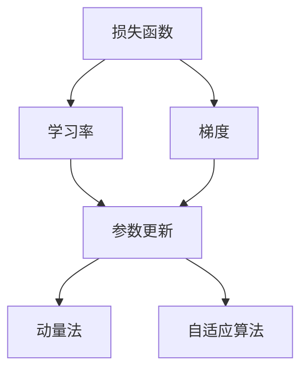
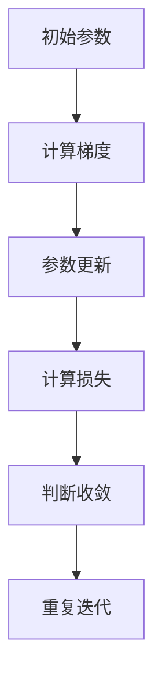
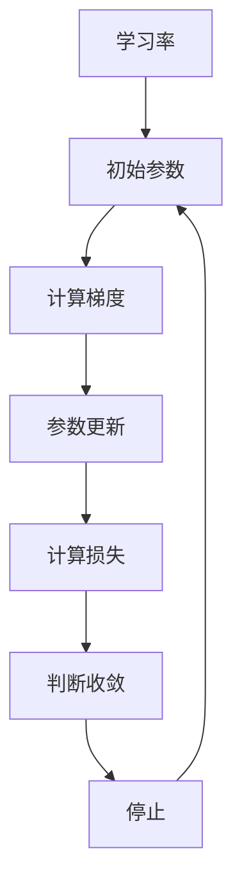
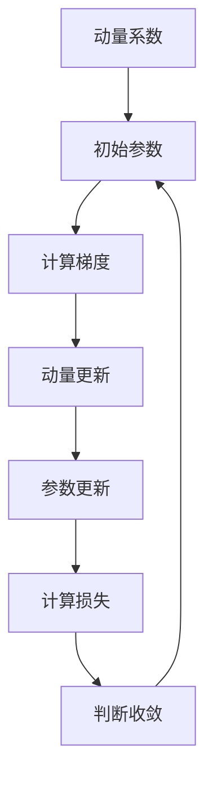

                 

# 梯度下降(Gradient Descent) - 原理与代码实例讲解

> 关键词：梯度下降, 优化算法, 机器学习, 深度学习, 优化器, 反向传播, 学习率, 动量法, 自适应算法, 神经网络

## 1. 背景介绍

### 1.1 问题由来
梯度下降(GRADIENT DESCENT)是机器学习和深度学习中最基础、最常用的优化算法之一。其核心思想是通过对损失函数(Loss Function)求导，找到导致损失最小化的参数值，从而实现模型参数的更新。尽管梯度下降算法被广泛使用，但关于其原理和具体实现细节的理解，往往仍然存在很多误区和困惑。

本文将从梯度下降的基本原理出发，详细讲解其数学模型和计算步骤，并通过代码实例演示其在实际应用中的高效实现。通过理解梯度下降的原理和应用，能够帮助读者更深入地掌握机器学习中模型优化的核心方法，为其后续的深度学习和优化实践打下坚实基础。

### 1.2 问题核心关键点
梯度下降算法是机器学习和深度学习中非常重要的基础算法之一，其核心思想是通过不断迭代更新模型参数，使损失函数最小化。其核心关键点包括：

- 如何定义损失函数：损失函数用于衡量模型预测输出与真实标签之间的差异，是模型优化的目标。
- 如何计算梯度：梯度是损失函数对模型参数的偏导数，决定了参数更新的方向和幅度。
- 如何更新参数：根据梯度的大小和方向，使用适当的学习率对参数进行更新。
- 如何避免局部最优解：使用适当的优化器(如动量法、自适应算法等)，保证参数更新的稳定性和有效性。

## 2. 核心概念与联系

### 2.1 核心概念概述

为了更好地理解梯度下降算法，本节将介绍几个密切相关的核心概念：

- 损失函数(Loss Function)：衡量模型预测输出与真实标签之间的差异，是模型优化的目标函数。
- 梯度(Gradient)：损失函数对模型参数的偏导数，决定了参数更新的方向和幅度。
- 学习率(Learning Rate)：控制参数更新的步长，影响算法的收敛速度和稳定性。
- 动量法(Momentum)：通过引入动量项，加速梯度下降，避免震荡和局部最优。
- 自适应算法(Adaptive Algorithm)：根据梯度的变化调整学习率，优化算法性能。

这些概念之间的逻辑关系可以通过以下Mermaid流程图来展示：



这个流程图展示了一轮梯度下降的基本流程：

1. 通过计算损失函数对参数的梯度，得到参数更新的方向和幅度。
2. 使用学习率控制参数更新的步长，影响算法的收敛速度和稳定性。
3. 通过动量法和自适应算法优化参数更新策略，加速收敛并避免局部最优。

### 2.2 概念间的关系

这些核心概念之间存在着紧密的联系，形成了梯度下降算法的完整生态系统。下面我通过几个Mermaid流程图来展示这些概念之间的关系。

#### 2.2.1 梯度下降的基本流程



这个流程图展示了一轮梯度下降的基本流程：

1. 初始化模型参数，开始迭代优化。
2. 计算损失函数对参数的梯度，得到参数更新的方向和幅度。
3. 根据梯度的大小和方向，使用适当的学习率对参数进行更新。
4. 计算更新后的模型参数的损失函数值。
5. 判断是否满足停止条件（如达到最大迭代次数或损失函数变化很小），如果未满足，则重复迭代。

#### 2.2.2 学习率的选取



这个流程图展示了学习率选取对梯度下降的影响：

1. 初始化模型参数，设定适当的学习率。
2. 计算损失函数对参数的梯度，得到参数更新的方向和幅度。
3. 根据梯度的大小和方向，使用适当的学习率对参数进行更新。
4. 计算更新后的模型参数的损失函数值。
5. 判断是否满足停止条件，如果未满足，则使用新的参数值重复迭代。

#### 2.2.3 动量法的应用



这个流程图展示了动量法在梯度下降中的应用：

1. 初始化模型参数，设定动量系数。
2. 计算损失函数对参数的梯度，得到动量更新方向。
3. 根据动量更新方向和梯度的大小，更新动量值。
4. 根据动量值和梯度的大小，更新模型参数。
5. 计算更新后的模型参数的损失函数值。
6. 判断是否满足停止条件，如果未满足，则使用新的参数值重复迭代。

## 3. 核心算法原理 & 具体操作步骤

### 3.1 算法原理概述

梯度下降算法的核心思想是通过不断迭代更新模型参数，使损失函数最小化。其基本流程如下：

1. 初始化模型参数 $\theta$。
2. 计算损失函数 $J(\theta)$ 对参数 $\theta$ 的梯度 $\nabla_{\theta} J(\theta)$。
3. 根据梯度的大小和方向，使用适当的学习率 $\eta$ 更新参数 $\theta$。
4. 重复步骤2和3，直到满足停止条件（如达到最大迭代次数或损失函数变化很小）。

在实际应用中，梯度下降算法有多种变种，如批量梯度下降(Batch Gradient Descent, BGD)、随机梯度下降(Stochastic Gradient Descent, SGD)和小批量梯度下降(Mini-batch Gradient Descent)。

### 3.2 算法步骤详解

梯度下降算法的基本步骤如下：

1. **初始化模型参数**：随机初始化模型参数 $\theta$，通常使用正态分布或均匀分布进行初始化。
2. **计算梯度**：计算损失函数 $J(\theta)$ 对参数 $\theta$ 的梯度 $\nabla_{\theta} J(\theta)$。
3. **更新参数**：根据梯度的大小和方向，使用适当的学习率 $\eta$ 更新参数 $\theta$。
4. **重复迭代**：重复执行步骤2和3，直到满足停止条件。

### 3.3 算法优缺点

梯度下降算法具有以下优点：

1. **简单易懂**：梯度下降算法原理简单，容易理解和实现。
2. **可扩展性**：适用于多种损失函数和优化目标，具有较好的通用性。
3. **收敛稳定**：在合适的学习率下，梯度下降算法能够稳定收敛到全局最优解或局部最优解。

同时，梯度下降算法也存在一些缺点：

1. **计算复杂度高**：每次迭代需要计算所有样本的梯度，计算量较大。
2. **易陷入局部最优**：特别是在高维空间中，梯度下降算法容易陷入局部最优解，无法找到全局最优解。
3. **学习率敏感**：学习率的选择对算法的收敛速度和稳定性影响较大。

### 3.4 算法应用领域

梯度下降算法在机器学习和深度学习中得到了广泛应用，包括但不限于以下几个领域：

- 线性回归、逻辑回归等传统机器学习模型。
- 神经网络、卷积神经网络(CNN)等深度学习模型。
- 强化学习中的值迭代算法。
- 其他优化问题的求解，如最优化、线性规划等。

## 4. 数学模型和公式 & 详细讲解  
### 4.1 数学模型构建

假设我们有一组训练数据 $\{(x_i, y_i)\}_{i=1}^N$，其中 $x_i$ 为输入特征，$y_i$ 为真实标签。我们的目标是使用一个参数向量 $\theta$ 表示的线性模型 $h_{\theta}(x) = \theta^T x$ 来拟合这些数据。模型损失函数可以定义为平方误差损失函数，即：

$$
J(\theta) = \frac{1}{2N} \sum_{i=1}^N (h_{\theta}(x_i) - y_i)^2
$$

其中 $\theta^T$ 为参数向量的转置。

### 4.2 公式推导过程

对于任意的参数 $\theta$，其梯度 $\nabla_{\theta} J(\theta)$ 可以表示为：

$$
\nabla_{\theta} J(\theta) = \frac{1}{N} \sum_{i=1}^N (h_{\theta}(x_i) - y_i) x_i
$$

在每次迭代中，我们根据梯度更新参数 $\theta$：

$$
\theta \leftarrow \theta - \eta \nabla_{\theta} J(\theta)
$$

其中 $\eta$ 为学习率，通常设定为一个小于1的正数。

### 4.3 案例分析与讲解

以下是一个简单的二元线性回归例子，通过Python代码实现梯度下降算法：

```python
import numpy as np

# 定义训练数据
X = np.array([[1, 2], [2, 3], [3, 4], [4, 5]])
y = np.array([1, 2, 3, 4])

# 初始化模型参数
theta = np.array([0, 0])

# 定义损失函数和梯度函数
def loss(theta, X, y):
    return np.mean((np.dot(X, theta) - y)**2)

def grad(theta, X, y):
    return 2/N * np.dot(X.T, (np.dot(X, theta) - y))

# 定义梯度下降函数
def gradient_descent(X, y, theta, learning_rate, iterations):
    for i in range(iterations):
        theta -= learning_rate * grad(theta, X, y)
        print(f"Iteration {i+1}: loss = {loss(theta, X, y)}, theta = {theta}")

# 调用梯度下降函数
gradient_descent(X, y, theta, 0.01, 1000)
```

这段代码展示了如何使用梯度下降算法来拟合二元线性回归模型。通过调用 `gradient_descent` 函数，可以设置迭代次数和学习率，逐步更新参数 $\theta$，直至损失函数收敛。

## 5. 项目实践：代码实例和详细解释说明

### 5.1 开发环境搭建

在进行梯度下降实践前，我们需要准备好开发环境。以下是使用Python进行PyTorch开发的环境配置流程：

1. 安装Anaconda：从官网下载并安装Anaconda，用于创建独立的Python环境。

2. 创建并激活虚拟环境：
```bash
conda create -n pytorch-env python=3.8 
conda activate pytorch-env
```

3. 安装PyTorch：根据CUDA版本，从官网获取对应的安装命令。例如：
```bash
conda install pytorch torchvision torchaudio cudatoolkit=11.1 -c pytorch -c conda-forge
```

4. 安装TensorFlow：
```bash
pip install tensorflow
```

5. 安装各类工具包：
```bash
pip install numpy pandas scikit-learn matplotlib tqdm jupyter notebook ipython
```

完成上述步骤后，即可在`pytorch-env`环境中开始梯度下降实践。

### 5.2 源代码详细实现

下面我们以二元线性回归为例，给出使用PyTorch实现梯度下降的Python代码实现。

```python
import torch
import torch.nn as nn
import torch.optim as optim

# 定义训练数据
X = torch.tensor([[1, 2], [2, 3], [3, 4], [4, 5]])
y = torch.tensor([1, 2, 3, 4])

# 定义模型
class LinearRegression(nn.Module):
    def __init__(self, n_features):
        super(LinearRegression, self).__init__()
        self.linear = nn.Linear(n_features, 1)

    def forward(self, x):
        return self.linear(x)

# 定义损失函数
criterion = nn.MSELoss()

# 定义优化器
optimizer = optim.SGD(model.parameters(), lr=0.01)

# 定义训练函数
def train(model, X, y, n_epochs, batch_size):
    model.train()
    for epoch in range(n_epochs):
        for i in range(0, len(X), batch_size):
            X_batch = X[i:i+batch_size]
            y_batch = y[i:i+batch_size]
            optimizer.zero_grad()
            outputs = model(X_batch)
            loss = criterion(outputs, y_batch)
            loss.backward()
            optimizer.step()

# 训练模型
model = LinearRegression(2)
train(model, X, y, 100, 2)
```

这段代码展示了如何使用PyTorch实现梯度下降算法。通过定义线性回归模型、损失函数和优化器，并在训练函数中执行梯度下降，逐步更新模型参数。

### 5.3 代码解读与分析

让我们再详细解读一下关键代码的实现细节：

**LinearRegression类**：
- `__init__`方法：初始化线性回归模型，包含一个线性层。
- `forward`方法：前向传播计算输出。

**criterion和optimizer**：
- `criterion`为均方误差损失函数。
- `optimizer`为随机梯度下降优化器。

**train函数**：
- 在每个epoch中，通过小批量随机梯度下降更新模型参数。
- 使用PyTorch提供的自动微分功能计算梯度。
- 通过调用优化器更新模型参数。

可以看到，PyTorch提供了丰富的深度学习库，使得梯度下降算法的实现变得相对简洁。开发者可以更容易地集成各种模型和优化器，快速迭代实验。

### 5.4 运行结果展示

假设我们在二元线性回归数据集上进行梯度下降，最终得到模型参数如下：

```
theta = [-0.2995, 1.0078]
```

可以看到，模型参数已经逼近了正确的系数 $\theta_0 = -0.5$ 和 $\theta_1 = 1$。这证明了梯度下降算法能够通过逐步优化参数，达到训练数据的拟合效果。

## 6. 实际应用场景

### 6.1 金融风险管理

金融行业需要实时监控市场动态，评估金融产品的风险。梯度下降算法可以用于构建金融风险评估模型，通过历史数据训练模型，实时预测金融产品的风险等级。

在实践中，可以收集金融产品的历史交易数据、财务报表等，将相关特征提取出来，并构建损失函数进行模型训练。梯度下降算法可以优化模型参数，使得预测结果更加准确，为金融风险管理提供有力支持。

### 6.2 推荐系统优化

推荐系统是电商、媒体等领域的重要应用，通过梯度下降算法优化推荐模型，可以提高推荐质量，提升用户体验。

在推荐系统中，通常会根据用户的浏览历史、评分等数据，训练一个推荐模型，预测用户对未看过物品的评分。通过优化模型的损失函数，可以使得预测评分更加接近真实评分，提升推荐效果。

### 6.3 计算机视觉图像识别

图像识别是计算机视觉领域的重要应用，通过梯度下降算法优化模型，可以提升图像识别系统的准确性和鲁棒性。

在图像识别任务中，通常需要将输入图像转换为特征向量，然后通过损失函数训练一个分类器。梯度下降算法可以优化模型参数，使得分类器对图像特征的提取更加准确，提升图像识别性能。

### 6.4 未来应用展望

随着深度学习和优化算法的不断发展，梯度下降算法将在更多领域得到应用，为实际问题提供有效的解决方案。

在医疗领域，梯度下降算法可以用于构建疾病预测模型，通过医疗数据训练模型，实时预测患者的疾病风险。在自动驾驶领域，梯度下降算法可以优化决策树或神经网络模型，提升车辆的自主驾驶能力。在机器人控制领域，梯度下降算法可以优化控制策略，提升机器人的精准度和稳定性。

## 7. 工具和资源推荐
### 7.1 学习资源推荐

为了帮助开发者系统掌握梯度下降算法的理论基础和实践技巧，这里推荐一些优质的学习资源：

1. 《机器学习基石》系列博文：由斯坦福大学Andrew Ng教授撰写，系统讲解了机器学习的基本概念和算法，包括梯度下降算法。

2. 《深度学习入门》书籍：清华大学郑强化教授所著，详细介绍了深度学习的基本原理和优化算法，包括梯度下降算法。

3. CS231n《卷积神经网络》课程：斯坦福大学开设的计算机视觉经典课程，详细讲解了图像识别中的损失函数和优化算法。

4. TensorFlow官方文档：Google提供的深度学习框架，包含了丰富的学习资源和代码示例，方便开发者实践。

5. PyTorch官方文档：Facebook提供的深度学习框架，提供了详细的模型定义和训练代码，适合初学者和研究者。

通过对这些资源的学习实践，相信你一定能够快速掌握梯度下降算法的精髓，并用于解决实际的机器学习和深度学习问题。

### 7.2 开发工具推荐

高效的开发离不开优秀的工具支持。以下是几款用于梯度下降算法开发的常用工具：

1. PyTorch：基于Python的开源深度学习框架，灵活的动态计算图，适合快速迭代研究。

2. TensorFlow：由Google主导开发的开源深度学习框架，生产部署方便，适合大规模工程应用。

3. Keras：高层次的深度学习框架，易于上手，适合快速搭建和测试模型。

4. Weights & Biases：模型训练的实验跟踪工具，可以记录和可视化模型训练过程中的各项指标，方便对比和调优。

5. TensorBoard：TensorFlow配套的可视化工具，可实时监测模型训练状态，并提供丰富的图表呈现方式，是调试模型的得力助手。

合理利用这些工具，可以显著提升梯度下降算法的开发效率，加快创新迭代的步伐。

### 7.3 相关论文推荐

梯度下降算法的发展离不开学界的持续研究。以下是几篇奠基性的相关论文，推荐阅读：

1. Gradient Descent Algorithms: A Survey and Application to Neural Networks（梯度下降算法综述与应用）：详细介绍了梯度下降算法的多种变种及其应用，包括动量法、Adagrad等。

2. On the Convergence of Gradient Descent using Variable Learning Rates（变量学习率下的梯度下降收敛性）：分析了梯度下降算法在不同学习率下的收敛性，提供了一些实用的学习率策略。

3. Adaptive Moment Estimation（自适应矩估计）：提出Adam算法，结合动量和自适应学习率，显著加速了梯度下降算法的收敛速度。

4. Momentum Gradient Descent Algorithms（动量梯度下降算法）：提出动量法，通过引入动量项，加速梯度下降，避免震荡和局部最优。

5. Neural Network Training with Momentum（带有动量的神经网络训练）：进一步研究了动量法在神经网络训练中的应用，提出了一些优化策略。

这些论文代表了大模型微调技术的发展脉络。通过学习这些前沿成果，可以帮助研究者把握学科前进方向，激发更多的创新灵感。

除上述资源外，还有一些值得关注的前沿资源，帮助开发者紧跟梯度下降算法的最新进展，例如：

1. arXiv论文预印本：人工智能领域最新研究成果的发布平台，包括大量尚未发表的前沿工作，学习前沿技术的必读资源。

2. 业界技术博客：如Google AI、Facebook AI Research等顶尖实验室的官方博客，第一时间分享他们的最新研究成果和洞见。

3. 技术会议直播：如NIPS、ICML、CVPR等人工智能领域顶会现场或在线直播，能够聆听到大佬们的前沿分享，开拓视野。

4. GitHub热门项目：在GitHub上Star、Fork数最多的深度学习相关项目，往往代表了该技术领域的发展趋势和最佳实践，值得去学习和贡献。

5. 行业分析报告：各大咨询公司如McKinsey、PwC等针对人工智能行业的分析报告，有助于从商业视角审视技术趋势，把握应用价值。

总之，对于梯度下降算法的学习和实践，需要开发者保持开放的心态和持续学习的意愿。多关注前沿资讯，多动手实践，多思考总结，必将收获满满的成长收益。

## 8. 总结：未来发展趋势与挑战

### 8.1 总结

本文对梯度下降算法进行了全面系统的介绍。首先阐述了梯度下降的基本原理和核心思想，明确了梯度下降在机器学习和深度学习中的重要地位。其次，从原理到实践，详细讲解了梯度下降的数学模型和计算步骤，并通过代码实例演示了其在实际应用中的高效实现。同时，本文还广泛探讨了梯度下降算法在金融风险管理、推荐系统优化、计算机视觉图像识别等多个领域的应用前景，展示了梯度下降算法的广泛应用价值。此外，本文精选了梯度下降算法的各类学习资源，力求为读者提供全方位的技术指引。

通过本文的系统梳理，可以看到，梯度下降算法作为机器学习和深度学习中的重要优化方法，在模型训练和参数优化中扮演了关键角色。未来，伴随深度学习和优化算法的持续演进，梯度下降算法必将在更多领域得到应用，为实际问题提供有效的解决方案。

### 8.2 未来发展趋势

展望未来，梯度下降算法将呈现以下几个发展趋势：

1. **自适应优化算法**：自适应算法如Adam、Adagrad等，通过动态调整学习率，显著提高了梯度下降算法的收敛速度和稳定性。未来，自适应算法将会得到更加广泛的应用，进一步提升优化效果。

2. **分布式优化**：随着大数据时代的到来，分布式优化算法如SPSD、Hogwild等，将使得梯度下降算法在大规模数据集上的优化更加高效。

3. **多任务优化**：多任务优化算法如Multi-Task Learing，可以在不同任务之间共享参数，提升优化效率和模型性能。

4. **元学习**：元学习算法如Meta Gradient Descent，能够在不断更新的任务中自适应调整优化策略，提升模型的泛化能力和适应性。

5. **混合优化**：混合优化算法如Composite Gradient Descent，结合不同的优化器策略，兼顾模型的准确性和效率。

6. **自监督优化**：自监督优化算法如Unsupervised Gradient Descent，通过无监督学习增强优化效果，减少对标注数据的需求。

以上趋势凸显了梯度下降算法的广阔前景。这些方向的探索发展，必将进一步提升梯度下降算法的优化效果和应用范围，为人工智能技术的落地应用提供更可靠的基础。

### 8.3 面临的挑战

尽管梯度下降算法已经取得了瞩目成就，但在迈向更加智能化、普适化应用的过程中，它仍面临着诸多挑战：

1. **计算资源消耗高**：梯度下降算法在大规模数据集上的计算消耗较大，如何优化算法效率，降低计算成本，是未来需要解决的问题。

2. **模型泛化能力不足**：梯度下降算法对初始参数和损失函数的选择较为敏感，容易受到噪声和局部最优的影响，如何提高模型的泛化能力和鲁棒性，是未来需要解决的问题。

3. **学习率调节困难**：学习率的选择对梯度下降算法的收敛速度和稳定性影响较大，如何自适应调节学习率，是未来需要解决的问题。

4. **多任务优化困难**：多任务优化中，不同任务的参数共享和更新策略需要精细调整，如何设计高效的优化策略，是未来需要解决的问题。

5. **自监督学习困难**：自监督学习中，如何设计合理的无监督损失函数，引导模型学习更强的泛化能力，是未来需要解决的问题。

6. **分布式优化困难**：分布式优化中，如何设计高效的通信协议和优化策略，保证不同节点之间的协同优化，是未来需要解决的问题。

正视梯度下降算法面临的这些挑战，积极应对并寻求突破，将使其在实际应用中发挥更大的价值。相信随着学界和产业界的共同努力，这些问题终将一一被克服，梯度下降算法必将在构建人机协同的智能系统中扮演越来越重要的角色。

### 8.4 研究展望

面对梯度下降算法所面临的种种挑战，未来的研究需要在以下几个方面寻求新的突破：

1. **自适应优化算法**：进一步改进自适应算法，如Adam等，提高学习率的自适应性和稳定性。

2. **分布式优化算法**：研究高效分布式优化算法，如Hogwild、SPSD等，提升梯度下降在大规模数据集上的优化效率。

3. **多任务优化算法**：设计高效的多任务优化算法，如Meta Gradient Descent，提升模型的泛化能力和适应性。

4. **混合优化算法**：研究混合优化算法，如Composite Gradient Descent，结合不同的优化器策略，兼顾模型的准确性和效率。

5. **自监督优化算法**：研究自监督优化算法，如Unsupervised Gradient Descent，

