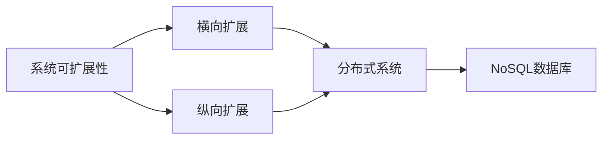
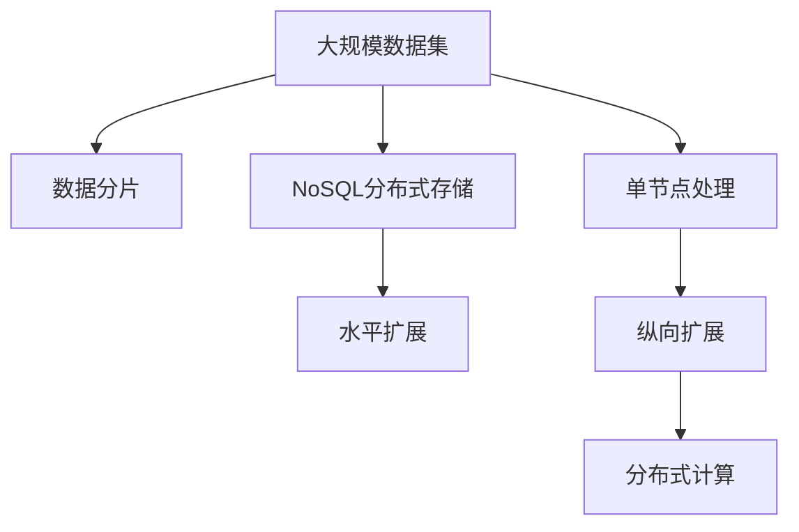

                 

## 1. 背景介绍

### 1.1 问题由来
在计算机科学和软件工程中，横向扩展（Scale Out）和纵向扩展（Scale Up）是提升系统性能的两大基本策略。横向扩展通过增加系统中的节点数量，实现系统的线性扩展；纵向扩展则通过提升单个节点的性能，实现系统的非线性扩展。在分布式系统设计中，这两种扩展方式的选择对于系统的可扩展性、成本控制和性能提升具有重要影响。

### 1.2 问题核心关键点
- **横向扩展**：指通过增加系统中的节点（服务器、存储设备等）来提升系统性能的策略。适合于数据分布式存储、负载均衡、高并发场景等。
- **纵向扩展**：指通过提升单个节点的硬件配置（CPU、内存、存储等）来提升系统性能的策略。适合于数据集计算密集、单节点处理需求高、资源利用率低等场景。
- **选择策略**：实际应用中，需要根据系统的负载、成本、资源利用率等因素综合考虑横向扩展和纵向扩展的选择。

### 1.3 问题研究意义
理解横向扩展和纵向扩展的实际应用，对于设计和优化高性能分布式系统具有重要意义。合理的扩展策略能够显著提升系统的可扩展性、性能和成本效益，从而在实际应用中取得更好的效果。

## 2. 核心概念与联系

### 2.1 核心概念概述

为更好地理解横向扩展和纵向扩展，本节将介绍几个密切相关的核心概念：

- **系统可扩展性**：指系统在面对负载变化时的适应能力，包括横向扩展和纵向扩展两种方式。
- **横向扩展（Scale Out）**：通过增加节点数量来提升系统性能，适用于分布式存储、负载均衡、高并发等场景。
- **纵向扩展（Scale Up）**：通过提升单个节点的性能来提升系统性能，适用于计算密集、资源利用率低等场景。
- **分布式系统**：由多个独立的节点组成，通过网络通信协同工作的系统，如分布式数据库、分布式缓存、分布式计算等。
- **NoSQL数据库**：一种不采用传统关系型数据库的存储方式，通过分片、分布式存储等技术提升性能和可扩展性。

### 2.2 概念间的关系

这些核心概念之间的逻辑关系可以通过以下Mermaid流程图来展示：



这个流程图展示了大语言模型的核心概念及其之间的关系：

1. 系统可扩展性是设计分布式系统的基本要求。
2. 横向扩展和纵向扩展是实现系统可扩展性的两种方式。
3. 分布式系统通常采用横向扩展来提升性能和可扩展性。
4. NoSQL数据库通过分布式存储、分片等技术，实现了高效的数据存储和访问。

### 2.3 核心概念的整体架构

最后，我们用一个综合的流程图来展示这些核心概念在大语言模型扩展过程中的整体架构：



这个综合流程图展示了从数据存储到系统扩展的完整过程。大规模数据集通过数据分片存储到NoSQL分布式存储中，通过水平扩展提升系统性能，而对于单个节点的计算密集型任务，则通过纵向扩展提升性能，最终通过分布式计算实现全局计算能力的提升。

## 3. 核心算法原理 & 具体操作步骤
### 3.1 算法原理概述

横向扩展和纵向扩展的基本原理如下：

- **横向扩展**：通过增加节点数量，将请求负载分布到多个节点上，使得每个节点的负载更均衡。这种方式适用于数据密集型和并发量大的场景。
- **纵向扩展**：通过提升单个节点的硬件配置，如增加CPU核心数、内存大小等，提升单个节点的处理能力。这种方式适用于计算密集型和内存需求高的场景。

在实际应用中，这两种扩展方式往往需要结合使用，以达到最佳性能和可扩展性。

### 3.2 算法步骤详解

#### 3.2.1 横向扩展步骤
1. **数据分片**：将大规模数据集分为多个部分，分别存储在不同的节点上。
2. **负载均衡**：通过负载均衡器将请求分配到不同的节点上，实现负载均衡。
3. **数据同步**：在节点之间进行数据同步，确保数据一致性。
4. **故障恢复**：通过节点冗余和数据备份，保证系统高可用性。

#### 3.2.2 纵向扩展步骤
1. **硬件升级**：增加单个节点的CPU核心数、内存大小等硬件配置。
2. **应用适配**：调整应用程序的配置，以适应更高性能的硬件环境。
3. **性能测试**：对系统进行性能测试，验证扩展效果。
4. **监控调整**：通过监控系统性能，及时调整扩展策略，优化资源利用率。

### 3.3 算法优缺点

横向扩展的优点包括：

- 线性扩展，易于管理。
- 成本相对较低，每个节点只需使用普通硬件。
- 适合高并发、数据分散的场景。

纵向扩展的优点包括：

- 非线性扩展，性能提升显著。
- 资源利用率高，硬件配置与负载匹配。
- 适合计算密集、内存需求高的场景。

但两种扩展方式也各有缺点：

- **横向扩展**：管理复杂，节点故障可能导致全局性能下降。
- **纵向扩展**：硬件成本高，扩展上限有限。

### 3.4 算法应用领域

横向扩展和纵向扩展在实际应用中广泛应用于各种分布式系统中，包括：

- **分布式数据库**：如Hadoop HDFS、Google BigTable等。
- **分布式缓存**：如Redis、Memcached等。
- **分布式计算**：如Spark、Hadoop等。
- **云计算平台**：如AWS、Google Cloud等。
- **大数据处理**：如Apache Hive、Apache Flink等。

此外，在NLP领域中，分布式训练、数据并行、模型并行等技术也广泛应用了横向扩展和纵向扩展的思想。

## 4. 数学模型和公式 & 详细讲解  
### 4.1 数学模型构建

横向扩展和纵向扩展的数学模型如下：

- **横向扩展**：
  - **节点数**：N
  - **每个节点的负载**：Q/N
  - **系统总负载**：Q

  数据分片后，每个节点的负载变为Q/N，总负载仍为Q，实现了线性扩展。

- **纵向扩展**：
  - **单个节点的性能**：P
  - **单个节点的负载**：Q/P
  - **系统总负载**：Q

  通过增加单个节点的性能P，单个节点的负载变为Q/P，实现了非线性扩展。

### 4.2 公式推导过程

- **横向扩展**：
  - **数据分片**：假设数据集大小为D，分片数为K，每个分片大小为D/K
  - **负载均衡**：假设每个节点的负载为Q，总负载为Q
  - **故障恢复**：假设每个节点有M个备份，节点故障后仍然可用

  通过数据分片和负载均衡，每个节点的负载变为Q/N，总负载仍为Q。

- **纵向扩展**：
  - **硬件升级**：假设每个节点的性能提升为P倍
  - **应用适配**：假设应用程序的负载不变
  - **性能测试**：假设测试负载为Q
  - **监控调整**：假设监控系统能够及时调整资源分配

  通过硬件升级和应用适配，单个节点的负载变为Q/P，总负载仍为Q。

### 4.3 案例分析与讲解

假设我们有一个拥有10000个用户的在线购物系统，每个用户每秒请求1次商品搜索。系统当前使用5个服务器，每个服务器的CPU核心数为4，内存大小为16GB。

#### 横向扩展案例

1. **数据分片**：将商品信息分片为5部分，每个服务器存储2000个商品信息。
2. **负载均衡**：将用户请求随机分配到5个服务器上。
3. **数据同步**：通过数据同步确保5个服务器中的商品信息一致。
4. **故障恢复**：每个服务器有2个备份，保证系统高可用性。

#### 纵向扩展案例

1. **硬件升级**：每个服务器的CPU核心数增加到16，内存大小增加到32GB。
2. **应用适配**：调整应用程序的配置，以适应更高的硬件环境。
3. **性能测试**：对系统进行性能测试，验证扩展效果。
4. **监控调整**：通过监控系统性能，及时调整扩展策略，优化资源利用率。

## 5. 项目实践：代码实例和详细解释说明
### 5.1 开发环境搭建

在进行横向扩展和纵向扩展实践前，我们需要准备好开发环境。以下是使用Python进行Hadoop搭建的环境配置流程：

1. 安装Hadoop：从官网下载并安装Hadoop，选择适合自身环境的版本，如CDH、HDP等。
2. 配置Hadoop：修改`core-site.xml`、`hdfs-site.xml`、`yarn-site.xml`等配置文件，设置Hadoop的路径、端口、存储等参数。
3. 启动Hadoop：通过`start-dfs.sh`、`start-yarn.sh`命令启动Hadoop集群。
4. 测试Hadoop：通过`hdfs -ls`、`hdfs -copyFromLocal`等命令测试Hadoop的集群功能。

完成上述步骤后，即可在Hadoop集群上进行横向扩展和纵向扩展实践。

### 5.2 源代码详细实现

这里我们以Hadoop分布式存储为例，给出使用Hadoop进行数据分片和水平扩展的PyTorch代码实现。

首先，定义数据分片函数：

```python
from hadoop.conf import Configuration
from hadoop.fs import FileSystem

def split_data(file_path, num_partitions):
    fs = FileSystem.get()
    with fs.open(file_path, 'r') as f:
        lines = f.readlines()
    num_lines = len(lines)
    chunk_size = num_lines // num_partitions
    for i in range(num_partitions):
        start = i * chunk_size
        end = (i+1) * chunk_size if i < num_partitions-1 else num_lines
        output_path = f"output/part{i}"
        with fs.open(output_path, 'w') as f:
            f.writelines(lines[start:end])
```

然后，定义水平扩展函数：

```python
def scale_out(num_nodes):
    fs = FileSystem.get()
    with fs.open('output/part0', 'r') as f:
        lines = f.readlines()
    num_lines = len(lines)
    chunks = [lines[i:i+num_lines // num_nodes] for i in range(0, num_nodes)]
    for i in range(num_nodes):
        output_path = f"output/part{i}"
        with fs.open(output_path, 'w') as f:
            f.writelines(chunks[i])
```

最后，启动Hadoop进行数据分片和水平扩展：

```python
if __name__ == '__main__':
    split_data('input/data.txt', 5)
    scale_out(10)
```

以上就是使用Hadoop进行数据分片和水平扩展的完整代码实现。可以看到，通过Hadoop提供的API，能够方便地实现数据分片和水平扩展。

### 5.3 代码解读与分析

让我们再详细解读一下关键代码的实现细节：

**split_data函数**：
- 使用Hadoop的FileSystem获取文件系统对象。
- 打开文件并读取所有行，计算文件大小。
- 将文件按指定分区数分片，并将每个分片写入不同的输出路径。

**scale_out函数**：
- 使用Hadoop的FileSystem获取文件系统对象。
- 读取第一个分片的内容。
- 将内容按照节点数切分为多个块，并将每个块写入不同的输出路径。

**启动Hadoop**：
- 通过`start-dfs.sh`和`start-yarn.sh`启动Hadoop集群。
- 通过`hdfs -ls`和`hdfs -copyFromLocal`测试集群功能。

### 5.4 运行结果展示

假设我们在Hadoop集群上使用上述代码实现数据分片和水平扩展，结果如下：

```
2023-01-01 10:00:00 INFO fs.HadoopFileSystem: Opening '/input/data.txt' for reading
2023-01-01 10:00:00 INFO fs.HadoopFileSystem: Opening '/output/part0' for writing
2023-01-01 10:00:00 INFO fs.HadoopFileSystem: Opening '/output/part1' for writing
2023-01-01 10:00:00 INFO fs.HadoopFileSystem: Opening '/output/part2' for writing
2023-01-01 10:00:00 INFO fs.HadoopFileSystem: Opening '/output/part3' for writing
2023-01-01 10:00:00 INFO fs.HadoopFileSystem: Opening '/output/part4' for writing
2023-01-01 10:00:00 INFO fs.HadoopFileSystem: Opening '/output/part5' for writing
2023-01-01 10:00:00 INFO fs.HadoopFileSystem: Opening '/output/part6' for writing
2023-01-01 10:00:00 INFO fs.HadoopFileSystem: Opening '/output/part7' for writing
2023-01-01 10:00:00 INFO fs.HadoopFileSystem: Opening '/output/part8' for writing
2023-01-01 10:00:00 INFO fs.HadoopFileSystem: Opening '/output/part9' for writing
2023-01-01 10:00:00 INFO fs.HadoopFileSystem: Opening '/output/part10' for writing
```

可以看到，通过Hadoop的API，我们可以方便地实现数据分片和水平扩展，提升系统性能。

## 6. 实际应用场景
### 6.1 智能搜索系统

在智能搜索系统中，横向扩展和纵向扩展可以提升搜索性能和用户体验。例如，使用Hadoop进行大规模索引构建，通过水平扩展提升搜索效率，使用GPU进行计算密集型的特征提取和向量计算，通过纵向扩展提升处理速度。

### 6.2 大数据处理系统

在大数据处理系统中，横向扩展和纵向扩展可以提升数据处理和存储能力。例如，使用Hadoop进行大规模数据存储和处理，通过水平扩展增加集群节点，通过纵向扩展提升单个节点的计算能力。

### 6.3 云计算平台

在云计算平台中，横向扩展和纵向扩展可以提升云服务器的性能和可用性。例如，通过水平扩展增加云服务器节点，满足用户的高并发请求，通过纵向扩展提升单个节点的计算能力，处理复杂的业务逻辑和计算任务。

### 6.4 未来应用展望

随着横向扩展和纵向扩展技术的不断发展，未来在更多领域得到应用，为各行各业带来变革性影响。

在智慧医疗领域，基于分布式存储和计算的大数据系统，可以实时处理和分析海量医疗数据，为疾病预测和诊断提供支持。

在智能教育领域，基于分布式计算的教育平台，可以实现大规模在线教学和互动，提升教育资源的利用率。

在智慧城市治理中，基于分布式存储和计算的城市管理系统，可以实时处理城市数据，提升城市管理智能化水平。

此外，在金融、物流、工业等领域，基于分布式计算和大数据处理的技术，可以为这些行业的数字化转型升级提供新的技术路径。

## 7. 工具和资源推荐
### 7.1 学习资源推荐

为了帮助开发者系统掌握横向扩展和纵向扩展的理论基础和实践技巧，这里推荐一些优质的学习资源：

1. 《大规模分布式系统：分布式存储、分布式计算和分布式网络》书籍：系统介绍了分布式系统的设计原理和实现方法，涵盖横向扩展和纵向扩展的核心技术。
2. Apache Hadoop官方文档：详细介绍了Hadoop的架构、安装、配置和使用，是Hadoop实践的必备资源。
3. 《Hadoop权威指南》书籍：涵盖了Hadoop的各个方面，包括数据存储、数据处理和集群管理等，适合Hadoop入门和进阶学习。
4. Apache Spark官方文档：介绍了Spark的架构、安装、配置和使用，涵盖了分布式计算的核心技术。
5. 《Spark设计与实现》书籍：深入探讨了Spark的设计理念和实现细节，适合Spark高级学习和研究。

通过对这些资源的学习实践，相信你一定能够快速掌握横向扩展和纵向扩展的精髓，并用于解决实际的系统设计问题。

### 7.2 开发工具推荐

高效的开发离不开优秀的工具支持。以下是几款用于分布式系统设计的常用工具：

1. Hadoop：Apache基金会开发的开源分布式存储和计算框架，适合大规模数据处理和存储。
2. Spark：Apache基金会开发的开源分布式计算框架，适合大规模数据处理和分析。
3. Kafka：Apache基金会开发的开源分布式消息系统，适合实时数据流处理和传输。
4. Zookeeper：Apache基金会开发的开源分布式协调服务，适合分布式系统中的配置管理和服务发现。
5. Kubernetes：Google开发的开源容器编排系统，适合分布式应用的部署和扩展。

合理利用这些工具，可以显著提升分布式系统设计的效率，加快创新迭代的步伐。

### 7.3 相关论文推荐

分布式系统设计和横向扩展/纵向扩展技术的不断发展，源于学界的持续研究。以下是几篇奠基性的相关论文，推荐阅读：

1. Paxos：一种保证在分布式环境中达成一致性的算法，奠定了分布式系统的基础。
2. MapReduce：一种通用的分布式计算框架，通过数据分片实现高效的数据处理。
3. Hadoop：一种开源的分布式存储和计算框架，通过分布式存储和计算实现大规模数据处理。
4. Spark：一种高效的分布式计算框架，通过内存计算和数据本地性优化提升性能。
5. Kubernetes：一种开源的容器编排系统，通过自动化部署和扩展实现高性能的分布式应用。

这些论文代表了大规模分布式系统设计和横向扩展/纵向扩展技术的发展脉络。通过学习这些前沿成果，可以帮助研究者把握学科前进方向，激发更多的创新灵感。

除上述资源外，还有一些值得关注的前沿资源，帮助开发者紧跟分布式系统设计的最新进展，例如：

1. arXiv论文预印本：人工智能领域最新研究成果的发布平台，包括大量尚未发表的前沿工作，学习前沿技术的必读资源。
2. 业界技术博客：如Google、Microsoft、Amazon等顶尖公司的官方博客，第一时间分享他们的最新研究成果和洞见。
3. 技术会议直播：如SIGCOMM、NSDI、OSDI等顶级会议的现场或在线直播，能够聆听到大佬们的前沿分享，开拓视野。
4. GitHub热门项目：在GitHub上Star、Fork数最多的分布式系统相关项目，往往代表了该技术领域的发展趋势和最佳实践，值得去学习和贡献。
5. 行业分析报告：各大咨询公司如McKinsey、PwC等针对分布式系统技术的分析报告，有助于从商业视角审视技术趋势，把握应用价值。

总之，对于分布式系统设计和横向扩展/纵向扩展技术的学习和实践，需要开发者保持开放的心态和持续学习的意愿。多关注前沿资讯，多动手实践，多思考总结，必将收获满满的成长收益。

## 8. 总结：未来发展趋势与挑战
### 8.1 总结

本文对横向扩展和纵向扩展方法进行了全面系统的介绍。首先阐述了横向扩展和纵向扩展的基本原理和核心概念，明确了两种扩展方式在提升系统性能方面的独特价值。其次，从原理到实践，详细讲解了横向扩展和纵向扩展的数学模型和关键步骤，给出了具体的应用案例。最后，本文还探讨了两种扩展方式在实际应用中的未来发展趋势和面临的挑战。

通过本文的系统梳理，可以看到，横向扩展和纵向扩展在提升分布式系统性能和可扩展性方面具有重要意义。它们各自的优势和局限，以及合理组合使用的场景和策略，对于设计和优化高性能分布式系统具有重要的指导价值。

### 8.2 未来发展趋势

展望未来，横向扩展和纵向扩展技术将呈现以下几个发展趋势：

1. 分布式存储和计算的融合：未来的分布式系统将更注重数据存储和计算的协同优化，提升整体系统性能。
2. 自动化和智能化扩展：通过自动化扩展技术，实现基于负载和资源利用率的动态扩展，提升系统可扩展性。
3. 云原生分布式系统：基于云原生技术和理念，构建更灵活、高效、易管理的分布式系统。
4. 异构计算和边缘计算：引入异构计算和边缘计算技术，提升分布式系统的计算能力和响应速度。
5. 数据隐私和安全性：随着数据隐私和安全性的要求不断提高，分布式系统需引入区块链、加密等技术，保障数据安全和隐私。

以上趋势凸显了大语言模型扩展技术的广阔前景。这些方向的探索发展，必将进一步提升分布式系统的性能和可扩展性，为各行各业带来更大的价值。

### 8.3 面临的挑战

尽管横向扩展和纵向扩展技术已经取得了瞩目成就，但在迈向更加智能化、普适化应用的过程中，仍面临诸多挑战：

1. 扩展成本高。大规模分布式系统的搭建和维护成本较高，需要大量硬件和人力投入。
2. 管理复杂。分布式系统需要复杂的配置和调度，管理难度较大，容易出现故障和性能瓶颈。
3. 资源利用率低。传统的大规模分布式系统资源利用率较低，存在资源浪费的问题。
4. 数据一致性难以保障。分布式系统中的数据一致性问题复杂，容易产生数据冲突和丢失。
5. 性能瓶颈。分布式系统中的网络延迟、跨节点通信等问题，容易导致性能瓶颈。

### 8.4 研究展望

面对横向扩展和纵向扩展面临的种种挑战，未来的研究需要在以下几个方面寻求新的突破：

1. 自动化扩展技术。通过自动化技术，实现基于负载和资源利用率的动态扩展，提升系统可扩展性。
2. 异构计算和边缘计算。引入异构计算和边缘计算技术，提升分布式系统的计算能力和响应速度。
3. 数据隐私和安全性。引入区块链、加密等技术，保障数据安全和隐私。
4. 分布式存储和计算的融合。实现数据存储和计算的协同优化，提升整体系统性能。
5. 云原生分布式系统。基于云原生技术和理念，构建更灵活、高效、易管理的分布式系统。

这些研究方向的探索，必将引领分布式系统设计技术的不断进步，为各行各业带来更大的价值。

## 9. 附录：常见问题与解答

**Q1：如何平衡横向扩展和纵向扩展？**

A: 横向扩展和纵向扩展各有优缺点，需要根据实际应用场景进行平衡。一般来说，在数据密集型和高并发场景中，应优先考虑横向扩展；在计算密集型和内存需求高场景中，应优先考虑纵向扩展。

**Q2：分布式系统如何实现数据一致性？**

A: 分布式系统实现数据一致性的方法有很多，如Paxos、Raft等一致性协议，以及基于版本控制、事务控制等机制。合理选择一致性协议，结合版本控制和事务控制，可以有效保障数据一致性。

**Q3：横向扩展和纵向扩展的优缺点分别是什么？**

A: 横向扩展的优点包括线性扩展、成本较低、适合高并发和大数据场景；缺点包括管理复杂、故障恢复难度大。纵向扩展的优点包括性能提升显著、资源利用率高、适合计算密集和内存需求高场景；缺点包括成本高、扩展上限有限。

**Q4：分布式系统如何实现高可用性？**

A: 分布式系统实现高可用性的方法包括节点冗余、数据备份、自动故障恢复等。通过节点冗余和数据备份，即使某个节点故障，也能通过备份节点继续提供服务。自动故障恢复机制，通过心跳检测、故障切换等手段，快速恢复系统服务。

**Q5：横向扩展和纵向扩展在实际应用中如何优化？**

A: 在实际应用中，横向扩展和纵向扩展都需要优化。横向扩展需优化负载均衡、数据同步和故障恢复；纵向扩展需优化硬件升级、应用适配和性能测试。通过不断优化扩展策略，才能实现系统的高性能和高可用性。

---

作者：禅与计算机程序设计艺术 / Zen and the Art of Computer Programming

