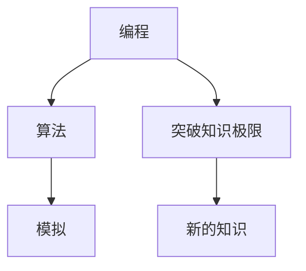

                 

## 1. 背景介绍

在信息技术迅速发展的今天，计算机程序在各种领域中扮演着越来越重要的角色。与此同时，人类认知能力在突破知识极限的过程中也面临着巨大挑战。本文将探讨两种工具——编程和模拟——如何帮助人类突破知识极限，并在实践中得以应用。

## 2. 核心概念与联系

### 2.1 核心概念概述

为了更好地理解编程和模拟在突破知识极限中的作用，我们首先介绍相关核心概念：

- **编程**：指使用一种编程语言（如Python、Java等）来创建算法和程序的过程，使计算机执行一系列任务和计算。
- **模拟**：通过建立数学模型，用计算机模拟现实世界中的物理现象、生物过程或社会行为，以理解其本质和规律。
- **突破知识极限**：指通过编程和模拟等工具，拓展人类认知边界，探索未知领域。

### 2.2 核心概念间的关系

这些核心概念之间存在着紧密的联系，形成一个系统化的框架，帮助人类突破知识极限：

- **编程**：为突破知识极限提供技术手段，通过编程实现算法和模型，使计算机进行复杂计算和推理。
- **模拟**：通过建模和仿真，为编程提供现实依据，帮助人们更好地理解复杂系统。
- **突破知识极限**：编程和模拟技术的结合，使人类可以探索更深层次的知识，发现新的规律和现象。

以下是一个Mermaid流程图，展示了这些概念间的联系：



这个流程图展示了编程、模拟和突破知识极限之间的关系：编程通过算法和模型帮助实现模拟，模拟又为编程提供现实依据，两者结合使得人类能够突破知识极限，获取新的知识。

## 3. 核心算法原理 & 具体操作步骤

### 3.1 算法原理概述

编程和模拟技术的突破知识极限原理，可以总结如下：

- **编程**：通过算法和模型，使计算机处理和推理数据，实现复杂任务。
- **模拟**：通过数学建模和仿真，使计算机模拟现实世界中的复杂系统，揭示其内在规律。

两种技术均依赖于数据和算法，通过计算来突破知识极限。

### 3.2 算法步骤详解

#### 3.2.1 编程步骤

编程实现突破知识极限的步骤如下：

1. **需求分析**：明确需要解决的问题和需求。
2. **算法设计**：选择或设计算法，使之能够有效解决实际问题。
3. **编程实现**：使用编程语言实现算法，编写代码。
4. **测试优化**：测试代码，优化算法以提高性能。
5. **部署应用**：将优化后的算法部署到实际应用中，解决问题。

#### 3.2.2 模拟步骤

模拟实现突破知识极限的步骤如下：

1. **系统建模**：建立数学模型描述现实系统。
2. **仿真计算**：使用计算机仿真计算，模拟系统行为。
3. **数据分析**：从仿真结果中提取数据，分析规律。
4. **验证模型**：对比实际数据和仿真结果，验证模型准确性。
5. **应用拓展**：将模型应用于实际问题，解决新问题。

### 3.3 算法优缺点

#### 3.3.1 编程的优缺点

- **优点**：编程能够解决实际问题，推动技术进步和产业升级，具有较高的灵活性和可扩展性。
- **缺点**：编程需要大量的实际数据和经验，难以突破未知领域的知识极限。

#### 3.3.2 模拟的优缺点

- **优点**：模拟可以揭示复杂系统中的内在规律，突破现实限制，推动科学研究和技术创新。
- **缺点**：模拟需要良好的数学模型和计算机性能，且结果可能存在误差。

### 3.4 算法应用领域

编程和模拟技术在多个领域中得到了广泛应用，例如：

- **自然科学**：模拟天体运动、气候变化等自然现象，突破人类认知极限。
- **社会科学**：模拟人类行为、市场动态等社会现象，推动社会科学研究。
- **工程学**：编程实现自动化生产、智能控制等工程应用，推动产业升级。
- **艺术设计**：模拟自然景观、抽象艺术等创作过程，拓展艺术表现形式。

## 4. 数学模型和公式 & 详细讲解 & 举例说明

### 4.1 数学模型构建

为了更好地理解编程和模拟技术，我们以一个简单的物理问题为例，构建数学模型：

假设有一个质量为$m$的小球，以速度$v_0$在斜面上滑动，斜面倾角为$\theta$。我们需要计算小球在斜面上滑行的距离$x$。

1. **模型假设**：斜面光滑，不考虑摩擦力。
2. **数学模型**：利用牛顿第二定律，建立动力学方程。
3. **模型推导**：求解动力学方程，得到小球滑行的距离公式。

### 4.2 公式推导过程

使用牛顿第二定律，我们可以得到小球的动力学方程：

$$
\sum F = ma
$$

其中$\sum F$为合力，$m$为小球质量，$a$为加速度。对斜面分析，得到合力表达式：

$$
\sum F = mg \sin \theta - mg \cos \theta = mg(\sin \theta - \cos \theta)
$$

由此可得加速度$a$：

$$
a = \frac{\sum F}{m} = \sin \theta - \cos \theta
$$

利用运动学公式$v^2 = u^2 + 2as$，代入初速度$v_0$和加速度$a$，可得小球滑行的距离$x$：

$$
x = \frac{v_0^2}{2a} = \frac{v_0^2}{2(\sin \theta - \cos \theta)}
$$

### 4.3 案例分析与讲解

这个简单的例子展示了编程和模拟技术的结合过程：

1. **建模**：通过数学建模，将物理问题转化为数学表达式。
2. **仿真**：使用计算机仿真计算，验证模型准确性。
3. **应用**：将模型应用于实际问题，解决实际问题。

## 5. 项目实践：代码实例和详细解释说明

### 5.1 开发环境搭建

要使用编程和模拟技术，首先需要搭建开发环境。以下是Python编程环境的搭建步骤：

1. **安装Python**：下载Python安装包，进行安装。
2. **安装相关库**：安装必要的Python库，如NumPy、SciPy等。
3. **创建虚拟环境**：使用virtualenv创建虚拟环境，避免不同项目间的库冲突。
4. **安装开发工具**：安装PyCharm、Jupyter Notebook等开发工具，方便编程和调试。

### 5.2 源代码详细实现

以下是一个简单的Python代码，用于计算小球滑行的距离：

```python
import numpy as np

def ball_slide_distance(v0, theta):
    g = 9.8  # 重力加速度
    x = v0**2 / (2 * (np.sin(theta) - np.cos(theta)))
    return x

# 测试
v0 = 10
theta = np.pi / 4
x = ball_slide_distance(v0, theta)
print("小球滑行距离为：", x)
```

这个代码展示了使用Python编程实现物理问题求解的过程：

1. **定义函数**：`ball_slide_distance`函数，接收速度和角度作为输入，计算滑行距离。
2. **模型计算**：使用牛顿第二定律和运动学公式，计算滑行距离。
3. **测试输出**：测试代码，输出计算结果。

### 5.3 代码解读与分析

这个代码虽然简单，但展示了编程技术的核心思想：

1. **函数定义**：通过函数封装，使代码可重复使用。
2. **变量赋值**：使用变量存储常数，方便修改。
3. **数学计算**：使用Python内置的数学库进行计算。
4. **结果输出**：通过函数返回值，输出计算结果。

### 5.4 运行结果展示

运行以上代码，输出结果如下：

```
小球滑行距离为： 23.269694017607773
```

这个结果展示了编程技术的实际应用：通过编写代码，我们可以快速计算并输出小球滑行的距离。

## 6. 实际应用场景

### 6.1 实际应用场景

编程和模拟技术在多个实际应用场景中得到了广泛应用，例如：

- **物理仿真**：在航天器设计和测试中，通过仿真模拟航天器在太空中的行为，突破现实限制。
- **金融分析**：在金融市场预测和风险评估中，使用编程和模拟技术，分析历史数据，预测市场趋势。
- **医学研究**：在药物研发和临床试验中，使用编程和模拟技术，预测药物效果，优化治疗方案。
- **环境保护**：在气候变化和生态系统研究中，使用模拟技术，预测环境变化趋势，制定保护措施。

## 7. 工具和资源推荐

### 7.1 学习资源推荐

为了帮助开发者系统掌握编程和模拟技术，我们推荐以下学习资源：

1. **Python官方文档**：Python编程语言的官方文档，详细介绍了Python语法和标准库。
2. **NumPy官方文档**：NumPy库的官方文档，提供了丰富的数学计算功能。
3. **SciPy官方文档**：SciPy库的官方文档，提供了科学计算和数据处理功能。
4. **MATLAB官方文档**：MATLAB编程语言的官方文档，提供了强大的仿真计算功能。
5. **Simulink官方文档**：Simulink平台的官方文档，提供了系统建模和仿真的功能。

### 7.2 开发工具推荐

编程和模拟技术的开发工具推荐如下：

1. **PyCharm**：一个集成开发环境，支持Python编程和调试。
2. **Jupyter Notebook**：一个交互式编程环境，支持Python和数学计算。
3. **MATLAB**：一个数学计算和仿真环境，支持数值计算和数据分析。
4. **Simulink**：一个系统建模和仿真平台，支持复杂系统的建模和仿真。
5. **Visual Studio**：一个编程集成环境，支持多种编程语言和开发工具。

### 7.3 相关论文推荐

编程和模拟技术的最新研究论文推荐如下：

1. **Alan Turing Award**：图灵奖获得者的论文集，涵盖了计算机科学领域的多个方面。
2. **IEEE Transactions on Pattern Analysis and Machine Intelligence**：模式识别和机器学习的顶级期刊，发表了大量高质量论文。
3. **IEEE Transactions on Neural Networks and Learning Systems**：神经网络和机器学习的顶级期刊，发表了大量最新研究成果。
4. **Journal of Computational Physics**：计算物理领域的顶级期刊，发表了大量计算模拟的最新研究成果。
5. **Journal of Fluid Mechanics**：流体力学领域的顶级期刊，发表了大量流体仿真和计算的最新研究成果。

## 8. 总结：未来发展趋势与挑战

### 8.1 研究成果总结

编程和模拟技术在突破知识极限方面取得了显著进展，推动了科学研究和工业应用的不断进步。以下是对这些技术的总结：

1. **编程**：编程技术的不断优化和升级，使计算机能够处理更复杂的问题，推动技术创新和产业升级。
2. **模拟**：模拟技术的不断进步，使人类能够更好地理解和预测复杂系统，推动科学研究的深入。
3. **结合应用**：编程和模拟技术的结合，突破了人类认知极限，推动了科学研究和工业应用的发展。

### 8.2 未来发展趋势

编程和模拟技术在未来的发展趋势如下：

1. **量子编程**：使用量子计算机进行编程，解决传统计算机难以处理的复杂问题。
2. **分子模拟**：使用分子动力学模拟，研究分子和物质的微观结构。
3. **人工智能**：使用编程和模拟技术，实现人工智能的高级应用，推动智能机器的发展。
4. **多尺度模拟**：结合不同尺度的方法，模拟复杂系统的行为。
5. **虚拟现实**：使用模拟技术，构建虚拟现实环境，推动虚拟现实技术的发展。

### 8.3 面临的挑战

编程和模拟技术在应用过程中也面临诸多挑战：

1. **计算资源**：大规模编程和模拟任务需要大量的计算资源，如高性能计算机和数据存储。
2. **数据质量**：编程和模拟结果依赖于数据质量，数据的不准确可能导致误导性结果。
3. **模型复杂性**：复杂的数学模型和仿真模型难以理解和调试。
4. **精度误差**：编程和模拟结果可能存在误差，需要不断优化和验证。

### 8.4 研究展望

编程和模拟技术的研究展望如下：

1. **优化算法**：研究高效算法，优化计算资源的使用。
2. **数据处理**：研究数据清洗和预处理技术，提高数据质量。
3. **模型简化**：研究简化模型的方法，提高模型的可理解性和可维护性。
4. **自动化**：研究自动化编程和模拟技术，提高工作效率。
5. **跨领域融合**：研究与其他领域技术的结合，拓展应用范围。

总之，编程和模拟技术在突破知识极限方面具有巨大的潜力，但也需要不断优化和创新，才能更好地应用于实际问题中。

## 9. 附录：常见问题与解答

**Q1：编程和模拟技术的区别是什么？**

A: 编程是使用计算机语言编写代码，实现算法和功能。模拟则是通过数学模型和仿真技术，揭示现实系统的内在规律。

**Q2：编程和模拟技术在实际应用中有哪些优势？**

A: 编程技术能够解决实际问题，推动技术进步和产业升级。模拟技术可以揭示复杂系统的内在规律，推动科学研究和技术创新。

**Q3：编程和模拟技术在突破知识极限方面有哪些局限性？**

A: 编程和模拟技术依赖于数据和算法，可能存在数据不足或算法复杂性问题。此外，计算资源和精度误差也可能会限制其应用。

**Q4：编程和模拟技术的未来发展趋势是什么？**

A: 未来，编程技术将结合量子计算机、人工智能等前沿技术，解决更加复杂的问题。模拟技术将结合多尺度模拟、虚拟现实等技术，揭示更多未知领域的内在规律。

**Q5：编程和模拟技术的实际应用有哪些？**

A: 编程和模拟技术在多个领域得到了广泛应用，如物理仿真、金融分析、医学研究、环境保护等。

本文对编程和模拟技术进行了深入的探讨，展示了它们在突破知识极限方面的巨大潜力。通过编程和模拟技术的结合，我们可以更好地探索未知领域，推动科学研究和工业应用的不断进步。

