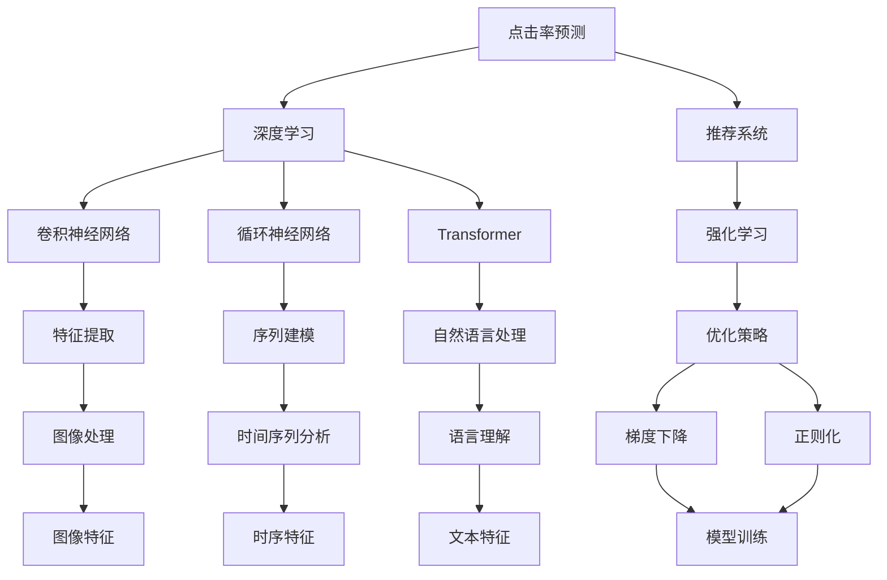
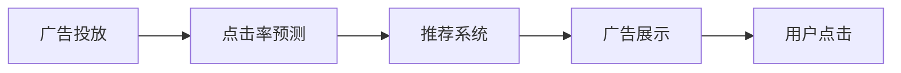
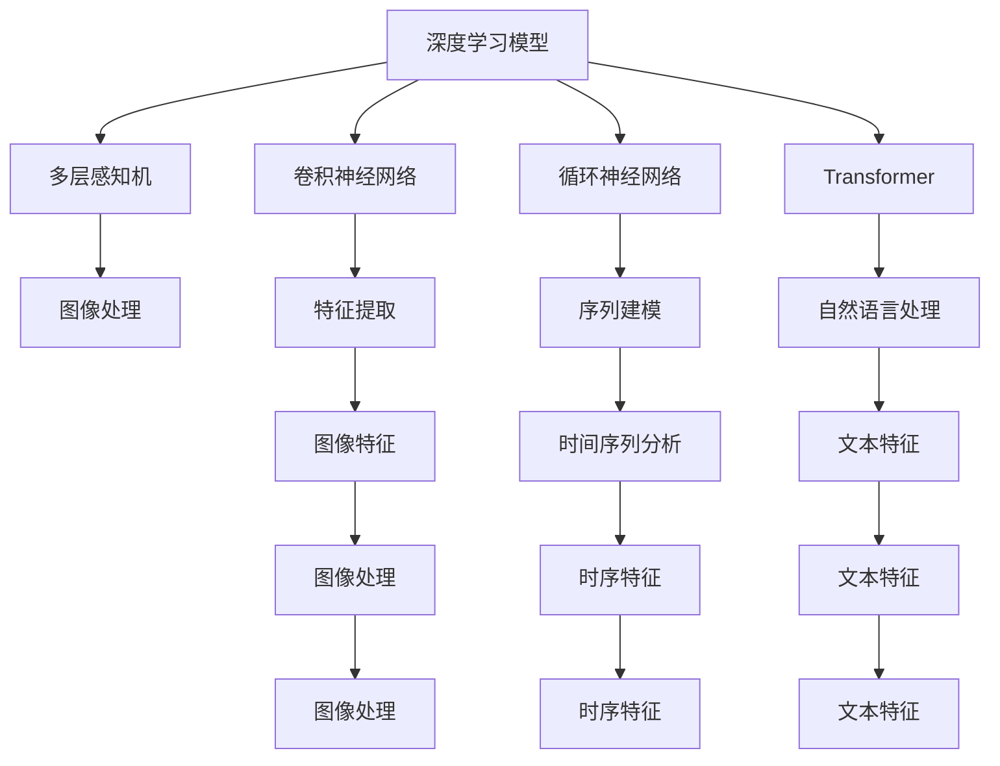
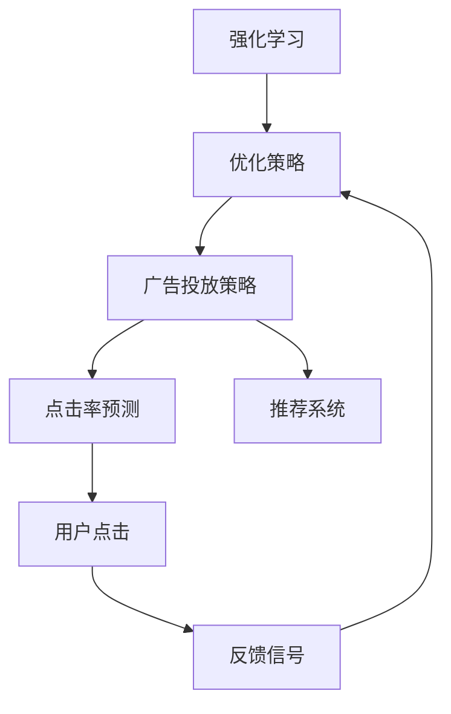

                 

# 深度学习在广告投放中的应用

> 关键词：深度学习,广告投放,强化学习,CTR预测,点击率,推荐系统,优化算法

## 1. 背景介绍

### 1.1 问题由来

随着互联网的普及和智能手机的广泛使用，在线广告投放已成为各大电商平台和应用的主要营销手段。然而，广告投放的ROI（投资回报率）始终是一个令广告主和平台方都深感头痛的问题。广告点击率（CTR）的准确预测对于提升广告效果、降低投放成本至关重要。传统广告投放主要依赖手工设计的特征和规则，难以满足广告投放场景的复杂性和动态变化性。而深度学习技术，特别是神经网络，以其强大的泛化能力和高效率，成为了广告投放预测中不可或缺的工具。

### 1.2 问题核心关键点

当前广告投放中的深度学习技术主要集中在点击率（CTR）预测和推荐系统优化两个方向。点击率预测的任务是准确估计用户点击广告的概率，从而优化广告投放策略；推荐系统则根据用户行为，推荐用户可能感兴趣的广告，提高广告转化率。这些应用通常通过以下核心关键点来实现：

- **特征工程**：收集并设计高质量的特征，利用深度学习模型学习广告与用户之间的复杂关联。
- **模型选择**：选择合适的深度学习模型，如多层感知机（MLP）、卷积神经网络（CNN）、循环神经网络（RNN）、Transformer等，以及它们的变种，以适应不同的广告投放场景。
- **损失函数设计**：设计合适的损失函数，以衡量模型预测与实际点击率之间的差异。
- **优化算法**：采用如随机梯度下降（SGD）、Adam、RMSprop等优化算法，更新模型参数，使其能够更准确地预测CTR。
- **评估与调优**：通过交叉验证、A/B测试等方法，评估模型效果，不断调优模型和超参数。

## 2. 核心概念与联系

### 2.1 核心概念概述

为更好地理解深度学习在广告投放中的应用，本节将介绍几个密切相关的核心概念：

- **点击率预测（CTR Prediction）**：预测用户在点击广告的概率，是广告投放中最重要的任务之一。
- **推荐系统（Recommendation System）**：根据用户历史行为和兴趣，推荐相关广告，以提高广告效果。
- **深度学习（Deep Learning）**：基于多层神经网络模型，自动学习特征表示和模式识别。
- **强化学习（Reinforcement Learning）**：通过与环境的交互，优化策略，以最大化累积奖励。
- **交叉熵损失（Cross-Entropy Loss）**：用于衡量模型预测与真实标签之间的差异。
- **梯度下降（Gradient Descent）**：一种常用的优化算法，通过梯度信息更新模型参数。
- **正则化（Regularization）**：防止模型过拟合，如L1正则、L2正则等。
- **卷积神经网络（Convolutional Neural Network, CNN）**：用于图像处理和特征提取。
- **循环神经网络（Recurrent Neural Network, RNN）**：用于序列数据处理。
- **Transformer**：一种自注意力机制的神经网络架构，广泛应用于自然语言处理领域。

这些核心概念之间的逻辑关系可以通过以下Mermaid流程图来展示：



这个流程图展示了大语言模型微调过程中各个核心概念的关系和作用：

1. 点击率预测和推荐系统都是广告投放中应用深度学习的典型场景。
2. 深度学习通过卷积神经网络、循环神经网络和Transformer等多种架构，实现不同类型特征的提取和建模。
3. 强化学习通过优化策略，提高广告投放的ROI。
4. 正则化技术防止模型过拟合，提升模型泛化能力。
5. 梯度下降算法更新模型参数，优化损失函数。
6. 特征工程涉及图像处理、序列建模、自然语言处理等多个子领域，是深度学习在广告投放中不可或缺的一部分。

这些概念共同构成了深度学习在广告投放中的应用框架，使其能够在各种场景下发挥强大的预测和优化能力。通过理解这些核心概念，我们可以更好地把握深度学习在广告投放中的应用范式。

### 2.2 概念间的关系

这些核心概念之间存在着紧密的联系，形成了深度学习在广告投放中的完整生态系统。下面我通过几个Mermaid流程图来展示这些概念之间的关系。

#### 2.2.1 广告投放的基本流程



这个流程图展示了广告投放的基本流程：首先进行点击率预测，然后基于预测结果推荐广告，广告展示给用户后，用户进行点击操作，形成数据反馈。

#### 2.2.2 深度学习模型的选择与应用



这个流程图展示了深度学习模型在广告投放中的应用场景。不同的模型适用于不同的特征类型，如图像处理、序列建模、自然语言处理等。

#### 2.2.3 强化学习在广告投放中的作用



这个流程图展示了强化学习在广告投放中的作用。通过优化策略，广告投放策略可以根据用户的点击反馈进行动态调整，从而优化广告投放效果。

### 2.3 核心概念的整体架构

最后，我们用一个综合的流程图来展示这些核心概念在大语言模型微调过程中的整体架构：

```mermaid
graph TB
    A[广告数据] --> B[点击率预测]
    A --> C[用户行为数据]
    A --> D[广告特征]
    B --> E[深度学习模型]
    C --> F[用户特征]
    D --> G[广告特征]
    E --> H[点击率预测模型]
    F --> I[用户特征]
    G --> J[广告特征]
    H --> K[模型训练]
    I --> L[用户特征]
    J --> M[广告特征]
    K --> N[优化算法]
    K --> O[损失函数]
    K --> P[正则化]
    L --> Q[用户特征]
    M --> R[广告特征]
    N --> S[梯度下降]
    O --> S
    P --> S
    Q --> T[用户特征]
    R --> U[广告特征]
    T --> V[用户特征]
    U --> W[广告特征]
    V --> X[用户特征]
    W --> Y[广告特征]
    X --> Z[用户特征]
    Y --> AA[广告特征]
    Z --> AB[用户特征]
    AA --> AC[广告特征]
    AB --> AD[用户特征]
    AC --> AE[广告特征]
    AD --> AF[用户特征]
    AE --> AG[广告特征]
    AF --> AH[用户特征]
    AG --> AI[广告特征]
    AH --> AJ[用户特征]
    AI --> AK[广告特征]
    AJ --> AL[用户特征]
    AK --> AM[广告特征]
    AL --> AN[用户特征]
    AM --> AO[广告特征]
    AN --> AP[用户特征]
    AO --> AQ[广告特征]
    AP --> AR[用户特征]
    AQ --> AS[广告特征]
    AR --> AT[用户特征]
    AS --> AU[广告特征]
    AT --> AV[用户特征]
    AU --> AW[广告特征]
    AV --> AX[用户特征]
    AW --> AY[广告特征]
    AX --> AZ[用户特征]
    AY --> BA[广告特征]
    AZ --> BB[用户特征]
    BA --> BC[广告特征]
    BB --> BD[用户特征]
    BC --> BE[广告特征]
    BD --> BF[用户特征]
    BE --> BG[广告特征]
    BF --> BH[用户特征]
    BG --> BI[广告特征]
    BH --> BJ[用户特征]
    BI --> BK[广告特征]
    BJ --> BL[用户特征]
    BK --> BM[广告特征]
    BL --> BN[用户特征]
    BM --> BO[广告特征]
    BN --> BP[用户特征]
    BO --> BQ[广告特征]
    BP --> BR[用户特征]
    BQ --> BS[广告特征]
    BR --> BT[用户特征]
    BS --> BU[广告特征]
    BT --> BV[用户特征]
    BU --> BW[广告特征]
    BV --> BX[用户特征]
    BW --> BY[广告特征]
    BX --> BZ[用户特征]
    BY --> CA[广告特征]
    BZ --> CB[用户特征]
    CA --> CC[广告特征]
    CB --> CD[用户特征]
    CC --> CE[广告特征]
    CD --> CF[用户特征]
    CE --> CG[广告特征]
    CF --> CH[用户特征]
    CG --> CI[广告特征]
    CH --> CJ[用户特征]
    CI --> CK[广告特征]
    CJ --> CL[用户特征]
    CK --> CM[广告特征]
    CL --> CN[用户特征]
    CM --> CO[广告特征]
    CN --> CP[用户特征]
    CO --> CQ[广告特征]
    CP --> CR[用户特征]
    CQ --> CS[广告特征]
    CR --> CT[用户特征]
    CS --> CU[广告特征]
    CT --> CV[用户特征]
    CU --> CW[广告特征]
    CV --> CX[用户特征]
    CW --> CY[广告特征]
    CX --> CZ[用户特征]
    CY --> DA[广告特征]
    CZ --> DB[用户特征]
    DA --> DC[广告特征]
    DB --> DD[用户特征]
    DC --> DE[广告特征]
    DD --> DF[用户特征]
    DE --> DG[广告特征]
    DF --> DH[用户特征]
    DG --> DI[广告特征]
    DH --> DJ[用户特征]
    DI --> DK[广告特征]
    DJ --> DL[用户特征]
    DK --> DM[广告特征]
    DL --> DN[用户特征]
    DM --> DO[广告特征]
    DN --> DP[用户特征]
    DO --> DQ[广告特征]
    DP --> DR[用户特征]
    DQ --> DS[广告特征]
    DR --> DT[用户特征]
    DS --> DU[广告特征]
    DT --> DV[用户特征]
    DU --> DW[广告特征]
    DV --> DX[用户特征]
    DW --> DY[广告特征]
    DX --> DZ[用户特征]
    DY --> EA[广告特征]
    DZ --> EB[用户特征]
    EA --> EC[广告特征]
    EB --> ED[用户特征]
    EC --> EE[广告特征]
    ED --> EF[用户特征]
    EE --> EG[广告特征]
    EF --> EH[用户特征]
    EG --> EI[广告特征]
    EH --> EJ[用户特征]
    EI --> EK[广告特征]
    EJ --> EL[用户特征]
    EK --> EM[广告特征]
    EL --> EN[用户特征]
    EM --> EO[广告特征]
    EN --> EP[用户特征]
    EO --> EQ[广告特征]
    EP --> ER[用户特征]
    EQ --> ES[广告特征]
    ER --> ET[用户特征]
    ES --> EU[广告特征]
    ET --> EV[用户特征]
    EU --> EW[广告特征]
    EV --> EX[用户特征]
    EW --> EY[广告特征]
    EX --> EZ[用户特征]
    EY --> FA[广告特征]
    EZ --> FB[用户特征]
    FA --> FC[广告特征]
    FB --> FD[用户特征]
    FC --> FE[广告特征]
    FD --> FF[用户特征]
    FE --> FG[广告特征]
    FF --> FH[用户特征]
    FG --> FI[广告特征]
    FH --> FJ[用户特征]
    FI --> FK[广告特征]
    FJ --> FL[用户特征]
    FK --> FM[广告特征]
    FL --> FN[用户特征]
    FM --> FO[广告特征]
    FN --> FP[用户特征]
    FO --> FQ[广告特征]
    FP --> FR[用户特征]
    FQ --> FS[广告特征]
    FR --> FT[用户特征]
    FS --> FU[广告特征]
    FT --> FV[用户特征]
    FU --> FW[广告特征]
    FV --> FX[用户特征]
    FW --> FY[广告特征]
    FX --> FZ[用户特征]
    FY --> GA[广告特征]
    FZ --> GB[用户特征]
    GA --> GC[广告特征]
    GB --> GD[用户特征]
    GC --> GE[广告特征]
    GD --> GF[用户特征]
    GE --> GG[广告特征]
    GF --> GH[用户特征]
    GG --> GI[广告特征]
    GH --> GJ[用户特征]
    GI --> GK[广告特征]
    GJ --> GL[用户特征]
    GK --> GM[广告特征]
    GL --> GN[用户特征]
    GM --> GO[广告特征]
    GN --> GP[用户特征]
    GO --> GQ[广告特征]
    GP --> GR[用户特征]
    GQ --> GS[广告特征]
    GR --> GT[用户特征]
    GS --> GU[广告特征]
    GT --> GV[用户特征]
    GU --> GW[广告特征]
    GV --> GX[用户特征]
    GW --> GY[广告特征]
    GX --> GZ[用户特征]
    GY --> HA[广告特征]
    GZ --> HB[用户特征]
    HA --> HC[广告特征]
    HB --> HD[用户特征]
    HC --> HE[广告特征]
    HD --> HF[用户特征]
    HE --> HG[广告特征]
    HF --> HH[用户特征]
    HG --> HI[广告特征]
    HH --> HJ[用户特征]
    HI --> HK[广告特征]
    HJ --> HL[用户特征]
    HK --> HM[广告特征]
    HL --> HN[用户特征]
    HM --> HO[广告特征]
    HN --> HP[用户特征]
    HO --> HQ[广告特征]
    HP --> HR[用户特征]
    HQ --> HS[广告特征]
    HR --> HT[用户特征]
    HS --> HU[广告特征]
    HT --> HV[用户特征]
    HU --> HW[广告特征]
    HV --> HX[用户特征]
    HW --> HY[广告特征]
    HX --> HZ[用户特征]
    HY --> IA[广告特征]
    HZ --> IB[用户特征]
    IA --> IC[广告特征]
    IB --> ID[用户特征]
    IC --> IE[广告特征]
    ID --> IF[用户特征]
    IE --> IG[广告特征]
    IF --> IH[用户特征]
    IG --> II[广告特征]
    IH --> IJ[用户特征]
    II --> IK[广告特征]
    IJ --> IL[用户特征]
    IK --> IM[广告特征]
    IL --> IN[用户特征]
    IM --> IO[广告特征]
    IN --> IP[用户特征]
    IO --> IQ[广告特征]
    IP --> IR[用户特征]
    IQ --> IS[广告特征]
    IR --> IT[用户特征]
    IS --> IU[广告特征]
    IT --> IV[用户特征]
    IU --> IW[广告特征]
    IV --> IX[用户特征]
    IW --> IY[广告特征]
    IX --> IZ[用户特征]
    IY --> JA[广告特征]
    IZ --> JB[用户特征]
    JA --> JC[广告特征]
    JB --> JD[用户特征]
    JC --> JE[广告特征]
    JD --> JF[用户特征]
    JE --> JG[广告特征]
    JF --> JH[用户特征]
    JG --> JI[广告特征]
    JH --> JJ[用户特征]
    JI --> JK[广告特征]
    JJ --> JL[用户特征]
    JK --> JM[广告特征]
    JL --> JN[用户特征]
    JM --> JO[广告特征]
    JN --> JP[用户特征]
    JO --> JQ[广告特征]
    JP --> JR[用户特征]
    JQ --> JS[广告特征]
    JR --> JT[用户特征]
    JS --> JU[广告特征]
    JT --> JV[用户特征]
    JU --> JW[广告特征]
    JV --> JX[用户特征]
    JW --> JY[广告特征]
    JX --> JZ[用户特征]
    JY --> KA[广告特征]
    JZ --> KB[用户特征]
    KA --> KC[广告特征]
    KB --> KD[用户特征]
    KC --> KE[广告特征]
    KD --> KF[用户特征]
    KE --> KG[广告特征]
    KF --> KH[用户特征]
    KG --> KI[广告特征]
    KH --> KJ[用户特征]
    KI --> KK[广告特征]
    KJ --> KL[用户特征]
    KK --> KM[广告特征]
    KL --> KN[用户特征]
    KM --> KO[广告特征]
    KN --> KP[用户特征]
    KO --> KQ[广告特征]
    KP --> KR[用户特征]
    KQ --> KS[广告特征]
    KR --> KT[用户特征]
    KS --> KU[广告特征]
    KT --> KV[用户特征]
    KU --> KW[广告特征]
    KV --> KX[用户特征]
    KW --> KY[广告特征]
    KX --> KZ[用户特征]
    KY --> LA[广告特征]
    KZ --> LB[用户特征]
    LA --> LC[广告特征]
    LB --> LD[用户特征]
    LC --> LE[广告特征]
    LD --> LF[用户特征]
    LE --> LG[广告特征]
    LF --> LH[用户特征]
    LG --> LI[广告特征]
    LH --> LJ[用户特征]
    LI --> LK[广告特征]
    LJ --> LL[用户特征]
    LK --> LM[广告特征]
    LL --> LN[用户特征]
    LM --> LO[广告特征]
    LN --> LP[用户特征]
    LO --> LQ[广告特征]
    LP --> LR[用户特征]
    LQ --> LS[广告特征]
    LR --> LT[用户特征]
    LS --> LU[广告特征]
    LT --> LV[用户特征]
    LU --> LW[广告特征]
    LV --> LX[用户特征]
    LW --> LY[广告特征]
    LX --> LZ[用户特征]
    LY --> MA[广告特征]
    LZ --> MB[用户特征]
    MA --> MC[广告特征]
    MB --> MD[用户特征]
    MC --> ME[广告特征]
    MD --> MF[用户特征]
    ME --> MG[广告特征]
    MF --> MH[用户特征]
    MG --> MI[广告特征]
    MH --> MJ[用户特征]
    MI --> MK[广告特征]
    MJ --> MN[用户特征]
    MK --> MO[广告特征]
    MN --> MP[用户特征]
    MO --> MQ[广告特征]
    MP --> MR[用户特征]
    MQ --> MS[广告特征]
    MR --> MT[用户特征]
    MS --> MU[广告特征]
    MT --> MV[用户特征]
    MU --> MW[广告特征]
    MV --> MX[用户特征]
    MW --> MY[广告特征]
    MX --> MZ[用户特征]
    MY --> NA[广告特征]
    MZ --> NB[用户特征]
    NA --> NC[广告特征]
    NB --> ND[用户特征]
    NC --> NE[广告特征]
    ND --> NF[用户特征]
    NE --> NG[广告特征]
    NF --> NH[用户特征]
    NG --> NI[广告特征]
    NH --> NJ[用户特征]
    NI --> NK[广告特征]
    NJ --> NL[用户特征]
    NK --> NM[广告特征]
    NL --> NN[用户特征]
    NM --> NO[广告特征]
    NN --> NP[用户特征]
    NO --> NQ[广告特征]
    NP --> NR[用户特征]
    NQ --> NS[广告特征]
    NR --> NT[用户特征]
    NS --> NU[广告特征]
    NT --> NV[用户特征]
    NU --> NW[广告特征]
    NV --> NX[用户特征]
    NW --> NY[广告特征]
    NX --> NZ[用户特征]
    NY --> OA[广告特征]
    NZ --> OB[用户特征]
    OA --> OC[广告特征]
    OB --> OD[用户特征]
    OC --> OE[广告特征]
    OD --> OF[用户特征]
    OE --> OG[广告特征]
    OF --> OH[用户特征]
    OG --> OI[广告特征]
    OH --> OJ[用户特征]
    OI --> OK[广告特征]
    OJ --> OL[用户特征]
    OK --> OM[广告特征]
    OL --> ON[用户特征]
    OM --> OO[广告特征]
    ON --> OP[用户特征]
    OO --> OQ[广告特征]
    OP --> OR[用户特征]
    OQ --> OS[广告特征]
    OR --> OT[用户特征]
    OS --> OU[广告特征]
    OT --> OV[用户特征]
    OU --> OW[广告特征]
    OV --> OX[用户特征]
    OW --> OY[广告特征]
    OX --> OZ[用户特征]
    OY --> PA[广告特征]
    OZ --> PB[用户特征]
    PA --> PC[广告特征]
    PB --> PD[用户特征]
    PC --> PE[广告特征]
    PD --> PF[用户特征]
    PE --> PG[广告特征]
    PF --> PH[用户特征]
    PG --> PI[广告特征]
    PH --> PJ[用户特征]
    PI --> PK[广告特征]
    PJ --> PL[用户特征]
    PK --> PM[广告特征]
    PL --> PN[用户特征]
    PM --> PO[广告特征]
    PN --> PP[用户特征]
    PO --> PQ[广告特征]
    PP --> PR[用户特征]
    PQ --> PS[广告特征]
    PR --> PT[用户特征]
    PS --> PU[广告特征]
    PT --> PV[用户特征]
    PU --> PW[广告特征]
    PV --> PX[用户特征]
    PW --> PY[广告特征]
    PX --> PZ[用户特征]
    PY --> QA[广告特征]
    PZ --> QB[用户特征]
    QA --> QC[广告特征]
    QB --> QD[用户特征]
    QC --> QE[广告特征]
    QD --> QF[用户特征]
    QE --> QG[广告特征]
    QF --> QH[用户特征]
    QG --> QI[广告特征]
    QH --> QJ[用户特征]
    QI --> QK[广告特征]
    QJ --> QL[用户特征]
    QK --> QM[广告特征]
    QL --> QN[用户特征]
    QM --> QO[广告特征]
    QN --> QP[用户特征]
    QO --> QQ[广告特征]
    QP --> QR[用户特征]
    QQ --> QS[广告特征]
    QR --> QT[用户特征]
    QS --> QU[广告特征]
    QT --> QV[用户特征]
    QU --> QW[广告特征]
    QV --> QX[用户特征]
    QW --> QY[广告特征]
    QX --> QZ[用户特征]
    QY --> RA[广告特征]
    QZ --> RB[用户特征]
    RA --> RC[广告特征]
    RB --> RD[用户特征]
    RC --> RE[广告特征]
    RD --> RF[用户特征]
    RE --> RG[广告特征]
    RF --> RH[用户特征]
    RG --> RI[广告特征]
    RH --> RJ[用户特征]
    RI --> RK[广告特征]
    RJ --> RL[用户特征]
    RK --> RM[广告特征]
    RL --> RN[用户特征]
    RM --> RO[广告特征]
    RN --> RP[用户特征]
    RO --> RQ[广告特征]
    RP --> RR[用户特征]
    RQ --> RS[广告特征]
    RR --> RT[用户特征]
    RS --> RU[广告特征]
    RT --> RV[用户特征]
    RU --> RW[广告特征]
    RV --> RX[用户特征]
    RW --> RY[广告特征]
    RX --> RZ[用户特征]
    RY --> SA[广告特征]
    RZ --> SB[用户特征]
    SA --> SC[广告特征]
    SB --> SD[用户特征]
    SC --> SE[广告特征]
    SD --> SF

