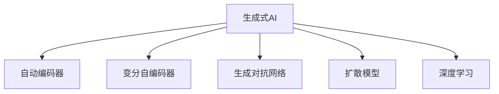
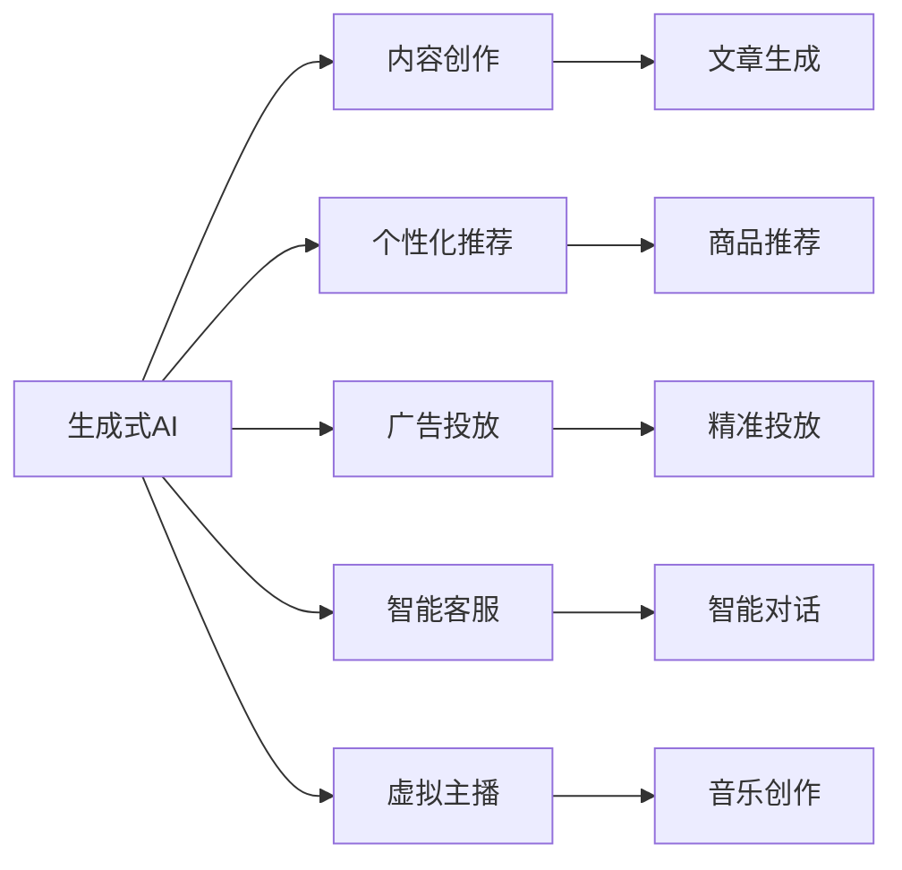
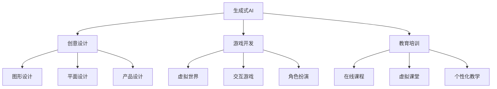
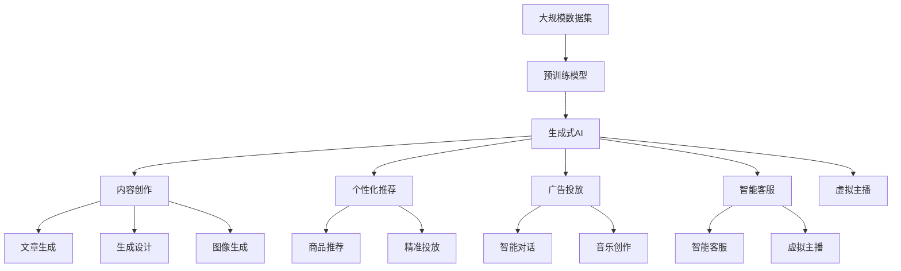

                 

# 生成式AIGC：从理论到实践的商业应用

> 关键词：生成式AIGC, AIGC商业应用, AI驱动的创意产业, 内容生成, 文本生成, 语音生成, 视频生成, 图像生成

## 1. 背景介绍

### 1.1 问题由来

近年来，人工智能（AI）技术在多个领域取得了飞速的发展，尤其是自然语言处理（NLP）、计算机视觉（CV）、语音处理等技术，为人类生产生活带来了颠覆性的变革。其中，生成式人工智能（Generative AI, GAI）作为AI领域的核心技术，为内容创作、创意设计、个性化推荐等领域注入了新的活力。

生成式AI技术主要通过机器学习算法，训练生成模型，使其能够根据给定的输入（如文本、图像、音频等）生成相应的输出。例如，文本生成模型可以生成文章、对话、歌词等内容；语音生成模型可以合成自然语音；图像生成模型可以生成逼真的图片和视频。这些技术的突破，让机器能够自动创作，极大地提升了内容生产和创意设计的效率和质量。

### 1.2 问题核心关键点

生成式AI技术的应用，不仅提高了内容的生产效率，还开创了新的商业模式，对传统产业带来了深远的影响。本节将详细探讨生成式AI技术在商业应用中的核心关键点，包括：

- 生成式AI技术的原理和架构
- 商业应用的场景和优势
- 实际案例分析
- 未来的发展趋势和挑战

### 1.3 问题研究意义

深入研究生成式AI技术在商业应用中的原理和实践，对于推动AI技术的落地应用，提升产业的智能化水平，具有重要的意义。具体来说：

1. **提高生产效率**：生成式AI技术可以自动化内容创作、图像设计、视频制作等环节，大幅提高生产效率，降低人力成本。
2. **优化用户体验**：通过个性化推荐、智能客服、虚拟主播等应用，生成式AI技术可以提升用户体验，增强用户粘性。
3. **开辟新商业模式**：生成式AI技术可以驱动内容创作、个性化推荐、广告投放等新业务，为企业带来新的盈利点。
4. **推动产业升级**：生成式AI技术在创意设计、游戏开发、教育培训等领域的应用，可以推动相关产业的数字化转型和智能化升级。
5. **促进跨界融合**：生成式AI技术可以与传统产业深度融合，开启新的产业生态，创造更多的商业机会。

## 2. 核心概念与联系

### 2.1 核心概念概述

为更好地理解生成式AI技术在商业应用中的原理和实践，本节将介绍几个密切相关的核心概念：

- **生成式AI（Generative AI, GAI）**：指通过机器学习算法训练生成模型，使其能够根据输入生成相应输出的技术。生成式AI包括文本生成、图像生成、语音生成等多种形式，广泛应用于内容创作、创意设计、个性化推荐等领域。
- **自动编码器（Autoencoder）**：一种无监督学习算法，通过压缩和解码的过程，学习数据的低维表示。自动编码器常用于数据降维、特征提取等任务。
- **变分自编码器（Variational Autoencoder, VAE）**：一种生成模型，通过生成样本的过程，学习数据的分布。VAE常用于生成逼真的图像、音频等。
- **生成对抗网络（Generative Adversarial Network, GAN）**：由生成器和判别器两个部分组成的网络，通过对抗训练的过程，生成高质量的样本。GAN常用于生成逼真的图像、视频等。
- **扩散模型（Diffusion Model）**：一种基于扩散过程的生成模型，通过逐步添加噪声的方式，将原始数据转化为生成数据。扩散模型在生成高质量图像、视频等方面表现优异。
- **深度学习（Deep Learning）**：一种基于多层神经网络的机器学习技术，通过训练大量数据，学习复杂的特征表示。深度学习常用于图像识别、语音识别、自然语言处理等领域。

这些核心概念之间的逻辑关系可以通过以下Mermaid流程图来展示：

```mermaid
graph TB
    A[生成式AI (GAI)] --> B[自动编码器]
    A --> C[变分自编码器]
    A --> D[生成对抗网络]
    A --> E[扩散模型]
    A --> F[深度学习]
    B --> G[数据降维]
    C --> H[数据分布学习]
    D --> I[高质量样本生成]
    E --> J[高质量图像/视频生成]
    F --> K[复杂特征表示]
```

这个流程图展示了大语言模型微调过程中各个核心概念的关系和作用：

1. 生成式AI通过多种生成模型学习数据的分布和表示。
2. 自动编码器、变分自编码器等算法用于学习数据的低维表示，提取特征。
3. 生成对抗网络、扩散模型等算法用于生成高质量的样本，如图像、音频等。
4. 深度学习算法用于训练复杂模型，学习数据的复杂表示。
5. 这些技术在商业应用中，可以用于内容创作、个性化推荐、广告投放等场景。

### 2.2 概念间的关系

这些核心概念之间存在着紧密的联系，形成了生成式AI技术的完整生态系统。下面我们通过几个Mermaid流程图来展示这些概念之间的关系。

#### 2.2.1 生成式AI的学习范式



这个流程图展示了大语言模型微调的几种主要学习范式：自动编码器、变分自编码器、生成对抗网络、扩散模型和深度学习。这些算法通过学习数据的分布和表示，生成高质量的样本，用于商业应用。

#### 2.2.2 生成式AI在商业应用中的场景



这个流程图展示了生成式AI在商业应用中的主要场景：内容创作、个性化推荐、广告投放、智能客服、虚拟主播等。通过生成式AI技术，这些场景可以自动化、智能化，提升效率和质量。

#### 2.2.3 生成式AI在跨界融合中的应用



这个流程图展示了生成式AI在跨界融合中的应用：创意设计、游戏开发、教育培训等领域。生成式AI技术在这些领域的应用，推动了传统产业的数字化转型和智能化升级。

### 2.3 核心概念的整体架构

最后，我们用一个综合的流程图来展示这些核心概念在生成式AI技术中的整体架构：



这个综合流程图展示了从预训练到生成式AI应用的完整过程。生成式AI技术通过在大规模数据集上进行预训练，学习数据的分布和表示，然后应用于内容创作、个性化推荐、广告投放等场景，驱动创意产业的发展。

## 3. 核心算法原理 & 具体操作步骤
### 3.1 算法原理概述

生成式AI技术主要包括自动编码器、变分自编码器、生成对抗网络、扩散模型等多种算法。本节将详细讲解这些算法的原理，以及如何在商业应用中进行操作。

### 3.2 算法步骤详解

#### 3.2.1 自动编码器算法

自动编码器是一种无监督学习算法，通过压缩和解码的过程，学习数据的低维表示。其基本流程如下：

1. **编码**：将输入数据$x$通过编码器$E$，映射到低维空间中的隐变量$z$。
2. **解码**：将隐变量$z$通过解码器$D$，映射回原始数据空间。
3. **重构误差**：计算$x$和$D(z)$之间的差异，作为损失函数。

具体来说，自动编码器由编码器和解码器两个部分组成，其数学模型如下：

$$
E(x) = \mu(z) + \sigma(z) * \epsilon \\
D(z) = \mu(x) + \sigma(x) * \epsilon \\
\ell(x, D(E(x))) = ||x - D(E(x))||^2
$$

其中，$\mu$表示均值，$\sigma$表示方差，$\epsilon$表示噪声。自动编码器的目标是最小化重构误差，即：

$$
\min_{\theta_E, \theta_D} \mathcal{L}(x) = ||x - D(E(x))||^2
$$

#### 3.2.2 变分自编码器算法

变分自编码器（VAE）是一种生成模型，通过生成样本的过程，学习数据的分布。其基本流程如下：

1. **编码**：将输入数据$x$通过编码器$E$，映射到隐变量$z$。
2. **生成**：从隐变量$z$通过解码器$D$，生成样本$x'$。
3. **重构误差和潜在变量误差**：计算$x$和$x'$之间的差异，以及$z$的分布与先验分布$p(z)$之间的差异，作为损失函数。

具体来说，VAE由编码器、解码器和潜在变量$z$组成，其数学模型如下：

$$
E(x) = \mu(z) + \sigma(z) * \epsilon \\
D(z) = \mu(x) + \sigma(x) * \epsilon \\
q(z|x) = \mathcal{N}(\mu(z), \sigma(z)^2) \\
p(z) = \mathcal{N}(0, I) \\
\ell(x, x', z) = ||x - x'||^2 + \frac{1}{2} \left(||\mu(z) - z||^2 + ||\sigma(z)||^2 - \log|\sigma(z)| \right)
$$

其中，$\mu$表示均值，$\sigma$表示方差，$\epsilon$表示噪声。VAE的目标是最小化重构误差和潜在变量误差，即：

$$
\min_{\theta_E, \theta_D} \mathcal{L}(x) = ||x - x'||^2 + \frac{1}{2} \left(||\mu(z) - z||^2 + ||\sigma(z)||^2 - \log|\sigma(z)| \right)
$$

#### 3.2.3 生成对抗网络算法

生成对抗网络（GAN）由生成器和判别器两个部分组成，通过对抗训练的过程，生成高质量的样本。其基本流程如下：

1. **生成器**：生成器$G$通过输入的噪声$z$，生成样本$x'$。
2. **判别器**：判别器$D$通过输入的数据$x$和生成的样本$x'$，判断其真实性。
3. **对抗训练**：生成器通过最大化判别器的损失函数，判别器通过最大化生成器的损失函数，两者进行对抗训练。

具体来说，GAN由生成器和判别器两个部分组成，其数学模型如下：

$$
G(z) = x' \\
D(x) = D(x', y) = \log \left(1 - D(x')\right) \\
D(x) = D(x', y) = -\log D(x') \\
\ell_G = \mathbb{E}_{p(z)}[-\log D(G(z))] + \lambda \mathbb{E}_{p(x)}[-\log(1 - D(x))] \\
\ell_D = \mathbb{E}_{p(z)}[-\log D(G(z))] + \lambda \mathbb{E}_{p(x)}[-\log D(x)]
$$

其中，$G$表示生成器，$D$表示判别器，$z$表示噪声，$x'$表示生成的样本。GAN的目标是最小化生成器的损失函数和判别器的损失函数，即：

$$
\min_G \max_D \ell_G
$$

#### 3.2.4 扩散模型算法

扩散模型（Diffusion Model）是一种基于扩散过程的生成模型，通过逐步添加噪声的方式，将原始数据转化为生成数据。其基本流程如下：

1. **初始化**：将原始数据$x$转化为噪声$z_0$。
2. **扩散过程**：逐步添加噪声，将$z_0$转化为生成数据$z_T$。
3. **解码**：将$z_T$通过解码器，生成生成数据$x'$。

具体来说，扩散模型由噪声添加和噪声移除两个部分组成，其数学模型如下：

$$
z_t = \sqrt{1 - \beta_t} z_{t-1} + \sqrt{\beta_t} \epsilon \\
x' = \sigma(z_T)
$$

其中，$z_t$表示扩散过程中的噪声，$\beta_t$表示噪声衰减率，$\epsilon$表示随机噪声，$x'$表示生成的数据。扩散模型的目标是最小化生成数据的误差，即：

$$
\min_{\beta, \sigma} \mathcal{L}(x, x')
$$

### 3.3 算法优缺点

生成式AI技术包括自动编码器、变分自编码器、生成对抗网络、扩散模型等多种算法，每种算法都有其优缺点。

#### 3.3.1 自动编码器的优缺点

**优点**：
- 简单高效，适用于数据降维和特征提取任务。
- 能够学习数据的低维表示，压缩存储空间。

**缺点**：
- 生成的样本质量较低，缺乏多样性。
- 需要大量数据进行训练，容易过拟合。

#### 3.3.2 变分自编码器的优缺点

**优点**：
- 生成的样本质量较高，多样性较好。
- 能够学习数据的分布，适用于生成任务。

**缺点**：
- 模型复杂度较高，训练难度较大。
- 生成的样本容易产生模式塌陷问题。

#### 3.3.3 生成对抗网络的优缺点

**优点**：
- 生成的样本质量较高，多样性较好。
- 能够生成逼真的图像、音频等。

**缺点**：
- 训练过程不稳定，容易产生模式崩溃问题。
- 模型复杂度较高，训练难度较大。

#### 3.3.4 扩散模型的优缺点

**优点**：
- 生成的样本质量较高，多样性较好。
- 训练过程较为稳定，生成的样本分布较好。

**缺点**：
- 模型复杂度较高，训练难度较大。
- 生成速度较慢，需要较长的时间。

### 3.4 算法应用领域

生成式AI技术在商业应用中，具有广泛的应用前景。本节将详细讲解生成式AI技术在内容创作、个性化推荐、广告投放、智能客服等领域的实际应用。

#### 3.4.1 内容创作

生成式AI技术在内容创作领域的应用，可以自动生成文章、音乐、视频等内容，极大地提高了内容创作的效率和质量。例如，OpenAI的GPT-3模型可以自动生成高质量的文章、对话等，Google的Diffusion模型可以生成逼真的图像、视频等。

#### 3.4.2 个性化推荐

生成式AI技术在个性化推荐领域的应用，可以自动推荐用户可能感兴趣的商品、内容等。例如，亚马逊使用基于GAN的技术，自动生成逼真的商品图片，用于个性化推荐。Netflix使用基于VAE的技术，自动生成电影、电视剧的预告片，用于个性化推荐。

#### 3.4.3 广告投放

生成式AI技术在广告投放领域的应用，可以自动生成高质量的广告素材，提高广告的点击率和转化率。例如，Facebook使用基于GAN的技术，自动生成高质量的图像广告，用于精准投放。Google使用基于VAE的技术，自动生成高质量的视频广告，用于精准投放。

#### 3.4.4 智能客服

生成式AI技术在智能客服领域的应用，可以自动回答用户的问题，提供24小时的客户服务。例如，阿里巴巴使用基于GAN的技术，自动生成逼真的虚拟主播，用于智能客服。腾讯使用基于VAE的技术，自动生成逼真的虚拟客服，用于智能客服。

## 4. 数学模型和公式 & 详细讲解 & 举例说明

### 4.1 数学模型构建

生成式AI技术的核心是生成模型，通过学习数据的分布和表示，生成高质量的样本。本节将详细讲解几种常见的生成模型，包括自动编码器、变分自编码器、生成对抗网络和扩散模型，并给出相应的数学模型。

#### 4.1.1 自动编码器

自动编码器的数学模型如下：

$$
E(x) = \mu(z) + \sigma(z) * \epsilon \\
D(z) = \mu(x) + \sigma(x) * \epsilon \\
\ell(x, D(E(x))) = ||x - D(E(x))||^2
$$

其中，$\mu$表示均值，$\sigma$表示方差，$\epsilon$表示噪声。

#### 4.1.2 变分自编码器

变分自编码器的数学模型如下：

$$
E(x) = \mu(z) + \sigma(z) * \epsilon \\
D(z) = \mu(x) + \sigma(x) * \epsilon \\
q(z|x) = \mathcal{N}(\mu(z), \sigma(z)^2) \\
p(z) = \mathcal{N}(0, I) \\
\ell(x, x', z) = ||x - x'||^2 + \frac{1}{2} \left(||\mu(z) - z||^2 + ||\sigma(z)||^2 - \log|\sigma(z)| \right)
$$

其中，$\mu$表示均值，$\sigma$表示方差，$\epsilon$表示噪声。

#### 4.1.3 生成对抗网络

生成对抗网络的数学模型如下：

$$
G(z) = x' \\
D(x) = D(x', y) = \log \left(1 - D(x')\right) \\
D(x) = D(x', y) = -\log D(x') \\
\ell_G = \mathbb{E}_{p(z)}[-\log D(G(z))] + \lambda \mathbb{E}_{p(x)}[-\log(1 - D(x))] \\
\ell_D = \mathbb{E}_{p(z)}[-\log D(G(z))] + \lambda \mathbb{E}_{p(x)}[-\log D(x)]
$$

其中，$G$表示生成器，$D$表示判别器，$z$表示噪声，$x'$表示生成的样本。

#### 4.1.4 扩散模型

扩散模型的数学模型如下：

$$
z_t = \sqrt{1 - \beta_t} z_{t-1} + \sqrt{\beta_t} \epsilon \\
x' = \sigma(z_T)
$$

其中，$z_t$表示扩散过程中的噪声，$\beta_t$表示噪声衰减率，$\epsilon$表示随机噪声，$x'$表示生成的数据。

### 4.2 公式推导过程

以下是几种生成模型的推导过程，用于更好地理解其数学原理。

#### 4.2.1 自动编码器的推导

自动编码器的推导如下：

1. **编码过程**：将输入数据$x$通过编码器$E$，映射到低维空间中的隐变量$z$。
2. **解码过程**：将隐变量$z$通过解码器$D$，映射回原始数据空间。
3. **重构误差**：计算$x$和$D(E(x))$之间的差异，作为损失函数。

具体来说，自动编码器的编码器$E$和解码器$D$可以表示为：

$$
E(x) = \mu(z) + \sigma(z) * \epsilon \\
D(z) = \mu(x) + \sigma(x) * \epsilon
$$

其中，$\mu$表示均值，$\sigma$表示方差，$\epsilon$表示噪声。

自动编码器的重构误差可以表示为：

$$
\ell(x, D(E(x))) = ||x - D(E(x))||^2
$$

通过最小化重构误差，自动编码器可以学习数据的低维表示。

#### 4.2.2 变分自编码器的推导

变分自编码器的推导如下：

1. **编码过程**：将输入数据$x$通过编码器$E$，映射到隐变量$z$。
2. **生成过程**：从隐变量$z$通过解码器$D$，生成样本$x'$。
3. **重构误差和潜在变量误差**：计算$x$和$x'$之间的差异，以及$z$的分布与先验分布$p(z)$之间的差异，作为损失函数。

具体来说，变分自编码器的编码器$E$、解码器$D$和潜在变量$q(z|x)$可以表示为：

$$
E(x) = \mu(z) + \sigma(z) * \epsilon \\
D(z) = \mu(x) + \sigma(x) * \epsilon \\
q(z|x) = \mathcal{N}(\mu(z), \sigma(z)^2)
$$

其中，$\mu$表示均值，$\sigma$表示方差，$\epsilon$表示噪声。

变分自编码器的重构误差和潜在变量误差可以表示为：

$$
\ell(x, x', z) = ||x - x'||^2 + \frac{1}{2} \left(||\mu(z) - z||^2 + ||\sigma(z)||^2 - \log|\sigma(z)| \right)
$$

通过最小化重构误差和潜在变量误差，变分自编码器可以学习数据的分布。

#### 4.2.3 生成对抗网络的推导

生成对抗网络的推导如下：

1. **生成过程**：生成器$G$通过输入的噪声$z$，生成样本$x'$。
2. **判别过程**：判别器$D$通过输入的数据$x$和生成的样本$x'$，判断其真实性。
3. **对抗训练**：生成器通过最大化判别器的损失函数，判别器通过最大化生成器的损失函数，两者进行对抗训练。

具体来说，生成对抗网络的生成器$G$和判别器$D$可以表示为：

$$
G(z) = x' \\
D(x) = D(x', y) = \log \left(1 - D(x')\right) \\
D(x) = D(x', y) = -\log D(x')
$$

其中，$G$表示生成器，$D$表示判别器，$z$表示噪声，$x'$表示生成的样本。

生成对抗网络的生成器的损失函数可以表示为：

$$
\ell_G = \mathbb{E}_{p(z)}[-\log D(G(z))] + \lambda \mathbb{E}_{p(x)}[-\log(1 - D(x))]
$$

生成对抗网络的判别器的损失函数可以表示为：

$$
\ell_D = \mathbb{E}_{p(z)}[-\log D(G(z))] + \lambda \mathbb{E}_{p(x)}[-\log D(x)]
$$

通过最小化生成器的损失函数和判别器的损失函数，生成对抗网络可以学习高质量的样本。

#### 4.2.4 扩散模型的推导

扩散模型的推导如下：

1. **初始化过程**：将原始数据$x$转化为噪声$z_0$。
2. **扩散过程**：逐步添加噪声，将$z_0$转化为生成数据$z_T$。
3. **解码过程**：将$z_T$通过解码器，生成生成数据$x'$。

具体来说，扩散模型的噪声添加过程可以表示为：

$$
z_t = \sqrt{1 - \beta_t} z_{t-1} + \sqrt{\beta_t} \epsilon
$$

其中，$z_t$表示扩散过程中的噪声，$\beta_t$表示噪声衰减率，$\epsilon$表示随机噪声。

扩散模型的解码过程可以表示为：

$$
x' = \sigma(z_T)
$$

其中，$z_T$表示生成的数据，$\sigma$表示解码器。

通过最小化生成数据的误差，扩散模型可以学习高质量的生成数据。

### 4.3 案例分析与讲解

#### 4.3.1 自动编码器案例

假设我们要对一组图像进行降维，将高维的图像数据压缩成低维的表示。具体来说，我们可以使用自动编码器进行降维操作。

1. **数据准备**：将原始图像数据$x$标准化，并将标准化后的图像数据输入编码器$E$。
2. **编码过程**：

