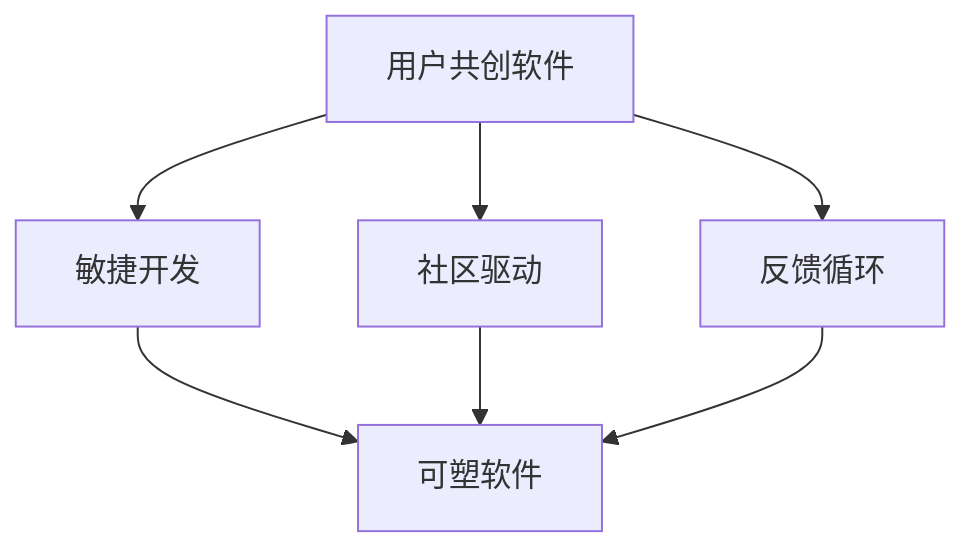
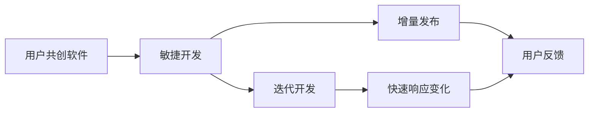
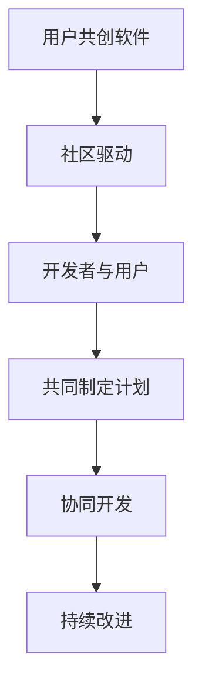
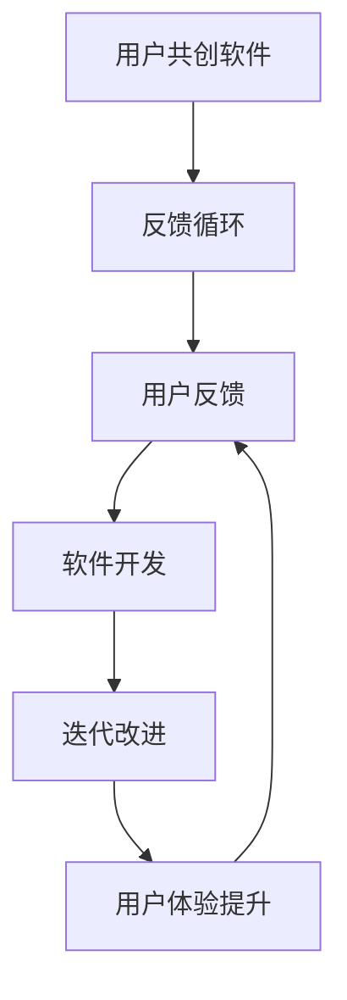
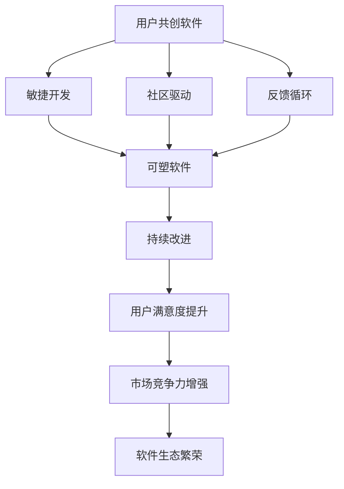

                 

# 用户共创的“可塑软件”

> 关键词：用户共创, 可塑软件, 社区驱动, 敏捷开发, 迭代改进, 反馈循环

## 1. 背景介绍

### 1.1 问题由来
随着科技的迅猛发展，软件工程领域面临着前所未有的挑战。快速变化的市场需求、不断升级的用户体验要求、日趋复杂的技术栈和系统架构，都使得传统软件开发模式变得效率低下、成本高昂。软件必须快速响应用户需求、适应市场变化，才能在激烈竞争中脱颖而出。

在这种背景下，一种全新的软件开发模式——用户共创软件（User-Co-Created Software）应运而生。用户共创软件强调用户参与开发过程，通过社区驱动、敏捷迭代的方式，不断改进软件功能，使其适应用户需求、紧跟技术趋势。

### 1.2 问题核心关键点
用户共创软件的核心在于“共创”二字。它打破了传统软件开发中开发者与用户之间的界限，将用户视为共同开发者，充分发挥其智慧和创造力，利用社区力量推动软件持续优化。以下是用户共创软件的几个关键特点：

1. **用户参与设计**：用户通过提出需求、反馈意见等方式，深度参与软件设计过程，确保软件功能符合用户实际需求。
2. **社区驱动开发**：软件开发者与用户组成社区，共同制定开发计划，通过迭代发布的方式不断完善软件功能。
3. **迭代改进**：软件开发遵循敏捷开发原则，定期发布新版本，快速响应用户反馈，持续改进软件性能。
4. **反馈循环**：用户反馈与开发迭代形成良性循环，软件功能不断优化，用户体验逐步提升。

### 1.3 问题研究意义
用户共创软件的核心理念是“用户参与，社区驱动”。它不仅提升了软件开发的效率和质量，还增强了用户对软件的认同感和忠诚度。在传统软件开发模式中，用户往往被动接受软件功能，而用户共创软件则通过“共创”模式，让用户成为产品的主人，极大地提升了用户体验和满意度。

此外，用户共创软件还推动了开源社区的繁荣发展，促进了技术交流与知识共享。开发者和用户共同解决问题，构建了一个开放、包容、创新的技术生态系统，推动了软件技术和应用的不断进步。

## 2. 核心概念与联系

### 2.1 核心概念概述

为了深入理解用户共创软件，本节将介绍几个核心概念及其相互关系：

- **用户共创软件（User-Co-Created Software）**：指用户与开发者共同参与设计、开发和维护的软件。用户不仅提供需求和反馈，还参与软件功能的实现和测试。

- **敏捷开发（Agile Development）**：一种基于迭代、增量的软件开发方法，强调快速响应变化、用户反馈和团队协作。

- **社区驱动（Community-Driven）**：通过开发者和用户组成社区，共同制定开发计划和目标，实现软件开发的社会化、协同化。

- **反馈循环（Feedback Loop）**：用户反馈与软件开发形成循环，不断迭代改进，提升软件性能和用户体验。

- **可塑软件（Plastic Software）**：指能够快速适应变化、不断优化的软件，具有高度的可塑性和灵活性。

这些核心概念之间的逻辑关系可以通过以下Mermaid流程图来展示：



这个流程图展示了用户共创软件的关键要素和它们之间的关系：

1. 用户共创软件通过敏捷开发和社区驱动，实现快速响应变化和用户反馈。
2. 反馈循环贯穿于软件开发的每个环节，确保用户需求得到充分满足。
3. 可塑软件通过敏捷开发和反馈循环，具备高度的可塑性和灵活性，能够不断优化和适应新的需求。

### 2.2 概念间的关系

这些核心概念之间存在着紧密的联系，形成了用户共创软件的完整生态系统。下面通过几个Mermaid流程图来展示这些概念之间的关系：

#### 2.2.1 用户共创软件与敏捷开发的关系



这个流程图展示了用户共创软件与敏捷开发的关系：

1. 敏捷开发通过迭代开发和增量发布的方式，实现了快速响应变化和用户反馈。
2. 快速响应变化使得软件能够及时适应新的需求和市场变化。
3. 用户反馈进一步优化了软件功能和用户体验，形成良性循环。

#### 2.2.2 用户共创软件与社区驱动的关系



这个流程图展示了用户共创软件与社区驱动的关系：

1. 社区驱动将开发者和用户结合起来，共同制定软件开发计划。
2. 协同开发和持续改进使得软件开发更具社会化和协作性。
3. 共同制定计划和持续改进形成了社区驱动的核心机制。

#### 2.2.3 用户共创软件与反馈循环的关系



这个流程图展示了用户共创软件与反馈循环的关系：

1. 用户反馈是反馈循环的起点，确保软件功能符合用户需求。
2. 软件开发和迭代改进是基于用户反馈的不断优化过程。
3. 用户体验提升是反馈循环的最终目标，形成了用户共创软件的良性循环。

### 2.3 核心概念的整体架构

最后，我们用一个综合的流程图来展示这些核心概念在大语言模型微调过程中的整体架构：



这个综合流程图展示了用户共创软件的关键要素和它们之间的关系：

1. 用户共创软件通过敏捷开发和社区驱动，实现快速响应变化和用户反馈。
2. 反馈循环贯穿于软件开发的每个环节，确保用户需求得到充分满足。
3. 可塑软件通过敏捷开发和反馈循环，具备高度的可塑性和灵活性，能够不断优化和适应新的需求。
4. 持续改进和用户满意度提升形成了用户共创软件的良性循环，提升了市场竞争力，推动了软件生态的繁荣发展。

## 3. 核心算法原理 & 具体操作步骤
### 3.1 算法原理概述

用户共创软件的核心算法原理在于敏捷开发、社区驱动和反馈循环的有机结合。具体而言，它包括以下几个关键步骤：

1. **需求收集与分析**：通过用户调查、需求文档等方式，收集用户需求和反馈，分析其共性问题和优先级。
2. **敏捷迭代开发**：采用敏捷开发方法，将软件开发分为多个迭代周期，每个周期快速发布新版本，进行功能和性能的迭代改进。
3. **社区参与设计**：将开发者与用户组成社区，共同制定开发计划和目标，通过社区讨论和投票等方式，确定优先开发的功能和改进项。
4. **反馈循环优化**：建立用户反馈与软件开发之间的良性循环，确保用户需求得到充分满足，不断优化软件功能和用户体验。

### 3.2 算法步骤详解

下面详细介绍用户共创软件的核心算法步骤：

#### 3.2.1 需求收集与分析

需求收集与分析是用户共创软件的起点，确保软件功能符合用户需求。具体步骤包括：

1. **用户调查**：通过问卷调查、用户访谈等方式，了解用户的实际需求和使用场景。
2. **需求文档**：将用户反馈整理成需求文档，详细记录用户的需求、功能点和优先级。
3. **需求分析**：对需求文档进行分析，提取共性问题和优先级，确定开发计划和目标。

#### 3.2.2 敏捷迭代开发

敏捷迭代开发是用户共创软件的核心方法，通过快速响应变化和用户反馈，实现软件功能的不断优化。具体步骤包括：

1. **迭代计划**：制定每个迭代周期的开发计划，明确功能目标和优先级。
2. **迭代开发**：每个迭代周期快速开发和发布新版本，进行功能优化和性能改进。
3. **用户测试**：在每个迭代周期结束后，邀请用户进行测试，收集反馈意见。

#### 3.2.3 社区参与设计

社区参与设计是用户共创软件的重要组成部分，通过开发者和用户的共同协作，实现软件的协同开发。具体步骤包括：

1. **社区组建**：将开发者与用户组成社区，共同制定开发计划和目标。
2. **社区讨论**：在社区平台上，进行功能需求讨论和投票，确定优先开发的功能和改进项。
3. **社区协作**：开发者与用户共同协作开发和测试，确保软件功能符合用户需求。

#### 3.2.4 反馈循环优化

反馈循环优化是用户共创软件的关键机制，通过用户反馈与开发迭代的良性循环，确保软件功能的不断优化。具体步骤包括：

1. **用户反馈收集**：在每个迭代周期结束后，收集用户反馈意见，分析其共性问题和优先级。
2. **软件开发优化**：根据用户反馈，优化软件功能和性能，进行迭代改进。
3. **用户体验提升**：持续改进软件用户体验，确保用户满意度提升。

### 3.3 算法优缺点

用户共创软件具有以下优点：

1. **快速响应变化**：通过敏捷开发和快速迭代，快速响应市场变化和用户需求。
2. **社区驱动协作**：利用社区力量，实现开发者与用户的协同开发，提高开发效率和质量。
3. **用户满意度提升**：通过持续改进和用户反馈，不断优化软件功能和用户体验。

同时，用户共创软件也存在以下缺点：

1. **需求复杂度增加**：用户需求的复杂度可能增加开发难度和成本。
2. **社区管理难度大**：社区协作和讨论需要有效的管理和协调，否则可能导致开发进度受阻。
3. **用户参与度低**：用户参与度不高，可能影响软件开发进度和功能优化效果。

### 3.4 算法应用领域

用户共创软件在多个领域得到了广泛应用，以下是一些典型案例：

1. **移动应用开发**：通过用户反馈和社区协作，不断优化和改进移动应用的功能和用户体验，如GitHub、Slack等。
2. **企业管理系统**：利用用户共创模式，提升企业管理系统的灵活性和适应性，如Trello、Asana等。
3. **游戏开发**：通过用户共创游戏内容和机制，提升游戏趣味性和可玩性，如Minecraft、World of Warcraft等。
4. **开源软件项目**：利用用户共创和社区驱动，实现开源软件的快速迭代和优化，如Linux、Apache等。
5. **智能助手**：通过用户共创和社区协作，提升智能助手的个性化和智能化水平，如Alexa、Siri等。

## 4. 数学模型和公式 & 详细讲解 & 举例说明

### 4.1 数学模型构建

用户共创软件的设计和优化可以通过数学模型来进行建模和分析。以下是用户共创软件的数学模型构建方法：

1. **用户需求矩阵**：将用户需求整理成矩阵形式，表示每个需求的功能点、优先级和用户反馈。
2. **敏捷迭代模型**：采用敏捷开发方法，将软件开发分为多个迭代周期，每个周期的时间长度和开发任务为常量。
3. **社区参与模型**：利用社区平台，将开发者与用户结合起来，通过投票和讨论确定优先开发的功能和改进项。
4. **反馈循环模型**：建立用户反馈与软件开发之间的良性循环，确保用户需求得到充分满足，不断优化软件功能和用户体验。

### 4.2 公式推导过程

下面详细介绍用户共创软件数学模型的公式推导过程：

#### 4.2.1 用户需求矩阵

用户需求矩阵 $D$ 表示用户需求的详细信息，包括每个需求的功能点、优先级和用户反馈。具体公式为：

$$
D = \begin{bmatrix}
F_1 & P_1 & F_2 & P_2 & \ldots & F_n & P_n \\
R_1 & U_1 & R_2 & U_2 & \ldots & R_n & U_n
\end{bmatrix}
$$

其中 $F_i$ 表示第 $i$ 个需求的功能点，$P_i$ 表示其优先级，$R_i$ 表示用户反馈意见，$U_i$ 表示用户满意度。

#### 4.2.2 敏捷迭代模型

敏捷迭代模型 $A$ 表示软件开发的分期计划，包括每个迭代周期的任务量和开发时间。具体公式为：

$$
A = \begin{bmatrix}
T_1 & T_2 & \ldots & T_m \\
D_1 & D_2 & \ldots & D_n
\end{bmatrix}
$$

其中 $T_i$ 表示第 $i$ 个迭代周期的开发时间，$D_i$ 表示该迭代周期需要完成的任务量。

#### 4.2.3 社区参与模型

社区参与模型 $C$ 表示社区协作和讨论的过程，通过投票和讨论确定优先开发的功能和改进项。具体公式为：

$$
C = \begin{bmatrix}
V_1 & V_2 & \ldots & V_m \\
F_1 & F_2 & \ldots & F_n
\end{bmatrix}
$$

其中 $V_i$ 表示第 $i$ 个迭代周期中的投票结果，$F_i$ 表示优先开发的功能和改进项。

#### 4.2.4 反馈循环模型

反馈循环模型 $F$ 表示用户反馈与软件开发之间的良性循环，确保用户需求得到充分满足，不断优化软件功能和用户体验。具体公式为：

$$
F = \begin{bmatrix}
U_1 & U_2 & \ldots & U_m \\
R_1 & R_2 & \ldots & R_n
\end{bmatrix}
$$

其中 $U_i$ 表示第 $i$ 个迭代周期中的用户满意度，$R_i$ 表示用户反馈意见。

### 4.3 案例分析与讲解

下面以一个具体的案例来分析用户共创软件的设计和优化过程：

**案例背景**：一款移动应用的设计和开发。

1. **用户需求矩阵**：通过问卷调查和用户访谈，收集用户需求和反馈，整理成矩阵形式。

2. **敏捷迭代模型**：将软件开发分为多个迭代周期，每个周期为2周，每个迭代周期开发1个新功能，优化1个旧功能。

3. **社区参与模型**：在社区平台上，邀请用户参与功能需求讨论和投票，确定优先开发的功能和改进项。

4. **反馈循环模型**：在每个迭代周期结束后，收集用户反馈意见，分析其共性问题和优先级，优化软件功能和用户体验。

通过以上四个数学模型，可以清晰地分析用户共创软件的设计和优化过程，确保软件功能符合用户需求，不断提升用户体验和市场竞争力。

## 5. 项目实践：代码实例和详细解释说明

### 5.1 开发环境搭建

在进行用户共创软件实践前，我们需要准备好开发环境。以下是使用Python进行Flask框架开发的完整环境配置流程：

1. 安装Python：从官网下载并安装Python 3.x版本，建议使用3.7及以上版本。

2. 安装Flask：使用pip命令安装Flask框架。

3. 创建Flask应用：创建一个简单的Flask应用，包括路由、视图函数等。

4. 配置数据库：使用SQLite或MySQL数据库，配置Flask应用的SQLAlchemy扩展。

5. 部署应用：将Flask应用部署到本地服务器或云平台，确保能够稳定运行。

### 5.2 源代码详细实现

下面以一个简单的用户共创软件平台为例，给出Flask框架的代码实现：

```python
from flask import Flask, request, jsonify

app = Flask(__name__)

# 用户需求数据库
app.config['SQLALCHEMY_DATABASE_URI'] = 'sqlite:///users.db'

# 用户需求模型
class UserRequest(db.Model):
    id = db.Column(db.Integer, primary_key=True)
    function = db.Column(db.String(256))
    priority = db.Column(db.Integer)
    feedback = db.Column(db.String(256))
    user_id = db.Column(db.Integer)

# 敏捷迭代模型
class AgileIteration(db.Model):
    id = db.Column(db.Integer, primary_key=True)
    time = db.Column(db.Integer)
    tasks = db.Column(db.String(256))

# 社区参与模型
class CommunityVote(db.Model):
    id = db.Column(db.Integer, primary_key=True)
    iteration = db.Column(db.Integer)
    feature = db.Column(db.String(256))
    vote_count = db.Column(db.Integer)

# 反馈循环模型
class UserFeedback(db.Model):
    id = db.Column(db.Integer, primary_key=True)
    iteration = db.Column(db.Integer)
    request_id = db.Column(db.Integer)
    user_id = db.Column(db.Integer)
    satisfaction = db.Column(db.Float)
    comment = db.Column(db.String(256))

@app.route('/requests', methods=['POST'])
def add_request():
    data = request.json
    request = UserRequest(function=data['function'], priority=data['priority'], feedback=data['feedback'], user_id=data['user_id'])
    db.session.add(request)
    db.session.commit()
    return jsonify({'message': 'Request added successfully'})

@app.route('/iterations', methods=['POST'])
def add_iteration():
    data = request.json
    iteration = AgileIteration(time=data['time'], tasks=data['tasks'])
    db.session.add(iteration)
    db.session.commit()
    return jsonify({'message': 'Iteration added successfully'})

@app.route('/votes', methods=['POST'])
def add_vote():
    data = request.json
    vote = CommunityVote(iteration=data['iteration'], feature=data['feature'], vote_count=data['vote_count'])
    db.session.add(vote)
    db.session.commit()
    return jsonify({'message': 'Vote added successfully'})

@app.route('/feedback', methods=['POST'])
def add_feedback():
    data = request.json
    feedback = UserFeedback(iteration=data['iteration'], request_id=data['request_id'], user_id=data['user_id'], satisfaction=data['satisfaction'], comment=data['comment'])
    db.session.add(feedback)
    db.session.commit()
    return jsonify({'message': 'Feedback added successfully'})

@app.route('/requests', methods=['GET'])
def get_requests():
    requests = UserRequest.query.all()
    result = []
    for request in requests:
        result.append({'id': request.id, 'function': request.function, 'priority': request.priority, 'feedback': request.feedback, 'user_id': request.user_id})
    return jsonify(result)

@app.route('/iterations', methods=['GET'])
def get_iterations():
    iterations = AgileIteration.query.all()
    result = []
    for iteration in iterations:
        result.append({'id': iteration.id, 'time': iteration.time, 'tasks': iteration.tasks})
    return jsonify(result)

@app.route('/votes', methods=['GET'])
def get_votes():
    votes = CommunityVote.query.all()
    result = []
    for vote in votes:
        result.append({'id': vote.id, 'iteration': vote.iteration, 'feature': vote.feature, 'vote_count': vote.vote_count})
    return jsonify(result)

@app.route('/feedback', methods=['GET'])
def get_feedback():
    feedback = UserFeedback.query.all()
    result = []
    for feedback in feedback:
        result.append({'id': feedback.id, 'iteration': feedback.iteration, 'request_id': feedback.request_id, 'user_id': feedback.user_id, 'satisfaction': feedback.satisfaction, 'comment': feedback.comment})
    return jsonify(result)

if __name__ == '__main__':
    app.run(debug=True)
```

以上代码展示了Flask框架的用户共创软件平台的基本功能，包括用户需求管理、敏捷迭代管理、社区投票管理和用户反馈管理。开发者可以根据实际需求，进一步扩展和优化这些功能，构建更加完善的共创平台。

### 5.3 代码解读与分析

让我们详细解读一下关键代码的实现细节：

1. **用户需求模型**：通过SQLAlchemy模型定义用户需求的信息结构，包括功能点、优先级、用户反馈等。

2. **敏捷迭代模型**：定义敏捷迭代的时间长度和任务量，确保每个迭代周期都能完成预定的开发任务。

3. **社区参与模型**：通过社区投票平台，收集用户对功能需求的投票结果，确定优先开发的功能和改进项。

4. **反馈循环模型**：记录用户对每个迭代周期的反馈意见和满意度，分析共性问题和优先级，优化软件功能和用户体验。

### 5.4 运行结果展示

假设我们在Flask平台上构建一个用户共创软件平台，运行结果如下：

- **用户需求管理**：通过用户调查和需求文档，收集用户需求和反馈，并进行整理和分析。

- **敏捷迭代管理**：采用敏捷开发方法，将软件开发分为多个迭代周期，每个周期快速发布新版本，进行功能和性能的迭代改进。

- **社区参与管理**：在社区平台上，邀请用户参与功能需求讨论和投票，确定优先开发的功能和改进项。

- **反馈循环管理**：建立用户反馈与软件开发之间的良性循环，确保用户需求得到充分满足，不断优化软件功能和用户体验。

## 6. 实际应用场景
### 6.1 移动应用开发

用户共创软件在移动应用开发中得到了广泛应用，通过用户反馈和社区协作，不断优化和改进移动应用的功能和用户体验。例如，GitHub、Slack等移动应用，利用用户共创模式，实现了快速迭代和优化。

### 6.2 企业管理系统

利用用户共创软件，提升企业管理系统的灵活性和适应性，如Trello、Asana等。企业可以根据员工和用户的需求，快速定制和管理项目，提升工作效率和满意度。

### 6.3 游戏开发

通过用户共创游戏内容和机制，提升游戏趣味性和可玩性，如Minecraft、World of Warcraft等。用户可以参与游戏设计和优化，提升游戏的互动性和用户体验。

### 6.4 开源软件项目

利用用户共创和社区驱动，实现开源软件的快速迭代和优化，如Linux、Apache等。开源社区通过用户贡献和协作，不断改进软件功能，推动技术进步和普及。

### 6.5 智能助手

通过用户共创和社区协作，提升智能助手的个性化和智能化水平，如Alexa、Siri等。智能助手可以根据用户反馈和需求，不断优化语音识别、自然语言处理等核心技术，提升用户体验。

## 7. 工具和资源推荐
### 7.1 学习资源推荐

为了帮助开发者掌握用户共创软件的设计和实现，以下是一些优质的学习资源：

1. **《用户共创软件设计》系列博文**：由用户共创软件专家撰写，深入浅出地介绍了用户共创软件的设计原理和实现方法。

2. **CS559《软件工程与协作》课程**：麻省理工学院开设的软件工程课程，讲解了软件开发和团队协作的先进理念和实践方法。

3. **《用户共创：社区驱动的软件设计》书籍**：详细介绍了用户共创软件的理论和实践，提供大量案例和成功经验。

4. **Flask官方文档**：Flask框架的官方文档，提供了丰富的开发指南和样例代码，是Flask开发的重要参考资料。

5. **GitHub开源项目**：包含大量用户共创软件的案例和实践，可以学习其他开发者成功经验，借鉴优秀的开发模式。

通过对这些资源的学习实践，相信你一定能够快速掌握用户共创软件的设计和实现，用于解决实际的开发问题。

### 7.2 开发工具推荐

高效的开发离不开优秀的工具支持。以下是几款用于用户共创软件开发的常用工具：

1. **Flask**：轻量级的Web框架，易于上手和扩展，适合快速构建用户共创软件平台。

2. **SQLAlchemy**：Python的ORM工具，支持多种数据库，提供便捷的数据库操作接口。

3. **GitHub**：全球最大的开源社区，提供代码托管、项目管理、协作开发等一站式服务。

4. **Jira**：项目管理工具，帮助团队进行任务分配、进度跟踪、需求管理等。

5. **Redmine**：开源项目管理工具，支持敏捷开发、版本控制、协作交流等。

合理利用这些工具，可以显著提升用户共创软件的开发效率，加快创新迭代的步伐。

### 7.3 相关论文推荐

用户共创软件的研究源于学界的持续探索。以下是几篇奠基性的相关论文，推荐阅读：

1. **《用户共创软件的理论与实践》**：介绍了用户共创软件的理论和实践，提供了系统性的解决方案。

2. **《敏捷开发的演变与挑战》**：探讨了敏捷开发的演变过程和面临的挑战，为敏捷开发提供了理论基础和实践指导。

3. **《社区驱动的软件开发》**：详细分析了社区驱动的协作模式和成功案例，为软件开发提供了新的思路和方法。

4. **《反馈循环：用户共创软件的核心》**：探讨了反馈循环在用户共创软件中的重要作用，提供了实际应用和优化建议。

5. **《用户共创软件与用户体验》**：分析了用户共创软件对用户体验的影响，提出了提升用户体验的方法和策略。

这些论文代表了大用户共创软件的研究方向和发展脉络，帮助研究者把握学科前进方向，激发更多的创新灵感。

除上述资源外，还有一些值得关注的前沿资源，帮助开发者紧跟用户共创软件的最新进展，例如：

1. **arXiv

