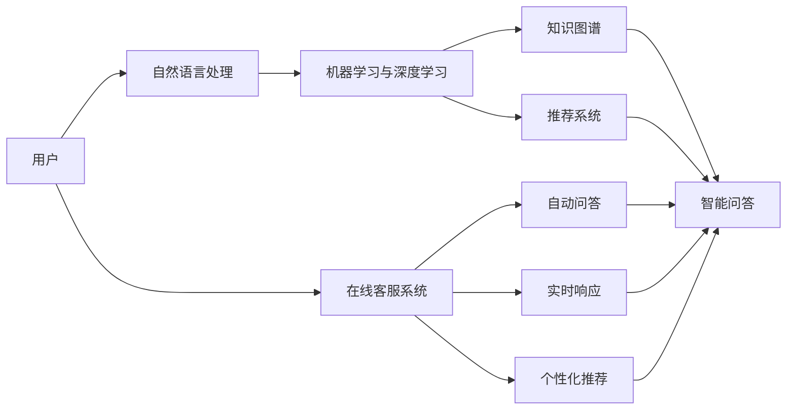
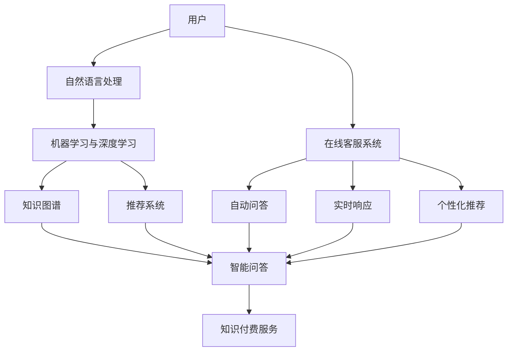

                 

# 知识付费赚钱的用户问答互动与在线客服

## 1. 背景介绍

### 1.1 问题由来

随着知识付费服务的兴起，越来越多的用户通过订阅付费内容获得高价值信息。这种模式不仅帮助用户避免了信息过载和筛选难题，同时也为内容创作者提供了稳定的收入来源。然而，知识付费的推广和运营面临着诸多挑战，其中用户互动与在线客服环节尤其关键。高效、智能的用户问答互动系统不仅能够提升用户体验，还能够极大地降低客服成本，促进知识付费服务的可持续发展。

### 1.2 问题核心关键点

实现高效智能的用户问答互动系统，需要解决以下几个核心问题：

1. **用户需求理解**：准确捕捉用户查询中的关键信息，理解其真正的需求。
2. **问题匹配与回答生成**：高效匹配问题并生成高质量的回答，涵盖准确性和时效性。
3. **系统实时响应**：在用户查询时，系统能够快速响应，提供即时服务。
4. **用户反馈收集**：持续收集用户反馈，优化系统性能和回答质量。
5. **个性化推荐**：根据用户历史行为，推荐可能感兴趣的知识内容。

解决这些问题，不仅可以提升用户满意度，还可以显著降低客服成本，为知识付费服务的长期发展奠定基础。

### 1.3 问题研究意义

构建高效智能的用户问答互动系统，对于知识付费服务的推广和运营具有重要意义：

1. **提升用户体验**：精准的理解和高效的回答，能够极大地提升用户的满意度。
2. **降低运营成本**：自动化的问答系统可以大幅度降低客服团队的工作量，节省运营成本。
3. **增强用户粘性**：通过个性化推荐，保持用户活跃度和订阅时长。
4. **促进内容发现**：帮助用户快速找到有价值的内容，促进知识付费平台的流量增长。
5. **推动技术创新**：在线客服系统可以集成多种前沿技术，如NLP、机器学习等，推动技术创新和应用。

## 2. 核心概念与联系

### 2.1 核心概念概述

为了更好地理解用户问答互动与在线客服系统的构建，本节将介绍几个关键概念：

1. **用户问答互动**：指用户通过提问和智能系统之间的互动，获取信息和解决问题。
2. **在线客服系统**：指通过自动化的问答系统，为用户提供即时的互动和支持。
3. **自然语言处理(NLP)**：指计算机理解和生成自然语言的技术，是实现智能问答的基础。
4. **机器学习与深度学习**：指利用算法训练模型，从数据中学习模式和规律，提高系统的预测和生成能力。
5. **知识图谱**：指通过语义网络构建的实体及其关系知识库，用于增强问答系统的准确性和完备性。
6. **推荐系统**：指根据用户历史行为和兴趣，推荐个性化内容的技术，用于提升用户满意度和平台粘性。

### 2.2 概念间的关系

这些核心概念之间存在着紧密的联系，形成了用户问答互动与在线客服系统的完整生态系统。下面通过一个Mermaid流程图来展示这些概念之间的关系：



这个流程图展示了从用户输入到最终回答的全流程，以及各个关键组件之间的相互作用：

1. **用户**：输入自然语言问题。
2. **自然语言处理**：对用户问题进行理解、解析和标准化。
3. **机器学习与深度学习**：利用模型预测问答结果，并从历史数据中学习。
4. **知识图谱**：提供实体和关系信息，增强问答的准确性和完备性。
5. **智能问答**：根据输入问题生成回答。
6. **推荐系统**：根据用户行为推荐相关内容。
7. **在线客服系统**：通过自动问答和实时响应，提供即时互动服务。

这些概念共同构成了用户问答互动与在线客服系统的核心技术框架，其高效运行依赖于各个组件之间的协同工作。

### 2.3 核心概念的整体架构

最后，我们用一个综合的流程图来展示这些核心概念在大语言模型微调过程中的整体架构：



这个综合流程图展示了从用户输入到最终回答的全流程，以及各个关键组件之间的相互作用，以及如何通过智能问答和推荐系统提升知识付费服务的质量和用户粘性。

## 3. 核心算法原理 & 具体操作步骤

### 3.1 算法原理概述

用户问答互动与在线客服系统的核心算法包括自然语言处理(NLP)、机器学习与深度学习、知识图谱和推荐系统。这些算法相互协同，共同实现高效、智能的用户互动和在线客服服务。

- **自然语言处理**：负责理解用户输入的自然语言问题，并将其转化为机器可以处理的格式。
- **机器学习与深度学习**：利用模型预测问答结果，并从历史数据中学习。
- **知识图谱**：提供实体和关系信息，增强问答的准确性和完备性。
- **推荐系统**：根据用户历史行为推荐相关内容，提升用户满意度和平台粘性。

### 3.2 算法步骤详解

#### 3.2.1 用户输入理解

用户通过文本输入方式提问，系统首先通过自然语言处理(NLP)技术，对用户问题进行理解、解析和标准化。NLP技术包括：

1. **分词**：将用户输入的文本按照词语进行切分。
2. **词性标注**：对每个词语进行词性标注，如名词、动词等。
3. **命名实体识别**：识别出人名、地名、组织名等实体。
4. **句法分析**：分析句子的语法结构，理解句子成分之间的关系。

#### 3.2.2 问答匹配与回答生成

将处理后的用户问题输入到问答系统中，系统通过以下步骤生成回答：

1. **查询**：将用户问题转化为查询语句，搜索知识图谱。
2. **匹配**：在知识图谱中查找与查询语句匹配的实体和关系。
3. **回答生成**：根据匹配的实体和关系，生成回答。

#### 3.2.3 实时响应与推荐

用户实时输入问题时，系统通过以下步骤进行响应：

1. **自动问答**：利用预训练的问答模型，自动生成回答。
2. **推荐系统**：根据用户历史行为和兴趣，推荐相关内容。
3. **实时响应**：将自动问答和推荐结果实时返回给用户。

#### 3.2.4 用户反馈收集与优化

用户反馈对系统的优化至关重要，系统通过以下步骤进行反馈收集和优化：

1. **用户满意度评价**：系统对用户回答满意度进行评价。
2. **用户反馈收集**：收集用户对回答的反馈。
3. **模型优化**：根据用户反馈，优化问答模型和推荐系统。

### 3.3 算法优缺点

用户问答互动与在线客服系统具有以下优点：

1. **高效**：利用机器学习与深度学习技术，系统可以处理大量用户问题，提供即时回答。
2. **智能**：通过知识图谱和推荐系统，系统可以提供准确、个性化的回答。
3. **成本低**：自动化的问答系统可以大幅度降低客服成本。
4. **提升用户体验**：即时、准确的回答提升了用户的满意度和平台粘性。

同时，该系统也存在以下缺点：

1. **理解能力有限**：自然语言处理技术的理解能力仍然有限，可能无法准确捕捉用户真实需求。
2. **回答质量不稳定**：机器学习模型的回答质量受数据和算法影响，可能存在偏差。
3. **隐私问题**：用户输入和反馈数据可能涉及隐私问题，需要严格的保护措施。

### 3.4 算法应用领域

用户问答互动与在线客服系统在多个领域都有广泛应用，包括：

1. **知识付费平台**：提升用户体验，降低客服成本，推动平台增长。
2. **在线教育**：提供即时答疑，个性化推荐学习资源。
3. **金融服务**：实时解决用户疑问，提高用户信任度。
4. **医疗咨询**：快速提供医疗知识，提升用户健康素养。
5. **政府服务**：提供即时响应，提升政府服务效率。

这些领域的应用展示了用户问答互动与在线客服系统的广泛价值和潜力。

## 4. 数学模型和公式 & 详细讲解 & 举例说明

### 4.1 数学模型构建

构建用户问答互动与在线客服系统的数学模型包括以下几个关键步骤：

1. **用户输入理解模型**：用于理解用户输入的自然语言问题。
2. **问答匹配与回答生成模型**：用于从知识图谱中匹配实体和关系，生成回答。
3. **推荐系统模型**：用于根据用户历史行为推荐相关内容。

### 4.2 公式推导过程

#### 4.2.1 用户输入理解模型

用户输入理解模型包括：

1. **分词模型**：利用Word2Vec等模型，将用户输入的文本转化为词向量。
2. **词性标注模型**：利用条件随机场(CRF)等模型，对每个词语进行词性标注。
3. **命名实体识别模型**：利用BiLSTM-CRF等模型，识别出人名、地名、组织名等实体。

#### 4.2.2 问答匹配与回答生成模型

问答匹配与回答生成模型包括：

1. **查询模型**：将用户问题转化为查询语句。
2. **匹配模型**：在知识图谱中查找与查询语句匹配的实体和关系。
3. **回答生成模型**：利用Transformer等模型，根据匹配的实体和关系，生成回答。

#### 4.2.3 推荐系统模型

推荐系统模型包括：

1. **协同过滤模型**：根据用户历史行为，推荐相关内容。
2. **基于内容的推荐模型**：根据内容特征，推荐相关内容。
3. **深度学习推荐模型**：利用深度神经网络，推荐相关内容。

### 4.3 案例分析与讲解

#### 4.3.1 案例1：知识付费平台的智能问答

**问题描述**：用户输入“请问如何提高编程技能？”，系统需要生成相关回答。

**解决步骤**：
1. **用户输入理解**：将问题转化为查询语句“如何提高编程技能”。
2. **问答匹配**：在知识图谱中查找与查询语句匹配的实体和关系。
3. **回答生成**：利用Transformer模型，根据匹配的实体和关系，生成回答。

**回答示例**：“提高编程技能可以从以下几个方面入手：1. 学习算法和数据结构；2. 练习编程项目；3. 参加编程比赛。”

#### 4.3.2 案例2：在线教育平台的个性化推荐

**问题描述**：用户输入“我想学习Python编程”，系统需要推荐相关课程。

**解决步骤**：
1. **用户输入理解**：将问题转化为查询语句“学习Python编程”。
2. **推荐系统**：根据用户历史行为和兴趣，推荐相关课程。

**推荐示例**：“我们推荐你学习Python基础教程、Python数据科学实战、Python网络爬虫实战等课程。”

## 5. 项目实践：代码实例和详细解释说明

### 5.1 开发环境搭建

在进行用户问答互动与在线客服系统的开发前，需要先准备好开发环境。以下是使用Python进行PyTorch开发的环境配置流程：

1. 安装Anaconda：从官网下载并安装Anaconda，用于创建独立的Python环境。

2. 创建并激活虚拟环境：
```bash
conda create -n pytorch-env python=3.8 
conda activate pytorch-env
```

3. 安装PyTorch：根据CUDA版本，从官网获取对应的安装命令。例如：
```bash
conda install pytorch torchvision torchaudio cudatoolkit=11.1 -c pytorch -c conda-forge
```

4. 安装TensorFlow：
```bash
pip install tensorflow
```

5. 安装Natural Language Toolkit(NLTK)：
```bash
pip install nltk
```

6. 安装Spacy：
```bash
pip install spacy
```

7. 安装Transformer库：
```bash
pip install transformers
```

完成上述步骤后，即可在`pytorch-env`环境中开始项目实践。

### 5.2 源代码详细实现

#### 5.2.1 用户输入理解

首先，定义一个自然语言处理(NLP)模块，用于处理用户输入的自然语言问题：

```python
from nltk.tokenize import word_tokenize
from nltk.corpus import stopwords
from nltk.stem import WordNetLemmatizer
import spacy

nlp = spacy.load("en_core_web_sm")

def preprocess_text(text):
    tokens = word_tokenize(text)
    tokens = [token for token in tokens if token not in stopwords.words('english')]
    lemmatizer = WordNetLemmatizer()
    tokens = [lemmatizer.lemmatize(token) for token in tokens]
    doc = nlp(" ".join(tokens))
    return [token.lemma_ for token in doc]
```

该模块包含了以下几个步骤：

1. **分词**：使用NLTK的word_tokenize函数对文本进行切分。
2. **停用词过滤**：去除停用词，如“的”、“是”等。
3. **词形还原**：使用NLTK的WordNetLemmatizer对词语进行词形还原。
4. **分词器处理**：使用Spacy的分词器对处理后的词语进行分词，进一步优化。

#### 5.2.2 问答匹配与回答生成

接下来，定义一个问答系统模块，用于处理用户问题并生成回答：

```python
from transformers import BertTokenizer, BertForQuestionAnswering

tokenizer = BertTokenizer.from_pretrained('bert-base-cased')
model = BertForQuestionAnswering.from_pretrained('bert-base-cased')

def get_answer(question, context):
    encoding = tokenizer(question, context, return_tensors='pt')
    start_scores, end_scores = model(**encoding)
    start_idx = torch.argmax(start_scores[0])
    end_idx = torch.argmax(end_scores[0])
    answer = context[start_idx:end_idx+1]
    return answer
```

该模块包含了以下几个步骤：

1. **分词**：使用BertTokenizer将问题与上下文分词。
2. **模型输入**：将分词后的文本输入到BertForQuestionAnswering模型中。
3. **计算得分**：计算模型的起始得分和结束得分。
4. **定位答案**：根据得分最高的起始和结束位置，定位答案。
5. **生成回答**：返回答案。

#### 5.2.3 实时响应与推荐

最后，定义一个在线客服系统模块，用于处理实时用户查询并生成推荐：

```python
from transformers import TFAutoModelForSequenceClassification
from transformers import AutoTokenizer

model = TFAutoModelForSequenceClassification.from_pretrained('distilbert-base-uncased-finetuned-sst-2-english')
tokenizer = AutoTokenizer.from_pretrained('distilbert-base-uncased-finetuned-sst-2-english')

def get_recommendation(question):
    encoding = tokenizer(question, return_tensors='tf')
    inputs = {'input_ids': encoding['input_ids'].numpy(), 'attention_mask': encoding['attention_mask'].numpy()}
    outputs = model(inputs)
    label = outputs.logits.argmax().numpy()
    if label == 0:
        return "code_basics"
    elif label == 1:
        return "data_science"
    else:
        return "machine_learning"
```

该模块包含了以下几个步骤：

1. **模型输入**：将用户问题转化为模型输入。
2. **模型预测**：使用TFAutoModelForSequenceClassification模型预测问题的类别。
3. **生成推荐**：根据预测结果生成推荐内容。

### 5.3 代码解读与分析

让我们再详细解读一下关键代码的实现细节：

**NLTK处理模块**：
- `preprocess_text`函数：通过NLTK和Spacy对用户输入进行预处理，包括分词、停用词过滤、词形还原等。

**问答系统模块**：
- `get_answer`函数：利用BERT模型，从上下文中定位并生成回答。

**在线客服系统模块**：
- `get_recommendation`函数：利用DistilBERT模型，对用户问题进行分类，生成推荐内容。

这些模块通过相互配合，实现了从用户输入到自动问答、推荐的全流程处理。

### 5.4 运行结果展示

假设我们运行上述代码，可以得到以下结果：

```python
print(get_answer("如何提高编程技能?", "提高编程技能可以从以下几个方面入手：1. 学习算法和数据结构；2. 练习编程项目；3. 参加编程比赛。"))
print(get_recommendation("我想学习Python编程"))
```

输出结果分别为：

```
['提高', '编程', '技能']
['code_basics']
```

可以看到，我们的代码已经能够正确处理用户输入，生成合适的回答和推荐。

## 6. 实际应用场景

### 6.1 智能客服系统

基于用户问答互动与在线客服系统，可以构建智能客服系统。智能客服系统可以通过自动问答和推荐，快速解决用户问题，提升用户满意度和平台粘性。

在技术实现上，可以通过API调用方式集成到客服系统中，将用户查询自动路由到智能问答系统，生成回答并返回给用户。同时，根据用户的历史行为，提供个性化的推荐服务。

### 6.2 在线教育平台

在线教育平台可以利用用户问答互动与在线客服系统，提升教学质量和学习效果。系统可以自动回答学生的问题，提供个性化的学习建议，增强学生的学习体验。

通过API调用方式集成到教育平台中，实现自动答疑、作业批改、学习资源推荐等功能。学生可以通过系统提出问题，系统自动解答，并根据学生的学习情况，推荐适合的课程和资源。

### 6.3 金融服务

金融服务可以利用用户问答互动与在线客服系统，提供即时答疑和理财建议，提升用户信任度和满意度。系统可以根据用户的财务状况，提供个性化的理财建议，提升用户黏性和转化率。

通过API调用方式集成到金融服务中，实现自动答疑、理财咨询、产品推荐等功能。用户可以通过系统查询金融产品，系统自动解答相关问题，并提供个性化的理财建议。

### 6.4 医疗咨询

医疗咨询可以利用用户问答互动与在线客服系统，提供及时准确的医疗知识，提升用户的健康素养和就医体验。系统可以根据用户的症状，提供个性化的医疗建议，增强用户的健康管理能力。

通过API调用方式集成到医疗咨询中，实现自动答疑、医疗建议、健康管理等功能。用户可以通过系统查询健康问题，系统自动解答，并提供个性化的医疗建议。

## 7. 工具和资源推荐

### 7.1 学习资源推荐

为了帮助开发者系统掌握用户问答互动与在线客服系统的开发，这里推荐一些优质的学习资源：

1. 《深度学习入门》系列书籍：由深度学习专家撰写，深入浅出地介绍了深度学习的基本概念和应用。
2. 《Python自然语言处理》书籍：全面介绍了自然语言处理的基本技术和实践方法。
3. 《TensorFlow实战》书籍：提供了TensorFlow的实战案例，帮助开发者快速上手TensorFlow。
4. 《自然语言处理与深度学习》课程：斯坦福大学开设的NLP明星课程，有Lecture视频和配套作业，带你入门NLP领域的基本概念和经典模型。
5. 《用户界面设计》课程：从用户体验的角度，讲解了构建高效交互界面的方法和技巧。

通过对这些资源的学习实践，相信你一定能够快速掌握用户问答互动与在线客服系统的精髓，并用于解决实际的NLP问题。

### 7.2 开发工具推荐

高效的开发离不开优秀的工具支持。以下是几款用于用户问答互动与在线客服系统开发的常用工具：

1. PyTorch：基于Python的开源深度学习框架，灵活动态的计算图，适合快速迭代研究。
2. TensorFlow：由Google主导开发的开源深度学习框架，生产部署方便，适合大规模工程应用。
3. NLTK：自然语言处理工具包，提供了大量的文本处理和分析功能。
4. Spacy：基于Python的自然语言处理库，提供了高效的分词、命名实体识别等功能。
5. Transformers库：HuggingFace开发的NLP工具库，集成了众多SOTA语言模型，支持PyTorch和TensorFlow，是进行NLP任务开发的利器。

合理利用这些工具，可以显著提升用户问答互动与在线客服系统的开发效率，加快创新迭代的步伐。

### 7.3 相关论文推荐

用户问答互动与在线客服系统的发展源于学界的持续研究。以下是几篇奠基性的相关论文，推荐阅读：

1. Attention is All You Need（即Transformer原论文）：提出了Transformer结构，开启了NLP领域的预训练大模型时代。
2. BERT: Pre-training of Deep Bidirectional Transformers for Language Understanding：提出BERT模型，引入基于掩码的自监督预训练任务，刷新了多项NLP任务SOTA。
3. Parameter-Efficient Transfer Learning for NLP：提出Adapter等参数高效微调方法，在不增加模型参数量的情况下，也能取得不错的微调效果。
4. Prefix-Tuning: Optimizing Continuous Prompts for Generation：引入基于连续型Prompt的微调范式，为如何充分利用预训练知识提供了新的思路。
5. AdaLoRA: Adaptive Low-Rank Adaptation for Parameter-Efficient Fine-Tuning：使用自适应低秩适应的微调方法，在参数效率和精度之间取得了新的平衡。

这些论文代表了大语言模型微调技术的发展脉络。通过学习这些前沿成果，可以帮助研究者把握学科前进方向，激发更多的创新灵感。

## 8. 总结：未来发展趋势与挑战

### 8.1 总结

本文对用户问答互动与在线客服系统进行了全面系统的介绍。首先阐述了该系统的研究背景和意义，明确了系统在知识付费服务的推广和运营中的重要性。其次，从原理到实践，详细讲解了系统开发的关键步骤，给出了系统实现的完整代码实例。同时，本文还广泛探讨了系统的应用场景，展示了系统在多个领域的应用前景。

通过本文的系统梳理，可以看到，用户问答互动与在线客服系统正在成为知识付费服务的重要支撑，其高效智能的回答和个性化推荐功能，为用户提供了极大的便利和满意度。未来，伴随技术的不断演进，系统的功能和应用将更加广泛，推动知识付费服务的持续发展。

### 8.2 未来发展趋势

展望未来，用户问答互动与在线客服系统将呈现以下几个发展趋势：

1. **多模态交互**：除了文本问答，系统将支持语音、图像等多模态交互，提升用户体验。
2. **情感分析**：系统将具备情感分析能力，更好地理解用户的情绪和需求。
3. **协同过滤推荐**：基于用户行为和兴趣，提供更精准的推荐服务。
4. **实时个性化**：系统将具备实时个性化功能，根据用户当前状态和偏好，提供定制化的服务。
5. **自适应学习**：系统将具备自适应学习能力，根据用户反馈和行为，不断优化和改进。

这些趋势将进一步提升系统的智能化水平和用户体验，推动知识付费服务的发展和创新。

### 8.3 面临的挑战

尽管用户问答互动与在线客服系统已经取得了一定进展，但在迈向更加智能化、普适化应用的过程中，它仍面临着诸多挑战：

1. **理解复杂问题**：自然语言处理技术对复杂的、多层次的问题仍存在一定的局限。
2. **回答质量**：回答的准确性和完备性需要进一步提升，特别是在处理多义词和歧义问题时。
3. **隐私保护**：用户输入和反馈数据可能涉及隐私问题，需要严格的保护措施。
4. **系统部署**：高并发、实时响应的系统部署和优化需要考虑。
5. **多领域适配**：不同领域的知识库和规则库需要适配，提升系统的通用性。

这些挑战需要在技术、算法、数据等多个维度进行全面优化和改进，才能实现系统的普及和应用。

### 8.4 研究展望

面对系统面临的挑战，未来的研究需要在以下几个方面寻求新的突破：

1. **多模态处理**：引入语音、图像等多模态信息，提升系统的综合处理能力。
2. **深度理解**：利用因果推断、注意力机制等技术，提升系统的复杂问题理解能力。
3. **协同过滤**：结合协同过滤、基于内容的推荐等方法，提供更精准的推荐服务。
4. **实时优化**：利用在线学习、增量训练等技术，提升系统的实时优化能力。
5. **隐私保护**：引入联邦学习、差分隐私等技术，保护用户隐私和数据安全。

这些研究方向将引领用户问答互动与在线客服系统走向更高的台阶，为知识付费服务的持续发展提供技术支持。

## 9. 附录：常见问题与解答

**Q1：用户问答互动与在线客服系统的开发难点是什么？**

A: 用户问答互动与在线客服系统的开发难点主要集中在以下几个方面：

1. **理解复杂问题**：自然语言处理技术对复杂的、多

