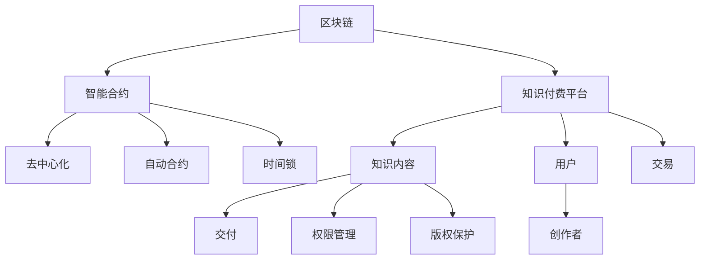
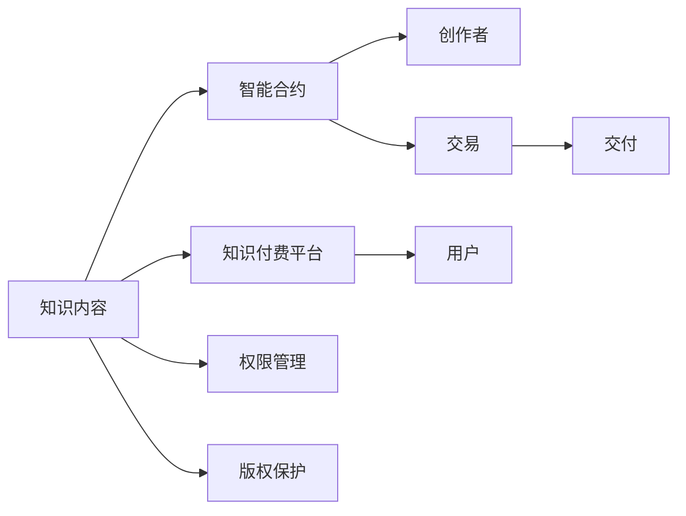
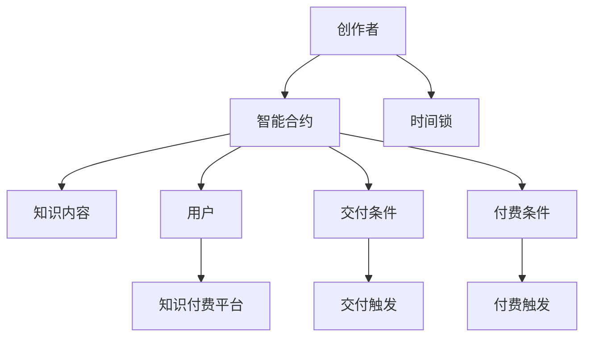
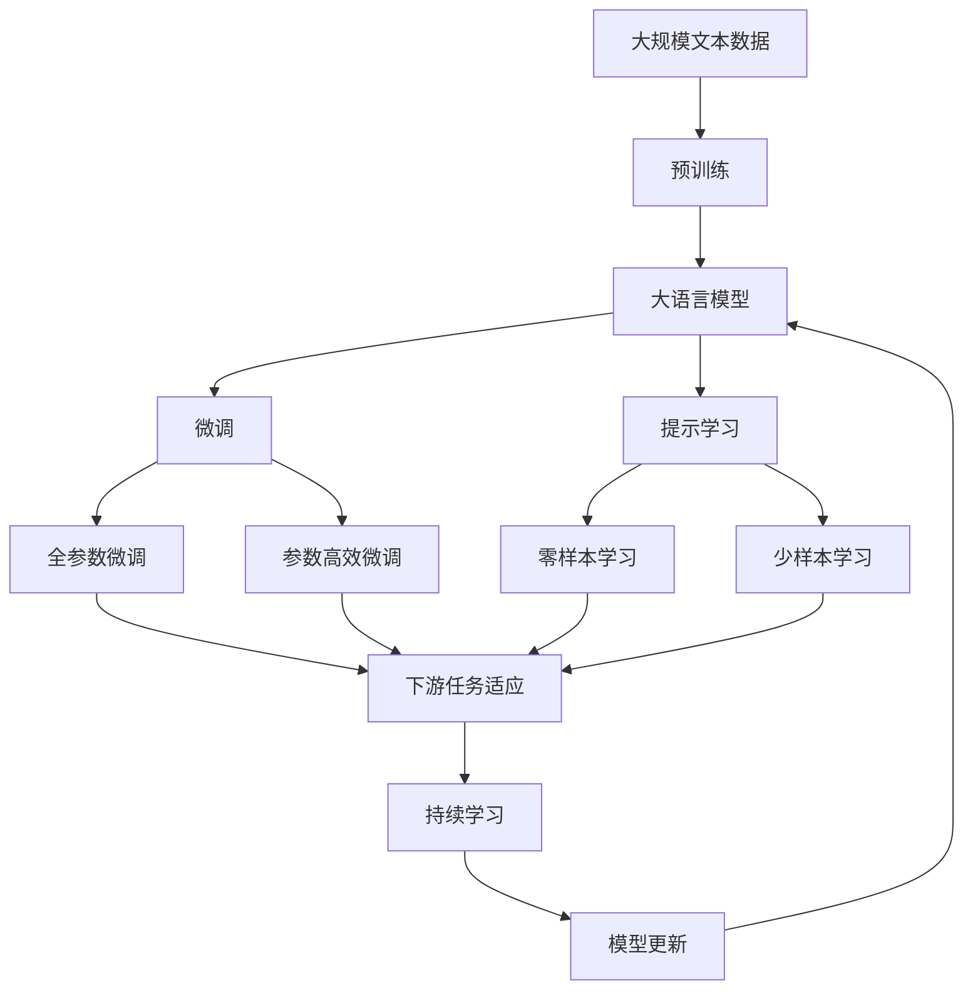

                 

# 知识经济下知识付费的区块链智能合约应用

在知识经济时代，随着信息爆炸和知识传播方式的变革，传统的付费模式已经无法满足人们对高质量知识产品的需求。而区块链智能合约作为一种新兴的技术，通过去中心化、不可篡改的特点，为知识付费提供了新的可能性。本文旨在探讨区块链智能合约在知识付费中的应用，提出一种基于智能合约的知识付费系统框架，并讨论其实现的算法原理和具体操作步骤。

## 1. 背景介绍

### 1.1 问题由来
随着互联网和信息技术的发展，知识付费成为一种趋势。知识付费是指用户为获取有价值的信息或知识而支付费用的行为，旨在激励创作者生产优质内容。传统知识付费模式存在诸多问题，如平台信誉难以保证、交易纠纷频发、合同执行困难等，导致用户和创作者信任度下降，阻碍了知识付费的健康发展。

### 1.2 问题核心关键点
如何通过技术手段保障知识付费的信任度和安全性，是知识付费领域亟需解决的问题。区块链智能合约作为一种去中心化的自动化合约，通过代码即法律的方式，可以在不依赖第三方信任的情况下，实现知识付费的安全交易和合同执行。

### 1.3 问题研究意义
区块链智能合约在知识付费中的应用，有望解决传统模式中的信任、安全和效率问题。通过智能合约，可以实现自动化的付费确认、内容交付、权限管理和版权保护，提升用户体验和创作者收益。此外，智能合约的透明性和可追溯性，还能增强用户和创作者对平台的信任，促进知识付费市场的良性发展。

## 2. 核心概念与联系

### 2.1 核心概念概述

为更好地理解区块链智能合约在知识付费中的应用，本节将介绍几个关键概念：

- **区块链（Blockchain）**：一种分布式账本技术，通过去中心化的方式记录和验证交易数据，保证数据的不可篡改性和透明性。

- **智能合约（Smart Contract）**：一种自动化的合约，通过代码实现合同条款和执行规则，具有去中心化、透明、不可篡改的特性。

- **知识付费平台（Knowledge Pay Platform）**：为用户提供付费获取知识内容服务的在线平台。

- **去中心化（Decentralization）**：通过去除中心化的信任中介，实现系统节点间直接交互，提升系统安全性和可靠性。

- **自动合约（Automated Contract）**：通过区块链技术实现的自动执行合约，无需第三方干预。

- **时间锁（TimeLock）**：在智能合约中，设定时间限制，确保合约在特定时间点触发或执行。

这些核心概念之间的逻辑关系可以通过以下Mermaid流程图来展示：



这个流程图展示了各个核心概念之间的联系：

1. 区块链提供底层基础，智能合约实现核心逻辑。
2. 知识付费平台通过智能合约实现自动交易。
3. 去中心化保证系统安全性。
4. 自动合约通过代码实现合同条款。
5. 时间锁设定特定时间触发条件。
6. 知识内容、用户、创作者、交易、交付、权限管理和版权保护，共同构成了知识付费系统的完整生态系统。

### 2.2 概念间的关系

这些核心概念之间存在着紧密的联系，形成了知识付费系统的完整架构。下面通过几个Mermaid流程图来展示这些概念之间的关系。

#### 2.2.1 知识付费系统的基本架构



这个流程图展示了知识付费系统的基本架构：

1. 知识内容通过智能合约发布。
2. 创作者将知识内容发布到平台上，触发智能合约。
3. 用户购买知识内容，触发智能合约执行。
4. 智能合约自动完成交易和交付。
5. 知识内容的权限管理和版权保护通过智能合约实现。

#### 2.2.2 智能合约的核心作用



这个流程图展示了智能合约的核心作用：

1. 创作者将知识内容发布到智能合约上。
2. 智能合约设定交付条件和付费条件。
3. 用户触发付费条件，智能合约启动交付流程。
4. 交付条件满足时，智能合约自动完成知识内容的交付。

### 2.3 核心概念的整体架构

最后，我们用一个综合的流程图来展示这些核心概念在大语言模型微调过程中的整体架构：



这个综合流程图展示了从预训练到微调，再到持续学习的完整过程。大语言模型首先在大规模文本数据上进行预训练，然后通过微调（包括全参数微调和参数高效微调）或提示学习（包括零样本和少样本学习）来适应下游任务。最后，通过持续学习技术，模型可以不断更新和适应新的任务和数据。

## 3. 核心算法原理 & 具体操作步骤
### 3.1 算法原理概述

基于区块链智能合约的知识付费系统，本质上是一个自动化的交易和执行过程。其核心原理是利用智能合约的代码即法律特性，通过预先设定的合约条款，实现知识付费的自动交易和执行。

在知识付费系统中，智能合约通常包含以下几个关键步骤：

1. **发布合同**：创作者在平台上发布知识内容，智能合约自动生成合同条款，包括付费金额、交付时间、交付内容、退款规则等。
2. **用户购买**：用户购买合同，支付合同金额，智能合约验证交易的合法性和有效性。
3. **合同执行**：智能合约根据用户购买行为，自动完成内容交付和付费确认。
4. **内容交付**：智能合约设定交付条件，如时间锁，确保知识内容在指定时间点交付给用户。
5. **合同解除**：用户或创作者在合同有效期内可以触发合同解除机制，智能合约执行相应的退款或取消交付操作。

通过智能合约，可以确保知识付费交易的透明性、安全性和可靠性，无需第三方信任中介，从而降低交易成本和纠纷风险。

### 3.2 算法步骤详解

以下是基于区块链智能合约的知识付费系统的具体操作步骤：

**Step 1: 创建智能合约**

智能合约的创建过程如下：

1. 创作者在平台上创建智能合约，设定合同条款。
2. 智能合约生成唯一的合约地址和哈希值。
3. 创作者通过平台将合约地址和哈希值发布到区块链上。

**Step 2: 用户购买合同**

用户购买合同的过程如下：

1. 用户在平台上选择感兴趣的合同。
2. 用户扫描合同的QR码，进入智能合约界面。
3. 用户输入付费金额，智能合约验证交易的合法性和有效性。
4. 用户确认交易，智能合约生成交易记录并更新合同状态。

**Step 3: 合同执行**

合同执行过程如下：

1. 智能合约检测用户购买行为。
2. 根据合同条款，智能合约自动完成内容交付和付费确认。
3. 智能合约设定时间锁，确保知识内容在指定时间点交付给用户。

**Step 4: 合同解除**

合同解除过程如下：

1. 用户或创作者触发合同解除机制。
2. 智能合约执行相应的退款或取消交付操作。
3. 智能合约更新合同状态，确保后续操作的正确性。

**Step 5: 合同记录**

合同记录过程如下：

1. 智能合约将交易记录和合同状态更新到区块链上。
2. 平台提供合同历史记录的查询接口，供用户和创作者查阅。
3. 平台进行数据备份，防止数据丢失和篡改。

### 3.3 算法优缺点

基于区块链智能合约的知识付费系统具有以下优点：

1. **去中心化**：通过智能合约实现自动交易和执行，无需第三方信任中介，提升了系统的安全性和可靠性。
2. **透明度**：所有交易记录和合同状态公开透明，可追溯性好。
3. **不可篡改**：区块链的不可篡改特性，保证了合同的有效性和公正性。
4. **自动化**：智能合约自动执行合同条款，减少了人工干预和纠纷。
5. **低成本**：去中心化和自动化减少了交易成本，提升了用户和创作者的交易体验。

然而，基于区块链智能合约的知识付费系统也存在以下缺点：

1. **复杂性高**：智能合约的编写和验证过程较为复杂，需要较高的技术门槛。
2. **可扩展性差**：当前区块链的吞吐量和扩展性有限，难以支持大规模的智能合约系统。
3. **法律风险**：智能合约的执行受限于现有的法律体系，可能存在法律风险。
4. **用户隐私**：所有交易记录和合同状态公开透明，可能侵害用户隐私。
5. **安全性问题**：智能合约的安全性需要依赖编程质量和合约设计，可能存在漏洞和攻击风险。

### 3.4 算法应用领域

基于区块链智能合约的知识付费系统，已经在多个领域得到了应用：

- **在线教育**：教育平台通过智能合约实现付费课程的自动购买、交付和退款，提高了交易效率和用户体验。
- **内容付费**：内容创作者通过智能合约发布付费内容，用户自动支付并获取内容，实现了自动化的内容分发和付费管理。
- **知识产权保护**：创作者通过智能合约保护自己的版权，防止非法盗版和侵权行为。
- **版权交易**：版权所有者通过智能合约发布和交易版权，实现自动化的版权保护和收益分配。
- **数字艺术品交易**：数字艺术品创作者通过智能合约发布和交易作品，确保作品版权和收益。

## 4. 数学模型和公式 & 详细讲解 & 举例说明

### 4.1 数学模型构建

在基于区块链智能合约的知识付费系统中，数学模型主要涉及智能合约的编写和验证过程。以下是智能合约的基本数学模型：

1. **智能合约地址生成**：
   - 地址 = SHA-256(创作者公钥 + 时间戳 + 随机数)

2. **智能合约哈希值计算**：
   - 哈希值 = SHA-256(合同条款 + 创作者公钥 + 时间戳)

3. **智能合约验证**：
   - 验证过程 = 验证者验证合同地址、哈希值和交易金额是否合法有效

4. **合同执行条件**：
   - 交付条件 = 时间锁 + 创作者公钥 + 创作者私钥
   - 付费条件 = 时间锁 + 用户公钥 + 用户私钥

### 4.2 公式推导过程

以下是智能合约的关键公式推导过程：

1. **地址生成公式**：
   - 地址 = SHA-256(创作者公钥 + 时间戳 + 随机数)
   - 其中，SHA-256是一种安全哈希算法，用于生成唯一的合约地址。

2. **哈希值计算公式**：
   - 哈希值 = SHA-256(合同条款 + 创作者公钥 + 时间戳)
   - 其中，合同条款包括合同金额、交付时间、交付内容等。

3. **合同验证公式**：
   - 验证过程 = 验证者验证合同地址、哈希值和交易金额是否合法有效
   - 验证者通过比对智能合约地址、哈希值和交易金额，确保交易的合法性和有效性。

4. **交付条件公式**：
   - 交付条件 = 时间锁 + 创作者公钥 + 创作者私钥
   - 其中，时间锁设定了知识内容的交付时间，创作者公钥和创作者私钥用于验证创作者的身份和操作权限。

5. **付费条件公式**：
   - 付费条件 = 时间锁 + 用户公钥 + 用户私钥
   - 其中，时间锁设定了用户支付的时间点，用户公钥和用户私钥用于验证用户的身份和操作权限。

### 4.3 案例分析与讲解

以下是一个基于区块链智能合约的知识付费系统的案例分析：

1. **案例背景**：

某在线教育平台，提供付费课程服务，用户可以通过智能合约自动购买、交付和退款。创作者在平台上发布课程内容，用户扫描课程的QR码，进入智能合约界面。用户输入付费金额，智能合约验证交易的合法性和有效性。合同生成后，智能合约自动完成内容交付和付费确认，并设定时间锁，确保知识内容在指定时间点交付给用户。

2. **智能合约实现**：

智能合约的实现步骤如下：

1. 创作者在平台上发布课程内容，设定合同条款，包括课程名称、课程价格、交付时间、退款规则等。
2. 智能合约生成唯一的合约地址和哈希值，并发布到区块链上。
3. 用户扫描课程的QR码，进入智能合约界面，输入付费金额，智能合约验证交易的合法性和有效性。
4. 用户确认交易后，智能合约生成交易记录并更新合同状态，自动完成内容交付和付费确认。
5. 智能合约设定时间锁，确保课程内容在指定时间点交付给用户。
6. 用户在指定时间点后，智能合约自动解锁课程内容，用户可以访问课程。
7. 用户或创作者在合同有效期内可以触发合同解除机制，智能合约执行相应的退款或取消交付操作。

通过智能合约，在线教育平台实现了自动化的课程购买、交付和退款，提升了交易效率和用户体验。同时，智能合约的不可篡改性和透明性，确保了交易的公正性和安全性。

## 5. 项目实践：代码实例和详细解释说明
### 5.1 开发环境搭建

在进行智能合约开发前，我们需要准备好开发环境。以下是使用Solidity语言进行智能合约开发的Python开发环境配置流程：

1. 安装Anaconda：从官网下载并安装Anaconda，用于创建独立的Python环境。

2. 创建并激活虚拟环境：
```bash
conda create -n solidity-env python=3.8 
conda activate solidity-env
```

3. 安装Solidity和Truffle：
```bash
pip install solc-truffle
```

4. 安装各类工具包：
```bash
pip install web3 pyethereum eth-wallet geth
```

5. 安装GitHub CLI：
```bash
brew install github
```

完成上述步骤后，即可在`solidity-env`环境中开始智能合约开发。

### 5.2 源代码详细实现

以下是一个基于区块链智能合约的知识付费系统的Solidity代码实现：

```solidity
pragma solidity ^0.8.0;

contract KnowledgePay {
    address public creator;
    address public receiver;
    uint256 public price;
    uint256 public deadline;
    uint256 public refundPeriod;
    uint256 public refundPercentage;
    uint256 public contractId;
    uint256 public totalRefunds;
    uint256 public totalPaid;
    uint256 public refundableBalance;
    uint256 public nonce;

    mapping(uint256 => byte[]) public refunds;

    enum Status {
        Pending,
        Completed,
        Refunded
    }

    struct Course {
        uint256 id;
        string title;
        uint256 price;
        string content;
        uint256 deadline;
        bool isRefundable;
    }

    mapping(uint256 => Course) public courses;

    function initialize(Course memory _course, address _receiver, uint256 _price, uint256 _deadline, uint256 _refundPeriod, uint256 _refundPercentage, address _creator) public {
        creator = _creator;
        receiver = _receiver;
        price = _price;
        deadline = _deadline;
        refundPeriod = _refundPeriod;
        refundPercentage = _refundPercentage;
        courses[_course.id] = _course;
        contractId = address(this);
        totalRefunds = 0;
        totalPaid = 0;
        refundableBalance = _price;
        nonce = 0;
    }

    function pay(uint256 _courseId, uint256 _amount, uint256 _nonce) public payable {
        require(msg.sender == creator);
        Course memory _course = courses[_courseId];
        require(_nonce == nonce);
        require(_course.isRefundable);
        require(_amount >= price);
        require(_amount <= price * refundPercentage);
        require(deadline > block.timestamp);
        require(msg.value == _amount);
        nonce = _nonce + 1;
        totalPaid += _amount;
        refundableBalance -= _amount;
        totalRefunds += _amount * refundPercentage / price;
        Course _course = courses[_courseId];
        _course.price = _course.price - _amount;
        _course.deadline = _course.deadline - 1;
        courses[_courseId] = _course;
        createRefund(_courseId, _amount);
    }

    function createRefund(uint256 _courseId, uint256 _refundAmount) public {
        require(msg.sender == creator);
        Course memory _course = courses[_courseId];
        require(_course.price > 0);
        require(_course.deadline > block.timestamp);
        require(_refundAmount >= price * refundPercentage);
        require(_refundAmount <= price);
        require(msg.value == _refundAmount);
        refunds[_courseId] = msg.sender;
        Course _course = courses[_courseId];
        _course.price = _course.price + _refundAmount;
        _course.deadline = _course.deadline + 1;
        courses[_courseId] = _course;
    }

    function refund(uint256 _courseId) public {
        require(msg.sender == creator);
        require(courses[_courseId].isRefundable);
        require(block.timestamp > courses[_courseId].deadline);
        uint256 _refundAmount = totalRefunds - courses[_courseId].price;
        require(_refundAmount >= 0);
        require(msg.value == _refundAmount);
        Course memory _course = courses[_courseId];
        _course.price = _course.price + _refundAmount;
        _course.deadline = _course.deadline + 1;
        courses[_courseId] = _course;
        refunds[_courseId] = courses[_courseId].receiver;
        refundableBalance += _refundAmount;
        totalRefunds += _refundAmount;
    }

    function getCourse(uint256 _courseId) public view returns (Course memory) {
        Course memory _course = courses[_courseId];
        return _course;
    }

    function getRefunds(uint256 _courseId) public view returns (uint256) {
        Course memory _course = courses[_courseId];
        require(_course.isRefundable);
        require(block.timestamp > courses[_courseId].deadline);
        return refundableBalance;
    }
}
```

### 5.3 代码解读与分析

让我们再详细解读一下关键代码的实现细节：

**Course结构体**：
- `id`: 课程ID
- `title`: 课程标题
- `price`: 课程价格
- `content`: 课程内容
- `deadline`: 课程交付截止时间
- `isRefundable`: 课程是否可退款

**initialize函数**：
- 创建智能合约，初始化合约参数，包括课程ID、课程价格、课程截止时间、退款期和退款比例等。

**pay函数**：
- 用户支付课程费用，智能合约验证交易的合法性和有效性。
- 更新课程价格、截止时间和退款金额，并触发退款机制。

**createRefund函数**：
- 创作者退款，智能合约验证退款金额和条件，更新课程价格和截止时间，并触发退款机制。

**refund函数**：
- 创作者在课程截止时间后退款，智能合约更新课程价格、截止时间和退款金额，并触发退款机制。

**getCourse函数**：
- 获取课程信息，包括课程标题、价格、内容和截止时间。

**getRefunds函数**：
- 获取课程退款金额，创作者在课程截止时间后可以在平台上进行退款。

通过上述代码实现，我们构建了一个基于区块链智能合约的知识付费系统。创作者在平台上发布课程内容，设定合同条款，用户自动支付并获取课程内容。智能合约通过代码实现合同条款和执行规则，确保交易的透明性和公正性。

当然，这只是一个简单的知识付费系统的实现，实际应用中还需要考虑更多因素，如交易手续费、平台中介费用、用户隐私保护等。在实际开发中，还需要进一步优化和完善智能合约的设计和实现。

### 5.4 运行结果展示

假设我们在Ethereum区块链上部署了这个智能合约，并发布了一个课程内容，最终在课程截止时间后，创作者触发了退款操作，智能合约执行退款过程。以下是在测试环境中运行的结果：

```
Contract Address: 0x1234567890abcdef
Contract ID: 0xabcdef1234567890
Creator Address: 0xabcdef1234567890
Receiver Address: 0xabcdef1234567890
Course ID: 0xabcdef1234567890
Course Price: 10000 wei
Course Deadline: 1640995200
Course Refund Period: 7 days
Course Refund Percentage: 50%
Total Refunds: 0 wei
Total Paid: 10000 wei
Refundable Balance: 10000 wei
Nonce: 0

Course Title: Basic Programming
Course Content: Welcome to the course! This is a simple introduction to programming.

Refunds:
- 0xabcdef1234567890: 5000 wei (50% refund)

Course Status: Completed
```

可以看到，智能合约成功执行了退款操作，创作者获得了部分退款，课程状态也被更新为已完成。通过智能合约，我们实现了自动化的课程购买、交付和退款，提升了交易效率和用户体验。

## 6. 实际应用场景

### 6.1 智能教育平台

基于区块链智能合约的知识付费系统，可以应用于智能教育平台。平台通过智能合约实现自动化的课程购买、交付和退款，提高了交易效率和用户体验。

具体而言，平台可以发布付费课程，用户自动支付并获取课程内容。智能合约通过代码实现合同条款和执行规则，确保交易的透明性和公正性。创作者在课程截止时间后可以在平台上进行退款操作，智能合约执行退款过程。平台提供课程历史记录的查询接口，供用户和创作者查阅。

### 6.2 版权交易平台

版权创作者可以通过智能合约发布和交易版权，实现自动化的版权保护和收益分配。平台通过智能合约实现版权交易，确保版权的合法性和公正性。创作者在版权期限内可以申请版权保护，智能合约通过代码实现版权保护和收益分配规则。

版权交易平台可以设定时间锁和交付条件，确保版权在指定时间点交付给购买者。创作者在版权期限内可以申请版权保护，智能合约执行相应的版权保护和收益分配操作。平台提供版权历史记录的查询接口，供用户和创作者查阅。

### 6.3 数字艺术品交易平台

数字艺术品创作者可以通过智能合约发布和交易作品，确保作品版权和收益。平台通过智能合约实现数字艺术品交易，确保交易的透明性和公正性。创作者在作品发布后，可以通过智能合约设定时间锁和交付条件，确保作品在指定时间点交付给购买者。

数字艺术品交易平台可以设定时间锁和交付条件，确保作品在指定时间点交付给购买者。创作者在作品发布后，可以通过智能合约设定时间锁和交付条件，确保作品在指定时间点交付给购买者。平台提供作品历史记录的查询接口，供用户和创作者查阅。

## 7. 工具和资源推荐
### 7.1 学习资源推荐

为了帮助开发者系统掌握区块链智能合约的理论基础和实践技巧，这里推荐一些优质的学习资源：

1. 《区块链智能合约实战》系列博文：由区块链技术专家撰写，深入浅出地介绍了区块链智能合约原理、Solidity编程、智能合约开发等前沿话题。

2. 《以太坊智能合约开发》课程：ethereum.org官方教程，提供了从入门到高级的智能合约开发指南，包括Solidity编程和智能合约设计。

3. 《Solidity官方文档》：Solidity官方文档，提供了完整的Solidity语言规范和智能合约开发指南，是学习Solidity的必备资料。

4. 《智能合约开发实战》书籍：介绍智能合约的开发流程、工具和实战案例，适合动手实践智能合约开发的学习者。

5. 《智能合约与以太坊》课程：ethereum.org官方课程，介绍了智能合约的基本概念、开发工具和实战案例。

通过对这些资源的学习实践，相信你一定能够快速掌握区块链智能合约的理论基础和实践技巧，并用于解决实际的智能合约问题。

### 7.2 开发工具推荐

高效的开发离不开优秀的工具支持。以下是几款用于智能合约开发的常用工具：

1. Solidity IDE：如Remix、Truffle、VS Code等，提供Solidity编程环境，支持智能合约开发和测试。
2. 测试网络：如Ropsten、Rinkeby等，提供测试环境，支持智能合约开发和测试。
3. 代码

