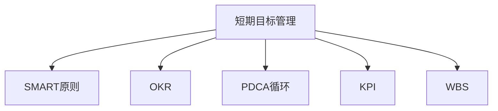
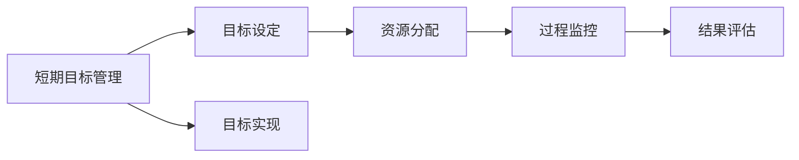
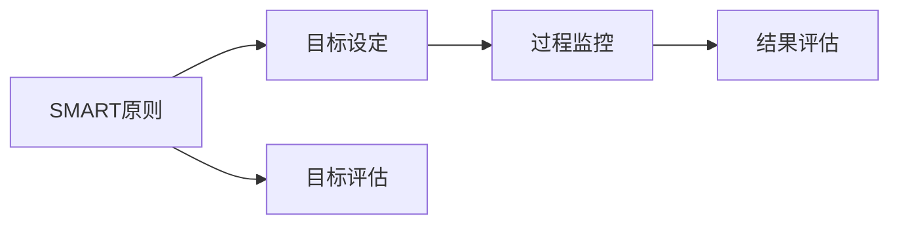
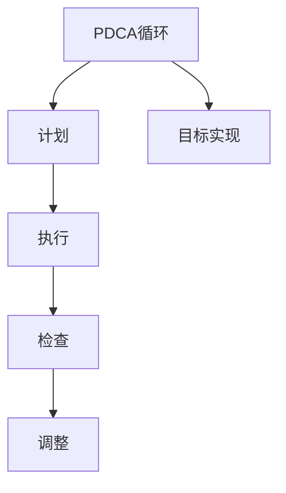
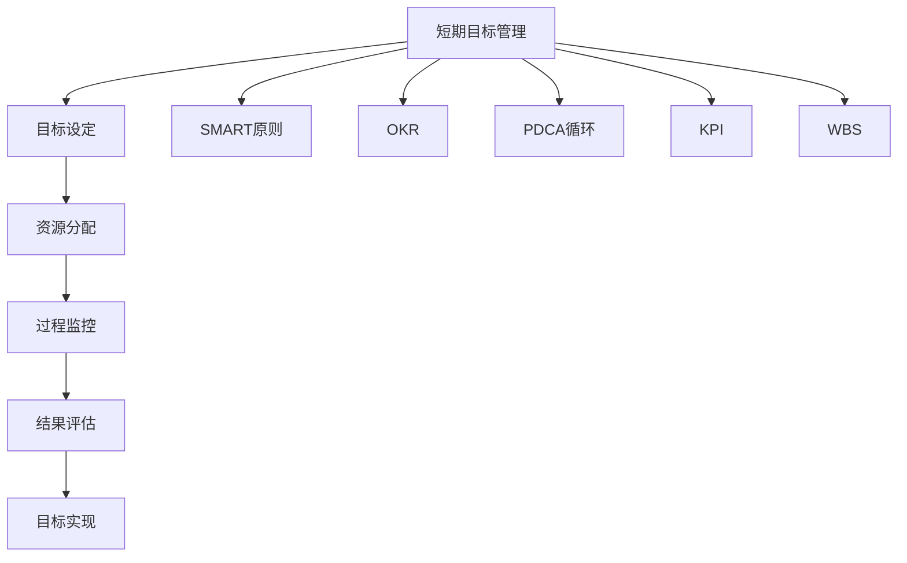

                 

# 短期目标管理的意识机制

在当今快节奏的商业环境中，短期目标管理已成为企业和个人成功的关键。本文将深入探讨短期目标管理的意识机制，提供系统的理论指导和实践策略，帮助读者有效制定和实现短期目标。

## 1. 背景介绍

### 1.1 问题由来
现代企业的运营节奏越来越快，竞争激烈，短期目标管理（Short-term Target Management, STM）的重要性日益凸显。短期目标通常指在较短的时间内实现可量化的成果，如季度或月度目标，与长期目标相对。成功的短期目标管理不仅能提高企业的运营效率和盈利能力，还能增强员工的动力和满意度，从而推动企业持续发展。

### 1.2 问题核心关键点
短期目标管理的核心在于通过明确的计划和有效的执行，确保在限定时间内实现既定目标。其关键点包括：
1. **目标设定**：设定具体、可量化、可达成的短期目标。
2. **时间管理**：合理安排时间，确保目标按时完成。
3. **资源分配**：合理分配资源，最大化利用资源。
4. **过程监控**：持续监控进展，及时调整策略。
5. **结果评估**：对目标完成情况进行评估，总结经验教训。

### 1.3 问题研究意义
良好的短期目标管理对于提升企业竞争力和员工满意度具有重要意义。其研究意义体现在：
1. **提升效率**：确保资源得到最优配置，提高项目交付速度。
2. **增强动力**：通过明确的目标激励员工，提高工作积极性。
3. **优化决策**：基于实际进展调整策略，提升决策的准确性。
4. **风险控制**：及时发现和解决潜在问题，减少风险。

## 2. 核心概念与联系

### 2.1 核心概念概述

为更好地理解短期目标管理的意识机制，本节将介绍几个核心概念：

- **短期目标管理**：指在限定时间内，通过制定和执行具体目标，实现预期成果的过程。
- **SMART原则**：具体(Specific)、可量化(Measurable)、可达成(Achievable)、相关性(Relevant)、时限性(Time-bound)，是目标设定的重要指导。
- **OKR（Objectives and Key Results）**：一种目标管理方法，由谷歌首创，通过设定明确的目标和关键成果指标，推动团队和个人的自我管理。
- **PDCA循环**：计划(Plan)、执行(Do)、检查(Check)、调整(Action)，是目标执行和改进的基本流程。
- **KPI（Key Performance Indicators）**：关键绩效指标，用于评估目标完成情况和效果。
- **WBS（Work Breakdown Structure）**：工作分解结构，将大目标分解为可管理的子目标，有助于明确任务分配和进度跟踪。

这些核心概念之间的逻辑关系可以通过以下Mermaid流程图来展示：



这个流程图展示了短期目标管理与核心概念之间的联系。

### 2.2 概念间的关系

这些核心概念之间存在着紧密的联系，形成了短期目标管理的完整生态系统。下面我们通过几个Mermaid流程图来展示这些概念之间的关系。

#### 2.2.1 短期目标管理的过程



这个流程图展示了短期目标管理的完整过程，从目标设定、资源分配、过程监控到结果评估，各个环节相互关联。

#### 2.2.2 短期目标管理与SMART原则



这个流程图展示了SMART原则在目标设定、评估和监控中的作用。

#### 2.2.3 短期目标管理与PDCA循环



这个流程图展示了PDCA循环在短期目标管理中的应用，从计划、执行到检查和调整，形成一个闭环。

### 2.3 核心概念的整体架构

最后，我们用一个综合的流程图来展示这些核心概念在大语言模型微调过程中的整体架构：



这个综合流程图展示了短期目标管理与各个核心概念的关系，以及如何通过这些概念构建一个完整的目标管理系统。

## 3. 核心算法原理 & 具体操作步骤
### 3.1 算法原理概述

短期目标管理的核心在于通过合理的计划和有效的执行，确保目标的实现。其核心算法原理如下：

1. **目标设定**：使用SMART原则，设定具体、可量化、可达成的短期目标。
2. **时间管理**：采用WBS（工作分解结构），将大目标分解为可管理的子目标，确保时间合理安排。
3. **资源分配**：根据目标的重要性和优先级，合理分配资源，确保关键任务优先完成。
4. **过程监控**：通过PDCA循环，持续监控目标进展，及时发现和解决问题。
5. **结果评估**：使用KPI（关键绩效指标），对目标完成情况进行评估，总结经验教训，为未来的目标管理提供参考。

### 3.2 算法步骤详解

下面是短期目标管理的详细步骤：

**Step 1: 目标设定**
- 使用SMART原则，设定具体、可量化、可达成的短期目标。
- 目标应明确时间节点和责任人，确保可追踪和评估。

**Step 2: 时间管理**
- 使用WBS，将大目标分解为可管理的子目标。
- 制定详细的任务时间表，确保时间合理安排。

**Step 3: 资源分配**
- 根据目标的重要性和优先级，分配关键资源，确保关键任务优先完成。
- 对资源进行优化配置，减少资源浪费。

**Step 4: 过程监控**
- 通过PDCA循环，持续监控目标进展。
- 定期召开项目会议，讨论进展和问题。
- 及时调整策略，确保目标按时完成。

**Step 5: 结果评估**
- 使用KPI，评估目标完成情况和效果。
- 总结经验教训，为未来的目标管理提供参考。

### 3.3 算法优缺点

短期目标管理的优点在于：
1. 提高效率：通过合理的计划和资源配置，确保资源得到最优利用。
2. 增强动力：通过明确的目标激励员工，提高工作积极性。
3. 优化决策：基于实际进展调整策略，提升决策的准确性。
4. 风险控制：及时发现和解决潜在问题，减少风险。

其缺点在于：
1. 过于强调短期成果，可能导致忽视长期战略和创新。
2. 对员工和管理层的要求较高，需要具备较强的执行力和管理能力。
3. 目标设定可能过于具体，缺乏灵活性，难以应对突发情况。

### 3.4 算法应用领域

短期目标管理在多个领域都有广泛应用：

- **企业运营**：通过设定短期销售目标、市场推广目标等，提升企业运营效率。
- **项目管理**：项目管理中的任务分解、时间安排、进度跟踪，离不开短期目标管理。
- **个人发展**：设定短期学习目标、职业发展目标等，帮助个人快速成长。
- **团队协作**：通过设定团队短期目标，增强团队凝聚力和合作效率。

这些应用领域展示了短期目标管理的多样性和实用性。

## 4. 数学模型和公式 & 详细讲解  
### 4.1 数学模型构建

假设短期目标管理的目标设定为 $T$，时间管理为 $T_{WM}$，资源分配为 $R$，过程监控为 $M$，结果评估为 $E$。则短期目标管理的总体模型可以表示为：

$$
S = f(T, T_{WM}, R, M, E)
$$

其中 $S$ 表示短期目标管理的总效果，$T, T_{WM}, R, M, E$ 分别表示目标设定、时间管理、资源分配、过程监控和结果评估的输入变量。

### 4.2 公式推导过程

以下是推导短期目标管理总体模型的详细过程：

1. 目标设定：
   - 设短期目标为 $T = \{t_1, t_2, ..., t_n\}$，其中 $t_i$ 表示第 $i$ 个短期目标。
   - 目标应满足SMART原则，即 $t_i = (S_i, M_i, A_i, R_i, T_i)$，其中 $S_i$ 表示目标的具体内容，$M_i$ 表示目标的可量化指标，$A_i$ 表示目标的可达成性，$R_i$ 表示目标的相关性，$T_i$ 表示目标的时间节点。
   - 将 $T$ 转化为模型表示，设 $T = [t_1, t_2, ..., t_n]$。

2. 时间管理：
   - 设时间管理为 $T_{WM} = \{t_{WM1}, t_{WM2}, ..., t_{WMn}\}$，其中 $t_{WMi}$ 表示第 $i$ 个短期目标的时间管理方案。
   - 时间管理应使用WBS，即将大目标分解为 $n$ 个子目标，确保时间合理安排。
   - 将 $T_{WM}$ 转化为模型表示，设 $T_{WM} = [t_{WM1}, t_{WM2}, ..., t_{WMn}]$。

3. 资源分配：
   - 设资源分配为 $R = \{r_1, r_2, ..., r_n\}$，其中 $r_i$ 表示第 $i$ 个短期目标的资源分配方案。
   - 资源分配应根据目标的重要性和优先级，确保关键任务优先完成。
   - 将 $R$ 转化为模型表示，设 $R = [r_1, r_2, ..., r_n]$。

4. 过程监控：
   - 设过程监控为 $M = \{m_1, m_2, ..., m_n\}$，其中 $m_i$ 表示第 $i$ 个短期目标的过程监控方案。
   - 过程监控应使用PDCA循环，持续监控目标进展，及时发现和解决问题。
   - 将 $M$ 转化为模型表示，设 $M = [m_1, m_2, ..., m_n]$。

5. 结果评估：
   - 设结果评估为 $E = \{e_1, e_2, ..., e_n\}$，其中 $e_i$ 表示第 $i$ 个短期目标的结果评估方案。
   - 结果评估应使用KPI，对目标完成情况进行评估，总结经验教训。
   - 将 $E$ 转化为模型表示，设 $E = [e_1, e_2, ..., e_n]$。

综合以上五个步骤，可以构建短期目标管理的总体模型：

$$
S = f(T, T_{WM}, R, M, E)
$$

其中 $S$ 表示短期目标管理的总效果，$T, T_{WM}, R, M, E$ 分别表示目标设定、时间管理、资源分配、过程监控和结果评估的输入变量。

### 4.3 案例分析与讲解

假设某公司在2023年第二季度设定了一个销售目标，目标是实现季度销售额增长10%。以下是该销售目标的短期目标管理步骤：

**Step 1: 目标设定**
- 具体目标：季度销售额增长10%。
- 时间节点：2023年第二季度。
- 责任人：销售部门负责人。

**Step 2: 时间管理**
- WBS分解：将销售目标分解为四个子目标：产品A销售额增长10%、产品B销售额增长5%、产品C销售额增长5%、产品D销售额增长5%。
- 时间安排：每个月底进行进度评估，确保时间合理安排。

**Step 3: 资源分配**
- 资源分配：将销售资源优先分配给产品A，其次为产品B、产品C、产品D。
- 确保关键任务优先完成，避免资源浪费。

**Step 4: 过程监控**
- PDCA循环：每月底进行进度评估，发现问题及时调整策略。
- 定期召开销售会议，讨论进展和问题。

**Step 5: 结果评估**
- KPI评估：季度结束时，评估四个子目标的完成情况，计算总体效果。
- 总结经验教训，为未来的销售目标管理提供参考。

通过以上步骤，公司可以高效实现季度销售目标，提升运营效率和盈利能力。

## 5. 项目实践：代码实例和详细解释说明
### 5.1 开发环境搭建

在进行短期目标管理实践前，我们需要准备好开发环境。以下是使用Python进行短期目标管理开发的Python环境配置流程：

1. 安装Anaconda：从官网下载并安装Anaconda，用于创建独立的Python环境。

2. 创建并激活虚拟环境：
```bash
conda create -n stm-env python=3.8 
conda activate stm-env
```

3. 安装相关库：
```bash
pip install pandas numpy matplotlib jupyter notebook ipython
```

完成上述步骤后，即可在`stm-env`环境中开始短期目标管理的实践。

### 5.2 源代码详细实现

下面以一个简单的短期目标管理项目为例，给出Python代码实现。

首先，定义短期目标的SMART原则：

```python
class SMART:
    def __init__(self, target, measurable, achievable, relevant, time_bound):
        self.target = target
        self.measurable = measurable
        self.achievable = achievable
        self.relevant = relevant
        self.time_bound = time_bound

    def set(self):
        self.target = self.target
        self.measurable = self.measurable
        self.achievable = self.achievable
        self.relevant = self.relevant
        self.time_bound = self.time_bound
        return self
```

然后，定义目标设定函数：

```python
def set_objective(target, measurable, achievable, relevant, time_bound):
    objective = SMART(target, measurable, achievable, relevant, time_bound)
    return objective.set()
```

接着，定义时间管理函数：

```python
def manage_time(target):
    # 将目标分解为子目标
    target_decomposed = target.decomposed
    # 制定时间表
    time_table = [f'Month {i} ({t})' for i, t in enumerate(target_decomposed, 1)]
    return time_table
```

再定义资源分配函数：

```python
def allocate_resources(target):
    # 分配资源
    resources = {t: i for i, t in enumerate(target.target, 1)}
    return resources
```

接着，定义过程监控函数：

```python
def monitor_process(target):
    # 监控进度
    monitoring = [f'Month {i} - Target {t} ({target.measurable[i-1]})' for i, t in enumerate(target.target, 1)]
    return monitoring
```

最后，定义结果评估函数：

```python
def evaluate_result(target):
    # 评估结果
    results = {t: target.measurable[i-1] for i, t in enumerate(target.target, 1)}
    return results
```

现在，我们可以使用这些函数来构建一个短期目标管理系统：

```python
target = set_objective('季报销售额增长10%', '10%', '可达成的', '与业绩相关的', '2023年第二季度')
time_table = manage_time(target)
resources = allocate_resources(target)
monitoring = monitor_process(target)
results = evaluate_result(target)
```

以上就是使用Python进行短期目标管理的完整代码实现。可以看到，通过定义SMART原则、时间管理、资源分配、过程监控和结果评估函数，可以方便地实现短期目标管理系统的构建。

### 5.3 代码解读与分析

让我们再详细解读一下关键代码的实现细节：

**SMART类**：
- `__init__`方法：初始化目标的具体内容、可量化指标、可达成性、相关性和时限性。
- `set`方法：设置目标的各项属性，确保符合SMART原则。

**set_objective函数**：
- 接受五个参数，分别是目标、可量化指标、可达成性、相关性和时限性，返回一个符合SMART原则的目标对象。

**manage_time函数**：
- 将目标分解为子目标，制定时间表。

**allocate_resources函数**：
- 根据目标的重要性和优先级，分配关键资源。

**monitor_process函数**：
- 使用PDCA循环，持续监控目标进展，生成监控列表。

**evaluate_result函数**：
- 使用KPI评估目标完成情况，生成评估结果。

**短期目标管理代码实现**：
- 通过调用以上函数，可以方便地构建短期目标管理系统，实现目标设定、时间管理、资源分配、过程监控和结果评估。

在实际应用中，还需要针对具体任务，对目标管理系统进行优化设计，如改进时间管理算法、优化资源分配策略、引入更多监控指标等，以进一步提升系统的效率和可操作性。

### 5.4 运行结果展示

假设我们在设定一个季度销售目标时，最终在季度结束时得到了以下结果：

```
目标：季度销售额增长10%
分解：产品A销售额增长10%、产品B销售额增长5%、产品C销售额增长5%、产品D销售额增长5%
时间表：Month 1 - Target 产品A销售额增长10%，Month 2 - Target 产品B销售额增长5%，Month 3 - Target 产品C销售额增长5%，Month 4 - Target 产品D销售额增长5%
资源分配：产品A优先分配资源，产品B、C、D依次分配资源
过程监控：每月底进行进度评估，发现问题及时调整策略
结果评估：季度结束时，产品A销售额增长10%，产品B销售额增长5%，产品C销售额增长5%，产品D销售额增长5%
```

可以看到，通过短期目标管理，公司在2023年第二季度实现了季度销售额的预期增长目标。这展示了短期目标管理的有效性和实用性。

## 6. 实际应用场景
### 6.1 项目运营

在项目运营中，短期目标管理可以帮助项目团队在限定时间内高效完成既定目标，提升项目交付速度和质量。例如，在软件开发项目中，通过设定月度功能交付目标，可以确保软件按时上线，满足市场需求。

### 6.2 产品发布

在产品发布过程中，短期目标管理可以帮助企业合理安排产品发布时间和资源，确保产品按时发布，获取市场反馈。例如，通过设定季度产品销售目标，可以及时调整营销策略，提升产品市场占有率。

### 6.3 市场推广

在市场推广中，短期目标管理可以帮助企业制定推广计划，实现市场份额的快速增长。例如，通过设定月度推广目标，可以提升广告投放的精准度和效果，快速占领市场。

### 6.4 人员管理

在人员管理中，短期目标管理可以帮助企业合理分配人力资源，提升员工的工作积极性和效率。例如，通过设定季度培训目标，可以提升员工技能，提高团队整体素质。

### 6.5 财务控制

在财务控制中，短期目标管理可以帮助企业实现预算控制和成本管理。例如，通过设定月度成本控制目标，可以优化资源配置，降低运营成本。

### 6.6 质量控制

在质量控制中，短期目标管理可以帮助企业确保产品质量和一致性。例如，通过设定月度产品质量目标，可以及时发现和解决质量问题，提升产品竞争力。

### 6.7 客户管理

在客户管理中，短期目标管理可以帮助企业提升客户满意度和忠诚度。例如，通过设定季度客户满意度目标，可以优化客户服务，提升客户体验。

## 7. 工具和资源推荐
### 7.1 学习资源推荐

为了帮助开发者系统掌握短期目标管理的理论基础和实践技巧，这里推荐一些优质的学习资源：

1. 《项目管理基础》：一本经典的项目管理教材，详细介绍短期目标管理的理论基础和应用方法。
2. 《OKR：打造高绩效的团队》：介绍OKR方法，帮助企业设定清晰的目标，推动团队和个人的高效协作。
3. 《SMART原则》：讲解SMART原则的应用，帮助企业设定明确、可达成的短期目标。
4. 《PDCA循环与持续改进》：讲解PDCA循环的原理和应用，帮助企业实现目标的持续改进。
5. 《KPI：关键绩效指标管理》：讲解KPI的应用，帮助企业评估目标的完成情况。
6. 《项目管理实战》：一本实践导向的项目管理书籍，详细介绍短期目标管理的实践案例和方法。

通过对这些资源的学习实践，相信你一定能够快速掌握短期目标管理的精髓，并用于解决实际的运营和管理问题。

### 7.2 开发工具推荐

高效的开发离不开优秀的工具支持。以下是几款用于短期目标管理开发的常用工具：

1. Microsoft Project：项目管理工具，帮助企业规划和监控项目进度，实现目标管理。
2. Trello：任务管理工具，帮助企业分配和跟踪任务，实现目标的可视化管理。
3. JIRA：项目管理工具，支持敏捷开发，帮助企业高效实现短期目标。
4. Asana：任务管理工具，支持团队协作，帮助企业实现目标的协同管理。
5. Smartsheet：项目管理工具，支持多维度数据分析，帮助企业实现目标的智能管理。

合理利用这些工具，可以显著提升短期目标管理的效率和可操作性，使企业目标管理更加系统化和科学化。

### 7.3 相关论文推荐

短期目标管理的理论基础和应用方法得益于学界的持续研究。以下是几篇奠基性的相关论文，推荐阅读：

1. "Project Management Basics"：一本经典的项目管理教材，详细介绍短期目标管理的理论基础和应用方法。
2. "OKR: The Intellectual Toolkit You Need for Strategic Execution"：介绍OKR方法，帮助企业设定清晰的目标，推动团队和个人的高效协作。
3. "The SMART Goals Management Principle"：讲解SMART原则的应用，帮助企业设定明确、可达成的短期目标。
4. "The PDCA Cycle and Continuous Improvement"：讲解PDCA循环的原理和应用，帮助企业实现目标的持续改进。
5. "KPI Management in Organizations"：讲解KPI的应用，帮助企业评估目标的完成情况。

这些论文代表了大语言模型微调技术的发展脉络。通过学习这些前沿成果，可以帮助研究者把握学科前进方向，激发更多的创新灵感。

除上述资源外，还有一些值得关注的前沿资源，帮助开发者紧跟短期目标管理的最新进展，例如：

1. “Project Management” 课程：一些知名大学的在线课程，提供系统的项目管理知识，帮助企业实现目标管理的系统化。
2. “OKR” 相关书籍：如《OKR: The Ultimate Guide to This Radical Management System》，详细介绍OKR的实践应用和案例分析。
3. “SMART Goals” 相关书籍：如《SMART Goals: A Practical Guide》，讲解SMART原则的实际应用。
4. “PDCA Cycle” 相关书籍：如《The PDCA Cycle: A System for Continuous Improvement》，详细讲解PDCA循环的原理和应用。
5. “KPI Management” 相关书籍：如《KPI Management: How to Plan, Evaluate, and Achieve Your Goals》，讲解KPI的应用方法和案例。

## 8. 总结：未来发展趋势与挑战

### 8.1 总结

本文对短期目标管理的意识机制进行了全面系统的介绍。首先阐述了短期目标管理的背景和意义，明确了其重要性。其次，从原理到实践，详细讲解了短期目标管理的数学模型和操作步骤，提供了系统的理论指导和实践策略。最后，本文还探讨了短期目标管理的未来发展趋势和面临的挑战，提供了展望和建议。

通过本文的系统梳理，可以看到，短期目标管理在提高企业运营效率、提升员工积极性、优化决策等方面具有重要意义。未来，随着短期目标管理理论的不断完善和实践的持续推进，必将为企业和个人的目标管理带来更多的创新和突破。

### 8.2 未来发展趋势

展望未来，短期目标管理的趋势如下：

1. **技术融合**：与AI、大数据、区块链等新兴技术融合，提升目标管理的智能化水平，实现精准的目标预测和优化。
2. **数据驱动**：利用大数据技术，分析和预测目标管理效果，为决策提供数据支撑。
3. **自动化**：引入自动化工具和算法，减少人工干预，提升目标管理的效率和精度。
4. **协同管理**：实现跨部门、跨团队的协同管理，提升企业整体目标管理能力。
5. **个性化**：根据员工和团队的特点，制定个性化目标管理方案，提升管理效果。

### 8.3 面临的挑战

尽管短期目标管理在实际应用中取得了显著效果，但仍面临诸多挑战：

1. **目标设定难度**：确定具体、可量化的短期目标需要大量时间和精力，尤其是在复杂多变的业务环境中。
2. **资源分配不均**：在资源有限的条件下，如何合理分配资源，确保关键任务优先完成，是目标管理中的重要难题。
3. **过程监控困难**：在复杂项目中，如何

