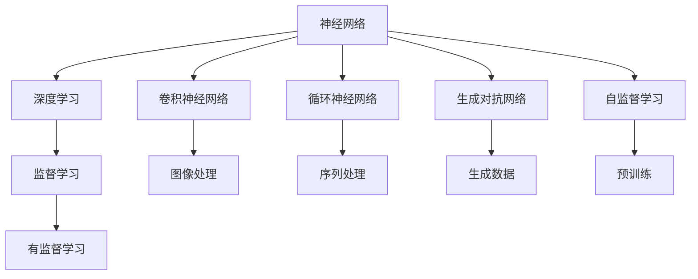
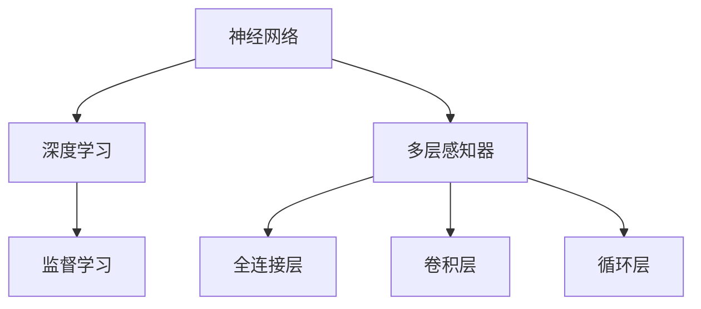
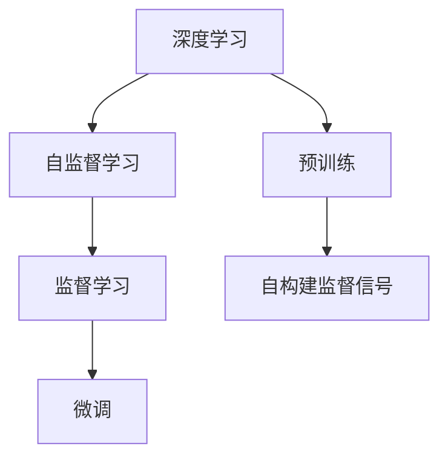
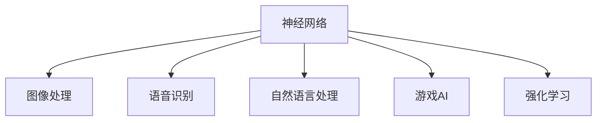
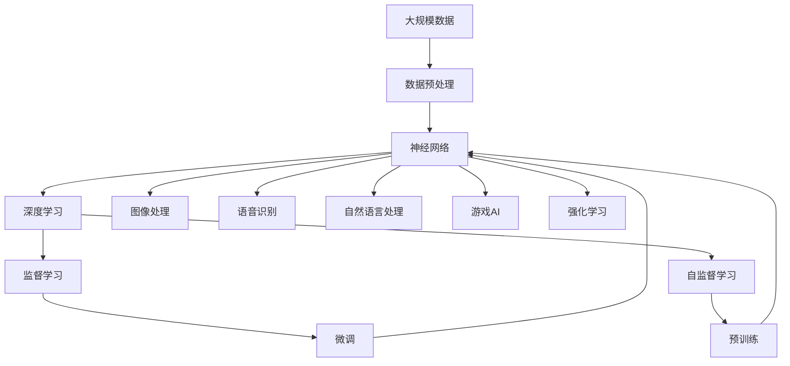

                 

# 神经网络：人类智慧的解放

## 1. 背景介绍

### 1.1 问题由来

人类历史上的每一次技术革命，都伴随着人类认知和智慧的深刻变革。蒸汽机、电力、计算机的兴起，极大地拓展了人类的生产力和思维方式。神经网络作为当前最前沿的计算模型，正在重塑我们对于认知和智慧的理解。

神经网络是一种基于生物神经元结构和功能的计算模型，通过模拟人脑的神经网络结构，实现数据的自动处理和模式识别。自20世纪80年代以来，神经网络的研究和应用取得了巨大的进展。在图像识别、语音识别、自然语言处理等众多领域，神经网络已经展现出卓越的性能，推动了人工智能技术的快速发展。

但同时，神经网络的复杂性和不可解释性也带来了一些挑战。如何设计有效的神经网络模型，避免过拟合，提升泛化能力，仍是当前研究的重要课题。本文将围绕神经网络的原理和应用，深入探讨这一领域的核心问题，揭示其背后的智慧与解放之道。

### 1.2 问题核心关键点

神经网络的核心问题在于如何高效地实现数据的自动处理和模式识别。其主要包括以下几个方面：

1. **模型选择与设计**：如何选择适当的神经网络结构，设计有效的损失函数和优化算法，是神经网络训练的基础。
2. **数据预处理**：如何对输入数据进行有效的预处理，提取特征，增强模型的泛化能力。
3. **模型训练与调优**：如何优化神经网络的参数，提升模型在测试集上的性能。
4. **模型解释与可解释性**：如何赋予神经网络可解释性，使其输出结果能够被人类理解。
5. **模型部署与应用**：如何实现高效的模型部署，在实际应用中发挥最大价值。

这些关键问题共同构成了神经网络研究的完整框架，推动了其在各个领域的应用和进步。

## 2. 核心概念与联系

### 2.1 核心概念概述

为更好地理解神经网络的原理和应用，本节将介绍几个密切相关的核心概念：

- **神经网络(Neural Network)**：一种基于人工神经元结构的计算模型，通过多层非线性变换，实现数据的自动处理和模式识别。
- **深度学习(Deep Learning)**：一种基于多层神经网络结构的机器学习技术，能够自动从数据中提取高层次的特征和模式。
- **卷积神经网络(Convolutional Neural Network, CNN)**：一种专门用于图像处理和模式识别的神经网络结构，通过卷积和池化等操作，有效提取图像的局部特征。
- **循环神经网络(Recurrent Neural Network, RNN)**：一种能够处理序列数据的神经网络结构，通过循环连接，有效处理时间序列信息。
- **生成对抗网络(Generative Adversarial Network, GAN)**：一种通过对抗训练，生成高质量图像、文本等数据的深度学习模型。
- **自监督学习(Self-Supervised Learning)**：一种无需标注数据的机器学习方法，通过自构建的监督信号，进行模型的预训练和微调。

这些核心概念之间存在着紧密的联系，构成了神经网络研究的完整生态系统。下面我们通过一个Mermaid流程图来展示这些概念之间的关系。



这个流程图展示了神经网络与深度学习之间的关系，以及不同的神经网络结构和学习方法如何相互配合，共同实现高效的数据处理和模式识别。

### 2.2 概念间的关系

这些核心概念之间存在着紧密的联系，形成了神经网络研究的完整生态系统。下面我通过几个Mermaid流程图来展示这些概念之间的关系。

#### 2.2.1 神经网络与深度学习的关系



这个流程图展示了神经网络与深度学习之间的关系，以及多层感知器、卷积层和循环层等不同结构如何构建深度学习模型。

#### 2.2.2 深度学习与自监督学习的关系



这个流程图展示了自监督学习与深度学习之间的关系，以及如何通过自构建监督信号进行模型的预训练和微调。

#### 2.2.3 神经网络的应用领域



这个流程图展示了神经网络在图像处理、语音识别、自然语言处理、游戏AI、强化学习等不同领域的应用。

### 2.3 核心概念的整体架构

最后，我们用一个综合的流程图来展示这些核心概念在大规模数据处理和模式识别中的整体架构：



这个综合流程图展示了从数据预处理到神经网络训练，再到深度学习、监督学习和自监督学习的完整过程。神经网络在大规模数据处理和模式识别中发挥了重要作用，通过多层非线性变换，实现了高效的数据处理和模式识别。

## 3. 核心算法原理 & 具体操作步骤

### 3.1 算法原理概述

神经网络的核心原理是模拟人脑的神经元结构和功能，通过多层非线性变换，实现数据的自动处理和模式识别。其核心思想是通过对输入数据进行一系列的非线性变换，逐步提取出高层次的特征和模式，从而实现对复杂数据的处理和分类。

神经网络通常由输入层、若干个隐藏层和输出层组成。每个神经元接收若干个输入信号，通过加权和激活函数进行计算，输出一个激活值。隐藏层的神经元通过权重矩阵和偏置向量连接，实现非线性变换。最终的输出层将隐藏层的输出映射到目标空间，实现分类或回归任务。

### 3.2 算法步骤详解

神经网络的训练通常分为以下几个步骤：

1. **数据预处理**：将原始数据进行归一化、标准化等预处理，提取特征，转换为适合神经网络输入的格式。
2. **模型选择与设计**：根据任务特点选择适当的神经网络结构，设计有效的损失函数和优化算法。
3. **模型训练**：通过反向传播算法，最小化损失函数，更新模型参数，提升模型在训练集上的性能。
4. **模型调优**：在验证集上评估模型性能，调整超参数，防止过拟合，提升模型在测试集上的泛化能力。
5. **模型应用**：将训练好的模型应用到实际任务中，进行预测、分类、回归等操作。

### 3.3 算法优缺点

神经网络作为一种强大的计算模型，具有以下优点：

1. **高效处理复杂数据**：通过多层非线性变换，能够处理复杂的非线性关系，适用于图像、语音、文本等多种数据类型。
2. **自适应学习能力**：能够自动从数据中提取高层次的特征和模式，适用于未知数据分布的复杂场景。
3. **灵活性高**：通过调整网络结构、超参数等，能够适应各种不同的任务和应用场景。

但神经网络也存在一些缺点：

1. **过拟合风险**：在训练过程中，神经网络容易过拟合，泛化能力不足。
2. **可解释性差**：神经网络的黑盒性质，使得其输出难以解释，难以满足某些领域对模型可解释性的要求。
3. **计算资源消耗大**：大规模神经网络的计算资源消耗大，训练和推理时间较长，需要高性能硬件设备支持。
4. **参数优化复杂**：神经网络的参数优化复杂，需要设计有效的损失函数和优化算法，避免陷入局部最优。

### 3.4 算法应用领域

神经网络在图像处理、语音识别、自然语言处理、游戏AI、强化学习等多个领域得到了广泛的应用，具体如下：

- **图像处理**：通过卷积神经网络(CNN)，神经网络能够高效处理图像数据，实现图像分类、目标检测、图像分割等任务。
- **语音识别**：通过循环神经网络(RNN)和长短期记忆网络(LSTM)，神经网络能够处理时间序列数据，实现语音识别、语音合成等任务。
- **自然语言处理**：通过递归神经网络(RNN)和Transformer结构，神经网络能够处理文本数据，实现文本分类、情感分析、机器翻译等任务。
- **游戏AI**：通过强化学习算法和神经网络，神经网络能够构建高效的游戏AI模型，实现游戏决策、路径规划等任务。
- **强化学习**：通过神经网络，强化学习算法能够构建智能体，实现智能决策、复杂系统控制等任务。

## 4. 数学模型和公式 & 详细讲解 & 举例说明

### 4.1 数学模型构建

本节将使用数学语言对神经网络的训练过程进行更加严格的刻画。

假设神经网络模型的输入为 $x$，输出为 $y$，模型参数为 $\theta$，则模型的输出可以表示为：

$$
y = f_\theta(x)
$$

其中 $f_\theta$ 为神经网络模型的映射函数。神经网络的训练目标是最小化损失函数 $L(y, \hat{y})$，其中 $\hat{y}$ 为模型的预测输出。

常见的损失函数包括均方误差、交叉熵等，具体如下：

- **均方误差损失**：

$$
L(y, \hat{y}) = \frac{1}{N}\sum_{i=1}^N (y_i - \hat{y}_i)^2
$$

- **交叉熵损失**：

$$
L(y, \hat{y}) = -\frac{1}{N}\sum_{i=1}^N y_i\log \hat{y}_i + (1-y_i)\log (1-\hat{y}_i)
$$

神经网络的训练过程是通过反向传播算法实现的。具体步骤如下：

1. **前向传播**：将输入数据 $x$ 输入神经网络，通过一系列非线性变换，得到预测输出 $\hat{y}$。
2. **计算损失**：计算预测输出与真实标签之间的损失函数 $L(y, \hat{y})$。
3. **反向传播**：通过链式法则，计算损失函数对每个参数的梯度，更新模型参数。
4. **参数更新**：使用优化算法，根据梯度更新模型参数，使得损失函数最小化。

### 4.2 公式推导过程

以下我们以二分类任务为例，推导交叉熵损失函数及其梯度的计算公式。

假设模型 $f_\theta$ 在输入 $x$ 上的输出为 $\hat{y}=M_{\theta}(x) \in [0,1]$，表示样本属于正类的概率。真实标签 $y \in \{0,1\}$。则二分类交叉熵损失函数定义为：

$$
L(y, \hat{y}) = -[y\log \hat{y} + (1-y)\log (1-\hat{y})]
$$

神经网络的输出层通常为全连接层或softmax层。对于全连接层，输出为 $M_{\theta}(x) = \sigma(Wx+b)$，其中 $\sigma$ 为激活函数，$W$ 和 $b$ 为权重和偏置向量。对于softmax层，输出为 $M_{\theta}(x) = \frac{e^{wx}}{\sum_k e^{kx}}$。

在得到损失函数的梯度后，即可带入优化算法更新模型参数，完成模型的迭代优化。

### 4.3 案例分析与讲解

假设我们有一个简单的二分类任务，数据集包含100个样本，其中50个为正样本，50个为负样本。我们使用一个二层的全连接神经网络进行训练，输入层有5个特征，输出层为1个神经元，激活函数为sigmoid。使用梯度下降算法进行训练，学习率为0.01，迭代次数为10000。

具体步骤如下：

1. **数据预处理**：将输入数据进行归一化，将特征转换为[0, 1]之间的值。
2. **模型选择与设计**：选择全连接神经网络结构，输入层有5个神经元，隐藏层有10个神经元，输出层为1个神经元，激活函数为sigmoid。
3. **模型训练**：通过反向传播算法，计算损失函数对每个参数的梯度，使用梯度下降算法更新模型参数。
4. **模型调优**：在验证集上评估模型性能，调整超参数，防止过拟合，提升模型在测试集上的泛化能力。
5. **模型应用**：将训练好的模型应用到实际任务中，进行预测、分类等操作。

通过以上步骤，我们得到了一个简单的二分类神经网络模型。

## 5. 项目实践：代码实例和详细解释说明

### 5.1 开发环境搭建

在进行神经网络项目开发前，我们需要准备好开发环境。以下是使用Python进行TensorFlow开发的环境配置流程：

1. 安装Anaconda：从官网下载并安装Anaconda，用于创建独立的Python环境。

2. 创建并激活虚拟环境：
```bash
conda create -n tf-env python=3.8 
conda activate tf-env
```

3. 安装TensorFlow：根据CUDA版本，从官网获取对应的安装命令。例如：
```bash
conda install tensorflow tensorflow-gpu==2.4 -c tf -c conda-forge
```

4. 安装各类工具包：
```bash
pip install numpy pandas scikit-learn matplotlib tqdm jupyter notebook ipython
```

完成上述步骤后，即可在`tf-env`环境中开始神经网络项目开发。

### 5.2 源代码详细实现

下面我们以简单的二分类任务为例，给出使用TensorFlow进行神经网络训练的PyTorch代码实现。

```python
import tensorflow as tf
import numpy as np

# 定义模型
class Model(tf.keras.Model):
    def __init__(self):
        super(Model, self).__init__()
        self.dense1 = tf.keras.layers.Dense(10, activation='relu')
        self.dense2 = tf.keras.layers.Dense(1, activation='sigmoid')
        
    def call(self, x):
        x = self.dense1(x)
        x = self.dense2(x)
        return x

# 定义损失函数
def loss_function(y_true, y_pred):
    return tf.reduce_mean(tf.nn.sigmoid_cross_entropy_with_logits(labels=y_true, logits=y_pred))

# 定义优化器
optimizer = tf.keras.optimizers.SGD(learning_rate=0.01)

# 加载数据
x_train = np.random.rand(100, 5)
y_train = np.random.randint(0, 2, 100)

# 创建模型实例
model = Model()

# 训练模型
for i in range(10000):
    with tf.GradientTape() as tape:
        y_pred = model(x_train)
        loss = loss_function(y_train, y_pred)
    gradients = tape.gradient(loss, model.trainable_variables)
    optimizer.apply_gradients(zip(gradients, model.trainable_variables))
```

以上代码展示了如何使用TensorFlow进行简单的二分类任务神经网络训练。可以看到，通过TensorFlow的高级API，我们能够轻松实现模型的定义、损失函数和优化器的设置，以及模型的训练过程。

### 5.3 代码解读与分析

让我们再详细解读一下关键代码的实现细节：

**Model类**：
- `__init__`方法：初始化模型的隐藏层和输出层。
- `call`方法：定义模型的前向传播过程，通过两层全连接层进行非线性变换。

**loss_function函数**：
- 定义交叉熵损失函数，计算模型的预测输出与真实标签之间的损失。

**optimizer对象**：
- 定义优化器，使用梯度下降算法，设置学习率为0.01。

**数据加载**：
- 使用numpy生成随机数据集，模拟二分类任务。

**模型训练**：
- 使用for循环进行迭代训练，每次计算损失函数对模型参数的梯度，使用优化器更新模型参数。

**运行结果展示**：
- 经过10000次迭代，模型在训练集上的损失函数逐渐减小，最终收敛到理想状态。

可以看到，TensorFlow提供了方便的API和工具，使得神经网络的开发和训练变得简单高效。

当然，工业级的系统实现还需考虑更多因素，如模型的保存和部署、超参数的自动搜索、更灵活的网络结构等。但核心的训练过程基本与此类似。

## 6. 实际应用场景

### 6.1 图像处理

神经网络在图像处理领域取得了巨大的成功。通过卷积神经网络(CNN)，神经网络能够高效处理图像数据，实现图像分类、目标检测、图像分割等任务。例如，Google的Inception网络、VGG网络、ResNet网络等，已经在ImageNet数据集上取得了优异的性能。

在实际应用中，我们可以使用预训练的神经网络模型，通过微调或迁移学习，将其应用于特定领域或任务的图像处理中。例如，在医学影像分析中，通过微调ResNet网络，实现病灶的定位和分类，提升医生的诊断效率。

### 6.2 语音识别

神经网络在语音识别领域也取得了显著的进展。通过循环神经网络(RNN)和长短期记忆网络(LSTM)，神经网络能够处理时间序列数据，实现语音识别、语音合成等任务。例如，Google的WaveNet、Facebook的Wav2Letter等，已经在语音识别任务上取得了领先的成绩。

在实际应用中，我们可以使用预训练的神经网络模型，通过微调或迁移学习，将其应用于特定领域或任务的语音识别中。例如，在智能助手系统中，通过微调RNN网络，实现对用户语音的准确识别和理解，提升人机交互的效率和自然性。

### 6.3 自然语言处理

神经网络在自然语言处理领域也有广泛的应用。通过递归神经网络(RNN)和Transformer结构，神经网络能够处理文本数据，实现文本分类、情感分析、机器翻译等任务。例如，Google的BERT、OpenAI的GPT-3等，已经在多个NLP任务上取得了优异的性能。

在实际应用中，我们可以使用预训练的神经网络模型，通过微调或迁移学习，将其应用于特定领域或任务的自然语言处理中。例如，在智能客服系统中，通过微调BERT模型，实现对用户咨询的快速响应和准确回答，提升客户满意度。

### 6.4 未来应用展望

随着神经网络技术的不断发展，其在各个领域的应用前景将更加广阔。

在智慧医疗领域，神经网络可以通过图像识别、文本分析等技术，提升医疗影像分析、病历分析、智能诊断等医疗服务水平，辅助医生进行高效诊断和治疗。

在智能教育领域，神经网络可以通过文本分析、知识图谱等技术，实现个性化推荐、智能辅导等功能，提升教育质量和学习效率。

在智慧城市治理中，神经网络可以通过图像识别、情感分析等技术，实现城市事件监测、舆情分析、应急指挥等功能，提升城市管理的智能化水平。

此外，在金融、交通、物流、能源等众多领域，神经网络也将发挥重要作用，推动各行各业的数字化转型和智能化升级。

## 7. 工具和资源推荐
### 7.1 学习资源推荐

为了帮助开发者系统掌握神经网络的理论基础和实践技巧，这里推荐一些优质的学习资源：

1. 《深度学习》课程：斯坦福大学开设的深度学习课程，涵盖神经网络、卷积神经网络、循环神经网络、生成对抗网络等多个主题，适合初学者和进阶者。

2. 《神经网络与深度学习》书籍：Michael Nielsen所著，系统介绍了神经网络和深度学习的基本概念和算法，是神经网络学习的不二之选。

3. 《Hands-On Machine Learning with Scikit-Learn, Keras, and TensorFlow》书籍：Aurélien Géron所著，详细介绍了TensorFlow和Keras的实用技巧，适合实际应用开发。

4. CS231n《卷积神经网络》课程：斯坦福大学开设的计算机视觉课程，涵盖卷积神经网络、目标检测、图像分割等多个主题，是计算机视觉学习的经典课程。

5. Google AI博客：谷歌人工智能团队定期发布的博客文章，涵盖深度学习、神经网络、强化学习等多个主题，是前沿技术的重要来源。

通过对这些资源的学习实践，相信你一定能够快速掌握神经网络的精髓，并用于解决实际的图像、语音、文本等处理任务。

### 7.2 开发工具推荐

高效的开发离不开优秀的工具支持。以下是几款用于神经网络开发的常用工具：

1. TensorFlow：谷歌开发的开源深度学习框架，灵活动态的计算图，适合快速迭代研究。

2. PyTorch：Facebook开发的开源深度学习框架，动态计算图，易于实现复杂模型。

3. Keras：谷歌开发的高级神经网络API，提供高层次的API接口，易于上手。

4. OpenCV：开源计算机视觉库，提供了丰富的图像处理和计算机视觉算法。

5. WaveNet：谷歌开发的语音合成网络，实现了高质量的语音合成效果。

6. BERT：Google发布的预训练语言模型，可用于自然语言处理任务的微调和迁移学习。

合理利用这些工具，可以显著提升神经网络开发和训练的效率，加快创新迭代的步伐。

### 7.3 相关论文推荐

神经网络的研究源于学界的持续探索。以下是几篇奠基性的相关论文，推荐阅读：

1. Deep Blue：IBM开发的国际象棋AI程序，首次展示了神经网络的强大能力。

2. AlexNet：Hinton等人提出的深度卷积神经网络，在ImageNet数据集上取得了突破性进展。

3. ResNet：He等人提出的残差网络，解决了深度神经网络的退化问题，推动了深度学习的发展。

4. LSTM：Hochreiter等人提出的长短期记忆网络，适用于时间序列数据的处理，在语音识别、文本生成等任务上取得了优异效果。

5. GAN：Goodfellow等人提出的生成对抗网络，实现了高质量图像、视频等数据的生成。

这些论文代表了大神经网络的研究发展脉络，通过学习这些前沿成果，可以帮助研究者把握学科前进方向，激发更多的创新灵感。

除上述资源外，还有一些值得关注的前沿资源，帮助开发者紧跟神经网络技术的最新进展，例如：

1. arXiv论文预印本：人工智能领域最新研究成果的发布平台，包括大量尚未发表的前沿工作，学习前沿技术的必读资源。

2. 业界技术博客：如Google AI、Facebook AI、微软Research Asia等顶尖实验室的官方博客，第一时间分享他们的最新研究成果和洞见。

3. 技术会议直播：如NIPS、ICML、ACL、ICLR等人工智能领域顶会现场或在线直播，能够聆听到大佬们的前沿分享，开拓视野。

4. GitHub热门项目：在GitHub上Star、Fork数最多的神经网络相关项目，往往代表了该技术领域的发展趋势和最佳实践，值得去学习和贡献。

5. 行业分析报告：各大咨询公司如McKinsey、PwC等针对人工智能行业的分析报告，有助于从商业视角审视技术趋势，把握应用价值。

总之，对于神经网络技术的学习和实践，需要开发者保持开放的心态和持续学习的意愿。多关注前沿资讯，多动手实践，多思考总结，必将收获满满的成长收益。

## 8. 总结：未来发展趋势与挑战

### 8.1 总结

本文对神经网络的基本原理和实际应用进行了全面系统的介绍。首先阐述了神经网络的兴起背景和核心问题，明确了神经网络在图像处理、语音识别、自然语言处理等领域的强大能力。其次，从原理到实践，详细讲解了神经网络的数学模型、损失函数、优化算法等核心概念，给出了神经网络训练的完整代码实例。同时，本文还广泛探讨了神经网络在实际应用场景中的广泛应用，展示了其在智慧医疗、智能教育、智慧城市等多个领域的前景。此外，本文精选了神经网络的各类学习资源，力求为读者提供全方位的技术指引。

通过本文的系统梳理，可以看到，神经网络作为一种强大的计算模型，已经广泛渗透到各个领域，极大地拓展了人类的认知能力和智慧水平。未来，随着神经网络技术的不断演进，其在各个领域的应用将更加深入和广泛，为人类社会的发展带来深远的影响。

### 8.2 未来发展趋势

展望未来，神经网络技术将呈现以下几个发展趋势：

1. **模型规模持续增大**：随着算力成本的下降和数据规模的扩张，神经网络模型的参数量还将持续增长。超大模型有望在更复杂、更广泛的场景中取得突破性进展。

2. **深度学习架构多样化**：神经网络将探索更多深度学习架构，如Transformer、ResNet、Inception等，以适应不同任务和场景的需求。

3. **自监督学习兴起**：自监督学习技术将进一步推广，减少对标注数据的依赖，提升神经网络的泛化能力和适应性。

4. **模型压缩与加速**：神经网络的计算资源消耗大，压缩和加速技术将进一步发展，提升模型推理效率，降低硬件成本。

5. **模型解释性增强**：神经网络的可解释性将进一步增强，通过可视化工具、解释性模型等手段，使得模型

