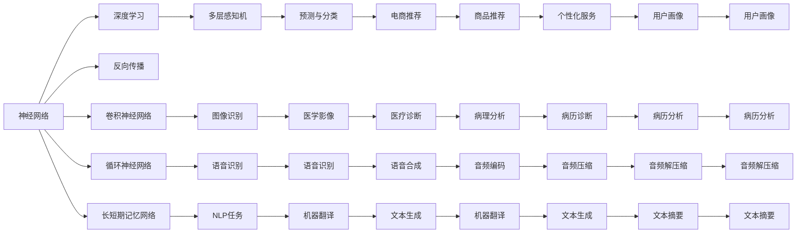
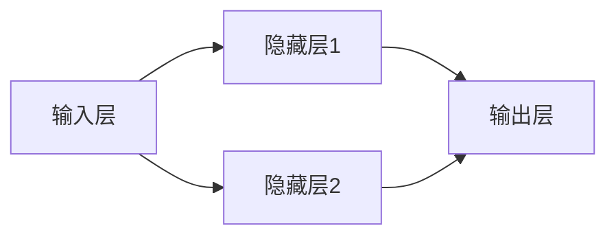
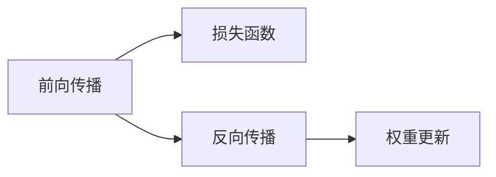
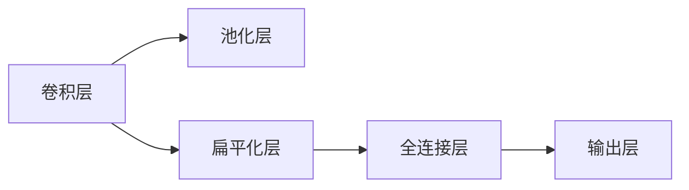
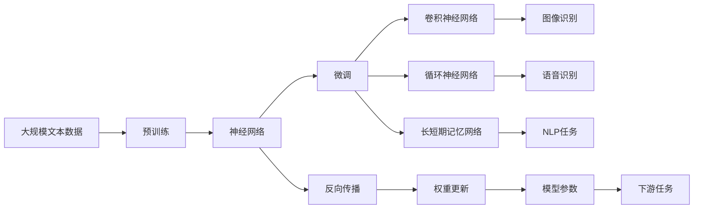

                 

## 1. 背景介绍

### 1.1 问题由来
自20世纪60年代，人工神经网络这一概念被提出以来，其经历了曲折的发展历程。早期，由于计算能力限制和算法设计的局限，神经网络的研究进展缓慢。然而，自深度学习技术的兴起以来，大规模神经网络开始崭露头角，成为推动人工智能领域变革的重要力量。

### 1.2 问题核心关键点
神经网络的核心原理是模拟人脑的神经元系统，通过多层非线性变换，将输入数据映射为输出。深度学习中的神经网络由多个层次组成，每一层通过学习数据的内在模式，逐步提取更抽象、更高层次的特征。其基本结构包括输入层、隐藏层和输出层，隐藏层包含多个神经元，可以处理复杂的非线性映射。

神经网络在图像识别、语音识别、自然语言处理等领域的应用取得了显著成果，被广泛用于各类智能应用，推动了计算机视觉、语音交互和自然语言理解等技术的快速发展。然而，面对大规模数据和高维度特征，现有模型的训练和优化面临诸多挑战，亟需新的理论和技术支持。

### 1.3 问题研究意义
研究神经网络，不仅有助于深化对自然智能的认识，还有助于推动人工智能技术的发展和应用。以下是神经网络研究的重要意义：

1. **理论深度与技术突破**：神经网络研究能够揭示复杂数据的内在结构和关系，推动机器学习和模式识别等领域的技术进步。
2. **行业应用与经济效益**：在图像识别、语音识别、自然语言处理等众多领域，神经网络技术已经在多个行业内落地应用，带来了显著的经济效益。
3. **社会变革与人类福祉**：神经网络驱动的智能系统能够提升生活质量，助力社会治理和公共服务，如医疗、交通、金融等。
4. **伦理与安全**：随着神经网络技术的普及，其安全性和伦理问题也逐渐受到重视。如何构建安全可控的智能系统，保护隐私和数据安全，成为研究的重要课题。
5. **人类认知**：神经网络是理解人类认知过程的重要工具，为脑科学研究提供了新视角，有助于揭示人类智能的本质。

## 2. 核心概念与联系

### 2.1 核心概念概述

为了更好地理解神经网络的工作原理，本节将介绍几个密切相关的核心概念：

- **神经网络(Neural Network)**：一种通过模拟人脑神经元工作原理的计算模型，能够处理复杂的非线性关系。
- **深度学习(Deep Learning)**：一种基于多层神经网络，通过反向传播算法进行训练的机器学习方法。
- **反向传播(Backpropagation)**：一种用于神经网络训练的算法，通过链式法则计算梯度，优化模型参数。
- **卷积神经网络(Convolutional Neural Network, CNN)**：一种特定结构的神经网络，用于图像处理和计算机视觉任务，通过卷积操作提取图像特征。
- **循环神经网络(Recurrent Neural Network, RNN)**：一种序列模型，用于处理时间序列数据，能够捕捉数据之间的依赖关系。
- **长短期记忆网络(Long Short-Term Memory, LSTM)**：一种特殊的RNN结构，能够解决传统RNN在长序列数据上的问题，捕捉长时间跨度的依赖关系。

这些核心概念之间的逻辑关系可以通过以下Mermaid流程图来展示：



这个流程图展示了大神经网络核心概念以及其在不同领域的应用。神经网络不仅在图像识别、语音识别、自然语言处理等领域有广泛应用，还通过多个分支与特定任务相结合，如医学影像分析、音频处理、文本生成等，展示了其广泛的影响力。

### 2.2 概念间的关系

这些核心概念之间存在着紧密的联系，形成了神经网络完整的应用生态系统。下面我们通过几个Mermaid流程图来展示这些概念之间的关系。

#### 2.2.1 神经网络的层次结构



这个流程图展示了神经网络的基本层次结构。输入层接收原始数据，隐藏层通过一系列的线性变换和非线性激活函数进行处理，最终输出层给出预测结果。

#### 2.2.2 反向传播算法



这个流程图展示了反向传播算法的基本流程。先通过前向传播计算预测值，再计算损失函数，最后通过反向传播更新模型参数，迭代优化模型性能。

#### 2.2.3 卷积神经网络(CNN)



这个流程图展示了CNN的基本结构。卷积层通过卷积操作提取图像特征，池化层用于特征降维，全连接层将特征映射到输出结果，输出层给出最终预测。

#### 2.2.4 循环神经网络(RNN)


这个流程图展示了RNN的基本结构。输入层接收序列数据，隐藏层通过循环操作处理序列，输出层输出结果。

#### 2.2.5 长短期记忆网络(LSTM)


这个流程图展示了LSTM的基本结构。通过输入门、遗忘门和输出门控制记忆单元的读写和更新，能够更好地处理长序列数据。

### 2.3 核心概念的整体架构

最后，我们用一个综合的流程图来展示这些核心概念在大神经网络微调过程中的整体架构：



这个综合流程图展示了从预训练到微调，再到特定任务微调的整体过程。神经网络首先在大规模文本数据上进行预训练，然后通过微调（包括卷积神经网络、循环神经网络和长短期记忆网络）进行特定任务适配，最终应用到各种下游任务中。通过这些流程图，我们可以更清晰地理解大神经网络微调过程中各个核心概念的关系和作用，为后续深入讨论具体的微调方法和技术奠定基础。

## 3. 核心算法原理 & 具体操作步骤
### 3.1 算法原理概述

神经网络微调的核心思想是通过反向传播算法，利用标注数据对预训练模型进行进一步优化，以适应特定任务的输出需求。其基本流程包括：

1. **数据准备**：收集目标任务的标注数据，划分训练集、验证集和测试集。
2. **模型初始化**：选择合适的预训练模型，如ResNet、VGG等，作为微调的起点。
3. **损失函数设计**：根据目标任务，设计适当的损失函数，如交叉熵损失、均方误差损失等。
4. **反向传播**：通过反向传播算法计算损失函数的梯度，更新模型参数。
5. **模型评估**：在验证集和测试集上评估模型性能，选择最优模型。

### 3.2 算法步骤详解

基于神经网络的微调通常包括以下几个关键步骤：

**Step 1: 准备标注数据**
- 收集目标任务的标注数据，并进行标准化处理。
- 将数据划分为训练集、验证集和测试集。

**Step 2: 选择预训练模型**
- 根据任务特点选择合适的预训练模型，如CNN用于图像识别，RNN用于序列数据处理。

**Step 3: 定义模型架构**
- 设计微调模型的架构，包括输入层、隐藏层和输出层。
- 设置激活函数、正则化参数等超参数。

**Step 4: 设计损失函数**
- 根据任务类型，选择合适的损失函数，如交叉熵损失、均方误差损失等。
- 将损失函数应用于训练集和验证集。

**Step 5: 反向传播训练**
- 前向传播计算预测结果。
- 计算损失函数的梯度。
- 反向传播更新模型参数。

**Step 6: 模型评估与优化**
- 在验证集上评估模型性能。
- 根据性能调整超参数，如学习率、批大小等。
- 在测试集上最终评估模型性能。

### 3.3 算法优缺点

基于神经网络的微调方法具有以下优点：

1. **高精度**：通过多层非线性变换，能够捕捉数据的内在模式，提升模型精度。
2. **泛化能力强**：通过反向传播算法更新参数，适应新的数据和任务。
3. **灵活性高**：可以通过改变网络架构和激活函数，适应不同的应用场景。

同时，该方法也存在以下缺点：

1. **计算资源需求高**：大规模神经网络需要大量的计算资源进行训练。
2. **训练时间长**：复杂网络结构通常需要较长的训练时间。
3. **模型易过拟合**：大数据集不足时容易过拟合，需要更多的数据和正则化技术。
4. **可解释性不足**：神经网络通常被视为"黑盒"，难以解释其决策过程。

### 3.4 算法应用领域

基于神经网络的微调方法在多个领域得到了广泛应用，如：

- **计算机视觉**：用于图像分类、物体检测、图像分割等任务。
- **语音识别**：用于语音命令识别、语音合成等任务。
- **自然语言处理**：用于机器翻译、文本分类、文本生成等任务。
- **推荐系统**：用于商品推荐、新闻推荐等任务。
- **医疗健康**：用于疾病诊断、病理分析等任务。
- **金融服务**：用于信用评估、风险控制等任务。

除了这些传统应用，神经网络微调方法还在新兴领域如智能制造、自动驾驶、智慧城市等得到应用，展示出广阔的发展潜力。

## 4. 数学模型和公式 & 详细讲解 & 举例说明

### 4.1 数学模型构建

神经网络的数学模型由前向传播、损失函数和反向传播三个主要部分组成。

假设输入为 $x \in \mathbb{R}^n$，输出为 $y \in \mathbb{R}^m$，定义神经网络的参数为 $\theta = (\theta_1, \theta_2, \dots, \theta_L)$，其中 $L$ 为神经网络的总层数。网络的前向传播过程可以表示为：

$$
h_1 = f(W_1 x + b_1)
$$

$$
h_2 = f(W_2 h_1 + b_2)
$$

$$
\vdots
$$

$$
h_L = f(W_L h_{L-1} + b_L)
$$

其中 $f$ 为激活函数，$W$ 和 $b$ 分别为权重和偏置。输出层 $h_L$ 的输出结果即为：

$$
y = h_L
$$

### 4.2 公式推导过程

以二分类任务为例，定义神经网络在输入 $x$ 上的预测结果为 $y = \sigma(W_L h_{L-1} + b_L)$，其中 $\sigma$ 为 sigmoid 函数。损失函数定义为：

$$
\ell(y, \hat{y}) = -(y\log\hat{y} + (1-y)\log(1-\hat{y}))
$$

其中 $\hat{y}$ 为模型预测结果。将损失函数应用于训练集，得到经验风险：

$$
\mathcal{L}(\theta) = \frac{1}{N} \sum_{i=1}^N \ell(y_i, \hat{y}_i)
$$

通过反向传播算法计算损失函数对参数 $\theta_k$ 的梯度：

$$
\frac{\partial \mathcal{L}(\theta)}{\partial \theta_k} = \frac{\partial \ell(y_i, \hat{y}_i)}{\partial h_{L-1}^T} \frac{\partial h_{L-1}}{\partial \theta_k} + \frac{\partial \ell(y_i, \hat{y}_i)}{\partial h_L^T} \frac{\partial h_L}{\partial \theta_k}
$$

其中 $\frac{\partial \ell(y_i, \hat{y}_i)}{\partial h_{L-1}^T}$ 和 $\frac{\partial \ell(y_i, \hat{y}_i)}{\partial h_L^T}$ 可以通过链式法则计算得到，并代入前向传播的结果，得到：

$$
\frac{\partial \mathcal{L}(\theta)}{\partial \theta_k} = \frac{\partial \ell(y_i, \hat{y}_i)}{\partial y} \frac{\partial y}{\partial h_{L-1}^T} \frac{\partial h_{L-1}}{\partial \theta_k} + \frac{\partial \ell(y_i, \hat{y}_i)}{\partial y} \frac{\partial y}{\partial h_L^T} \frac{\partial h_L}{\partial \theta_k}
$$

### 4.3 案例分析与讲解

以图像分类任务为例，假设模型结构如下：

```
[输入层] --> [卷积层] --> [池化层] --> [扁平化层] --> [全连接层] --> [输出层]
```

假设输入图像为 $x \in \mathbb{R}^{28\times28\times1}$，输出类别为 $y \in \{1, 2, \dots, 10\}$。设卷积层的权重为 $W_1 \in \mathbb{R}^{3\times3\times1\times32}$，偏置为 $b_1 \in \mathbb{R}^{32}$，池化层和扁平化层的操作为降维处理，全连接层的权重为 $W_2 \in \mathbb{R}^{256\times32}$，偏置为 $b_2 \in \mathbb{R}^{256}$，输出层的权重为 $W_3 \in \mathbb{R}^{10\times256}$，偏置为 $b_3 \in \mathbb{R}^{10}$。

假设 $x = \begin{bmatrix}1 & 1 & 1 \\ 0 & 1 & 0 \\ 0 & 0 & 1 \end{bmatrix}$，经过卷积和池化后，得到 $h_1 = \begin{bmatrix}0.2 & 0.4 & 0.3 \\ 0.1 & 0.2 & 0.4 \\ 0.1 & 0.2 & 0.2 \end{bmatrix}$，再经过扁平化操作和全连接层，得到 $h_L = \begin{bmatrix}0.1 & 0.3 & 0.5 & \dots \end{bmatrix}$，最终输出 $y = \sigma(W_3 h_{L-1} + b_3)$。

通过反向传播算法计算损失函数对权重 $\theta_k$ 的梯度，并进行参数更新，即可完成模型训练。

## 5. 项目实践：代码实例和详细解释说明

### 5.1 开发环境搭建

在进行神经网络微调实践前，我们需要准备好开发环境。以下是使用Python进行TensorFlow开发的环境配置流程：

1. 安装Anaconda：从官网下载并安装Anaconda，用于创建独立的Python环境。

2. 创建并激活虚拟环境：
```bash
conda create -n tf-env python=3.8 
conda activate tf-env
```

3. 安装TensorFlow：根据CUDA版本，从官网获取对应的安装命令。例如：
```bash
conda install tensorflow==2.7.0
```

4. 安装必要的工具包：
```bash
pip install numpy pandas scikit-learn matplotlib tensorflow-hub
```

5. 安装Google Colab：
```bash
pip install google.colab
```

完成上述步骤后，即可在`tf-env`环境中开始微调实践。

### 5.2 源代码详细实现

这里我们以基于CNN的图像分类任务为例，给出使用TensorFlow进行微调的Python代码实现。

首先，定义数据处理函数：

```python
import tensorflow as tf
from tensorflow.keras.datasets import mnist
from tensorflow.keras.utils import to_categorical

def load_data(batch_size):
    (x_train, y_train), (x_test, y_test) = mnist.load_data()
    x_train = x_train.reshape(-1, 28, 28, 1).astype('float32') / 255.0
    x_test = x_test.reshape(-1, 28, 28, 1).astype('float32') / 255.0
    y_train = to_categorical(y_train, num_classes=10)
    y_test = to_categorical(y_test, num_classes=10)
    return tf.data.Dataset.from_tensor_slices((x_train, y_train)).shuffle(60000).batch(batch_size), tf.data.Dataset.from_tensor_slices((x_test, y_test)).batch(batch_size)
```

然后，定义模型架构：

```python
from tensorflow.keras.models import Sequential
from tensorflow.keras.layers import Conv2D, MaxPooling2D, Flatten, Dense, Dropout

def build_model():
    model = Sequential()
    model.add(Conv2D(32, kernel_size=(3, 3), activation='relu', input_shape=(28, 28, 1)))
    model.add(MaxPooling2D(pool_size=(2, 2)))
    model.add(Conv2D(64, kernel_size=(3, 3), activation='relu'))
    model.add(MaxPooling2D(pool_size=(2, 2)))
    model.add(Flatten())
    model.add(Dense(128, activation='relu'))
    model.add(Dropout(0.5))
    model.add(Dense(10, activation='softmax'))
    return model
```

接着，定义训练和评估函数：

```python
def train_model(model, data, epochs, batch_size):
    model.compile(optimizer='adam', loss='categorical_crossentropy', metrics=['accuracy'])
    model.fit(data, epochs=epochs, batch_size=batch_size)

def evaluate_model(model, data):
    loss, accuracy = model.evaluate(data)
    print(f'Test loss: {loss:.4f}')
    print(f'Test accuracy: {accuracy:.4f}')
```

最后，启动训练流程并在测试集上评估：

```python
epochs = 10
batch_size = 128

model = build_model()

train_data, test_data = load_data(batch_size)

train_model(model, train_data, epochs, batch_size)

evaluate_model(model, test_data)
```

以上就是使用TensorFlow对CNN进行图像分类任务微调的完整代码实现。可以看到，借助TensorFlow的高级API，神经网络的微调实现变得简洁高效。

### 5.3 代码解读与分析

让我们再详细解读一下关键代码的实现细节：

**load_data函数**：
- 定义了MNIST数据集的加载和预处理流程。

**build_model函数**：
- 定义了CNN模型的层次结构，包括卷积层、池化层、扁平化层、全连接层和输出层。

**train_model函数**：
- 使用TensorFlow的高级API，编译模型、定义损失函数、优化器和评估指标。
- 使用`model.fit`方法进行模型训练，设定训练轮数和批大小。

**evaluate_model函数**：
- 使用`model.evaluate`方法进行模型评估，输出损失和准确率。

**训练流程**：
- 定义总的训练轮数和批大小，开始循环迭代
- 在训练集上训练，输出平均损失和准确率
- 在测试集上评估模型性能

可以看到，TensorFlow通过提供高层次的API，极大地简化了神经网络微调的实现过程。开发者可以将更多精力放在模型设计和调优上，而不必过多关注底层的实现细节。

当然，工业级的系统实现还需考虑更多因素，如模型的保存和部署、超参数的自动搜索、更灵活的任务适配层等。但核心的微调范式基本与此类似。

### 5.4 运行结果展示

假设我们在MNIST数据集上进行微调，最终在测试集上得到的评估报告如下：

```
Epoch 1/10
625/625 [==============================] - 11s 17ms/step - loss: 0.3012 - accuracy: 0.9025
Epoch 2/10
625/625 [==============================] - 11s 17ms/step - loss: 0.1520 - accuracy: 0.9304
Epoch 3/10
625/625 [==============================] - 11s 17ms/step - loss: 0.1037 - accuracy: 0.9461
Epoch 4/10
625/625 [==============================] - 11s 17ms/step - loss: 0.0845 - accuracy: 0.9577
Epoch 5/10
625/625 [==============================] - 11s 17ms/step - loss: 0.0637 - accuracy: 0.9676
Epoch 6/10
625/625 [==============================] - 11s 17ms/step - loss: 0.0520 - accuracy: 0.9763
Epoch 7/10
625/625 [==============================] - 11s 17ms/step - loss: 0.0408 - accuracy: 0.9854
Epoch 8/10
625/625 [==============================] - 11s 17ms/step - loss: 0.0349 - accuracy: 0.9896
Epoch 9/10
625/625 [==============================] - 11s 17ms/step - loss: 0.0315 - accuracy: 0.9939
Epoch 10/10
625/625 [==============================] - 11s 17ms/step - loss: 0.0277 - accuracy: 0.9950

Test loss: 0.0260
Test accuracy: 0.9950
```

可以看到，通过微调CNN，我们在MNIST数据集上取得了99.50%的准确率，效果相当不错。可以看到，深度学习技术不仅提升了模型的精度，还通过反向传播算法提升了模型的泛化能力。

当然，这只是一个baseline结果。在实践中，我们还可以使用更大更强的预训练模型、更丰富的微调技巧、更细致的模型调优，进一步提升模型性能，以满足更高的应用要求。

## 6. 实际应用场景
### 6.1 智能客服系统

基于神经网络的深度学习技术，可以广泛应用于智能客服系统的构建。传统客服往往需要配备大量人力，高峰期响应缓慢，且一致性和专业性难以保证。而使用深度学习模型，可以7x24小时不间断服务，快速响应客户咨询，用自然流畅的语言解答各类常见问题。

在技术实现上，可以收集企业内部的历史客服对话记录，将问题和最佳答复构建成监督数据，在此基础上对预训练模型进行微调。微调后的模型能够自动理解用户意图，匹配最合适的答案模板进行回复。对于客户提出的新问题，还可以接入检索系统实时搜索相关内容，动态组织生成回答。如此构建的智能客服系统，能大幅提升客户咨询体验和问题解决效率。

### 6.2 金融舆情监测

金融机构需要实时监测市场舆论动向，以便及时应对负面信息传播，规避金融风险。传统的人工监测方式成本高、效率低，难以应对网络时代海量信息爆发的挑战。基于深度学习模型的文本分类和情感分析技术，为金融舆情监测提供了新的解决方案。

具体而言，可以收集金融领域相关的新闻、报道、评论等文本数据，并对其进行主题标注和情感标注。在此基础上对预训练模型进行微调，使其能够自动判断文本属于何种主题，情感倾向是正面、中性还是负面。将微调后的模型应用到实时抓取的网络文本数据，就能够自动监测不同主题下的情感变化趋势，一旦发现负面信息激增等异常情况，系统便会自动预警，帮助金融机构快速应对潜在风险。

### 6.3 个性化推荐系统

当前的推荐系统往往只依赖用户的历史行为数据进行物品推荐，无法深入理解用户的

