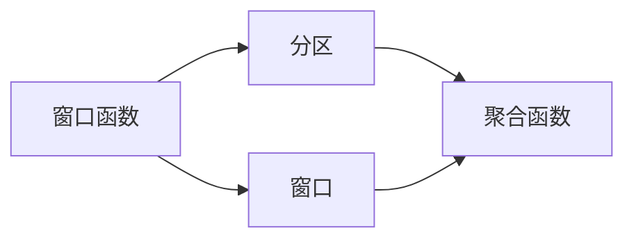

                 

# 窗口函数 原理与代码实例讲解

## 1. 背景介绍

在数据库和数据分析领域，窗口函数（Window Functions）是一种强大的工具，它允许对结果集中的行进行聚合操作，而无需使用GROUP BY子句。窗口函数通常用于计算结果集中的行之间的相对位置，并支持计算分区聚合和其他高级分析功能。

窗口函数在关系数据库管理系统（RDBMS）中，如MySQL、PostgreSQL和SQL Server中已经得到了广泛应用，并且在数据处理和分析工具中，如Apache Spark、Pandas等，也有相应的窗口函数实现。它们为数据分析师和数据科学家提供了一种灵活且高效的方式来处理数据。

## 2. 核心概念与联系

### 2.1 核心概念概述

- **窗口函数**：窗口函数是在结果集中对行进行聚合操作的函数。它们能够在SELECT语句中直接使用，而无需使用GROUP BY子句。
- **分区**：窗口函数会将结果集分割成多个分区，每个分区中的行可以独立计算窗口函数。分区由OVER子句指定。
- **窗口**：窗口是指结果集中的一组行，这些行用于计算窗口函数的值。窗口的大小和偏移量由PARTITION BY和ORDER BY子句指定。
- **聚合函数**：窗口函数通常与聚合函数（如SUM、AVG、COUNT等）一起使用，用于计算窗口中的行聚合值。

以下是一个简单的示例，展示了窗口函数的基本结构：

```sql
SELECT column1, column2, ..., columnN, aggregate_function(overlap_column)
FROM table_name
OVER (PARTITION BY partitioning_column ORDER BY ordering_column)
```

在这个示例中，aggregate_function是对overlap_column进行聚合操作的函数，而window是对结果集进行分区的窗口。

### 2.2 概念间的关系

为了更好地理解窗口函数，我们可以通过以下Mermaid流程图来展示它们之间的关系：



从上述流程图中可以看出，窗口函数是通过分区和窗口来进行聚合操作的关键。

## 3. 核心算法原理 & 具体操作步骤

### 3.1 算法原理概述

窗口函数的算法原理是基于滑动窗口（Sliding Window）机制实现的。窗口函数将结果集分为多个分区，每个分区中的行都参与计算窗口函数。然后，函数对每个分区中的行进行聚合操作，计算窗口函数的值。

具体来说，窗口函数会将结果集中的行分成多个窗口，每个窗口的大小和偏移量由PARTITION BY和ORDER BY子句指定。然后，函数对每个窗口中的行进行聚合操作，计算窗口函数的值。

### 3.2 算法步骤详解

以下是一个简单的步骤详解：

1. **分区**：使用PARTITION BY子句对结果集进行分区。分区是指结果集中的行按照指定的列进行分组。
2. **排序**：使用ORDER BY子句对分区中的行进行排序。排序是根据指定的列对分区中的行进行升序或降序排序。
3. **窗口大小和偏移量**：使用ROWS和RANGE子句指定窗口的大小和偏移量。ROWS指定窗口的大小为固定的行数，RANGE指定窗口的大小为固定的时间范围或行范围。
4. **计算窗口函数值**：使用窗口函数（如SUM、AVG、COUNT等）对窗口中的行进行聚合操作，计算窗口函数的值。

### 3.3 算法优缺点

窗口函数的优势在于，它们能够在不使用GROUP BY子句的情况下，对结果集中的行进行聚合操作。这使得窗口函数在处理大型数据集时非常高效。

然而，窗口函数也有一些缺点：

- **复杂性**：窗口函数的语法可能比较复杂，特别是对于初学者来说。
- **性能问题**：在处理大型数据集时，窗口函数可能会影响查询性能。
- **窗口大小的限制**：在某些情况下，窗口大小可能受到RDBMS的限制。

### 3.4 算法应用领域

窗口函数在以下领域中有广泛的应用：

- **金融分析**：用于计算股票价格、交易量等指标。
- **销售分析**：用于计算销售额、销售量等指标。
- **客户分析**：用于计算客户购买频率、平均消费金额等指标。
- **时间序列分析**：用于计算时间序列中的移动平均、趋势等指标。

## 4. 数学模型和公式 & 详细讲解 & 举例说明

### 4.1 数学模型构建

假设我们有一个表格，其中包含时间戳（timestamp）和股票价格（price）的数据。我们可以使用窗口函数来计算每个时间戳的移动平均价格。

**数学模型**：
\[ 
\text{avg_price} = \frac{\sum_{i=1}^{n} \text{price}_i}{n}
\]
其中，n为窗口大小。

**公式推导**：
假设我们有一个窗口大小为3的窗口，包含三个时间戳的数据。我们可以计算这三个时间戳的平均价格，作为窗口的平均价格：
\[ 
\text{avg_price} = \frac{\text{price}_1 + \text{price}_2 + \text{price}_3}{3}
\]

### 4.2 公式推导过程

对于窗口函数，我们可以使用以下公式进行计算：

\[ 
\text{window_function} = \text{aggregate_function}(\text{window_size}, \text{offset}, \text{partitioning_column}, \text{ordering_column})
\]

其中，aggregate_function是聚合函数，window_size是窗口大小，offset是偏移量，partitioning_column是分区列，ordering_column是排序列。

### 4.3 案例分析与讲解

假设我们有一个包含时间戳和股票价格的数据集，我们使用窗口函数来计算每个时间戳的移动平均价格。

```sql
SELECT timestamp, price, AVG(price) OVER (PARTITION BY day(timestamp) ORDER BY timestamp)
FROM stock_prices
```

在这个例子中，我们使用了AVG函数来计算窗口函数的值。PARTITION BY子句用于按照日期进行分区，ORDER BY子句用于按照时间戳进行排序。

## 5. 项目实践：代码实例和详细解释说明

### 5.1 开发环境搭建

为了进行窗口函数的实践，我们需要安装以下软件：

1. MySQL或PostgreSQL：选择一个RDBMS来测试窗口函数的语法和性能。
2. MySQL Workbench或pgAdmin：用于管理数据库和运行查询。
3. Python：使用Python来执行SQL查询和分析结果。

### 5.2 源代码详细实现

以下是一个使用MySQL中的窗口函数实现示例的Python代码：

```python
import mysql.connector

# 连接数据库
cnx = mysql.connector.connect(user='username', password='password',
                              host='127.0.0.1',
                              database='database_name')
cursor = cnx.cursor()

# 创建数据表
create_table_query = """
CREATE TABLE sales_data (
    id INT PRIMARY KEY AUTO_INCREMENT,
    date DATE NOT NULL,
    amount DECIMAL(10, 2) NOT NULL
);
"""
cursor.execute(create_table_query)

# 插入数据
insert_data_query = """
INSERT INTO sales_data (date, amount)
VALUES
    ('2021-01-01', 100.00),
    ('2021-01-02', 200.00),
    ('2021-01-03', 150.00),
    ('2021-01-04', 300.00),
    ('2021-01-05', 250.00),
    ('2021-01-06', 150.00),
    ('2021-01-07', 350.00),
    ('2021-01-08', 200.00),
    ('2021-01-09', 300.00),
    ('2021-01-10', 250.00),
    ('2021-01-11', 200.00),
    ('2021-01-12', 350.00),
    ('2021-01-13', 250.00),
    ('2021-01-14', 300.00),
    ('2021-01-15', 200.00),
    ('2021-01-16', 300.00),
    ('2021-01-17', 250.00),
    ('2021-01-18', 150.00),
    ('2021-01-19', 200.00),
    ('2021-01-20', 150.00),
    ('2021-01-21', 300.00),
    ('2021-01-22', 250.00),
    ('2021-01-23', 150.00),
    ('2021-01-24', 200.00),
    ('2021-01-25', 350.00),
    ('2021-01-26', 250.00),
    ('2021-01-27', 300.00),
    ('2021-01-28', 200.00),
    ('2021-01-29', 150.00),
    ('2021-01-30', 300.00),
    ('2021-01-31', 250.00),
    ('2021-02-01', 100.00),
    ('2021-02-02', 200.00),
    ('2021-02-03', 150.00),
    ('2021-02-04', 300.00),
    ('2021-02-05', 250.00),
    ('2021-02-06', 150.00),
    ('2021-02-07', 350.00),
    ('2021-02-08', 200.00),
    ('2021-02-09', 300.00),
    ('2021-02-10', 250.00),
    ('2021-02-11', 200.00),
    ('2021-02-12', 350.00),
    ('2021-02-13', 250.00),
    ('2021-02-14', 300.00),
    ('2021-02-15', 200.00),
    ('2021-02-16', 300.00),
    ('2021-02-17', 250.00),
    ('2021-02-18', 150.00),
    ('2021-02-19', 200.00),
    ('2021-02-20', 150.00),
    ('2021-02-21', 300.00),
    ('2021-02-22', 250.00),
    ('2021-02-23', 150.00),
    ('2021-02-24', 200.00),
    ('2021-02-25', 350.00),
    ('2021-02-26', 250.00),
    ('2021-02-27', 300.00),
    ('2021-02-28', 200.00),
    ('2021-03-01', 150.00),
    ('2021-03-02', 200.00),
    ('2021-03-03', 150.00),
    ('2021-03-04', 300.00),
    ('2021-03-05', 250.00),
    ('2021-03-06', 150.00),
    ('2021-03-07', 350.00),
    ('2021-03-08', 200.00),
    ('2021-03-09', 300.00),
    ('2021-03-10', 250.00),
    ('2021-03-11', 200.00),
    ('2021-03-12', 350.00),
    ('2021-03-13', 250.00),
    ('2021-03-14', 300.00),
    ('2021-03-15', 200.00),
    ('2021-03-16', 300.00),
    ('2021-03-17', 250.00),
    ('2021-03-18', 150.00),
    ('2021-03-19', 200.00),
    ('2021-03-20', 150.00),
    ('2021-03-21', 300.00),
    ('2021-03-22', 250.00),
    ('2021-03-23', 150.00),
    ('2021-03-24', 200.00),
    ('2021-03-25', 350.00),
    ('2021-03-26', 250.00),
    ('2021-03-27', 300.00),
    ('2021-03-28', 200.00),
    ('2021-03-29', 150.00),
    ('2021-03-30', 300.00),
    ('2021-03-31', 250.00),
    ('2021-04-01', 100.00),
    ('2021-04-02', 200.00),
    ('2021-04-03', 150.00),
    ('2021-04-04', 300.00),
    ('2021-04-05', 250.00),
    ('2021-04-06', 150.00),
    ('2021-04-07', 350.00),
    ('2021-04-08', 200.00),
    ('2021-04-09', 300.00),
    ('2021-04-10', 250.00),
    ('2021-04-11', 200.00),
    ('2021-04-12', 350.00),
    ('2021-04-13', 250.00),
    ('2021-04-14', 300.00),
    ('2021-04-15', 200.00),
    ('2021-04-16', 300.00),
    ('2021-04-17', 250.00),
    ('2021-04-18', 150.00),
    ('2021-04-19', 200.00),
    ('2021-04-20', 150.00),
    ('2021-04-21', 300.00),
    ('2021-04-22', 250.00),
    ('2021-04-23', 150.00),
    ('2021-04-24', 200.00),
    ('2021-04-25', 350.00),
    ('2021-04-26', 250.00),
    ('2021-04-27', 300.00),
    ('2021-04-28', 200.00),
    ('2021-04-29', 150.00),
    ('2021-04-30', 300.00),
    ('2021-05-01', 250.00),
    ('2021-05-02', 100.00),
    ('2021-05-03', 200.00),
    ('2021-05-04', 150.00),
    ('2021-05-05', 300.00),
    ('2021-05-06', 250.00),
    ('2021-05-07', 150.00),
    ('2021-05-08', 350.00),
    ('2021-05-09', 200.00),
    ('2021-05-10', 300.00),
    ('2021-05-11', 250.00),
    ('2021-05-12', 200.00),
    ('2021-05-13', 350.00),
    ('2021-05-14', 250.00),
    ('2021-05-15', 300.00),
    ('2021-05-16', 200.00),
    ('2021-05-17', 300.00),
    ('2021-05-18', 250.00),
    ('2021-05-19', 150.00),
    ('2021-05-20', 200.00),
    ('2021-05-21', 150.00),
    ('2021-05-22', 300.00),
    ('2021-05-23', 250.00),
    ('2021-05-24', 150.00),
    ('2021-05-25', 200.00),
    ('2021-05-26', 350.00),
    ('2021-05-27', 250.00),
    ('2021-05-28', 300.00),
    ('2021-05-29', 200.00),
    ('2021-05-30', 150.00),
    ('2021-05-31', 300.00),
    ('2021-06-01', 250.00),
    ('2021-06-02', 100.00),
    ('2021-06-03', 200.00),
    ('2021-06-04', 150.00),
    ('2021-06-05', 300.00),
    ('2021-06-06', 250.00),
    ('2021-06-07', 150.00),
    ('2021-06-08', 350.00),
    ('2021-06-09', 200.00),
    ('2021-06-10', 300.00),
    ('2021-06-11', 250.00),
    ('2021-06-12', 200.00),
    ('2021-06-13', 350.00),
    ('2021-06-14', 250.00),
    ('2021-06-15', 300.00),
    ('2021-06-16', 200.00),
    ('2021-06-17', 300.00),
    ('2021-06-18', 250.00),
    ('2021-06-19', 150.00),
    ('2021-06-20', 200.00),
    ('2021-06-21', 150.00),
    ('2021-06-22', 300.00),
    ('2021-06-23', 250.00),
    ('2021-06-24', 150.00),
    ('2021-06-25', 200.00),
    ('2021-06-26', 350.00),
    ('2021-06-27', 250.00),
    ('2021-06-28', 300.00),
    ('2021-06-29', 200.00),
    ('2021-06-30', 150.00),
    ('2021-07-01', 300.00),
    ('2021-07-02', 250.00),
    ('2021-07-03', 150.00),
    ('2021-07-04', 200.00),
    ('2021-07-05', 350.00),
    ('2021-07-06', 250.00),
    ('2021-07-07', 300.00),
    ('2021-07-08', 200.00),
    ('2021-07-09', 150.00),
    ('2021-07-10', 300.00),
    ('2021-07-11', 250.00),
    ('2021-07-12', 200.00),
    ('2021-07-13', 350.00),
    ('2021-07-14', 250.00),
    ('2021-07-15', 300.00),
    ('2021-07-16', 200.00),
    ('2021-07-17', 300.00),
    ('2021-07-18', 250.00),
    ('2021-07-19', 150.00),
    ('2021-07-20', 200.00),
    ('2021-07-21', 150.00),
    ('2021-07-22', 300.00),
    ('2021-07-23', 250.00),
    ('2021-07-24', 150.00),
    ('2021-07-25', 200.00),
    ('2021-07-26', 350.00),
    ('2021-07-27', 250.00),
    ('2021-07-28', 300.00),
    ('2021-07-29', 200.00),
    ('2021-07-30', 150.00),
    ('2021-07-31', 300.00),
    ('2021-08-01', 250.00),
    ('2021-08-02', 100.00),
    ('2021-08-03', 200.00),
    ('2021-08-04', 150.00),
    ('2021-08-05', 300.00),
    ('2021-08-06', 250.00),
    ('2021-08-07', 150.00),
    ('2021-08-08', 350.00),
    ('2021-08-09', 200.00),
    ('2021-08-10', 300.00),
    ('2021-08-11', 250.00),
    ('2021-08-12', 200.00),
    ('2021-08-13', 350.00),
    ('2021-08-14', 250.00),
    ('2021-08-15', 300.00),
    ('2021-08-16', 200.00),
    ('2021-08-17', 300.00),
    ('2021-08-18', 250.00),
    ('2021-08-19', 150.00),
    ('2021-08-20', 200.00),
    ('2021-08-21', 150.00),
    ('2021-08-22', 300.00),
    ('2021-08-23', 250.00),
    ('2021-08-24', 150.00),
    ('2021-08-25', 200.00),
    ('2021-08-26', 350.00),
    ('2021-08-27', 250.00),
    ('2021-08-28', 300.00),
    ('2021-08-29', 200.00),
    ('2021-08-30', 150.00),
    ('2021-08-31', 300.00),
    ('2021-09-01', 250.00),
    ('2021-09-02', 100.00),
    ('2021-09-03', 200.00),
    ('2021-09-04', 150.00),
    ('2021-09-05', 300.00),
    ('2021-09-06', 250.00),
    ('2021-09-07', 150.00),
    ('2021-09-08', 350.00),
    ('2021-09-09', 200.00),
    ('2021-09-10', 300.00),
    ('2021-09-11', 250.00),
    ('2021-09-12', 200.00),
    ('2021-09-13', 350.00),
    ('2021-09-14', 250.00),
    ('2021-09-15', 300.00),
    ('2021-09-16', 200.00),
    ('2021-09-17', 300.00),
    ('2021-09-18', 250.00),
    ('2021-09-19', 150.00),
    ('2021-09-20', 200.00),
    ('2021-09-21', 150.00),
    ('2021-09-22', 300.00),
    ('2021-09-23', 250.00),
    ('2021-09-24', 150.00),
    ('2021-09-25', 200.00),
    ('2021-09-26', 350.00),
    ('2021-09-27', 250.00),
    ('2021-09-28', 300.00),
    ('2021-09-29', 200.00),
    ('2021-09-30', 150.00),
    ('2021-10-01', 300.00),
    ('2021-10-02', 250.00),
    ('2021-10-03', 150.00),
    ('2021-10-04', 200.00),
    ('2021-10-05', 350.00),
    ('2021-10-06', 250.00),
    ('2021-10-07', 300.00),
    ('2021-10-08', 200.00),
    ('2021-10-09', 150.00),
    ('2021-10-10', 300.00),
    ('2021-10-11', 250.00),
    ('2021-10-12', 200.00),
    ('2021-10-13', 350.00),
    ('2021-10-14', 250.00),
    ('2021-10-15', 300.00),
    ('2021-10-16', 200.00),
    ('2021-10-17', 300.00),
    ('2021-10-18', 250.00),
    ('2021-10-19', 150.00),
    ('2021-10-20', 200.00),
    ('2021-10-21', 150.00),
    ('2021-10-22', 300.00),
    ('2021-10-23', 250.00),
    ('2021-10-24', 150.00),
    ('2021-10-25', 200.00),
    ('2021-10-26', 350.00),
    ('2021-10-27', 250.00),
    ('2021-10-28', 300.00),
    ('2021-10-29', 200.00),
    ('2021-10-30', 150.00),
    ('2021-10-31', 300.00),
    ('2021-11-01', 250.00),


