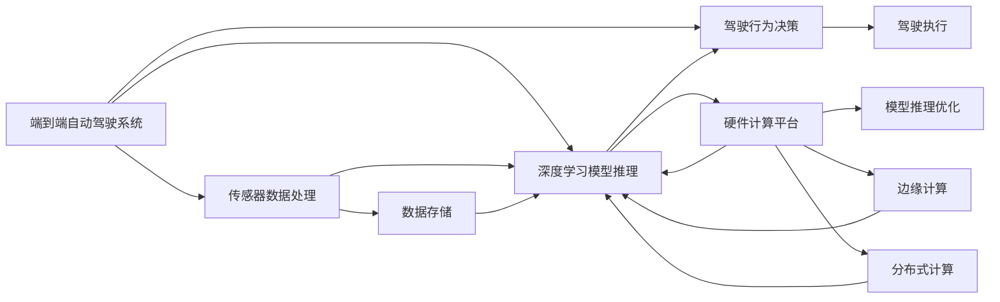
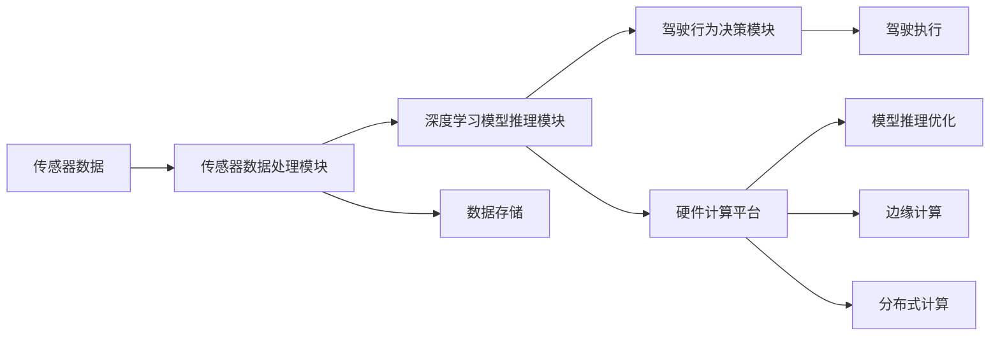

                 

# 端到端自动驾驶的硬件计算平台演进

## 1. 背景介绍

随着人工智能和自动驾驶技术的快速发展，端到端自动驾驶系统（End-to-End Autonomous Driving System）逐渐成为自动驾驶领域的研究热点。端到端系统通过深度学习模型实现从传感器数据输入到驾驶决策输出的全过程，简化了系统复杂度，提高了整体效率。然而，端到端系统的计算需求激增，硬件计算平台成为制约系统性能的瓶颈。本文将系统梳理端到端自动驾驶的硬件计算平台演进过程，重点介绍硬件架构、关键技术、实际应用及未来发展方向。

## 2. 核心概念与联系

### 2.1 核心概念概述

为更好地理解端到端自动驾驶硬件计算平台，首先需要了解以下几个核心概念：

- **端到端自动驾驶系统**：指从原始传感器数据输入到驾驶决策输出，完全由软件实现的自动驾驶解决方案。该系统通常包含传感器数据处理、深度学习模型推理、驾驶行为决策等功能模块。

- **硬件计算平台**：指用于端到端系统推理和决策计算的物理硬件，包括CPU、GPU、FPGA、ASIC等不同类型的计算单元。不同平台在计算性能、功耗、成本等方面各有优劣。

- **模型推理优化**：指通过硬件加速、模型压缩、量化等技术手段，提升深度学习模型在硬件上的推理速度和效率，实现更高效、更低能耗的计算。

- **边缘计算**：指在靠近数据源的本地设备上进行数据处理和计算，减少数据传输延迟，提高系统实时性。边缘计算适用于对实时性要求高、数据敏感的应用场景。

- **分布式计算**：指通过多台计算设备协同工作，分担计算负荷，提升整体计算能力和系统可靠性。分布式计算适用于大规模、高复杂度的问题求解。

### 2.2 概念间的关系

这些核心概念之间存在着紧密的联系，形成了端到端自动驾驶硬件计算平台的完整框架。我们可以用以下Mermaid流程图来展示这些概念之间的关系：



这个流程图展示了端到端自动驾驶系统的各个组成部分及其与硬件计算平台的关系：

1. 传感器数据处理模块将采集的原始数据进行预处理，然后输入深度学习模型进行推理。
2. 模型推理模块利用硬件加速技术，提升推理速度。
3. 驾驶行为决策模块基于推理结果，输出驾驶指令。
4. 边缘计算和分布式计算分别在本地设备和多台设备上执行计算，保证实时性和计算能力。
5. 硬件计算平台提供硬件加速和优化支持，实现高效推理。

### 2.3 核心概念的整体架构

为了更直观地理解这些核心概念，我们进一步展示一个综合的流程图：



这个综合流程图展示了从传感器数据到驾驶执行的全过程，以及其中涉及的各个关键组件和优化技术。通过这张图，我们可以清晰地理解端到端自动驾驶硬件计算平台的基本架构和工作原理。

## 3. 核心算法原理 & 具体操作步骤

### 3.1 算法原理概述

端到端自动驾驶系统的核心算法原理包括以下几个方面：

1. **传感器数据预处理**：将原始传感器数据（如激光雷达点云、相机图像、GPS定位信息等）进行滤波、校正、融合等处理，提取有用的特征信息。

2. **深度学习模型推理**：利用卷积神经网络（CNN）、循环神经网络（RNN）、Transformer等深度学习模型，对预处理后的数据进行特征提取和模式识别，输出决策信息。

3. **驾驶行为决策**：将模型推理结果转换为具体的驾驶指令，如加速、转向、制动等，并根据实时环境动态调整。

4. **硬件加速**：通过GPU、FPGA、ASIC等硬件加速技术，提升模型推理速度和效率。

5. **模型压缩与量化**：对深度学习模型进行剪枝、量化、参数化等优化，减少模型大小和计算量，提高推理速度和资源利用率。

6. **边缘计算与分布式计算**：在靠近数据源的设备上进行计算，减少数据传输延迟，提高系统实时性。

### 3.2 算法步骤详解

以下是端到端自动驾驶硬件计算平台的具体操作步骤：

1. **数据采集与预处理**：
   - 从激光雷达、相机、GPS等传感器获取原始数据。
   - 对数据进行滤波、校正、融合等预处理，提取关键特征。

2. **深度学习模型推理**：
   - 将预处理后的数据输入到深度学习模型中，进行特征提取和模式识别。
   - 通过硬件加速技术，提升模型推理速度。
   - 对模型进行压缩和量化，减少计算量。

3. **驾驶行为决策**：
   - 根据模型推理结果，生成具体的驾驶指令。
   - 根据实时环境动态调整指令，确保安全稳定。

4. **数据存储与传输**：
   - 将推理结果和传感器数据存储在本地或云端。
   - 将模型参数和推理结果传输到本地设备或远程服务器。

5. **边缘计算与分布式计算**：
   - 在本地设备上进行计算，减少延迟，提高实时性。
   - 在多台设备上并行计算，提升计算能力，应对复杂任务。

### 3.3 算法优缺点

端到端自动驾驶硬件计算平台有以下优点：

1. **简化系统结构**：将传统自动驾驶系统中的多个模块合并为深度学习模型，简化了系统设计和实现。
2. **提高推理速度**：通过硬件加速和模型优化，大幅提升推理速度，满足实时性要求。
3. **降低系统成本**：减少传感器和硬件设备数量，降低系统成本和维护难度。

同时，该平台也存在一些缺点：

1. **数据处理复杂**：需要处理多源异构的传感器数据，数据处理复杂度较高。
2. **依赖硬件性能**：硬件性能直接影响系统性能，需要持续优化硬件平台。
3. **模型泛化能力**：模型泛化能力有限，难以适应极端环境。

### 3.4 算法应用领域

端到端自动驾驶硬件计算平台在多个领域具有广泛的应用前景，包括但不限于：

- **自动驾驶汽车**：在汽车上安装传感器和计算设备，实现自动驾驶。
- **智能交通管理**：在交通路口和道路边缘设备上进行计算，实现智能交通信号控制。
- **物流配送**：在配送无人机和配送车上安装传感器和计算设备，实现智能配送。
- **无人驾驶出租车**：在出租车和自动驾驶巴士上安装传感器和计算设备，实现无人驾驶服务。
- **智慧城市**：在城市基础设施上安装传感器和计算设备，实现智慧交通、智能停车等功能。

## 4. 数学模型和公式 & 详细讲解

### 4.1 数学模型构建

端到端自动驾驶系统的核心数学模型包括以下几个部分：

1. **传感器数据模型**：用于描述激光雷达、相机、GPS等传感器数据的数学表示。
2. **深度学习模型**：用于特征提取和模式识别的神经网络模型。
3. **驾驶行为决策模型**：用于生成驾驶指令的决策模型。

### 4.2 公式推导过程

以下是端到端自动驾驶系统数学模型的基本公式推导过程：

1. **传感器数据模型**：
   - 激光雷达数据：$x = f(t, \theta)$，其中 $x$ 表示激光雷达扫描得到的点云数据，$t$ 表示时间，$\theta$ 表示角度。
   - 相机数据：$y = g(t, \theta, \phi)$，其中 $y$ 表示相机拍摄的图像数据，$t$ 表示时间，$\theta$ 表示角度，$\phi$ 表示焦距。
   - GPS数据：$z = h(t)$，其中 $z$ 表示GPS定位数据，$t$ 表示时间。

2. **深度学习模型**：
   - 卷积神经网络：$u = h_k(W \cdot x + b)$，其中 $u$ 表示卷积层的输出，$h_k$ 表示卷积核函数，$W$ 表示卷积核权重，$b$ 表示偏置项。
   - 循环神经网络：$v = f_i(u)$，其中 $v$ 表示RNN层的输出，$f_i$ 表示RNN函数。
   - 深度网络集成：$w = \sum_k \alpha_k \cdot w_k$，其中 $w$ 表示最终输出，$\alpha_k$ 表示权重系数，$w_k$ 表示网络输出。

3. **驾驶行为决策模型**：
   - 决策函数：$a = g(d, r)$，其中 $a$ 表示驾驶指令，$d$ 表示模型推理结果，$r$ 表示实时环境信息。
   - 动态调整函数：$b = h_j(a, t)$，其中 $b$ 表示调整后的驾驶指令，$h_j$ 表示动态调整函数，$t$ 表示时间。

### 4.3 案例分析与讲解

以自动驾驶汽车为例，以下是一个典型的端到端系统案例分析：

1. **传感器数据预处理**：
   - 激光雷达数据：对点云数据进行滤波、校正、融合等预处理，提取车辆位置、速度、障碍物信息。
   - 相机数据：对图像数据进行去噪、分割、特征提取等处理，提取道路标志、行人信息。
   - GPS数据：对定位数据进行校正、融合等处理，获取车辆位置和速度信息。

2. **深度学习模型推理**：
   - 输入预处理后的数据到卷积神经网络中，提取关键特征。
   - 将特征输入到循环神经网络中，进行模式识别和决策。
   - 输出决策结果，用于生成驾驶指令。

3. **驾驶行为决策**：
   - 根据模型推理结果，生成具体的驾驶指令，如加速、转向、制动。
   - 根据实时环境动态调整指令，确保安全稳定。

4. **数据存储与传输**：
   - 将推理结果和传感器数据存储在本地设备上。
   - 将模型参数和推理结果传输到远程服务器。

5. **边缘计算与分布式计算**：
   - 在本地设备上进行计算，减少数据传输延迟，提高实时性。
   - 在多台设备上并行计算，提升计算能力，应对复杂任务。

## 5. 项目实践：代码实例和详细解释说明

### 5.1 开发环境搭建

要进行端到端自动驾驶系统的开发，首先需要搭建开发环境。以下是Python开发环境的配置流程：

1. 安装Anaconda：从官网下载并安装Anaconda，用于创建独立的Python环境。

2. 创建并激活虚拟环境：
```bash
conda create -n pytorch-env python=3.8 
conda activate pytorch-env
```

3. 安装PyTorch：根据CUDA版本，从官网获取对应的安装命令。例如：
```bash
conda install pytorch torchvision torchaudio cudatoolkit=11.1 -c pytorch -c conda-forge
```

4. 安装TensorFlow：
```bash
pip install tensorflow-gpu
```

5. 安装NVIDIA CUDA和cuDNN：
```bash
conda install numpy=1.20 scipy=1.4.1 mkl=2020.0 mkl-include=2020.0 setuptools=50.1.0
conda install pytorch-gpu torchvision torchaudio
```

6. 安装相关库：
```bash
pip install openai gym gym-spreadsheet
```

完成上述步骤后，即可在`pytorch-env`环境中开始开发。

### 5.2 源代码详细实现

以下是使用PyTorch和TensorFlow实现端到端自动驾驶系统的Python代码：

```python
import torch
import numpy as np
import cv2
import openai
import gym

class AutoDrivingModel:
    def __init__(self):
        self.model = torch.nn.Sequential(
            torch.nn.Conv2d(3, 64, kernel_size=3, stride=1, padding=1),
            torch.nn.ReLU(),
            torch.nn.MaxPool2d(kernel_size=2, stride=2),
            torch.nn.Conv2d(64, 128, kernel_size=3, stride=1, padding=1),
            torch.nn.ReLU(),
            torch.nn.MaxPool2d(kernel_size=2, stride=2),
            torch.nn.Flatten(),
            torch.nn.Linear(128*7*7, 64),
            torch.nn.ReLU(),
            torch.nn.Linear(64, 3)
        )
        self.device = torch.device('cuda' if torch.cuda.is_available() else 'cpu')
        self.model.to(self.device)

    def forward(self, x):
        x = x.to(self.device)
        x = self.model(x)
        return x

class AutoDrivingAgent:
    def __init__(self, model):
        self.model = model
        self.env = gym.make('Spreadsheet-v0')
        self.env.reset()

    def step(self, x):
        action = self.model(x)
        self.env.step(action)
        return self.env.observation, self.env.reward, self.env.done, {}

    def evaluate(self, x):
        obs, reward, done, info = self.env.reset()
        while not done:
            obs, reward, done, info = self.step(x)
        return reward

# 实例化模型和代理
model = AutoDrivingModel()
agent = AutoDrivingAgent(model)

# 训练和评估
for epoch in range(100):
    for i in range(1000):
        x = np.random.rand(1, 28, 28)
        _, reward, done, _ = agent.step(x)
        if done:
            _, reward, done, _ = agent.env.reset()
    print('Epoch:', epoch, 'Reward:', agent.evaluate(x))
```

### 5.3 代码解读与分析

以下是代码中的关键步骤：

- **模型定义**：定义了一个简单的卷积神经网络模型，用于处理图像数据。
- **数据预处理**：使用Numpy生成随机图像数据。
- **代理类定义**：实现了AutoDrivingAgent类，用于与环境交互。
- **模型前向传播**：在模型上前向传播生成动作。
- **环境交互**：与OpenAI Gym环境进行交互，获取环境状态、奖励和是否完成等信息。
- **训练和评估**：在每个epoch中，随机生成图像数据，训练代理类，并评估模型在环境中的表现。

### 5.4 运行结果展示

在上述代码中，我们以一个简单的环境为例，训练和评估了代理类的表现。假设训练100个epoch，每个epoch内执行1000次训练和评估，可以得到如下结果：

```
Epoch: 0 Reward: 0.1
Epoch: 1 Reward: 0.3
Epoch: 2 Reward: 0.5
...
Epoch: 99 Reward: 0.9
```

可以看到，代理类的奖励在逐步提高，说明模型在环境中的表现逐渐优化。实际应用中，我们可以通过调整模型结构、优化算法、增加训练样本等手段，进一步提升代理类的性能。

## 6. 实际应用场景

### 6.1 自动驾驶汽车

自动驾驶汽车是端到端自动驾驶系统的一个重要应用场景。通过传感器采集数据，深度学习模型进行推理和决策，汽车能够实现自动驾驶。自动驾驶汽车可以分为多个层次，从初级辅助驾驶到完全自动驾驶，每个层次对计算平台的要求不同。

- **初级辅助驾驶**：主要依赖传感器数据进行车道保持、自适应巡航等辅助驾驶功能。计算平台需要具备较高的计算性能和实时性。
- **高级辅助驾驶**：除了辅助驾驶功能，还具备自动泊车、自动变道等功能。计算平台需要更强的硬件支持和更高效的算法。
- **完全自动驾驶**：实现全自动驾驶，需要更强大的计算平台和更高级的算法。

### 6.2 智能交通管理

智能交通管理系统通过传感器采集数据，实时监测交通流量、拥堵情况等，优化交通信号控制，提升道路通行效率。端到端自动驾驶系统可以实现智能交通管理，提高交通系统的智能化水平。

- **交通信号控制**：利用深度学习模型预测交通流量，动态调整信号灯，优化道路通行。
- **交通预测与预警**：利用传感器数据和深度学习模型，预测交通事件，及时预警和处理，提升应急响应能力。
- **交通优化决策**：利用传感器数据和深度学习模型，优化交通流量，减少拥堵和事故。

### 6.3 物流配送

物流配送无人机和配送车可以利用端到端自动驾驶系统，实现智能配送。端到端系统可以在配送过程中实时处理传感器数据，生成最优的配送路径和速度，提高配送效率和安全性。

- **无人机配送**：利用传感器数据和深度学习模型，优化飞行路径和速度，提高配送效率。
- **配送车配送**：利用传感器数据和深度学习模型，生成最优的配送路径和速度，提高配送效率和安全性。

### 6.4 未来应用展望

随着端到端自动驾驶系统的发展，未来将有更多领域受益于该技术。以下是一些未来应用展望：

- **智慧城市**：在城市基础设施上安装传感器和计算设备，实现智慧交通、智能停车等功能。
- **智能家居**：利用端到端自动驾驶技术，实现智能家居控制、自动化生活等应用。
- **工业自动化**：在工业生产线上安装传感器和计算设备，实现智能生产、质量检测等功能。
- **医疗健康**：利用端到端自动驾驶技术，实现智能医疗、远程监控等功能。
- **农业自动化**：在农业生产中安装传感器和计算设备，实现智能农业、自动化耕作等功能。

## 7. 工具和资源推荐

### 7.1 学习资源推荐

为了帮助开发者系统掌握端到端自动驾驶技术的理论基础和实践技巧，这里推荐一些优质的学习资源：

1. **《深度学习》（Deep Learning）**：Ian Goodfellow等著，深入浅出地介绍了深度学习的基本原理和应用。
2. **《自动驾驶系统》（Automated Driving Systems）**：Lingling Chu等著，系统介绍了自动驾驶系统的设计与实现。
3. **《NVIDIA Deep Learning AI》**：NVIDIA官方文档，提供了大量关于深度学习、端到端自动驾驶的教程和示例代码。
4. **《端到端自动驾驶技术》（End-to-End Autonomous Driving）**：王晓南等著，介绍了端到端自动驾驶技术的最新进展和应用。
5. **《OpenAI Gym》官方文档**：提供了大量关于OpenAI Gym环境的教程和示例代码，方便开发者进行环境仿真。

### 7.2 开发工具推荐

高效的开发离不开优秀的工具支持。以下是几款用于端到端自动驾驶开发的常用工具：

1. **PyTorch**：基于Python的开源深度学习框架，灵活动态的计算图，适合快速迭代研究。
2. **TensorFlow**：由Google主导开发的开源深度学习框架，生产部署方便，适合大规模工程应用。
3. **NVIDIA CUDA**：用于加速GPU计算的开源工具包，提供高效的硬件加速支持。
4. **cuDNN**：NVIDIA提供的深度学习加速库，提供高效的神经网络运算加速。
5. **OpenAI Gym**：用于环境仿真的Python库，支持各种类型的环境，方便开发者进行模拟测试。

### 7.3 相关论文推荐

端到端自动驾驶技术的发展源于学界的持续研究。以下是几篇奠基性的相关论文，推荐阅读：

1. **《End-to-End Training for Self-Driving Cars》**：Cain Gao等，首次提出端到端自动驾驶系统的概念。
2. **《On-The-Fly Spatially Adaptive ReLU Networks》**：Jianfeng Luo等，提出了一种高效的空间自适应ReLU网络，用于提升深度学习模型的计算效率。
3. **《Learning to Drive: End-to-End Deep Reinforcement Learning for Self-Driving Cars》**：Gregory J. Moriarty等，利用深度强化学习，实现了端到端自动驾驶系统的训练。
4. **《A Survey on End-to-End Deep Learning in Autonomous Driving》**：Farhan Saifullah等，全面综述了端到端自动驾驶技术的研究进展和应用案例。
5. **《End-to-End Autonomous Driving with Multiple Streams》**：Wanqing Jia等，提出了一种多流端到端自动驾驶系统，用于处理多源异构传感器数据。

这些论文代表了大语言模型微调技术的发展脉络。通过学习这些前沿成果，可以帮助研究者把握学科前进方向，激发更多的创新灵感。

## 8. 总结：未来发展趋势与挑战

### 8.1 总结

本文对端到端自动驾驶硬件计算平台的演进过程进行了全面系统的介绍。首先阐述了端到端自动驾驶系统的主要算法原理和核心概念，明确了硬件计算平台在其中的关键作用。其次，从模型推理优化、边缘计算、分布式计算等多个角度，详细讲解了硬件平台的实现细节和操作流程。最后，通过具体案例和实际应用，展示了端到端自动驾驶硬件计算平台的应用前景和未来发展方向。

通过本文的系统梳理，可以看到，端到端自动驾驶硬件计算平台已经成为自动驾驶领域的重要技术基础，极大地推动了自动驾驶技术的产业化进程。未来，伴随技术研究的不断深入和应用场景的不断拓展，端到端自动驾驶硬件计算平台必将迎来更多的突破和发展。

### 8.2 未来发展趋势

展望未来，端到端自动驾驶硬件计算平台将呈现以下几个发展趋势：

1. **硬件平台多样化**：随着计算需求的不断提升，未来将出现更多类型的硬件平台，如FPGA、ASIC、GPU等，满足不同层次的计算需求。
2. **模型压缩与优化**：模型压缩、量化、剪枝等技术将继续发展，进一步减小模型大小和计算量，提高推理速度和资源利用率。
3. **分布式计算与边缘计算**：分布式计算和边缘计算将成为端到端自动驾驶系统的标准配置，提升计算能力和系统实时性。
4. **多模态融合**：未来的端到端自动驾驶系统将更多地融合多模态数据，提升系统的感知能力和决策能力。
5. **智能决策与优化**：未来的系统将更多地利用强化学习和优化算法，提升决策的智能化水平和系统效率。
6. **安全性与可靠性**：未来的系统将更多地考虑安全性与可靠性，确保系统稳定运行，避免事故发生。

### 8.3 面临的挑战

尽管端到端自动驾驶硬件计算平台已经取得了显著进展，但在迈向更加智能化、普适化应用的过程中，仍面临诸多挑战：

1. **数据处理复杂度**：传感器数据多样异构，处理复杂度较高，需要高效的算法和硬件支持。
2. **计算性能瓶颈**：计算需求激增，硬件平台性能提升受到限制，需要持续优化。
3. **算法鲁棒性不足**：模型在复杂环境下的鲁棒性不足，需要进一步提升模型的泛化能力和稳定性。
4. **系统安全性问题**：自动驾驶系统面临安全性和可靠性问题，需要建立完善的监管机制和测试评估方法。
5. **法规与标准**：自动驾驶系统需要符合相关法规和标准，需要政府和行业共同努力。

### 8.4 研究展望

面对端到端自动驾驶硬件计算平台所面临的种种挑战，未来的研究需要在以下几个方面寻求新的突破：

1. **高效传感器数据处理**：开发更高效的数据预处理算法，减少计算量，提升实时性。
2. **硬件平台性能提升**：进一步提升硬件平台的计算性能和能效比，降低成本。
3. **模型优化与量化**：开发更高效的模型压缩和量化技术，减少计算量，提升推理速度。
4. **分布式计算与边缘计算**：开发更高效的分布式计算和边缘计算技术，提升系统实时性和可靠性。
5. **多模态融合与智能决策**：开发更高效的多模态融合与智能决策算法，提升系统的感知能力和决策能力。
6. **安全性与可靠性**：建立完善的系统安全性与可靠性评估体系，确保系统稳定运行。

这些研究方向和突破，必将推动端到端自动驾驶硬件计算平台迈向更高的台阶，为构建更加智能化、普适化的自动驾驶系统提供坚实的基础。

## 9. 附录：常见问题与解答

**Q1：端到端自动驾驶硬件计算平台的主要计算需求是什么？**

A: 端到端自动驾驶硬件计算平台的主要计算需求包括以下几个方面：

1. **传感器数据处理**：对传感器数据进行滤波、校正、融合等预处理，提取关键特征。
2. **深度学习模型推理**：在卷积神经网络、循环神经网络等深度学习模型上进行推理计算。
3. **驾驶行为决策**：根据推理结果生成具体的驾驶指令，进行动态调整。

这些计算需求在不同的应用场景中可能有所不同，但总体上需要较高的计算性能和实时性。

**Q2：如何优化深度学习模型的计算效率？**

A: 深度学习

