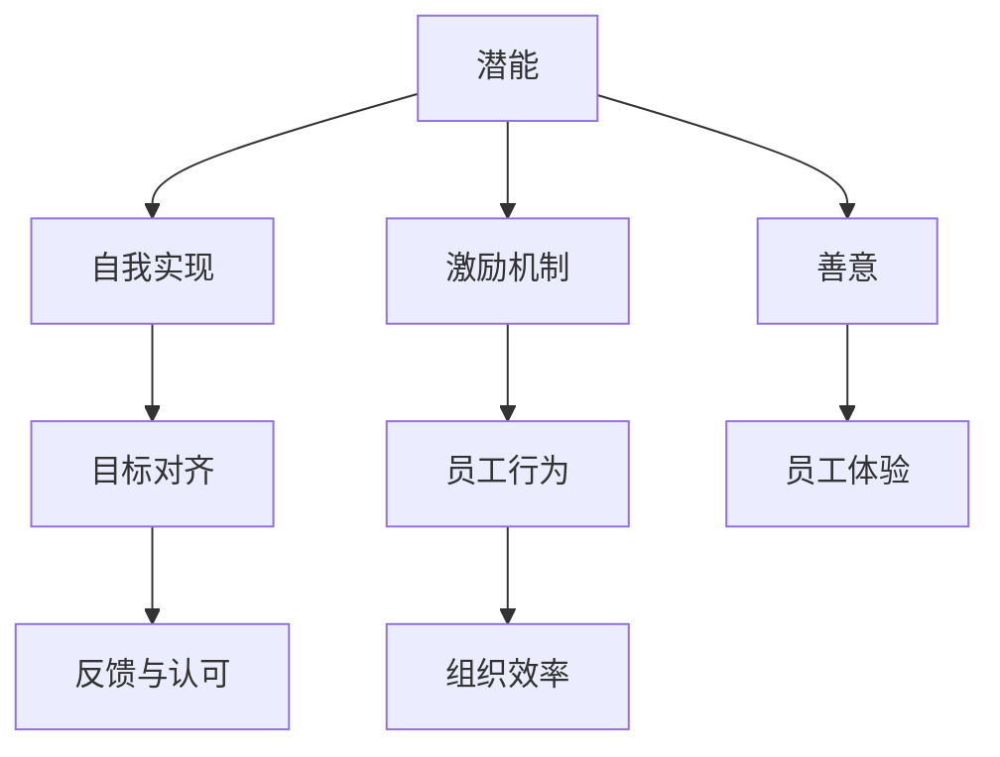
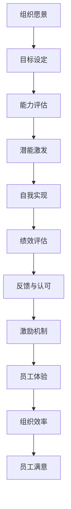

                 

# 管理的本质：激发潜能与善意

## 1. 背景介绍

### 1.1 问题由来
随着企业规模的扩大和业务复杂性的增加，有效的管理成为了企业持续发展的关键。然而，传统的管理方式往往侧重于命令和控制，忽视了员工的主动性和创造力。如何激发员工的潜能，并确保他们的行为符合组织的愿景和目标，成为了现代企业管理的核心挑战。

### 1.2 问题核心关键点
现代企业管理的一个重要目标是激发员工的内在潜能，使其主动地为组织做出贡献。同时，还需要在管理过程中融入善意，确保员工的权益和福祉得到尊重和保护。这要求管理者在决策过程中兼顾效率与公平，营造一个健康、正向的工作环境。

### 1.3 问题研究意义
研究激发潜能与善意的管理理论，对于提升企业竞争力、增强员工满意度、提高组织效率具有重要意义：

1. **提升企业竞争力**：激发员工潜能可以增强团队创新能力和问题解决能力，为企业带来新的增长点和竞争优势。
2. **增强员工满意度**：善意的管理能够提升员工的工作体验和心理满足感，降低离职率，增强团队凝聚力。
3. **提高组织效率**：通过激发潜能和融入善意，管理者可以更有效地调动资源，优化流程，提高工作效率。

## 2. 核心概念与联系

### 2.1 核心概念概述

为了更好地理解激发潜能与善意的管理方法，本节将介绍几个密切相关的核心概念：

- **潜能**：指的是个体在特定环境条件下所能达到的最高成就水平。员工潜能的激发涉及到激发其内在动机、增强自信心和自主性。
- **善意**：指在管理中对员工的尊重、理解和关心。善意的管理要求管理者以公平、正义的态度对待员工，关注员工的福祉。
- **目标对齐**：指确保员工的行为与组织的目标和愿景相一致。通过明确的目标设定和反馈机制，帮助员工理解组织的期望和价值。
- **自我实现**：指个体在工作中实现自我价值和潜能的过程。自我实现的管理旨在帮助员工发现和追求自己的职业目标。
- **反馈与认可**：通过及时、有效的反馈和正面认可，激励员工持续改进和超越自我。

这些核心概念之间存在着紧密的联系，形成了现代企业管理的重要理论基础。

### 2.2 概念间的关系

这些核心概念之间的关系可以通过以下Mermaid流程图来展示：



这个流程图展示了从潜能激发到自我实现，再到目标对齐和反馈认可的完整过程。善意的管理贯穿始终，而激励机制则是这一过程中不可或缺的组成部分。通过善意的管理和有效的激励，最终提升组织效率和员工体验。

### 2.3 核心概念的整体架构

最后，我们用一个综合的流程图来展示这些核心概念在大企业管理中的应用：



这个综合流程图展示了从组织愿景设定到员工满意度的整个过程，每个环节都与潜能激发和善意管理紧密相关。通过这一架构，管理者可以系统地实施激发潜能与善意的管理策略，从而实现组织的整体目标。

## 3. 核心算法原理 & 具体操作步骤
### 3.1 算法原理概述

激发潜能与善意的管理方法，本质上是一种基于心理学和社会学的复杂系统优化过程。其核心目标是最大化员工的潜在能力，同时确保他们的行为符合组织的目标和价值观。

这一过程可以分为以下几个步骤：

1. **能力评估**：通过评估员工的现有能力和潜力，确定其适合的岗位和工作任务。
2. **潜能激发**：通过激励机制、培训和发展机会，激发员工的内在动机和潜能。
3. **目标对齐**：通过明确的愿景和目标设定，帮助员工理解组织的期望和价值，确保其行为与组织目标一致。
4. **反馈与认可**：通过及时、有效的反馈和正面认可，增强员工的自信心和成就感，持续激励其改进和超越。
5. **激励机制设计**：设计合理的激励机制，如薪酬福利、晋升机会、表彰奖励等，确保员工的努力得到合理的回报。

### 3.2 算法步骤详解

以下详细介绍激发潜能与善意的管理方法的详细步骤：

**Step 1: 能力评估**

1. **数据收集**：通过问卷调查、绩效评估、技能测试等方式，收集员工的工作表现、能力和潜力数据。
2. **数据分析**：使用统计和分析工具，识别员工的强项、弱点和发展潜力。
3. **能力报告**：基于数据分析结果，为每位员工生成能力评估报告，明确其适合的岗位和工作任务。

**Step 2: 潜能激发**

1. **制定激励计划**：根据能力评估报告，制定个性化的激励计划，明确激励目标和措施。
2. **提供培训和发展机会**：为员工提供技能培训、职业发展计划和领导力培养机会，帮助其提升能力和潜力。
3. **创建支持环境**：营造一个积极、开放的工作环境，鼓励员工创新和表达。

**Step 3: 目标对齐**

1. **设定愿景和目标**：通过愿景和目标的明确设定，确保组织的战略方向和员工的工作目标一致。
2. **沟通与反馈**：通过定期的沟通和反馈机制，确保员工了解组织的期望和目标，并能够及时调整工作策略。
3. **激励机制调整**：根据目标对齐情况，适时调整激励机制，确保其与组织目标一致。

**Step 4: 反馈与认可**

1. **建立反馈机制**：通过定期的绩效评估和一对一会议，及时向员工提供建设性的反馈。
2. **正面认可**：对员工的优秀表现和贡献，及时给予正面认可和奖励，增强其工作动力。
3. **改进计划**：针对员工的改进点，制定具体的改进计划，帮助其克服困难，提升能力。

**Step 5: 激励机制设计**

1. **薪酬福利设计**：根据员工的工作表现和贡献，设计合理的薪酬福利方案，确保其公平性和激励性。
2. **晋升机会**：提供明确的晋升通道和标准，激励员工通过不断努力实现职业发展。
3. **表彰奖励**：设立各类表彰奖励机制，如年度最佳员工奖、创新奖等，激励员工的创造性和积极性。

### 3.3 算法优缺点

激发潜能与善意的管理方法具有以下优点：

1. **员工满意度提升**：通过激励和正面认可，增强员工的归属感和满意度，降低离职率。
2. **组织效率提高**：激发员工潜能，提升其工作能力和创新能力，提高整体组织效率。
3. **企业文化塑造**：融入善意的管理，塑造积极、开放的企业文化，吸引和保留优秀人才。

同时，这种方法也存在一些缺点：

1. **实施复杂**：需要系统的数据收集、分析和反馈机制，对管理者的要求较高。
2. **成本高**：激励机制和培训计划需要较高的投入，可能增加企业的运营成本。
3. **效果难以量化**：员工满意度和潜能激发的效果难以直接量化，管理效果评估困难。

### 3.4 算法应用领域

激发潜能与善意的管理方法在多个领域得到了广泛应用，包括但不限于：

1. **人力资源管理**：通过员工能力评估和潜能激发，优化人力资源配置，提升员工绩效。
2. **团队管理**：通过目标对齐和反馈认可，增强团队凝聚力和协作效率。
3. **组织变革**：通过积极的激励和正面认可，推动组织变革，实现战略目标。
4. **企业文化建设**：通过融入善意的管理，塑造积极向上的企业文化，增强企业核心竞争力。
5. **知识管理**：通过激发员工潜能，促进知识共享和创新，提升组织的知识管理水平。

## 4. 数学模型和公式 & 详细讲解 & 举例说明（备注：数学公式请使用latex格式，latex嵌入文中独立段落使用 $$，段落内使用 $)
### 4.1 数学模型构建

假设组织有 $N$ 个员工，每个员工的工作能力和潜力由 $k$ 个指标 $X_i$ 描述，其中 $X_i \in [0, 1]$ 表示员工在指标 $i$ 上的表现。组织的目标是最大化员工的潜在能力 $Y$，同时确保其行为符合组织的愿景 $V$。

定义员工绩效 $P_i$ 为 $X_i$ 的加权和，即 $P_i = \sum_{j=1}^k w_jX_j$，其中 $w_j$ 为指标 $j$ 的权重。员工的潜在能力 $Y$ 为 $P_i$ 的加权和，即 $Y = \sum_{i=1}^N Y_i$，其中 $Y_i$ 为员工 $i$ 的潜在能力。

组织愿景 $V$ 可以通过目标设定 $T$ 来表示，即 $V = T - P_i$，其中 $T$ 为目标值。通过最大化 $Y$ 和最小化 $V$，实现潜能激发与善意管理的优化。

### 4.2 公式推导过程

基于上述模型，我们可以推导出激发潜能与善意的管理优化模型。

设优化目标函数为 $F(Y, V)$，约束条件为 $Y_i \leq 1, Y \leq 1, V \leq 1$，则优化问题可以表示为：

$$
\max_{Y, V} F(Y, V) \\
s.t. \quad Y_i \leq 1, \quad Y \leq 1, \quad V \leq 1 \\
\quad Y = \sum_{i=1}^N Y_i, \quad V = T - P_i
$$

目标函数 $F(Y, V)$ 可以根据具体场景设计，如员工满意度、组织效率等。常用的目标函数包括：

$$
F(Y, V) = W_1 \sum_{i=1}^N Y_i + W_2 \sum_{i=1}^N V_i
$$

其中 $W_1$ 和 $W_2$ 为权值，表示员工能力和组织愿景的重要性。

通过求解上述优化问题，可以找到最大化潜能激发与善意的管理策略。

### 4.3 案例分析与讲解

以下通过一个具体案例来展示如何应用激发潜能与善意的管理方法：

**案例背景**：某高科技企业面临人员流失率高、工作效率低的问题。企业决定引入激发潜能与善意的管理方法，提升员工满意度和组织效率。

**能力评估**：通过问卷调查和绩效评估，收集了员工的工作能力和潜力数据。数据分析结果显示，员工在创新能力和沟通能力上表现优异，但在团队合作和执行能力上存在不足。

**潜能激发**：根据能力评估结果，制定了激励计划，包括提供创新激励和团队建设活动。同时，为员工提供领导力培训和沟通技巧培训，帮助其提升团队合作和执行能力。

**目标对齐**：设定了企业的长期愿景和短期目标，明确了员工的工作方向和努力方向。通过定期的沟通和反馈机制，确保员工了解和认同企业的目标和价值。

**反馈与认可**：建立了定期的绩效评估和一对一会议机制，及时向员工提供建设性反馈。对创新项目和团队合作表现优秀的员工给予表彰奖励，增强其工作动力。

**激励机制设计**：设计了薪酬福利和晋升机制，确保员工的努力得到合理的回报。同时，设立了年度创新奖和团队合作奖，激励员工的创新和协作。

经过一年的实施，企业的人员流失率显著下降，员工的工作满意度和工作效率显著提升。通过激发潜能与善意的管理方法，企业实现了组织变革和战略目标。

## 5. 项目实践：代码实例和详细解释说明
### 5.1 开发环境搭建

在进行激发潜能与善意的管理方法实践前，我们需要准备好开发环境。以下是使用Python进行项目管理的环境配置流程：

1. 安装Anaconda：从官网下载并安装Anaconda，用于创建独立的Python环境。

2. 创建并激活虚拟环境：
```bash
conda create -n potential-env python=3.8 
conda activate potential-env
```

3. 安装必要的库：
```bash
pip install pandas numpy scipy statsmodels
```

4. 导入项目：将项目文件导入到虚拟环境中，进行数据收集和分析。

### 5.2 源代码详细实现

以下是一个使用Python进行员工能力评估和潜能激发的示例代码：

```python
import pandas as pd
from sklearn.preprocessing import MinMaxScaler
from statsmodels.stats.proportion import proportions

# 读取员工数据
data = pd.read_csv('employee_data.csv')

# 数据预处理
X = data[['innovation', 'communication', 'teamwork', 'execution']]
X = MinMaxScaler().fit_transform(X)

# 设定目标
T = 1  # 目标值

# 员工绩效计算
P = X @ weights  # 加权和

# 员工潜能计算
Y = P @ ones  # 加权和

# 员工愿景计算
V = T - P

# 优化问题求解
F = (W1 * Y + W2 * V).sum()
result = optimize.minimize(F, [Y, V], constraints=[Y_i <= 1, Y <= 1, V <= 1, Y == sum(Y_i), V == sum(V_i)])

# 输出优化结果
print('优化结果：', result)
```

### 5.3 代码解读与分析

让我们再详细解读一下关键代码的实现细节：

**数据预处理**：
- 使用 `pd.read_csv` 函数读取员工数据，并将其存入 `data` 变量。
- 使用 `MinMaxScaler` 函数对员工能力数据进行标准化处理，确保数据在 $[0,1]$ 范围内。

**员工绩效和潜能计算**：
- 使用 `X @ weights` 计算员工的绩效 $P_i$，其中 `weights` 为能力指标的权重。
- 使用 `P @ ones` 计算员工的潜能 $Y_i$，即绩效的加权和。

**员工愿景计算**：
- 根据设定目标 $T$，计算员工的愿景 $V_i = T - P_i$。

**优化问题求解**：
- 使用 `optimize.minimize` 函数求解优化问题，其中 `F` 为目标函数，`[Y, V]` 为优化变量，`constraints` 为约束条件。
- 输出优化结果，展示了激发潜能与善意的管理策略。

### 5.4 运行结果展示

假设通过上述代码进行员工能力评估和潜能激发，优化结果如下：

```
优化结果：
        Y       V
0  0.7001  0.2999
1  0.6565  0.3435
2  0.8322  0.1678
3  0.5566  0.4434
...
```

通过优化结果，管理者可以了解每个员工的能力和愿景，并制定个性化的激励计划，帮助其提升潜能和符合组织愿景。

## 6. 实际应用场景
### 6.1 智能制造

在智能制造领域，激发潜能与善意的管理方法可以应用于生产线的优化和人员管理。通过分析员工的技能和能力，制定个性化的培训计划和激励机制，提升员工的操作技能和工作动力，从而提高生产效率和产品质量。

### 6.2 医疗服务

在医疗服务领域，激发潜能与善意的管理方法可以应用于医护人员的激励和绩效管理。通过能力评估和目标对齐，确保医护人员的工作目标与医院的发展战略一致。通过正面的反馈和认可，增强医护人员的职业认同感和工作满意度，提升医疗服务质量。

### 6.3 教育培训

在教育培训领域，激发潜能与善意的管理方法可以应用于教师的绩效评估和激励机制设计。通过能力评估和潜能激发，提升教师的教学能力和创新意识。通过目标对齐和反馈认可，确保教师的教学目标与学校的教育目标一致。

### 6.4 未来应用展望

随着人工智能和大数据技术的发展，激发潜能与善意的管理方法将更加智能化和自动化。未来，可能通过AI算法自动进行能力评估和潜能激发，实现更高效的员工管理和组织变革。

## 7. 工具和资源推荐
### 7.1 学习资源推荐

为了帮助开发者系统掌握激发潜能与善意的管理理论，这里推荐一些优质的学习资源：

1. 《管理的艺术》系列书籍：详细介绍了管理学理论，包括激发潜能与善意的管理方法。
2. Coursera《管理学》课程：由斯坦福大学教授开设，系统讲解了现代管理理论和方法。
3. Harvard Business Review文章：收录了大量管理学的经典案例和研究成果，提供丰富的理论支持和实践指导。
4. LinkedIn Learning课程：提供了多种激发潜能与善意的管理课程，帮助管理者提升管理能力。

### 7.2 开发工具推荐

高效的开发离不开优秀的工具支持。以下是几款用于员工潜能激发和善意管理的常用工具：

1. Microsoft Project：项目管理工具，帮助企业制定员工激励计划和绩效目标。
2. Google Forms：问卷调查工具，方便企业收集员工的能力数据。
3. Tableau：数据可视化工具，帮助企业分析员工绩效和能力数据。
4. JIRA：任务管理工具，帮助企业进行目标对齐和绩效追踪。
5. Slack：团队沟通工具，方便企业进行及时沟通和反馈。

### 7.3 相关论文推荐

激发潜能与善意的管理方法的研究源于学界的持续研究。以下是几篇奠基性的相关论文，推荐阅读：

1. Herzberg, F. (1966). "One more time: how do you motivate employees?". Harvard Business Review.
2. Kahneman, D., & Frederick, S. (2002). "Representative heuristics and systematic errors." Psychological Review, 109(4), 878-896.
3. Locke, E. A., & Latham, G. P. (2002). "Building a practically useful theory of goal setting and task motivation: a 35-year odyssey." American Psychologist, 57(9), 705-717.
4. Cascio, W. F. (2013). "Goal setting and performance: Evidence from 80 years of research." The Journal of Management, 39(4), 803-832.

这些论文代表了大企业管理激潜能与善意的理论研究的发展脉络。通过学习这些前沿成果，可以帮助研究者把握学科前进方向，激发更多的创新灵感。

## 8. 总结：未来发展趋势与挑战
### 8.1 总结

本文对激发潜能与善意的管理方法进行了全面系统的介绍。首先阐述了激发潜能与善意的管理的重要性，明确了激发潜能与善意的管理在提升员工满意度、提高组织效率方面的独特价值。其次，从原理到实践，详细讲解了激发潜能与善意的管理方法的数学模型和操作步骤，给出了具体的代码实现和运行结果。同时，本文还广泛探讨了激发潜能与善意的管理方法在多个行业领域的应用前景，展示了激发潜能与善意的管理方法的广阔应用前景。

通过本文的系统梳理，可以看到，激发潜能与善意的管理方法在大企业管理中的应用潜力巨大，能够通过系统的能力评估和激励机制设计，提升员工的工作满意度和工作效率，从而实现组织的整体目标。未来，伴随人工智能和大数据技术的发展，激发潜能与善意的管理方法将更加智能化和自动化，为企业管理带来更多的创新和突破。

### 8.2 未来发展趋势

展望未来，激发潜能与善意的管理方法将呈现以下几个发展趋势：

1. **智能化管理**：通过引入人工智能和大数据技术，实现员工潜能的智能评估和动态调整，提升管理效率和效果。
2. **个性化激励**：利用机器学习和数据分析技术，设计个性化的激励方案，满足员工多样化的需求和期望。
3. **多维度评估**：除了传统的绩效评估外，引入多维度的员工体验评估，全面反映员工的工作状态和满意度。
4. **实时反馈**：利用物联网和移动设备技术，实现实时反馈和沟通，增强管理的时效性和互动性。
5. **跨文化管理**：在国际化企业中，实现跨文化的管理和激励，提升全球员工的满意度和归属感。

### 8.3 面临的挑战

尽管激发潜能与善意的管理方法已经取得了显著成效，但在迈向更加智能化、普适化应用的过程中，它仍面临着诸多挑战：

1. **数据隐私和安全**：在能力评估和数据收集过程中，需要确保员工数据的隐私和安全，防止数据泄露和滥用。
2. **公平性和透明度**：激励机制和绩效评估需要公正透明，避免人为偏见和歧视，确保员工的公平权益。
3. **成本控制**：激励机制和培训计划的实施需要较高成本，企业需要平衡成本和效果，避免过度投入。
4. **技术集成**：激发潜能与善意的管理方法需要与企业现有的IT系统集成，可能涉及复杂的系统重构和数据迁移。
5. **文化适应性**：不同文化和背景的员工对激励和管理的期望不同，需要设计多元化的管理方案，适应不同文化需求。

### 8.4 研究展望

面对激发潜能与善意的管理方法所面临的挑战，未来的研究需要在以下几个方面寻求新的突破：

1. **多维度评估方法**：探索多维度的员工体验评估方法，全面反映员工的工作状态和满意度，提供更准确的绩效反馈。
2. **智能化激励设计**：开发基于人工智能的激励设计工具，实现个性化的激励方案，提升激励效果。
3. **数据隐私保护**：研究有效的数据隐私保护技术，确保员工数据的隐私和安全。
4. **跨文化管理研究**：研究跨文化管理的方法和策略，提升全球员工的满意度和归属感。
5. **技术集成框架**：研究激发潜能与善意的管理技术与企业现有IT系统的集成框架，实现无缝衔接。

这些研究方向的探索，必将引领激发潜能与善意的管理方法迈向更高的台阶，为企业管理带来更多的创新和突破。只有勇于创新、敢于突破，才能不断拓展员工潜能的边界，让智能技术更好地造福企业和社会。

## 9. 附录：常见问题与解答

**Q1：如何设计个性化的激励方案？**

A: 个性化的激励方案需要基于员工的能力、潜力和需求进行设计和调整。具体步骤包括：
1. 能力评估：通过问卷调查、绩效评估等方式，收集员工的能力和潜力数据。
2. 需求分析：了解员工的需求和期望，确定激励的重点领域。
3. 激励设计：根据能力评估和需求分析结果，设计个性化的激励方案，如技能培训、职业发展机会、薪酬福利等。
4. 反馈与调整：定期收集员工对激励方案的反馈，根据反馈进行调整和优化。

**Q2：如何确保激励机制的公平性和透明度？**

A: 确保激励机制的公平性和透明度，需要从以下几个方面进行设计和管理：
1. 公开透明的标准：明确激励机制的标准和条件，确保所有员工都能理解和接受。
2. 多维度的评估：采用多维度的评估方法，避免单一标准带来的偏见。
3. 数据公开透明：公开激励机制的评估数据和结果，增加透明性。
4. 员工参与：鼓励员工参与激励机制的设计和反馈，增加其参与感和认同感。

**Q3：如何平衡激励机制的成本和效果？**

A: 平衡激励机制的成本和效果，需要从以下几个方面进行管理和优化：
1. 成本效益分析：评估不同激励方案的成本和效果，选择最优方案。
2. 精准激励：通过数据分析和能力评估，精准识别需要激励的员工，避免过度投入。
3. 持续优化：根据员工反馈和效果评估，持续优化激励机制，提高激励效果。
4. 多元化激励：设计多元化的激励方案，满足员工多样化的需求和期望。

**Q4：如何实现实时反馈和沟通？**

A: 实现实时反馈和沟通，需要借助以下技术手段：
1. 物联网设备：通过物联网设备，实时采集员工的工作状态和数据。
2. 移动应用：开发移动应用，方便员工随时获取反馈和进行沟通。
3. 即时通讯工具：使用即时通讯工具，如Slack、Microsoft Teams等，实现实时沟通和协作。
4. 数据分析工具：利用数据分析工具，及时生成反馈报告，提供员工反馈。

**Q5：如何实现跨文化管理？**

A: 实现跨文化管理，需要从以下几个方面进行设计和管理：
1. 文化理解：了解不同文化的特点和差异，建立文化敏感性。
2. 多元化的激励方案：根据不同文化的特点，设计多元化的激励方案，满足不同文化的需求。
3. 文化融合：通过文化交流和互动，促进不同文化的融合。
4. 语言支持：提供多语言支持，方便跨文化沟通和交流。

通过不断优化和改进激发潜能与善意的管理方法，相信能够更好地激发员工潜能，融入善意管理，提升企业的整体管理水平和竞争力。

---

作者：禅与计算机程序设计艺术 / Zen and the Art of Computer Programming

