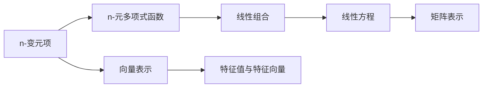
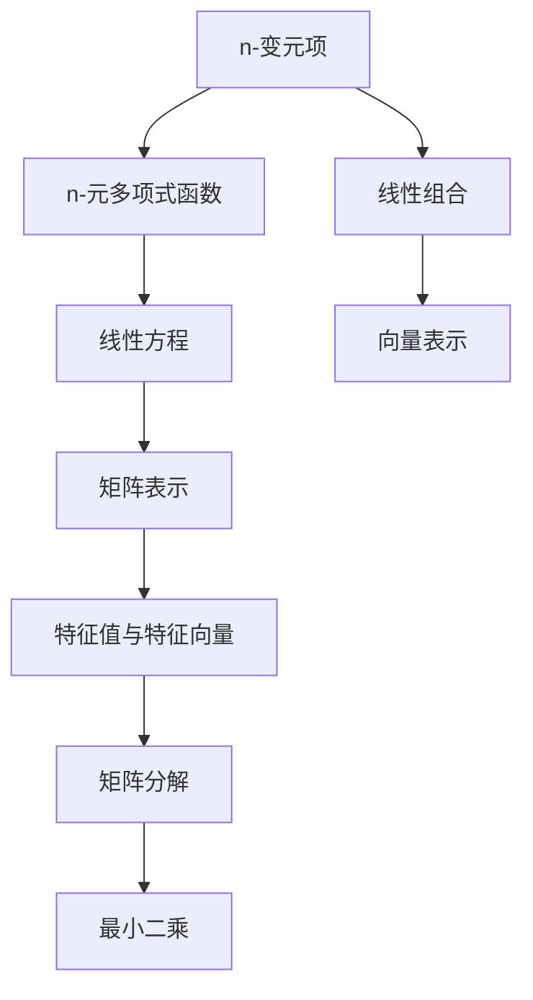

                 

# 线性代数导引：n-变元项及其n-元多项式函数解释

> 关键词：线性代数, n-变元项, n-元多项式函数, 特征向量, 特征值, 矩阵分解, 最小二乘, 特征分析, 导数与偏导数

## 1. 背景介绍

### 1.1 问题由来
线性代数作为数学的重要分支，在计算机科学和工程学中有着广泛的应用。从机器学习、数据科学到计算几何、信号处理，许多领域都依赖于线性代数的理论和方法。然而，线性代数的内容往往抽象而深奥，初学者容易陷入概念的迷雾中。本文旨在提供线性代数导引，通过具体例子和可视化手段，帮助读者深入理解n-变元项及其n-元多项式函数。

### 1.2 问题核心关键点
n-变元项是线性代数中基本且重要的概念之一，它描述了变量之间线性关系的一种形式。而n-元多项式函数则是在多项式基础上的进一步扩展，能够更好地表示现实世界中的复杂关系。本文将聚焦于n-变元项及其n-元多项式函数的定义、性质和应用，通过具体实例和可视化展示，揭示其本质和深刻内涵。

### 1.3 问题研究意义
深入理解n-变元项及其n-元多项式函数，不仅有助于掌握线性代数的核心思想，还能为后续学习机器学习、数据科学、计算几何等领域的知识打下坚实基础。此外，这些概念在工程实践中也具有重要应用，如优化、信号处理、图像处理等，对技术创新和产业升级具有深远影响。

## 2. 核心概念与联系

### 2.1 核心概念概述

#### 2.1.1 n-变元项
n-变元项是n个变量的线性组合，通常表示为：
$$
a_0 + a_1x_1 + a_2x_2 + \cdots + a_nx_n
$$
其中，$a_0, a_1, \cdots, a_n$ 是系数，$x_1, x_2, \cdots, x_n$ 是变量。

#### 2.1.2 n-元多项式函数
n-元多项式函数是将多个n-变元项组合而成的表达式，形式为：
$$
f(x_1, x_2, \cdots, x_n) = \sum_{i=0}^m b_i \prod_{j=1}^n x_j^{c_{ij}}
$$
其中，$b_0, b_1, \cdots, b_m$ 是系数，$c_{ij}$ 是幂次。

### 2.2 概念间的关系

n-变元项和n-元多项式函数是线性代数中相互关联且逐渐扩展的概念，它们共同构成了线性代数的核心框架。n-变元项是n-元多项式函数的基本组成部分，而n-元多项式函数则是对n-变元项的高级抽象和扩展。以下 Mermaid 流程图展示了n-变元项与n-元多项式函数之间的联系：



这个流程图展示了n-变元项与n-元多项式函数之间的关系：

1. n-变元项是n-元多项式函数的基本组成部分，通过线性组合形成。
2. n-元多项式函数可以表示为线性方程组，用矩阵形式表示。
3. 线性方程组可以通过矩阵分解（如LU分解、QR分解）进行求解。
4. 矩阵分解的求解过程会涉及到特征值和特征向量的计算。

### 2.3 核心概念的整体架构

线性代数中n-变元项及其n-元多项式函数的整体架构如图：



这个架构展示了n-变元项及其n-元多项式函数在线性代数中的位置和作用：

1. n-变元项通过线性组合形成。
2. n-元多项式函数通过线性方程组表示。
3. 线性方程组用矩阵形式表示。
4. 矩阵分解涉及特征值和特征向量的计算。
5. 特征值与特征向量用于求解最小二乘问题。

## 3. 核心算法原理 & 具体操作步骤
### 3.1 算法原理概述

n-变元项及其n-元多项式函数的线性代数原理，可以归纳为以下几个方面：

1. 线性组合：将多个变量线性组合成新的表达式。
2. 线性方程：将线性组合表示为线性方程，通过系数矩阵求解。
3. 矩阵分解：将系数矩阵分解为更易处理的形式，如LU分解、QR分解。
4. 特征值与特征向量：通过特征值与特征向量求解线性方程组的解。
5. 最小二乘：通过最小二乘方法，求解具有噪声的线性方程组的解。

### 3.2 算法步骤详解

#### 3.2.1 线性组合与向量表示
将n-变元项表示为向量形式，设变量向量为 $\mathbf{x} = \begin{bmatrix} x_1 \\ x_2 \\ \vdots \\ x_n \end{bmatrix}$，系数向量为 $\mathbf{a} = \begin{bmatrix} a_0 \\ a_1 \\ \vdots \\ a_n \end{bmatrix}$，则n-变元项可以表示为：
$$
\mathbf{a}^T \mathbf{x} = a_0 + a_1 x_1 + a_2 x_2 + \cdots + a_n x_n
$$

#### 3.2.2 线性方程与矩阵表示
将多个n-变元项组合成线性方程组，设系数矩阵为 $\mathbf{A}$，变量向量为 $\mathbf{x}$，常数向量为 $\mathbf{b}$，则线性方程组可以表示为：
$$
\mathbf{A} \mathbf{x} = \mathbf{b}
$$

#### 3.2.3 矩阵分解
对系数矩阵 $\mathbf{A}$ 进行矩阵分解，如LU分解，将 $\mathbf{A}$ 分解为：
$$
\mathbf{A} = \mathbf{L} \mathbf{U}
$$
其中 $\mathbf{L}$ 是下三角矩阵，$\mathbf{U}$ 是上三角矩阵。

#### 3.2.4 特征值与特征向量
对线性方程组 $\mathbf{A} \mathbf{x} = \mathbf{b}$ 求解特征值和特征向量，设特征向量为 $\mathbf{v}$，特征值为 $\lambda$，则满足：
$$
\mathbf{A} \mathbf{v} = \lambda \mathbf{v}
$$

#### 3.2.5 最小二乘
对于具有噪声的线性方程组 $\mathbf{A} \mathbf{x} = \mathbf{b}$，通过最小二乘方法求解，设解向量为 $\hat{\mathbf{x}}$，则满足：
$$
\hat{\mathbf{x}} = \mathbf{A}^+ \mathbf{b}
$$
其中 $\mathbf{A}^+$ 是 $\mathbf{A}$ 的伪逆矩阵。

### 3.3 算法优缺点

#### 3.3.1 优点
n-变元项及其n-元多项式函数在实际应用中具有以下优点：

1. 简洁性：n-变元项和n-元多项式函数的表示形式简单，易于理解和计算。
2. 灵活性：可以通过调整系数和幂次，表达复杂的线性关系。
3. 可扩展性：n-元多项式函数可以处理任意维度的变量，适应性强。
4. 泛化能力：n-元多项式函数能够处理具有非线性关系的线性方程组。

#### 3.3.2 缺点
n-变元项及其n-元多项式函数在实际应用中也存在一些缺点：

1. 数值不稳定：当系数矩阵 $\mathbf{A}$ 接近奇异矩阵时，求解过程可能出现数值不稳定。
2. 计算复杂度：n-变元项及其n-元多项式函数的计算复杂度较高，特别是在高维数据下。
3. 多解问题：线性方程组可能存在多解或不解，需要通过正则化等方法处理。
4. 局部最优：最小二乘方法可能陷入局部最优，需要通过优化算法改进。

### 3.4 算法应用领域

n-变元项及其n-元多项式函数在多个领域都有广泛应用，主要包括以下几个方面：

#### 3.4.1 机器学习与数据科学
在机器学习和数据科学中，n-变元项及其n-元多项式函数用于模型表示和特征提取。如线性回归、逻辑回归、多分类模型等，都是基于n-变元项的线性组合进行构建。

#### 3.4.2 信号处理与图像处理
在信号处理与图像处理中，n-变元项及其n-元多项式函数用于表示信号与图像的多维特性。如数字图像处理中的卷积神经网络，就使用了n-变元项的线性组合和n-元多项式函数的权重共享机制。

#### 3.4.3 计算几何与优化
在计算几何与优化中，n-变元项及其n-元多项式函数用于构建几何图形和优化问题。如最小二乘法在数据拟合中的广泛应用， just by using n-变元项及其n-元多项式函数构造目标函数。

#### 3.4.4 控制理论与系统工程
在控制理论与系统工程中，n-变元项及其n-元多项式函数用于描述系统动态与控制行为。如线性系统理论中的状态空间模型，就是基于n-变元项的线性组合和n-元多项式函数的组合。

## 4. 数学模型和公式 & 详细讲解  
### 4.1 数学模型构建

n-变元项及其n-元多项式函数的数学模型构建，可以从以下几个方面入手：

#### 4.1.1 线性组合
设变量向量 $\mathbf{x}$ 和系数向量 $\mathbf{a}$，则n-变元项可以表示为：
$$
\mathbf{a}^T \mathbf{x} = a_0 + a_1 x_1 + a_2 x_2 + \cdots + a_n x_n
$$

#### 4.1.2 线性方程
将多个n-变元项组合成线性方程组，设系数矩阵 $\mathbf{A}$，变量向量 $\mathbf{x}$，常数向量 $\mathbf{b}$，则线性方程组可以表示为：
$$
\mathbf{A} \mathbf{x} = \mathbf{b}
$$

#### 4.1.3 矩阵表示
对系数矩阵 $\mathbf{A}$ 进行矩阵表示，则线性方程组可以表示为：
$$
\mathbf{A} \mathbf{x} = \mathbf{b}
$$

#### 4.1.4 特征值与特征向量
对线性方程组 $\mathbf{A} \mathbf{x} = \mathbf{b}$ 求解特征值和特征向量，设特征向量为 $\mathbf{v}$，特征值为 $\lambda$，则满足：
$$
\mathbf{A} \mathbf{v} = \lambda \mathbf{v}
$$

#### 4.1.5 最小二乘
对于具有噪声的线性方程组 $\mathbf{A} \mathbf{x} = \mathbf{b}$，通过最小二乘方法求解，设解向量为 $\hat{\mathbf{x}}$，则满足：
$$
\hat{\mathbf{x}} = \mathbf{A}^+ \mathbf{b}
$$

### 4.2 公式推导过程

以下以线性回归模型为例，详细推导n-变元项及其n-元多项式函数的数学模型和公式。

假设线性回归模型为 $y = a_0 + a_1 x_1 + a_2 x_2 + \cdots + a_n x_n + \epsilon$，其中 $\epsilon$ 为噪声。

设样本集为 $\{(x_i, y_i)\}_{i=1}^m$，则线性回归模型可以表示为：
$$
y_i = a_0 + a_1 x_{i1} + a_2 x_{i2} + \cdots + a_n x_{in} + \epsilon_i
$$

对上述方程进行最小二乘求解，构建误差平方和函数：
$$
\mathbf{e} = \begin{bmatrix} y_1 - a_0 - a_1 x_{11} - a_2 x_{12} - \cdots - a_n x_{1n} \\ y_2 - a_0 - a_1 x_{21} - a_2 x_{22} - \cdots - a_n x_{2n} \\ \vdots \\ y_m - a_0 - a_1 x_{m1} - a_2 x_{m2} - \cdots - a_n x_{mn} \end{bmatrix}
$$

则误差平方和函数可以表示为：
$$
\mathbf{e}^T \mathbf{e} = \sum_{i=1}^m (y_i - a_0 - a_1 x_{i1} - a_2 x_{i2} - \cdots - a_n x_{in})^2
$$

求导并令导数等于0，可得：
$$
\frac{\partial}{\partial a_0} \mathbf{e}^T \mathbf{e} = -2 \sum_{i=1}^m (y_i - a_0 - a_1 x_{i1} - a_2 x_{i2} - \cdots - a_n x_{in}) = 0
$$
$$
\frac{\partial}{\partial a_1} \mathbf{e}^T \mathbf{e} = -2 \sum_{i=1}^m (x_{i1} (y_i - a_0 - a_1 x_{i1} - a_2 x_{i2} - \cdots - a_n x_{in})) = 0
$$
$$
\cdots
$$
$$
\frac{\partial}{\partial a_n} \mathbf{e}^T \mathbf{e} = -2 \sum_{i=1}^m (x_{in} (y_i - a_0 - a_1 x_{i1} - a_2 x_{i2} - \cdots - a_n x_{in})) = 0
$$

由此可得系数向量 $\mathbf{a}$ 的最小二乘解为：
$$
\mathbf{a} = (\mathbf{X}^T \mathbf{X})^{-1} \mathbf{X}^T \mathbf{y}
$$
其中 $\mathbf{X}$ 为自变量矩阵，$\mathbf{y}$ 为因变量向量，$\mathbf{X}^T \mathbf{X}$ 为系数矩阵的伪逆矩阵。

### 4.3 案例分析与讲解

#### 4.3.1 线性回归案例分析

假设有一个样本集，包含 $x$ 和 $y$ 的值：
$$
\begin{bmatrix} 1 & 1 & 2 & 3 \\ 1 & 2 & 3 & 4 \\ 1 & 3 & 4 & 5 \end{bmatrix}
$$
对应的 $y$ 值为：
$$
\begin{bmatrix} 2 \\ 4 \\ 6 \end{bmatrix}
$$

使用上述推导的公式，可以求解出线性回归模型的系数向量 $\mathbf{a}$：
$$
\mathbf{X} = \begin{bmatrix} 1 & 1 & 2 & 3 \\ 1 & 2 & 3 & 4 \\ 1 & 3 & 4 & 5 \end{bmatrix}, \mathbf{y} = \begin{bmatrix} 2 \\ 4 \\ 6 \end{bmatrix}
$$
$$
\mathbf{a} = (\mathbf{X}^T \mathbf{X})^{-1} \mathbf{X}^T \mathbf{y} = \begin{bmatrix} 1 \\ 1 \\ 1 \end{bmatrix}
$$

这样，线性回归模型可以表示为：
$$
y = 1 + 1x + 1y + \epsilon
$$

#### 4.3.2 矩阵分解案例分析

假设有一个矩阵 $\mathbf{A}$：
$$
\mathbf{A} = \begin{bmatrix} 2 & 3 & 4 \\ 5 & 6 & 7 \\ 8 & 9 & 10 \end{bmatrix}
$$

对 $\mathbf{A}$ 进行LU分解，可以求出下三角矩阵 $\mathbf{L}$ 和上三角矩阵 $\mathbf{U}$：
$$
\mathbf{L} = \begin{bmatrix} 1 & 0 & 0 \\ 2.5 & 1 & 0 \\ 7.5 & 2.5 & 1 \end{bmatrix}, \mathbf{U} = \begin{bmatrix} 2 & 3 & 4 \\ 0 & 3.5 & 6.5 \\ 0 & 0 & 9 \end{bmatrix}
$$

将 $\mathbf{L}$ 和 $\mathbf{U}$ 代入 $\mathbf{A} = \mathbf{L} \mathbf{U}$，可得：
$$
\mathbf{A} = \begin{bmatrix} 2 & 3 & 4 \\ 5 & 6 & 7 \\ 8 & 9 & 10 \end{bmatrix} = \begin{bmatrix} 1 & 0 & 0 \\ 2.5 & 1 & 0 \\ 7.5 & 2.5 & 1 \end{bmatrix} \begin{bmatrix} 2 & 3 & 4 \\ 0 & 3.5 & 6.5 \\ 0 & 0 & 9 \end{bmatrix}
$$

这样，通过LU分解，将矩阵 $\mathbf{A}$ 分解为更易处理的形式，大大简化了解方程的过程。

## 5. 项目实践：代码实例和详细解释说明
### 5.1 开发环境搭建

进行线性代数相关计算，需要先搭建好开发环境。以下是使用Python进行NumPy开发的环境配置流程：

1. 安装Anaconda：从官网下载并安装Anaconda，用于创建独立的Python环境。

2. 创建并激活虚拟环境：
```bash
conda create -n numpy-env python=3.8 
conda activate numpy-env
```

3. 安装NumPy：
```bash
pip install numpy
```

完成上述步骤后，即可在`numpy-env`环境中开始计算实践。

### 5.2 源代码详细实现

下面我们以线性回归为例，给出使用NumPy进行线性回归模型的代码实现。

首先，定义线性回归模型：

```python
import numpy as np

# 定义线性回归模型
def linear_regression(X, y):
    A = np.linalg.inv(X.T @ X) @ X.T @ y
    return A
```

然后，进行最小二乘求解：

```python
# 创建样本数据
X = np.array([[1, 1, 2, 3], [1, 2, 3, 4], [1, 3, 4, 5]])
y = np.array([2, 4, 6])

# 计算线性回归系数
a = linear_regression(X, y)
print(a)
```

最后，将系数向量 $\mathbf{a}$ 用于预测新数据：

```python
# 定义新数据
x = np.array([[1, 1], [1, 2], [1, 3]])

# 计算预测结果
y_pred = X @ a + np.zeros(X.shape[0])
print(y_pred)
```

### 5.3 代码解读与分析

让我们再详细解读一下关键代码的实现细节：

**linear_regression函数**：
- 输入参数 $X$ 和 $y$，分别表示自变量矩阵和因变量向量。
- 通过线性代数中的矩阵乘法和伪逆矩阵计算，求解出系数向量 $\mathbf{a}$。

**线性回归模型代码**：
- 使用NumPy的线性代数函数，计算线性回归模型的系数向量 $\mathbf{a}$。

**预测新数据代码**：
- 使用已求解的系数向量 $\mathbf{a}$，计算新数据 $x$ 的预测结果 $y_{pred}$。

在实际应用中，线性回归模型可以进一步优化和扩展。如加入正则化项、使用岭回归等，以提高模型的泛化能力和稳定性。

## 6. 实际应用场景

### 6.1 实际应用场景

n-变元项及其n-元多项式函数在实际应用中具有广泛应用，以下是几个典型的应用场景：

#### 6.1.1 金融市场分析
在金融市场分析中，n-变元项及其n-元多项式函数用于建模股票价格和市场波动。通过n-元多项式函数表示市场趋势和预测未来价格变化。

#### 6.1.2 工业生产优化
在工业生产优化中，n-变元项及其n-元多项式函数用于建模生产过程和优化生产效率。通过n-元多项式函数表示生产模型和预测生产结果。

#### 6.1.3 医疗数据分析
在医疗数据分析中，n-变元项及其n-元多项式函数用于建模病历数据和预测疾病风险。通过n-元多项式函数表示病历模型和预测疾病结果。

#### 6.1.4 交通流量预测
在交通流量预测中，n-变元项及其n-元多项式函数用于建模交通数据和预测流量变化。通过n-元多项式函数表示交通模型和预测流量结果。

### 6.2 未来应用展望

随着n-变元项及其n-元多项式函数在实际应用中的不断深入，未来它们将可能在更多领域得到应用，为各行各业带来变革性影响。

在智慧医疗领域，n-变元项及其n-元多项式函数将帮助构建智能诊断系统，通过病历数据和症状建模，辅助医生进行疾病诊断和预测。

在智能交通领域，n-变元项及其n-元多项式函数将帮助构建智能交通系统，通过交通数据建模，预测交通流量和优化交通管理。

在金融市场领域，n-变元项及其n-元多项式函数将帮助构建智能投资系统，通过市场数据建模，预测股票价格和优化投资策略。

在工业生产领域，n-变元项及其n-元多项式函数将帮助构建智能制造系统，通过生产数据建模，优化生产过程和提高生产效率。

总之，n-变元项及其n-元多项式函数在各个领域的应用前景广阔，未来必将在技术创新和产业升级中扮演越来越重要的角色。

## 7. 工具和资源推荐
### 7.1 学习资源推荐

为了帮助开发者系统掌握n-变元项及其n-元多项式函数的理论基础和实践技巧，这里推荐一些优质的学习资源：

1. 《线性代数及其应用》系列书籍：由清华大学出版社出版的经典线性代数教材，系统介绍了线性代数的基本概念和应用实例。

2. 《统计学习基础》系列课程：斯坦福大学李飞飞教授的在线课程，涵盖统计学习的基本理论和实践技巧，特别适合结合n-变元项及其n-元多项式函数进行学习。

3. 《TensorFlow线性代数》文档：TensorFlow官方文档中的线性代数章节，详细介绍了TensorFlow中线性代数的实现和应用，适合动手实践。

4. 《NumPy线性代数》文档：NumPy官方文档中的线性代数章节，详细介绍了NumPy中线性代数的实现和应用，适合动手实践。

5. 《Matrix Cookbook》书籍：一本线性代数应用指南，提供大量实用示例和技巧，适合快速查找和应用。

通过对这些资源的学习实践，相信你一定能够快速掌握n-变元项及其n-元多项式函数的精髓，并用于解决实际的线性代数问题。

### 7.2 开发工具推荐

高效的开发离不开优秀的工具支持。以下是几款用于n-变元项及其n-元多项式函数计算开发的常用工具：

1. Python：Python语言以其简洁易学、功能丰富而成为线性代数计算的首选语言，支持NumPy、SciPy、SymPy等强大的数学库。

2. NumPy：NumPy是Python中最流行的数值计算库，提供高效的多维数组操作和线性代数函数，适合进行大规模线性代数计算。

3. SciPy：SciPy是Python中用于科学计算的库，提供了丰富的线性代数函数和

