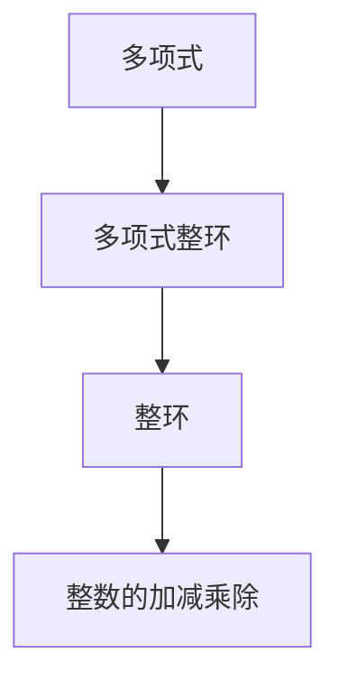

                 

# 线性代数导引：多项式整环

## 1. 背景介绍

### 1.1 问题由来
在数学和计算机科学中，多项式整环是一个重要的概念。整环是指一个包含1和自身加法的无零因子集合，而多项式整环则是指一组多项式，满足整环的性质。多项式整环的研究不仅在抽象代数中有着重要地位，在密码学、编码理论、计算机代数等领域也有着广泛应用。

### 1.2 问题核心关键点
多项式整环的核心是多项式的加减乘除操作，以及它们在整环中的特殊性质。主要研究点包括：
- 多项式的因式分解
- 多项式整环的代数基本定理
- 多项式的最大公因式
- 多项式整环的欧几里得算法

### 1.3 问题研究意义
研究多项式整环具有重要的理论和实际意义：
1. 帮助理解多项式的基本性质和操作。
2. 应用广泛，如密码学中的多项式哈希函数、RSA公钥密码体制等。
3. 是其他代数结构（如群、环、域）的基础。

## 2. 核心概念与联系

### 2.1 核心概念概述

在介绍多项式整环的核心概念之前，需要明确一些前置知识：
- **多项式**：将数学中的变量表示为多项式的形式。
- **整环**：一个包含1和自身加法的无零因子集合，可以进行整数的加减乘除运算，且满足分配律。

多项式整环是一个特殊的整环，其中的元素是多项式，多项式的加减乘除操作满足整环的性质。以下是几个核心概念：

1. **多项式**：形式为 \(a_0 + a_1x + a_2x^2 + \cdots + a_nx^n\)，其中 \(a_i\) 为系数，\(n\) 为次数。
2. **多项式整环**：一组多项式，满足整环的性质，即存在逆元，乘法满足分配律和结合律。
3. **最大公因式**：两个多项式 \(f\) 和 \(g\) 的公因式中次数最大的多项式。

### 2.2 概念间的关系

我们可以通过以下Mermaid流程图来展示这些核心概念之间的关系：



这个流程图展示了多项式、多项式整环和整环之间的层级关系。多项式整环是整环的一个子集，整环是整数的加减乘除运算集。

## 3. 核心算法原理 & 具体操作步骤
### 3.1 算法原理概述

多项式整环的核心算法包括因式分解、最大公因式计算和欧几里得算法。

### 3.2 算法步骤详解

#### 3.2.1 因式分解
多项式整环的因式分解是指将一个多项式分解为若干个不可约因式的乘积。

步骤：
1. 判断多项式的次数，选择适合的因式分解方法。
2. 分解多项式，可以使用长除法、合成除法等。
3. 将分解结果整理为不可约因式的乘积形式。

#### 3.2.2 最大公因式计算
多项式的最大公因式是指两个多项式共有的一个最高次不可约因式。

步骤：
1. 使用辗转相除法计算两个多项式的最大公因式。
2. 验证最大公因式是否为不可约多项式，如果不是，继续分解。
3. 整理最大公因式的表达式。

#### 3.2.3 欧几里得算法
欧几里得算法，也称为辗转相除法，用于计算两个多项式的最大公因式。

步骤：
1. 设 \(f(x)\) 和 \(g(x)\) 为两个多项式。
2. 计算 \(f(x) \mod g(x)\)，得到余数 \(r(x)\)。
3. 如果 \(r(x) = 0\)，则 \(g(x)\) 为最大公因式；否则，将 \(g(x)\) 替换为 \(r(x)\)，重复步骤2。

### 3.3 算法优缺点

**优点**：
1. 多项式整环的代数运算简单，易于理解和计算。
2. 在密码学、编码理论等领域有广泛应用，如RSA公钥密码体制。
3. 因式分解和最大公因式计算是多项式整环中的核心操作。

**缺点**：
1. 因式分解复杂度较高，尤其是高次多项式。
2. 最大公因式的计算可能涉及多次分解和验证，耗时较长。
3. 在实际应用中，需要处理高次多项式，计算量大。

### 3.4 算法应用领域

多项式整环在密码学、编码理论、计算机代数等领域有广泛应用：
1. **密码学**：RSA公钥密码体制、椭圆曲线密码学等。
2. **编码理论**：多项式哈希函数、CRC校验码等。
3. **计算机代数**：符号计算、多项式代数等。

## 4. 数学模型和公式 & 详细讲解  
### 4.1 数学模型构建

多项式整环的数学模型可以表示为 \(K[x]\)，其中 \(K\) 是一个整环，\(x\) 为变量。多项式整环中的元素是形式为 \(a_nx^n + a_{n-1}x^{n-1} + \cdots + a_1x + a_0\) 的多项式。

### 4.2 公式推导过程

#### 4.2.1 多项式整环的乘法运算
设 \(f(x) = a_nx^n + a_{n-1}x^{n-1} + \cdots + a_1x + a_0\) 和 \(g(x) = b_mx^m + b_{m-1}x^{m-1} + \cdots + b_1x + b_0\)，则 \(f(x) \cdot g(x)\) 为：

\[
f(x) \cdot g(x) = (a_nx^n + a_{n-1}x^{n-1} + \cdots + a_1x + a_0) \cdot (b_mx^m + b_{m-1}x^{m-1} + \cdots + b_1x + b_0)
\]

展开后得到：

\[
\sum_{i=0}^{n+m}c_ix^i
\]

其中 \(c_i\) 为系数。

#### 4.2.2 多项式整环的加法运算
设 \(f(x)\) 和 \(g(x)\) 为两个多项式，则 \(f(x) + g(x)\) 为：

\[
f(x) + g(x) = (a_nx^n + a_{n-1}x^{n-1} + \cdots + a_1x + a_0) + (b_mx^m + b_{m-1}x^{m-1} + \cdots + b_1x + b_0)
\]

合并同类项后得到：

\[
(a_n + b_n)x^n + (a_{n-1} + b_{n-1})x^{n-1} + \cdots + (a_1 + b_1)x + (a_0 + b_0)
\]

### 4.3 案例分析与讲解

假设我们有两个多项式 \(f(x) = 2x^3 + 3x^2 + 4x + 5\) 和 \(g(x) = x^2 + 1\)，求它们的乘积和最大公因式。

1. 乘积计算：
\[
f(x) \cdot g(x) = (2x^3 + 3x^2 + 4x + 5) \cdot (x^2 + 1)
\]

展开后得到：

\[
2x^5 + 5x^3 + 3x^4 + 3x^2 + 4x^3 + 4x + 5x^2 + 5
\]

简化后得到：

\[
2x^5 + 3x^4 + 7x^3 + 8x^2 + 4x + 5
\]

2. 最大公因式计算：
\[
\text{辗转相除法}：
\begin{align*}
f(x) \mod g(x) &= 2x^3 + 3x^2 + 4x + 5 \\
g(x) \mod f(x) &= x^2 + 1 \\
f(x) \mod g(x) &= 2x^3 + 3x^2 + 4x + 5 - (2x^2 + 2x)(x^2 + 1) \\
&= 0
\end{align*}

因此，最大公因式为 \(x^2 + 1\)。

## 5. 项目实践：代码实例和详细解释说明
### 5.1 开发环境搭建

要进行多项式整环的计算，我们需要以下开发环境：
- Python 3.x
- sympy 库

首先，我们需要安装 sympy 库：

```bash
pip install sympy
```

### 5.2 源代码详细实现

以下是使用 sympy 库计算多项式乘法和最大公因式的代码实现：

```python
from sympy import symbols, gcd

# 定义变量和多项式
x = symbols('x')
f = 2*x**3 + 3*x**2 + 4*x + 5
g = x**2 + 1

# 计算乘积
product = f * g
print("多项式乘积：", product)

# 计算最大公因式
gcd_value = gcd(f, g)
print("多项式最大公因式：", gcd_value)
```

### 5.3 代码解读与分析

在上述代码中，我们使用了 sympy 库的 `symbols` 函数定义了变量 `x`，并创建了两个多项式 `f` 和 `g`。然后，我们使用 `gcd` 函数计算了 `f` 和 `g` 的最大公因式。最后，我们输出了多项式乘积和最大公因式的结果。

## 6. 实际应用场景
### 6.1 密码学

在密码学中，多项式整环的应用非常广泛，如 RSA 公钥密码体制。

RSA 体制使用两个大质数 \(p\) 和 \(q\)，计算它们的乘积 \(n = p \cdot q\)，以及欧拉函数 \(\phi(n) = (p-1)(q-1)\)。公钥为 \(e\) 和 \(n\)，私钥为 \(d\)，满足 \(e \cdot d \equiv 1 \pmod{\phi(n)}\)。

使用多项式整环的优点：
1. 整环中的元素具有唯一性，可以保证加密和解密的唯一性。
2. 乘法运算简单，可以高效实现。
3. 多项式整环中的元素可以被整除，便于实现公钥和私钥的生成。

### 6.2 编码理论

多项式整环在编码理论中也有广泛应用，如多项式哈希函数、CRC校验码等。

多项式哈希函数将一个字符串映射为一个多项式，然后通过多项式的某些系数作为哈希值。CRC校验码使用多项式整环中的模运算来检测数据传输中的错误。

使用多项式整环的优点：
1. 多项式哈希函数可以抵抗碰撞攻击，具有较好的安全性。
2. CRC校验码可以检测数据传输中的错误，具有较好的可靠性。
3. 多项式整环中的模运算简单，便于实现。

## 7. 工具和资源推荐
### 7.1 学习资源推荐

1. 《Abstract Algebra》（Abstract Algebra 抽象代数）：本书详细介绍了多项式整环的数学基础和相关性质。
2. 《Algebraic Coding Theory》（代数编码理论）：本书介绍了多项式整环在编码理论中的应用。
3. 《RSA and Elliptic Curve Cryptography》（RSA 和椭圆曲线密码学）：本书详细介绍了多项式整环在密码学中的应用。

### 7.2 开发工具推荐

1. sympy 库：一个用于符号计算的 Python 库，支持多项式整环的计算。
2. SageMath：一个基于 Python 的数学软件系统，支持多项式整环的计算和可视化。
3. MATLAB：一个广泛使用的数学软件，支持多项式整环的计算和绘图。

### 7.3 相关论文推荐

1. 《Polynomial arithmetic over finite fields》（多项式域上的算术）：该论文详细介绍了多项式整环的算术运算。
2. 《Polynomial factorization in finite fields and beyond》（有限域和多项式整环的因式分解）：该论文介绍了多项式整环的因式分解方法。
3. 《Computational number theory》（计算数论）：该论文介绍了多项式整环在计算数论中的应用。

## 8. 总结：未来发展趋势与挑战
### 8.1 总结

本文介绍了多项式整环的基本概念和核心算法，包括因式分解、最大公因式计算和欧几里得算法。通过 sympy 库的实现，我们展示了多项式整环在实际应用中的使用方法。多项式整环在密码学、编码理论等领域有广泛应用，具有重要的理论和实际意义。

### 8.2 未来发展趋势

多项式整环的未来发展趋势包括：
1. 高次多项式因式分解的算法优化。
2. 多项式整环在分布式计算中的应用。
3. 多项式整环在机器学习中的应用。

### 8.3 面临的挑战

多项式整环的发展也面临着一些挑战：
1. 高次多项式因式分解计算复杂度高，需要优化算法。
2. 多项式整环的运算在分布式计算环境中存在通信开销问题。
3. 多项式整环的运算需要处理高次多项式，计算量大。

### 8.4 研究展望

未来的研究应关注：
1. 高次多项式因式分解的高效算法。
2. 分布式计算环境中多项式整环的并行化计算。
3. 多项式整环在机器学习中的新应用。

## 9. 附录：常见问题与解答

**Q1: 多项式整环和普通整环有什么区别？**

A: 多项式整环是普通整环的一个子集，多项式整环中的元素是多项式，普通整环中的元素是整数。

**Q2: 多项式整环中的多项式如何计算最大公因式？**

A: 可以使用辗转相除法计算两个多项式的最大公因式，具体步骤如下：
1. 将两个多项式带入辗转相除法。
2. 计算余数。
3. 将较大多项式替换为余数，重复步骤2。
4. 直到余数为0，最大公因式为最后一个非零余数。

**Q3: 多项式整环在密码学中的应用有哪些？**

A: 多项式整环在密码学中的应用包括：
1. RSA公钥密码体制：使用多项式整环中的模运算生成公钥和私钥。
2. 椭圆曲线密码学：使用多项式整环中的模运算进行加密和解密。

通过本文的介绍，相信你对多项式整环有了更深入的了解。多项式整环在数学和计算机科学中有着广泛的应用，未来有望在更多领域得到应用和探索。

---

作者：禅与计算机程序设计艺术 / Zen and the Art of Computer Programming

