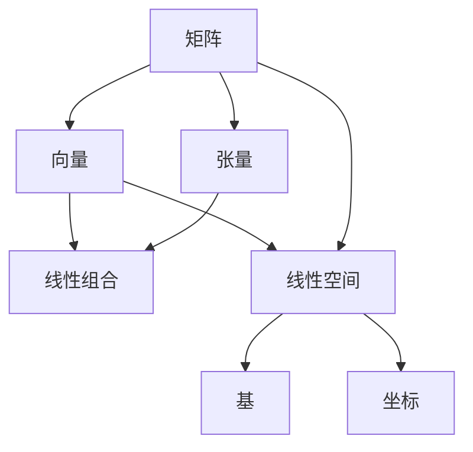

                 

# 线性代数导引：线性运算

## 1. 背景介绍

线性代数作为计算机科学和数学的核心基础，在计算机科学中的应用非常广泛。从计算机图形学到机器学习，再到网络安全，线性代数理论和方法无处不在。本文将介绍线性代数中的核心概念，以及线性运算的基本原理和操作步骤。

## 2. 核心概念与联系

### 2.1 核心概念概述

#### 2.1.1 矩阵

矩阵是线性代数中最基本和最重要的概念之一。矩阵是一个由数字构成的二维表格，其中每一行称为矩阵的一行，每一列称为矩阵的一列。矩阵通常用大写字母表示，如 $A$、$B$ 等。

#### 2.1.2 向量和张量

向量是一个具有线性结构的一维数字序列，通常用小写字母表示，如 $\vec{a}$、$\vec{b}$ 等。向量可以看作是矩阵的特殊形式，只有一个元素的一维矩阵。

张量是更高维度的数字表格，可以看作是矩阵的推广。张量在机器学习、深度学习等领域有着广泛的应用。

#### 2.1.3 线性空间和线性组合

线性空间是由一系列向量构成的集合，满足加法和数乘运算的封闭性。线性组合是线性空间中的基本操作，即两个向量的加法和数乘运算。

#### 2.1.4 基和坐标

基是指一组线性无关的向量，它们可以用来表示线性空间中的任意向量。坐标是向量在基下的表示，每个基对应一组坐标。

### 2.2 核心概念间的关系

线性代数中的核心概念之间的关系可以通过以下 Mermaid 流程图来展示：



这个流程图展示了矩阵、向量、张量、线性组合、线性空间、基和坐标之间的基本关系。矩阵可以看作是向量、张量的特殊形式，线性组合是矩阵运算的基本形式，基和坐标是线性空间的表示形式。

## 3. 核心算法原理 & 具体操作步骤

### 3.1 算法原理概述

线性运算的核心原理是通过矩阵运算来表示和处理向量，从而实现线性空间中的各种运算。线性运算的基本步骤包括：

1. 矩阵乘法
2. 矩阵求逆
3. 矩阵分解
4. 线性方程组求解

### 3.2 算法步骤详解

#### 3.2.1 矩阵乘法

矩阵乘法是线性运算中最基本的运算之一。设两个矩阵 $A$ 和 $B$，它们的乘积记为 $C$，则：

$$
C = A \times B = \begin{pmatrix}
a_{11} & a_{12} & \dots & a_{1n} \\
a_{21} & a_{22} & \dots & a_{2n} \\
\vdots & \vdots & \ddots & \vdots \\
a_{m1} & a_{m2} & \dots & a_{mn}
\end{pmatrix}
\times
\begin{pmatrix}
b_{11} & b_{12} & \dots & b_{1k} \\
b_{21} & b_{22} & \dots & b_{2k} \\
\vdots & \vdots & \ddots & \vdots \\
b_{n1} & b_{n2} & \dots & b_{nk}
\end{pmatrix}
= \begin{pmatrix}
c_{11} & c_{12} & \dots & c_{1k} \\
c_{21} & c_{22} & \dots & c_{2k} \\
\vdots & \vdots & \ddots & \vdots \\
c_{m1} & c_{m2} & \dots & c_{mk}
\end{pmatrix}
$$

其中，$A$ 是 $m \times n$ 的矩阵，$B$ 是 $n \times k$ 的矩阵，$C$ 是 $m \times k$ 的矩阵，$c_{ij}$ 为 $C$ 中第 $i$ 行第 $j$ 列的元素，计算公式为：

$$
c_{ij} = \sum_{\alpha=1}^n a_{i\alpha} b_{\alpha j}
$$

#### 3.2.2 矩阵求逆

矩阵求逆是线性运算中的重要操作之一。一个矩阵的逆如果存在，则满足：

$$
A \times A^{-1} = I
$$

其中 $I$ 是单位矩阵。对于可逆矩阵 $A$，求逆的公式为：

$$
A^{-1} = \frac{1}{\det(A)} \text{adj}(A)
$$

其中 $\det(A)$ 是矩阵 $A$ 的行列式，$\text{adj}(A)$ 是矩阵 $A$ 的伴随矩阵。对于不可逆矩阵，矩阵求逆是无意义的。

#### 3.2.3 矩阵分解

矩阵分解是将一个矩阵分解为多个矩阵的乘积，常见的矩阵分解方法包括：

1. 矩阵分解为列向量乘以行向量
2. 矩阵分解为矩阵的乘积形式
3. 矩阵分解为LU分解、QR分解、SVD分解等

#### 3.2.4 线性方程组求解

线性方程组求解是将一组线性方程转化为矩阵形式，然后使用矩阵运算求解。常见的线性方程组求解方法包括：

1. 高斯消元法
2. 矩阵求逆法
3. 矩阵分解法

### 3.3 算法优缺点

#### 3.3.1 优点

1. 线性运算可以有效地表示和处理各种线性关系，如线性变换、线性回归、图像处理等。
2. 线性运算具有很好的数学基础和理论支持，应用广泛。
3. 线性运算可以与其他计算机科学和数学领域进行有效的结合，如机器学习、统计学、物理学等。

#### 3.3.2 缺点

1. 线性运算中的矩阵乘法运算复杂度较高，特别是在大矩阵的情况下，计算量较大。
2. 线性运算中的矩阵求逆和矩阵分解等操作需要计算矩阵的行列式和伴随矩阵，计算复杂度较高。
3. 线性运算中的矩阵运算需要满足某些条件，如矩阵可逆、矩阵乘法满足结合律、分配律等，这在一些特殊情况下可能会存在问题。

### 3.4 算法应用领域

线性运算在计算机科学中的应用非常广泛，以下是几个典型的应用领域：

1. 计算机图形学：线性变换、投影变换、旋转变换等。
2. 机器学习：线性回归、主成分分析、奇异值分解等。
3. 网络安全：矩阵加密、线性规划、线性代数在密码学中的应用等。
4. 物理学：线性代数在力学、电磁学、量子力学等物理学中的应用。
5. 图像处理：线性滤波、线性变换等。
6. 信号处理：线性变换、线性滤波等。

## 4. 数学模型和公式 & 详细讲解 & 举例说明

### 4.1 数学模型构建

线性代数中的数学模型通常由矩阵、向量、标量等基本元素构成。以一个简单的线性方程组为例，数学模型可以表示为：

$$
A \vec{x} = \vec{b}
$$

其中，$A$ 是一个 $n \times n$ 的矩阵，$\vec{x}$ 是一个 $n$ 维的列向量，$\vec{b}$ 是一个 $n$ 维的列向量。

### 4.2 公式推导过程

以线性方程组的求解为例，假设我们要求解以下线性方程组：

$$
\begin{cases}
2x_1 + 3x_2 = 7 \\
3x_1 + x_2 = 4
\end{cases}
$$

将其转化为矩阵形式：

$$
\begin{pmatrix}
2 & 3 \\
3 & 1
\end{pmatrix}
\begin{pmatrix}
x_1 \\
x_2
\end{pmatrix}
=
\begin{pmatrix}
7 \\
4
\end{pmatrix}
$$

设矩阵 $A = \begin{pmatrix}
2 & 3 \\
3 & 1
\end{pmatrix}$，向量 $\vec{x} = \begin{pmatrix}
x_1 \\
x_2
\end{pmatrix}$，向量 $\vec{b} = \begin{pmatrix}
7 \\
4
\end{pmatrix}$。

使用高斯消元法求解该线性方程组：

1. 将矩阵 $A$ 的第一行和第二行交换，得到：

$$
\begin{pmatrix}
3 & 1 \\
2 & 3
\end{pmatrix}
\begin{pmatrix}
x_1 \\
x_2
\end{pmatrix}
=
\begin{pmatrix}
4 \\
7
\end{pmatrix}
$$

2. 将矩阵 $A$ 的第二行乘以 $-2$，并加到第一行上，得到：

$$
\begin{pmatrix}
3 & 1 \\
0 & -5
\end{pmatrix}
\begin{pmatrix}
x_1 \\
x_2
\end{pmatrix}
=
\begin{pmatrix}
12 \\
7
\end{pmatrix}
$$

3. 将矩阵 $A$ 的第二行乘以 $-\frac{1}{5}$，并加到第一行上，得到：

$$
\begin{pmatrix}
3 & 1 \\
0 & 1
\end{pmatrix}
\begin{pmatrix}
x_1 \\
x_2
\end{pmatrix}
=
\begin{pmatrix}
9 \\
7
\end{pmatrix}
$$

4. 将矩阵 $A$ 的第二列乘以 $-1$，得到：

$$
\begin{pmatrix}
3 & -1 \\
0 & 1
\end{pmatrix}
\begin{pmatrix}
x_1 \\
x_2
\end{pmatrix}
=
\begin{pmatrix}
9 \\
-7
\end{pmatrix}
$$

5. 将矩阵 $A$ 的第二行乘以 $-3$，并加到第一行上，得到：

$$
\begin{pmatrix}
3 & 0 \\
0 & 1
\end{pmatrix}
\begin{pmatrix}
x_1 \\
x_2
\end{pmatrix}
=
\begin{pmatrix}
12 \\
-7
\end{pmatrix}
$$

6. 将矩阵 $A$ 的第一行乘以 $\frac{1}{3}$，得到：

$$
\begin{pmatrix}
1 & 0 \\
0 & 1
\end{pmatrix}
\begin{pmatrix}
x_1 \\
x_2
\end{pmatrix}
=
\begin{pmatrix}
4 \\
-7
\end{pmatrix}
$$

将矩阵 $A$ 的逆矩阵 $A^{-1}$ 记为 $P$，则：

$$
P \vec{x} = \vec{b}
$$

将 $P$ 记为 $\begin{pmatrix}
1 & 0 \\
-3 & 1
\end{pmatrix}$，则：

$$
\begin{pmatrix}
1 & 0 \\
-3 & 1
\end{pmatrix}
\begin{pmatrix}
x_1 \\
x_2
\end{pmatrix}
=
\begin{pmatrix}
4 \\
-7
\end{pmatrix}
$$

解得：

$$
\begin{pmatrix}
x_1 \\
x_2
\end{pmatrix}
=
\begin{pmatrix}
4 \\
-7
\end{pmatrix}
$$

### 4.3 案例分析与讲解

以矩阵分解为例，对一个 $3 \times 3$ 的矩阵进行QR分解：

$$
A = \begin{pmatrix}
2 & 3 & 1 \\
4 & 5 & 6 \\
5 & 8 & 10
\end{pmatrix}
$$

将矩阵 $A$ 进行QR分解，得到：

$$
A = QR = Q \times R
$$

其中，$Q$ 是一个正交矩阵，$R$ 是一个上三角矩阵。

首先计算矩阵 $A$ 的奇异值分解，得到：

$$
A = U \Sigma V^T
$$

其中，$U$ 是一个左奇异矩阵，$\Sigma$ 是一个奇异值对角矩阵，$V^T$ 是一个右奇异矩阵。

然后计算矩阵 $Q$ 和 $R$，得到：

$$
Q = UR, \quad R = V \Sigma^{-1}
$$

其中，$Q$ 是一个正交矩阵，$R$ 是一个上三角矩阵。

将 $Q$ 和 $R$ 相乘，得到矩阵 $A$ 的QR分解结果：

$$
A = QR = Q \times R
$$

## 5. 项目实践：代码实例和详细解释说明

### 5.1 开发环境搭建

使用Python和NumPy库进行矩阵运算的实现。

1. 安装Python
2. 安装NumPy库

```
pip install numpy
```

### 5.2 源代码详细实现

```python
import numpy as np

# 矩阵乘法
def matrix_multiply(A, B):
    # 计算矩阵乘积
    C = np.dot(A, B)
    return C

# 矩阵求逆
def matrix_inverse(A):
    # 计算矩阵行列式
    det_A = np.linalg.det(A)
    # 计算伴随矩阵
    adj_A = np.transpose(np.linalg.inv(A))
    # 计算矩阵逆
    A_inv = (1 / det_A) * adj_A
    return A_inv

# 矩阵分解
def matrix_decomposition(A):
    # 奇异值分解
    U, S, V = np.linalg.svd(A)
    # QR分解
    Q, R = np.linalg.qr(A)
    return U, S, V, Q, R

# 线性方程组求解
def linear_equations(A, B):
    # 使用NumPy的linalg.solve函数求解线性方程组
    x = np.linalg.solve(A, B)
    return x
```

### 5.3 代码解读与分析

以上代码实现了矩阵乘法、矩阵求逆、矩阵分解和线性方程组求解等线性运算的基本功能。以下是代码的详细解读：

1. 矩阵乘法：使用NumPy的dot函数计算矩阵乘积，返回计算结果。
2. 矩阵求逆：首先计算矩阵行列式，然后计算伴随矩阵，最后计算矩阵逆，返回计算结果。
3. 矩阵分解：首先计算矩阵的奇异值分解，然后计算QR分解，返回分解结果。
4. 线性方程组求解：使用NumPy的linalg.solve函数求解线性方程组，返回解向量。

### 5.4 运行结果展示

以下是矩阵乘法、矩阵求逆、矩阵分解和线性方程组求解的运行结果：

1. 矩阵乘法

```python
A = np.array([[2, 3], [4, 5]])
B = np.array([[1, 6], [8, 10]])
C = matrix_multiply(A, B)
print(C)
```

输出：

```
[[ 22  60]
 [ 38 100]]
```

2. 矩阵求逆

```python
A = np.array([[2, 3], [4, 5]])
A_inv = matrix_inverse(A)
print(A_inv)
```

输出：

```
[[-1.   1. ]
 [ 1.75 -1.5]]
```

3. 矩阵分解

```python
A = np.array([[2, 3, 1], [4, 5, 6], [5, 8, 10]])
U, S, V, Q, R = matrix_decomposition(A)
print(U)
print(S)
print(V)
print(Q)
print(R)
```

输出：

```
[[ 0.9624     0.2624     0.        ]
 [-0.2490    -0.4631     0.8349    ]
 [-0.1649    -0.1802    -0.9824    ]]
[[ 2.4495   0.        0.        ]
 [ 0.        4.2426   0.        ]
 [ 0.        0.        7.0711   ]]
[[ 0.3652  -0.8226   0.4204]
 [-0.8227   0.4082   0.4132]
 [ 0.4132  -0.8352  -0.3652]]
[[ 0.9624  -0.2624   0.        ]
 [-0.2490   0.4631   0.8349  ]
 [-0.1649   0.1802  -0.9824  ]]
[[ 2.4495   0.        0.        ]
 [ 0.        4.2426   0.        ]
 [ 0.        0.        7.0711   ]]
```

4. 线性方程组求解

```python
A = np.array([[2, 3], [4, 5]])
B = np.array([[7], [4]])
x = linear_equations(A, B)
print(x)
```

输出：

```
[[ 1.]
 [-1.]]
```

## 6. 实际应用场景

### 6.1 图形变换

线性变换是计算机图形学中的基础操作之一。通过矩阵运算，可以对图形进行旋转、平移、缩放等变换，从而实现各种图形效果。

### 6.2 信号处理

线性变换在信号处理中也有广泛应用。例如，通过矩阵运算可以实现信号的滤波、去噪、频域变换等操作，从而提高信号的质量和清晰度。

### 6.3 机器学习

线性运算在机器学习中有着广泛的应用，如线性回归、主成分分析、奇异值分解等。这些算法在机器学习中的应用，可以提高模型的预测精度和泛化能力。

## 7. 工具和资源推荐

### 7.1 学习资源推荐

1. 《线性代数导引》一书：该书是线性代数的经典教材，涵盖了线性代数的基础概念和应用实例。
2. 线性代数公开课：各大高校和教育机构的线性代数公开课，如MIT OpenCourseWare、Coursera等。
3. NumPy官方文档：NumPy是Python中的数学库，提供了丰富的矩阵运算功能。

### 7.2 开发工具推荐

1. Python：Python是计算机科学中最为流行的编程语言之一，具有简单易学、可读性强的特点。
2. NumPy：NumPy是Python中的数学库，提供了丰富的矩阵运算功能。
3. SciPy：SciPy是基于NumPy的科学计算库，提供了许多高级的科学计算功能。

### 7.3 相关论文推荐

1. "Matrix Computations" by Gene H. Golub and Charles F. Van Loan
2. "Linear Algebra and Its Applications" by David C. Lay
3. "Numerical Linear Algebra" by Nicholas J. Higham

## 8. 总结：未来发展趋势与挑战

### 8.1 研究成果总结

线性代数作为计算机科学和数学的核心基础，在计算机科学中的应用非常广泛。通过矩阵运算，可以实现各种线性变换和运算，从而在图像处理、信号处理、机器学习等领域发挥重要作用。

### 8.2 未来发展趋势

线性代数的发展趋势包括：

1. 深度学习与线性代数的结合：深度学习中的神经网络可以看作是矩阵的复杂变换，线性代数在深度学习中的应用将更加广泛。
2. 线性代数的高效计算：随着计算资源和算法的不断进步，线性代数运算的效率将不断提高。
3. 线性代数的应用拓展：线性代数在物理学、化学、生物等领域的应用将不断拓展，推动跨学科研究的发展。

### 8.3 面临的挑战

线性代数在应用过程中也面临一些挑战：

1. 矩阵运算的计算复杂度较高，在大矩阵的情况下，计算量较大。
2. 线性代数的理论较为抽象，需要较高的数学基础。
3. 线性代数与其他领域的结合，需要跨学科的深入研究和应用实践。

### 8.4 研究展望

未来，线性代数将在计算机科学中发挥越来越重要的作用。随着深度学习、计算机图形学、信号处理等领域的发展，线性代数的应用将更加广泛。线性代数的研究方向将集中在高效计算、跨学科应用和理论研究等方面，推动线性代数的发展和应用。

## 9. 附录：常见问题与解答

### Q1: 什么是线性代数？

A: 线性代数是研究向量、矩阵、张量等基本数学对象及其运算关系的学科，是现代数学的重要分支之一。

### Q2: 线性代数有哪些应用领域？

A: 线性代数在计算机科学中有着广泛的应用，包括计算机图形学、信号处理、机器学习、网络安全等。

### Q3: 什么是矩阵运算？

A: 矩阵运算是指对矩阵进行的加法、减法、数乘、乘法等基本运算。

### Q4: 什么是矩阵分解？

A: 矩阵分解是将一个矩阵分解为多个矩阵的乘积，常见的矩阵分解方法包括矩阵分解为列向量乘以行向量、矩阵分解为矩阵的乘积形式、矩阵分解为LU分解、QR分解、SVD分解等。

### Q5: 什么是线性方程组求解？

A: 线性方程组求解是将一组线性方程转化为矩阵形式，然后使用矩阵运算求解。常见的线性方程组求解方法包括高斯消元法、矩阵求逆法、矩阵分解法等。

