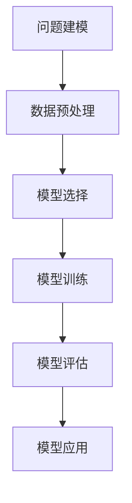
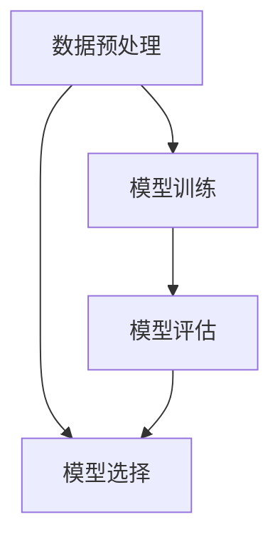
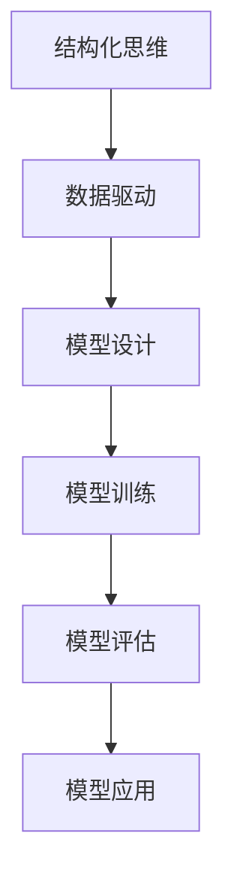
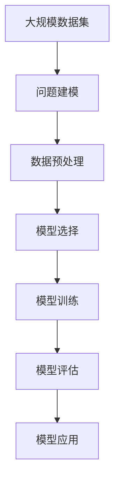

                 

# 结构化思维的应用：从理论到实践

## 1. 背景介绍

### 1.1 问题由来
在计算机科学和工程领域，结构化思维(Structured Thinking)是一种非常强大的思维方式。它不仅在软件开发和系统架构设计中应用广泛，也在数据科学和人工智能领域显示出其独特的价值。结构化思维通过建立清晰的问题模型和数据结构，帮助解决复杂问题，提升系统性能和可维护性。

近年来，随着大数据、人工智能技术的迅猛发展，结构化思维在机器学习领域的应用也逐步深入，尤其是在深度学习模型构建和训练方面，结构化思维帮助研究人员和工程师更好地理解和设计模型，提升模型性能，加速模型开发和应用。

### 1.2 问题核心关键点
结构化思维的核心在于其基于数据驱动和模型驱动的思维方法。它要求研究人员或工程师在处理问题时，首先构建完整、准确的问题模型，然后选择合适的算法和模型来解决问题。这个过程可以分为以下几个关键步骤：
1. **问题建模**：清晰定义问题的输入和输出，确定问题类型（如分类、回归、序列生成等）。
2. **数据预处理**：收集、清洗、归一化、标注数据，为模型的训练和评估准备数据。
3. **模型选择**：基于问题的特点和数据情况，选择合适的模型结构，如CNN、RNN、Transformer等。
4. **模型训练**：利用优化算法和正则化技术，训练模型参数，最小化损失函数，使模型拟合数据。
5. **模型评估**：通过验证集和测试集评估模型性能，选择最优模型。
6. **模型应用**：将训练好的模型部署到实际应用场景中，进行推理预测。

结构化思维的应用，有助于提升模型构建的系统性和科学性，避免盲目选择模型或算法，从而提高模型的性能和泛化能力。

### 1.3 问题研究意义
结构化思维在人工智能和机器学习中的应用，具有重要意义：
1. **提升模型性能**：通过科学的设计和选择，结构化思维可以显著提升模型的精度和泛化能力。
2. **加速模型开发**：结构化思维提供了明确的步骤和方法论，帮助研究人员和工程师快速迭代模型，缩短开发周期。
3. **促进跨领域融合**：结构化思维不仅在NLP、CV、语音识别等领域有广泛应用，还与其他领域如自动驾驶、智能制造等结合，推动AI技术在更广阔领域的应用。
4. **增强模型可解释性**：结构化思维强调模型设计的逻辑性和可解释性，使得模型决策过程更加透明，易于调试和优化。
5. **提升数据驱动决策能力**：结构化思维强调数据的重要性，通过建立精确的数据模型，提升数据驱动决策的科学性和可靠性。

## 2. 核心概念与联系

### 2.1 核心概念概述

为了更好地理解结构化思维的应用，本节将介绍几个密切相关的核心概念：

- **问题建模(Problem Modeling)**：定义和刻画问题的输入、输出、限制和假设，形成问题的数学模型或逻辑模型。
- **数据预处理(Data Preprocessing)**：从原始数据中提取、清洗、转换、标注数据，为模型训练准备数据。
- **模型选择(Model Selection)**：基于问题特点和数据情况，选择合适的模型结构（如CNN、RNN、Transformer等）。
- **模型训练(Model Training)**：利用优化算法和正则化技术，训练模型参数，最小化损失函数。
- **模型评估(Model Evaluation)**：通过验证集和测试集评估模型性能，选择最优模型。
- **模型应用(Model Application)**：将训练好的模型部署到实际应用场景中，进行推理预测。

- **数据结构(Data Structure)**：指数据的存储和组织方式，如数组、链表、树、图等，用于提升数据访问和处理的效率。
- **算法(Algorithm)**：指解决问题的方法和步骤，如排序、搜索、分类、回归等，用于提升数据处理和模型训练的效率。
- **模型(Machine Learning Model)**：指用于解决特定问题的数学模型或计算模型，如线性回归、决策树、神经网络等，用于提升数据处理和推理预测的精度。

这些核心概念之间的逻辑关系可以通过以下Mermaid流程图来展示：



这个流程图展示了大规模数据处理和模型训练的一般流程，从问题建模开始，到数据预处理、模型选择、训练、评估和应用，每个环节都是不可忽视的。通过理解这些核心概念，我们可以更好地把握结构化思维的精髓，为后续深入讨论具体的模型设计和优化奠定基础。

### 2.2 概念间的关系

这些核心概念之间存在着紧密的联系，形成了数据处理和模型训练的完整生态系统。下面我们通过几个Mermaid流程图来展示这些概念之间的关系。

#### 2.2.1 模型训练和评估的关系


这个流程图展示了模型训练和评估之间的反馈循环。训练过程中，我们通过评估模型的性能，选择最优的模型结构或参数组合。训练结束后，我们再次评估模型，确保其在新数据上的泛化能力。

#### 2.2.2 数据预处理和模型训练的关系



这个流程图展示了数据预处理和模型训练的相互依赖关系。数据预处理决定了模型训练的效率和效果，而模型训练后的性能评估又反过来影响数据预处理的方式。两者相辅相成，共同影响模型的最终性能。

#### 2.2.3 结构化思维和数据驱动的关系



这个流程图展示了结构化思维在数据驱动决策中的作用。通过建立精确的数据模型，结构化思维使得数据驱动决策更加科学和可靠。同时，结构化思维强调模型设计的逻辑性和可解释性，使得模型应用更加透明和可信。

### 2.3 核心概念的整体架构

最后，我们用一个综合的流程图来展示这些核心概念在大规模数据处理和模型训练过程中的整体架构：



这个综合流程图展示了从问题建模到模型应用的全过程。通过明确的问题建模和科学的数据处理，选择最优的模型结构，训练高效的模型参数，评估模型的泛化能力，最终将模型应用于实际应用场景，解决实际问题。通过这些流程图，我们可以更清晰地理解结构化思维在数据处理和模型训练中的应用，为后续深入讨论具体的模型设计和优化提供基础。

## 3. 核心算法原理 & 具体操作步骤
### 3.1 算法原理概述

结构化思维在深度学习模型构建和训练中的应用，主要基于以下三个核心原理：

1. **数据驱动的决策**：通过收集、清洗、标注大规模数据集，形成精确的问题模型，为模型的训练和优化提供数据基础。
2. **模型驱动的训练**：根据问题模型和数据情况，选择合适的模型结构，利用优化算法和正则化技术训练模型参数，最小化损失函数。
3. **评估驱动的优化**：通过验证集和测试集的评估结果，选择最优的模型结构和参数组合，优化模型性能。

这些原理共同构成了结构化思维在机器学习应用中的核心思想，使得模型设计和训练具有更高的科学性和系统性。

### 3.2 算法步骤详解

结构化思维在深度学习模型构建和训练中的应用，一般包括以下几个关键步骤：

**Step 1: 问题建模**

问题建模是结构化思维的首要步骤，通过清晰定义问题的输入和输出，确定问题类型，形成问题的数学模型或逻辑模型。

假设我们希望构建一个用于情感分析的模型。问题建模的过程如下：
- 输入：文本数据，包含情感标签（如正向、负面、中性）。
- 输出：每个文本的情感类别。
- 假设：文本长度在一定范围内，情感标签为二元（正向、负面）。

我们可以用以下公式来描述问题模型：

$$
y_i = f(x_i; \theta)
$$

其中，$x_i$为文本数据，$y_i$为情感类别，$f(\cdot)$为模型函数，$\theta$为模型参数。

**Step 2: 数据预处理**

数据预处理包括数据收集、清洗、标注、归一化等步骤，为模型的训练和评估准备数据。

假设我们收集了1000篇标注好的情感分析数据。数据预处理的过程如下：
- 数据清洗：去除重复、噪声数据，确保数据质量。
- 数据标注：标注文本的情感类别，形成训练集、验证集和测试集。
- 数据归一化：对文本进行分词、去停用词、词嵌入等处理，确保输入数据的一致性。

**Step 3: 模型选择**

模型选择是结构化思维的重要环节，根据问题特点和数据情况，选择合适的模型结构。

假设我们选择使用卷积神经网络（CNN）来构建情感分析模型。CNN的优点在于能够捕捉局部特征，对文本数据具有较好的适应性。

**Step 4: 模型训练**

模型训练是结构化思维的核心步骤，利用优化算法和正则化技术，训练模型参数，最小化损失函数。

假设我们使用Adam优化算法，学习率为0.001，训练100个epoch。训练过程如下：
- 初始化模型参数。
- 前向传播计算损失函数。
- 反向传播计算梯度。
- 更新模型参数。
- 重复步骤2-3，直至模型收敛。

**Step 5: 模型评估**

模型评估是结构化思维的关键环节，通过验证集和测试集评估模型性能，选择最优模型。

假设我们使用准确率、召回率、F1分数等指标评估模型性能。评估过程如下：
- 在验证集上计算模型指标。
- 选择最优模型参数。
- 在测试集上计算模型指标。
- 确定模型性能。

**Step 6: 模型应用**

模型应用是结构化思维的最终环节，将训练好的模型部署到实际应用场景中，进行推理预测。

假设我们将训练好的情感分析模型部署到推荐系统，根据用户评价生成商品推荐。

### 3.3 算法优缺点

结构化思维在深度学习模型构建和训练中的应用，具有以下优点：

1. **系统性**：通过明确的问题建模和科学的数据处理，结构化思维使得模型设计和训练具有更高的系统性和科学性。
2. **高效性**：结构化思维强调数据驱动决策，通过建立精确的数据模型，提升模型训练和优化的效率。
3. **可靠性**：结构化思维强调模型驱动训练和评估驱动优化，确保模型性能和泛化能力的可靠性。

同时，结构化思维也存在一些缺点：

1. **数据依赖性**：结构化思维高度依赖数据质量，数据偏差和标注错误可能影响模型性能。
2. **计算成本高**：大规模数据预处理和模型训练需要大量计算资源和时间，对硬件设备提出了较高要求。
3. **模型复杂性**：结构化思维在模型选择和设计过程中可能引入复杂性，增加模型的调试和维护难度。

尽管存在这些缺点，但结构化思维仍然是深度学习模型设计和训练的重要方法论，通过合理应用和优化，可以有效提升模型性能和应用效果。

### 3.4 算法应用领域

结构化思维在深度学习模型构建和训练中的应用，已经广泛应用于以下几个领域：

- **计算机视觉(CV)**：用于图像分类、目标检测、图像生成等任务。
- **自然语言处理(NLP)**：用于情感分析、机器翻译、文本生成等任务。
- **语音识别**：用于语音识别、语音合成、语音情感分析等任务。
- **自动驾驶**：用于视觉感知、路径规划、自动驾驶决策等任务。
- **智能制造**：用于设备预测维护、质量控制、工艺优化等任务。

除了以上领域，结构化思维在更多领域也有广泛应用，如金融、医疗、教育等，为这些领域带来新的技术变革。

## 4. 数学模型和公式 & 详细讲解  
### 4.1 数学模型构建

结构化思维在深度学习模型构建和训练中的应用，主要基于以下数学模型：

假设我们构建一个用于情感分析的深度学习模型，输入为文本数据 $x$，输出为情感类别 $y$。模型可以表示为：

$$
y_i = f(x_i; \theta)
$$

其中，$x_i$为文本数据，$y_i$为情感类别，$f(\cdot)$为模型函数，$\theta$为模型参数。

模型的目标是最小化损失函数：

$$
\mathcal{L}(\theta) = \frac{1}{N} \sum_{i=1}^N \ell(y_i, f(x_i; \theta))
$$

其中，$\ell(\cdot)$为损失函数，$N$为样本数量。常见的损失函数包括交叉熵损失、均方误差损失等。

### 4.2 公式推导过程

以交叉熵损失函数为例，推导模型的训练过程。

假设我们构建了一个二分类模型，目标是最小化交叉熵损失函数：

$$
\ell(y_i, f(x_i; \theta)) = -y_i \log f(x_i; \theta) - (1 - y_i) \log (1 - f(x_i; \theta))
$$

将其代入经验风险公式，得：

$$
\mathcal{L}(\theta) = -\frac{1}{N} \sum_{i=1}^N [y_i \log f(x_i; \theta) + (1 - y_i) \log (1 - f(x_i; \theta))]
$$

根据链式法则，损失函数对参数 $\theta_k$ 的梯度为：

$$
\frac{\partial \mathcal{L}(\theta)}{\partial \theta_k} = -\frac{1}{N} \sum_{i=1}^N [y_i \frac{\partial \log f(x_i; \theta)}{\partial \theta_k} - (1 - y_i) \frac{\partial \log (1 - f(x_i; \theta))}{\partial \theta_k}]
$$

其中，$\frac{\partial \log f(x_i; \theta)}{\partial \theta_k}$ 和 $\frac{\partial \log (1 - f(x_i; \theta))}{\partial \theta_k}$ 可以通过链式法则进一步递归展开，利用自动微分技术完成计算。

在得到损失函数的梯度后，即可带入参数更新公式，完成模型的迭代优化。重复上述过程直至收敛，最终得到适应目标任务的最优模型参数 $\theta^*$。

### 4.3 案例分析与讲解

以卷积神经网络（CNN）为例，展示结构化思维在计算机视觉中的应用。

假设我们构建一个用于图像分类的CNN模型。模型可以表示为：

$$
y_i = f(x_i; \theta) = \sigma(\sum_{k=1}^K \omega_k x_{k,i} + b_k)
$$

其中，$x_{k,i}$为输入图像的第 $k$ 个卷积核和第 $i$ 个像素点的卷积结果，$\omega_k$ 为卷积核权重，$b_k$ 为偏置项，$\sigma$ 为激活函数。

模型的目标是最小化损失函数：

$$
\mathcal{L}(\theta) = \frac{1}{N} \sum_{i=1}^N \ell(y_i, f(x_i; \theta))
$$

其中，$\ell(\cdot)$为损失函数，$N$为样本数量。常见的损失函数包括交叉熵损失、均方误差损失等。

通过卷积操作和池化操作，CNN模型可以提取图像的局部特征，捕捉图像的空间关系。通过全连接层和激活函数，CNN模型可以对图像进行分类和识别。

通过结构化思维，我们可以清晰地定义CNN模型的结构、参数和目标，形成完整的模型构建流程。这种模型设计和训练的科学性和系统性，有助于提升模型的性能和泛化能力。

## 5. 项目实践：代码实例和详细解释说明
### 5.1 开发环境搭建

在进行项目实践前，我们需要准备好开发环境。以下是使用Python进行TensorFlow开发的环境配置流程：

1. 安装Anaconda：从官网下载并安装Anaconda，用于创建独立的Python环境。

2. 创建并激活虚拟环境：
```bash
conda create -n tensorflow-env python=3.7 
conda activate tensorflow-env
```

3. 安装TensorFlow：根据CUDA版本，从官网获取对应的安装命令。例如：
```bash
conda install tensorflow tensorflow-gpu -c conda-forge
```

4. 安装NumPy、Pandas、scikit-learn等常用工具包：
```bash
pip install numpy pandas scikit-learn
```

完成上述步骤后，即可在`tensorflow-env`环境中开始项目实践。

### 5.2 源代码详细实现

这里以手写数字识别为例，展示使用TensorFlow构建卷积神经网络(CNN)的过程。

首先，定义CNN模型的超参数：

```python
import tensorflow as tf

# 超参数设置
learning_rate = 0.001
num_epochs = 10
batch_size = 128
num_filters = 64
filter_size = 3
pool_size = 2
hidden_units = 128
```

然后，定义CNN模型的结构：

```python
# 定义CNN模型结构
class CNN(tf.keras.Model):
    def __init__(self):
        super(CNN, self).__init__()
        self.conv1 = tf.keras.layers.Conv2D(num_filters, kernel_size=filter_size, activation='relu')
        self.maxpool1 = tf.keras.layers.MaxPooling2D(pool_size=pool_size)
        self.conv2 = tf.keras.layers.Conv2D(num_filters, kernel_size=filter_size, activation='relu')
        self.maxpool2 = tf.keras.layers.MaxPooling2D(pool_size=pool_size)
        self.flatten = tf.keras.layers.Flatten()
        self.dense1 = tf.keras.layers.Dense(hidden_units, activation='relu')
        self.dense2 = tf.keras.layers.Dense(10, activation='softmax')

    def call(self, x):
        x = self.conv1(x)
        x = self.maxpool1(x)
        x = self.conv2(x)
        x = self.maxpool2(x)
        x = self.flatten(x)
        x = self.dense1(x)
        x = self.dense2(x)
        return x
```

接着，定义数据预处理函数：

```python
# 数据预处理函数
def preprocess_data(train_data, test_data):
    # 数据归一化
    train_data = train_data / 255.0
    test_data = test_data / 255.0
    
    # 数据扩展
    train_data = tf.keras.utils.image_data_generator.flow(train_data, batch_size=batch_size).next()
    test_data = tf.keras.utils.image_data_generator.flow(test_data, batch_size=batch_size).next()
    
    return train_data, test_data
```

然后，加载并预处理数据集：

```python
# 加载数据集
train_data = tf.keras.datasets.mnist.load_data()
test_data = tf.keras.datasets.mnist.load_data()

# 数据预处理
train_data, test_data = preprocess_data(train_data, test_data)

# 数据转换
train_data = train_data.reshape((-1, 28, 28, 1))
test_data = test_data.reshape((-1, 28, 28, 1))
```

接着，定义损失函数、优化器和评估指标：

```python
# 定义损失函数和优化器
loss_fn = tf.keras.losses.SparseCategoricalCrossentropy(from_logits=True)
optimizer = tf.keras.optimizers.Adam(learning_rate)

# 定义评估指标
eval_metric = tf.keras.metrics.SparseCategoricalAccuracy()
```

然后，定义模型训练和评估函数：

```python
# 模型训练函数
def train_model(model, train_data, test_data, epochs):
    for epoch in range(epochs):
        for i in range(0, train_data.shape[0], batch_size):
            x = train_data[i:i+batch_size]
            y = train_data[i:i+batch_size]
            with tf.GradientTape() as tape:
                logits = model(x, training=True)
                loss_value = loss_fn(y, logits)
            gradients = tape.gradient(loss_value, model.trainable_variables)
            optimizer.apply_gradients(zip(gradients, model.trainable_variables))
            eval_metric.update_state(y, logits)
            if (i+batch_size) % 100 == 0:
                print(f"Epoch {epoch+1}, loss: {loss_value:.4f}, accuracy: {eval_metric.result().numpy():.4f}")
    return eval_metric.result().numpy()

# 模型评估函数
def evaluate_model(model, test_data):
    logits = model(test_data, training=False)
    loss_value = loss_fn(test_data, logits)
    accuracy = tf.keras.metrics.SparseCategoricalAccuracy()(test_data, logits)
    return loss_value, accuracy
```

最后，训练和评估模型：

```python
# 创建模型实例
model = CNN()

# 训练模型
eval_metric = train_model(model, train_data, test_data, num_epochs)

# 评估模型
loss_value, accuracy = evaluate_model(model, test_data)
print(f"Final loss: {loss_value:.4f}, final accuracy: {accuracy:.4f}")
```

以上就是使用TensorFlow构建CNN模型的完整代码实现。可以看到，通过结构化思维，我们可以清晰地定义CNN模型的结构、参数和目标，形成完整的模型构建流程。这种模型设计和训练的科学性和系统性，有助于提升模型的性能和泛化能力。

### 5.3 代码解读与分析

让我们再详细解读一下关键代码的实现细节：

**CNN类**：
- `__init__`方法：初始化CNN模型各层。
- `call`方法：定义模型前向传播过程，利用卷积、池化、全连接等操作提取特征，最后输出预测结果。

**数据预处理函数**：
- 归一化：将像素值缩放到[0,1]范围内，提高模型的收敛速度。
- 扩展：将数据转换为TensorFlow的数据生成器，逐批读取数据，减少内存消耗。

**训练和评估函数**：
- 模型训练函数：通过循环迭代，计算损失函数和梯度，更新模型参数，计算评估指标。
- 模型评估函数：利用测试数据集计算损失函数和评估指标，返回最终结果。

**训练和评估过程**：
- 定义模型实例。
- 训练模型：在训练数据集上循环迭代，计算损失函数和梯度，更新模型参数，计算评估指标。
- 评估模型：在测试数据集上计算损失函数和评估指标，返回最终结果。

可以看到，通过结构化思维，我们可以清晰地定义CNN模型的结构、参数和目标，形成完整的模型构建流程。这种模型设计和训练的科学性和系统性，有助于提升模型的性能和泛化能力。

当然，工业级的系统实现还需考虑更多因素，如模型的保存和部署、超参数的自动搜索、更灵活的任务适配层等。但核心的结构化思维方法论仍然适用于模型设计和训练的各个环节，为后续深度学习模型的构建和优化提供重要指导。

## 6. 实际应用场景
### 6.1 图像分类

卷积神经网络(CNN)在图像分类任务中有着广泛应用。CNN通过卷积操作提取图像的局部特征，利用池化操作减少特征维度，最后通过全连接层进行分类。

在实际应用中，CNN可以用于医学影像分类、卫星图像分类、工业缺陷检测等任务。例如，在医学影像分类任务中，可以通过CNN模型对CT、MRI等医学影像进行自动分类，辅助医生进行疾病诊断。在工业缺陷检测任务中，可以通过CNN模型对生产线的零部件进行缺陷检测，提高生产效率和产品质量。

### 6.2 自然语言处理(NLP)

结构化思维在NLP领域也有广泛应用，如文本分类、情感分析、机器翻译等任务。通过构建合适的模型结构和数据预处理流程，可以有效提升模型的性能。

在文本分类任务中，可以使用卷积神经网络或递归神经网络(RNN)进行特征提取和分类。在情感分析任务中，可以使用长短时记忆网络(LSTM)或Transformer模型进行情感分析。在机器翻译任务中，可以使用注意力机制和Transformer模型进行翻译。

### 6.3 语音识别

结构化思维在语音识别任务中也同样适用。语音识别可以用于智能客服、语音助手、语音识别输入等任务。通过构建合适的模型结构和数据预处理流程，可以有效提升语音识别的准确率和鲁棒性。

在智能客服和语音助手任务中，可以使用卷积神经网络或递归神经网络进行特征提取和识别。在语音识别输入任务中，可以使用注意力机制和Transformer模型进行语音识别和转写。

### 6.4 自动驾驶

结构化思维在自动驾驶领域也有广泛应用。自动驾驶可以用于自动驾驶决策、路径规划、交通信号识别等任务。通过构建合适的模型结构和数据预处理流程，可以有效提升自动驾驶的安全性和可靠性。

在自动驾驶决策任务中，可以使用卷积神经网络或递归神经网络进行特征提取和决策。在路径规划任务中，可以使用卷积神经网络或RNN进行路径规划。在交通信号识别任务中，可以使用卷积神经网络或注意力机制进行信号识别和处理。

### 6.5 智能制造

结构化思维在智能制造领域也有广泛应用。智能制造可以

