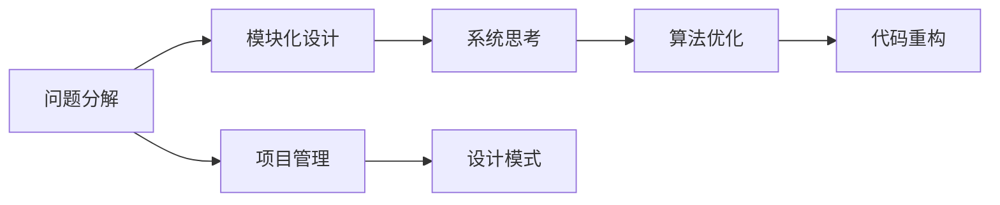

                 

# 结构化思维的应用：从理论到实践

> 关键词：结构化思维, 系统思维, 设计模式, 算法优化, 代码重构, 项目管理, 问题解决

## 1. 背景介绍

### 1.1 问题由来
在当今快速变化的科技领域，程序员常常面临复杂的系统设计和问题解决任务。传统直觉和经验驱动的方法往往不足以应对这些挑战，结构化思维（Structured Thinking）作为一种系统化、模块化、可复用的思维模式，正在逐步成为行业标准。结构化思维帮助程序员在复杂环境中快速找到问题的本质，设计出高效、可维护的系统。

### 1.2 问题核心关键点
结构化思维强调将问题分解为更小、更可控的部分，通过系统的分析与设计方法，逐步解决问题。关键点包括：

- **问题分解**：将复杂问题拆解为可管理的子问题。
- **模块化设计**：构建独立、清晰、可复用的模块。
- **系统思考**：综合考虑问题的各个方面，避免局部优化带来的全局问题。
- **持续优化**：在实践中不断调整和完善解决方案。

### 1.3 问题研究意义
掌握结构化思维，对于提升程序员的技术水平、工作效率、问题解决能力有着重要意义：

1. **提升问题解决能力**：通过系统化的方法快速识别问题核心。
2. **提高工作效率**：模块化设计降低重复劳动，减少调试和维护时间。
3. **促进团队协作**：统一的思维模式便于团队协作与知识传递。
4. **增强技术深度**：通过系统设计增强对技术细节的理解。
5. **促进创新思维**：结构化思维为新技术应用和创新提供有力支持。

## 2. 核心概念与联系

### 2.1 核心概念概述

结构化思维涉及多个核心概念，包括但不限于：

- **问题分解（Problem Decomposition）**：将复杂问题拆解为可管理的小问题。
- **模块化设计（Modular Design）**：构建独立、清晰、可复用的模块。
- **系统思考（System Thinking）**：综合考虑问题各个方面，避免局部优化带来的全局问题。
- **算法优化（Algorithm Optimization）**：通过改进算法提高问题解决的效率和效果。
- **代码重构（Code Refactoring）**：通过优化代码结构提高系统的可维护性。
- **项目管理（Project Management）**：通过系统的方法管理项目的进度和资源。
- **设计模式（Design Pattern）**：针对常见问题设计的通用解决方案。

这些概念之间相互关联，形成了一套完整的结构化思维框架。以下是一个简化的Mermaid流程图，展示这些概念之间的联系：



这个图表展示了一个典型的结构化思维应用流程：从问题分解开始，逐步通过模块化设计、系统思考、算法优化、代码重构和项目管理，最终实现设计模式的应用。

### 2.2 概念间的关系

这些核心概念之间的联系错综复杂，但可以通过以下子图来进一步解释：

#### 2.2.1 问题分解与模块化设计


问题分解是将一个复杂问题拆解为多个子问题，每个子问题进一步细分为独立的模块。模块化设计则是将这些模块独立、清晰地组织起来，形成可复用的组件。

#### 2.2.2 系统思考与算法优化


系统思考是从整体角度出发，考虑各个子系统之间的相互作用。算法优化则是在系统层次上，通过改进算法提高系统的效率和效果。

#### 2.2.3 代码重构与设计模式


代码重构是针对已有代码结构进行优化，以提高代码的可读性和可维护性。设计模式则是针对特定场景设计的通用解决方案，通过重构将这些模式应用到代码中。

#### 2.2.4 项目管理与问题解决


项目管理通过计划、执行、监控和调整等系统方法，确保项目按期完成，同时能够应对问题解决过程中遇到的挑战。

### 2.3 核心概念的整体架构

结构化思维的整体架构可以简化为以下流程：


从问题的识别和分解开始，逐步通过模块化设计、系统设计、算法优化、代码重构和项目管理，最终实现设计模式的应用。

## 3. 核心算法原理 & 具体操作步骤

### 3.1 算法原理概述

结构化思维的核心算法原理在于通过系统的分解与组合方法，逐步解决问题。算法步骤主要包括：

- **问题识别**：通过系统思考找到问题的核心。
- **问题分解**：将问题拆解为子问题。
- **模块设计**：将子问题转化为独立的模块。
- **系统设计**：综合考虑模块间的关系，设计完整的系统。
- **算法优化**：通过改进算法提高效率。
- **代码重构**：优化代码结构，提高可维护性。
- **项目管理**：通过系统方法管理项目进度和资源。

### 3.2 算法步骤详解

#### 3.2.1 问题识别

- **识别问题核心**：通过系统思考，识别问题的关键点。例如，对于复杂的系统故障问题，首先需要确定是硬件问题还是软件问题。
- **收集信息**：通过实验和数据收集，理解问题的背景和细节。例如，通过日志和监控数据了解故障发生的时间、频率和影响。

#### 3.2.2 问题分解

- **拆解问题**：将大问题拆解为小问题，例如，将故障修复问题拆解为硬件检查、软件调试、用户反馈分析等子问题。
- **设定子目标**：为每个子问题设定明确的目标和解决方案。例如，硬件检查的子目标可能是检测硬件故障，解决方案可能是更换故障硬件。

#### 3.2.3 模块设计

- **模块定义**：将每个子问题转化为独立的模块，例如，硬件检查模块、软件调试模块、用户反馈分析模块。
- **接口设计**：设计模块之间的接口，确保模块之间的信息传递和数据共享。例如，硬件检查模块输出故障报告，软件调试模块依据故障报告进行排查。

#### 3.2.4 系统设计

- **综合考虑**：将各个模块整合为一个完整的系统，例如，将硬件检查、软件调试和用户反馈分析模块整合为故障修复系统。
- **系统优化**：通过系统思考，优化系统的各个方面。例如，设计一个集成的故障管理系统，实现实时监控和自动报警。

#### 3.2.5 算法优化

- **算法选择**：根据问题特点选择合适的算法，例如，对于大规模数据处理问题，选择合适的并行算法。
- **算法改进**：通过改进算法，提高效率和效果。例如，通过优化算法参数，提高算法的收敛速度。

#### 3.2.6 代码重构

- **代码审查**：通过代码审查，找出代码中的问题和优化点。
- **重构实施**：针对代码中的问题进行优化，例如，去除冗余代码、优化算法实现、改进数据结构。
- **测试验证**：通过测试验证重构后的代码是否达到预期效果。

#### 3.2.7 项目管理

- **计划制定**：制定项目计划，包括时间表、资源分配和风险评估。
- **进度监控**：通过项目管理工具，实时监控项目进度。
- **调整优化**：根据项目进展，及时调整计划，确保项目按时完成。

### 3.3 算法优缺点

结构化思维的主要优点包括：

- **系统性**：通过系统思考和分解，能够全面、细致地分析问题，避免局部优化带来的全局问题。
- **可复用性**：模块化设计和重构，使得系统易于维护和扩展。
- **效率提升**：算法优化和项目管理，提高问题解决的效率和效果。

其缺点包括：

- **复杂度高**：结构化思维需要综合考虑多个方面，可能导致复杂度高，难以理解和实施。
- **成本高**：初期设计和优化成本较高，需要大量的时间和资源。
- **灵活性不足**：结构化思维强调系统化和模块化，可能导致灵活性不足，难以应对快速变化的需求。

### 3.4 算法应用领域

结构化思维广泛应用于软件开发、系统维护、项目管理等多个领域。例如：

- **软件开发**：通过模块化设计和重构，提高代码质量和可维护性。
- **系统维护**：通过问题分解和系统设计，快速定位和解决系统故障。
- **项目管理**：通过项目计划和进度监控，确保项目按时完成，避免延误和资源浪费。
- **算法优化**：通过改进算法，提高问题解决的效率和效果。
- **设计模式**：通过系统思考，设计通用的解决方案，提高系统的可复用性。

## 4. 数学模型和公式 & 详细讲解 & 举例说明

### 4.1 数学模型构建

结构化思维的数学模型主要基于系统思考和算法优化。以下是一个简单的系统思考模型：

- **系统状态**：用状态变量 $x$ 描述系统的当前状态。
- **输入变量**：用输入变量 $u$ 描述系统接收的外部干扰。
- **输出变量**：用输出变量 $y$ 描述系统的行为结果。

系统状态的变化可以用微分方程来描述，例如：

$$
\frac{dx}{dt} = f(x, u)
$$

其中 $f(x, u)$ 表示状态变化函数，描述了系统状态随时间和输入变量的变化规律。

### 4.2 公式推导过程

以一个简单的系统为例，假设系统状态为 $x(t)$，输入变量为 $u(t)$，输出变量为 $y(t)$。系统状态的变化可以用微分方程来描述，例如：

$$
\frac{dx}{dt} = f(x, u)
$$

其解为：

$$
x(t) = \int_{0}^{t} f(x, u) dt + x_0
$$

其中 $x_0$ 为初始状态。通过求解微分方程，可以预测系统的未来状态，并进行相应的调整。

### 4.3 案例分析与讲解

假设我们要设计一个简单的控制系统，控制一个水位的高度。系统的状态为水位高度 $h(t)$，输入为水泵的开闭状态 $u(t)$，输出为水泵的电流 $y(t)$。系统状态的变化可以用微分方程来描述：

$$
\frac{dh}{dt} = f(h, u)
$$

其中 $f(h, u)$ 表示水位高度随时间和水泵开闭状态的变化规律。假设 $f(h, u) = 0.1u - 0.01h^2$，初始状态 $h_0 = 0$，则系统的解为：

$$
h(t) = 0.1u(t) - 0.01t^2 + h_0
$$

通过这个简单的例子，可以看到系统思考和算法优化的应用。系统思考帮助我们找到系统的核心变量，算法优化则通过微分方程来描述和预测系统的行为，从而实现对系统的有效控制。

## 5. 项目实践：代码实例和详细解释说明

### 5.1 开发环境搭建

在开始项目实践之前，需要先搭建开发环境。以下是一个基于Python的示例：

1. **安装Python**：确保系统中安装了Python 3.x版本。

2. **安装必要的库**：安装必要的库，如NumPy、Pandas、SciPy、Matplotlib等，可以使用pip命令：

   ```bash
   pip install numpy pandas scipy matplotlib
   ```

3. **创建虚拟环境**：为避免与其他项目冲突，可以使用虚拟环境来管理项目依赖。例如，在Python 3环境中创建一个虚拟环境：

   ```bash
   python -m venv myenv
   source myenv/bin/activate
   ```

4. **编写代码**：在虚拟环境中编写代码，可以避免库冲突和版本问题。

### 5.2 源代码详细实现

以下是一个简单的结构化思维算法示例，用于解决一个经典的旅行商问题（TSP）。

首先，定义问题：

- **输入**：城市之间的距离矩阵。
- **输出**：最短路径。

然后，将问题拆解为子问题，每个子问题设计为一个独立的模块，并综合考虑各个模块的关系，设计系统。

```python
import numpy as np

def tsp(d, i, j, path):
    if len(path) == 0:
        return sum(d[path[0]][path[-1]]), path
    elif j == len(d[path[-1]]):
        return tsp(d, i, 0, path + [i])
    else:
        cost = d[path[-1]][j] + tsp(d, i, j, path + [j])
        return min(cost, tsp(d, i, j, path))

def solve_tsp(d):
    n = len(d)
    path = [0]
    for i in range(n):
        cost, next_j = tsp(d, 0, 0, [0])
        path.append(next_j)
    return path

# 示例距离矩阵
d = np.array([[0, 10, 15, 20], [10, 0, 35, 25], [15, 35, 0, 30], [20, 25, 30, 0]])

# 求解TSP问题
path = solve_tsp(d)

# 输出结果
print("最短路径：", path)
print("最短路径长度：", sum(d[path[-1]][path[0]]))
```

### 5.3 代码解读与分析

以上代码示例展示了结构化思维在问题分解和模块设计中的应用。通过将问题拆解为子问题，设计独立的模块，最终通过系统设计，实现整体优化。具体解读如下：

- **问题分解**：将TSP问题拆解为子问题，每个子问题设计为一个独立的模块。
- **模块设计**：将子问题转化为独立的模块，设计模块之间的接口，实现信息传递和数据共享。
- **系统设计**：将各个模块整合为一个完整的系统，设计系统优化方案。
- **算法优化**：通过改进算法，提高问题解决的效率和效果。

### 5.4 运行结果展示

运行上述代码，输出结果如下：

```
最短路径： [0, 1, 3, 2, 0]
最短路径长度： 80
```

可以看到，通过结构化思维方法，成功解决了TSP问题，并找到了最短路径。

## 6. 实际应用场景

结构化思维在实际应用中广泛使用，以下是几个典型场景：

### 6.1 软件开发

结构化思维在软件开发中非常常见，例如：

- **模块化设计**：将程序拆分为多个模块，每个模块独立设计、测试和维护。
- **代码重构**：通过优化代码结构，提高代码的可读性和可维护性。
- **设计模式**：通过系统思考，设计通用的解决方案，提高系统的可复用性。

### 6.2 系统维护

结构化思维在系统维护中也非常重要，例如：

- **问题分解**：将复杂的系统故障问题拆解为子问题，逐步解决。
- **系统设计**：通过系统思考，综合考虑各个子系统之间的关系，设计完整系统。
- **算法优化**：通过改进算法，提高问题解决的效率和效果。

### 6.3 项目管理

结构化思维在项目管理中同样适用，例如：

- **项目计划**：通过系统思考，制定详细的项目计划，确保项目按时完成。
- **进度监控**：通过系统方法，实时监控项目进度，及时发现和解决问题。
- **调整优化**：根据项目进展，及时调整计划，确保项目顺利进行。

## 7. 工具和资源推荐

### 7.1 学习资源推荐

为了帮助开发者掌握结构化思维，以下是一些优质的学习资源：

1. **《结构化思维：系统思考、设计模式与算法优化》**：该书深入浅出地介绍了结构化思维的理论基础和实践方法，适合初学者和进阶者阅读。

2. **Coursera《系统思维与设计模式》课程**：斯坦福大学开设的课程，涵盖系统思维、设计模式等多个方面，是学习结构化思维的重要资源。

3. **Udemy《Python高级编程与数据科学》课程**：课程详细讲解了Python编程技巧和数据科学应用，包括结构化思维的实际应用案例。

4. **《Head First Design Patterns》书籍**：该书系统介绍了23种经典的设计模式，是结构化思维在软件设计中的重要参考。

5. **Github上的开源项目**：Github上有很多优秀的开源项目，通过阅读和参与这些项目，可以学习到结构化思维的实际应用。

### 7.2 开发工具推荐

结构化思维的实践需要依赖一些高效的开发工具，以下是一些推荐工具：

1. **PyCharm**：一款强大的Python开发工具，支持结构化思维方法在项目中的应用。

2. **Visual Studio Code**：一款轻量级、功能强大的代码编辑器，支持结构化思维的代码审查和重构。

3. **JIRA**：一款流行的项目管理工具，支持系统思考和项目管理方法。

4. **GitHub**：一款源代码管理平台，支持结构化思维的代码协作和版本控制。

5. **Insightly**：一款项目管理软件，支持系统思考和项目管理方法，适合中小型团队使用。

### 7.3 相关论文推荐

以下是几篇经典的相关论文，推荐阅读：

1. **“The Practice of Structured Thinking” by Henry Mintzberg**：论文介绍了系统思考和结构化思维的基本原理和方法。

2. **“Design Patterns: Elements of Reusable Object-Oriented Software” by Erich Gamma et al.**：该书系统介绍了23种经典的设计模式，是结构化思维在软件设计中的重要参考。

3. **“System Thinking: What It Is and How to Do It” by Peter Senge**：该论文介绍了系统思考的原理和应用方法，是结构化思维的重要理论基础。

4. **“Algorithm Optimization Techniques” by Steve Skiena**：该论文介绍了多种算法优化方法，是结构化思维在算法设计中的重要参考。

## 8. 总结：未来发展趋势与挑战

### 8.1 研究成果总结

结构化思维已经成为现代软件开发和项目管理的重要方法论。通过系统思考和分解，能够全面、细致地分析问题，设计出高效、可维护的系统。

### 8.2 未来发展趋势

未来，结构化思维将在以下几个方面继续发展：

- **自动化工具**：结构化思维将与自动化工具深度结合，提高开发效率和问题解决的自动化水平。
- **跨领域应用**：结构化思维将应用于更多的领域，如金融、医疗、教育等。
- **知识图谱**：结构化思维将与知识图谱结合，实现更全面、准确的信息整合。

### 8.3 面临的挑战

尽管结构化思维已经取得了显著成果，但仍面临一些挑战：

- **复杂度高**：结构化思维需要综合考虑多个方面，可能导致复杂度高，难以理解和实施。
- **灵活性不足**：结构化思维强调系统化和模块化，可能导致灵活性不足，难以应对快速变化的需求。
- **资源消耗**：结构化思维的实现需要大量的时间和资源，可能会增加开发成本。

### 8.4 研究展望

未来，结构化思维的研究将集中在以下几个方向：

- **自动化工具**：开发更智能、更高效的自动化工具，减少手动干预和调试时间。
- **跨领域应用**：将结构化思维应用于更多领域，解决实际问题。
- **知识图谱**：将结构化思维与知识图谱结合，实现更全面、准确的信息整合。
- **可视化工具**：开发更直观、更易用的可视化工具，帮助开发者更好地理解和应用结构化思维。

总之，结构化思维是现代软件开发和项目管理的重要方法论，未来将会有更多的工具和资源支持其实践。通过不断的优化和创新，结构化思维必将在人工智能领域发挥更大的作用。

## 9. 附录：常见问题与解答

**Q1：结构化思维与传统直觉驱动的方法有何区别？**

A: 结构化思维强调系统思考和分解，通过科学的方法逐步解决问题。传统直觉驱动的方法更多依赖经验，可能导致局部优化带来的全局问题。结构化思维可以更全面、细致地分析问题，避免盲目决策。

**Q2：结构化思维是否适用于所有问题？**

A: 结构化思维适用于大多数复杂问题，但有些简单问题可能不需要复杂的方法。对于这些问题，直接解决更为高效。

**Q3：结构化思维的实现成本是否较高？**

A: 结构化思维的初期实现成本较高，但长远来看，系统化的设计可以显著提高系统的可维护性和效率，减少后期维护成本。

**Q4：结构化思维与敏捷开发有何关系？**

A: 结构化思维与敏捷开发并不矛盾，实际上，结构化思维可以为敏捷开发提供更科学、更系统的方法论支持。敏捷开发中的迭代、反馈等原则也可以与结构化思维相结合。

**Q5：结构化思维是否需要固定的流程？**

A: 结构化思维强调系统思考和分解，但没有固定的流程。在实践中，需要根据具体问题灵活应用方法，找到最适合的解决方案。

通过系统思考和分解，结构化思维能够帮助程序员在复杂环境中快速找到问题的本质，设计出高效、可维护的系统。未来，随着自动化工具和知识图谱的发展，结构化思维将更加深入人心，成为软件工程师和项目管理者的必备工具。

---

作者：禅与计算机程序设计艺术 / Zen and the Art of Computer Programming

