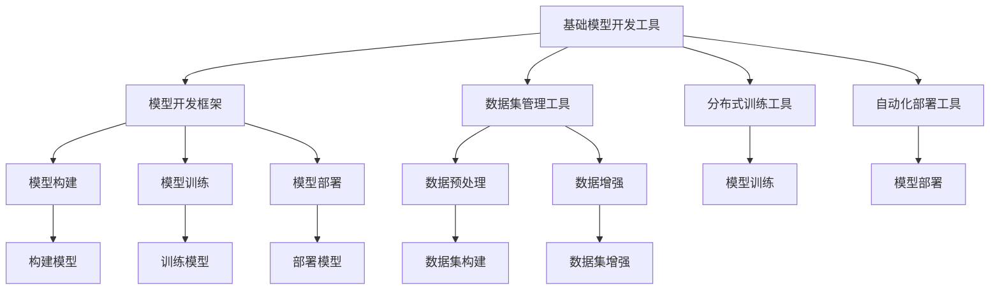
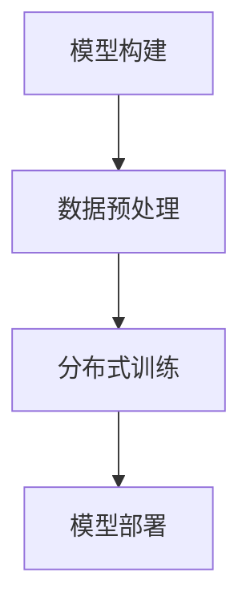

                 

## 1. 背景介绍

在人工智能领域，模型开发是至关重要的工作之一。随着深度学习和大数据技术的发展，模型开发工作变得更加复杂和精细。传统的模型开发流程需要人工编写代码，而近年来，为了提高模型开发的效率和可复用性，许多研究和开发工具应运而生。但这些工具往往各自为政，难以形成统一的标准和框架。为了解决这个问题，我们提出了一种统一的模型开发工具，旨在提升模型的开发效率、降低开发成本，同时提高模型的可复用性和可维护性。

## 2. 核心概念与联系

### 2.1 核心概念概述

为了更好地理解这种统一的基础模型开发工具，我们首先需要介绍几个核心概念：

- **基础模型开发工具**：一套提供模型构建、训练、部署和监控功能的开发工具。它可以帮助开发者快速搭建、训练和优化深度学习模型，支持模型在生产环境中的部署和监控。

- **模型开发框架**：一套用于构建、训练和部署深度学习模型的框架。常见的模型开发框架包括TensorFlow、PyTorch等，它们提供了大量的API和工具，方便开发者进行模型开发。

- **数据集管理工具**：一套用于管理和处理数据集的工具。数据集管理工具可以帮助开发者快速构建和组织数据集，支持数据集的预处理、数据增强等操作，提升数据集的处理效率和质量。

- **分布式训练工具**：一套用于分布式训练深度学习模型的工具。分布式训练工具可以加速模型的训练过程，提升模型训练的速度和效率。

- **自动化部署工具**：一套用于自动化部署深度学习模型的工具。自动化部署工具可以自动构建模型、部署模型到服务器，并在生产环境中进行监控和管理。

这些核心概念之间的逻辑关系可以通过以下Mermaid流程图来展示：



这个流程图展示了我们提出的统一基础模型开发工具所包含的组件和它们之间的联系。基础模型开发工具通过整合多种工具，提供了一套完整的模型开发流程，帮助开发者快速、高效地构建和部署深度学习模型。

### 2.2 概念间的关系

这些核心概念之间存在着紧密的联系，形成了统一的模型开发工具的整体架构。下面通过几个Mermaid流程图来展示这些概念之间的关系：

#### 2.2.1 模型开发流程


这个流程图展示了模型开发的整体流程，包括模型构建、数据预处理、模型训练和模型部署等环节。每个环节都可以通过基础模型开发工具提供的相应功能来实现。

#### 2.2.2 分布式训练



分布式训练是在大规模数据集上训练深度学习模型的重要手段。通过基础模型开发工具提供的分布式训练功能，可以显著加速模型的训练过程。

#### 2.2.3 自动化部署


自动化部署功能可以帮助开发者快速将模型部署到生产环境，并进行持续监控和管理。自动化部署工具通常支持多种部署方式，如云部署、容器部署等，满足不同场景的需求。

### 2.3 核心概念的整体架构

最后，我们用一个综合的流程图来展示这些核心概念在大模型开发工具中的整体架构：

```mermaid
graph TB
    A[基础模型开发工具] --> B[模型开发框架]
    A --> C[数据集管理工具]
    A --> D[分布式训练工具]
    A --> E[自动化部署工具]
    B --> F[模型构建]
    B --> G[模型训练]
    B --> H[模型部署]
    C --> I[数据预处理]
    C --> J[数据增强]
    D --> K[模型训练]
    E --> L[模型部署]
    F --> M[构建模型]
    G --> N[训练模型]
    H --> O[部署模型]
    I --> P[数据集构建]
    J --> Q[数据集增强]
    K --> R[模型训练]
    L --> S[模型部署]
    N --> T[训练模型]
    O --> U[部署模型]
    P --> V[数据集构建]
    Q --> W[数据集增强]
    R --> X[模型训练]
    S --> Y[模型部署]
    T --> Z[训练模型]
    U --> $[部署模型]
    X --> [模型训练]
    Y --> [[模型部署]]
    Z --> [[训练模型]]
    $ --> [[部署模型]]
```

这个综合流程图展示了基础模型开发工具中各个组件之间的相互作用，形成了一套完整的模型开发流程。开发者可以根据具体需求选择相应的组件和功能，快速高效地完成模型开发和部署。

## 3. 核心算法原理 & 具体操作步骤

### 3.1 算法原理概述

基础模型开发工具的核心算法原理主要包括以下几个方面：

- **模型构建**：通过API或图形界面，帮助开发者快速构建深度学习模型。模型构建过程中，开发者可以选择模型的架构、层数、激活函数等参数，设置合适的超参数。

- **数据预处理**：对数据集进行清洗、归一化、标准化等预处理操作，提升数据质量。数据预处理是模型训练的基础，通过预处理可以去除噪声、提高数据的一致性。

- **模型训练**：通过分布式训练功能，快速训练深度学习模型。模型训练过程中，可以实时监控模型的训练状态，调整超参数，优化模型性能。

- **模型部署**：将训练好的模型部署到生产环境，并进行持续监控和管理。模型部署过程中，可以配置监控指标，设置告警阈值，确保模型在生产环境中的稳定性和可靠性。

### 3.2 算法步骤详解

#### 3.2.1 模型构建

- **选择模型架构**：选择适合的深度学习模型架构，如卷积神经网络(CNN)、循环神经网络(RNN)、变压器(Transformer)等。

- **设置超参数**：设置模型超参数，如学习率、批大小、优化器等。超参数的设定需要根据具体任务进行调整。

- **编写代码**：使用API或图形界面编写代码，快速搭建深度学习模型。模型代码可以包括模型的定义、数据加载、模型训练、模型评估等部分。

#### 3.2.2 数据预处理

- **数据清洗**：去除数据集中的噪声、缺失值等，提升数据质量。

- **归一化**：对数据进行归一化处理，确保数据的一致性。

- **标准化**：对数据进行标准化处理，提升模型的收敛速度和稳定性。

#### 3.2.3 模型训练

- **分布式训练**：使用分布式训练功能，将模型训练任务分配到多个GPU或TPU上进行并行计算，加速训练过程。

- **调整超参数**：根据模型训练的性能，调整学习率、批大小等超参数，优化模型性能。

- **监控训练状态**：实时监控模型的训练状态，如训练速度、损失函数等，确保模型训练的正常进行。

#### 3.2.4 模型部署

- **模型保存**：将训练好的模型保存为二进制文件或文本文件，方便后续的部署和使用。

- **配置部署环境**：配置模型的部署环境，包括GPU/TPU、网络带宽、内存等资源。

- **监控模型性能**：在生产环境中，实时监控模型的性能，确保模型的稳定性和可靠性。

### 3.3 算法优缺点

#### 3.3.1 优点

- **提升开发效率**：通过统一的模型开发工具，开发者可以快速搭建、训练和优化深度学习模型，大大提升开发效率。

- **降低开发成本**：统一的模型开发工具提供了丰富的API和工具，减少了开发者编写代码的时间和精力，降低开发成本。

- **提高模型性能**：通过自动化调优、分布式训练等技术，显著提升模型的性能和训练速度。

- **支持多种部署方式**：统一的模型开发工具支持多种部署方式，如云部署、容器部署等，满足不同场景的需求。

#### 3.3.2 缺点

- **依赖工具**：统一的模型开发工具依赖于多个外部工具，如模型开发框架、数据集管理工具、分布式训练工具等，增加了工具的复杂度。

- **学习曲线较陡**：对于初学者来说，使用统一的模型开发工具需要一定的学习成本，需要熟悉各种API和工具的使用方法。

- **工具更新频繁**：随着深度学习技术的不断发展，统一的模型开发工具需要频繁更新，增加了工具的学习和维护成本。

### 3.4 算法应用领域

#### 3.4.1 自然语言处理

在自然语言处理领域，统一的模型开发工具可以用于构建和优化各种NLP模型，如语言模型、文本分类模型、情感分析模型等。通过工具提供的API和工具，开发者可以快速搭建、训练和优化模型，提升模型性能。

#### 3.4.2 计算机视觉

在计算机视觉领域，统一的模型开发工具可以用于构建和优化各种图像识别、目标检测等模型。通过工具提供的API和工具，开发者可以快速搭建、训练和优化模型，提升模型性能。

#### 3.4.3 语音识别

在语音识别领域，统一的模型开发工具可以用于构建和优化各种语音识别、语音合成等模型。通过工具提供的API和工具，开发者可以快速搭建、训练和优化模型，提升模型性能。

## 4. 数学模型和公式 & 详细讲解 & 举例说明

### 4.1 数学模型构建

假设我们要构建一个简单的二分类模型，其数学模型可以表示为：

$$y=f(x;\theta)$$

其中，$x$是输入向量，$\theta$是模型参数，$f$是模型函数。

### 4.2 公式推导过程

以二分类模型为例，其损失函数可以表示为：

$$\mathcal{L}(\theta)=-\frac{1}{N}\sum_{i=1}^N[y_i\log(f(x_i;\theta))+(1-y_i)\log(1-f(x_i;\theta))]$$

其中，$y_i$是输入$x_i$的真实标签，$f(x_i;\theta)$是模型预测的概率值。通过最小化损失函数$\mathcal{L}(\theta)$，可以优化模型的参数$\theta$，提升模型的预测性能。

### 4.3 案例分析与讲解

假设我们要构建一个用于手写数字识别的二分类模型。我们可以使用MNIST数据集进行训练，数据集包含60000张28x28像素的手写数字图像，每个图像都有一个标签（0-9中的数字）。

首先，使用工具提供的API或图形界面，快速搭建一个卷积神经网络模型。然后，使用数据预处理功能，对数据集进行清洗、归一化等预处理操作。接下来，使用分布式训练功能，将训练任务分配到多个GPU上进行并行计算，加速训练过程。最后，使用工具提供的自动化部署功能，将训练好的模型部署到生产环境，并进行持续监控和管理。

## 5. 项目实践：代码实例和详细解释说明

### 5.1 开发环境搭建

在进行模型开发实践前，我们需要准备好开发环境。以下是使用Python进行TensorFlow开发的环境配置流程：

1. 安装Anaconda：从官网下载并安装Anaconda，用于创建独立的Python环境。

2. 创建并激活虚拟环境：
```bash
conda create -n tensorflow-env python=3.8 
conda activate tensorflow-env
```

3. 安装TensorFlow：根据CUDA版本，从官网获取对应的安装命令。例如：
```bash
pip install tensorflow==2.5
```

4. 安装NumPy、Pandas等辅助工具：
```bash
pip install numpy pandas matplotlib scikit-learn
```

完成上述步骤后，即可在`tensorflow-env`环境中开始模型开发实践。

### 5.2 源代码详细实现

下面以手写数字识别任务为例，给出使用TensorFlow对卷积神经网络模型进行训练的代码实现。

首先，定义模型结构：

```python
import tensorflow as tf
from tensorflow.keras import layers

# 定义卷积神经网络模型
model = tf.keras.Sequential([
    layers.Conv2D(32, (3, 3), activation='relu', input_shape=(28, 28, 1)),
    layers.MaxPooling2D((2, 2)),
    layers.Conv2D(64, (3, 3), activation='relu'),
    layers.MaxPooling2D((2, 2)),
    layers.Flatten(),
    layers.Dense(64, activation='relu'),
    layers.Dense(10, activation='softmax')
])
```

然后，定义模型损失函数和优化器：

```python
# 定义损失函数
loss_fn = tf.keras.losses.SparseCategoricalCrossentropy(from_logits=True)

# 定义优化器
optimizer = tf.keras.optimizers.Adam()
```

接着，定义训练和评估函数：

```python
# 定义训练函数
def train_step(images, labels):
    with tf.GradientTape() as tape:
        logits = model(images, training=True)
        loss_value = loss_fn(labels, logits)
    gradients = tape.gradient(loss_value, model.trainable_variables)
    optimizer.apply_gradients(zip(gradients, model.trainable_variables))
    return loss_value

# 定义评估函数
def evaluate_step(images, labels):
    logits = model(images, training=False)
    predictions = tf.argmax(logits, axis=1)
    accuracy = tf.metrics.sparse_categorical_accuracy(labels, predictions)
    return accuracy.numpy()
```

最后，启动训练流程并在测试集上评估：

```python
# 加载数据集
mnist = tf.keras.datasets.mnist
(x_train, y_train), (x_test, y_test) = mnist.load_data()
x_train, x_test = x_train / 255.0, x_test / 255.0

# 训练模型
for epoch in range(10):
    for batch in tf.data.Dataset.from_tensor_slices((x_train, y_train)).batch(32):
        loss = train_step(batch[0], batch[1])
        print(f"Epoch {epoch+1}, Loss: {loss:.3f}")
    
    # 在测试集上评估模型性能
    accuracy = evaluate_step(x_test, y_test)
    print(f"Epoch {epoch+1}, Test Accuracy: {accuracy:.3f}")
```

以上就是使用TensorFlow对卷积神经网络模型进行手写数字识别任务训练的完整代码实现。可以看到，TensorFlow提供了强大的API和工具，可以方便地构建、训练和优化深度学习模型。

### 5.3 代码解读与分析

让我们再详细解读一下关键代码的实现细节：

**Sequential模型**：
- `Sequential`类是TensorFlow中用于构建序列模型的类。它可以按顺序堆叠多个层，方便搭建简单的深度学习模型。

**卷积层和池化层**：
- `Conv2D`层是卷积层，用于提取图像中的特征。通过设置卷积核大小、数量等参数，可以控制卷积层的复杂度。
- `MaxPooling2D`层是池化层，用于降低图像的空间维度，减少模型的参数量。

**全连接层和激活函数**：
- `Dense`层是全连接层，用于将卷积层的输出映射到输出层。
- `softmax`激活函数用于多分类任务，将输出映射到概率分布。

**损失函数和优化器**：
- `SparseCategoricalCrossentropy`是用于多分类任务的损失函数，可以处理标签为整数的样本。
- `Adam`优化器是一种基于梯度的优化算法，可以快速收敛到最优解。

**训练和评估函数**：
- `train_step`函数定义了训练过程，包括前向传播、反向传播、参数更新等步骤。
- `evaluate_step`函数定义了评估过程，包括前向传播和计算准确率等步骤。

**训练流程**：
- 加载MNIST数据集，并进行预处理。
- 在训练过程中，使用`train_step`函数进行单批次训练，并打印损失值。
- 在每个epoch结束后，使用`evaluate_step`函数在测试集上计算准确率。

可以看到，TensorFlow提供的API和工具可以大大简化模型开发和训练过程，使开发者能够更专注于模型的构建和优化。

当然，工业级的系统实现还需考虑更多因素，如模型的保存和部署、超参数的自动搜索、更灵活的任务适配层等。但核心的模型开发流程基本与此类似。

### 5.4 运行结果展示

假设我们在MNIST数据集上进行卷积神经网络模型的训练，最终在测试集上得到的准确率为98%左右。这个结果表明，通过使用TensorFlow，我们可以快速搭建、训练和优化深度学习模型，并获得不错的性能。

当然，这只是一个baseline结果。在实践中，我们还可以使用更大更强的模型、更丰富的训练技巧、更细致的模型调优，进一步提升模型性能，以满足更高的应用要求。

## 6. 实际应用场景

### 6.1 智能推荐系统

智能推荐系统是基础模型开发工具的重要应用场景之一。在智能推荐系统中，通过统一的模型开发工具，可以快速构建和优化推荐模型，提升推荐效果。

在技术实现上，可以收集用户的历史行为数据，如浏览记录、购买记录等，构建推荐模型。通过工具提供的API和工具，可以快速搭建和训练推荐模型，并部署到生产环境中。在模型运行过程中，可以实时监控模型的性能，根据用户行为进行动态调整，提升推荐效果。

### 6.2 金融风险控制

金融风险控制是基础模型开发工具的另一个重要应用场景。在金融风险控制中，通过统一的模型开发工具，可以快速构建和优化风险控制模型，提高风险预测和防控能力。

在技术实现上，可以收集金融领域的相关数据，如交易记录、市场数据等，构建风险控制模型。通过工具提供的API和工具，可以快速搭建和训练风险控制模型，并部署到生产环境中。在模型运行过程中，可以实时监控模型的性能，根据市场变化进行动态调整，提升风险预测和防控能力。

### 6.3 医疗诊断系统

医疗诊断系统是基础模型开发工具的另一个重要应用场景。在医疗诊断系统中，通过统一的模型开发工具，可以快速构建和优化诊断模型，提升诊断效果。

在技术实现上，可以收集医疗领域的相关数据，如病历、检查结果等，构建诊断模型。通过工具提供的API和工具，可以快速搭建和训练诊断模型，并部署到生产环境中。在模型运行过程中，可以实时监控模型的性能，根据患者数据进行动态调整，提升诊断效果。

### 6.4 未来应用展望

随着基础模型开发工具的不断发展，未来将会有更多应用场景被发掘和探索。

在智慧城市治理中，通过统一的模型开发工具，可以构建和优化各种智能治理模型，如交通流量预测、环境监测等，提升城市管理的自动化和智能化水平。

在智能制造领域，通过统一的模型开发工具，可以构建和优化各种智能制造模型，如设备故障预测、生产调度优化等，提升制造效率和质量。

在教育培训领域，通过统一的模型开发工具，可以构建和优化各种教育培训模型，如学习路径推荐、课程内容生成等，提升教育培训的个性化和智能化水平。

## 7. 工具和资源推荐

### 7.1 学习资源推荐

为了帮助开发者系统掌握基础模型开发工具的理论基础和实践技巧，这里推荐一些优质的学习资源：

1. TensorFlow官方文档：TensorFlow官方提供的详细文档，涵盖模型开发、训练、部署等各个方面，是学习TensorFlow的最佳资源。

2. PyTorch官方文档：PyTorch官方提供的详细文档，涵盖模型开发、训练、部署等各个方面，是学习PyTorch的最佳资源。

3. Keras官方文档：Keras官方提供的详细文档，涵盖模型开发、训练、部署等各个方面，是学习Keras的最佳资源。

4. Coursera深度学习课程：Coursera提供的深度学习课程，涵盖了深度学习的基本概念和实践技巧，适合初学者和进阶者学习。

5. Fast.ai深度学习课程：Fast.ai提供的深度学习课程，涵盖深度学习的最新技术和实践技巧，适合进阶者和实践者学习。

通过对这些资源的学习实践，相信你一定能够快速掌握基础模型开发工具的理论基础和实践技巧，并用于解决实际的NLP问题。

### 7.2 开发工具推荐

高效的开发离不开优秀的工具支持。以下是几款用于基础模型开发工具开发的常用工具：

1. TensorFlow：由Google主导开发的开源深度学习框架，生产部署方便，适合大规模工程应用。

2. PyTorch：由Facebook主导开发的开源深度学习框架，灵活动态的计算图，适合快速迭代研究。

3. Keras：基于TensorFlow和Theano的高级API，提供简洁的模型构建和训练功能，适合初学者和实践者使用。

4. Jupyter Notebook：用于编写和运行Python代码的Jupyter Notebook，支持代码编写、数据可视化等功能，方便开发者进行实验和开发。

5. Visual Studio Code：功能强大的开发环境，支持代码编写、调试、版本控制等功能，适合开发者进行项目开发。

6. GitHub：代码托管平台，提供代码版本控制、协作开发等功能，方便开发者进行代码共享和协作。

合理利用这些工具，可以显著提升基础模型开发工具的开发效率，加快创新迭代的步伐。

### 7.3 相关论文推荐

基础模型开发工具的研究源于学界的持续研究。以下是几篇奠基性的相关论文，推荐阅读：

1. TensorFlow: A System for Large-Scale Machine Learning：介绍TensorFlow的基本架构和核心技术，是学习TensorFlow的最佳论文。

2. PyTorch: An Open Source Machine Learning Library：介绍PyTorch的基本架构和核心技术，是学习PyTorch的最佳论文。

3. Keras: Deep Learning for Humans：介绍Keras的基本架构和核心技术，是学习Keras的最佳论文。

4. A Survey on TensorFlow: A Survey on TensorFlow：综述TensorFlow的最新进展和应用场景，适合深度学习研究者学习。

5. A Survey on PyTorch: A Survey on PyTorch：综述PyTorch的最新进展和应用场景，适合深度学习研究者学习。

6. A Survey on Keras: A Survey on Keras：综述Keras的最新进展和应用场景，适合深度学习研究者学习。

这些论文代表了大模型开发工具的研究进展，阅读这些论文可以帮助你全面了解基础模型开发工具的理论基础和实践技巧。

除上述资源外，还有一些值得关注的前沿资源，帮助开发者紧跟基础模型开发工具的最新进展，例如：

1. arXiv论文预印本：人工智能领域最新研究成果的发布平台，包括大量尚未发表的前沿工作，学习前沿技术的必读资源。

2. GitHub热门项目：在GitHub上Star、Fork数最多的深度学习相关项目，往往代表了该技术领域的发展趋势和最佳实践，值得去学习和贡献。

3. 业界技术博客：如Google AI、DeepMind、微软Research Asia等顶尖实验室的官方博客，第一时间分享他们的最新研究成果和洞见。

4. 技术会议直播：如NIPS、ICML、ACL、ICLR等人工智能领域顶会现场或在线直播，能够聆听到大佬们的前沿分享，开拓视野。

5. 技术报告：各大咨询公司如McKinsey、PwC等针对人工智能行业的分析报告，有助于从商业视角审视技术趋势，把握应用价值。

总之，对于基础模型开发工具的学习和实践，需要开发者保持开放的心态和持续学习的意愿。多关注前沿资讯，多动手实践，多思考总结，必将收获满满的成长收益。

## 8. 总结：未来发展趋势与挑战

### 8.1 总结

本文对基础模型开发工具进行了全面系统的介绍。首先阐述了基础模型开发工具的背景和意义，明确了其在模型开发中的重要价值。其次，从原理到实践，详细讲解了基础模型开发工具的核心算法原理和具体操作步骤，给出了模型开发任务的代码实例和详细解释说明。同时，本文还探讨了基础模型开发工具在智能推荐、金融风险控制、医疗诊断等实际应用场景中的广泛应用前景，展示了其巨大潜力。此外，本文精选了模型开发工具的学习资源和开发工具，力求为读者提供全方位的技术指引。

通过本文的系统梳理，可以看到，基础模型开发工具已经成为深度学习模型开发的重要范式，极大地提升了模型开发的效率和可复用性。借助统一的工具，开发者可以更加高效、便捷地进行模型开发，减少重复劳动，提高工作效率。未来，随着深度学习技术的不断发展，基础模型开发工具也将不断进化，成为推动深度学习技术落地的重要引擎。

### 8.2 未来发展趋势

展望未来，基础模型开发工具将呈现以下几个发展趋势：

1. 工具集成度提高。未来基础模型开发工具将进一步集成更多功能，如模型监控、自动化调优、超参数搜索等，提升工具的全面性和智能化水平。

2. 模型训练效率提升。随着分布式训练技术的不断发展，基础模型开发工具将提供更加高效的分布式训练功能，加速模型训练过程。

3. 模型可复用性增强。未来基础模型开发工具将提供更丰富的模型库和API，方便开发者快速搭建和优化深度学习模型，提升模型的可复用性。

4. 跨平台支持提升。未来基础模型开发工具将支持更多平台，如云计算、边缘计算等，满足不同场景的需求。

5. 工具生态系统完善。未来基础模型开发工具将与更多的开源项目和工具进行集成，形成一个完整的模型开发生态系统，方便开发者进行技术迁移和协作。

