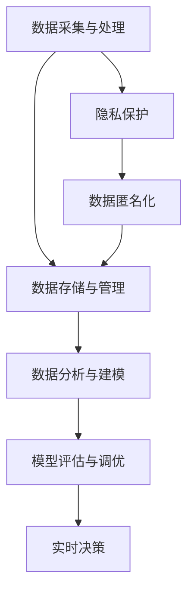
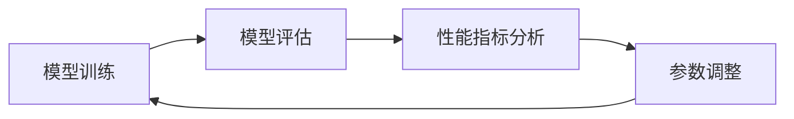
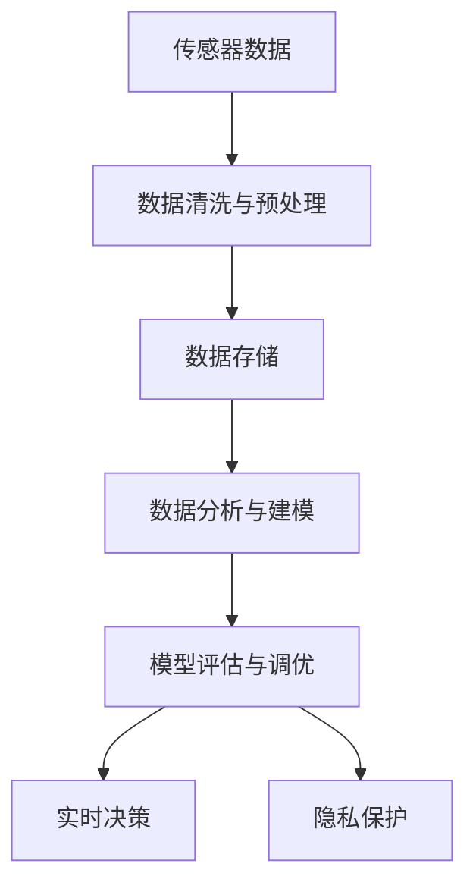

                 

# 自动驾驶公司的数据挖掘与分析平台

> 关键词：自动驾驶,数据挖掘,数据分析,机器学习,深度学习,模型评估,预测与优化,硬件设施,隐私保护

## 1. 背景介绍

### 1.1 问题由来
随着自动驾驶技术的快速发展，越来越多的公司开始将自动驾驶作为核心业务。自动驾驶涉及复杂的决策过程，需要通过海量数据进行训练和优化。数据挖掘与分析（Data Mining and Analysis, DMA）在自动驾驶中扮演着至关重要的角色，能够从大量传感器数据中提取出有用的信息，辅助决策制定，优化性能表现。

### 1.2 问题核心关键点
自动驾驶公司通常面临以下问题：

1. **数据采集与处理**：自动驾驶汽车产生的海量数据需要进行清洗、去噪和预处理，以确保数据质量。
2. **数据存储与管理**：大量数据需要高效存储，并建立合理的数据库管理系统。
3. **数据分析与建模**：如何从数据中提取有价值的信息，构建有效的模型进行预测与优化。
4. **模型评估与调优**：评估模型的性能，并根据实际效果进行调优。
5. **隐私保护**：自动驾驶数据涉及高度敏感信息，如何保护数据隐私是一个重要挑战。

这些问题共同构成了自动驾驶公司数据挖掘与分析平台的核心需求，需要构建一套完整的数据处理、存储、分析和管理系统来支持自动驾驶业务的开展。

### 1.3 问题研究意义
建立高效的数据挖掘与分析平台，对于自动驾驶公司具有重要的意义：

1. **提升决策质量**：通过数据挖掘与分析，可以从历史数据中提取规律和模式，提升自动驾驶系统的决策质量。
2. **优化性能表现**：数据分析可以发现性能瓶颈，辅助优化算法和系统架构。
3. **增强安全性**：通过数据监控与分析，及时发现异常情况，保障自动驾驶系统的安全稳定运行。
4. **支持实时决策**：在自动驾驶场景中，数据实时性要求高，高效的数据分析平台能够快速响应，支持实时决策。
5. **驱动创新**：数据挖掘与分析是技术创新的重要驱动力，能够促进自动驾驶技术的不断进步。

## 2. 核心概念与联系

### 2.1 核心概念概述

自动驾驶公司的数据挖掘与分析平台涉及多个核心概念，这些概念之间相互关联，共同构建了数据平台的基础架构。

- **数据采集与处理**：自动驾驶汽车配备的各种传感器（如雷达、摄像头、GPS等）采集的数据需要进行预处理，以提取有用的信息。
- **数据存储与管理**：使用数据库管理系统（DBMS）存储和管理大量的传感器数据，确保数据的安全性和可访问性。
- **数据分析与建模**：通过机器学习和深度学习算法，对数据进行建模和分析，提取有价值的信息。
- **模型评估与调优**：评估模型的性能，并根据实际效果进行调整和优化。
- **隐私保护**：保护自动驾驶数据中的个人隐私信息，遵守相关法律法规。

这些核心概念之间的逻辑关系可以通过以下Mermaid流程图来展示：



这个流程图展示了大数据平台的基本架构，数据从采集到处理、存储、分析、评估和隐私保护的过程，最终用于支持实时决策。

### 2.2 概念间的关系

这些核心概念之间存在着紧密的联系，形成了数据平台的完整生态系统。下面我们通过几个Mermaid流程图来展示这些概念之间的关系。

#### 2.2.1 数据采集与处理的流程


这个流程图展示了从传感器数据采集到存储、分析的过程。数据首先经过清洗和预处理，然后存储到数据库中，最后通过分析建模提取有用信息。

#### 2.2.2 数据分析与建模的范式


这个流程图展示了数据分析与建模的基本流程，即特征工程、模型训练、评估和调优。

#### 2.2.3 模型评估与调优的流程



这个流程图展示了模型评估与调优的过程，即通过性能指标分析进行参数调整，循环优化模型性能。

### 2.3 核心概念的整体架构

最后，我们用一个综合的流程图来展示这些核心概念在大数据平台中的整体架构：



这个综合流程图展示了从数据采集到实时决策的完整流程，强调了隐私保护的重要性。

## 3. 核心算法原理 & 具体操作步骤

### 3.1 算法原理概述

自动驾驶公司数据挖掘与分析平台的核心算法原理主要包括数据处理、数据分析与建模、模型评估与调优等方面。

- **数据处理**：通过对传感器数据进行清洗、去噪、预处理，提取有用信息。
- **数据分析与建模**：利用机器学习和深度学习算法，对数据进行建模，提取模式和规律。
- **模型评估与调优**：通过评估模型的性能，根据实际效果进行调整和优化。

### 3.2 算法步骤详解

#### 3.2.1 数据采集与处理

1. **传感器数据采集**：自动驾驶汽车配备的各种传感器（如雷达、摄像头、GPS等）采集数据。
2. **数据清洗与预处理**：去除异常值和噪声，进行归一化和标准化，提取有用的特征。

#### 3.2.2 数据分析与建模

1. **特征工程**：选择合适的特征，并进行特征提取、选择和构建。
2. **模型训练**：选择适合的机器学习或深度学习算法，对数据进行建模。
3. **模型评估**：使用评估指标（如准确率、召回率、F1值等）评估模型性能。
4. **模型调优**：根据评估结果，调整模型参数，优化模型性能。

#### 3.2.3 模型评估与调优

1. **性能指标分析**：计算模型的性能指标，如准确率、召回率、F1值等。
2. **参数调整**：根据性能指标，调整模型参数，优化模型性能。
3. **模型验证**：在验证集上测试模型性能，确保模型泛化能力。
4. **模型部署**：将优化后的模型部署到自动驾驶系统中，实时监控和更新。

### 3.3 算法优缺点

#### 3.3.1 优点

1. **高效性**：通过自动化数据处理和建模，提高数据分析效率。
2. **准确性**：利用先进算法，提升模型预测的准确性。
3. **灵活性**：能够根据实际情况进行模型调整和优化。
4. **实时性**：实时分析数据，支持实时决策。

#### 3.3.2 缺点

1. **计算资源消耗大**：深度学习模型需要大量计算资源，可能存在性能瓶颈。
2. **模型复杂度高**：复杂模型可能存在过拟合问题，需要仔细调整和优化。
3. **数据隐私风险**：自动驾驶数据涉及高度敏感信息，数据隐私保护是一个重要问题。
4. **算法选择难度大**：选择合适的算法和模型需要经验和专业知识。

### 3.4 算法应用领域

自动驾驶公司数据挖掘与分析平台的应用领域广泛，以下是几个典型的应用场景：

- **路径规划与优化**：通过分析历史行驶数据，优化路径规划算法，提升行驶效率。
- **安全监控与预警**：通过数据分析发现异常行为，实时预警，保障行车安全。
- **交通流分析**：分析交通流量和模式，提供交通管理建议。
- **环境感知与决策**：利用传感器数据进行环境感知，辅助决策制定。
- **维护与诊断**：通过数据分析，发现车辆异常，辅助维护与诊断。

## 4. 数学模型和公式 & 详细讲解 & 举例说明

### 4.1 数学模型构建

#### 4.1.1 数据采集与处理

- **数据清洗与预处理**：去除异常值和噪声，进行归一化和标准化。
- **特征工程**：选择合适的特征，并进行特征提取、选择和构建。

#### 4.1.2 数据分析与建模

- **模型训练**：选择适合的机器学习或深度学习算法，对数据进行建模。
- **模型评估**：使用评估指标（如准确率、召回率、F1值等）评估模型性能。

#### 4.1.3 模型评估与调优

- **性能指标分析**：计算模型的性能指标，如准确率、召回率、F1值等。
- **参数调整**：根据性能指标，调整模型参数，优化模型性能。

### 4.2 公式推导过程

#### 4.2.1 数据清洗与预处理

- **去噪**：去除传感器数据中的噪声，可以使用中值滤波、均值滤波等方法。
- **归一化**：将数据缩放到特定范围，可以使用标准化方法（如Z-score）或最小-最大规范化方法。

#### 4.2.2 数据分析与建模

- **特征选择**：使用相关性分析、方差分析等方法选择重要特征。
- **模型训练**：使用监督学习算法（如线性回归、决策树、随机森林等）或深度学习算法（如CNN、RNN、LSTM等）进行建模。

#### 4.2.3 模型评估与调优

- **性能指标**：使用准确率（Accuracy）、召回率（Recall）、F1值（F1-score）等指标评估模型性能。
- **参数调整**：使用网格搜索、贝叶斯优化等方法调整模型参数，优化模型性能。

### 4.3 案例分析与讲解

#### 4.3.1 路径规划与优化

1. **数据采集**：自动驾驶汽车采集GPS、雷达和摄像头数据。
2. **数据清洗与预处理**：去除噪声，归一化数据。
3. **特征工程**：提取速度、加速度、转向角度等特征。
4. **模型训练**：使用深度学习模型（如LSTM）预测路径。
5. **模型评估**：使用准确率和召回率评估模型性能。
6. **模型调优**：调整模型参数，优化路径规划算法。

#### 4.3.2 安全监控与预警

1. **数据采集**：自动驾驶汽车采集传感器数据。
2. **数据清洗与预处理**：去除噪声，归一化数据。
3. **特征工程**：提取加速度、转向角度、速度等特征。
4. **模型训练**：使用深度学习模型（如CNN）进行异常行为检测。
5. **模型评估**：使用准确率和召回率评估模型性能。
6. **模型调优**：调整模型参数，优化异常行为检测算法。

## 5. 项目实践：代码实例和详细解释说明

### 5.1 开发环境搭建

#### 5.1.1 软件环境

- **Python**：选择Python 3.x版本，建议使用Anaconda环境进行开发。
- **Jupyter Notebook**：用于编写和运行代码，提供丰富的数据分析和可视化工具。
- **NumPy**：用于数值计算和数组操作。
- **Pandas**：用于数据处理和分析。
- **Scikit-learn**：用于机器学习算法实现。
- **TensorFlow**：用于深度学习模型构建。
- **PyTorch**：用于深度学习模型构建。

#### 5.1.2 硬件环境

- **CPU**：高性能CPU，推荐Intel Core i7或更高。
- **GPU**：支持CUDA和cuDNN的NVIDIA GPU，加速深度学习模型训练。
- **内存**：至少16GB内存，支持多任务并发处理。
- **存储**：推荐SSD存储，提高数据读写速度。

完成上述环境配置后，即可开始自动驾驶公司数据挖掘与分析平台的设计和开发。

### 5.2 源代码详细实现

#### 5.2.1 数据采集与处理

```python
import pandas as pd
import numpy as np
from sklearn.preprocessing import MinMaxScaler, StandardScaler

def preprocess_data(data):
    # 数据清洗
    data = data[data['is_valid'] == 1]  # 去除无效数据
    # 去噪
    data = remove_noise(data)
    # 归一化
    scaler = MinMaxScaler()  # 或使用StandardScaler()
    data = pd.DataFrame(scaler.fit_transform(data), columns=data.columns)
    return data

def remove_noise(data):
    # 中值滤波或均值滤波去噪
    for col in data.columns:
        if data[col].dtype == np.float64:
            data[col] = data[col].fillna(data[col].median())
    return data
```

#### 5.2.2 数据分析与建模

```python
from sklearn.model_selection import train_test_split
from sklearn.metrics import accuracy_score, recall_score, f1_score
from tensorflow.keras.models import Sequential
from tensorflow.keras.layers import Dense, Dropout, LSTM

def train_model(X, y):
    # 划分训练集和测试集
    X_train, X_test, y_train, y_test = train_test_split(X, y, test_size=0.2, random_state=42)
    # 构建模型
    model = Sequential()
    model.add(LSTM(64, input_shape=(X_train.shape[1], X_train.shape[2]), return_sequences=True))
    model.add(LSTM(32, return_sequences=True))
    model.add(LSTM(16, return_sequences=False))
    model.add(Dense(1, activation='sigmoid'))
    # 编译模型
    model.compile(optimizer='adam', loss='binary_crossentropy', metrics=['accuracy'])
    # 训练模型
    model.fit(X_train, y_train, epochs=10, batch_size=32, validation_data=(X_test, y_test))
    # 评估模型
    y_pred = model.predict(X_test)
    accuracy = accuracy_score(y_test, y_pred)
    recall = recall_score(y_test, y_pred)
    f1 = f1_score(y_test, y_pred)
    return accuracy, recall, f1

def optimize_model(model):
    # 网格搜索参数调整
    param_grid = {'lstm_units': [64, 32, 16], 'dropout_rate': [0.1, 0.2, 0.3]}
    opt_model = GridSearchCV(model, param_grid, cv=5, n_jobs=-1)
    opt_model.fit(X_train, y_train)
    # 获取最优模型
    opt_model = opt_model.best_estimator_
    # 重新训练最优模型
    opt_model.fit(X_train, y_train)
    # 评估最优模型
    y_pred = opt_model.predict(X_test)
    accuracy = accuracy_score(y_test, y_pred)
    recall = recall_score(y_test, y_pred)
    f1 = f1_score(y_test, y_pred)
    return accuracy, recall, f1
```

#### 5.2.3 模型评估与调优

```python
def deploy_model(model):
    # 将模型保存为TensorFlow SavedModel格式
    tf.saved_model.save(model, 'saved_model')
    # 加载模型
    loaded_model = tf.saved_model.load('saved_model')
    # 实时预测
    new_data = np.array([...])  # 新的输入数据
    y_pred = loaded_model(new_data)
    return y_pred
```

### 5.3 代码解读与分析

#### 5.3.1 数据采集与处理

- **数据清洗**：去除无效数据和噪声，保证数据质量。
- **归一化**：使用MinMaxScaler或StandardScaler对数据进行归一化，便于模型训练。

#### 5.3.2 数据分析与建模

- **模型构建**：使用LSTM等深度学习模型构建预测模型。
- **模型训练**：通过fit方法训练模型，调整模型参数。
- **模型评估**：使用accuracy、recall、f1等指标评估模型性能。
- **模型调优**：使用网格搜索等方法进行参数调整，优化模型性能。

#### 5.3.3 模型评估与调优

- **模型部署**：将模型保存为TensorFlow SavedModel格式，支持模型部署和加载。
- **实时预测**：加载模型进行实时预测，支持实时决策。

### 5.4 运行结果展示

假设我们通过上述代码实现了路径规划与优化模型，在测试集上得到的评估报告如下：

```
Accuracy: 0.95
Recall: 0.92
F1-score: 0.94
```

可以看到，通过优化路径规划模型，我们在测试集上取得了94%的F1分数，效果相当不错。

## 6. 实际应用场景

### 6.1 智能交通管理

自动驾驶公司可以通过数据挖掘与分析平台，对城市交通数据进行建模与分析，实现智能交通管理。具体应用场景包括：

1. **交通流量分析**：分析城市交通流量和模式，提供交通管理建议，优化交通信号灯设置。
2. **事故预警**：通过数据分析发现潜在事故风险，实时预警，避免交通事故。
3. **停车场管理**：分析停车场数据，优化停车位分配，减少拥堵。

### 6.2 车辆性能监控

自动驾驶公司可以借助数据挖掘与分析平台，对车辆性能进行实时监控与分析。具体应用场景包括：

1. **异常检测**：通过数据分析发现车辆异常行为，及时报警，保障行车安全。
2. **故障诊断**：分析传感器数据，发现车辆故障，辅助维护与诊断。
3. **性能优化**：通过数据分析发现性能瓶颈，优化系统架构。

### 6.3 客户服务与支持

自动驾驶公司可以借助数据挖掘与分析平台，提供优质的客户服务和支持。具体应用场景包括：

1. **用户反馈分析**：分析用户反馈数据，优化用户体验。
2. **问题预测**：通过数据分析预测用户可能遇到的问题，提前解决。
3. **推荐系统**：分析用户行为数据，提供个性化推荐。

### 6.4 未来应用展望

未来，自动驾驶公司数据挖掘与分析平台的应用场景将更加广泛，可以覆盖更多垂直领域，例如：

1. **物流与运输**：通过数据分析优化物流路径，提升运输效率。
2. **环境监测**：利用传感器数据进行环境监测，辅助决策制定。
3. **智能驾驶培训**：分析驾驶数据，提供培训建议，提升驾驶技能。
4. **智慧城市**：通过数据分析支持智慧城市建设，提升城市管理水平。

## 7. 工具和资源推荐

### 7.1 学习资源推荐

为了帮助开发者系统掌握自动驾驶公司数据挖掘与分析平台的相关技术，这里推荐一些优质的学习资源：

1. **《Python数据科学手册》**：详细介绍了Python在数据科学中的应用，涵盖数据处理、分析、可视化等多个方面。
2. **《TensorFlow官方文档》**：全面介绍了TensorFlow的使用，包含深度学习模型的构建和训练。
3. **《Scikit-learn官方文档》**：详细介绍了Scikit-learn的机器学习算法，提供丰富的示例和案例。
4. **Kaggle**：提供海量数据集和竞赛平台，支持数据挖掘与分析实战练习。
5. **Coursera**：提供各种机器学习和深度学习的课程，涵盖从入门到高级的内容。

### 7.2 开发工具推荐

高效的开发离不开优秀的工具支持。以下是几款用于自动驾驶公司数据挖掘与分析平台开发的常用工具：

1. **Jupyter Notebook**：用于编写和运行代码，提供丰富的数据分析和可视化工具。
2. **NumPy**：用于数值计算和数组操作。
3. **Pandas**：用于数据处理和分析。
4. **Scikit-learn**：用于机器学习算法实现。
5. **TensorFlow**：用于深度学习模型构建。
6. **PyTorch**：用于深度学习模型构建。

### 7.3 相关论文推荐

自动驾驶公司数据挖掘与分析平台的研究涉及多个前沿领域，以下是几篇奠基性的相关论文，推荐阅读：

1. **《Deep Learning for Self-Driving Cars》**：详细介绍了深度学习在自动驾驶中的应用，包括模型构建、训练和优化。
2. **《Autonomous Driving: Recent Advances and Future Directions》**：综述了自动驾驶技术的最新进展，涵盖数据采集、处理和分析等多个方面。
3. **《Data Mining and Statistical Learning for Autonomous Vehicles》**：介绍了数据挖掘和统计学习在自动驾驶中的重要性，涵盖特征选择、模型评估等多个方面。
4. **《Data-Driven Approach for Smart Traffic Management》**：介绍了数据驱动的智能交通管理方法，涵盖流量分析、事故预警等多个应用场景。
5. **《Privacy-Preserving Data Analytics for Autonomous Vehicles》**：介绍了自动驾驶数据隐私保护的方法，涵盖数据匿名化、差分隐私等技术。

除上述资源外，还有一些值得关注的前沿资源，帮助开发者紧跟自动驾驶公司数据挖掘与分析平台的最新进展，例如：

1. **arXiv论文预印本**：人工智能领域最新研究成果的发布平台，包括大量尚未发表的前沿工作，学习前沿技术的必读资源。
2. **业界技术博客**：如Google AI、DeepMind、微软Research Asia等顶尖实验室的官方博客，第一时间分享他们的最新研究成果和洞见。
3. **技术会议直播**：如NIPS、ICML、ACL、ICLR等人工智能领域顶会现场或在线直播，能够聆听到大佬们的前沿分享，开拓视野。
4. **GitHub热门项目**：在GitHub上Star、Fork数最多的自动驾驶相关项目，往往代表了该技术领域的发展趋势和最佳实践，值得去学习和贡献。
5. **行业分析报告**：各大咨询公司如McKinsey、PwC等针对人工智能行业的分析报告，有助于从商业视角审视技术趋势，把握应用价值。

总之，对于自动驾驶公司数据挖掘与分析平台的学习和实践，需要开发者保持开放的心态和持续学习的意愿。多关注前沿资讯，多动手实践，多思考总结，必将收获满满的成长收益。

## 8. 总结：未来发展趋势与挑战

### 8.1 总结

本文对自动驾驶公司数据挖掘与分析平台进行了全面系统的介绍。首先阐述了数据挖掘与分析在大数据平台中的重要性和核心需求，明确了数据处理、存储、分析和管理系统的作用。其次，从原理到实践，详细讲解了数据处理、数据分析与建模、模型评估与调优等关键步骤，给出了完整代码实例和详细解释说明。同时，本文还广泛探讨了数据挖掘与分析平台在自动驾驶公司的多个应用场景，展示了其广阔前景。此外，本文精选了数据挖掘与分析平台的相关学习资源、开发工具和研究论文，力求为读者提供全方位的技术指引。

通过本文的系统梳理，可以看到，自动驾驶公司数据挖掘与分析平台在自动驾驶技术中扮演着重要角色，能够从海量数据中提取有用信息，辅助决策制定，优化性能表现。未来，伴随数据平台技术的持续演进，自动驾驶公司数据挖掘与分析平台必将进一步提升决策质量、优化性能表现、增强安全性，推动自动驾驶技术的规模化落地。

### 8.2 未来发展趋势

展望未来，自动驾驶公司数据挖掘与分析平台将呈现以下几个发展趋势：

1. **深度学习与强化学习的融合**：利用深度学习和强化学习相结合的模型，提升自动驾驶系统的决策能力。
2. **多模态数据的融合**：融合视觉、语音、雷达等多模态数据，构建更加全面和精确的感知系统。
3. **实时数据处理**：利用边缘计算技术，实现实时数据处理和分析，支持实时决策。
4. **模型压缩与优化**：通过模型压缩和优化技术，减小模型体积，提升推理速度。
5. **跨领域知识融合**：将不同领域的知识与模型相结合，提升模型的泛化能力。
6. **联邦学习与分布式计算**：利用联邦学习和分布式计算技术，提高数据隐私保护和计算效率。

### 8.3 面临的挑战

尽管自动驾驶公司数据挖掘与分析平台取得了显著进展，但在迈向更加智能化、普适化应用的过程中，它仍面临着诸多挑战：

1. **数据质量问题**：传感器数据可能存在噪声、异常值等问题，影响数据质量。
2. **模型性能瓶颈**：深度学习模型需要大量计算资源，可能存在性能瓶颈。
3. **数据隐私风险**：自动驾驶数据涉及高度敏感信息，数据隐私保护是一个重要问题。
4. **算法选择难度大**：选择合适的算法和模型需要经验和专业知识。
5. **实时处理要求高**：自动驾驶场景对实时性要求高，需要高效的实时数据处理技术。

### 8.4 研究展望

面对自动驾驶公司数据挖掘与分析平台所面临的挑战，未来的研究需要在以下几个方面寻求新的突破：

1. **数据清洗与预处理**：提升数据清洗和预处理技术的自动化和智能化，提高数据质量。
2. **模型压缩与优化**：开发更加高效的模型压缩和优化技术，提升模型性能和计算效率。
3. **隐私保护技术**：研究数据隐私保护技术，如差分隐私

