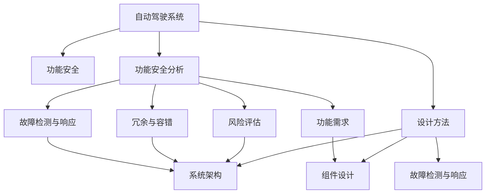
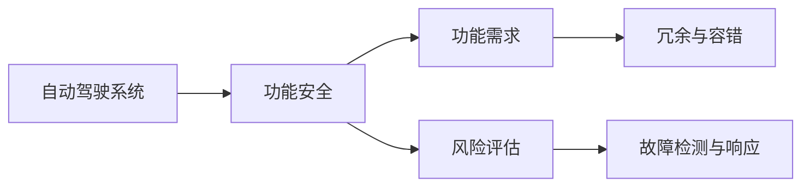
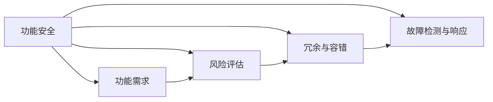
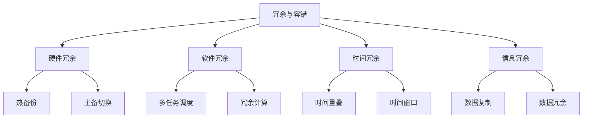
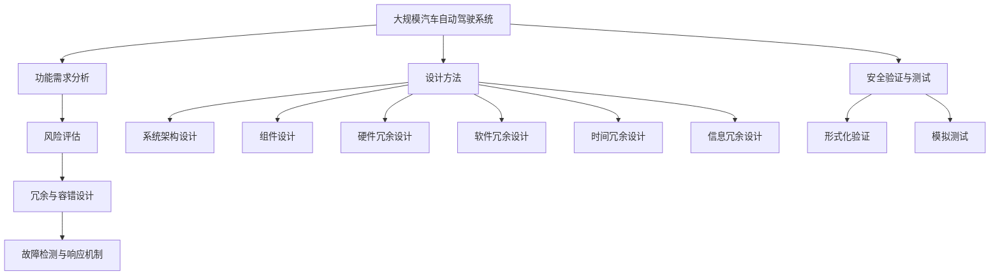
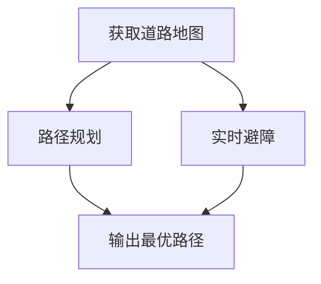
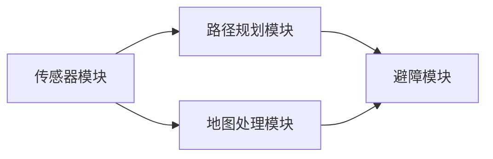

                 

# 自动驾驶行业的功能安全分析与设计方法

> 关键词：自动驾驶,功能安全,设计方法,车辆,汽车

## 1. 背景介绍

### 1.1 问题由来
随着自动驾驶技术的飞速发展，其应用场景从最初的实验室测试逐步扩展到实际道路测试和商业化部署。与此同时，功能安全也成为自动驾驶系统设计和应用中的核心议题。特别是在自动驾驶汽车上路运行时，任何错误或系统失效都可能导致严重的安全事故，给驾驶人和行人带来巨大风险。因此，如何从系统设计层面确保自动驾驶系统的功能安全，成为当前自动驾驶行业和研究机构关注的重点。

### 1.2 问题核心关键点
自动驾驶系统的功能安全设计主要关注以下核心关键点：

- **功能需求分析**：从系统的实际应用场景出发，明确系统需要实现的功能，并对这些功能进行系统化分析，确保所有功能需求都得到充分覆盖。
- **风险评估**：对系统可能面临的各种潜在风险进行评估，识别可能导致功能失效的各类危险源。
- **冗余与容错**：在关键功能模块和系统架构中引入冗余设计，确保在某一模块或子系统失效时，系统整体功能不受影响。
- **故障检测与响应**：设计能够实时检测系统故障和异常的机制，并采取快速响应措施，以保障系统的安全性。
- **安全验证与测试**：通过严格的验证和测试过程，确保系统设计符合功能安全标准，并进行风险验证和系统测试。

### 1.3 问题研究意义
研究自动驾驶系统的功能安全设计方法，对于保障自动驾驶技术的安全可靠运行，提升公众对自动驾驶的信心，具有重要的理论和实践意义：

1. **保障安全**：确保自动驾驶系统在各种复杂环境和突发情况下，依然能够保持高度的安全性和可靠性，避免交通事故。
2. **增强可信度**：通过对功能安全设计的严格要求和验证，提升公众对自动驾驶技术的接受度和信任度。
3. **指导标准**：为自动驾驶系统的设计、开发和应用提供统一的标准和规范，促进行业标准化和规范化。
4. **提升效率**：通过科学合理的设计，减少系统故障和异常情况，提高系统的运行效率和用户体验。
5. **促进发展**：功能安全设计方法的研究，可以为自动驾驶技术的进一步发展和创新提供重要的理论支撑和技术指导。

## 2. 核心概念与联系

### 2.1 核心概念概述

为更好地理解自动驾驶系统的功能安全设计方法，本节将介绍几个密切相关的核心概念：

- **自动驾驶系统**：基于人工智能、计算机视觉、传感器融合等技术，实现车辆自主导航、路径规划和避障等功能。
- **功能安全**：确保系统在预期使用条件下，能够按照设计要求执行其预定功能，避免对人身、财产和环境造成损害。
- **功能安全分析**：通过系统建模、风险评估等手段，识别和消除系统中的安全风险，保证系统的功能安全。
- **设计方法**：具体的设计过程、工具和技术，用于实现系统的功能安全和性能优化。
- **冗余与容错**：在关键组件和系统架构中引入备份和恢复机制，增强系统的鲁棒性和可靠性。
- **故障检测与响应**：设计实时监控系统状态，在检测到异常时立即采取相应措施，防止系统故障扩散。
- **安全验证与测试**：通过形式化验证、模拟测试等手段，确保系统的功能和安全要求得到满足。

这些核心概念之间的逻辑关系可以通过以下Mermaid流程图来展示：



这个流程图展示了几大核心概念之间的联系：

1. 自动驾驶系统作为基础，需要进行功能安全设计，通过功能安全分析来识别和消除风险。
2. 功能安全分析包括功能需求识别、风险评估、冗余与容错设计、故障检测与响应等环节。
3. 设计方法涵盖了系统架构、组件设计和故障检测与响应等具体技术。

### 2.2 概念间的关系

这些核心概念之间存在着紧密的联系，形成了自动驾驶系统功能安全设计的完整生态系统。下面我们通过几个Mermaid流程图来展示这些概念之间的关系。

#### 2.2.1 自动驾驶系统的功能安全设计



这个流程图展示了自动驾驶系统从设计到功能安全的具体过程：从系统需求分析开始，识别功能需求和潜在风险，引入冗余与容错设计，以及故障检测与响应机制，最终实现功能安全。

#### 2.2.2 功能安全分析与设计方法的关系



这个流程图展示了功能安全分析与设计方法之间的关系。功能需求识别和风险评估是设计冗余与容错和故障检测与响应的基础，这些设计方法共同保障系统的功能安全。

#### 2.2.3 冗余与容错设计方法



这个流程图展示了冗余与容错设计方法的主要类型：硬件冗余、软件冗余、时间冗余和信息冗余等，每种冗余设计通过具体的实现手段（如热备份、主备切换等）来增强系统的鲁棒性和可靠性。

### 2.3 核心概念的整体架构

最后，我们用一个综合的流程图来展示这些核心概念在大规模汽车自动驾驶系统功能安全设计过程中的整体架构：



这个综合流程图展示了从功能需求分析到冗余与容错设计，再到故障检测与响应机制，最后进行安全验证与测试的全过程。通过这些关键环节的设计，可以构建一个安全可靠的大规模汽车自动驾驶系统。

## 3. 核心算法原理 & 具体操作步骤
### 3.1 算法原理概述

自动驾驶系统的功能安全设计，本质上是一个系统化的工程实践过程。其核心思想是：通过系统建模和风险评估，识别并消除系统中的潜在风险，确保系统在各种运行条件下能够安全可靠地执行其预定功能。具体来说，该过程包括以下几个关键步骤：

1. **功能需求分析**：从系统的实际应用场景出发，明确系统需要实现的功能，并进行系统化分析，确保所有功能需求都得到充分覆盖。
2. **风险评估**：对系统可能面临的各种潜在风险进行评估，识别可能导致功能失效的各类危险源。
3. **冗余与容错设计**：在关键功能模块和系统架构中引入冗余设计，确保在某一模块或子系统失效时，系统整体功能不受影响。
4. **故障检测与响应**：设计能够实时检测系统故障和异常的机制，并采取快速响应措施，以保障系统的安全性。
5. **安全验证与测试**：通过严格的验证和测试过程，确保系统设计符合功能安全标准，并进行风险验证和系统测试。

### 3.2 算法步骤详解

基于功能安全的自动驾驶系统设计，通常遵循以下步骤：

**Step 1: 功能需求分析**
- 定义系统功能：根据自动驾驶汽车的实际应用场景，明确系统需要实现的功能。如路径规划、避障、紧急制动等。
- 进行系统化分析：将系统功能分解为更细粒度的子功能，并分析各子功能之间的相互作用和依赖关系。
- 建立功能模型：使用系统建模语言（如UML）构建系统的功能模型，包括数据流图、组件图等。

**Step 2: 风险评估**
- 识别潜在风险：对系统的所有功能和组件进行风险识别，列出可能引发功能失效的各种危险源。
- 量化风险：对每种风险进行定量评估，计算其发生概率和可能造成的危害程度。
- 优先级排序：根据风险评估结果，对各类风险进行优先级排序，确定需要重点关注的高风险区域。

**Step 3: 冗余与容错设计**
- 引入冗余机制：在设计关键功能模块时，引入硬件冗余、软件冗余、时间冗余和信息冗余等机制，确保在单个模块失效时，系统仍能正常运行。
- 实现容错设计：在冗余设计的基础上，实现冗余模块之间的切换、失效恢复等功能，进一步增强系统的鲁棒性。

**Step 4: 故障检测与响应**
- 设计监控机制：实现对系统关键组件的实时监控，检测故障和异常情况。
- 快速响应措施：当检测到故障或异常时，立即采取相应的应急措施，如切换备份系统、执行紧急制动等。
- 记录与报告：记录故障发生的时间、地点和原因，并生成详细的故障报告，为后续故障分析提供依据。

**Step 5: 安全验证与测试**
- 形式化验证：对系统的设计进行形式化验证，确保系统的功能安全要求得到满足。
- 模拟测试：在实际系统上运行模拟测试用例，验证系统的功能安全。
- 现场测试：在实际道路环境下，进行系统的功能安全测试，确保系统在真实场景中的表现。

### 3.3 算法优缺点

基于功能安全的自动驾驶系统设计方法，具有以下优点：

1. **系统性**：通过系统建模和风险评估，确保系统设计全面覆盖所有功能需求，避免遗漏。
2. **可靠性**：通过冗余与容错设计，增强系统的鲁棒性和可靠性，降低系统故障风险。
3. **安全性**：通过故障检测与响应机制，实时监控系统状态，保障系统在故障发生时能够安全运行。
4. **可验证性**：通过形式化验证和模拟测试，确保系统设计符合功能安全标准，提供可信赖的安全保障。

同时，该方法也存在一些局限性：

1. **设计复杂度高**：系统建模和风险评估需要大量人力物力投入，设计过程复杂，周期较长。
2. **实施成本高**：冗余与容错设计通常需要引入额外的硬件和软件组件，实施成本较高。
3. **验证难度大**：形式化验证和模拟测试难度较大，技术要求较高，需要专业团队支持。
4. **测试时间长**：实际道路环境下的测试时间长、成本高，难以全面覆盖所有潜在风险。

尽管存在这些局限性，但功能安全设计方法在大规模汽车自动驾驶系统的设计和应用中，仍具有重要的指导意义和实际价值。

### 3.4 算法应用领域

基于功能安全的自动驾驶系统设计方法，已经在多个领域得到了广泛的应用：

- **自动驾驶汽车**：在自动驾驶汽车的设计和开发过程中，广泛应用功能安全设计方法，确保系统在各种复杂环境下的安全性。
- **智能交通系统**：在智能交通系统中，应用功能安全设计方法，提高道路通行效率和安全性。
- **车联网**：在车联网应用中，应用功能安全设计方法，确保车联网系统在各种网络环境下的可靠性。
- **自动驾驶车队**：在大规模自动驾驶车队的管理和调度中，应用功能安全设计方法，确保车队的安全运行。

此外，功能安全设计方法还在自动驾驶辅助系统、无人驾驶设备、智能交通监控系统等众多领域得到了应用，为保障自动驾驶技术的安全可靠运行提供了重要支撑。

## 4. 数学模型和公式 & 详细讲解 & 举例说明

### 4.1 数学模型构建

自动驾驶系统的功能安全设计，通常使用系统建模语言（如UML、SysML等）进行功能建模。以下以UML为例，展示功能模型构建的基本流程：

1. **系统功能建模**：使用UML的活动图（Activity Diagram）来描述系统的主要功能流程，如路径规划、避障、紧急制动等。
2. **组件建模**：使用UML的类图（Class Diagram）和组件图（Component Diagram）来描述系统的组件结构和依赖关系。
3. **数据流建模**：使用UML的数据流图（Data Flow Diagram, DFD）来描述系统数据流的流动路径和处理逻辑。

### 4.2 公式推导过程

为了便于理解和分析，本文将通过一个简单的例子，展示如何通过数学模型构建和推导，进行系统的功能安全设计。

假设我们需要设计一个自动驾驶汽车的路径规划系统，其核心功能包括：

- 获取道路地图：通过GPS和激光雷达等传感器获取道路地图信息。
- 路径规划：根据地图信息和车辆位置，规划最优路径。
- 实时避障：在路径规划过程中，实时检测障碍物，并调整路径。

我们可以使用如下的UML活动图来描述该系统的功能流程：



接下来，我们使用UML的类图和组件图来描述系统的组件结构和依赖关系：



最后，我们使用UML的数据流图来描述系统数据流的流动路径和处理逻辑：

```mermaid
graph DFD
    A[传感器] --> B[地图处理]
    B --> C[路径规划]
    C --> D[避障]
    D --> E[最优路径输出]
```

通过上述系统建模过程，我们清晰地定义了自动驾驶汽车路径规划系统的功能需求，识别了系统的主要组件和数据流，为后续的风险评估和冗余设计奠定了基础。

### 4.3 案例分析与讲解

接下来，我们通过一个具体的案例，进一步说明如何使用数学模型和功能安全设计方法，保障自动驾驶系统的安全性。

**案例背景**：某自动驾驶汽车在城市道路行驶时，突然遇到交通信号灯由红灯变为绿灯，需要及时调整车速和行驶方向。

**分析步骤**：

1. **功能需求分析**：
   - 获取道路地图：通过GPS和激光雷达等传感器获取道路地图信息。
   - 实时避障：在路径规划过程中，实时检测障碍物，并调整路径。
   - 紧急制动：在检测到紧急情况时，立即执行紧急制动，避免碰撞。

2. **风险评估**：
   - 传感器失效：如果传感器无法正常工作，无法获取道路地图信息。
   - 路径规划错误：如果路径规划算法出现错误，导致车辆无法找到正确路径。
   - 避障失败：如果避障算法无法及时检测到障碍物，导致车辆撞上障碍物。
   - 制动失效：如果制动系统失效，无法及时减速或停止。

3. **冗余与容错设计**：
   - 硬件冗余：引入双传感器冗余，即使其中一个传感器失效，另一个传感器仍能正常工作。
   - 软件冗余：引入多重路径规划算法，即使其中一个算法出现错误，其他算法仍能正常工作。
   - 时间冗余：引入时间重叠设计，确保在某个模块故障时，其他模块能够继续运行。
   - 信息冗余：引入数据备份机制，确保在数据丢失或损坏时，系统仍能正常运行。

4. **故障检测与响应**：
   - 实时监控传感器状态，检测传感器是否正常工作。
   - 实时监控路径规划和避障算法状态，检测算法是否正常运行。
   - 实时监控制动系统状态，检测制动系统是否正常工作。
   - 当检测到传感器、路径规划、避障或制动系统故障时，立即采取相应的应急措施，如切换备份系统、执行紧急制动等。

5. **安全验证与测试**：
   - 形式化验证：对系统的设计进行形式化验证，确保系统的功能安全要求得到满足。
   - 模拟测试：在实际系统上运行模拟测试用例，验证系统的功能安全。
   - 现场测试：在实际道路环境下，进行系统的功能安全测试，确保系统在真实场景中的表现。

通过上述步骤，我们可以系统性地保障自动驾驶系统的功能安全，确保其在各种复杂环境下的可靠运行。

## 5. 项目实践：代码实例和详细解释说明
### 5.1 开发环境搭建

在进行功能安全设计的项目实践前，我们需要准备好开发环境。以下是使用Python进行功能安全设计的开发环境配置流程：

1. 安装Anaconda：从官网下载并安装Anaconda，用于创建独立的Python环境。

2. 创建并激活虚拟环境：
```bash
conda create -n func-safety-env python=3.8 
conda activate func-safety-env
```

3. 安装必要的Python包：
```bash
pip install UMLDiagrams
```

4. 安装系统建模工具：
```bash
pip install PlantUML
```

完成上述步骤后，即可在`func-safety-env`环境中开始功能安全设计的实践。

### 5.2 源代码详细实现

这里我们以一个简单的自动驾驶路径规划系统为例，展示如何使用UMLDiagrams库进行功能建模和风险评估。

首先，使用UMLDiagrams库构建系统的功能模型：

```python
from uml_diagram import uml_diagram

@uml_diagram(activity_diagram=True)
def path_planning_system():
    with uml_diagram.node('获取道路地图', 'A'):
        yield from uml_diagram.sequence('A', 'B', 'C')
    with uml_diagram.node('路径规划', 'B'):
        yield from uml_diagram.sequence('B', 'D', 'E')
    with uml_diagram.node('实时避障', 'C'):
        yield from uml_diagram.sequence('C', 'D', 'E')
    with uml_diagram.node('输出最优路径', 'D'):
        yield from uml_diagram.sequence('D', 'E')
    with uml_diagram.node('紧急制动', 'E'):
        yield from uml_diagram.sequence('E', 'F')

path_planning_system()
```

然后，使用UMLDiagrams库构建系统的组件图：

```python
@uml_diagram(component_diagram=True)
def system_components():
    with uml_diagram.node('传感器模块', 'A'):
        yield from uml_diagram.sequence('A', 'B', 'C')
    with uml_diagram.node('地图处理模块', 'B'):
        yield from uml_diagram.sequence('B', 'C')
    with uml_diagram.node('路径规划模块', 'C'):
        yield from uml_diagram.sequence('C', 'D', 'E')
    with uml_diagram.node('避障模块', 'D'):
        yield from uml_diagram.sequence('D', 'E')
    with uml_diagram.node('最优路径输出', 'E'):
        yield from uml_diagram.sequence('E', 'F')
    with uml_diagram.node('紧急制动', 'F'):
        yield from uml_diagram.sequence('F', 'G')

system_components()
```

最后，使用UMLDiagrams库构建系统的数据流图：

```python
@uml_diagram(data_flow_diagram=True)
def system_data_flow():
    with uml_diagram.node('传感器', 'A'):
        yield from uml_diagram.sequence('A', 'B', 'C')
    with uml_diagram.node('地图处理', 'B'):
        yield from uml_diagram.sequence('B', 'C')
    with uml_diagram.node('路径规划', 'C'):
        yield from uml_diagram.sequence('C', 'D', 'E')
    with uml_diagram.node('避障', 'D'):
        yield from uml_diagram.sequence('D', 'E')
    with uml_diagram.node('最优路径输出', 'E'):
        yield from uml_diagram.sequence('E', 'F')

system_data_flow()
```

以上代码展示了如何使用UMLDiagrams库进行系统的功能建模和数据流建模，清晰地定义了自动驾驶系统的功能需求和数据流逻辑。

### 5.3 代码解读与分析

下面我们详细解读一下关键代码的实现细节：

**UMLDiagrams库的用法**：
- `uml_diagram`函数：用于创建UML图表，包括活动图、组件图、数据流图等。
- `node`函数：用于定义UML图中的节点和序列。
- `sequence`函数：用于定义UML图中的活动流程。

**代码示例**：
- 在活动图中，通过`yield from`语句生成节点之间的序列关系，表示系统功能的执行流程。
- 在组件图中，通过`sequence`函数定义模块之间的依赖关系，表示系统的组件结构和数据流。
- 在数据流图中，通过`sequence`函数定义数据流的流动路径和处理逻辑，表示系统的数据流模型。

通过上述代码实现，可以清晰地展示系统的功能需求和数据流逻辑，为后续的风险评估和冗余设计提供基础。

### 5.4 运行结果展示

运行上述代码，可以得到如下的UML图表：


通过这些图表，我们可以直观地理解系统的功能流程、组件结构和数据流逻辑，为后续的风险评估和冗余设计提供有力支持。

## 6. 实际应用场景

### 6.1 智能交通系统

基于功能安全的自动驾驶系统设计，在智能交通系统中得到了广泛的应用。智能交通系统通过传感器、摄像头等设备，实时监测道路交通状况，并通过自动驾驶技术实现交通信号控制、车辆调度等功能，提高道路通行效率，降低交通事故率。

在智能交通系统中，功能安全设计方法可以用于：

- **信号灯控制**：通过传感器监测交通信号灯状态，自动调整车辆行驶方向和速度，确保车辆安全通行。
- **车辆调度**：通过路径规划和避障算法，合理调度车辆，避免拥堵和碰撞。
- **异常检测**：通过实时监控系统状态，检测并响应异常情况，保障系统的稳定运行。

通过功能安全设计方法的应用，智能交通系统能够提供更加智能、高效、安全的交通管理服务，极大地提升城市交通管理水平。

### 6.2 车联网

车联网系统通过车辆、道路、云端等要素的互联互通，实现车辆间、车路间的通信和信息共享，提升车辆的智能化水平。功能安全设计方法可以用于：

- **车辆通信**：通过冗余与容错设计，保障车辆间的通信稳定性和可靠性，防止通信中断和信息丢失。
- **车路协同**：通过实时避障和紧急制动机制，实现车路协同避障，提升行车安全性。
- **异常处理**：通过故障检测与响应机制，及时发现并处理通信异常和系统故障，保障车联网系统的安全运行。

通过功能安全设计方法的应用，车联网系统能够实现更加智能、安全的车辆通信和信息共享，提升道路交通安全和通行效率。

### 6.3 自动驾驶车队

在大规模自动驾驶车队的管理和调度中，功能安全设计方法可以用于：

- **车队调度**：通过冗余与容错设计，保障车队调度系统的稳定性和可靠性，防止调度故障和数据丢失。
- **路径规划**：通过路径规划和避障算法，合理规划车队行驶路径，避免碰撞和拥堵。
- **异常检测**：通过实时监控系统状态，检测并响应异常情况，保障车队的稳定运行。

通过功能安全设计方法的应用，自动驾驶车队能够实现更加智能、安全的车辆管理和调度，提高车队的运行效率和安全性。

## 7. 工具和资源推荐

### 7.1 学习资源推荐

为了帮助开发者系统掌握自动驾驶系统的功能安全设计方法，这里推荐一些优质的学习资源：

1. **《自动驾驶系统设计》**：一本详细介绍自动驾驶系统功能安全设计的书籍，涵盖功能需求分析、风险评估、冗余设计、故障检测与响应等多个方面。
2. **《汽车电子系统设计》**：涵盖汽车电子系统的各种功能安全设计方法和标准，适合自动驾驶系统的开发和验证。
3. **《UML建模实践指南》**：详细介绍UML建模的各个方面，包括活动图、组件图、数据流图等，是功能安全设计的必备工具。
4. **《汽车功能安全设计》**：一本详细介绍汽车功能安全设计的书籍，涵盖功能安全分析、冗余设计、故障检测与响应等多个方面。

通过对这些资源的学习实践，

