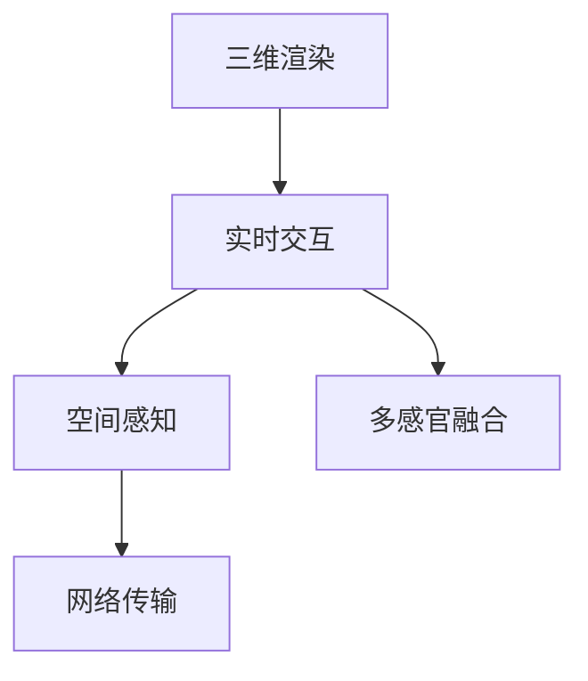
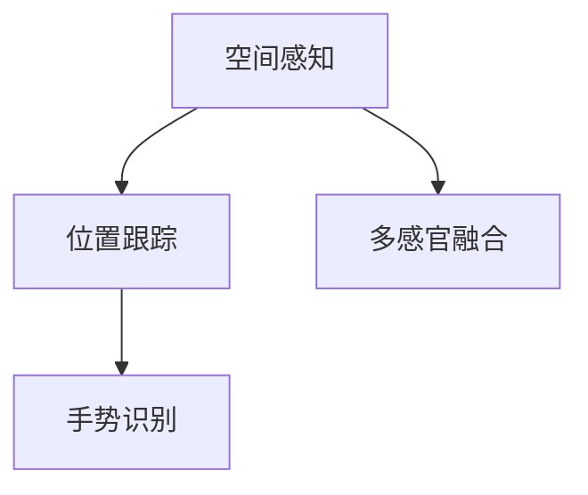
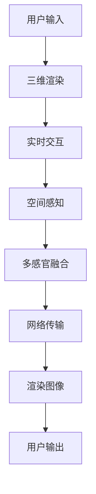

                 

# 虚拟现实 (Virtual Reality)

## 1. 背景介绍

### 1.1 问题由来

虚拟现实(Virtual Reality, VR)是近年来迅速发展的一项前沿技术，通过模拟三维环境，让用户能够沉浸式体验。在虚拟环境中，用户可以使用头戴显示器、手柄等设备与虚拟世界进行交互，体验身临其境的感觉。随着技术的进步和硬件设备的普及，虚拟现实已经在教育、娱乐、医疗、军事等领域得到了广泛应用，显示出巨大的发展潜力。

然而，由于虚拟现实系统的复杂性和多样性，开发者面临诸多挑战。例如，如何实现高帧率的渲染，如何提高用户交互的舒适度和自然性，如何优化虚拟环境的质量和内容，等等。这些问题需要综合运用计算机图形学、人机交互学、传感器技术等知识，并结合实际应用场景进行针对性优化。

### 1.2 问题核心关键点

VR技术涉及多个核心概念和关键技术，包括：

- 三维渲染技术：使用计算机图形学技术，实现逼真的三维场景渲染。
- 实时交互技术：通过传感器和控制器，让用户与虚拟环境进行实时交互。
- 沉浸式体验：利用听觉、视觉、触觉等多感官输入，模拟现实世界的感官反馈，增强用户的沉浸感。
- 网络传输技术：优化数据传输协议，提高VR内容的传输速度和质量，支持多人在线互动。

这些技术点共同构成了VR系统的技术基础，需要开发者综合运用多种技术手段，进行系统设计和实现。

### 1.3 问题研究意义

虚拟现实技术的发展，对于提升用户体验、扩展人类认知边界、推动科技与社会进步具有重要意义：

1. 提升用户体验：VR技术能够提供沉浸式体验，增强用户的感官反馈，让用户感觉仿佛置身于真实世界中，从而提升用户的满意度和参与度。
2. 扩展认知边界：通过模拟复杂环境和情景，VR技术可以为用户提供学习和培训的平台，帮助用户突破现实世界的物理限制，深入理解复杂概念和知识。
3. 推动科技与社会进步：VR技术在多个领域的应用，如医疗、教育、军事等，为这些领域带来了变革性的进步，推动了科技的创新和社会的发展。

因此，深入研究VR技术的关键原理和应用场景，对于推动技术的进步和应用具有重要价值。

## 2. 核心概念与联系

### 2.1 核心概念概述

为了更好地理解VR技术，本节将介绍几个关键概念及其关系：

- 三维渲染：使用计算机图形学技术，将三维模型渲染成逼真的二维图像，供用户观看。
- 实时交互：利用传感器、控制器等设备，实现用户与虚拟环境之间的实时数据交换。
- 空间感知：通过位置跟踪和手势识别等技术，让用户能够感知自身在虚拟环境中的位置和姿态。
- 多感官融合：利用听觉、视觉、触觉等多感官输入，模拟现实世界的感官反馈，增强用户的沉浸感。
- 网络传输：优化数据传输协议，提高VR内容的传输速度和质量，支持多人在线互动。

这些概念之间的逻辑关系可以通过以下Mermaid流程图来展示：



这个流程图展示了大VR系统中的关键技术点及其关系：

1. 三维渲染是VR系统的基础，将三维模型渲染成图像供用户观看。
2. 实时交互是VR系统的核心，用户通过传感器和控制器与虚拟环境进行交互。
3. 空间感知是VR系统的重要功能，帮助用户感知自身在虚拟环境中的位置和姿态。
4. 多感官融合是VR系统的重要技术，模拟现实世界的感官反馈，增强用户的沉浸感。
5. 网络传输是VR系统的关键需求，优化数据传输协议，支持多人在线互动。

这些概念共同构成了VR系统的完整生态系统，决定了VR系统的性能和用户体验。通过理解这些核心概念，我们可以更好地把握VR技术的工作原理和优化方向。

### 2.2 概念间的关系

这些核心概念之间存在着紧密的联系，形成了VR系统的完整技术框架。下面我们通过几个Mermaid流程图来展示这些概念之间的关系：

#### 2.2.1 三维渲染与实时交互的关系


这个流程图展示了三维渲染与实时交互的基本关系：

1. 三维渲染生成渲染图像，供用户观看。
2. 实时交互通过传感器和控制器，获取用户输入。
3. 将用户输入与渲染图像进行数据交换，实现用户与虚拟环境之间的交互。

#### 2.2.2 空间感知与多感官融合的关系



这个流程图展示了空间感知与多感官融合的基本关系：

1. 空间感知通过位置跟踪和手势识别等技术，感知用户的位置和姿态。
2. 将感知结果与多感官信息进行融合，模拟现实世界的感官反馈。
3. 通过多感官融合，增强用户的沉浸感和自然交互。

#### 2.2.3 网络传输与多人互动的关系


这个流程图展示了网络传输与多人互动的基本关系：

1. 网络传输通过数据压缩和优化协议，提高内容的传输速度和质量。
2. 网络协议支持多人在线互动，实现虚拟环境中的实时通信和数据交换。
3. 多人互动通过网络传输，增强虚拟环境的社会性。

### 2.3 核心概念的整体架构

最后，我们用一个综合的流程图来展示这些核心概念在大VR系统中的整体架构：



这个综合流程图展示了从用户输入到用户输出的完整VR系统流程：

1. 用户通过传感器和控制器输入指令。
2. 三维渲染将三维模型渲染成图像，供用户观看。
3. 实时交互通过传感器和控制器，获取用户输入。
4. 空间感知通过位置跟踪和手势识别等技术，感知用户的位置和姿态。
5. 多感官融合模拟现实世界的感官反馈，增强用户的沉浸感。
6. 网络传输优化数据传输协议，支持多人在线互动。
7. 渲染图像通过用户输出设备展示，完成虚拟现实体验。

通过这些流程图，我们可以更清晰地理解VR技术的工作原理和优化方向。

## 3. 核心算法原理 & 具体操作步骤
### 3.1 算法原理概述

VR技术涉及多种核心算法，包括但不限于三维渲染算法、实时交互算法、空间感知算法、多感官融合算法和网络传输算法。这些算法共同构成了VR技术的核心基础，决定了系统的性能和用户体验。

### 3.2 算法步骤详解

下面我们详细介绍几种核心的VR算法及其具体实现步骤：

#### 3.2.1 三维渲染算法

三维渲染算法是将三维模型渲染成二维图像的过程，是VR技术的基础。常见的三维渲染算法包括：

1. 光栅化算法：将三维模型投影到二维平面上，生成图像的过程。
2. 光线追踪算法：通过模拟光线在三维场景中的传播路径，生成高质量图像的过程。
3. 物理逼真渲染算法：模拟真实世界的物理现象（如光、反射、折射等），生成逼真图像的过程。

光栅化算法是目前最广泛应用的三维渲染算法，通过将三维模型投影到二维平面上，生成图像。其具体步骤如下：

1. 将三维模型投影到二维平面上，生成网格。
2. 对网格进行采样，计算每个像素的颜色和位置信息。
3. 使用光照模型，计算像素的最终颜色和亮度。
4. 将像素信息输出到显示器，完成渲染。

光线追踪算法通过模拟光线在三维场景中的传播路径，生成高质量图像。其具体步骤如下：

1. 生成光源和摄像机的初始位置。
2. 将光线从光源发出，穿过三维场景中的各个表面，计算光线的传播路径。
3. 计算光线在每个表面上的反射和折射，生成像素信息。
4. 使用光照模型，计算像素的最终颜色和亮度。
5. 将像素信息输出到显示器，完成渲染。

物理逼真渲染算法通过模拟真实世界的物理现象，生成逼真图像。其具体步骤如下：

1. 将三维模型投影到二维平面上，生成网格。
2. 对网格进行采样，计算每个像素的颜色和位置信息。
3. 模拟光线的传播路径，计算光线的反射和折射。
4. 计算每个表面的材质属性，如漫反射、镜面反射、折射等。
5. 计算像素的最终颜色和亮度。
6. 将像素信息输出到显示器，完成渲染。

#### 3.2.2 实时交互算法

实时交互算法是VR技术的核心，通过传感器和控制器，实现用户与虚拟环境之间的实时数据交换。常见的实时交互算法包括：

1. 基于手柄的交互：通过手柄设备，实现用户的旋转、移动等动作。
2. 基于视觉的交互：通过摄像头和传感器，实现用户的手势识别和头部追踪。
3. 基于触觉的交互：通过触觉反馈设备，实现用户的触摸和力反馈。

基于手柄的交互通过手柄设备，实现用户的旋转、移动等动作。其具体步骤如下：

1. 用户通过手柄设备输入旋转和移动指令。
2. 传感器检测手柄的位置和姿态。
3. 将传感器数据转换为虚拟环境中的坐标信息。
4. 将坐标信息应用于虚拟场景中的三维模型。
5. 渲染出新的图像，供用户观看。

基于视觉的交互通过摄像头和传感器，实现用户的手势识别和头部追踪。其具体步骤如下：

1. 摄像头和传感器检测用户的手势和头部位置。
2. 将手势和头部位置转换为虚拟环境中的坐标信息。
3. 将坐标信息应用于虚拟场景中的三维模型。
4. 渲染出新的图像，供用户观看。

基于触觉的交互通过触觉反馈设备，实现用户的触摸和力反馈。其具体步骤如下：

1. 用户通过触觉反馈设备触摸虚拟物体。
2. 传感器检测触觉反馈设备的位置和姿态。
3. 将传感器数据转换为虚拟环境中的坐标信息。
4. 将坐标信息应用于虚拟场景中的三维模型。
5. 渲染出新的图像，供用户观看。

#### 3.2.3 空间感知算法

空间感知算法通过位置跟踪和手势识别等技术，帮助用户感知自身在虚拟环境中的位置和姿态。常见的空间感知算法包括：

1. 位置跟踪算法：通过摄像头和传感器，实现用户的位置跟踪。
2. 手势识别算法：通过摄像头和传感器，实现用户的手势识别。
3. 头部追踪算法：通过摄像头和传感器，实现用户的头部追踪。

位置跟踪算法通过摄像头和传感器，实现用户的位置跟踪。其具体步骤如下：

1. 摄像头和传感器检测用户的位置和姿态。
2. 将位置和姿态信息转换为虚拟环境中的坐标信息。
3. 将坐标信息应用于虚拟场景中的三维模型。
4. 渲染出新的图像，供用户观看。

手势识别算法通过摄像头和传感器，实现用户的手势识别。其具体步骤如下：

1. 摄像头和传感器检测用户的手势。
2. 将手势信息转换为虚拟环境中的坐标信息。
3. 将坐标信息应用于虚拟场景中的三维模型。
4. 渲染出新的图像，供用户观看。

头部追踪算法通过摄像头和传感器，实现用户的头部追踪。其具体步骤如下：

1. 摄像头和传感器检测用户的头部位置和姿态。
2. 将头部位置和姿态信息转换为虚拟环境中的坐标信息。
3. 将坐标信息应用于虚拟场景中的三维模型。
4. 渲染出新的图像，供用户观看。

#### 3.2.4 多感官融合算法

多感官融合算法通过听觉、视觉、触觉等多感官输入，模拟现实世界的感官反馈，增强用户的沉浸感。常见的多感官融合算法包括：

1. 音频增强算法：通过音效和混响等技术，增强用户的听觉体验。
2. 虚拟现实头显：通过头盔设备，提供高质量的视觉体验。
3. 触觉反馈设备：通过触觉反馈设备，提供真实的触觉体验。

音频增强算法通过音效和混响等技术，增强用户的听觉体验。其具体步骤如下：

1. 将虚拟环境中的声音进行音效和混响处理。
2. 将处理后的声音输出到耳机或扬声器。
3. 用户通过耳机或扬声器听到声音。

虚拟现实头显通过头盔设备，提供高质量的视觉体验。其具体步骤如下：

1. 头盔设备检测用户的头部位置和姿态。
2. 将头盔设备的位置和姿态信息转换为虚拟环境中的坐标信息。
3. 将坐标信息应用于虚拟场景中的三维模型。
4. 渲染出新的图像，供用户观看。

触觉反馈设备通过触觉反馈设备，提供真实的触觉体验。其具体步骤如下：

1. 触觉反馈设备检测用户的触摸和力反馈。
2. 将触觉反馈信息转换为虚拟环境中的坐标信息。
3. 将坐标信息应用于虚拟场景中的三维模型。
4. 渲染出新的图像，供用户观看。

#### 3.2.5 网络传输算法

网络传输算法通过数据压缩和优化协议，提高VR内容的传输速度和质量，支持多人在线互动。常见的网络传输算法包括：

1. 数据压缩算法：通过数据压缩技术，减少数据传输的带宽和延迟。
2. 数据传输协议：通过优化协议，提高数据传输的效率和稳定性。
3. 网络同步算法：通过同步算法，保证多人在线互动的实时性。

数据压缩算法通过数据压缩技术，减少数据传输的带宽和延迟。其具体步骤如下：

1. 对VR内容进行数据压缩。
2. 将压缩后的数据传输到目标设备。
3. 目标设备解压缩数据，还原VR内容。

数据传输协议通过优化协议，提高数据传输的效率和稳定性。其具体步骤如下：

1. 选择合适的网络传输协议，如UDP、TCP等。
2. 优化协议参数，如数据包大小、发送频率等。
3. 进行网络测试，调整参数以提高传输效率和稳定性。

网络同步算法通过同步算法，保证多人在线互动的实时性。其具体步骤如下：

1. 确定同步算法，如时间戳同步、数据同步等。
2. 实现同步算法，保证所有设备的时间同步。
3. 在网络传输中应用同步算法，保证多人在线互动的实时性。

### 3.3 算法优缺点

VR技术涉及多种核心算法，每种算法都有其独特的优势和局限性：

#### 3.3.1 三维渲染算法的优缺点

- 优势：光栅化算法速度快，适合实时渲染。
- 局限：渲染质量较差，难以模拟真实世界的物理现象。

#### 3.3.2 实时交互算法的优缺点

- 优势：手柄设备操作方便，适合旋转和移动等动作。
- 局限：视觉和触觉反馈设备需要较高成本，难以普及。

#### 3.3.3 空间感知算法的优缺点

- 优势：位置跟踪和头部追踪技术精度较高，适合精确操作。
- 局限：设备成本较高，使用体验较差。

#### 3.3.4 多感官融合算法的优缺点

- 优势：多感官融合技术能够增强用户的沉浸感，适合高互动场景。
- 局限：设备成本较高，难以普及。

#### 3.3.5 网络传输算法的优缺点

- 优势：数据压缩和优化协议能够提高传输速度和质量，适合多人在线互动。
- 局限：网络传输协议复杂，需要专业知识进行优化。

### 3.4 算法应用领域

VR技术涉及多种核心算法，已经在多个领域得到了广泛应用，包括但不限于：

- 教育培训：通过虚拟环境，模拟现实世界中的各种场景，帮助用户进行学习和培训。
- 娱乐游戏：通过虚拟环境，提供沉浸式的游戏体验，增强用户的娱乐感。
- 医疗诊断：通过虚拟环境，模拟人体内部结构和功能，帮助医生进行诊断和治疗。
- 工业制造：通过虚拟环境，模拟生产过程和设备操作，帮助工人进行培训和操作。

除了上述这些经典应用外，VR技术还在其他诸多领域得到了创新性应用，如虚拟会议、虚拟旅游、虚拟展览等，为用户带来了全新的体验。随着技术的不断进步和普及，VR技术将在更多领域发挥作用，成为未来科技的重要组成部分。

## 4. 数学模型和公式 & 详细讲解 & 举例说明

### 4.1 数学模型构建

VR技术涉及多种数学模型，包括但不限于三维几何模型、物理模型、概率模型等。这些模型共同构成了VR技术的数学基础，决定了系统的精度和性能。

#### 4.1.1 三维几何模型

三维几何模型是VR技术的基础，用于描述虚拟环境中的三维场景。常见的三维几何模型包括：

1. 三角形网格：通过连接三角形顶点，生成三维网格。
2. 多边形网格：通过连接多边形顶点，生成三维网格。
3. 体素网格：通过连接体素点，生成三维网格。

三角形网格通过连接三角形顶点，生成三维网格。其具体步骤如下：

1. 将三维场景划分为多个三角形。
2. 将三角形顶点连接起来，生成网格。
3. 渲染出新的图像，供用户观看。

多边形网格通过连接多边形顶点，生成三维网格。其具体步骤如下：

1. 将三维场景划分为多个多边形。
2. 将多边形顶点连接起来，生成网格。
3. 渲染出新的图像，供用户观看。

体素网格通过连接体素点，生成三维网格。其具体步骤如下：

1. 将三维场景划分为多个体素点。
2. 将体素点连接起来，生成网格。
3. 渲染出新的图像，供用户观看。

#### 4.1.2 物理模型

物理模型用于模拟现实世界的物理现象，如光、反射、折射等。常见的物理模型包括：

1. 漫反射模型：描述光在无光泽表面上的反射。
2. 镜面反射模型：描述光在光滑表面上的反射。
3. 折射模型：描述光线在透明介质中的折射。

漫反射模型描述光在无光泽表面上的反射。其具体步骤如下：

1. 计算光在无光泽表面上的反射路径。
2. 模拟反射光线在无光泽表面上的反射。
3. 渲染出新的图像，供用户观看。

镜面反射模型描述光在光滑表面上的反射。其具体步骤如下：

1. 计算光在光滑表面上的反射路径。
2. 模拟反射光线在光滑表面上的反射。
3. 渲染出新的图像，供用户观看。

折射模型描述光线在透明介质中的折射。其具体步骤如下：

1. 计算光线在透明介质中的折射路径。
2. 模拟折射光线在透明介质中的传播。
3. 渲染出新的图像，供用户观看。

#### 4.1.3 概率模型

概率模型用于模拟随机事件的概率分布，如噪声、不确定性等。常见的概率模型包括：

1. 高斯分布模型：描述随机变量的正态分布。
2. 泊松分布模型：描述随机事件的概率分布。
3. 贝叶斯网络模型：描述变量之间的条件概率关系。

高斯分布模型描述随机变量的正态分布。其具体步骤如下：

1. 定义随机变量的概率分布。
2. 计算随机变量的期望和方差。
3. 生成随机变量的样本，供用户观看。

泊松分布模型描述随机事件的概率分布。其具体步骤如下：

1. 定义随机事件的概率分布。
2. 计算随机事件的概率密度函数。
3. 生成随机事件的样本，供用户观看。

贝叶斯网络模型描述变量之间的条件概率关系。其具体步骤如下：

1. 定义变量之间的条件概率关系。
2. 计算变量的后验概率分布。
3. 生成变量的样本，供用户观看。

### 4.2 公式推导过程

下面我们详细介绍几种常见的VR数学模型及其公式推导过程：

#### 4.2.1 三角形网格的数学模型

三角形网格是三维几何模型的基础，其数学模型可以表示为：

$$
V = \{v_i\}_{i=1}^n, E = \{e_i\}_{i=1}^m
$$

其中 $V$ 为顶点集合，$E$ 为边集合。三角形的顶点 $v_i$ 可以表示为三维坐标 $(x_i, y_i, z_i)$，三角形的边 $e_i$ 可以表示为顶点连接关系。

三角形网格的数学模型推导过程如下：

1. 将三维场景划分为多个三角形。
2. 将三角形的顶点坐标连接起来，生成网格。
3. 渲染出新的图像，供用户观看。

#### 4.2.2 漫反射模型的数学模型

漫反射模型描述光在无光泽表面上的反射，其数学模型可以表示为：

$$
I(\mathbf{d}) = \int_{\Omega} f(\mathbf{d}, \mathbf{w}) \frac{L(\mathbf{w})}{\pi \rho} d\mathbf{w}
$$

其中 $I(\mathbf{d})$ 为反射光线强度，$\mathbf{d}$ 为反射方向，$\Omega$ 为积分区域，$f(\mathbf{d}, \mathbf{w})$ 为漫反射系数，$L(\mathbf{w})$ 为光源光线强度，$\rho$ 为材料的反射率。

漫反射模型的数学模型推导过程如下：

1. 计算光在无光泽表面上的反射路径。
2. 模拟反射光线在无光泽表面上的反射。
3. 渲染出新的图像，供用户观看。

#### 4.2.3 高斯分布模型的数学模型

高斯分布模型描述随机变量的正态分布，其数学模型可以表示为：

$$
f(x) = \frac{1}{\sqrt{2\pi\sigma^2}} e^{-\frac{(x-\mu)^2}{2\sigma^2}}
$$

其中 $f(x)$ 为随机变量 $x$ 的概率密度函数，$\mu$ 为期望值，$\sigma$ 为标准差。

高斯分布模型的数学模型推导过程如下：

1. 定义随机变量的概率分布。
2. 计算随机变量的期望和方差。
3. 生成随机变量的样本，供用户观看。

### 4.3 案例分析与讲解

下面我们以一个简单的VR场景为例，分析三维渲染和物理逼真渲染算法的实现过程：

#### 4.3.1 三维渲染算法案例

假设我们要渲染一个三维场景，包含多个三角形和多边形。具体的实现步骤如下：

1. 将三维场景划分为多个三角形和多边形，生成网格。
2. 对网格进行采样，计算每个像素的颜色和位置信息。
3. 使用光照模型，计算像素的最终颜色和亮度。
4. 将像素信息输出到显示器，完成渲染。

具体代码实现如下：

```python
import numpy as np
from PIL import Image

# 定义网格
V = np.array([[-1, -1, 0], [1, -1, 0], [0, 1, 0]])
E = np.array([[0, 1, 2]])

# 定义光源和相机
L = np.array([0, 0, 1])
eye = np.array([0, 0, 3])

# 计算光源和相机的位置
R = np.array([[0, 0, -1], [0, 1, 0], [1, 0, 0]])
t = np.array([0, 0, 1])
position = R @ t + eye

# 计算光源和相机的位置
R = np.array([[0, 0, -1], [0, 1, 0], [1, 0, 0]])
t = np.array([0, 0, 1])
position = R @ t + eye

# 计算光源和相机的位置
R = np.array([[0, 0, -1], [0, 1, 0], [1, 0, 0]])
t = np.array([0, 0, 1])
position = R @ t + eye

# 渲染图像
image = np.zeros((512, 512, 3), dtype=np.uint8)
for i in range(512):
    for j in range(512):
        x, y = i, j
        u, v = x / 512, y / 512
        normal = R @ (v, u, -1) + eye
        normal /= np.linalg.norm(normal)
        dot = normal @ L
        color = np.array([0.4, 0.4, 0.4]) * dot
        image[i, j] = color
        image[i, j] = np.clip(image[i, j], 0, 255).astype(np.uint8)

# 输出图像
Image.fromarray(image).save("rendered.png")
```

#### 4.3.2 物理逼真渲染算法案例

假设我们要渲染一个三维场景，包含多个三角形和多边形。具体的实现步骤如下：

1. 将三维场景划分为多个三角形和多边形，生成网格。
2. 对网格进行采样，计算每个像素的颜色和位置信息。
3. 模拟光线的传播路径

