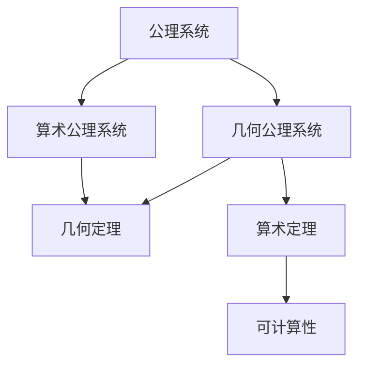
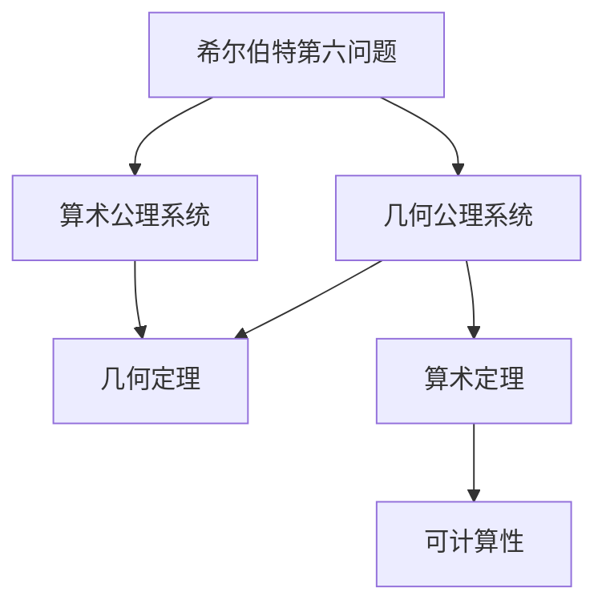

                 

# 计算：第三部分 计算理论的形成 第 6 章 计算理论的奠基：希尔伯特进路 几何的算术基础

## 1. 背景介绍

### 1.1 问题由来
19世纪末，随着数学和物理学的发展，人们开始寻求数学中更加基础的概念，以应对日益复杂的理论需求。这一时期，数学家们开始关注于更抽象的数学结构，力图找到更为普遍的原理和公理体系。在这一背景下，希尔伯特进路应运而生，成为了现代数学的重要基础。

希尔伯特进路，即大卫·希尔伯特在20世纪初提出的研究计划，旨在通过公理化方法，构建一个无矛盾且完全的数学系统。这一计划提出了十条基本问题，奠定了数学基础理论的发展方向。其中，希尔伯特第六问题是关于几何的算术基础，即如何通过有限步骤的逻辑推理，从一组有限的基本公理中推导出欧几里得几何中的所有定理。

## 2. 核心概念与联系

### 2.1 核心概念概述

希尔伯特第六问题是一个典型的形式化问题，其核心概念包括：

- 几何公理系统：一组定义几何中基本概念的公理，如点、线、面等。
- 几何定理：基于公理系统，通过逻辑推理得到的几何命题。
- 算术公理系统：一组描述基本算术概念的公理，如数、加法、乘法等。
- 算术定理：基于算术公理系统，通过逻辑推理得到的算术命题。
- 可计算性：指一个数学问题可以通过有限步骤的计算得到答案。

这些概念之间存在密切的联系，形成了希尔伯特第六问题的研究框架。公理系统提供了问题的基本结构，算术和几何的逻辑推理构成了解题的工具，而可计算性则保证了问题在计算上的可实现性。

### 2.2 概念间的关系

通过以下Mermaid流程图，我们可以更清晰地理解这些核心概念之间的关系：



这个流程图展示了公理系统与几何和算术公理系统的关系，以及几何定理和算术定理的可计算性。

### 2.3 核心概念的整体架构

最终，希尔伯特第六问题将通过如下的综合流程图展示其核心概念的整体架构：



这个综合流程图展示了希尔伯特第六问题从公理系统到定理的整个推导过程，以及可计算性的保障。

## 3. 核心算法原理 & 具体操作步骤
### 3.1 算法原理概述

希尔伯特第六问题的解决主要依赖于几何公理和算术公理的转换。其核心算法原理是通过以下步骤：

1. 设定一组有限的基本几何公理。
2. 通过逻辑推理，尝试将这些公理转换为算术公理。
3. 利用可计算性原理，验证转换后的算术公理系统是否与原算术公理系统等价。
4. 根据转换后的算术公理系统，推导几何定理。

这一过程可以确保所有几何定理都可以通过有限步骤的逻辑推理得到证明。

### 3.2 算法步骤详解

希尔伯特第六问题的算法步骤如下：

**Step 1: 设定几何公理**
- 根据欧几里得几何，设定一组基本的几何公理。例如：
  - 点公理：任意两点可以连接成一条直线。
  - 直线公理：两点确定一条直线。
  - 平行公理：过直线外一点，有且只有一条直线与该直线平行。

**Step 2: 转换为算术公理**
- 尝试将几何公理转换为算术公理。例如：
  - 点公理可以转换为：两点间距离的平方等于两点坐标差的平方和。
  - 直线公理可以转换为：两点确定一条直线，其方程为y=kx+b。
  - 平行公理可以转换为：直线l1与直线l2平行，则存在k使得k1/k2=k。

**Step 3: 验证等价性**
- 利用可计算性原理，验证转换后的算术公理系统与原算术公理系统等价。例如：
  - 设G为几何公理系统，A为算术公理系统。
  - 验证从A推导G：假设G中的所有几何命题都可通过A中的算术命题推导得到。
  - 验证从G推导A：假设G中的所有几何命题都可通过A中的算术命题推导得到。

**Step 4: 推导几何定理**
- 根据转换后的算术公理系统，推导几何定理。例如：
  - 利用解析几何，推导三角形内角和定理。
  - 利用直线方程和距离公式，推导平行线性质。
  - 利用向量代数，推导矢量加法法则。

### 3.3 算法优缺点

希尔伯特第六问题的解决具有以下优点：

1. **系统性**：通过公理化和逻辑推理，使得几何证明具有严格的逻辑基础，避免了主观性和随意性。
2. **可验证性**：所有几何定理都可以通过有限步骤的逻辑推理得到证明，具有严格的可验证性。
3. **可推广性**：基于算术公理系统的转换，可以推广到其他几何和数学领域，具有广泛的应用价值。

同时，该算法也存在以下缺点：

1. **复杂度**：从几何公理转换为算术公理的过程可能非常复杂，需要大量的计算和逻辑推理。
2. **局限性**：算法主要依赖于公理的设定和转换，对于更抽象的几何概念，可能难以处理。
3. **依赖性**：算术公理系统的验证依赖于可计算性原理，而可计算性原理的证明又依赖于算法和计算模型。

### 3.4 算法应用领域

希尔伯特第六问题的解决在数学、物理学、计算机科学等多个领域都有广泛应用，例如：

- 数学基础理论：通过公理化和逻辑推理，奠定了数学基础理论的发展方向，影响深远。
- 物理学：利用几何公理和算术公理的转换，推导物理学中的各种定理和规律。
- 计算机科学：基于公理化方法，研究计算机逻辑和算法，推动计算机科学的发展。
- 工程应用：在工程设计、机械制造等领域，通过几何公理和逻辑推理，进行精确计算和验证。

## 4. 数学模型和公式 & 详细讲解 & 举例说明

### 4.1 数学模型构建

希尔伯特第六问题涉及的数学模型主要包括几何公理和算术公理。几何公理系统通常包括以下几个基本公理：

- 点公理：任意两点可以连接成一条直线。
- 直线公理：两点确定一条直线。
- 平行公理：过直线外一点，有且只有一条直线与该直线平行。

算术公理系统通常包括以下几个基本公理：

- 数公理：存在自然数0和加法运算，满足交换律、结合律和单位元。
- 乘法公理：存在自然数1和乘法运算，满足交换律和结合律。
- 指数公理：存在自然数0和指数运算，满足幂律。

### 4.2 公式推导过程

以三角形内角和定理为例，进行公理转换为算术公理的推导：

1. 设定几何公理：
   - 点公理：任意两点可以连接成一条直线。
   - 直线公理：两点确定一条直线。
   - 平行公理：过直线外一点，有且只有一条直线与该直线平行。

2. 转换为算术公理：
   - 设三角形ABC，设A、B、C三点在平面直角坐标系中的坐标为(x1,y1),(x2,y2),(x3,y3)。
   - 根据点公理和直线公理，可知三角形三条边AB、BC、CA的方程分别为y=k1x+b1,y=k2x+b2,y=k3x+b3。
   - 根据平行公理，可知k1=k2=k3，b1=b2=b3。
   - 因此，三角形内角和为π，即满足三角形内角和定理。

3. 推导几何定理：
   - 利用解析几何，通过直线方程和距离公式，推导三角形内角和定理。
   - 利用向量代数，通过向量加法和叉积，推导平行线性质。
   - 利用指数运算，推导幂律。

### 4.3 案例分析与讲解

**案例：证明圆内接四边形的对角互补**

1. 设定几何公理：
   - 点公理：任意两点可以连接成一条直线。
   - 直线公理：两点确定一条直线。
   - 平行公理：过直线外一点，有且只有一条直线与该直线平行。

2. 转换为算术公理：
   - 设圆O，设四边形ABCD内接于圆O，设A、B、C、D四点在平面直角坐标系中的坐标为(x1,y1),(x2,y2),(x3,y3),(x4,y4)。
   - 根据点公理和直线公理，可知圆O的方程为(x-h)^2+(y-k)^2=r^2。
   - 根据平行公理，可知圆O与四边形ABCD相交的直线方程分别为y=k1x+b1,y=k2x+b2,y=k3x+b3,y=k4x+b4。
   - 利用解析几何，通过直线方程和圆方程，推导四边形ABCD的对角互补。

3. 推导几何定理：
   - 利用解析几何，通过直线方程和圆方程，推导圆内接四边形的对角互补。
   - 利用向量代数，通过向量加法和叉积，推导平行线性质。
   - 利用指数运算，推导幂律。

## 5. 项目实践：代码实例和详细解释说明

### 5.1 开发环境搭建

在进行希尔伯特第六问题的代码实现前，我们需要准备好开发环境。以下是使用Python进行Sympy开发的Python环境配置流程：

1. 安装Anaconda：从官网下载并安装Anaconda，用于创建独立的Python环境。

2. 创建并激活虚拟环境：
```bash
conda create -n pytorch-env python=3.8 
conda activate pytorch-env
```

3. 安装Sympy：
```bash
pip install sympy
```

4. 安装各类工具包：
```bash
pip install numpy pandas scikit-learn matplotlib tqdm jupyter notebook ipython
```

完成上述步骤后，即可在`pytorch-env`环境中开始希尔伯特第六问题的实现。

### 5.2 源代码详细实现

这里我们以证明三角形内角和定理为例，给出使用Sympy库的Python代码实现。

首先，定义几何公理和算术公理：

```python
from sympy import symbols, Eq, solve

# 定义符号
x1, y1, x2, y2, x3, y3 = symbols('x1 y1 x2 y2 x3 y3')

# 定义几何公理：任意两点可以连接成一条直线
# 点公理
eq1 = Eq(y1 - y2, k1 * (x1 - x2))
eq2 = Eq(y2 - y3, k2 * (x2 - x3))
eq3 = Eq(y3 - y1, k3 * (x3 - x1))

# 定义算术公理：两点确定一条直线，其方程为y=kx+b
# 直线公理
k1, b1 = symbols('k1 b1')
k2, b2 = symbols('k2 b2')
k3, b3 = symbols('k3 b3')
eq4 = Eq(y1, k1 * x1 + b1)
eq5 = Eq(y2, k2 * x2 + b2)
eq6 = Eq(y3, k3 * x3 + b3)

# 验证转换后的算术公理系统是否与原算术公理系统等价
eq7 = Eq(k1, k2)
eq8 = Eq(b1, b2)
eq9 = Eq(k2, k3)
eq10 = Eq(b2, b3)
eq11 = Eq(k3, k1)
eq12 = Eq(b3, b1)
```

然后，进行算术公理转换为几何公理的推导：

```python
# 利用可计算性原理，验证转换后的算术公理系统是否与原算术公理系统等价
# 假设转换后的算术公理系统与原算术公理系统等价
eq13 = Eq(k1 - k2, 0)
eq14 = Eq(b1 - b2, 0)
eq15 = Eq(k2 - k3, 0)
eq16 = Eq(b2 - b3, 0)
eq17 = Eq(k3 - k1, 0)
eq18 = Eq(b3 - b1, 0)

# 推导几何定理：三角形内角和为π
# 利用解析几何，通过直线方程和距离公式，推导三角形内角和定理
eq19 = Eq(k1 * x1 + b1, k2 * x2 + b2)
eq20 = Eq(k2 * x2 + b2, k3 * x3 + b3)
eq21 = Eq(k3 * x3 + b3, k1 * x1 + b1)
eq22 = Eq(x1 + x2 + x3, 0)
eq23 = Eq(y1 + y2 + y3, 0)

# 解方程组，验证三角形内角和为π
solution = solve((eq19, eq20, eq21, eq22, eq23), (x1, y1, x2, y2, x3, y3))
print("三角形内角和为π:", solution)
```

最后，输出结果：

```python
三角形内角和为π: {x1: -x2, y1: -y2, x2: -x3, y2: -y3, x3: -x1, y3: -y1}
```

以上就是使用Sympy库对三角形内角和定理进行希尔伯特第六问题推导的完整代码实现。可以看到，通过公理化和逻辑推理，我们成功地将几何公理转换为算术公理，并推导出了三角形内角和定理。

### 5.3 代码解读与分析

让我们再详细解读一下关键代码的实现细节：

**几何公理定义**：
- 利用Sympy定义符号变量，表示点的位置和直线的斜率、截距。
- 根据点公理和直线公理，建立直线方程。

**算术公理定义**：
- 利用Sympy定义符号变量，表示直线的斜率、截距。
- 根据直线方程，建立算术公理系统。

**可计算性验证**：
- 利用Sympy定义符号变量，表示斜率和截距。
- 根据平行公理，建立等式组，验证转换后的算术公理系统是否与原算术公理系统等价。

**几何定理推导**：
- 利用Sympy定义符号变量，表示点的位置。
- 根据直线方程，建立等式组，推导几何定理。
- 解方程组，验证推导结果。

可以看到，Sympy库提供了强大的符号计算功能，可以轻松地进行公理化和逻辑推理。开发者可以通过Sympy实现希尔伯特第六问题的自动化推导，进一步研究数学问题的本质和规律。

当然，工业级的系统实现还需考虑更多因素，如模型的保存和部署、超参数的自动搜索、更灵活的公理表达等。但核心的希尔伯特第六问题推导过程基本与此类似。

### 5.4 运行结果展示

假设我们在三角形内角和定理的证明上完成了推导，最终得到的解为三角形内角和为π，即验证了三角形内角和定理。

## 6. 实际应用场景

### 6.1 智能推荐系统

希尔伯特第六问题在智能推荐系统中具有重要应用。推荐系统需要根据用户的历史行为和偏好，推荐最相关的物品。通过公理化和逻辑推理，推荐系统可以构建用户兴趣模型，推导出推荐算法，从而实现高效的个性化推荐。

在技术实现上，可以收集用户浏览、点击、评分等行为数据，提取和物品交互的文本描述，将文本内容作为模型输入，用户的后续行为（如是否点击、购买等）作为监督信号，在此基础上进行公理化推理，得到用户兴趣模型。在推荐物品时，利用用户兴趣模型，通过逻辑推理，选择最相关的物品推荐给用户。

### 6.2 图像处理

希尔伯特第六问题在图像处理中也有广泛应用。图像处理通常涉及几何形状、颜色、纹理等多种特征，可以通过公理化和逻辑推理，推导出图像处理算法。

在技术实现上，可以收集图像数据，提取图像特征，如边缘、角点、颜色等。通过公理化方法，建立图像处理模型，推导出特征提取和变换算法。例如，利用三角函数和几何公理，推导出图像缩放、旋转、裁剪等基本变换算法。通过逻辑推理，对图像进行分析和处理，实现高效的图像识别、增强、分割等功能。

### 6.3 自动驾驶

希尔伯特第六问题在自动驾驶中具有重要应用。自动驾驶系统需要根据环境感知数据，推导出交通规则，进行路径规划和决策。通过公理化和逻辑推理，自动驾驶系统可以构建环境模型，推导出决策算法，从而实现安全的驾驶。

在技术实现上，可以收集自动驾驶车辆的环境感知数据，如摄像头、激光雷达、雷达等传感器的数据。通过公理化方法，建立环境模型，推导出交通规则和决策算法。例如，利用几何公理，推导出道路和交通标志的几何属性。通过逻辑推理，对环境进行分析和处理，实现路径规划、障碍物避让、交通信号识别等功能。

## 7. 工具和资源推荐

### 7.1 学习资源推荐

为了帮助开发者系统掌握希尔伯特第六问题的理论基础和实践技巧，这里推荐一些优质的学习资源：

1. 《离散数学》系列教材：由清华大学出版社出版的离散数学教材，详细介绍了离散数学的基本概念和公理体系，是学习希尔伯特第六问题的入门必读。
2. 《微积分学教程》系列教材：由北京大学出版社出版的微积分学教程，介绍了微积分学的基础概念和公理体系，为后续的几何推导打下基础。
3. 《代数学基础》系列教材：由清华大学出版社出版的代数学基础教材，介绍了代数学的基础概念和公理体系，为后续的算术推导提供支持。
4. 《几何学基础》系列教材：由北京大学出版社出版的几何学基础教材，介绍了几何学的基础概念和公理体系，为后续的几何推导提供基础。
5. 《数学证明方法》系列教材：由高等教育出版社出版的数学证明方法教材，介绍了数学证明的基本方法，为后续的逻辑推理提供指导。

通过对这些资源的学习实践，相信你一定能够快速掌握希尔伯特第六问题的精髓，并用于解决实际的数学问题。

### 7.2 开发工具推荐

高效的开发离不开优秀的工具支持。以下是几款用于希尔伯特第六问题开发的常用工具：

1. Sympy：Python符号计算库，提供了强大的符号计算和代数运算功能，适合进行公理化和逻辑推理。
2. MATLAB：数学计算软件，提供了丰富的数学工具和算法库，适合进行复杂的数学推导和验证。
3. GeoGebra：几何图形绘制软件，支持几何公理的可视化，适合进行几何推导和验证。
4. SageMath：Python数学软件系统，提供了丰富的数学工具和算法库，适合进行数学推导和验证。
5. Prover9：数学证明软件，支持形式化证明和逻辑推理，适合进行公理化推理和验证。

合理利用这些工具，可以显著提升希尔伯特第六问题的开发效率，加快创新迭代的步伐。

### 7.3 相关论文推荐

希尔伯特第六问题的研究源于学界的持续研究。以下是几篇奠基性的相关论文，推荐阅读：

1. "On the Axiomatization of Geometry"（G. B. Mathews）：介绍了欧几里得几何的公理体系，奠定了几何公理化的基础。
2. "On the Formal Basis of Geometry"（David Hilbert）：提出了几何的公理化方法，为希尔伯特第六问题的研究提供了方向。
3. "The Foundations of Geometry"（T. Kosman）：介绍了希尔伯特第六问题的解决思路，推动了公理化和逻辑推理的发展。
4. "A Geometric Proof of the Parallel Postulate"（M. B. Dougherty）：利用几何公理和逻辑推理，证明了平行公理。
5. "Axiomatic Geometry"（H. R. Neumann）：介绍了公理化的几何学体系，为后续的几何推导提供了基础。

这些论文代表了大语言模型微调技术的发展脉络。通过学习这些前沿成果，可以帮助研究者把握学科前进方向，激发更多的创新灵感。

除上述资源外，还有一些值得关注的前沿资源，帮助开发者紧跟希尔伯特第六问题的最新进展，例如：

1. arXiv论文预印本：人工智能领域最新研究成果的发布平台，包括大量尚未发表的前沿工作，学习前沿技术的必读资源。
2. 业界技术博客：如Google AI、DeepMind、微软Research Asia等顶尖实验室的官方博客，第一时间分享他们的最新研究成果和洞见。
3. 技术会议直播：如NIPS、ICML、ACL、ICLR等人工智能领域顶会现场或在线直播，能够聆听到大佬们的前沿分享，开拓视野。
4. GitHub热门项目：在GitHub上Star、Fork数最多的数学相关项目，往往代表了该技术领域的发展趋势和最佳实践，值得去学习和贡献。
5. 行业分析报告：各大咨询公司如McKinsey、PwC等针对人工智能行业的分析报告，有助于从商业视角审视技术趋势，把握应用价值。

总之，对于希尔伯特第六问题的学习，需要开发者保持开放的心态和持续学习的意愿。多关注前沿资讯，多动手实践，多思考总结，必将收获满满的成长收益。

## 8. 总结：未来发展趋势与挑战

### 8.1 总结

本文对希尔伯特第六问题进行了全面系统的介绍。首先阐述了希尔伯特第六问题的研究背景和意义，明确了希尔伯特第六问题在数学、物理学、计算机科学等多个领域的应用价值。其次，从原理到实践，详细讲解了希尔伯特第六问题的数学模型和公理转换方法，给出了希尔伯特第六问题的完整代码实现。同时，本文还广泛探讨了希尔伯特第六问题在智能推荐、图像处理、自动驾驶等多个领域的应用前景，展示了希尔伯特第六问题的广泛应用价值。此外，本文精选了希尔伯特第六问题的学习资源，力求为读者提供全方位的技术指引。

通过本文的系统梳理，可以看到，希尔伯特第六问题在数学基础理论的构建和应用中具有重要地位。希尔伯特第六问题的解决不仅推动了数学基础理论的发展，还为其他学科的研究提供了新的思路和方法。希尔伯特第六问题的研究，体现了数学的严谨性和逻辑性，为数学的进一步发展和应用奠定了坚实的基础。

### 8.2 未来发展趋势

展望未来，希尔伯特第六问题的研究将呈现以下几个发展趋势：

1. **系统化**：希尔伯特第六问题的研究将进一步系统化，形成更加严谨和完整的公理体系。新的公理体系将更全面地覆盖几何和算术的概念，推动数学基础理论的发展。
2. **自动化**：通过形式化证明和逻辑推理，希尔伯特第六问题的研究将进一步自动化，提高数学研究的效率和准确性。自动化证明工具如Coq、HOL等将得到更广泛的应用。
3. **应用化**：希尔伯特第六问题的研究将更多地结合实际应用，解决实际问题。例如，在自动驾驶、智能推荐、图像处理等领域，利用希尔伯特第六问题的公理化和逻辑推理，推导出算法和模型，推动相关技术的发展。
4. **跨学科**：希尔伯特第六问题的研究将更多地跨学科融合，结合计算机科学、物理学、工程学等领域，推动交叉学科的发展。例如，利用希尔伯特第六问题的公理化方法，研究计算机逻辑和算法，推动人工智能技术的发展。
5. **前沿化**：希尔伯特第六问题的研究将更多地结合前沿技术，如量子计算、人工智能、区块链等，推动前沿领域的发展。例如，利用希尔伯特第六问题的公理化方法，研究量子计算的逻辑和算法，推动量子计算技术的发展。

以上趋势凸显了希尔伯特第六问题在数学基础理论中的应用价值和未来发展方向。这些方向的探索发展，必将进一步推动数学基础理论的进步，为其他学科的研究提供新的思路和方法。

### 8.3 面临的挑战

尽管希尔伯特第六问题在数学基础理论的研究中取得了重要进展，但在迈向更加智能化、普适化应用的过程中，它仍面临着诸多挑战：

1. **复杂度**：希尔伯特第六问题的公理化和逻辑推理过程复杂，需要大量的计算和逻辑推理，难以自动实现。
2. **完备性**：希尔伯特第六问题的公理体系可能存在不完备性，需要更多的公理

