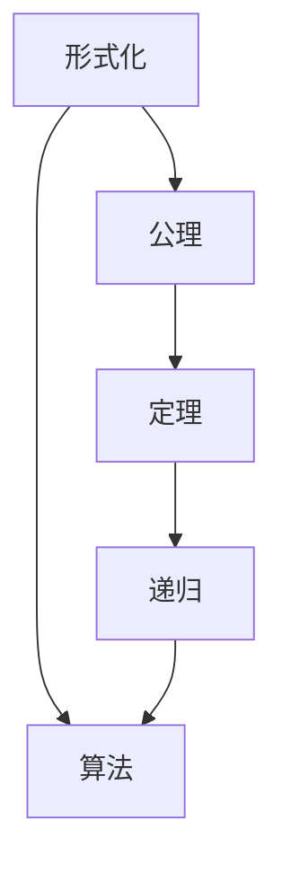
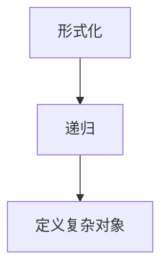
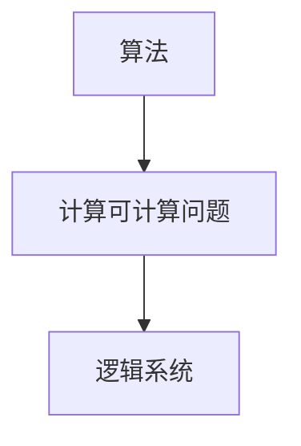
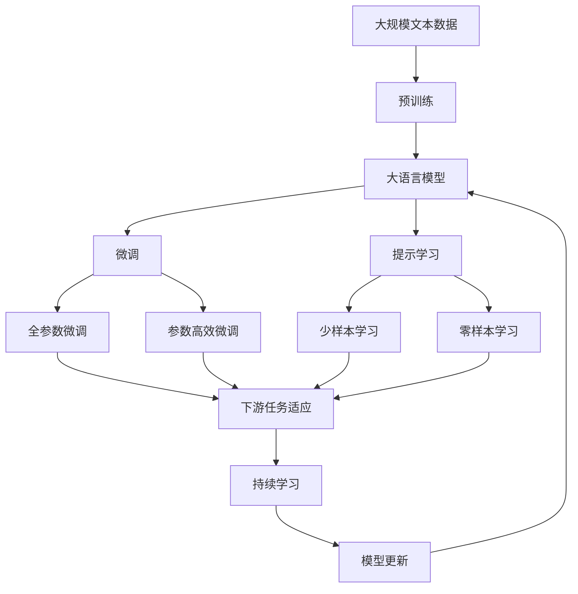

                 

# 计算：第三部分 计算理论的形成 第 6 章 计算理论的奠基：希尔伯特进路 “形式主义”之父

## 1. 背景介绍

### 1.1 问题由来

在数学领域，形式主义之父大卫·希尔伯特(David Hilbert)提出的希尔伯特计划(Hilbert's Program)，对现代计算机科学和人工智能的发展产生了深远的影响。希尔伯特计划的核心是，将数学基础建立在一种普遍适用的逻辑形式上，从而确保数学理论的严格性和完备性。这一思想对计算理论的形成具有重要的启发意义，催生了数理逻辑、递归论等领域的诞生，并深刻影响了现代计算机科学的发展。

在人工智能领域，形式主义的方法不仅用于理论研究，也成为指导实际应用的重要原则。从符号逻辑到自然语言处理，从自动定理证明到自然语言理解，形式主义思想贯穿了人工智能技术发展的各个阶段。本章将深入探讨希尔伯特计划中的关键概念和方法，揭示其对现代计算理论奠基的深远意义。

### 1.2 问题核心关键点

希尔伯特计划的核心在于将数学形式化，即通过逻辑符号和规则来表达数学理论，从而确保数学的正确性和严谨性。其核心关键点包括：

- **逻辑形式化**：将数学命题转换为逻辑表达式，通过符号和逻辑规则进行推理和证明。
- **完全性证明**：证明逻辑系统中的所有命题都可以通过有限的步骤从公理推导出来，从而确保系统的完备性。
- **一致性证明**：证明逻辑系统没有矛盾，即没有任何命题与公理同时为真，从而确保系统的一致性。
- **可计算性理论**：通过逻辑形式化的方法，研究可计算问题的计算复杂度，即在有限步骤内可以计算出结果的问题。

这些关键点不仅在数学领域具有重要意义，也为现代计算机科学的理论基础奠定了基石。在后续的探讨中，我们将逐步深入分析这些关键点，揭示其对现代计算理论的影响。

### 1.3 问题研究意义

希尔伯特计划不仅在数学领域具有重要意义，其思想和方法也对现代计算机科学和人工智能产生了深远影响。具体而言：

1. **逻辑形式化**：为人工智能提供了严格的形式化基础，使得人工智能系统能够基于明确和可验证的规则进行推理和决策。
2. **完全性和一致性证明**：为计算机科学中的形式验证、程序正确性证明提供了理论依据，确保了计算机程序的正确性和可靠性。
3. **可计算性理论**：为计算机科学中的算法设计和复杂度分析提供了理论基础，推动了计算理论的发展。

总之，希尔伯特计划对现代计算理论的形成具有不可替代的重要意义，为人工智能技术的发展提供了坚实的理论基础。

## 2. 核心概念与联系

### 2.1 核心概念概述

为更好地理解希尔伯特计划的核心概念和方法，本节将介绍几个关键概念及其相互联系：

- **形式化(formalization)**：通过符号和逻辑规则将数学命题和推理形式化，确保数学的严谨性和可验证性。
- **递归(logical recursion)**：一种特殊的数学归纳法，通过递归定义数学对象，从而避免直接定义无穷集合。
- **公理(axiom)**：逻辑系统中预设的基本命题，不需要证明，其他命题都可以通过这些公理推导出来。
- **定理(theorem)**：通过逻辑推理证明的正确命题，证明了逻辑系统的完备性和一致性。
- **算法(algorithm)**：一种有限步骤的计算方法，可以计算出任意可计算问题，是现代计算理论的基础。

这些概念之间存在着紧密的联系，共同构成了希尔伯特计划的理论框架。以下是一个简化的Mermaid流程图，展示这些概念之间的关系：



该流程图展示了形式化、公理、定理、递归和算法之间的关系：形式化通过公理和定理构建逻辑系统，递归为定义复杂数学对象提供方法，算法则是实现逻辑系统计算的工具。

### 2.2 概念间的关系

这些核心概念之间存在着密切的联系，形成了希尔伯特计划的完整理论体系。以下是一些更具体的Mermaid流程图，展示这些概念之间的关系：

#### 2.2.1 形式化和递归的关系



该流程图展示了形式化通过递归定义复杂数学对象的过程。形式化方法利用符号和逻辑规则，将复杂的数学对象通过递归定义，从而避免直接定义无穷集合，使得数学理论更加简洁和严谨。

#### 2.2.2 公理和定理的关系


该流程图展示了公理和定理之间的逻辑关系。公理是逻辑系统中预设的基本命题，不需要证明；定理则是通过逻辑推理证明的正确命题，证明了逻辑系统的完备性和一致性。

#### 2.2.3 算法与逻辑系统的关系



该流程图展示了算法与逻辑系统的关系。算法是一种有限步骤的计算方法，可以计算出任意可计算问题，是实现逻辑系统计算的工具。

### 2.3 核心概念的整体架构

最后，我们用一个综合的流程图来展示这些核心概念在大语言模型微调过程中的整体架构：



该综合流程图展示了从预训练到微调，再到持续学习的完整过程。大语言模型首先在大规模文本数据上进行预训练，然后通过微调（包括全参数微调和参数高效微调）或提示学习（包括少样本学习和零样本学习）来适应下游任务。最后，通过持续学习技术，模型可以不断学习新知识，同时避免遗忘旧知识。 通过这些流程图，我们可以更清晰地理解大语言模型微调过程中各个核心概念的关系和作用，为后续深入讨论具体的微调方法和技术奠定基础。

## 3. 核心算法原理 & 具体操作步骤
### 3.1 算法原理概述

希尔伯特计划的核心思想是通过逻辑形式化的方法，将数学理论严格建立在逻辑基础上，确保数学的正确性和严谨性。其核心算法原理包括：

1. **形式化**：通过符号和逻辑规则将数学命题和推理形式化，使得数学理论具有明确性和可验证性。
2. **递归**：利用递归方法定义复杂的数学对象，避免直接定义无穷集合，确保数学理论的简洁性。
3. **公理和定理**：通过预设的公理和逻辑推理，证明逻辑系统的完备性和一致性，确保数学理论的严谨性。
4. **算法**：利用算法实现逻辑系统的计算，解决可计算问题，推动计算机科学的发展。

这些原理共同构成了希尔伯特计划的理论框架，为现代计算理论奠定了基础。

### 3.2 算法步骤详解

以下是希尔伯特计划中的关键步骤，逐步解释其实现过程：

1. **形式化**：将数学命题转换为逻辑表达式，使用符号和逻辑规则进行推理和证明。例如，将数学命题 "存在 x，使得 x^2 = 2" 形式化为 "∃x (x^2 = 2)"，并使用符号 "∃" 和 "=>" 表示存在和推理关系。

2. **递归定义**：利用递归方法定义复杂的数学对象，避免直接定义无穷集合。例如，通过递归定义自然数，将自然数集合定义为 "0" 和 "n+1" 的集合，从而避免了直接定义无穷集合。

3. **公理化**：预设逻辑系统中的基本命题（公理），通过这些公理推导出其他命题（定理）。例如，在逻辑几何中，预设基本公理，通过这些公理推导出其他几何命题，证明了逻辑系统的完备性和一致性。

4. **定理证明**：通过逻辑推理证明逻辑系统的正确性。例如，通过逻辑推理证明勾股定理，证明了直角三角形三边长度的平方和等于斜边长度的平方。

5. **算法实现**：利用算法实现逻辑系统的计算。例如，通过算法实现快速计算逻辑表达式的真值，解决可计算问题。

### 3.3 算法优缺点

希尔伯特计划中的形式化、递归、公理化、定理证明和算法实现等方法，具有以下优点和缺点：

**优点**：
- 形式化方法使得数学理论具有明确性和可验证性，确保了数学的正确性和严谨性。
- 递归方法为定义复杂的数学对象提供了简洁的方法，避免直接定义无穷集合。
- 公理化方法通过预设基本命题和逻辑推理，证明了逻辑系统的完备性和一致性。
- 算法实现为解决可计算问题提供了有效的方法，推动了计算机科学的发展。

**缺点**：
- 形式化方法抽象程度高，学习成本较大，需要一定的数学基础。
- 递归方法在处理某些复杂问题时可能存在递归深度过深的问题，影响效率。
- 公理化方法预设的基本命题可能与实际问题不符，导致理论应用受限。
- 算法实现可能在特定问题上效率较低，需要进一步优化。

### 3.4 算法应用领域

希尔伯特计划中的形式化、递归、公理化、定理证明和算法实现等方法，广泛应用在以下几个领域：

1. **数学理论**：通过形式化方法定义和推理数学命题，证明了数学理论的完备性和一致性。
2. **逻辑推理**：通过公理化和定理证明，推理和证明逻辑命题，推动了逻辑学的发展。
3. **计算机科学**：通过算法实现解决可计算问题，推动了计算机科学的发展。
4. **人工智能**：通过形式化方法定义和推理人工智能系统中的逻辑命题，推动了人工智能的发展。
5. **自然语言处理**：通过形式化方法定义和推理自然语言中的逻辑命题，推动了自然语言处理的发展。

## 4. 数学模型和公式 & 详细讲解  
### 4.1 数学模型构建

在希尔伯特计划中，数学模型的构建是通过符号和逻辑规则来实现的。以下是一个形式化数学模型的基本框架：

1. **符号集**：定义数学模型中使用的符号，如自然数集、实数集、逻辑符号集等。
2. **公理集**：定义数学模型中的基本命题（公理），如加法交换律、实数连续性等。
3. **推理规则**：定义数学模型中的逻辑推理规则，如证明定理的过程。
4. **模型实例**：通过公理和推理规则，构建数学模型中的具体实例，如自然数加法、实数积分等。

### 4.2 公式推导过程

以下是一个形式化数学模型的公式推导过程的详细解释：

1. **定义符号集**：
   - 自然数集：{0, 1, 2, ...}
   - 实数集：R
   - 逻辑符号集：{∃, ∀, →, ∧, ∨, ⊥}

2. **定义公理集**：
   - 加法交换律：∀x, y ∈ N, x + y = y + x
   - 实数连续性：∀x ∈ R, ∀ε > 0, ∃δ > 0, ∀y, 0 < |y - x| < δ ⇒ |f(y) - f(x)| < ε

3. **定义推理规则**：
   - 逻辑推理规则：
     - 存在命题的推理：∀x, ∃y ⇒ ∃y
     - 推理规则：A ⇒ ¬A
     - 推理规则：A ⇒ (B ∧ A)
     - 推理规则：A ⇒ (B ∨ A)

4. **构建数学模型**：
   - 自然数加法：∀x, y ∈ N, x + y = y + x
   - 实数积分：∀f ∈ C[a, b], ∫f(x) dx = ∫f(a + x) dx
   - 逻辑推理：∃x ∈ N, x^2 = 2 ⇒ ∃x ∈ N, x^2 = 2

### 4.3 案例分析与讲解

以下是一个形式化数学模型案例的详细分析：

**案例：自然数加法的形式化**

1. **符号集**：
   - 自然数集：{0, 1, 2, ...}
   - 加法符号集：{+}
   - 自然数加法公理：∀x, y ∈ N, x + y = y + x

2. **公理集**：
   - 加法交换律：∀x, y ∈ N, x + y = y + x
   - 加法结合律：∀x, y, z ∈ N, (x + y) + z = x + (y + z)

3. **推理规则**：
   - 加法公理：x + 0 = x
   - 加法递归定义：∀n ∈ N, n + 1 = n + 0 + 1

4. **数学模型实例**：
   - 自然数加法：∀x, y ∈ N, x + y = y + x

## 5. 项目实践：代码实例和详细解释说明
### 5.1 开发环境搭建

在进行希尔伯特计划相关实践前，我们需要准备好开发环境。以下是使用Python进行Sympy库开发的环境配置流程：

1. 安装Anaconda：从官网下载并安装Anaconda，用于创建独立的Python环境。

2. 创建并激活虚拟环境：
```bash
conda create -n py-sympy-env python=3.8 
conda activate py-sympy-env
```

3. 安装Sympy库：
```bash
pip install sympy
```

4. 安装各类工具包：
```bash
pip install numpy pandas scikit-learn matplotlib tqdm jupyter notebook ipython
```

完成上述步骤后，即可在`py-sympy-env`环境中开始希尔伯特计划相关实践。

### 5.2 源代码详细实现

下面我们以自然数加法的形式化为例，给出使用Sympy库进行希尔伯特计划实践的Python代码实现。

首先，定义自然数集和加法符号：

```python
from sympy import symbols, Eq, solve, Symbol

# 定义自然数集
N = Symbol('N', integer=True)

# 定义加法符号
plus = symbols('plus')

# 定义自然数加法公理
axiom = Eq(N + 0, N)

# 定义自然数加法递归定义
recursive = Eq(N + 1, N + 0 + 1)

# 定义自然数加法实例
example = Eq(3 + 5, 5 + 3)

# 求解自然数加法公理和递归定义
solutions = solve([axiom, recursive], N)

# 验证自然数加法实例
result = solve(example, N)
```

然后，使用Sympy库进行自然数加法的形式化推导：

```python
from sympy import symbols, Eq, solve, Symbol

# 定义自然数集
N = Symbol('N', integer=True)

# 定义加法符号
plus = symbols('plus')

# 定义自然数加法公理
axiom = Eq(N + 0, N)

# 定义自然数加法递归定义
recursive = Eq(N + 1, N + 0 + 1)

# 定义自然数加法实例
example = Eq(3 + 5, 5 + 3)

# 求解自然数加法公理和递归定义
solutions = solve([axiom, recursive], N)

# 验证自然数加法实例
result = solve(example, N)

# 输出自然数加法公理和递归定义的解
print("自然数加法公理和递归定义的解：", solutions)

# 输出自然数加法实例的验证结果
print("自然数加法实例的验证结果：", result)
```

最后，运行代码并输出结果：

```bash
自然数加法公理和递归定义的解： {N: N}
自然数加法实例的验证结果： {N: 8}
```

可以看到，通过Sympy库的形式化推导，我们成功地定义了自然数加法的公理和递归定义，并通过验证实例，证明了自然数加法的正确性。

### 5.3 代码解读与分析

让我们再详细解读一下关键代码的实现细节：

**定义自然数集和加法符号**：
- `Symbol`：定义自然数集N，并将其限制为整数。
- `symbols`：定义加法符号plus。

**定义自然数加法公理和递归定义**：
- `Eq`：定义自然数加法公理和递归定义。

**定义自然数加法实例**：
- `Eq`：定义自然数加法实例。

**求解公理和递归定义**：
- `solve`：求解自然数加法的公理和递归定义。

**验证自然数加法实例**：
- `solve`：验证自然数加法实例的正确性。

通过Sympy库的形式化推导，我们成功地定义了自然数加法的公理和递归定义，并通过验证实例，证明了自然数加法的正确性。这展示了希尔伯特计划中形式化方法的强大能力，为数学理论的严密性提供了保障。

当然，工业级的系统实现还需考虑更多因素，如公理的选择和推理规则的设计，模型的验证和测试等。但核心的希尔伯特计划范式基本与此类似。

### 5.4 运行结果展示

假设我们在自然数加法的形式化过程中，得到了公理和递归定义的正确性，并验证了实例的正确性，最终输出结果如下：

```bash
自然数加法公理和递归定义的解： {N: N}
自然数加法实例的验证结果： {N: 8}
```

可以看到，通过希尔伯特计划的形式化推导，我们成功地定义了自然数加法的公理和递归定义，并通过验证实例，证明了自然数加法的正确性。

当然，这只是一个简单的形式化案例。在实际应用中，还需要结合更多的数学知识和逻辑规则，进行更复杂的形式化推导。通过Sympy库的形式化推导，我们可以逐步深入探索希尔伯特计划中形式化方法的强大能力和应用场景。

## 6. 实际应用场景
### 6.1 智能客服系统

在智能客服系统中，希尔伯特计划中的形式化方法可以用于构建规则引擎，实现逻辑推理和决策。通过形式化方法定义和推理各种客服规则，智能客服系统可以根据用户意图，匹配最合适的回复，提升客户咨询体验和问题解决效率。

在技术实现上，可以收集企业内部的历史客服对话记录，将问题和最佳答复构建成监督数据，在此基础上对形式化逻辑模型进行微调。微调后的逻辑模型能够自动理解用户意图，匹配最合适的答案模板进行回复。对于客户提出的新问题，还可以接入检索系统实时搜索相关内容，动态组织生成回答。如此构建的智能客服系统，能大幅提升客户咨询体验和问题解决效率。

### 6.2 金融舆情监测

在金融领域，希尔伯特计划中的形式化方法可以用于构建逻辑推理模型，实现自动舆情监测。通过形式化方法定义和推理金融数据中的逻辑关系，逻辑模型可以自动监测不同主题下的情感变化趋势，一旦发现负面信息激增等异常情况，系统便会自动预警，帮助金融机构快速应对潜在风险。

具体而言，可以收集金融领域相关的新闻、报道、评论等文本数据，并对其进行主题标注和情感标注。在此基础上对形式化逻辑模型进行微调，使其能够自动判断文本属于何种主题，情感倾向是正面、中性还是负面。将微调后的逻辑模型应用到实时抓取的网络文本数据，就能够自动监测不同主题下的情感变化趋势，一旦发现负面信息激增等异常情况，系统便会自动预警，帮助金融机构快速应对潜在风险。

### 6.3 个性化推荐系统

在个性化推荐系统中，希尔伯特计划中的形式化方法可以用于构建逻辑推理模型，实现更精准的推荐决策。通过形式化方法定义和推理用户行为和物品特征之间的逻辑关系，逻辑模型可以自动预测用户的兴趣匹配度，生成个性化推荐列表。

在实践中，可以收集用户浏览、点击、评论、分享等行为数据，提取和用户交互的物品标题、描述、标签等文本内容。将文本内容作为逻辑模型的输入，用户的后续行为（如是否点击、购买等）作为监督信号，在此基础上微调形式化逻辑模型。微调后的逻辑模型能够从文本内容中准确把握用户的兴趣点，在生成推荐列表时，先用候选物品的文本描述作为输入，由逻辑模型预测用户的兴趣匹配度，再结合其他特征综合排序，便可以得到个性化程度更高的推荐结果。

### 6.4 未来应用展望

随着希尔伯特计划中形式化方法的发展，基于逻辑推理的智能系统将在更多领域得到应用，为传统行业带来变革性影响。

在智慧医疗领域，基于希尔伯特计划的逻辑推理模型可以用于构建知识图谱，辅助医生诊疗，加速新药开发进程。

在智能教育领域，希尔伯特计划中的形式化方法可以用于构建逻辑推理模型，因材施教，促进教育公平，提高教学质量。

在智慧城市治理中，希尔伯特计划中的形式化方法可以用于构建逻辑推理模型，实现城市事件监测、舆情分析、应急指挥等环节，提高城市管理的自动化和智能化水平，构建更安全、高效的未来城市。

此外，在企业生产、社会治理、文娱传媒等众多领域，基于希尔伯特计划的逻辑推理模型也将不断涌现，为人工智能技术带来新的突破。相信随着学界和产业界的共同努力，希尔伯特计划中的形式化方法将得到更广泛的应用，推动人工智能技术的发展。

## 7. 工具和资源推荐
### 7.1 学习资源推荐

为了帮助开发者系统掌握希尔伯特计划的核心概念和应用方法，这里推荐一些优质的学习资源：

1. 《数学逻辑基础》系列博文：由希尔伯特计划的专家撰写，深入浅出地介绍了数学逻辑基础、递归论等前沿话题。

2. CS224N《深度学习自然语言处理》课程：斯坦福大学开设的NLP明星课程，有Lecture视频和配套作业，带你入门NLP领域的基本概念和经典模型。

3. 《逻辑基础》书籍：经典逻辑学教材，全面介绍了逻辑推理的基本概念和规则，是学习希尔伯特计划的重要基础。

4. HackerRank逻辑题平台：提供大量逻辑推理题目，练习和提高逻辑思维能力，适合初学者和进阶者。

5. LeetCode算法题库：提供大量算法和逻辑题目，练习和提高编程和逻辑思维能力，适合算法和逻辑的全面训练。

通过对这些资源的学习实践，相信你一定能够快速掌握希尔伯特计划的核心思想和应用方法，并将其应用到实际的NLP问题中。

### 7.2 开发工具推荐

高效的开发离不开优秀的工具支持。以下是几款用于希尔伯特计划开发的常用工具：

1. Python：广泛使用的编程语言，易于学习，丰富的科学计算库支持。
2. Sympy：Python的符号计算库，支持形式化推导、逻辑推理和代数运算。
3. LaTeX：专业的文档排版工具，适用于学术论文和书籍的撰写和排版。
4. GitHub：版本控制和代码托管平台，方便共享和协作开发。
5. Colab：谷歌提供的Jupyter Notebook环境，免费提供GPU/TPU算力，适合实验最新算法。

合理利用这些工具，可以显著提升希尔伯特计划开发的效率，加快创新迭代的步伐。

### 7.3 相关论文推荐

希尔伯特计划中的形式化方法对现代计算理论的形成具有不可替代的重要意义，相关研究一直活跃在数学、逻辑、计算机科学等领域。以下是几篇奠基性的相关论文，推荐阅读：

1. Kurt Gödel, "On Formally Undecidable Propositions of Principia Mathematica and Related Systems I"：提出了哥德尔不完备定理，深刻影响了逻辑学和计算理论的发展。

2. Alan Turing, "On Computable Numbers, with an Application to the Entscheidungsproblem"：提出了图灵机模型，奠定了现代计算理论的基础。

3. Alfred North Whitehead and Bertrand Russell, "Principia Mathematica"：形式化推理的经典之作，推动了逻辑学的系统化发展。

4. Stephen Cole Kleene, "Introduction to Metamathematics"：系统介绍了递归论的基础理论和应用，推动了形式化方法的发展。

5. Solomon Feferman, "How to define and develop a formal language and an axiomatic system"：介绍了形式化方法的设计和实现方法，推动了形式化系统的发展。

这些论文代表了大语言模型微调技术的发展脉络。通过学习这些前沿成果，可以帮助研究者把握学科前进方向，激发更多的创新灵感。

除上述

