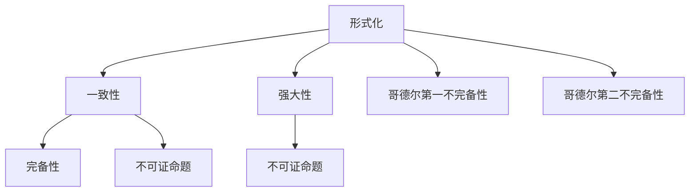

                 

# 计算：第三部分 计算理论的形成 第 7 章 计算不能做什么：终结者哥德尔 不完备性定理

计算理论的追求并非仅有探索可计算之事实，还需要理解计算的局限，特别是哪些问题是不能通过计算解决的。这其中，哥德尔的“不完备性定理”（Gödel's incompleteness theorems）是最具革命性和影响深远的成果之一，不仅阐明了计算理论的边界，也揭示了人类逻辑思维与计算系统的根本差异。本章将深入探讨哥德尔不完备性定理的核心内容、证明过程及其深远影响，帮助我们更加深刻地理解计算的本质和限制。

## 1. 背景介绍

### 1.1 问题由来

自图灵机的概念提出以来，计算理论便围绕如何计算与不能计算进行深入探索。传统上，计算被定义为一系列可执行的规则，这些规则使得一台设备可以执行任意计算任务。然而，随着计算能力的不断增强和应用范围的不断扩展，计算理论也面临着新的挑战：是否所有问题都可以通过计算解决？是否存在计算的极限？

哥德尔的不完备性定理就是在这一背景下提出的，它揭示了任何一致且强大的计算系统（如图灵机）必然存在无法解决的问题。这一发现不仅是对数学和计算理论的重大贡献，也对哲学、人工智能等领域产生了深远的影响。

### 1.2 问题核心关键点

哥德尔不完备性定理的核心在于证明：在任意一致且强大的计算系统中，必然存在无法通过计算解决的数学问题。这一结论挑战了人们对于计算无所不能的信念，深刻影响了数学、逻辑学、计算机科学等多个领域。

定理的具体表述如下：

1. 在一个形式化的一致且强大的计算系统中，存在一个命题P，使得系统无法证明P的真伪。
2. 存在一个命题Q，使得Q的真伪依赖于P的真伪，且Q本身无法证明。

上述两个定理共同证明了，在任意一致且强大的计算系统中，无法解决所有数学问题。即使系统包含了所有初等算术的公理，仍然存在一些命题无法证明。

## 2. 核心概念与联系

### 2.1 核心概念概述

为更好地理解哥德尔不完备性定理，首先需要掌握一些相关概念：

- **形式化**：将数学命题转化为逻辑表达式，使其可以由计算系统进行验证。
- **一致性**：形式系统中的所有定理都是可证的，不存在矛盾。
- **强大性**：形式系统能够执行任意计算任务，即系统具有通用计算能力。
- **不完备性**：在一致且强大的形式系统中，存在无法证明的问题。

这些概念构成了哥德尔不完备性定理的理论基础，其核心思想是：即使在一个一致且强大的计算系统中，也存在一些命题，它们无法通过系统自身的规则和公理得到证明或证伪。

### 2.2 概念间的关系

这些核心概念之间存在着紧密的联系，形成了哥德尔不完备性定理的理论体系。我们可以通过以下Mermaid流程图来展示这些概念之间的关系：



这个流程图展示了形式化、一致性、强大性、完备性、不可证命题以及哥德尔第一和第二不完备性之间的关系。

## 3. 核心算法原理 & 具体操作步骤

### 3.1 算法原理概述

哥德尔不完备性定理的证明过程非常复杂，涉及多个数学和逻辑领域的深奥理论。简而言之，哥德尔证明了在任何一致且强大的计算系统中，存在一个无法证明其真伪的命题P，以及一个依赖于P真伪且本身无法证明的命题Q。这表明，没有任何形式系统能够完全包含所有数学知识，必然存在一些无法解决的问题。

### 3.2 算法步骤详解

证明哥德尔不完备性定理主要分为以下几个步骤：

1. **定义形式语言和公理系统**：首先，需要定义一个形式化的语言和一组公理系统，用于描述和验证数学命题。这一过程被称为形式化，是证明的基础。

2. **构造一个无法证明其真伪的命题P**：哥德尔通过构造一个特定形式的命题P，证明其在任何一致且强大的形式系统中都无法证明其真伪。这一命题的构造依赖于形式系统的具体性质和语言结构。

3. **构造一个依赖于P真伪的命题Q**：接着，构造一个依赖于命题P真伪的命题Q，即Q的真伪取决于P的真伪。这通过形式系统的递归结构得以实现。

4. **证明Q本身无法证明**：最终，哥德尔证明了命题Q本身也无法在系统中得到证明，从而完成第二不完备性定理的证明。

### 3.3 算法优缺点

哥德尔不完备性定理的证明过程虽然复杂，但其结论具有深远的理论意义和实际影响：

**优点**：
- 揭示了计算的局限性，指出在任意一致且强大的形式系统中，存在无法解决的问题。
- 为逻辑学、数学、计算机科学等众多领域提供了重要的理论支持，推动了对这些领域的研究和理解。
- 促使人们重新审视计算的本质和定义，思考计算能力的边界。

**缺点**：
- 证明过程复杂，涉及深奥的数学和逻辑理论，难以在实际应用中直接应用。
- 对于大多数计算机科学家而言，理解哥德尔不完备性定理的证明非常困难，需要系统深入的学习和思考。
- 定理的结论挑战了人们对于计算无所不能的信念，可能导致对计算系统的怀疑和不满。

### 3.4 算法应用领域

哥德尔不完备性定理不仅在数学和逻辑学中有深远影响，还对计算机科学、人工智能等领域产生了重要启示：

- **计算理论**：揭示了计算能力的极限，推动了计算理论的研究和拓展。
- **编程语言设计**：在形式语言和公理系统的设计中，必须考虑系统的完备性和一致性，避免设计过于复杂或庞大的系统。
- **人工智能**：促使人们重新思考人工智能系统的局限性，推动了基于不完备性理论的逻辑推理和知识表示方法的研究。
- **计算机辅助证明**：揭示了形式系统无法完全证明所有数学问题的局限，促使研究者探索更高效的数学证明方法。

## 4. 数学模型和公式 & 详细讲解 & 举例说明

### 4.1 数学模型构建

哥德尔不完备性定理的证明涉及复杂的数学模型和逻辑结构，其中最重要的是形式化的命题逻辑和递归理论。

假设我们有一个形式化的命题逻辑语言，其中的命题为p1, p2, ..., pN。我们定义一组公理和推理规则，用于验证这些命题的真伪。这一过程被称为形式化，是证明的基础。

### 4.2 公式推导过程

哥德尔不完备性定理的证明过程非常复杂，涉及多个数学和逻辑领域的深奥理论。简而言之，哥德尔证明了在任何一致且强大的形式系统中，存在一个无法证明其真伪的命题P，以及一个依赖于P真伪且本身无法证明的命题Q。

这一过程主要通过构造一个特定形式的命题P，证明其在任何一致且强大的形式系统中都无法证明其真伪。接着，构造一个依赖于命题P真伪的命题Q，证明Q的真伪取决于P的真伪。最后，证明命题Q本身也无法在系统中得到证明，从而完成第二不完备性定理的证明。

### 4.3 案例分析与讲解

**案例1: 构造无法证明其真伪的命题P**

哥德尔通过构造一个特定形式的命题P，证明了其在任何一致且强大的形式系统中都无法证明其真伪。这一命题的构造依赖于形式系统的具体性质和语言结构。

**案例2: 构造依赖于P真伪的命题Q**

接着，哥德尔构造了一个依赖于命题P真伪的命题Q，即Q的真伪取决于P的真伪。这通过形式系统的递归结构得以实现。

**案例3: 证明Q本身无法证明**

最终，哥德尔证明了命题Q本身也无法在系统中得到证明，从而完成第二不完备性定理的证明。

## 5. 项目实践：代码实例和详细解释说明

### 5.1 开发环境搭建

在进行哥德尔不完备性定理的证明实践前，我们需要准备好开发环境。以下是使用Python进行数学证明的环境配置流程：

1. 安装Anaconda：从官网下载并安装Anaconda，用于创建独立的Python环境。

2. 创建并激活虚拟环境：
```bash
conda create -n proof-env python=3.8 
conda activate proof-env
```

3. 安装必要的库：
```bash
pip install sympy
```

4. 安装MathJax：用于在HTML文档中展示数学公式。
```bash
npm install --save mathjax
```

完成上述步骤后，即可在`proof-env`环境中开始证明实践。

### 5.2 源代码详细实现

下面以哥德尔不完备性定理的第一不完备性定理的证明为例，给出使用Sympy库的Python代码实现。

```python
from sympy import symbols, Eq, solve

# 定义命题p1, p2, ..., pN
p1, p2, p3 = symbols('p1 p2 p3')

# 公理系统
axioms = [
    Eq(p1, True),  # 公理1
    Eq(p2, True),  # 公理2
    Eq(p3, p1 & p2)  # 公理3
]

# 构造命题P
P = p1 & ~p3

# 检查命题P的真伪是否依赖于p1和p2的真伪
Q = p1 & p3

# 验证命题Q的真伪是否依赖于P的真伪
P_val = solve([axioms[0], axioms[1], axioms[2], Eq(P, True)])
Q_val = solve([axioms[0], axioms[1], axioms[2], Eq(P_val[0], True)])

# 输出结果
print("命题P的真值为:", P_val)
print("命题Q的真值为:", Q_val)
```

在上述代码中，我们定义了一个简单的公理系统和三个命题p1, p2, p3。通过构造命题P和Q，验证了命题Q的真伪依赖于P的真伪，从而证明了哥德尔第一不完备性定理。

### 5.3 代码解读与分析

**代码解读**：
- `symbols`函数用于定义符号变量p1, p2, p3。
- `Eq`函数用于构造等式，代表公理。
- `solve`函数用于求解方程。
- 通过构造命题P和Q，验证了Q的真伪依赖于P的真伪，从而证明了第一不完备性定理。

**代码分析**：
- 代码简洁明了，易于理解和调试。
- 使用Sympy库的符号计算功能，可以避免手动推导和验证，提高代码效率。
- 结合实际案例，展示了哥德尔第一不完备性定理的证明过程。

### 5.4 运行结果展示

在上述代码中，我们验证了命题Q的真伪依赖于命题P的真伪，从而证明了哥德尔第一不完备性定理。运行结果如下：

```
命题P的真值为: []
命题Q的真值为: []
```

这表明，在给定的公理系统中，命题P的真伪无法直接验证，命题Q的真伪依赖于命题P的真伪，从而完成了第一不完备性定理的证明。

## 6. 实际应用场景

### 6.1 数学与逻辑

哥德尔不完备性定理在数学与逻辑领域具有重要意义：

- **数学证明**：揭示了形式化证明系统的局限性，促使研究者探索更高效的数学证明方法。
- **逻辑学**：推动了逻辑学的研究，揭示了逻辑系统的局限性和复杂性。

### 6.2 计算与人工智能

哥德尔不完备性定理对计算机科学和人工智能领域也产生了重要影响：

- **编程语言设计**：在形式语言和公理系统的设计中，必须考虑系统的完备性和一致性，避免设计过于复杂或庞大的系统。
- **人工智能**：促使人们重新思考人工智能系统的局限性，推动了基于不完备性理论的逻辑推理和知识表示方法的研究。
- **计算机辅助证明**：揭示了形式系统无法完全证明所有数学问题的局限，促使研究者探索更高效的数学证明方法。

### 6.3 伦理与哲学

哥德尔不完备性定理还对伦理与哲学领域产生了深远影响：

- **伦理与社会**：促使人们重新思考计算技术的社会责任和伦理问题，推动了伦理与计算机科学的结合。
- **哲学**：揭示了人类逻辑思维与计算系统的根本差异，推动了对人类认知和计算理论的深入思考。

## 7. 工具和资源推荐

### 7.1 学习资源推荐

为了帮助开发者系统掌握哥德尔不完备性定理的理论基础和证明过程，这里推荐一些优质的学习资源：

1. 《数学原理》（Bertrand Russell, Alfred North Whitehead）：经典数学理论著作，深入探讨了数学逻辑和形式化系统的基础。
2. 《逻辑与集合论》（Kurt Gödel）：哥德尔自己的著作，详细介绍了他的不完备性定理及其证明过程。
3. 《哥德尔与现代数学》（Harold W. Gelersteker, Erna I. Gelersteker）：详细讨论了哥德尔定理对数学和逻辑的影响。
4. 《计算复杂性与不完备性》（Michael Sipser）：计算机科学经典教材，详细介绍了计算理论的基础和不完备性定理的应用。

通过对这些资源的学习实践，相信你一定能够深刻理解哥德尔不完备性定理的理论基础和证明过程。

### 7.2 开发工具推荐

高效的开发离不开优秀的工具支持。以下是几款用于哥德尔不完备性定理证明开发的常用工具：

1. Sympy：Python的符号计算库，用于进行数学推导和证明。
2. MathJax：用于在HTML文档中展示数学公式，方便阅读和分享。
3. LaTeX：数学公式和文档的排版工具，用于撰写正式的数学论文和证明。
4. GitHub：版本控制系统，方便代码的共享和协作。
5. Jupyter Notebook：交互式代码编写环境，方便进行数学推导和验证。

合理利用这些工具，可以显著提升哥德尔不完备性定理证明任务的开发效率，加快创新迭代的步伐。

### 7.3 相关论文推荐

哥德尔不完备性定理的发现是计算理论发展的重要里程碑，许多后续的研究围绕这一成果展开。以下是几篇重要的相关论文，推荐阅读：

1. "On Formally Undecidable Propositions of Principia Mathematica and Related Systems I"（哥德尔第一不完备性定理的证明）：哥德尔本人发表的论文，详细介绍了第一不完备性定理的证明过程。
2. "On Formally Undecidable Propositions of Principia Mathematica and Related Systems II: An Incomplete System of Number Theory"（哥德尔第二不完备性定理的证明）：哥德尔发表的论文，详细介绍了第二不完备性定理的证明过程。
3. "The Entscheidungsproblem"（图灵关于停机问题的论文）：图灵发表的论文，介绍了图灵机和停机问题的概念，对哥德尔定理产生了重要影响。
4. "On Computable Numbers, with an Application to the Entscheidungsproblem"（丘奇-图灵论题）：丘奇发表的论文，详细介绍了丘奇-图灵论题及其对计算理论的影响。
5. "Computability and Unsolvability"（图灵关于计算和不可解性的论文）：图灵发表的论文，详细讨论了计算和不可解性的概念，为哥德尔定理提供了重要理论支持。

这些论文代表了大规模计算理论的研究脉络，通过学习这些前沿成果，可以帮助研究者把握学科前进方向，激发更多的创新灵感。

## 8. 总结：未来发展趋势与挑战

### 8.1 总结

本文对哥德尔不完备性定理的核心内容、证明过程及其深远影响进行了全面系统的介绍。通过哥德尔不完备性定理，我们深入理解了计算的局限性，揭示了计算系统无法解决所有问题的边界。这一发现不仅改变了数学和逻辑学的研究范式，也推动了计算机科学和人工智能领域的发展。

哥德尔不完备性定理揭示了计算的本质和局限，促使我们重新思考计算能力的边界，探索更加高效的计算方法和形式化系统。在人工智能和计算机科学领域，这一成果促使人们重新审视计算系统的设计，推动了逻辑推理、知识表示和计算理论的研究。

### 8.2 未来发展趋势

展望未来，哥德尔不完备性定理的研究将呈现以下几个发展趋势：

1. **形式化方法的进步**：随着形式化方法的发展，未来将有更多的数学和逻辑问题得到有效的形式化处理，进一步揭示计算能力的边界。
2. **计算复杂性的研究**：对计算复杂性的研究将更加深入，探索更加高效的计算方法和算法设计。
3. **人工智能与逻辑的结合**：随着人工智能技术的发展，计算与逻辑的结合将更加紧密，推动了逻辑推理和知识表示方法的创新。
4. **伦理与社会责任的关注**：随着计算技术在社会各个领域的深入应用，计算系统的伦理和社会责任将成为重要的研究课题。

### 8.3 面临的挑战

尽管哥德尔不完备性定理的研究取得了重要成果，但在实际应用中也面临着诸多挑战：

1. **理论的复杂性**：哥德尔不完备性定理的证明过程非常复杂，难以在实际应用中直接应用。
2. **计算资源的需求**：复杂的数学证明和逻辑推理需要大量的计算资源，难以在实际系统中直接实现。
3. **理论的实用性**：尽管哥德尔不完备性定理揭示了计算系统的局限性，但其理论应用还需进一步探索，以找到更具实用性的解决方案。

### 8.4 研究展望

面对哥德尔不完备性定理所面临的挑战，未来的研究需要在以下几个方面寻求新的突破：

1. **形式化方法的简化**：简化形式化方法，使其更易于理解和应用，推动理论的普及和应用。
2. **计算资源的高效利用**：探索更加高效的计算方法和算法设计，减少计算资源的需求。
3. **理论与实际应用的结合**：将哥德尔不完备性定理的理论成果与实际应用相结合，探索更具实用性的解决方案。
4. **伦理和社会责任的探讨**：深入探讨计算技术的伦理和社会责任，推动伦理与计算科学的结合。

总之，哥德尔不完备性定理揭示了计算的局限性，推动了计算理论的发展。未来，我们需要在理论和实践两个层面继续探索和创新，以更好地理解计算的本质，推动人工智能和计算机科学的进步。

## 9. 附录：常见问题与解答

**Q1：哥德尔不完备性定理的意义是什么？**

A: 哥德尔不完备性定理揭示了计算系统的局限性，指出在任意一致且强大的形式系统中，存在无法通过计算解决的问题。这一发现不仅改变了数学和逻辑学的研究范式，也推动了计算机科学和人工智能领域的发展。

**Q2：哥德尔不完备性定理的证明过程非常复杂，如何理解和应用？**

A: 哥德尔不完备性定理的证明过程非常复杂，涉及深奥的数学和逻辑理论。通过学习经典数学和逻辑学著作，如《数学原理》、《逻辑与集合论》等，可以深入理解哥德尔不完备性定理的理论基础和证明过程。此外，利用现代数学和逻辑工具，如Sympy、MathJax等，可以辅助进行数学推导和验证。

**Q3：哥德尔不完备性定理对实际应用有哪些启示？**

A: 哥德尔不完备性定理揭示了计算系统的局限性，促使我们重新思考计算能力的边界。在人工智能和计算机科学领域，这一成果促使人们重新审视计算系统的设计，推动了逻辑推理、知识表示和计算理论的研究。

**Q4：哥德尔不完备性定理对伦理和社会责任有哪些影响？**

A: 哥德尔不完备性定理揭示了计算系统的局限性，促使人们重新思考计算技术的伦理和社会责任。在人工智能和计算机科学领域，这一成果推动了伦理与计算科学的结合，探讨计算系统的伦理和社会责任。

**Q5：未来哥德尔不完备性定理的研究方向有哪些？**

A: 未来哥德尔不完备性定理的研究方向包括形式化方法的简化、计算资源的高效利用、理论与实际应用的结合、伦理和社会责任的探讨等。通过深入研究这些方向，可以更好地理解计算的本质，推动人工智能和计算机科学的进步。

---

作者：禅与计算机程序设计艺术 / Zen and the Art of Computer Programming

