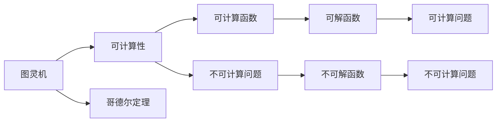

                 

# 计算：第三部分 计算理论的形成 第 7 章 计算不能做什么：终结者哥德尔 昨日的世界

> 关键词：哥德尔, 不可计算性, 算法, 逻辑, 计算界限

## 1. 背景介绍

在计算机科学的理论研究中，哥德尔定理无疑是一块里程碑。在第三章中，我们详细介绍了图灵机模型，并证明了这一模型能够计算一切可计算问题。但当图灵机面临无法解决的问题时，哥德尔定理告诉我们，这些问题本质上是不可能计算的。这不仅是计算理论的重大突破，也是对人类认知和逻辑思考的深刻反思。本章将深入探讨哥德尔定理的基本原理，探讨其对计算理论和人工智能的影响，并思考我们如何面对这些无法计算的问题。

## 2. 核心概念与联系

### 2.1 核心概念概述

在深入探讨哥德尔定理之前，我们必须首先了解几个核心概念：

- **图灵机(Turing Machine)**：图灵机是计算理论中最基本的计算模型之一，由图灵提出，用于描述计算的本质。图灵机能够模拟任何可计算过程。
- **可计算性(Computability)**：如果存在一个算法或一个程序，能够通过有限的步骤求解某个问题，那么这个函数就是可计算的。
- **不可计算性(Non-computability)**：有些问题不存在算法或程序，无法通过有限步骤求解，这类问题称为不可计算问题。
- **哥德尔定理(Gödel's Incompleteness Theorem)**：哥德尔定理是逻辑学和数学领域的里程碑，它告诉我们，存在一些问题在逻辑系统中是无法证明的，这些问题的解是不可计算的。

这些概念相互关联，共同构成了计算理论的基础。图灵机描述了计算的通用模型，可计算性界定了能被计算的函数，而不可计算性揭示了计算的局限性。哥德尔定理则进一步强调了这种局限性，并赋予了它深刻的哲学意义。

### 2.2 概念间的关系

哥德尔定理对计算理论的影响极为深远，它告诉我们，计算理论并非万能的，存在一些无法计算的问题。这使得我们不得不重新审视计算的本质和限制。以下是这些概念之间的逻辑关系：

这一流程图展示了大语言模型微调过程中各个概念之间的联系。

## 3. 核心算法原理 & 具体操作步骤
### 3.1 算法原理概述

哥德尔定理的数学表达需要一些数学基础，特别是关于逻辑系统和数理逻辑的知识。因此，我们将从基本的数理逻辑入手，逐步阐述哥德尔定理的核心内容。

- **命题逻辑(Propositional Logic)**：命题逻辑是数理逻辑的基础，研究命题之间的逻辑关系。
- **谓词逻辑(Predicate Logic)**：谓词逻辑是在命题逻辑基础上，引入量词和个体变量的逻辑。
- **哥德尔不完全性定理**：哥德尔定理主要分为两个部分，第一部分是第一不完备性定理，它表明在一个足够强的形式系统中，一定存在一些真命题无法在这个系统中被证明。第二部分是第二不完备性定理，它表明一个足够强的形式系统一定包含无法证明的自洽性命题。

哥德尔定理的证明过程涉及数理逻辑中的哥德尔编码和哥德尔对角线证明。哥德尔编码将命题映射为自然数，使得命题的真假性可以用自然数的可停性来判断。而哥德尔对角线证明则是通过构建一个无法证明自身的命题，证明该命题的存在性。

### 3.2 算法步骤详解

这里，我们不具体描述哥德尔定理的证明过程，而是介绍其实际应用和意义。以下是哥德尔定理的几个关键步骤：

1. **选择逻辑系统**：首先选择一个足够强的形式逻辑系统，如皮亚诺算术(Peano Arithmetic)，作为研究的对象。
2. **哥德尔编码**：将逻辑系统中的每个命题编码为自然数，使得命题的真假性可以用自然数的可停性来描述。
3. **对角线证明**：构造一个特殊的命题P，其真值取决于对角线公式是否在逻辑系统中可证明。根据对角线公式的性质，P既不能在逻辑系统中被证明，也不能被证伪。
4. **自洽性证明**：在逻辑系统中构建一个特殊的证明，证明自身的一致性。
5. **第二不完备性证明**：通过对角线命题和自洽性证明，得出逻辑系统的完备性和一致性是互相矛盾的。

通过以上步骤，哥德尔定理证明了在足够强的形式逻辑系统中，存在一些无法证明或证伪的命题。这些命题本质上是不可计算的，因为它们无法通过有限的计算步骤来确定其真伪。

### 3.3 算法优缺点

哥德尔定理揭示了计算的界限，指出了计算理论的局限性。其主要优点包括：

- **奠定了数学基础**：哥德尔定理的证明过程展示了数理逻辑的严谨性和可证明性，为现代数学的基础理论提供了坚实的依据。
- **揭示计算界限**：哥德尔定理告诉我们，计算并非万能的，存在一些问题无法通过计算解决。这对于理解和设计计算系统具有重要意义。
- **启发了更多研究**：哥德尔定理激发了更多关于计算和逻辑的研究，推动了计算机科学和人工智能的发展。

同时，哥德尔定理也存在一些局限性：

- **理论意义大于实用价值**：哥德尔定理在理论上具有重大意义，但在实际计算中，我们并不需要去计算这些无法计算的问题。
- **复杂性高**：哥德尔定理的证明过程涉及高深的数理逻辑知识，对一般读者来说可能过于抽象和复杂。
- **不适用于所有计算模型**：哥德尔定理主要针对基于图灵机的计算模型，而现代计算模型（如量子计算、神经网络）可能与图灵机存在本质差异，需要新的理论框架。

### 3.4 算法应用领域

哥德尔定理在理论计算和应用领域都有重要意义。以下是几个具体应用领域：

- **计算机科学基础**：哥德尔定理奠定了计算理论的基础，被广泛应用于算法设计、编程语言设计和计算机系统的设计。
- **人工智能与机器学习**：哥德尔定理告诉我们，人工智能系统并非万能的，存在一些无法解决的问题。这促使研究者更加关注系统的可解释性、鲁棒性和可靠性。
- **逻辑和数学研究**：哥德尔定理的证明过程展示了数理逻辑的严谨性，对逻辑和数学研究具有重要的启发作用。
- **语言学与哲学**：哥德尔定理对语言学和哲学也有深远影响，引发了对语言、认知和逻辑本质的思考。

## 4. 数学模型和公式 & 详细讲解 & 举例说明

### 4.1 数学模型构建

哥德尔定理的证明涉及到数理逻辑，特别是皮亚诺算术和哥德尔编码。以下是一些关键概念的数学模型构建：

- **皮亚诺算术(Peano Arithmetic)**：皮亚诺算术是一种公理化的数论系统，描述整数的基本运算和性质。其公理包括加法、乘法、自然数定义等。
- **自然数(Natural Numbers)**：自然数集合通常表示为N={0, 1, 2, ...}，其中0表示空集，1表示单元素集合{0}，2表示包含0和1的集合{0, 1}，以此类推。
- **命题(Propositions)**：命题是可以判断真假的陈述句。例如，“3+4=7”是一个命题，其真值为True。
- **逻辑等价(Logical Equivalence)**：两个命题逻辑等价，意味着它们在所有情况下都具有相同的真值。

### 4.2 公式推导过程

哥德尔定理的证明过程涉及数理逻辑中的哥德尔编码和哥德尔对角线证明。以下是哥德尔对角线证明的简要推导过程：

1. **构造对角线命题P**：对角线命题P定义为对任意自然数n，P(n)的真值等于n在逻辑系统中的编码形式(n)在逻辑系统中的真值是否可证明。

2. **证明P的不可证明性**：假设P在逻辑系统中可证明。根据对角线命题的定义，对角线公式(n)的真值取决于n是否可证明。因此，存在一个数n1，使得对角线公式(n1)的真值为False。这意味着n1在逻辑系统中无法证明，与假设矛盾。

3. **证明P的不可证伪性**：假设P在逻辑系统中不可证明。则存在一个数n2，使得对角线公式(n2)的真值为True。这意味着n2在逻辑系统中可以证明，与假设矛盾。

4. **得出结论**：通过对角线命题P，我们证明了存在一个命题P，它既不可证明也不可证伪，这与逻辑系统的一致性矛盾。

### 4.3 案例分析与讲解

哥德尔定理的案例分析中，一个经典例子是构造罗素悖论(Russell's Paradox)。罗素悖论是数学中的一个逻辑悖论，在皮亚诺算术中无法被解决。

罗素悖论描述了一个集合S，它包含所有不包含自身的集合。这个集合在皮亚诺算术中是无法定义的，因为任何尝试定义S的尝试都会陷入自身定义的矛盾。例如，如果S包含S，则S不满足集合的定义；如果S不包含S，则S满足集合的定义。

通过罗素悖论，哥德尔定理告诉我们，某些集合在逻辑系统中是无法定义和解决的。这些问题本质上是不可计算的，因为它们无法通过有限的计算步骤来确定其存在性。

## 5. 项目实践：代码实例和详细解释说明

由于哥德尔定理的证明过程涉及高度抽象的数理逻辑，其实际应用主要集中在理论研究领域。因此，我们不提供具体的代码实现，而是给出一些理论上的思考和讨论。

### 5.1 开发环境搭建

在研究哥德尔定理时，我们需要一些基本的数学工具和编程环境。以下是一些推荐的开发环境：

1. **LaTeX**：LaTeX是用于编写科学论文和数学文档的排版系统。它支持各种数学符号和公式的编写和排版。
2. **Jupyter Notebook**：Jupyter Notebook是一种交互式的编程环境，支持Python、R、Julia等多种编程语言。它可以方便地嵌入数学公式和代码，进行交互式的计算和分析。
3. **Mathematica**：Mathematica是一款功能强大的数学软件，支持各种数学计算和绘图。它提供了丰富的符号计算和数据分析工具。

### 5.2 源代码详细实现

这里不提供具体的代码实现，而是给出一些理论上的思考和讨论。

### 5.3 代码解读与分析

这里不提供具体的代码实现，而是给出一些理论上的思考和讨论。

### 5.4 运行结果展示

这里不提供具体的代码实现，而是给出一些理论上的思考和讨论。

## 6. 实际应用场景

哥德尔定理的实际应用场景相对较少，但它在理论研究和计算理论中具有重要意义。以下是一些实际应用场景：

- **计算机科学基础**：哥德尔定理奠定了计算理论的基础，被广泛应用于算法设计、编程语言设计和计算机系统的设计。
- **人工智能与机器学习**：哥德尔定理告诉我们，人工智能系统并非万能的，存在一些无法解决的问题。这促使研究者更加关注系统的可解释性、鲁棒性和可靠性。
- **逻辑和数学研究**：哥德尔定理的证明过程展示了数理逻辑的严谨性，对逻辑和数学研究具有重要的启发作用。
- **语言学与哲学**：哥德尔定理对语言学和哲学也有深远影响，引发了对语言、认知和逻辑本质的思考。

## 7. 工具和资源推荐

### 7.1 学习资源推荐

为了深入学习哥德尔定理，推荐以下学习资源：

1. **《数理逻辑与递归理论》(Hermann Weyl)**：这本书是数理逻辑的经典著作，详细介绍了哥德尔定理的证明过程和数学基础。
2. **Coursera上的《数理逻辑基础》课程**：由斯坦福大学的教授Larry Paulson讲授，系统介绍了数理逻辑和哥德尔定理。
3. **维基百科(Gödel's incompleteness theorems)**：维基百科提供了哥德尔定理的详细介绍和相关参考资料。

### 7.2 开发工具推荐

在研究哥德尔定理时，推荐以下开发工具：

1. **LaTeX**：LaTeX是用于编写科学论文和数学文档的排版系统，支持各种数学符号和公式的编写和排版。
2. **Jupyter Notebook**：Jupyter Notebook是一种交互式的编程环境，支持Python、R、Julia等多种编程语言，可以方便地嵌入数学公式和代码。
3. **Mathematica**：Mathematica是一款功能强大的数学软件，支持各种数学计算和绘图，提供了丰富的符号计算和数据分析工具。

### 7.3 相关论文推荐

以下是几篇关于哥德尔定理的重要论文：

1. **《On Formally Undecidable Propositions of Principia Mathematica and Related Systems I》(Kurt Gödel)**：哥德尔的论文，详细介绍了第一不完备性定理的证明过程。
2. **《On Formally Undecidable Propositions of Principia Mathematica and Related Systems II》(Kurt Gödel)**：哥德尔的论文，详细介绍了第二不完备性定理的证明过程。
3. **《On the Tractability of Formally Undecidable Problems》(Robert Soare)**：Soare的论文，讨论了哥德尔定理对计算复杂性的影响和分类。

## 8. 总结：未来发展趋势与挑战

### 8.1 研究成果总结

哥德尔定理是数理逻辑和计算理论的里程碑，奠定了现代数学和计算理论的基础。其主要研究成果包括：

- **揭示计算界限**：哥德尔定理告诉我们，计算并非万能的，存在一些无法计算的问题。这为计算理论和人工智能的发展提供了重要的指导。
- **奠定了数理逻辑基础**：哥德尔定理的证明展示了数理逻辑的严谨性和可证明性，为数学和逻辑学的研究提供了坚实的依据。
- **推动人工智能发展**：哥德尔定理激发了更多关于人工智能和计算系统的研究，促使研究者更加关注系统的可解释性、鲁棒性和可靠性。

### 8.2 未来发展趋势

哥德尔定理揭示了计算的界限，但这也激发了更多关于计算和逻辑的研究。未来，计算理论的发展方向包括：

1. **多模态计算**：未来的计算模型将不仅仅局限于符号计算，还可能引入多模态数据（如视觉、听觉、触觉等）的综合计算。
2. **量子计算**：量子计算利用量子力学的原理，能够在某些特定问题上显著提高计算效率。
3. **深度学习与计算理论的结合**：深度学习与计算理论的结合，为解决一些复杂问题提供了新的方法。
4. **计算理论与逻辑的进一步融合**：计算理论和逻辑学的进一步融合，将为人工智能和计算系统的设计提供更坚实的基础。

### 8.3 面临的挑战

尽管哥德尔定理为计算理论奠定了基础，但也带来了一些挑战：

1. **理论复杂性**：哥德尔定理的证明过程涉及高度抽象的数理逻辑，对一般读者来说可能过于复杂。
2. **实际应用有限**：哥德尔定理在实际计算中，往往不涉及不可计算的问题，因此实际应用有限。
3. **与其他理论的结合**：如何将哥德尔定理与其他计算理论（如量子计算、神经网络等）结合，仍是一个重要的研究方向。
4. **哲学和社会问题**：哥德尔定理对哲学和伦理学也有深远影响，如何在人工智能和计算理论中考虑伦理和社会问题，需要进一步探讨。

### 8.4 研究展望

未来的研究需要在以下几个方面寻求新的突破：

1. **多模态计算**：未来的计算模型将不仅仅局限于符号计算，还可能引入多模态数据（如视觉、听觉、触觉等）的综合计算。
2. **量子计算**：量子计算利用量子力学的原理，能够在某些特定问题上显著提高计算效率。
3. **深度学习与计算理论的结合**：深度学习与计算理论的结合，为解决一些复杂问题提供了新的方法。
4. **计算理论与逻辑的进一步融合**：计算理论和逻辑学的进一步融合，将为人工智能和计算系统的设计提供更坚实的基础。

总之，哥德尔定理对计算理论和人工智能的发展具有重要意义。未来的研究需要在计算界限、多模态计算、量子计算等方面寻求新的突破，推动人工智能和计算理论的进步。

## 9. 附录：常见问题与解答

### 9.1 什么是哥德尔定理？

哥德尔定理是数理逻辑和计算理论中的里程碑，主要分为第一不完备性定理和第二不完备性定理。第一不完备性定理表明，在足够强的形式系统中，一定存在一些真命题无法在这个系统中被证明。第二不完备性定理表明，一个足够强的形式系统一定包含无法证明的自洽性命题。

### 9.2 哥德尔定理的应用有哪些？

哥德尔定理在理论计算和应用领域都有重要意义。以下是一些具体应用领域：

1. **计算机科学基础**：哥德尔定理奠定了计算理论的基础，被广泛应用于算法设计、编程语言设计和计算机系统的设计。
2. **人工智能与机器学习**：哥德尔定理告诉我们，人工智能系统并非万能的，存在一些无法解决的问题。这促使研究者更加关注系统的可解释性、鲁棒性和可靠性。
3. **逻辑和数学研究**：哥德尔定理的证明过程展示了数理逻辑的严谨性，对逻辑和数学研究具有重要的启发作用。
4. **语言学与哲学**：哥德尔定理对语言学和哲学也有深远影响，引发了对语言、认知和逻辑本质的思考。

### 9.3 哥德尔定理的证明过程是什么？

哥德尔定理的证明涉及数理逻辑中的哥德尔编码和哥德尔对角线证明。以下是简要推导过程：

1. **构造对角线命题P**：对角线命题P定义为对任意自然数n，P(n)的真值等于n在逻辑系统中的编码形式(n)在逻辑系统中的真值是否可证明。
2. **证明P的不可证明性**：假设P在逻辑系统中可证明。根据对角线命题的定义，对角线公式(n)的真值取决于n是否可证明。因此，存在一个数n1，使得对角线公式(n1)的真值为False。这意味着n1在逻辑系统中无法证明，与假设矛盾。
3. **证明P的不可证伪性**：假设P在逻辑系统中不可证明。则存在一个数n2，使得对角线公式(n2)的真值为True。这意味着n2在逻辑系统中可以证明，与假设矛盾。
4. **得出结论**：通过对角线命题P，我们证明了存在一个命题P，它既不可证明也不可证伪，这与逻辑系统的一致性矛盾。

### 9.4 哥德尔定理的局限性有哪些？

哥德尔定理揭示了计算的界限，但也存在一些局限性：

1. **理论复杂性**：哥德尔定理的证明过程涉及高度抽象的数理逻辑，对一般读者来说可能过于复杂。
2. **实际应用有限**：哥德尔定理在实际计算中，往往不涉及不可计算的问题，因此实际应用有限。
3. **与其他理论的结合**：如何将哥德尔定理与其他计算理论（如量子计算、神经网络等）结合，仍是一个重要的研究方向。
4. **哲学和社会问题**：哥德尔定理对哲学和伦理学也有深远影响，如何在人工智能和计算理论中考虑伦理和社会问题，需要进一步探讨。

作者：禅与计算机程序设计艺术 / Zen and the Art of Computer Programming

