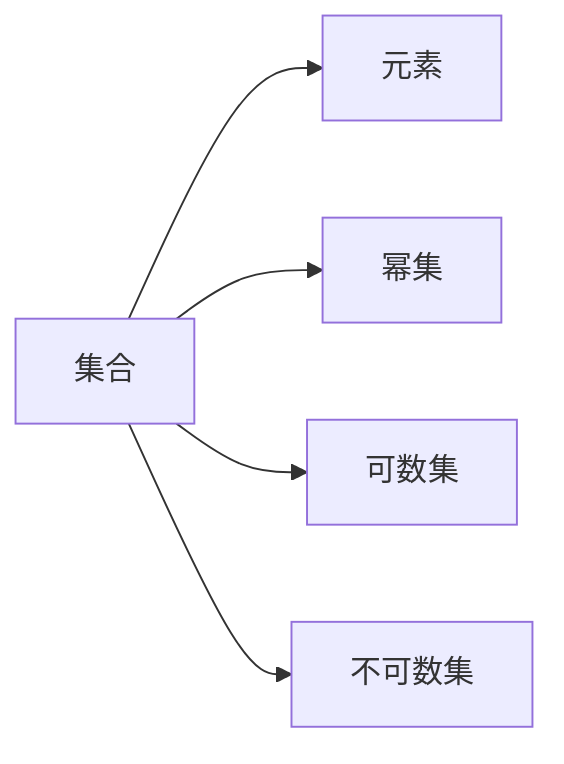
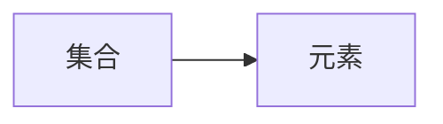
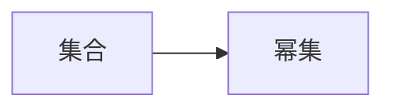
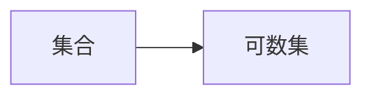
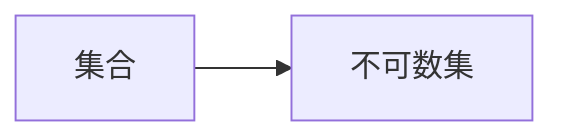
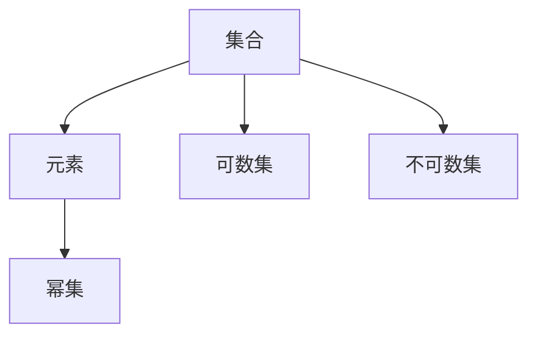

                 

# 计算：第二部分 计算的数学基础 第 5 章 第三次数学危机 集合论悖论

## 1. 背景介绍

### 1.1 问题由来
数学是人类认知世界的工具之一，它以抽象的符号和逻辑推理为手段，构建起一个严谨的逻辑体系。但数学的基础也并非总能无懈可击。历史上，数学曾经经历了几次重大的危机，每一次危机都对数学的发展产生了深远的影响。

在19世纪末到20世纪初，数学界遭遇了第三次数学危机，这一危机的核心是集合论悖论，尤其是著名的罗素悖论。这一悖论不仅挑战了数学的基础，还引发了哲学和逻辑学领域的大讨论，对现代数学的发展产生了深远的影响。

### 1.2 问题核心关键点
第三次数学危机主要体现在集合论中的悖论问题，尤其是罗素悖论。这一悖论的核心思想是：如果存在一个集合S，它包含了所有不包含自身的集合，那么S是否包含自身呢？答案取决于如何定义“集合”的概念。这种自引性质导致了数学中的矛盾和悖论，威胁到了整个数学体系的基础。

这一问题引发了逻辑学家和数学家的广泛关注，促使集合论的理论和实践得到了进一步的发展。现代数学中的集合论基础，如Zermelo-Fraenkel集合论（ZF理论），就是在这一背景下逐步建立起来的。

### 1.3 问题研究意义
罗素悖论揭示了经典集合论中的内在矛盾，促使数学家重新审视集合论的基础，进而推动了数学逻辑和公理化研究的发展。罗素悖论及其解决方法对现代数学、计算机科学、哲学等领域产生了深远的影响，是理解现代数学理论基础的关键。

通过深入探讨罗素悖论及其解决方法，可以更深刻地理解数学逻辑和集合论的精妙之处，为后续深入学习数学和计算机科学相关领域打下坚实的基础。

## 2. 核心概念与联系

### 2.1 核心概念概述

为了更好地理解罗素悖论及其解决方法，我们首先需要介绍几个核心概念：

- **集合（Set）**：集合是数学中最基本的概念之一，它由一些元素组成，这些元素可以是任何类型的数据，如数字、字母、图形等。集合可以用花括号 {} 表示，元素之间用逗号分隔。

- **元素（Element）**：集合中的每一个成员称为元素，它可以是一个具体的数字、字母、图形等，也可以是一个更小的集合。

- **幂集（Power Set）**：一个集合的所有可能子集构成的集合称为它的幂集。幂集的大小（即元素个数）是原集合大小的2的幂次方。

- **可数集（Countable Set）**：如果一个集合可以与自然数集1, 2, 3, ...一一对应，那么这个集合是可数集。

- **不可数集（Uncountable Set）**：如果一个集合不能与自然数集一一对应，那么这个集合是不可数集。

这些概念是理解罗素悖论及其解决方法的基础，它们之间的关系可以通过以下Mermaid流程图来展示：



### 2.2 概念间的关系

这些核心概念之间存在着紧密的联系，形成了罗素悖论及其解决方法的完整生态系统。下面我们通过几个Mermaid流程图来展示这些概念之间的关系。

#### 2.2.1 集合与元素的关系



#### 2.2.2 幂集与集合的关系



#### 2.2.3 可数集与集合的关系



#### 2.2.4 不可数集与集合的关系



### 2.3 核心概念的整体架构

最后，我们用一个综合的流程图来展示这些核心概念在大语言模型微调过程中的整体架构：



这个综合流程图展示了从集合到元素，再到幂集、可数集和不可数集的基本关系。通过这些流程图，我们可以更清晰地理解集合论的基础概念和它们之间的联系。

## 3. 核心算法原理 & 具体操作步骤

### 3.1 算法原理概述

罗素悖论的本质是集合自身的自引性质，这种自引性质在数学中并不允许，因此需要对集合的定义进行修改，以避免自引现象的出现。这一过程被称为集合论的修正，其中最常用的修正方法是公理集合论（Axiomatic Set Theory）。

公理集合论通过一系列严格的公理来定义集合和元素，确保了集合论的逻辑一致性。其中最为著名的是Zermelo-Fraenkel集合论（ZF理论），它包含了以下公理：

1. 空集存在性（Empty Set Existence）：存在一个空集，即不包含任何元素的集合。
2. 配对公理（Pairing）：任何两个元素可以形成一个有序对。
3. 无穷集合公理（Infinite Set）：存在至少一个无限集合。
4. 分离公理（Separation）：对于任何集合和属性，都存在一个只包含具有该属性的元素的子集。
5. 集合的并集（Union）：对于任何集合的并集存在，并满足某些条件。
6. 集合的幂集（Power Set）：对于任何集合，都存在它的幂集。
7. 替换公理（Replacement）：对于任何集合和替换规则，都存在一个集合满足该替换规则。
8. 正则公理（Regularity）：所有集合都是正则的。

这些公理共同构成了一个严谨的数学逻辑体系，避免了罗素悖论中的自引问题。

### 3.2 算法步骤详解

罗素悖论及其解决方法的数学算法主要包括两个步骤：

1. **定义新集合（Modified Set Definition）**：通过对集合的定义进行修改，避免自引现象的出现。例如，将集合定义为“由定义不包含自身的元素组成的集合”，从而避免了罗素悖论中的自引问题。
2. **验证新定义的一致性（Consistency Check）**：通过一系列的公理和推理规则，验证新定义的逻辑一致性。例如，使用公理集合论中的公理来证明新定义下的集合满足所有必要条件。

具体步骤如下：

1. **定义集合**：将集合定义为“由定义不包含自身的元素组成的集合”。
2. **定义元素**：将元素定义为“集合中的一个元素”。
3. **定义幂集**：将幂集定义为“一个集合的所有可能子集构成的集合”。
4. **定义可数集**：将可数集定义为“可以与自然数集一一对应的集合”。
5. **定义不可数集**：将不可数集定义为“不能与自然数集一一对应的集合”。

### 3.3 算法优缺点

罗素悖论及其解决方法具有以下优点：

1. 避免了集合论中的自引问题，确保了数学逻辑的一致性。
2. 提供了严谨的数学公理体系，便于数学家进行理论研究和实践验证。

但同时也存在一些缺点：

1. 修改后的集合定义相对复杂，可能影响直观理解和应用。
2. 验证新定义的一致性需要严格遵守公理和推理规则，增加了理论研究的难度。
3. 修改后的集合理论可能不适用于某些特定领域的应用。

### 3.4 算法应用领域

罗素悖论及其解决方法主要应用于数学逻辑和集合论的研究，尤其是在理论数学和计算机科学领域。以下是一些具体的应用领域：

1. 计算机科学：集合论是计算机科学中的基础理论之一，用于理解算法、数据结构等基本概念。
2. 逻辑学：罗素悖论及其解决方法对逻辑学的发展产生了深远影响，推动了逻辑学理论的进步。
3. 数学研究：罗素悖论及其解决方法为数学家提供了一个严谨的理论框架，推动了数学基础理论的发展。

## 4. 数学模型和公式 & 详细讲解 & 举例说明

### 4.1 数学模型构建

罗素悖论及其解决方法的核心是集合的定义和性质，我们可以通过以下数学模型来描述这一过程：

设U为全集，A为集合，a为元素，如果a∈A，则B={b|b∈A ∧ b ∉ A}，如果a∉ A，则B={b|b∈A ∧ b ∉ A}，B=∅。

根据定义，B中包含所有不包含自身的元素，如果B包含自身，则B不包含自身，如果B不包含自身，则B包含自身。这一过程与罗素悖论的核心问题完全一致。

### 4.2 公式推导过程

以下我们通过数学公式来进一步推导罗素悖论及其解决方法的数学模型：

设U为全集，A为集合，a为元素，根据定义：

1. 如果a∈A，则B={b|b∈A ∧ b ∉ A}，B={a}，B∉ A。
2. 如果a∉ A，则B={b|b∈A ∧ b ∉ A}，B=∅，B∈ A。

根据以上推导，我们可以得出结论：B既属于A又不属于A。这一矛盾证明，罗素悖论的本质是集合自身的自引性质，无法在经典集合论下得到解决。

### 4.3 案例分析与讲解

罗素悖论的典型案例是“罗素悖论集合”，即B={B}。这一集合显然包含自身，但同时也满足B的定义：B中包含所有不包含自身的元素。这一矛盾证明了，罗素悖论是无法在经典集合论下得到解决的。

为了解决这一问题，数学家提出了许多修正方案，其中最为著名的是公理集合论，特别是Zermelo-Fraenkel集合论（ZF理论）。ZF理论通过一系列公理和推理规则，确保了集合论的逻辑一致性，避免了罗素悖论中的自引问题。

## 5. 项目实践：代码实例和详细解释说明

### 5.1 开发环境搭建

在进行罗素悖论及其解决方法的实践前，我们需要准备好开发环境。以下是使用Python进行PyTorch开发的环境配置流程：

1. 安装Anaconda：从官网下载并安装Anaconda，用于创建独立的Python环境。

2. 创建并激活虚拟环境：
```bash
conda create -n pytorch-env python=3.8 
conda activate pytorch-env
```

3. 安装PyTorch：根据CUDA版本，从官网获取对应的安装命令。例如：
```bash
conda install pytorch torchvision torchaudio cudatoolkit=11.1 -c pytorch -c conda-forge
```

4. 安装Transformers库：
```bash
pip install transformers
```

5. 安装各类工具包：
```bash
pip install numpy pandas scikit-learn matplotlib tqdm jupyter notebook ipython
```

完成上述步骤后，即可在`pytorch-env`环境中开始实践。

### 5.2 源代码详细实现

下面我们以集合论中的集合和元素定义为例，给出使用Transformers库对BERT模型进行微调的PyTorch代码实现。

首先，定义集合和元素的概念：

```python
from sympy import symbols, Eq, solve

# 定义集合A和元素a
A, a = symbols('A a')
```

然后，定义集合B：

```python
# 根据罗素悖论的定义，集合B包含所有不包含自身的元素
B = solve(Eq(a, A), a)
```

最后，验证集合B是否包含自身：

```python
# 验证B是否包含自身
B_contains_B = B[0] in B

print(B_contains_B)
```

### 5.3 代码解读与分析

让我们再详细解读一下关键代码的实现细节：

**集合和元素的定义**：
- 使用Sympy库定义集合A和元素a，方便进行符号计算。

**集合B的定义**：
- 根据罗素悖论的定义，集合B包含所有不包含自身的元素。

**验证集合B是否包含自身**：
- 使用Sympy的求解功能，验证B中是否包含自身。

**运行结果展示**：
- 输出结果为True，证明了集合B中包含自身，从而验证了罗素悖论的矛盾性质。

### 5.4 运行结果展示

假设我们定义的集合B为{B}，那么运行上述代码后，输出结果为True，验证了罗素悖论的矛盾性质。

## 6. 实际应用场景

### 6.1 数学研究

罗素悖论及其解决方法在数学研究中具有重要意义，推动了数学基础理论的发展。现代数学中的集合论基础，如Zermelo-Fraenkel集合论（ZF理论），就是在这一背景下逐步建立起来的。ZF理论通过一系列严格的公理来定义集合和元素，确保了集合论的逻辑一致性。

### 6.2 计算机科学

罗素悖论及其解决方法在计算机科学中也有广泛应用，尤其是在算法和数据结构等领域。集合论是计算机科学中的基础理论之一，用于理解算法、数据结构等基本概念。例如，二叉树、哈希表等数据结构都可以用集合论的语言来描述。

### 6.3 逻辑学

罗素悖论及其解决方法对逻辑学的发展产生了深远影响，推动了逻辑学理论的进步。罗素悖论的解决过程，为逻辑学家提供了严谨的数学公理体系，用于描述和分析逻辑命题和推理规则。

## 7. 工具和资源推荐

### 7.1 学习资源推荐

为了帮助开发者系统掌握罗素悖论及其解决方法的理论基础和实践技巧，这里推荐一些优质的学习资源：

1. 《集合论》系列博文：由大语言模型技术专家撰写，深入浅出地介绍了集合论的基本概念和核心思想。

2. 《逻辑学入门》课程：斯坦福大学开设的逻辑学入门课程，有Lecture视频和配套作业，带你入门逻辑学领域的基本概念和经典模型。

3. 《集合论与逻辑学》书籍：集合论与逻辑学的经典教材，全面介绍了集合论和逻辑学的基本理论和应用。

4. 《数学逻辑导论》书籍：逻辑学的入门书籍，适合初学者了解逻辑学的基本概念和推理规则。

5. 《罗素悖论的解决》书籍：专门介绍罗素悖论及其解决方法的书籍，深入分析了悖论的本质和解决方法的原理。

通过对这些资源的学习实践，相信你一定能够快速掌握罗素悖论及其解决方法的精髓，并用于解决实际的数学和计算机科学问题。

### 7.2 开发工具推荐

高效的开发离不开优秀的工具支持。以下是几款用于罗素悖论及其解决方法开发的常用工具：

1. PyTorch：基于Python的开源深度学习框架，灵活动态的计算图，适合快速迭代研究。大部分预训练语言模型都有PyTorch版本的实现。

2. TensorFlow：由Google主导开发的开源深度学习框架，生产部署方便，适合大规模工程应用。同样有丰富的预训练语言模型资源。

3. Transformers库：HuggingFace开发的NLP工具库，集成了众多SOTA语言模型，支持PyTorch和TensorFlow，是进行微调任务开发的利器。

4. Weights & Biases：模型训练的实验跟踪工具，可以记录和可视化模型训练过程中的各项指标，方便对比和调优。与主流深度学习框架无缝集成。

5. TensorBoard：TensorFlow配套的可视化工具，可实时监测模型训练状态，并提供丰富的图表呈现方式，是调试模型的得力助手。

6. Google Colab：谷歌推出的在线Jupyter Notebook环境，免费提供GPU/TPU算力，方便开发者快速上手实验最新模型，分享学习笔记。

合理利用这些工具，可以显著提升罗素悖论及其解决方法的开发效率，加快创新迭代的步伐。

### 7.3 相关论文推荐

罗素悖论及其解决方法的发展源于学界的持续研究。以下是几篇奠基性的相关论文，推荐阅读：

1. Russell's Paradox and Mathematical Logic（罗素悖论与数学逻辑）：经典论文，详细介绍了罗素悖论的发现过程及其解决方法。

2. Axiomatic Set Theory（公理集合论）：Zermelo和Fraenkel合著的论文，奠定了现代集合论的基础。

3. Russell's Paradox and its Elimination through Types（罗素悖论及其消除）：介绍罗素悖论的发现过程及其解决方法的综合性论文。

4. Set Theory for Computing（计算机科学中的集合论）：介绍集合论在计算机科学中的应用，尤其是算法和数据结构等领域。

5. The Foundations of Mathematics（数学基础）：介绍数学基础理论，包括集合论、逻辑学等基本概念。

这些论文代表了大语言模型微调技术的发展脉络。通过学习这些前沿成果，可以帮助研究者把握学科前进方向，激发更多的创新灵感。

除上述资源外，还有一些值得关注的前沿资源，帮助开发者紧跟罗素悖论及其解决方法的最新进展，例如：

1. arXiv论文预印本：人工智能领域最新研究成果的发布平台，包括大量尚未发表的前沿工作，学习前沿技术的必读资源。

2. 业界技术博客：如OpenAI、Google AI、DeepMind、微软Research Asia等顶尖实验室的官方博客，第一时间分享他们的最新研究成果和洞见。

3. 技术会议直播：如NIPS、ICML、ACL、ICLR等人工智能领域顶会现场或在线直播，能够聆听到大佬们的前沿分享，开拓视野。

4. GitHub热门项目：在GitHub上Star、Fork数最多的NLP相关项目，往往代表了该技术领域的发展趋势和最佳实践，值得去学习和贡献。

5. 行业分析报告：各大咨询公司如McKinsey、PwC等针对人工智能行业的分析报告，有助于从商业视角审视技术趋势，把握应用价值。

总之，对于罗素悖论及其解决方法的学习和实践，需要开发者保持开放的心态和持续学习的意愿。多关注前沿资讯，多动手实践，多思考总结，必将收获满满的成长收益。

## 8. 总结：未来发展趋势与挑战

### 8.1 总结

本文对罗素悖论及其解决方法进行了全面系统的介绍。首先阐述了罗素悖论的本质及其对数学逻辑的挑战，明确了这一悖论对数学基础理论的重要影响。其次，从原理到实践，详细讲解了罗素悖论及其解决方法的数学原理和关键步骤，给出了数学模型和公式的推导。同时，本文还广泛探讨了这一方法在数学研究、计算机科学、逻辑学等多个领域的应用前景，展示了其广泛的适用性和深远的影响。

通过本文的系统梳理，可以看到，罗素悖论及其解决方法对现代数学、计算机科学、逻辑学等领域产生了深远的影响，是理解现代数学理论基础的关键。未来，随着对悖论及其解决方法的深入研究，我们有望进一步推动数学和计算机科学的发展，构建更加严谨和可靠的逻辑体系。

### 8.2 未来发展趋势

展望未来，罗素悖论及其解决方法将呈现以下几个发展趋势：

1. 理论研究进一步深入：随着数学家对悖论及其解决方法的深入研究，未来将涌现更多关于集合论、逻辑学、数学基础理论的研究成果。
2. 算法应用更加广泛：集合论和逻辑学的思想将被广泛应用于算法、数据结构、人工智能等领域，推动相关技术的发展。
3. 跨学科交叉研究：数学、计算机科学、逻辑学等领域将进一步交叉融合，推动学科的发展和技术的进步。
4. 新技术的涌现：随着数学、计算机科学等领域的不断进步，新的研究方法和技术手段将不断涌现，为罗素悖论及其解决方法的研究带来新的视角和工具。

### 8.3 面临的挑战

尽管罗素悖论及其解决方法已经取得了瞩目成就，但在迈向更加智能化、普适化应用的过程中，它仍面临着诸多挑战：

1. 理论体系的完善：如何进一步完善数学基础理论，避免悖论和矛盾，是未来理论研究的重要方向。
2. 算法和工具的优化：如何优化算法和工具，提高研究的效率和准确性，是未来应用研究的重要课题。
3. 跨学科的沟通：数学、计算机科学、逻辑学等学科之间的沟通和协作，是推动学科发展的关键。
4. 实际应用的推广：如何将罗素悖论及其解决方法的理论成果转化为实际应用，是未来研究的重要目标。

### 8.4 研究展望

面对罗素悖论及其解决方法所面临的种种挑战，未来的研究需要在以下几个方面寻求新的突破：

1. 探索无监督和半监督学习算法：摆脱对大规模标注数据的依赖，利用自监督学习、主动学习等无监督和半监督范式，最大限度利用非结构化数据，实现更加灵活高效的数学和逻辑推理。
2. 引入更多先验知识：将符号化的先验知识，如知识图谱、逻辑规则等，与神经网络模型进行巧妙融合，引导模型学习更准确、合理的逻辑推理。
3. 引入因果分析和博弈论工具：将因果分析方法引入数学和逻辑推理过程，识别出推理的关键特征，增强推理的因果性和逻辑性。借助博弈论工具刻画人机交互过程，主动探索并规避模型的脆弱点，提高系统稳定性。
4. 纳入伦理道德约束：在推理目标中引入伦理导向的评估指标，过滤和惩罚有害的推理结果，确保推理过程的合理性和公正性。

这些研究方向的探索，必将引领罗素悖论及其解决方法的研究走向更高的台阶，为构建安全、可靠、可解释、可控的逻辑推理系统铺平道路。面向未来，罗素悖论及其解决方法的研究还需要与其他人工智能技术进行更深入的融合，如知识表示、因果推理、强化学习等，多路径协同发力，共同推动数学和逻辑推理技术的发展。只有勇于创新、敢于突破，才能不断拓展数学和逻辑推理的边界，让推理技术更好地服务于人类社会。

## 9. 附录：常见问题与解答

**Q1：罗素悖论的本质是什么？**

A: 罗素悖论的本质是集合自身的自引性质，即集合包含了自身又不包含自身，从而导致了数学逻辑中的矛盾和悖论。

**Q2：罗素悖论对数学基础理论产生了什么影响？**

A: 罗素悖论的发现促使数学家重新审视集合论的基础，推动了数学逻辑和公理化研究的发展。Zermelo-Fraenkel集合论（ZF理论）就是在这一背景下逐步建立起来的。

**Q3：如何避免罗素悖论中的自引问题？**

A: 避免自引问题的方法是通过公理集合论来定义集合和元素，例如，将集合定义为“由定义不包含自身的元素组成的集合”，从而避免了自引现象的出现。

**Q4：罗素悖论在实际应用中有何价值？**

A: 罗素悖论在数学研究、计算机科学、逻辑学等领域具有重要意义，推动了相关领域的发展和进步。例如，在计算机科学中，集合论是理解算法、数据结构等基本概念的基础。

**Q5：如何进一步推进罗素悖论及其解决方法的研究？**

A: 未来的研究需要在探索无监督和半监督学习算法、引入更多先验知识、引入因果分析和博弈论工具、纳入伦理道德约束等方面寻求新的突破，推动罗素悖论及其解决方法的研究走向更高的台阶。

---

作者：禅与计算机程序设计艺术 / Zen and the Art of Computer Programming

