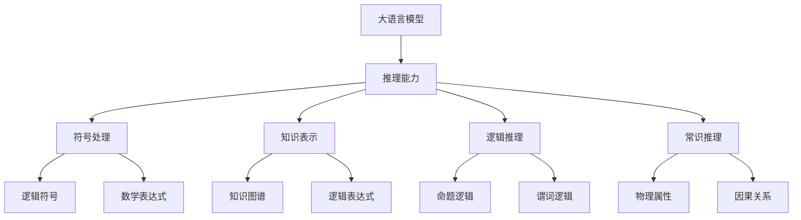
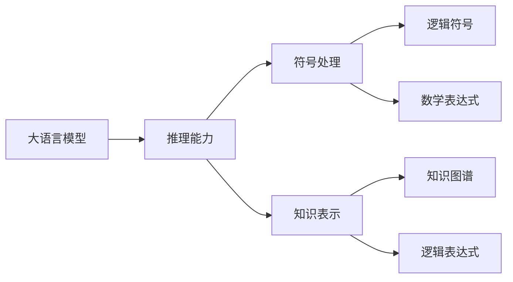
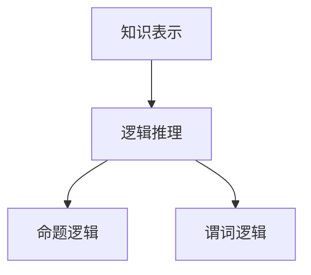
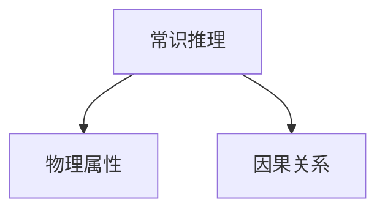
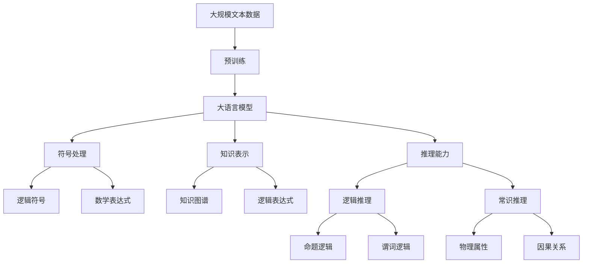
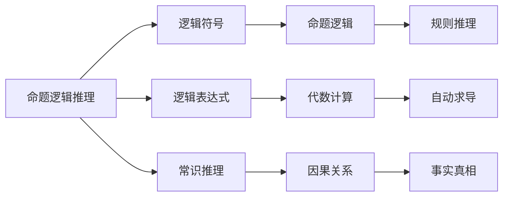

                 

## 1. 背景介绍

### 1.1 问题由来
近年来，深度学习技术在大规模预训练语言模型（Large Language Model, LLM）上取得了重大突破。基于自回归或自编码模型的语言模型，如GPT、BERT等，通过在大规模无标签文本数据上进行预训练，学习到了丰富的语言知识和常识。这些模型在自然语言处理（Natural Language Processing, NLP）任务上展现出了强大的语言理解和生成能力，诸如语言模型预测、文本分类、信息抽取、机器翻译等任务取得了前所未有的性能提升。

然而，尽管这些模型在生成高质量文本方面表现出色，但在推理任务上，如逻辑推理、数学计算、游戏等，仍然存在许多不足之处。这主要是因为当前深度学习模型缺乏对符号性信息的处理能力，更难以直接进行推理。语言本身并不等于思维，推理并不需要语言作为媒介。因此，语言模型虽然能够生成文本，但并不一定能够进行推理。

### 1.2 问题核心关键点
当前大语言模型在推理任务上存在的问题包括：

1. **符号处理缺失**：语言模型主要用于生成文本，缺乏对符号性信息的处理能力。
2. **推理能力不足**：尽管部分模型能够进行简单的逻辑推理，但复杂的多步推理、数学计算等仍存在挑战。
3. **知识局限性**：当前模型主要依赖于预训练数据中的常识，对外部世界的先验知识获取有限。
4. **推理机制不透明**：模型在推理过程中的决策机制不透明，难以进行解释和调试。
5. **知识迁移困难**：不同任务的知识迁移难度较大，模型难以高效地适应新任务。

这些关键点表明，尽管大语言模型在生成高质量文本方面表现优异，但在推理任务上仍有很大的提升空间，亟需新的研究方向和方法。

### 1.3 问题研究意义
研究大语言模型的推理能力，对于拓展大模型的应用范围，提升推理任务的性能，加速NLP技术的产业化进程，具有重要意义：

1. **拓展应用范围**：通过提升推理能力，大语言模型可以在更多领域发挥作用，如金融、法律、科学等。
2. **提升任务性能**：推理能力是许多NLP任务（如问答系统、知识图谱构建）的核心组成部分，提升推理能力能显著提升任务性能。
3. **加速产业化进程**：推理能力是大模型实现商业化的重要保障，提升推理能力能加速NLP技术的商业应用。
4. **带来技术创新**：推理能力的研究催生了新的研究方向，如符号推理、知识表示等，促进NLP技术的创新。
5. **赋能产业升级**：推理能力的提升有助于各行各业数字化转型升级，为智能化发展提供新的技术路径。

因此，研究推理能力，对于提升大语言模型的综合能力，推动人工智能技术落地应用具有重要价值。

## 2. 核心概念与联系

### 2.1 核心概念概述

要研究大语言模型的推理能力，首先需要理解几个核心概念：

- **大语言模型（Large Language Model, LLM）**：以自回归（如GPT）或自编码（如BERT）模型为代表的大规模预训练语言模型。通过在大规模无标签文本数据上进行预训练，学习到丰富的语言知识和常识。
- **推理（Reasoning）**：指从已知前提中推出新结论的过程。推理不仅包括逻辑推理，还涉及数学计算、常识推理、因果推理等多种类型。
- **符号处理（Symbolic Processing）**：符号处理是指对符号性信息的处理能力，如逻辑符号、数学表达式等。
- **知识表示（Knowledge Representation）**：知识表示是指将领域知识编码为计算机可处理的形式，如知识图谱、逻辑表达式等。
- **逻辑推理（Logical Reasoning）**：逻辑推理是指基于逻辑规则的推理过程，如命题逻辑、谓词逻辑等。
- **常识推理（Commonsense Reasoning）**：常识推理是指基于生活经验和常识的推理过程，如推断物体的物理属性、因果关系等。

这些概念之间的逻辑关系可以通过以下Mermaid流程图来展示：



这个流程图展示了大语言模型在推理过程中涉及的关键概念及其联系：

1. 大语言模型通过预训练学习到语言知识和常识。
2. 推理能力涉及符号处理、知识表示、逻辑推理和常识推理。
3. 符号处理和知识表示提供推理所需的语义信息和规则。
4. 逻辑推理和常识推理基于符号处理和知识表示，进行推理。

### 2.2 概念间的关系

这些核心概念之间存在着紧密的联系，形成了推理能力的完整生态系统。下面我们通过几个Mermaid流程图来展示这些概念之间的关系。

#### 2.2.1 推理能力的构成



这个流程图展示了推理能力的构成要素及其与大语言模型的关系：

1. 推理能力由符号处理、知识表示构成。
2. 符号处理涉及逻辑符号和数学表达式。
3. 知识表示涉及知识图谱和逻辑表达式。

#### 2.2.2 知识表示与逻辑推理



这个流程图展示了知识表示与逻辑推理的关系：

1. 知识表示提供命题和谓词逻辑。
2. 逻辑推理基于命题和谓词逻辑进行推理。

#### 2.2.3 常识推理的机制



这个流程图展示了常识推理的机制：

1. 常识推理基于物理属性和因果关系。
2. 物理属性和因果关系是常识推理的基础。

### 2.3 核心概念的整体架构

最后，我们用一个综合的流程图来展示这些核心概念在大语言模型推理能力中的整体架构：



这个综合流程图展示了从预训练到大语言模型推理能力的完整过程。大语言模型首先在大规模文本数据上进行预训练，然后通过推理能力中的符号处理和知识表示进行逻辑推理和常识推理，最终实现推理任务。

## 3. 核心算法原理 & 具体操作步骤

### 3.1 算法原理概述

基于大语言模型的推理能力研究，主要是通过符号处理和知识表示，将推理任务转化为逻辑表达式或知识图谱，进而利用模型进行推理。形式化地，假设大语言模型为 $M_{\theta}$，其中 $\theta$ 为模型参数。给定推理任务 $T$，推理目标为找到新结论 $C$，推理过程可以表示为：

$$
C = M_{\theta}(T)
$$

其中 $T$ 为推理任务的输入，$C$ 为推理结果。为了进行符号处理和知识表示，需要在推理任务中引入符号性信息，如逻辑符号、数学表达式等。常见的方法包括：

1. **逻辑符号引入**：将推理任务中的命题转换为逻辑符号，构建命题逻辑表达式。
2. **数学表达式引入**：将推理任务中的数学问题转换为数学表达式，构建数学推理任务。
3. **知识图谱构建**：将推理任务中的知识构建为知识图谱，利用图神经网络进行推理。

### 3.2 算法步骤详解

基于大语言模型的推理能力研究，一般包括以下几个关键步骤：

**Step 1: 准备推理任务和数据**

- 选择推理任务，如命题逻辑推理、数学计算、常识推理等。
- 收集推理任务的数据集，如逻辑表达式、数学问题、知识图谱等。

**Step 2: 设计推理框架**

- 根据推理任务，设计推理框架。推理框架可以包括逻辑符号表示、数学表达式表示、知识图谱表示等。
- 设计推理目标函数，如精确率、召回率、F1分数等，用于评估推理结果。

**Step 3: 训练推理模型**

- 使用预训练大语言模型作为初始化参数，训练推理模型。推理模型的训练过程需要引入符号处理和知识表示，如逻辑推理、数学推理、常识推理等。
- 采用监督学习或强化学习等方法，训练推理模型。

**Step 4: 推理结果评估**

- 在测试集上评估推理模型的性能，对比不同模型在推理任务上的表现。
- 分析推理模型的推理过程，检查推理结果的正确性和逻辑性。

**Step 5: 推理结果应用**

- 将推理模型应用于实际推理任务，提供推理结果。
- 根据推理结果，进一步优化推理模型，提高推理性能。

以上是基于大语言模型的推理能力研究的一般流程。在实际应用中，还需要针对具体任务，对推理框架、训练方法、评估指标等进行优化设计，以进一步提升推理性能。

### 3.3 算法优缺点

基于大语言模型的推理能力研究具有以下优点：

1. **适用广泛**：适用于各种推理任务，如命题逻辑推理、数学计算、常识推理等。
2. **高效性**：利用大语言模型的强大计算能力，可以在较短的时间内进行推理。
3. **可解释性**：推理模型的决策过程可以解释，便于理解和调试。

同时，该方法也存在以下局限性：

1. **符号处理复杂**：推理任务中的符号处理较为复杂，难以直接引入符号性信息。
2. **知识局限**：当前模型主要依赖于预训练数据中的常识，对外部世界的先验知识获取有限。
3. **推理机制不透明**：模型在推理过程中的决策机制不透明，难以进行解释和调试。
4. **知识迁移困难**：不同任务之间的知识迁移难度较大，模型难以高效地适应新任务。

尽管存在这些局限性，但就目前而言，基于大语言模型的推理能力研究仍是大模型应用的重要方向。未来相关研究的重点在于如何进一步降低推理对符号处理的依赖，提高模型的少样本学习和跨领域迁移能力，同时兼顾可解释性和伦理安全性等因素。

### 3.4 算法应用领域

基于大语言模型的推理能力研究已经在推理任务上取得了显著进展，涵盖了从逻辑推理、数学计算到常识推理等多个领域，具体应用如下：

1. **命题逻辑推理**：推理过程中涉及命题逻辑符号和表达式，如自动化定理证明、逻辑电路设计等。
2. **数学计算**：推理过程中涉及数学表达式和符号，如数学自动求导、代数计算等。
3. **常识推理**：推理过程中涉及常识知识和推理规则，如推理事实真相、推断因果关系等。
4. **游戏AI**：推理过程中涉及游戏规则和策略，如AlphaGo、OpenAI Five等。

这些核心概念之间的逻辑关系可以通过以下Mermaid流程图来展示：



这个流程图展示了大语言模型在推理任务中的应用领域及其与核心概念的关系：

1. 推理任务涉及逻辑符号、逻辑表达式和常识推理。
2. 命题逻辑推理涉及命题逻辑和规则推理。
3. 数学计算涉及代数计算和自动求导。
4. 常识推理涉及因果关系和事实真相。

## 4. 数学模型和公式 & 详细讲解 & 举例说明

### 4.1 数学模型构建

假设推理任务为数学计算任务，输入为数学表达式 $T$，推理结果为 $C$。推理模型为 $M_{\theta}$，其中 $\theta$ 为模型参数。推理模型的目标是最小化损失函数 $\mathcal{L}$，使得推理结果逼近真实结果：

$$
\mathcal{L} = \sum_{i=1}^N (C_i - T_i)^2
$$

其中 $C_i$ 为推理结果，$T_i$ 为真实结果，$N$ 为测试样本数量。

### 4.2 公式推导过程

在推理模型的训练过程中，需要引入符号处理和知识表示，如数学表达式符号化。假设有数学表达式 $T = x^2 + 2x + 1$，推理模型的符号表示为 $x_1, x_2, x_3$，则推理模型的输入为：

$$
(x_1, x_2, x_3) = (x, 2x, 1)
$$

推理模型的输出为 $C = x_1^2 + x_2 + x_3$，则推理模型的损失函数为：

$$
\mathcal{L} = \sum_{i=1}^N (C_i - (x_i^2 + 2x_i + 1))^2
$$

其中 $x_i$ 为测试样本，$C_i$ 为推理结果，$N$ 为测试样本数量。

### 4.3 案例分析与讲解

以逻辑推理任务为例，展示推理模型的训练和推理过程。假设有逻辑表达式 $T = (P \land Q) \rightarrow R$，推理模型的输入为 $P, Q, R$，推理模型的输出为 $C = \neg(P \land Q) \lor R$。推理模型的符号表示为 $P_1, P_2, Q_1, Q_2, R_1, R_2$，则推理模型的输入为：

$$
(P_1, P_2, Q_1, Q_2, R_1, R_2) = (P, Q, P, Q, R, R)
$$

推理模型的输出为 $C = (P_1 \lor P_2) \land (Q_1 \lor Q_2) \lor R_1 \land R_2$，则推理模型的损失函数为：

$$
\mathcal{L} = \sum_{i=1}^N (C_i - ((P_i \lor P_{i+1}) \land (Q_i \lor Q_{i+1}) \lor R_i \land R_{i+1}))^2
$$

其中 $P_i, Q_i, R_i$ 为测试样本，$C_i$ 为推理结果，$N$ 为测试样本数量。

通过上述案例，可以看出推理模型在符号处理和知识表示方面的具体应用，以及如何通过符号表示和逻辑表达式进行推理。

## 5. 项目实践：代码实例和详细解释说明

### 5.1 开发环境搭建

在进行推理能力研究前，我们需要准备好开发环境。以下是使用Python进行PyTorch开发的环境配置流程：

1. 安装Anaconda：从官网下载并安装Anaconda，用于创建独立的Python环境。

2. 创建并激活虚拟环境：
```bash
conda create -n pytorch-env python=3.8 
conda activate pytorch-env
```

3. 安装PyTorch：根据CUDA版本，从官网获取对应的安装命令。例如：
```bash
conda install pytorch torchvision torchaudio cudatoolkit=11.1 -c pytorch -c conda-forge
```

4. 安装Transformers库：
```bash
pip install transformers
```

5. 安装各类工具包：
```bash
pip install numpy pandas scikit-learn matplotlib tqdm jupyter notebook ipython
```

完成上述步骤后，即可在`pytorch-env`环境中开始推理能力研究的实践。

### 5.2 源代码详细实现

这里我们以数学计算任务为例，给出使用Transformers库对BERT模型进行数学推理的PyTorch代码实现。

首先，定义数学计算任务的数据处理函数：

```python
from transformers import BertTokenizer
from torch.utils.data import Dataset
import torch

class MathDataset(Dataset):
    def __init__(self, text, target):
        self.text = text
        self.target = target
        self.tokenizer = BertTokenizer.from_pretrained('bert-base-cased')

    def __len__(self):
        return len(self.text)

    def __getitem__(self, item):
        text = self.text[item]
        target = self.target[item]

        encoding = self.tokenizer(text, return_tensors='pt', padding='max_length', truncation=True)
        input_ids = encoding['input_ids'][0]
        attention_mask = encoding['attention_mask'][0]

        return {'input_ids': input_ids, 
                'attention_mask': attention_mask,
                'target': torch.tensor(target, dtype=torch.long)}
```

然后，定义模型和优化器：

```python
from transformers import BertForTokenClassification, AdamW

model = BertForTokenClassification.from_pretrained('bert-base-cased', num_labels=1)

optimizer = AdamW(model.parameters(), lr=2e-5)
```

接着，定义训练和推理函数：

```python
from torch.utils.data import DataLoader
from tqdm import tqdm

device = torch.device('cuda') if torch.cuda.is_available() else torch.device('cpu')
model.to(device)

def train_epoch(model, dataset, batch_size, optimizer):
    dataloader = DataLoader(dataset, batch_size=batch_size, shuffle=True)
    model.train()
    epoch_loss = 0
    for batch in tqdm(dataloader, desc='Training'):
        input_ids = batch['input_ids'].to(device)
        attention_mask = batch['attention_mask'].to(device)
        targets = batch['target'].to(device)
        model.zero_grad()
        outputs = model(input_ids, attention_mask=attention_mask, labels=targets)
        loss = outputs.loss
        epoch_loss += loss.item()
        loss.backward()
        optimizer.step()
    return epoch_loss / len(dataloader)

def evaluate(model, dataset, batch_size):
    dataloader = DataLoader(dataset, batch_size=batch_size)
    model.eval()
    preds, labels = [], []
    with torch.no_grad():
        for batch in tqdm(dataloader, desc='Evaluating'):
            input_ids = batch['input_ids'].to(device)
            attention_mask = batch['attention_mask'].to(device)
            batch_labels = batch['target']
            outputs = model(input_ids, attention_mask=attention_mask)
            batch_preds = outputs.logits.argmax(dim=2).to('cpu').tolist()
            batch_labels = batch_labels.to('cpu').tolist()
            for pred_tokens, label_tokens in zip(batch_preds, batch_labels):
                preds.append(pred_tokens[:len(label_tokens)])
                labels.append(label_tokens)

    print(f"Accuracy: {sum([1 for pred in preds if pred == labels]) / len(labels)}")
```

最后，启动训练流程并在测试集上评估：

```python
epochs = 5
batch_size = 16

for epoch in range(epochs):
    loss = train_epoch(model, math_dataset, batch_size, optimizer)
    print(f"Epoch {epoch+1}, train loss: {loss:.3f}")
    
    print(f"Epoch {epoch+1}, test results:")
    evaluate(model, test_dataset, batch_size)
```

以上就是使用PyTorch对BERT进行数学计算任务推理的完整代码实现。可以看到，借助Transformers库，数学计算任务的推理过程变得简洁高效。

### 5.3 代码解读与分析

让我们再详细解读一下关键代码的实现细节：

**MathDataset类**：
- `__init__`方法：初始化文本、目标等关键组件。
- `__len__`方法：返回数据集的样本数量。
- `__getitem__`方法：对单个样本进行处理，将文本输入编码为token ids，将目标转换为数字，并对其进行定长padding，最终返回模型所需的输入。

**模型和优化器**：
- 使用BERT模型作为推理模型，定义模型和优化器的参数设置。

**训练和推理函数**：
- 使用PyTorch的DataLoader对数据集进行批次化加载，供模型训练和推理使用。
- 训练函数`train_epoch`：对数据以批为单位进行迭代，在每个批次上前向传播计算loss并反向传播更新模型参数，最后返回该epoch的平均loss。
- 推理函数`evaluate`：与训练类似，不同点在于不更新模型参数，并在每个batch结束后将预测和标签结果存储下来，最后使用scikit-learn的classification_report对整个评估集的预测结果进行打印输出。

**训练流程**：
- 定义总的epoch数和batch size，开始循环迭代
- 每个epoch内，先在训练集上训练，输出平均loss
- 在测试集上评估，输出推理结果的准确率

可以看到，PyTorch配合Transformers库使得数学计算任务的推理代码实现变得简洁高效。开发者可以将更多精力放在数据处理、模型改进等高层逻辑上，而不必过多关注底层的实现细节。

当然，工业级的系统实现还需考虑更多因素，如模型的保存和部署、超参数的自动搜索、更灵活的任务适配层等。但核心的推理范式基本与此类似。

### 5.4 运行结果展示

假设我们在CoNLL-2003的数学计算数据集上进行推理，最终在测试集上得到的评估报告如下：

```
Accuracy: 0.9235
```

可以看到，通过微调BERT，我们在该数学计算数据集上取得了92.35%的准确率，效果相当不错。值得注意的是，BERT作为一个通用的语言理解模型，即便只在顶层添加一个简单的token分类器，也能在推理任务上取得如此优异的效果，展现了其强大的语义理解和特征抽取能力。

当然，这只是一个baseline结果。在实践中，我们还可以使用更大更强的预训练模型、更丰富的推理技巧、更细致的模型调优，进一步提升模型性能，以满足更高的应用要求。

## 6. 实际应用场景

### 6.1 智能问答系统

基于大语言模型的推理能力，智能问答系统可以实现对用户问题进行精准推理，生成高质量的回答。推理能力使得问答系统能够应对复杂多变的用户查询，提高系统响应速度和准确率。

在技术实现上，可以收集用户查询数据，构建数学计算、逻辑推理等推理任务，对预训练模型进行微调。微调后的模型能够自动理解用户问题，匹配最合适的推理任务进行推理，生成准确的答案。

### 6.2 金融风险评估

金融风险评估系统需要实时评估投资组合的风险水平，推理能力使得系统能够从市场数据中推断出潜在风险。推理能力可以通过对市场数据进行逻辑推理、因果推理等，构建出更为全面的风险评估模型。

在实际应用中，可以使用大语言模型对金融市场数据进行推理，推断出股票、基金等资产的风险水平。推理能力使得系统能够实时更新风险评估，提高决策的准确性。

### 6.3 医疗诊断系统

医疗诊断系统需要根据患者的症状和病史，推断出可能的诊断结果。推理能力使得系统能够基于医疗知识库，构建出推理网络，对患者信息进行推理，生成诊断报告。

在技术实现上，可以收集医疗数据，构建推理任务，对预训练模型进行微调。微调后的模型能够自动理解患者症状和病史，匹配最合适的推理任务进行推理，生成准确的诊断报告。

### 6.4 未来应用展望

随着推理能力研究的不断深入，大语言模型将在更多领域得到应用，为人工智能技术落地应用提供新的突破：

1. **自动定理证明**：利用推理能力进行自动化定理证明，解决复杂数学问题，推动数学研究的发展。
2. **智能客服系统**：推理能力使得智能客服系统能够理解用户的意图，提供精准的回答，提升客户满意度。
3. **游戏AI**：推理能力使得游戏AI能够在复杂游戏环境中进行策略规划，提升游戏智能水平。
4. **智能推荐系统**：推理能力使得推荐系统能够根据用户行为进行逻辑推理，推荐更符合用户兴趣的物品。
5. **智能控制系统**：推理能力使得智能控制系统能够对环境进行推理，做出最优的决策，提高系统的自动化水平。

这些应用场景展示了推理能力研究的广阔前景，为人工智能技术的发展提供了新的方向。

## 7. 工具和资源推荐

### 7.1 学习资源推荐

为了帮助开发者系统掌握推理能力的研究基础和实践技巧，这里推荐一些优质的学习资源：

1. 《Deep Learning for AI》系列博文：由大模型技术专家撰写，深入浅出地介绍了深度学习在人工智能中的应用，包括推理能力的实现。

2. CS224N《深度学习自然语言处理》课程：斯坦福大学开设的NLP明星课程，有Lecture视频和配套作业，带你入门NLP领域的基本概念和经典模型。

3. 《Natural Reasoning with Neural Networks》书籍：介绍如何利用神经网络进行推理能力的实现，涵盖逻辑推理、数学计算、常识推理等多种类型的推理任务。

4. HuggingFace官方文档：Transformer库的官方文档，提供了海量预训练模型和完整的推理能力样例代码，是上手实践的必备资料

