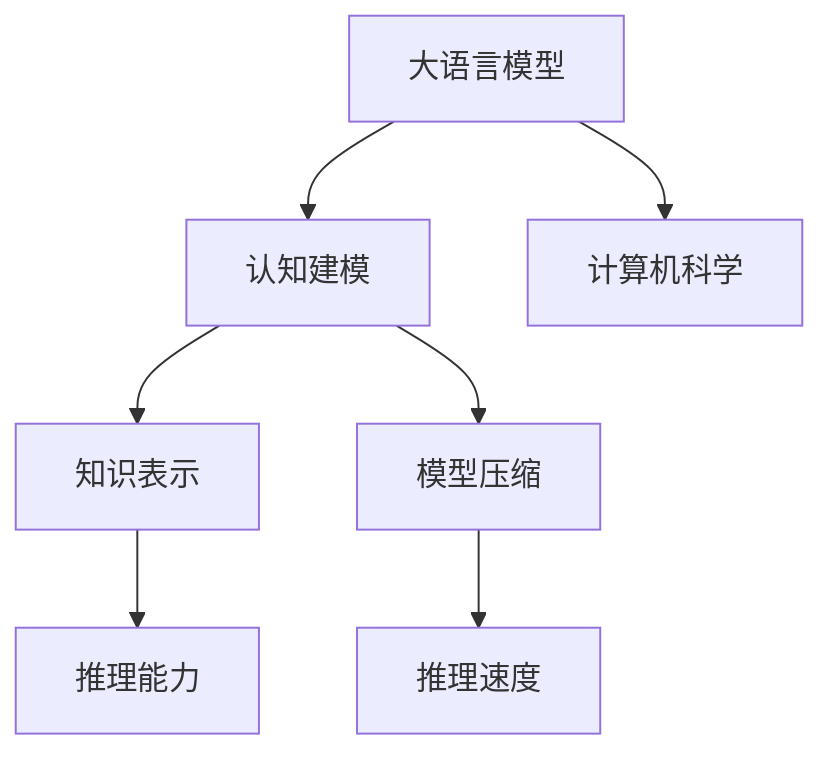
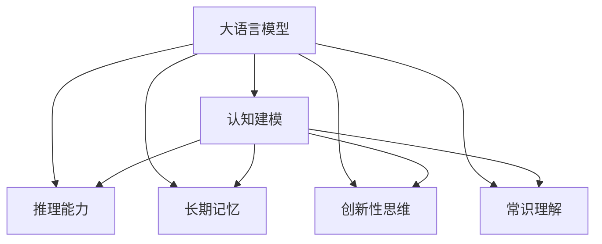
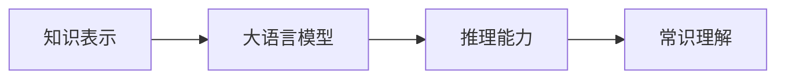
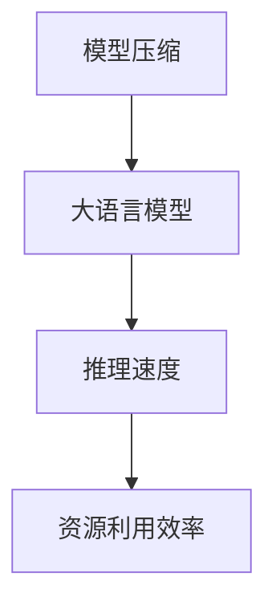
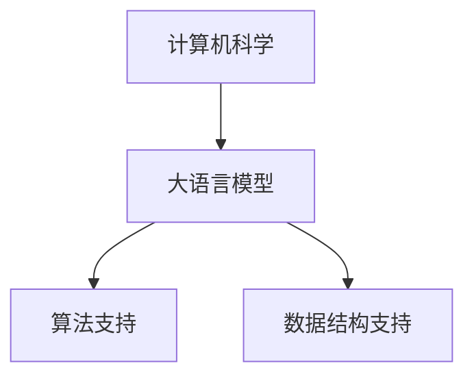
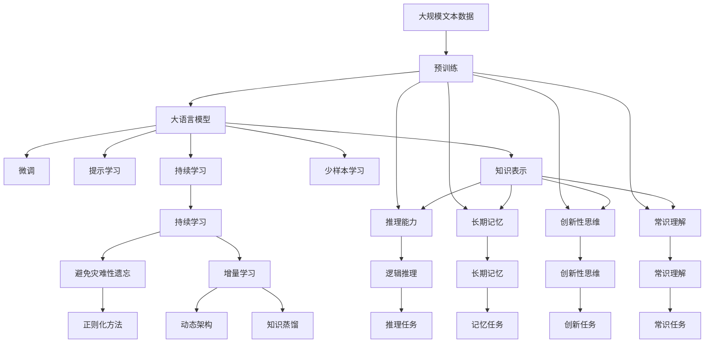

                 

# 语言≠思维：大模型的认知挑战

> 关键词：大语言模型,认知建模,知识表示,模型压缩,计算机科学,语言理解

## 1. 背景介绍

### 1.1 问题由来
近年来，随着深度学习技术的快速发展，大语言模型（Large Language Models, LLMs）在自然语言处理（NLP）领域取得了显著的突破。这些大语言模型通过在海量无标签文本数据上进行预训练，学习到了丰富的语言知识和常识，能够完成复杂的语言理解与生成任务，甚至能够进行抽象思维和推理。然而，尽管大语言模型在语言表达上取得了巨大成功，但其认知模型仍存在一定的局限性，无法像人类一样进行真正的思维活动。

### 1.2 问题核心关键点
大语言模型在语言理解与生成上的卓越表现，源于其强大的语言表征能力和基于统计学习的海量数据训练。然而，这种基于统计的学习方式无法保证其生成的语言或推理过程具有深刻的认知内涵。对于大模型的认知挑战，主要表现在以下几个方面：

1. **缺乏逻辑推理能力**：大模型在处理一些需要逻辑推理的任务时，经常产生不合理的输出。例如，对于自然语言推理（NLI）任务，大模型经常无法正确推理出前提与假设之间的逻辑关系。
2. **无法进行长期记忆**：大模型在处理需要长期记忆的任务时，经常出现遗忘现象。例如，对于连续的上下文推理任务，大模型难以记住前面几轮的上下文信息。
3. **无法进行创新性思考**：大模型在处理需要创新性思维的任务时，经常出现重复和套用已有知识的现象。例如，对于开放式问答（QA）任务，大模型经常无法生成独特的答案。
4. **缺乏常识理解**：大模型在处理需要常识理解的任务时，经常产生不符合常识的输出。例如，对于常识推理任务，大模型经常无法正确判断一些基本常识。

这些问题揭示了当前大语言模型在认知建模上的不足，亟需从理论和实践两方面进行深入研究。

### 1.3 问题研究意义
解决大语言模型的认知挑战，对于拓展其应用边界，提升人工智能系统的智能水平，具有重要的理论意义和实际价值：

1. **提升认知能力**：通过对大模型的认知建模研究，可以发现其逻辑推理、长期记忆、创新性思维和常识理解上的不足，有针对性地提升这些能力，使其能够更好地理解人类语言和思维。
2. **拓展应用范围**：解决认知挑战后，大模型可以更好地应用于需要深度认知能力的任务，如法律咨询、医学诊断、科学研究等，极大地拓展其应用场景。
3. **加速技术发展**：认知建模的进步可以推动人工智能系统的整体发展，加速认知智能和通用智能（AGI）的实现，带来新的技术突破和应用可能性。

## 2. 核心概念与联系

### 2.1 核心概念概述

为了更好地理解大语言模型在认知挑战上的不足，本节将介绍几个关键核心概念：

- **大语言模型（Large Language Model, LLM）**：一种通过大规模无标签文本数据预训练，能够理解并生成自然语言的大规模神经网络模型。例如，GPT、BERT等模型。
- **认知建模（Cognitive Modeling）**：研究人工智能系统如何模拟和实现人类认知过程的学科，包括语言理解、逻辑推理、长期记忆、创新性思维等。
- **知识表示（Knowledge Representation）**：将人类知识转化为机器可理解和操作的形式，是认知建模的关键技术之一。
- **模型压缩（Model Compression）**：在保持模型性能的前提下，减小模型参数量和计算复杂度，是提升模型推理速度和资源利用效率的重要手段。
- **计算机科学（Computer Science）**：涵盖算法、数据结构、人工智能、计算复杂度等多个领域，是认知建模和大模型研究的重要基础。

这些核心概念之间的逻辑关系可以通过以下Mermaid流程图来展示：

这个流程图展示了大语言模型与认知建模、知识表示、模型压缩和计算机科学之间的关系：

1. 大语言模型通过预训练学习语言知识和常识，是认知建模的重要基础。
2. 知识表示技术用于将人类的知识形式化，指导大模型学习认知任务。
3. 模型压缩技术用于提升大模型的推理速度和资源利用效率，提高认知能力。
4. 计算机科学提供算法和数据结构支持，是实现大语言模型和认知建模的技术保障。

### 2.2 概念间的关系

这些核心概念之间存在着紧密的联系，形成了大语言模型在认知挑战上的完整生态系统。下面我们通过几个Mermaid流程图来展示这些概念之间的关系。

#### 2.2.1 大语言模型的认知建模

这个流程图展示了大语言模型与认知建模的关系，以及大语言模型在推理能力、长期记忆、创新性思维和常识理解上的不足。

#### 2.2.2 知识表示在大语言模型中的应用

这个流程图展示了知识表示技术在大语言模型中的应用，即通过知识表示技术，指导大模型进行认知建模，提升推理能力和常识理解。

#### 2.2.3 模型压缩在大语言模型中的应用

这个流程图展示了模型压缩技术在大语言模型中的应用，即通过模型压缩技术，提高大模型的推理速度和资源利用效率，提升认知能力。

#### 2.2.4 计算机科学在大语言模型中的应用

这个流程图展示了计算机科学在大语言模型中的应用，即通过算法和数据结构支持，实现大语言模型和认知建模。

### 2.3 核心概念的整体架构

最后，我们用一个综合的流程图来展示这些核心概念在大语言模型认知挑战中的整体架构：

这个综合流程图展示了从预训练到认知建模的完整过程，以及如何通过知识表示、推理能力、长期记忆、创新性思维和常识理解等技术手段，解决大语言模型在认知挑战上的不足。

## 3. 核心算法原理 & 具体操作步骤
### 3.1 算法原理概述

大语言模型的认知挑战解决，主要是通过认知建模、知识表示、模型压缩等技术手段，提升大语言模型的推理能力、长期记忆、创新性思维和常识理解。以下是大语言模型在解决认知挑战上的核心算法原理：

1. **认知建模算法**：通过认知建模算法，指导大语言模型学习认知任务，包括逻辑推理、长期记忆、创新性思维和常识理解。例如，使用神经网络模拟人类大脑进行推理任务，使用序列记忆模型实现长期记忆，使用生成模型进行创新性思维，使用常识库进行常识理解。
2. **知识表示算法**：通过知识表示算法，将人类的知识形式化，转化为机器可理解和操作的形式，指导大语言模型进行认知建模。例如，使用知识图谱、符号表示法、逻辑推理系统等技术，将人类知识表示为逻辑表达式、事实陈述或知识图谱等形式。
3. **模型压缩算法**：通过模型压缩算法，在保持大语言模型性能的前提下，减小模型参数量和计算复杂度，提高推理速度和资源利用效率。例如，使用剪枝、量化、蒸馏等技术，对大语言模型进行压缩，提升模型推理速度和推理效率。

### 3.2 算法步骤详解

#### 3.2.1 认知建模算法的步骤

1. **选择认知建模算法**：根据具体的认知任务，选择合适的认知建模算法，例如，使用神经网络进行逻辑推理，使用序列记忆模型实现长期记忆，使用生成模型进行创新性思维，使用常识库进行常识理解。
2. **构建认知任务模型**：构建认知任务模型，将认知任务形式化，转化为认知建模算法可以处理的形式。例如，将逻辑推理任务转化为逻辑表达式，将长期记忆任务转化为序列表示，将创新性思维任务转化为生成任务，将常识理解任务转化为事实陈述或知识图谱。
3. **训练认知任务模型**：使用大规模无标签数据对认知任务模型进行预训练，学习认知任务的特征表示。例如，使用大规模文本数据对逻辑推理模型进行预训练，学习逻辑推理的特征表示；使用序列记忆模型对长期记忆任务进行预训练，学习长期记忆的特征表示；使用生成模型对创新性思维任务进行预训练，学习创新性思维的特征表示；使用常识库对常识理解任务进行预训练，学习常识理解的特征表示。
4. **微调认知任务模型**：使用标注数据对认知任务模型进行微调，使其能够适应特定的认知任务。例如，使用标注数据对逻辑推理模型进行微调，使其能够准确地推理出前提与假设之间的逻辑关系；使用标注数据对长期记忆模型进行微调，使其能够正确地记忆和回忆序列信息；使用标注数据对生成模型进行微调，使其能够产生具有创新性的文本生成；使用标注数据对常识库进行微调，使其能够准确地判断事实陈述的真假。

#### 3.2.2 知识表示算法的步骤

1. **选择知识表示算法**：根据具体的知识表示任务，选择合适的知识表示算法，例如，使用知识图谱表示人类的知识，使用符号表示法表示知识规则，使用逻辑推理系统进行知识推理。
2. **构建知识库**：构建知识库，将人类的知识形式化，转化为知识表示算法可以处理的形式。例如，将知识图谱构建为三元组形式，将知识规则构建为逻辑表达式，将常识库构建为事实陈述或推理规则。
3. **知识表示模型的训练**：使用大规模无标签数据对知识表示模型进行预训练，学习知识库的特征表示。例如，使用大规模文本数据对知识图谱表示模型进行预训练，学习知识图谱的特征表示；使用知识规则对逻辑推理系统进行预训练，学习知识规则的特征表示。
4. **知识表示模型的微调**：使用标注数据对知识表示模型进行微调，使其能够适应特定的知识表示任务。例如，使用标注数据对知识图谱表示模型进行微调，使其能够准确地描述和推理知识图谱中的实体和关系；使用标注数据对逻辑推理系统进行微调，使其能够正确地应用知识规则进行推理。

#### 3.2.3 模型压缩算法的步骤

1. **选择模型压缩算法**：根据具体的模型压缩任务，选择合适的模型压缩算法，例如，使用剪枝算法减小模型参数量，使用量化算法降低模型计算复杂度，使用蒸馏算法保持模型性能。
2. **构建模型压缩模型**：构建模型压缩模型，将大语言模型压缩为更轻量级的模型。例如，使用剪枝算法对大语言模型的冗余参数进行删除，使用量化算法对大语言模型的参数进行量化，使用蒸馏算法对大语言模型的参数进行压缩。
3. **模型压缩模型的训练**：使用大规模无标签数据对模型压缩模型进行预训练，学习压缩后的模型参数。例如，使用大规模文本数据对剪枝后的语言模型进行预训练，学习压缩后的模型参数；使用大规模文本数据对量化后的语言模型进行预训练，学习量化后的模型参数；使用大规模文本数据对蒸馏后的语言模型进行预训练，学习蒸馏后的模型参数。
4. **模型压缩模型的微调**：使用标注数据对模型压缩模型进行微调，使其能够适应特定的应用场景。例如，使用标注数据对剪枝后的语言模型进行微调，使其能够适应特定的推理任务；使用标注数据对量化后的语言模型进行微调，使其能够适应特定的推理任务；使用标注数据对蒸馏后的语言模型进行微调，使其能够适应特定的推理任务。

### 3.3 算法优缺点

认知建模、知识表示和模型压缩算法，在解决大语言模型的认知挑战上，具有以下优点：

1. **提升认知能力**：通过认知建模、知识表示和模型压缩算法，可以提升大语言模型的推理能力、长期记忆、创新性思维和常识理解，使其能够更好地理解人类语言和思维。
2. **拓展应用范围**：解决认知挑战后，大语言模型可以更好地应用于需要深度认知能力的任务，如法律咨询、医学诊断、科学研究等，极大地拓展其应用场景。
3. **加速技术发展**：认知建模、知识表示和模型压缩算法的进步可以推动人工智能系统的整体发展，加速认知智能和通用智能（AGI）的实现，带来新的技术突破和应用可能性。

同时，这些算法也存在一定的局限性：

1. **算法复杂度高**：认知建模、知识表示和模型压缩算法，往往需要复杂的数学和计算模型，增加了算法的复杂度和实现难度。
2. **数据需求量大**：认知建模、知识表示和模型压缩算法，往往需要大量的无标签和标注数据进行训练和微调，增加了数据获取和标注的难度。
3. **模型性能下降**：在压缩大语言模型参数量时，可能会降低模型的性能，需要在性能和参数量之间进行平衡。

尽管存在这些局限性，但通过不断的研究和改进，这些算法在提升大语言模型认知能力方面，仍然具有重要的应用前景。

### 3.4 算法应用领域

认知建模、知识表示和模型压缩算法，在大语言模型中具有广泛的应用前景，涵盖以下几个领域：

1. **自然语言推理（NLI）**：使用认知建模算法，指导大语言模型进行逻辑推理，解决自然语言推理任务。例如，使用神经网络进行逻辑推理，学习前提与假设之间的逻辑关系。
2. **长期记忆任务**：使用序列记忆模型，实现大语言模型的长期记忆能力，解决需要长期记忆的任务。例如，使用序列记忆模型对历史数据进行记忆，在后续推理任务中正确地回忆和使用这些数据。
3. **创新性思维任务**：使用生成模型，进行大语言模型的创新性思维，解决需要创新性思维的任务。例如，使用生成模型生成具有创新性的文本内容，解决开放性问答任务。
4. **常识推理任务**：使用常识库，进行大语言模型的常识推理，解决需要常识理解的任务。例如，使用常识库判断事实陈述的真假，解决常识推理任务。

这些应用领域展示了认知建模、知识表示和模型压缩算法在大语言模型中的重要性和应用潜力。

## 4. 数学模型和公式 & 详细讲解 & 举例说明
### 4.1 数学模型构建

大语言模型的认知挑战解决，主要涉及以下几个数学模型：

1. **逻辑推理模型**：用于学习前提与假设之间的逻辑关系。形式化表达为：
   $$
   \mathcal{M}_{\theta} = \left\{\begin{array}{ll}
   \text{True} & \text{if } \theta \text{ satisfies } \mathcal{L} \\
   \text{False} & \text{otherwise}
   \end{array}\right.
   $$
   其中 $\mathcal{L}$ 为逻辑规则，$\theta$ 为模型参数。

2. **长期记忆模型**：用于学习序列信息的记忆和回忆。形式化表达为：
   $$
   \mathcal{M}_{\theta} = \left\{\begin{array}{ll}
   \text{Recall} & \text{if } \theta \text{ has seen } x \\
   \text{Forget} & \text{otherwise}
   \end{array}\right.
   $$
   其中 $x$ 为序列信息，$\theta$ 为模型参数。

3. **创新性思维模型**：用于生成具有创新性的文本内容。形式化表达为：
   $$
   \mathcal{M}_{\theta} = \left\{\begin{array}{ll}
   \text{Generate} & \text{if } \theta \text{ has learned } \mathcal{L} \\
   \text{Copy} & \text{otherwise}
   \end{array}\right.
   $$
   其中 $\mathcal{L}$ 为生成规则，$\theta$ 为模型参数。

4. **常识推理模型**：用于判断事实陈述的真假。形式化表达为：
   $$
   \mathcal{M}_{\theta} = \left\{\begin{array}{ll}
   \text{True} & \text{if } \theta \text{ has learned } \mathcal{L} \\
   \text{False} & \text{otherwise}
   \end{array}\right.
   $$
   其中 $\mathcal{L}$ 为常识库，$\theta$ 为模型参数。

### 4.2 公式推导过程

以下我们对这些数学模型进行详细推导：

#### 4.2.1 逻辑推理模型

逻辑推理模型的推导，以自然语言推理（NLI）任务为例，使用逻辑表达式表示前提和假设，推导推理结果。假设前提为 $P$，假设为 $H$，推理结果为 $C$，推理过程如下：

1. **形式化表达**：
   $$
   P: x_1 \rightarrow y_1, \ldots, x_n \rightarrow y_n
   $$
   $$
   H: x_1 \rightarrow y_1', \ldots, x_n \rightarrow y_n'
   $$
   $$
   C: x_1 \rightarrow y_1, \ldots, x_n \rightarrow y_n
   $$

2. **逻辑推理**：
   $$
   C \leftarrow \mathcal{L}(P, H)
   $$
   其中 $\mathcal{L}$ 为逻辑推理规则，$P$ 和 $H$ 为输入的逻辑表达式，$C$ 为推理结果。

3. **计算过程**：
   $$
   C = \mathcal{L}(P, H)
   $$
   $$
   C = \text{True} \text{ if } \theta \text{ satisfies } \mathcal{L}
   $$

#### 4.2.2 长期记忆模型

长期记忆模型的推导，以序列记忆模型为例，使用序列表示法表示序列信息，推导记忆和回忆过程。假设序列信息为 $x_1, \ldots, x_n$，记忆模型为 $\mathcal{M}_{\theta}$，推导记忆和回忆过程如下：

1. **形式化表达**：
   $$
   \mathcal{M}_{\theta} = \left\{\begin{array}{ll}
   \text{Recall} & \text{if } \theta \text{ has seen } x_1, \ldots, x_n \\
   \text{Forget} & \text{otherwise}
   \end{array}\right.
   $$

2. **记忆过程**：
   $$
   \mathcal{M}_{\theta}(x_1, \ldots, x_n) = \mathcal{M}_{\theta}(\mathcal{L}(x_1, \ldots, x_n))
   $$
   其中 $\mathcal{L}$ 为序列表示函数，$x_1, \ldots, x_n$ 为序列信息，$\mathcal{M}_{\theta}$ 为记忆模型，$\theta$ 为模型参数。

3. **回忆过程**：
   $$
   \mathcal{M}_{\theta}(\mathcal{L}(x_1, \ldots, x_n)) = \mathcal{M}_{\theta}(x_1, \ldots, x_n)
   $$

#### 4.2.3 创新性思维模型

创新性思维模型的推导，以文本生成任务为例，使用生成模型表示创新性文本生成过程，推导生成和复制过程如下：

1. **形式化表达**：
   $$
   \mathcal{M}_{\theta} = \left\{\begin{array}{ll}
   \text{Generate} & \text{if } \theta \text{ has learned } \mathcal{L} \\
   \text{Copy} & \text{otherwise}
   \end{array}\right.
   $$

2. **生成过程**：
   $$
   \mathcal{M}_{\theta}(x_1, \ldots, x_n) = \mathcal{G}(\theta, x_1, \ldots, x_n)
   $$
   其中 $\mathcal{G}$ 为生成函数，$x_1, \ldots, x_n$ 为输入文本，$\mathcal{M}_{\theta}$ 为生成模型，$\theta$ 为模型参数。

3. **复制过程**：
   $$
   \mathcal{M}_{\theta}(x_1, \ldots, x_n) = x_1, \ldots, x_n
   $$

#### 4.2.4 常识推理模型

常识推理模型的推导，以事实陈述真假判断为例，使用常识库表示事实陈述，推导真假判断过程如下：

1. **形式化表达**：
   $$
   \mathcal{M}_{\theta} = \left\{\begin{array}{ll}
   \text{True} & \text{if } \theta \text{ has learned } \mathcal{L} \\
   \text{False} & \text{otherwise}
   \end{array}\right.
   $$

2. **真假判断**：
   $$
   \mathcal{M}_{\theta}(fact) = \mathcal{L}(fact, \mathcal{L}(P))
   $$
   其中 $fact$ 为事实陈述，$\mathcal{L}$ 为常识推理规则，$P$ 为前提，$\mathcal{M}_{\theta}$ 为常识推理模型，$\theta$ 为模型参数。

3. **计算过程**：
   $$
   \mathcal{M}_{\theta}(fact) = \mathcal{L}(fact, \mathcal{L}(P))
   $$
   $$
   \mathcal{M}_{\theta}(fact) = \text{True} \text{ if } \theta \text{ satisfies } \mathcal{L}
   $$

### 4.3 案例分析与讲解

#### 4.3.1 逻辑推理模型案例

以自然语言推理（NLI）任务为例，使用逻辑推理模型进行推理。假设前提为“John is a professor”，假设为“Mary is a student of John”，推理结果为“Mary is a student”。推理过程如下：

1. **形式化表达**：
   $$
   P: John \rightarrow professor
   $$
   $$
   H: Mary \rightarrow student
   $$

2. **逻辑推理**：
   $$
   C = \mathcal{L}(P, H)
   $$

3. **计算过程**：
   $$
   C = \mathcal{L}(P, H) = \text{True}
   $$

#### 4.3.2 长期记忆模型案例

以序列记忆模型为例，使用序列记忆模型进行记忆和回忆。假设序列信息为“John is a professor. Mary is a student of John.”，推理结果为“Mary is a student.”。推理过程如下：

1. **形式化表达**：
   $$
   \mathcal{M}_{\theta} = \left\{\begin{array}{ll}
   \text{Recall} & \text{if } \theta \text{ has seen } x_1, x_2 \\
   \text{Forget} & \text{otherwise}
   \end{array}\right.
   $$

2. **记忆过程**：
   $$
   \mathcal{M}_{\theta}(x_1, x_2) = \mathcal{M}_{\theta}(\mathcal{L}(x_1, x_2))
   $$

3. **回忆过程**：
   $$
   \mathcal{M}_{\theta}(\mathcal{L}(x_1, x_2)) = \mathcal{M}_{\theta}(x_1, x_2)
   $$

#### 4.3.3 创新性思维模型案例

以文本生成任务为例，使用创新性思维模型进行文本生成。假设输入文本为“John is a professor.”，推理结果为“Mary is a student of John.”。推理过程如下：

1. **形式化表达**：
   $$
   \mathcal{M}_{\theta} = \left\

