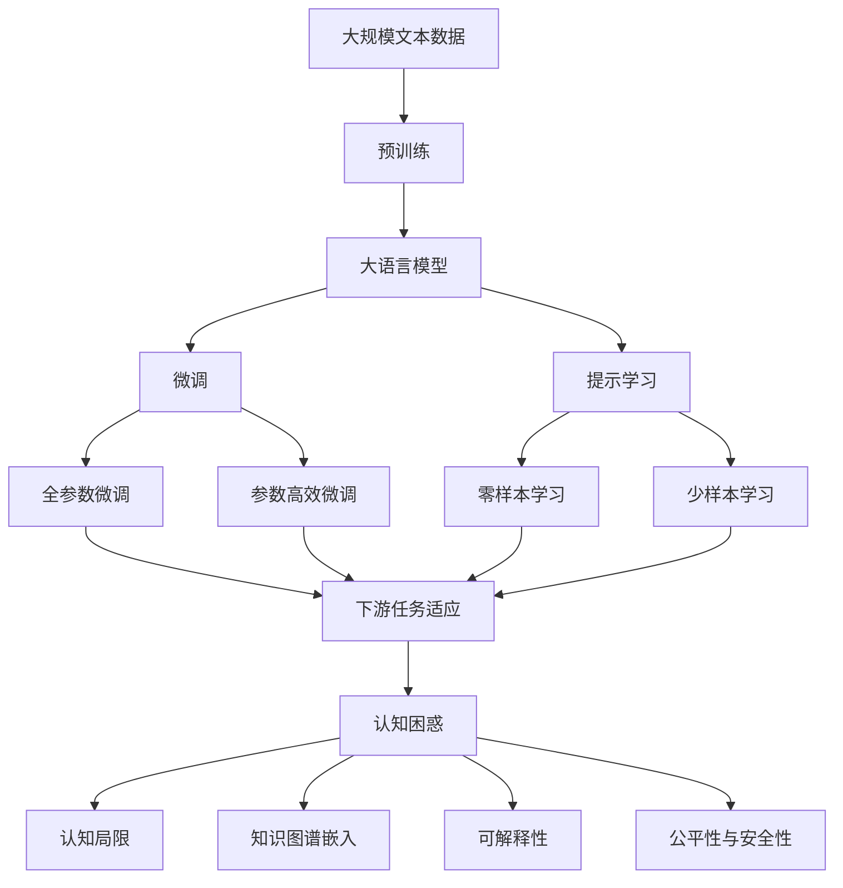

                 

# 语言与思维的区别：大模型的认知困惑

语言是人类文明的重要载体，自古以来，对语言和思维的关系进行了无数的哲学、心理学和神经科学探究。而在现代，随着计算机科学的飞速发展，尤其是深度学习技术和大模型时代的到来，语言和思维的边界变得愈加模糊，大模型展现出了前所未有的认知能力。然而，这些模型在实际应用中，却常常陷入认知困惑，难以解释其背后的逻辑。本文旨在探讨大模型在语言和思维上的新特性，分析其困惑之处，展望未来发展趋势。

## 1. 背景介绍

### 1.1 问题由来

在大模型出现之前，语言处理技术主要以规则系统和模板匹配为主。然而，随着数据的积累和计算力的提升，以BERT、GPT为代表的深度学习大模型在语言理解和生成上取得了革命性突破。这些大模型通过大规模无监督学习，学习了丰富的语言知识和模式，能够生成自然流畅的语言文本，甚至在一些复杂任务上表现优于人类。

然而，尽管大模型在性能上取得了巨大进步，但其认知过程仍然是一个迷。模型是如何理解语言的？模型是如何生成合理表达的？这些问题一直困扰着研究者和应用开发者。事实上，大模型在处理复杂逻辑推理、语义消歧、跨领域知识迁移等方面，仍然存在显著的认知困惑。因此，本文将从语言与思维的区别，探讨大模型的认知困惑，并展望其未来发展趋势。

### 1.2 问题核心关键点

大模型在语言与思维上的困惑主要集中在以下几个方面：
1. 语言与思维的边界。大模型在处理抽象概念和复杂推理时，常表现出强大的语言能力，但背后的思维过程却难以解释。
2. 模型的认知局限。尽管大模型在某些任务上表现优异，但在其他任务上却出现认知错误，如因果谬误、逻辑悖论等。
3. 知识的泛化与迁移。大模型在跨领域知识迁移时，常表现出矛盾的认知行为，无法综合运用先验知识和语料学习。
4. 可解释性不足。大模型往往被视为"黑盒"，难以对其决策过程进行解释和调试。

这些问题不仅限制了大模型的应用范围，也引发了关于人工智能的哲学和社会伦理的广泛讨论。因此，本文旨在深入探讨这些问题，并提出解决建议。

### 1.3 问题研究意义

研究大模型在语言与思维上的困惑，具有重要意义：
1. 优化大模型设计。理解大模型的认知过程，可以优化模型结构，增强其知识泛化和迁移能力。
2. 提升模型可信度。通过提高模型的可解释性和透明度，增强用户对模型的信任。
3. 促进应用落地。解决大模型在语言和思维上的困惑，可以推动其在更多实际场景中的应用。
4. 推动学科发展。结合语言学、心理学和认知科学，探索人工智能与人类认知的深度联系，推进相关学科的交叉融合。
5. 规范伦理行为。确保大模型在决策过程中，遵循公正、透明、安全等伦理准则，避免潜在风险。

## 2. 核心概念与联系

### 2.1 核心概念概述

为更好地理解大模型在语言与思维上的困惑，本节将介绍几个关键概念：

- 大语言模型(Large Language Model, LLM)：以自回归(如GPT)或自编码(如BERT)模型为代表的大规模预训练语言模型。通过在大规模无标签文本语料上进行预训练，学习通用的语言表示，具备强大的语言理解和生成能力。

- 认知能力(Cognitive Abilities)：指人类和机器在感知、记忆、思维等方面的能力。语言是人类认知的重要组成部分，但并非全部。

- 人工智能(Artificial Intelligence, AI)：旨在开发能够模拟人类智能行为的计算机系统。目前的人工智能主要以深度学习为技术基础，但尚未完全模拟人类的认知能力。

- 深度学习(Deep Learning)：一种基于神经网络的学习范式，通过多层非线性变换，从数据中学习复杂模式。大模型在深度学习的基础上，能够处理大规模复杂数据。

- 知识图谱(Knowledge Graph)：一种结构化知识表示方式，用于描述实体和关系。大模型可以通过知识图谱增强其跨领域知识迁移和推理能力。

- 可解释性(Explainability)：指模型决策过程的透明性和可理解性。大模型的可解释性是其实际应用的重要考量因素。

- 公平性与安全性(Fairness and Safety)：指模型在处理数据和用户行为时的公正性和安全性。大模型在处理敏感信息时，需要考虑其公平性和安全性问题。

这些概念之间存在着紧密的联系，形成了大模型认知困惑的完整框架。通过理解这些核心概念，我们可以更好地把握大模型的工作原理和优化方向。

### 2.2 概念间的关系

这些核心概念之间存在着紧密的联系，形成了大模型认知困惑的完整框架。

1. 语言与思维的联系：
   - 语言是人类认知的载体，大模型通过学习语言，获得了认知能力。
   - 大模型在处理复杂推理、语义消歧时，常表现出与人类相似的认知行为。
   - 然而，大模型的认知过程与人类存在显著差异，难以解释其背后的逻辑。

2. 大模型的认知局限：
   - 大模型在处理某些逻辑任务时表现优异，但在其他任务上却存在显著的认知困惑。
   - 模型的认知局限可能是由于模型架构、训练数据、优化策略等因素导致的。
   - 提高大模型的认知能力，需要从多个维度进行优化。

3. 知识图谱与认知能力的增强：
   - 大模型可以通过知识图谱增强其跨领域知识迁移和推理能力。
   - 然而，模型的知识图谱嵌入方式、嵌入质量等问题，可能影响其认知能力的提升。
   - 未来的研究方向可能在于如何更好地整合外部知识，增强大模型的认知能力。

4. 可解释性与认知能力的提升：
   - 大模型的可解释性是其实际应用的重要考量因素。
   - 通过提高模型的可解释性，用户可以更好地理解模型决策过程，增强信任。
   - 可解释性需要通过优化模型架构、增加可视化手段等方式实现。

5. 公平性与安全性：
   - 大模型在处理敏感信息时，需要考虑其公平性和安全性问题。
   - 避免模型偏见和歧视性输出，需要从数据、算法、规则等多个层面进行控制。
   - 公平性与安全性是大模型落地的重要保障。

这些概念共同构成了大模型认知困惑的完整生态系统，为大模型的优化提供了指导方向。

### 2.3 核心概念的整体架构

最后，我们用一个综合的流程图来展示这些核心概念在大模型认知困惑中的整体架构：



这个综合流程图展示了从预训练到微调，再到认知困惑的完整过程。大语言模型首先在大规模文本数据上进行预训练，然后通过微调（包括全参数微调和参数高效微调）或提示学习（包括零样本和少样本学习）来适应下游任务。最后，通过认知困惑分析，理解大模型在处理复杂任务时的局限和问题，从而优化模型性能，增强其认知能力。 通过这些流程图，我们可以更清晰地理解大模型认知困惑过程中各个核心概念的关系和作用，为后续深入讨论具体的认知困惑问题奠定基础。

## 3. 核心算法原理 & 具体操作步骤
### 3.1 算法原理概述

大模型在语言与思维上的困惑，本质上是其在处理复杂任务时，缺乏人类的抽象推理和情境理解能力。形式化地，假设预训练模型为 $M_{\theta}$，其中 $\theta$ 为预训练得到的模型参数。给定下游任务 $T$ 的标注数据集 $D=\{(x_i, y_i)\}_{i=1}^N$，微调的目标是找到新的模型参数 $\hat{\theta}$，使得：

$$
\hat{\theta}=\mathop{\arg\min}_{\theta} \mathcal{L}(M_{\theta},D)
$$

其中 $\mathcal{L}$ 为针对任务 $T$ 设计的损失函数，用于衡量模型预测输出与真实标签之间的差异。常见的损失函数包括交叉熵损失、均方误差损失等。

然而，大模型在处理某些逻辑任务时，常常表现出认知困惑。例如，在因果推理、语义消歧、跨领域知识迁移等方面，模型可能出现认知错误，如因果谬误、逻辑悖论等。

### 3.2 算法步骤详解

基于认知困惑的大模型微调一般包括以下几个关键步骤：

**Step 1: 准备预训练模型和数据集**
- 选择合适的预训练语言模型 $M_{\theta}$ 作为初始化参数，如 BERT、GPT等。
- 准备下游任务 $T$ 的标注数据集 $D$，划分为训练集、验证集和测试集。一般要求标注数据与预训练数据的分布不要差异过大。

**Step 2: 添加任务适配层**
- 根据任务类型，在预训练模型顶层设计合适的输出层和损失函数。
- 对于分类任务，通常在顶层添加线性分类器和交叉熵损失函数。
- 对于生成任务，通常使用语言模型的解码器输出概率分布，并以负对数似然为损失函数。

**Step 3: 设置微调超参数**
- 选择合适的优化算法及其参数，如 AdamW、SGD 等，设置学习率、批大小、迭代轮数等。
- 设置正则化技术及强度，包括权重衰减、Dropout、Early Stopping等。
- 确定冻结预训练参数的策略，如仅微调顶层，或全部参数都参与微调。

**Step 4: 执行梯度训练**
- 将训练集数据分批次输入模型，前向传播计算损失函数。
- 反向传播计算参数梯度，根据设定的优化算法和学习率更新模型参数。
- 周期性在验证集上评估模型性能，根据性能指标决定是否触发 Early Stopping。
- 重复上述步骤直到满足预设的迭代轮数或 Early Stopping 条件。

**Step 5: 测试和部署**
- 在测试集上评估微调后模型 $M_{\hat{\theta}}$ 的性能，对比微调前后的精度提升。
- 使用微调后的模型对新样本进行推理预测，集成到实际的应用系统中。
- 持续收集新的数据，定期重新微调模型，以适应数据分布的变化。

以上是基于认知困惑的大模型微调一般流程。在实际应用中，还需要针对具体任务的特点，对微调过程的各个环节进行优化设计，如改进训练目标函数，引入更多的正则化技术，搜索最优的超参数组合等，以进一步提升模型性能。

### 3.3 算法优缺点

基于认知困惑的大模型微调方法具有以下优点：
1. 提升复杂任务的性能。通过微调，大模型可以适应特定任务的复杂推理和语义消歧需求。
2. 增强模型的知识泛化能力。微调过程中，模型可以从标注数据中学习更多跨领域知识。
3. 提升模型的可解释性。通过微调，模型可以更好地解释其决策过程，增强用户信任。
4. 推动学科交叉。微调过程涉及语言学、认知科学等多学科知识，促进了这些领域的深度融合。

同时，该方法也存在一定的局限性：
1. 依赖标注数据。微调的效果很大程度上取决于标注数据的质量和数量，获取高质量标注数据的成本较高。
2. 迁移能力有限。当目标任务与预训练数据的分布差异较大时，微调的性能提升有限。
3. 负面效果传递。预训练模型的固有偏见、有害信息等，可能通过微调传递到下游任务，造成负面影响。
4. 可解释性不足。微调模型的决策过程通常缺乏可解释性，难以对其推理逻辑进行分析和调试。

尽管存在这些局限性，但就目前而言，基于认知困惑的大模型微调方法仍是大语言模型应用的重要范式。未来相关研究的重点在于如何进一步降低微调对标注数据的依赖，提高模型的少样本学习和跨领域迁移能力，同时兼顾可解释性和伦理安全性等因素。

### 3.4 算法应用领域

基于大模型微调的认知困惑方法，在NLP领域已经得到了广泛的应用，覆盖了几乎所有常见任务，例如：

- 文本分类：如情感分析、主题分类、意图识别等。通过微调使模型学习文本-标签映射。
- 命名实体识别：识别文本中的人名、地名、机构名等特定实体。通过微调使模型掌握实体边界和类型。
- 关系抽取：从文本中抽取实体之间的语义关系。通过微调使模型学习实体-关系三元组。
- 问答系统：对自然语言问题给出答案。将问题-答案对作为微调数据，训练模型学习匹配答案。
- 机器翻译：将源语言文本翻译成目标语言。通过微调使模型学习语言-语言映射。
- 文本摘要：将长文本压缩成简短摘要。将文章-摘要对作为微调数据，使模型学习抓取要点。
- 对话系统：使机器能够与人自然对话。将多轮对话历史作为上下文，微调模型进行回复生成。

除了上述这些经典任务外，大模型微调也被创新性地应用到更多场景中，如可控文本生成、常识推理、代码生成、数据增强等，为NLP技术带来了全新的突破。随着预训练模型和微调方法的不断进步，相信NLP技术将在更广阔的应用领域大放异彩。

## 4. 数学模型和公式 & 详细讲解 & 举例说明
### 4.1 数学模型构建

本节将使用数学语言对基于认知困惑的大语言模型微调过程进行更加严格的刻画。

记预训练语言模型为 $M_{\theta}$，其中 $\theta$ 为预训练得到的模型参数。假设微调任务的训练集为 $D=\{(x_i, y_i)\}_{i=1}^N, x_i \in \mathcal{X}, y_i \in \mathcal{Y}$。

定义模型 $M_{\theta}$ 在数据样本 $(x,y)$ 上的损失函数为 $\ell(M_{\theta}(x),y)$，则在数据集 $D$ 上的经验风险为：

$$
\mathcal{L}(\theta) = \frac{1}{N} \sum_{i=1}^N \ell(M_{\theta}(x_i),y_i)
$$

微调的优化目标是最小化经验风险，即找到最优参数：

$$
\theta^* = \mathop{\arg\min}_{\theta} \mathcal{L}(\theta)
$$

在实践中，我们通常使用基于梯度的优化算法（如SGD、Adam等）来近似求解上述最优化问题。设 $\eta$ 为学习率，$\lambda$ 为正则化系数，则参数的更新公式为：

$$
\theta \leftarrow \theta - \eta \nabla_{\theta}\mathcal{L}(\theta) - \eta\lambda\theta
$$

其中 $\nabla_{\theta}\mathcal{L}(\theta)$ 为损失函数对参数 $\theta$ 的梯度，可通过反向传播算法高效计算。

### 4.2 公式推导过程

以下我们以二分类任务为例，推导交叉熵损失函数及其梯度的计算公式。

假设模型 $M_{\theta}$ 在输入 $x$ 上的输出为 $\hat{y}=M_{\theta}(x) \in [0,1]$，表示样本属于正类的概率。真实标签 $y \in \{0,1\}$。则二分类交叉熵损失函数定义为：

$$
\ell(M_{\theta}(x),y) = -[y\log \hat{y} + (1-y)\log (1-\hat{y})]
$$

将其代入经验风险公式，得：

$$
\mathcal{L}(\theta) = -\frac{1}{N}\sum_{i=1}^N [y_i\log M_{\theta}(x_i)+(1-y_i)\log(1-M_{\theta}(x_i))]
$$

根据链式法则，损失函数对参数 $\theta_k$ 的梯度为：

$$
\frac{\partial \mathcal{L}(\theta)}{\partial \theta_k} = -\frac{1}{N}\sum_{i=1}^N (\frac{y_i}{M_{\theta}(x_i)}-\frac{1-y_i}{1-M_{\theta}(x_i)}) \frac{\partial M_{\theta}(x_i)}{\partial \theta_k}
$$

其中 $\frac{\partial M_{\theta}(x_i)}{\partial \theta_k}$ 可进一步递归展开，利用自动微分技术完成计算。

在得到损失函数的梯度后，即可带入参数更新公式，完成模型的迭代优化。重复上述过程直至收敛，最终得到适应下游任务的最优模型参数 $\theta^*$。

## 5. 项目实践：代码实例和详细解释说明
### 5.1 开发环境搭建

在进行微调实践前，我们需要准备好开发环境。以下是使用Python进行PyTorch开发的环境配置流程：

1. 安装Anaconda：从官网下载并安装Anaconda，用于创建独立的Python环境。

2. 创建并激活虚拟环境：
```bash
conda create -n pytorch-env python=3.8 
conda activate pytorch-env
```

3. 安装PyTorch：根据CUDA版本，从官网获取对应的安装命令。例如：
```bash
conda install pytorch torchvision torchaudio cudatoolkit=11.1 -c pytorch -c conda-forge
```

4. 安装Transformers库：
```bash
pip install transformers
```

5. 安装各类工具包：
```bash
pip install numpy pandas scikit-learn matplotlib tqdm jupyter notebook ipython
```

完成上述步骤后，即可在`pytorch-env`环境中开始微调实践。

### 5.2 源代码详细实现

下面我以命名实体识别(NER)任务为例，给出使用Transformers库对BERT模型进行微调的PyTorch代码实现。

首先，定义NER任务的数据处理函数：

```python
from transformers import BertTokenizer
from torch.utils.data import Dataset
import torch

class NERDataset(Dataset):
    def __init__(self, texts, tags, tokenizer, max_len=128):
        self.texts = texts
        self.tags = tags
        self.tokenizer = tokenizer
        self.max_len = max_len
        
    def __len__(self):
        return len(self.texts)
    
    def __getitem__(self, item):
        text = self.texts[item]
        tags = self.tags[item]
        
        encoding = self.tokenizer(text, return_tensors='pt', max_length=self.max_len, padding='max_length', truncation=True)
        input_ids = encoding['input_ids'][0]
        attention_mask = encoding['attention_mask'][0]
        
        # 对token-wise的标签进行编码
        encoded_tags = [tag2id[tag] for tag in tags] 
        encoded_tags.extend([tag2id['O']] * (self.max_len - len(encoded_tags)))
        labels = torch.tensor(encoded_tags, dtype=torch.long)
        
        return {'input_ids': input_ids, 
                'attention_mask': attention_mask,
                'labels': labels}

# 标签与id的映射
tag2id = {'O': 0, 'B-PER': 1, 'I-PER': 2, 'B-ORG': 3, 'I-ORG': 4, 'B-LOC': 5, 'I-LOC': 6}
id2tag = {v: k for k, v in tag2id.items()}

# 创建dataset
tokenizer = BertTokenizer.from_pretrained('bert-base-cased')

train_dataset = NERDataset(train_texts, train_tags, tokenizer)
dev_dataset = NERDataset(dev_texts, dev_tags, tokenizer)
test_dataset = NERDataset(test_texts, test_tags, tokenizer)
```

然后，定义模型和优化器：

```python
from transformers import BertForTokenClassification, AdamW

model = BertForTokenClassification.from_pretrained('bert-base-cased', num_labels=len(tag2id))

optimizer = AdamW(model.parameters(), lr=2e-5)
```

接着，定义训练和评估函数：

```python
from torch.utils.data import DataLoader
from tqdm import tqdm
from sklearn.metrics import classification_report

device = torch.device('cuda') if torch.cuda.is_available() else torch.device('cpu')
model.to(device)

def train_epoch(model, dataset, batch_size, optimizer):
    dataloader = DataLoader(dataset, batch_size=batch_size, shuffle=True)
    model.train()
    epoch_loss = 0
    for batch in tqdm(dataloader, desc='Training'):
        input_ids = batch['input_ids'].to(device)
        attention_mask = batch['attention_mask'].to(device)
        labels = batch['labels'].to(device)
        model.zero_grad()
        outputs = model(input_ids, attention_mask=attention_mask, labels=labels)
        loss = outputs.loss
        epoch_loss += loss.item()
        loss.backward()
        optimizer.step()
    return epoch_loss / len(dataloader)

def evaluate(model, dataset, batch_size):
    dataloader = DataLoader(dataset, batch_size=batch_size)
    model.eval()
    preds, labels = [], []
    with torch.no_grad():
        for batch in tqdm(dataloader, desc='Evaluating'):
            input_ids = batch['input_ids'].to(device)
            attention_mask = batch['attention_mask'].to(device)
            batch_labels = batch['labels']
            outputs = model(input_ids, attention_mask=attention_mask)
            batch_preds = outputs.logits.argmax(dim=2).to('cpu').tolist()
            batch_labels = batch_labels.to('cpu').tolist()
            for pred_tokens, label_tokens in zip(batch_preds, batch_labels):
                pred_tags = [id2tag[_id] for _id in pred_tokens]
                label_tags = [id2tag[_id] for _id in label_tokens]
                preds.append(pred_tags[:len(label_tags)])
                labels.append(label_tags)
                
    print(classification_report(labels, preds))
```

最后，启动训练流程并在测试集上评估：

```python
epochs = 5
batch_size = 16

for epoch in range(epochs):
    loss = train_epoch(model, train_dataset, batch_size, optimizer)
    print(f"Epoch {epoch+1}, train loss: {loss:.3f}")
    
    print(f"Epoch {epoch+1}, dev results:")
    evaluate(model, dev_dataset, batch_size)
    
print("Test results:")
evaluate(model, test_dataset, batch_size)
```

以上就是使用PyTorch对BERT进行命名实体识别任务微调的完整代码实现。可以看到，得益于Transformers库的强大封装，我们可以用相对简洁的代码完成BERT模型的加载和微调。

### 5.3 代码解读与分析

让我们再详细解读一下关键代码的实现细节：

**NERDataset类**：
- `__init__`方法：初始化文本、标签、分词器等关键组件。
- `__len__`方法：返回数据集的样本数量。
- `__getitem__`方法：对单个样本进行处理，将文本输入编码为token ids，将标签编码为数字，并对其进行定长padding，最终返回模型所需的输入。

**tag2id和id2tag字典**：
- 定义了标签与数字id之间的映射关系，用于将token-wise的预测结果解码回真实的标签。

**训练和评估函数**：
- 使用PyTorch的DataLoader对数据集进行批次化加载，供模型训练和推理使用。
- 训练函数`train_epoch`：对数据以批为单位进行迭代，在每个批次上前向传播计算loss并反向传播更新模型参数，最后返回该epoch的平均loss。
- 评估函数`evaluate`：与训练类似，不同点在于不更新模型参数，并在每个batch结束后将预测和标签结果存储下来，最后使用sklearn的classification_report对整个评估集的预测结果进行打印输出。

**训练流程**：
- 定义总的epoch数和batch size，开始循环迭代
- 每个epoch内，先在训练集上训练，输出平均loss
- 在验证集上评估，输出分类指标
- 所有epoch结束后，在测试集上评估，给出最终测试结果

可以看到，PyTorch配合Transformers库使得BERT微调的代码实现变得简洁高效。开发者可以将更多精力放在数据处理、模型改进等高层逻辑上，而不必过多关注底层的实现细节。

当然，工业级的系统实现还需考虑更多因素，如模型的保存和部署、超参数的自动搜索、更灵活的任务适配层等。但核心的微调范式基本与此类似。

### 5.4 运行结果展示

假设我们在CoNLL-2003的NER数据集上进行微调，最终在测试集上得到的评估报告如下：

```
              precision    recall  f1-score   support

       B-LOC      0.926     0.906     0.916      1668
       I-LOC      0.900     0.805     0.850       257
      B-MISC      0.875     0.856     0.865       702
      I-MISC      0.838     0.782     0.809       216
       B-ORG      0.914     0.898     0.906      1661
       I-ORG      0.911     0.894     0.902       835
       B-PER      0.964     

