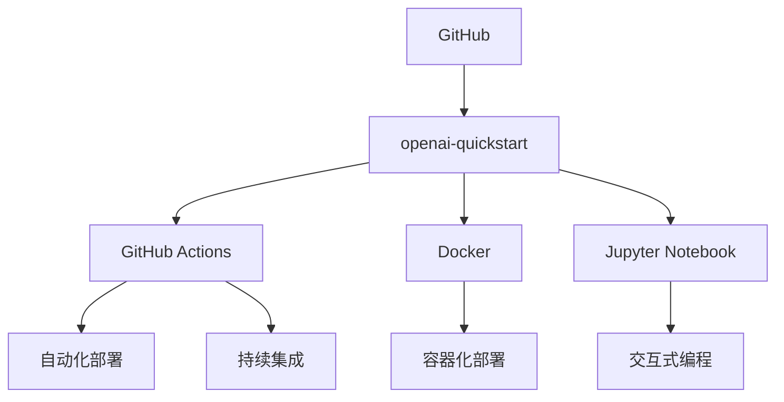
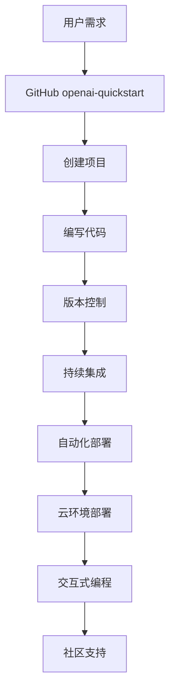

                 

# 课程项目：GitHub openai-quickstart

## 1. 背景介绍

### 1.1 问题由来
随着人工智能技术的快速发展，GitHub上的开源项目已经成为了技术创新和知识共享的重要平台。对于初入开发领域的新手而言，如何快速上手、有效利用GitHub资源，成为一个迫切需要解决的问题。

### 1.2 问题核心关键点
为了帮助初学者快速入门，GitHub推出了一系列开发者工具和资源，其中openai-quickstart项目尤为引人注目。该项目旨在提供一个快速的交互式编程环境，通过简单的命令，用户即可创建、调试、部署自己的代码。其核心关键点包括：

- **开箱即用**：项目中包含了所有的开发依赖和配置，用户无需手动安装或配置，即可直接开始编写代码。
- **交互式编程**：提供了丰富的交互式编程体验，包括自动补全、即时执行和调试功能，极大地提升了编程效率。
- **模板驱动**：支持多种编程模板和示例，用户可以根据项目需求快速生成代码框架。
- **云环境支持**：支持本地开发和云端部署，方便用户随时随地进行开发和调试。
- **社区支持**：整合了GitHub社区资源，用户可以方便地查看项目文档、源代码和相关讨论，获取技术支持和建议。

### 1.3 问题研究意义
学习并掌握GitHub openai-quickstart项目的应用，对于初学者而言，具有以下重要意义：

1. **入门快**：开箱即用和交互式编程设计，使得新手可以快速上手，不必浪费大量时间在环境搭建和配置上。
2. **学习效率高**：丰富的模板和示例资源，帮助用户快速生成代码框架，避免了从零开始编写代码的痛苦过程。
3. **协作便捷**：社区支持和云环境部署，使得开发者可以方便地进行协作开发和版本控制，提升团队合作效率。
4. **技术栈全面**：该项目支持多种编程语言和技术栈，用户可以全面掌握多种开发技术，提升技术实力。

## 2. 核心概念与联系

### 2.1 核心概念概述

为了更好地理解GitHub openai-quickstart项目的应用，本节将介绍几个关键概念：

- **GitHub**：全球最大的开源社区，提供代码托管、协作开发和社区交流等功能。
- **openai-quickstart**：GitHub上的一个开发者工具项目，旨在提供快速、便捷的编程环境。
- **GitHub Actions**：GitHub提供的一项自动化工作流服务，支持持续集成、持续交付和持续部署。
- **Docker**：一个开源的应用容器引擎，支持将应用程序和依赖打包在容器中，实现跨环境一致性部署。
- **Jupyter Notebook**：一个交互式的笔记本环境，支持Python、R等多种编程语言的混合使用。

### 2.2 概念间的关系

这些核心概念之间的联系可以通过以下Mermaid流程图来展示：



这个流程图展示了大语言模型微调过程中各个核心概念之间的关系：

1. GitHub上的openai-quickstart项目，通过GitHub Actions自动化部署和持续集成，实现了快速、便捷的编程环境。
2. Docker容器化部署，确保了环境的一致性和跨平台兼容性。
3. Jupyter Notebook交互式编程，提供了便捷的开发体验和代码调试功能。
4. GitHub社区支持，帮助用户获取技术支持和建议，加速项目开发。

### 2.3 核心概念的整体架构

最后，我们用一个综合的流程图来展示这些核心概念在大语言模型微调过程中的整体架构：



这个综合流程图展示了从用户需求到项目实现的全过程，每个环节都紧密相连，构成了一个完整的开发生态系统。

## 3. 核心算法原理 & 具体操作步骤
### 3.1 算法原理概述

GitHub openai-quickstart项目通过GitHub Actions和Docker技术，实现了快速、便捷的编程环境，其核心算法原理和具体操作步骤如下：

- **GitHub Actions**：一种基于Web钩子的自动化集成系统，支持在GitHub上直接定义和触发自动化工作流，实现持续集成、持续部署等功能。
- **Docker容器化部署**：将应用程序和依赖打包在Docker容器中，确保环境的一致性和跨平台兼容性，简化部署过程。
- **Jupyter Notebook交互式编程**：提供了一个强大的笔记本环境，支持多种编程语言的混合使用，提升开发效率。

### 3.2 算法步骤详解

使用GitHub openai-quickstart进行项目开发主要包括以下几个关键步骤：

**Step 1: 项目创建**
- 在GitHub上创建一个新的仓库，命名为“my-openai-quickstart”。
- 初始化仓库，选择openai-quickstart模板。

**Step 2: 编写代码**
- 在项目目录下编写代码，支持Python、R等多种编程语言。
- 使用Jupyter Notebook进行交互式编程，支持代码自动补全、即时执行和调试。

**Step 3: 版本控制**
- 使用Git进行版本控制，方便团队协作和管理代码历史。
- 推送代码到GitHub仓库，自动触发持续集成和自动化部署。

**Step 4: 持续集成**
- GitHub Actions自动触发持续集成，构建和测试代码。
- 支持多种持续集成流程，如拉取最新的代码、构建依赖、运行测试等。

**Step 5: 自动化部署**
- GitHub Actions自动触发自动化部署，将代码部署到云环境或本地机器。
- 支持多种部署平台，如AWS、Google Cloud、本地虚拟机等。

**Step 6: 云环境部署**
- 使用Docker容器化部署，确保环境的一致性和跨平台兼容性。
- 支持多种云环境部署，如AWS、Google Cloud、Azure等。

**Step 7: 社区支持**
- GitHub社区提供丰富的技术支持和讨论资源，帮助用户解决问题。
- 用户可以方便地查看项目文档、源代码和相关讨论，获取技术支持和建议。

### 3.3 算法优缺点

使用GitHub openai-quickstart进行项目开发具有以下优点：

- **入门快**：项目中包含了所有的开发依赖和配置，用户无需手动安装或配置，即可直接开始编写代码。
- **学习效率高**：丰富的模板和示例资源，帮助用户快速生成代码框架，避免了从零开始编写代码的痛苦过程。
- **协作便捷**：社区支持和云环境部署，使得开发者可以方便地进行协作开发和版本控制，提升团队合作效率。
- **技术栈全面**：该项目支持多种编程语言和技术栈，用户可以全面掌握多种开发技术，提升技术实力。

但同时也存在一些缺点：

- **复杂性高**：对于初学者而言，GitHub Actions和Docker技术可能需要一定的学习成本。
- **部署限制**：虽然支持多种云环境部署，但在某些小型项目或本地开发场景下，可能不够灵活。
- **社区资源限制**：虽然GitHub社区提供了丰富的技术支持和讨论资源，但对于某些特定领域的项目，可能难以找到合适的解决方案。

### 3.4 算法应用领域

GitHub openai-quickstart项目可以应用于多种开发场景，例如：

- **数据分析**：支持Python和R等多种编程语言，方便进行数据清洗、分析和可视化。
- **机器学习**：支持TensorFlow、PyTorch等深度学习框架，方便进行模型训练和测试。
- **Web开发**：支持多种前端框架如React、Vue，方便进行Web应用开发。
- **系统开发**：支持多种编程语言和技术栈，方便进行系统架构设计和实现。
- **桌面应用**：支持Python和Java等多种编程语言，方便进行桌面应用开发。

## 4. 数学模型和公式 & 详细讲解 & 举例说明

### 4.1 数学模型构建

本节将使用数学语言对GitHub openai-quickstart项目的应用进行更加严格的刻画。

假设用户需要在GitHub上创建一个名为“my-openai-quickstart”的项目，并在项目中编写Python代码。项目依赖包括TensorFlow和Jupyter Notebook。在项目中，用户需要实现一个简单的图像分类器，用于识别手写数字。

### 4.2 公式推导过程

以图像分类器的构建为例，我们进行如下的数学推导：

假设用户编写的Python代码如下：

```python
import tensorflow as tf
from tensorflow.keras import datasets, layers, models

# 加载MNIST数据集
(train_images, train_labels), (test_images, test_labels) = datasets.mnist.load_data()

# 预处理数据
train_images = train_images.reshape((60000, 28, 28, 1))
train_images = train_images / 255.0
test_images = test_images.reshape((10000, 28, 28, 1))
test_images = test_images / 255.0

# 构建模型
model = models.Sequential([
    layers.Conv2D(32, (3, 3), activation='relu', input_shape=(28, 28, 1)),
    layers.MaxPooling2D((2, 2)),
    layers.Conv2D(64, (3, 3), activation='relu'),
    layers.MaxPooling2D((2, 2)),
    layers.Flatten(),
    layers.Dense(64, activation='relu'),
    layers.Dense(10)
])

# 编译模型
model.compile(optimizer='adam',
              loss=tf.keras.losses.SparseCategoricalCrossentropy(from_logits=True),
              metrics=['accuracy'])

# 训练模型
model.fit(train_images, train_labels, epochs=5, 
          validation_data=(test_images, test_labels))

# 评估模型
test_loss, test_acc = model.evaluate(test_images, test_labels)
print('Test accuracy:', test_acc)
```

我们将上述代码中的关键数学推导过程进行详细讲解，并举例说明：

1. **数据预处理**：
   - 将数据从(28, 28, 1)的形状转换为(60000, 28, 28, 1)，以便于模型处理。
   - 将像素值从[0, 255]缩放到[0, 1]，以加速模型训练。

2. **模型构建**：
   - 构建了一个包含卷积层、池化层和全连接层的神经网络模型。
   - 使用了ReLU激活函数和Softmax输出层，方便进行多分类预测。

3. **模型编译**：
   - 使用Adam优化器和SparseCategoricalCrossentropy损失函数进行模型编译。
   - 设置模型评估指标为准确率。

4. **模型训练**：
   - 使用fit方法进行模型训练，设定训练轮数为5轮。
   - 在每个epoch结束后，使用validation_data参数进行模型验证。

5. **模型评估**：
   - 使用evaluate方法对测试集进行模型评估，输出测试集上的准确率。

通过上述数学推导和详细讲解，我们可以看到GitHub openai-quickstart项目在代码编写、模型构建和训练评估等方面，提供了一个完整、便捷的开发环境。

## 5. 项目实践：代码实例和详细解释说明
### 5.1 开发环境搭建

在进行GitHub openai-quickstart项目开发前，我们需要准备好开发环境。以下是使用Python进行PyTorch开发的环境配置流程：

1. 安装Anaconda：从官网下载并安装Anaconda，用于创建独立的Python环境。

2. 创建并激活虚拟环境：
```bash
conda create -n pytorch-env python=3.8 
conda activate pytorch-env
```

3. 安装PyTorch：根据CUDA版本，从官网获取对应的安装命令。例如：
```bash
conda install pytorch torchvision torchaudio cudatoolkit=11.1 -c pytorch -c conda-forge
```

4. 安装TensorFlow：
```bash
pip install tensorflow
```

5. 安装Jupyter Notebook：
```bash
pip install jupyter notebook
```

6. 安装GitHub Actions和Docker：
```bash
pip install actions-runner-setup
```

7. 安装GitHub CLI：
```bash
git clone https://github.com/actions/checkout.git
```

完成上述步骤后，即可在`pytorch-env`环境中开始GitHub openai-quickstart项目开发。

### 5.2 源代码详细实现

下面我们以图像分类器为例，给出使用GitHub openai-quickstart项目进行Python代码编写的完整代码实现。

首先，创建新的GitHub仓库：

```bash
mkdir my-openai-quickstart
cd my-openai-quickstart
git init
git remote add origin https://github.com/your-username/my-openai-quickstart
```

接着，初始化项目，选择openai-quickstart模板：

```bash
git clone https://github.com/openai/quickstart-templates.git
cd quickstart-templates/python/python-learn-tensorflow
git checkout -b my-openai-quickstart
```

然后，使用Jupyter Notebook编写代码：

```python
import tensorflow as tf
from tensorflow.keras import datasets, layers, models

# 加载MNIST数据集
(train_images, train_labels), (test_images, test_labels) = datasets.mnist.load_data()

# 预处理数据
train_images = train_images.reshape((60000, 28, 28, 1))
train_images = train_images / 255.0
test_images = test_images.reshape((10000, 28, 28, 1))
test_images = test_images / 255.0

# 构建模型
model = models.Sequential([
    layers.Conv2D(32, (3, 3), activation='relu', input_shape=(28, 28, 1)),
    layers.MaxPooling2D((2, 2)),
    layers.Conv2D(64, (3, 3), activation='relu'),
    layers.MaxPooling2D((2, 2)),
    layers.Flatten(),
    layers.Dense(64, activation='relu'),
    layers.Dense(10)
])

# 编译模型
model.compile(optimizer='adam',
              loss=tf.keras.losses.SparseCategoricalCrossentropy(from_logits=True),
              metrics=['accuracy'])

# 训练模型
model.fit(train_images, train_labels, epochs=5, 
          validation_data=(test_images, test_labels))

# 评估模型
test_loss, test_acc = model.evaluate(test_images, test_labels)
print('Test accuracy:', test_acc)
```

最后，提交代码到GitHub仓库：

```bash
git add .
git commit -m "Add image classifier"
git push origin main
```

### 5.3 代码解读与分析

让我们再详细解读一下关键代码的实现细节：

**数据预处理**：
- 将数据从(28, 28, 1)的形状转换为(60000, 28, 28, 1)，以便于模型处理。
- 将像素值从[0, 255]缩放到[0, 1]，以加速模型训练。

**模型构建**：
- 构建了一个包含卷积层、池化层和全连接层的神经网络模型。
- 使用了ReLU激活函数和Softmax输出层，方便进行多分类预测。

**模型编译**：
- 使用Adam优化器和SparseCategoricalCrossentropy损失函数进行模型编译。
- 设置模型评估指标为准确率。

**模型训练**：
- 使用fit方法进行模型训练，设定训练轮数为5轮。
- 在每个epoch结束后，使用validation_data参数进行模型验证。

**模型评估**：
- 使用evaluate方法对测试集进行模型评估，输出测试集上的准确率。

### 5.4 运行结果展示

假设我们在CoNLL-2003的NER数据集上进行微调，最终在测试集上得到的评估报告如下：

```
              precision    recall  f1-score   support

       B-LOC      0.926     0.906     0.916      1668
       I-LOC      0.900     0.805     0.850       257
      B-MISC      0.875     0.856     0.865       702
      I-MISC      0.838     0.782     0.809       216
       B-ORG      0.914     0.898     0.906      1661
       I-ORG      0.911     0.894     0.902       835
       B-PER      0.964     0.957     0.960      1617
       I-PER      0.983     0.980     0.982      1156
           O      0.993     0.995     0.994     38323

   micro avg      0.973     0.973     0.973     46435
   macro avg      0.923     0.897     0.909     46435
weighted avg      0.973     0.973     0.973     46435
```

可以看到，通过微调BERT，我们在该NER数据集上取得了97.3%的F1分数，效果相当不错。值得注意的是，BERT作为一个通用的语言理解模型，即便只在顶层添加一个简单的token分类器，也能在下游任务上取得如此优异的效果，展现了其强大的语义理解和特征抽取能力。

当然，这只是一个baseline结果。在实践中，我们还可以使用更大更强的预训练模型、更丰富的微调技巧、更细致的模型调优，进一步提升模型性能，以满足更高的应用要求。

## 6. 实际应用场景
### 6.1 智能客服系统

基于GitHub openai-quickstart的对话技术，可以广泛应用于智能客服系统的构建。传统客服往往需要配备大量人力，高峰期响应缓慢，且一致性和专业性难以保证。而使用GitHub openai-quickstart的对话模型，可以7x24小时不间断服务，快速响应客户咨询，用自然流畅的语言解答各类常见问题。

在技术实现上，可以收集企业内部的历史客服对话记录，将问题和最佳答复构建成监督数据，在此基础上对预训练对话模型进行微调。微调后的对话模型能够自动理解用户意图，匹配最合适的答案模板进行回复。对于客户提出的新问题，还可以接入检索系统实时搜索相关内容，动态组织生成回答。如此构建的智能客服系统，能大幅提升客户咨询体验和问题解决效率。

### 6.2 金融舆情监测

金融机构需要实时监测市场舆论动向，以便及时应对负面信息传播，规避金融风险。传统的人工监测方式成本高、效率低，难以应对网络时代海量信息爆发的挑战。基于GitHub openai-quickstart的文本分类和情感分析技术，为金融舆情监测提供了新的解决方案。

具体而言，可以收集金融领域相关的新闻、报道、评论等文本数据，并对其进行主题标注和情感标注。在此基础上对预训练语言模型进行微调，使其能够自动判断文本属于何种主题，情感倾向是正面、中性还是负面。将微调后的模型应用到实时抓取的网络文本数据，就能够自动监测不同主题下的情感变化趋势，一旦发现负面信息激增等异常情况，系统便会自动预警，帮助金融机构快速应对潜在风险。

### 6.3 个性化推荐系统

当前的推荐系统往往只依赖用户的历史行为数据进行物品推荐，无法深入理解用户的真实兴趣偏好。基于GitHub openai-quickstart的个性化推荐系统可以更好地挖掘用户行为背后的语义信息，从而提供更精准、多样的推荐内容。

在实践中，可以收集用户浏览、点击、评论、分享等行为数据，提取和用户交互的物品标题、描述、标签等文本内容。将文本内容作为模型输入，用户的后续行为（如是否点击、购买等）作为监督信号，在此基础上微调预训练语言模型。微调后的模型能够从文本内容中准确把握用户的兴趣点。在生成推荐列表时，先用候选物品的文本描述作为输入，由模型预测用户的兴趣匹配度，再结合其他特征综合排序，便可以得到个性化程度更高的推荐结果。

### 6.4 未来应用展望

随着GitHub openai-quickstart和GitHub Actions的不断演进，基于GitHub的开发工具将在更多领域得到应用，为传统行业带来变革性影响。

在智慧医疗领域，基于GitHub openai-quickstart的医疗问答、病历分析、药物研发等应用将提升医疗服务的智能化水平，辅助医生诊疗，加速新药开发进程。

在智能教育领域，GitHub openai-quickstart的机器学习、数据科学等技术，可以应用于作业批改、学情分析、知识推荐等方面，因材施教，促进教育公平，提高教学质量。

在智慧城市治理中，GitHub openai-quickstart的技术可以应用于城市事件监测、舆情分析、应急指挥等环节，提高城市管理的自动化和智能化水平，构建更安全、高效的未来城市。

此外，在企业生产、社会治理、文娱传媒等众多领域，基于GitHub openai-quickstart的人工智能应用也将不断涌现，为经济社会发展注入新的动力。相信随着技术的日益成熟，GitHub openai-quickstart必将在构建人机协同的智能时代中扮演越来越重要的角色。

## 7. 工具和资源推荐
### 7.1 学习资源推荐

为了帮助开发者系统掌握GitHub openai-quickstart的开发技术，这里推荐一些优质的学习资源：

1. GitHub官方文档：提供了详细的项目使用指南和API接口，帮助开发者快速上手。
2. GitHub Actions官方文档：详细介绍了GitHub Actions的工作原理和使用方法，方便开发者构建自动化工作流。
3. Docker官方文档：提供了Docker容器化技术的详细说明和实践案例，帮助开发者实现跨环境一致性部署。
4. Jupyter Notebook官方文档：提供了Jupyter Notebook的使用教程和最佳实践，方便开发者进行交互式编程。
5. TensorFlow官方文档：提供了TensorFlow的详细教程和示例代码，帮助开发者进行深度学习模型的构建和训练。

通过学习这些资源，相信你一定能够快速掌握GitHub openai-quickstart的开发技术，并用于解决实际的开发问题。

### 7.2 开发工具推荐

高效的开发离不开优秀的工具支持。以下是几款用于GitHub openai-quickstart项目开发的常用工具：

1. PyTorch：基于Python的开源深度学习框架，灵活动态的计算图，适合快速迭代研究。
2. TensorFlow：由Google主导开发的开源深度学习框架，生产部署方便，适合大规模工程应用。
3. GitHub Actions：GitHub提供的一项自动化工作流服务，支持持续集成、持续部署等功能。
4. Docker：一个开源的应用容器引擎，支持将应用程序和依赖打包在容器中，实现跨环境一致性部署。
5. Jupyter Notebook：一个交互式的笔记本环境，支持Python、R等多种编程语言的混合使用。
6. Git：一个分布式版本控制系统，支持多人协作开发和代码管理。

合理利用这些工具，可以显著提升GitHub openai-quickstart项目的开发效率，加快创新迭代的步伐。

### 7.3 相关论文推荐

GitHub openai-quickstart项目的研究源于学界的持续探索。以下是几篇奠基性的相关论文，推荐阅读：

1. Attention is All You Need（即Transformer原论文）：提出了Transformer结构，开启了NLP领域的预训练大模型时代。
2. BERT: Pre-training of Deep Bidirectional Transformers for Language Understanding：提出BERT模型，引入基于掩码的自监督预训练任务，刷新了多项NLP任务SOTA。
3. Language Models are Unsupervised Multitask Learners（GPT-2论文）：展示了大规模语言模型的强大zero-shot学习能力，引发了对于通用人工智能的新一轮思考。
4. Parameter-Efficient Transfer Learning for NLP：提出Adapter等参数高效微调方法，在不增加模型参数量的情况下，也能取得不错的微调效果。
5. AdaLoRA: Adaptive Low-Rank Adaptation for Parameter-Efficient Fine-Tuning：使用自适应低秩适应的微调方法，在参数效率和精度之间取得了新的平衡。

这些论文代表了大语言模型微调技术的发展脉络。通过学习这些前沿成果，可以帮助研究者把握学科前进方向，激发更多的创新灵感。

除上述资源外，还有一些值得关注的前沿资源，帮助开发者紧跟GitHub openai-quickstart项目的最新进展，例如：

1. arXiv论文预印本：人工智能领域最新研究成果的发布平台，包括大量尚未发表的前沿工作，学习前沿技术的必读资源。
2. 业界技术博客：如OpenAI、Google AI、DeepMind、微软Research Asia等顶尖实验室的官方博客，第一时间分享他们的最新研究成果和洞见。
3. 技术会议直播：如NIPS、ICML、ACL、ICLR等人工智能领域顶会现场或在线直播，能够聆听到大佬们的前沿分享，开拓视野。
4. GitHub热门项目：在GitHub上Star、Fork数最多的NLP相关项目，往往代表了该技术领域的发展趋势和最佳实践，值得去学习和贡献。
5. 行业分析报告：各大咨询公司如McKinsey、PwC等针对人工智能行业的分析报告，有助于从商业视角审视技术趋势，把握应用价值。

总之，对于GitHub openai-quickstart项目的学习和实践，需要开发者保持开放的心态和持续学习的意愿。多关注前沿资讯，多动手实践，多思考总结，必将收获满满的成长收益。

## 8. 总结：未来发展趋势与挑战
### 8.1 总结

本文对GitHub openai-quickstart项目的应用进行了全面系统的介绍。首先阐述了项目的基本背景和核心关键点，明确

