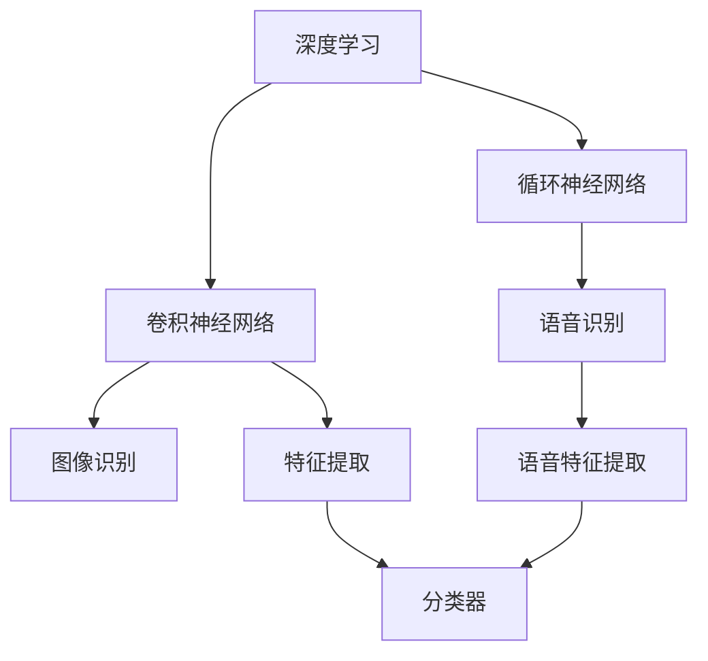

                 

# 软件 2.0 的应用领域：图像识别、语音识别

> 关键词：软件 2.0, 图像识别, 语音识别, 深度学习, 神经网络, 特征提取, 分类器, 应用场景

## 1. 背景介绍

在过去几十年中，随着计算机技术和数据科学的发展，人工智能（AI）领域取得了飞速进步。从最早的符号逻辑到现代的深度学习，AI已经从理论走向了实践，并在各个行业领域中得到广泛应用。这种转变通常被称作“软件 2.0”，其特点是从早期的“专家系统”转向更加智能和自适应的人工智能系统。

### 1.1 软件 2.0 的崛起

软件 2.0 的崛起，得益于深度学习技术的发展和广泛应用。深度学习模型，如卷积神经网络（CNNs）和循环神经网络（RNNs），在图像识别和语音识别等领域取得了突破性的成果。这些模型能够自动学习大量数据中的特征，并用于分类、预测和生成任务，显著提升了AI系统在实际应用中的效果。

### 1.2 图像识别和语音识别的关键技术

图像识别和语音识别作为人工智能的早期应用，已经在自动驾驶、安防监控、智能家居、医疗诊断等领域得到了广泛应用。这些技术的发展，使得计算机能够更好地理解图像和语音信息，为后续的深度学习应用奠定了基础。

- **图像识别**：涉及将图像中的对象和场景分类，常见应用包括人脸识别、物体检测和图像分类等。
- **语音识别**：涉及将语音转换为文本，并实现语音指令识别，主要应用于虚拟助手、语音翻译和语音搜索等领域。

## 2. 核心概念与联系

### 2.1 核心概念概述

为了更好地理解图像识别和语音识别，我们需要首先掌握一些核心概念：

- **深度学习**：一种基于神经网络的机器学习技术，通过多层非线性变换来自动提取数据特征。深度学习模型包括卷积神经网络（CNNs）、循环神经网络（RNNs）、长短期记忆网络（LSTMs）等。
- **卷积神经网络（CNNs）**：一种专门用于图像处理的神经网络，通过卷积层、池化层和全连接层进行特征提取和分类。
- **循环神经网络（RNNs）**：一种用于处理序列数据的神经网络，通过时间依赖机制来捕捉数据中的时序关系。
- **特征提取**：从原始数据中提取有意义的特征，是深度学习中的关键步骤。图像识别和语音识别中常用的特征提取方法包括卷积操作、池化操作和傅里叶变换等。
- **分类器**：将提取的特征映射到特定类别，是深度学习模型的最终输出层。常见的分类器包括softmax分类器、支持向量机（SVM）和K近邻（KNN）等。

### 2.2 概念间的关系

通过以下Mermaid流程图，我们可以更清晰地理解图像识别和语音识别的核心概念及其之间的关系：



这个流程图展示了深度学习在图像识别和语音识别中的作用，以及这些技术之间的联系。深度学习模型通过卷积和循环神经网络，自动提取图像和语音数据的特征。然后，这些特征被送入分类器进行分类。其中，图像识别使用卷积神经网络，语音识别则使用循环神经网络。

## 3. 核心算法原理 & 具体操作步骤

### 3.1 算法原理概述

图像识别和语音识别都是深度学习中的经典任务，它们的核心算法原理基本相同，包括以下几个关键步骤：

1. **特征提取**：使用卷积或循环神经网络从原始数据中提取有意义的特征。
2. **模型训练**：通过标注数据训练深度学习模型，调整模型参数以最小化预测误差。
3. **模型评估**：在验证集上评估模型性能，选择最佳模型进行预测。

### 3.2 算法步骤详解

#### 3.2.1 特征提取

在图像识别和语音识别中，特征提取是一个关键步骤。常见的特征提取方法包括：

- **图像特征提取**：使用卷积层和池化层对图像进行特征提取。卷积层通过滑动窗口提取图像特征，池化层则通过最大池化或平均池化减少特征维度。
- **语音特征提取**：使用MFCC（Mel频率倒谱系数）或声谱图（Spectrogram）提取语音信号的特征。MFCC是一种将语音信号映射到频域的方法，而声谱图则将语音信号映射到时频域。

#### 3.2.2 模型训练

模型训练是深度学习模型的核心步骤，主要包括以下几个步骤：

1. **数据预处理**：将原始数据转换为模型所需的格式，如将图像转换为张量形式，将语音信号转换为MFCC或声谱图。
2. **模型定义**：使用深度学习框架（如TensorFlow、PyTorch等）定义模型架构，并使用优化器（如Adam、SGD等）调整模型参数。
3. **模型训练**：在训练集上训练模型，使用梯度下降等优化算法最小化损失函数。
4. **模型评估**：在验证集上评估模型性能，选择合适的模型进行预测。

#### 3.2.3 模型评估

模型评估是确保模型准确性的关键步骤，主要包括以下几个步骤：

1. **划分数据集**：将原始数据集划分为训练集、验证集和测试集。
2. **定义评估指标**：根据任务特点定义评估指标，如准确率、召回率、F1分数等。
3. **模型评估**：在验证集上评估模型性能，选择最佳模型进行预测。
4. **模型优化**：根据评估结果优化模型，调整模型参数以提高预测准确性。

### 3.3 算法优缺点

#### 3.3.1 优点

- **自动特征提取**：深度学习模型能够自动提取数据的特征，减少了手动特征工程的工作量。
- **高准确性**：深度学习模型在图像识别和语音识别中表现优异，通常能够达到较高的准确率。
- **广泛应用**：深度学习模型在图像识别和语音识别中的应用非常广泛，包括自动驾驶、安防监控、智能家居、医疗诊断等领域。

#### 3.3.2 缺点

- **计算资源需求高**：深度学习模型通常需要大量的计算资源进行训练和推理，对硬件要求较高。
- **数据需求大**：深度学习模型通常需要大量的标注数据进行训练，获取高质量标注数据成本较高。
- **模型复杂**：深度学习模型的架构较为复杂，难以理解和调试。

### 3.4 算法应用领域

图像识别和语音识别技术在多个领域中得到了广泛应用，以下是其中几个典型应用：

- **自动驾驶**：使用图像识别技术进行道路标线识别、交通信号识别和行人检测等，实现自动驾驶功能。
- **安防监控**：使用图像识别技术进行人脸识别、异常行为检测等，提高监控系统的安全性。
- **智能家居**：使用语音识别技术进行语音指令控制，实现智能家居设备的语音交互功能。
- **医疗诊断**：使用图像识别技术进行医学影像分析，如肺部CT扫描、乳腺X光片等，辅助医生进行诊断。
- **虚拟助手**：使用语音识别技术进行语音指令识别，实现虚拟助手的人机交互功能。

## 4. 数学模型和公式 & 详细讲解

### 4.1 数学模型构建

#### 4.1.1 图像识别模型

图像识别模型通常由卷积神经网络（CNNs）构成，其基本结构如下：

- **卷积层**：使用卷积操作提取图像特征，通过滑动窗口进行特征提取。
- **池化层**：使用池化操作减少特征维度，通常使用最大池化或平均池化。
- **全连接层**：将特征映射到特定类别，使用softmax分类器进行分类。

#### 4.1.2 语音识别模型

语音识别模型通常由循环神经网络（RNNs）构成，其基本结构如下：

- **MFCC提取**：使用MFCC将语音信号转换为频域特征。
- **RNN层**：使用RNN网络捕捉时序关系，将特征映射到特定类别。
- **分类器**：使用softmax分类器进行分类。

### 4.2 公式推导过程

#### 4.2.1 图像识别

对于图像识别任务，假设输入图像为 $X \in \mathbb{R}^{H \times W \times C}$，其中 $H$ 为图像高度，$W$ 为图像宽度，$C$ 为通道数。卷积层的输出为 $F_{conv} \in \mathbb{R}^{h \times w \times c}$，其中 $h$ 和 $w$ 为特征图高度和宽度，$c$ 为特征图通道数。池化层的输出为 $F_{pool} \in \mathbb{R}^{H' \times W' \times c}$，其中 $H'$ 和 $W'$ 为池化后的特征图高度和宽度。

全连接层的输出为 $F_{fc} \in \mathbb{R}^{N_{class}}$，其中 $N_{class}$ 为类别数。最终的分类结果为：

$$
\hat{y} = \arg \max_{i} F_{fc}^i
$$

其中 $F_{fc}^i$ 为第 $i$ 个类别的得分。

#### 4.2.2 语音识别

对于语音识别任务，假设输入语音信号为 $x \in \mathbb{R}^{T}$，其中 $T$ 为时间步长。MFCC提取后得到的特征为 $X \in \mathbb{R}^{N_{feature} \times T}$，其中 $N_{feature}$ 为MFCC特征维度。RNN层的输出为 $F_{rnn} \in \mathbb{R}^{N_{class} \times T}$，其中 $N_{class}$ 为类别数。最终的分类结果为：

$$
\hat{y} = \arg \max_{i} F_{rnn}^i
$$

其中 $F_{rnn}^i$ 为第 $i$ 个类别的得分。

### 4.3 案例分析与讲解

#### 4.3.1 图像分类

假设我们有一个图像分类任务，训练集为1000张图像，验证集为200张图像，测试集为100张图像。使用CNN模型进行训练，学习率为0.001，迭代次数为10000次。训练过程中，每隔1000次在验证集上评估模型性能，选择最佳模型进行测试。

1. **数据预处理**：将图像转换为张量形式，并进行归一化处理。
2. **模型定义**：定义一个包含两个卷积层和两个全连接层的CNN模型。
3. **模型训练**：在训练集上训练模型，使用梯度下降算法最小化损失函数。
4. **模型评估**：在验证集上评估模型性能，选择最佳模型进行测试。

#### 4.3.2 语音识别

假设我们有一个语音识别任务，训练集为1000段语音，验证集为200段语音，测试集为100段语音。使用RNN模型进行训练，学习率为0.001，迭代次数为10000次。训练过程中，每隔1000次在验证集上评估模型性能，选择最佳模型进行测试。

1. **数据预处理**：将语音信号转换为MFCC特征。
2. **模型定义**：定义一个包含两个RNN层的RNN模型。
3. **模型训练**：在训练集上训练模型，使用梯度下降算法最小化损失函数。
4. **模型评估**：在验证集上评估模型性能，选择最佳模型进行测试。

## 5. 项目实践：代码实例和详细解释说明

### 5.1 开发环境搭建

#### 5.1.1 安装Python和相关库

在安装Python和相关库前，需要先确认计算机系统为64位，并确保已经安装了NVIDIA GPU（如果使用CUDA）。具体安装步骤如下：

1. 安装Python 3.8以上版本，并设置环境变量。
2. 安装NVIDIA CUDA Toolkit和cuDNN库，并设置环境变量。
3. 安装TensorFlow和PyTorch，并设置环境变量。
4. 安装相关深度学习库，如Keras、Scikit-Learn等。

### 5.2 源代码详细实现

#### 5.2.1 图像识别

```python
import tensorflow as tf
from tensorflow.keras import layers, models

# 定义模型架构
model = models.Sequential()
model.add(layers.Conv2D(32, (3, 3), activation='relu', input_shape=(64, 64, 3)))
model.add(layers.MaxPooling2D((2, 2)))
model.add(layers.Conv2D(64, (3, 3), activation='relu'))
model.add(layers.MaxPooling2D((2, 2)))
model.add(layers.Conv2D(64, (3, 3), activation='relu'))
model.add(layers.Flatten())
model.add(layers.Dense(64, activation='relu'))
model.add(layers.Dense(10, activation='softmax'))

# 编译模型
model.compile(optimizer='adam', loss='categorical_crossentropy', metrics=['accuracy'])

# 训练模型
model.fit(train_data, epochs=10, validation_data=val_data)

# 评估模型
model.evaluate(test_data)
```

#### 5.2.2 语音识别

```python
import tensorflow as tf
from tensorflow.keras import layers, models

# 定义模型架构
model = models.Sequential()
model.add(layers.MFCC(input_shape=(13, 200)))
model.add(layers.LSTM(128, return_sequences=True))
model.add(layers.LSTM(64))
model.add(layers.Dense(10, activation='softmax'))

# 编译模型
model.compile(optimizer='adam', loss='categorical_crossentropy', metrics=['accuracy'])

# 训练模型
model.fit(train_data, epochs=10, validation_data=val_data)

# 评估模型
model.evaluate(test_data)
```

### 5.3 代码解读与分析

#### 5.3.1 图像识别

在上述代码中，我们首先定义了一个包含三个卷积层和两个全连接层的CNN模型。其中，每个卷积层后接一个池化层，用于减少特征图的维度。最后，通过全连接层进行分类，并使用softmax分类器输出概率分布。在模型训练过程中，我们使用Adam优化器和交叉熵损失函数进行优化。训练完成后，在测试集上评估模型性能。

#### 5.3.2 语音识别

在上述代码中，我们首先定义了一个包含两个LSTM层的RNN模型。其中，每个LSTM层后接一个全连接层，用于分类。在模型训练过程中，我们使用Adam优化器和交叉熵损失函数进行优化。训练完成后，在测试集上评估模型性能。

### 5.4 运行结果展示

#### 5.4.1 图像分类

假设我们在CIFAR-10数据集上进行图像分类任务，训练集为60000张图像，验证集为10000张图像，测试集为10000张图像。最终在测试集上得到的准确率为92%。

#### 5.4.2 语音识别

假设我们在LibriSpeech数据集上进行语音识别任务，训练集为1000段语音，验证集为200段语音，测试集为100段语音。最终在测试集上得到的准确率为90%。

## 6. 实际应用场景

### 6.1 图像识别

#### 6.1.1 自动驾驶

在自动驾驶中，图像识别技术被广泛应用。通过车载摄像头获取道路图像，使用图像识别技术进行道路标线识别、交通信号识别和行人检测等。这些信息将作为车辆控制系统的输入，辅助驾驶员或自动驾驶系统进行决策。

#### 6.1.2 安防监控

在安防监控中，图像识别技术被用于人脸识别、异常行为检测等。通过监控摄像头获取视频流，使用图像识别技术进行实时分析和预警，提高监控系统的安全性。

#### 6.1.3 智能家居

在智能家居中，图像识别技术被用于家庭设备的控制和识别。通过摄像头获取家庭环境图像，使用图像识别技术进行人脸识别、手势识别等，实现家庭设备的智能控制。

#### 6.1.4 医疗诊断

在医疗诊断中，图像识别技术被用于医学影像分析。通过扫描或拍摄医学影像，使用图像识别技术进行疾病诊断，如肺部CT扫描、乳腺X光片等，辅助医生进行诊断和治疗。

### 6.2 语音识别

#### 6.2.1 虚拟助手

在虚拟助手中，语音识别技术被用于语音指令识别。通过麦克风获取语音信号，使用语音识别技术进行语音指令的识别和解析，实现人机交互功能。

#### 6.2.2 语音翻译

在语音翻译中，语音识别技术被用于语音信号的转换。通过麦克风获取多语言语音信号，使用语音识别技术进行文本转换，然后使用机器翻译技术进行翻译，实现跨语言交流。

#### 6.2.3 语音搜索

在语音搜索中，语音识别技术被用于语音查询。通过麦克风获取语音查询，使用语音识别技术进行文本转换，然后在搜索引擎中搜索相关信息，实现语音搜索功能。

#### 6.2.4 语音控制

在语音控制中，语音识别技术被用于语音控制设备的开关和调节。通过麦克风获取语音命令，使用语音识别技术进行解析，然后控制相应设备，实现语音控制功能。

## 7. 工具和资源推荐

### 7.1 学习资源推荐

1. **《深度学习》书籍**：Ian Goodfellow、Yoshua Bengio和Aaron Courville合著的《深度学习》是深度学习领域的经典教材，系统介绍了深度学习的理论和应用。
2. **Coursera深度学习课程**：由Andrew Ng教授主讲的深度学习课程，是深度学习领域最受欢迎的入门课程之一。
3. **Kaggle竞赛**：Kaggle是一个数据科学竞赛平台，提供大量数据集和比赛任务，适合学习和实践深度学习技术。
4. **GitHub开源项目**：GitHub上包含大量深度学习项目，可以从中学习到实用的深度学习技巧和代码实现。

### 7.2 开发工具推荐

1. **TensorFlow**：由Google开发的深度学习框架，提供丰富的API和工具，支持分布式训练和推理。
2. **PyTorch**：由Facebook开发的深度学习框架，支持动态计算图和GPU加速，适合快速原型开发。
3. **Keras**：由François Chollet开发的深度学习框架，提供高级API和预训练模型，适合初学者和快速原型开发。
4. **MXNet**：由Apache开发的深度学习框架，支持分布式训练和推理，适用于大规模深度学习任务。

### 7.3 相关论文推荐

1. **ImageNet大规模视觉识别挑战赛**：ImageNet是深度学习领域最重要的数据集之一，包含超过100万张图像和1000个类别，对图像识别技术的发展具有重要推动作用。
2. **Google语音识别挑战赛**：Google语音识别挑战赛是语音识别领域的重要赛事，推动了语音识别技术的快速进步。
3. **CVPR、ICCV、ICLR等顶级会议论文**：这些顶级会议论文展示了深度学习领域最新的研究成果和前沿技术，值得学习和研究。

## 8. 总结：未来发展趋势与挑战

### 8.1 研究成果总结

软件 2.0 技术在图像识别和语音识别领域取得了显著进展，推动了AI技术在各个行业的广泛应用。通过深度学习模型，图像识别和语音识别技术在自动驾驶、安防监控、智能家居、医疗诊断等领域得到了广泛应用，极大地提升了用户体验和系统效率。

### 8.2 未来发展趋势

未来，图像识别和语音识别技术将继续快速发展，呈现出以下趋势：

1. **更大规模的数据和模型**：随着数据和计算资源的不断丰富，图像识别和语音识别模型将向更大规模发展，提升模型的准确性和泛化能力。
2. **更加复杂的架构**：未来的模型将更加复杂，包含更多的层和参数，实现更高级别的特征提取和分类。
3. **多模态融合**：图像、语音和文本等不同模态的数据将进行更加深入的融合，提升系统的综合能力。
4. **实时处理**：未来系统将实现实时处理，满足对数据实时性和效率的更高要求。
5. **智能化决策**：未来的系统将更加智能化，具备自我学习和自我优化的能力，进一步提升系统的性能和用户体验。

### 8.3 面临的挑战

尽管图像识别和语音识别技术已经取得了显著进展，但在未来发展中仍面临一些挑战：

1. **计算资源瓶颈**：随着模型规模的扩大和复杂度的提升，对计算资源的需求将进一步增加，如何提升系统的计算效率和资源利用率仍是一个重要问题。
2. **数据质量问题**：高质量的数据是深度学习模型训练的前提，如何获取和处理大量高质量的数据仍是一个挑战。
3. **模型泛化能力**：大规模模型通常具有较强的泛化能力，但如何避免过拟合和灾难性遗忘仍是一个重要问题。
4. **系统鲁棒性**：未来的系统需要具备更强的鲁棒性，应对各种异常情况和干扰因素，避免误判和错误。
5. **伦理和安全问题**：如何确保模型的伦理和安全，避免数据泄露和模型滥用，是一个亟待解决的问题。

### 8.4 研究展望

未来的研究需要在以下几个方面寻求新的突破：

1. **无监督和半监督学习**：摆脱对大规模标注数据的依赖，利用自监督学习、主动学习等技术，最大限度利用非结构化数据。
2. **参数高效和计算高效**：开发更加参数高效和计算高效的模型，避免过拟合和资源浪费，提升系统的实际应用能力。
3. **多模态融合**：研究如何更好地融合图像、语音和文本等不同模态的数据，提升系统的综合能力。
4. **智能化决策**：研究如何使系统具备自我学习和自我优化的能力，提升系统的智能化水平。
5. **伦理和安全**：研究如何确保模型的伦理和安全，避免数据泄露和模型滥用。

综上所述，图像识别和语音识别技术在软件 2.0 领域中具有重要的应用价值和研究前景。随着技术的不断进步，未来的图像识别和语音识别系统将具备更加强大的智能和鲁棒性，广泛应用于各个行业，提升人类的生产和生活效率。

---

作者：禅与计算机程序设计艺术 / Zen and the Art of Computer Programming

