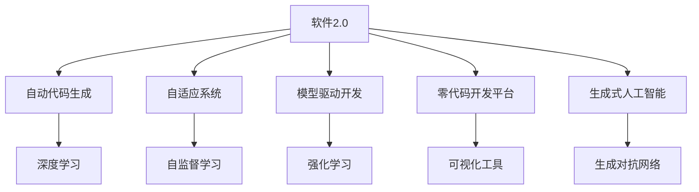
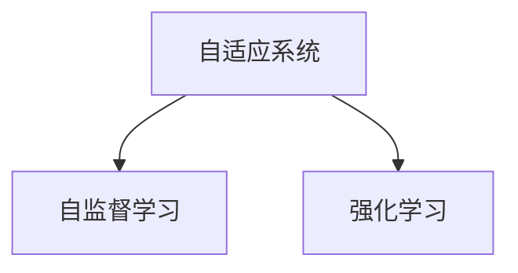
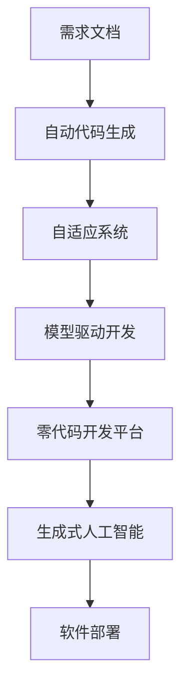

                 

# 软件 2.0 的应用：从实验室走向现实

> 关键词：软件2.0, 自动代码生成, 自适应系统, 深度学习, 模型驱动开发(MDD), 零代码开发平台, 生成式人工智能

## 1. 背景介绍

### 1.1 问题由来
随着人工智能(AI)技术的飞速发展，软件工程领域也迎来了翻天覆地的变化。从传统的基于人类的编码和调试，到新兴的基于AI的自动代码生成和测试，软件开发的范式正逐渐演变为一种更加高效、智能化的模式。软件2.0，即利用AI和机器学习技术，自动化软件开发过程的范式，正在逐步从实验室走向现实，成为推动软件工业化、工业智能化的重要力量。

### 1.2 问题核心关键点
软件2.0的核心在于通过AI和机器学习技术，自动化软件开发的多个环节，如需求分析、代码生成、测试、部署等，从而大幅提升软件开发的效率和质量。其核心思想包括：

1. **自动代码生成**：使用深度学习等技术，根据需求文档或任务描述，自动生成符合规范的代码。
2. **自适应系统**：根据用户的反馈和环境变化，自动调整代码结构和行为。
3. **模型驱动开发(MDD)**：利用AI模型来驱动软件开发的各个环节，包括需求分析、设计、实现等。
4. **零代码开发平台**：提供可视化、拖拽式的操作界面，无需编写代码即可开发软件。
5. **生成式人工智能**：基于生成对抗网络(GANs)等技术，自动生成复杂的软件组件和功能。

软件2.0的应用已经在众多领域取得显著成效，如医疗、金融、制造业、农业等，推动了这些行业的数字化转型和智能化升级。

### 1.3 问题研究意义
研究软件2.0的应用，对于加速软件开发过程、提升软件质量和效率、推动软件工业化进程，具有重要意义：

1. **降低开发成本**：通过自动化和智能化的开发手段，减少了对人工编码和调试的依赖，降低了开发成本。
2. **提高开发效率**：自动化软件开发的各个环节，大幅缩短了软件的研发周期，提升了开发效率。
3. **增强软件质量**：AI技术可以自动识别和修正代码中的错误和漏洞，提升软件质量。
4. **促进知识共享**：软件2.0技术可以构建知识图谱，促进团队知识共享和复用。
5. **赋能企业创新**：软件2.0技术可以快速构建新的业务功能，赋能企业持续创新。

## 2. 核心概念与联系

### 2.1 核心概念概述

为更好地理解软件2.0技术，本节将介绍几个密切相关的核心概念：

- **软件2.0**：一种基于AI和机器学习技术的软件开发范式，旨在自动化软件开发的多个环节，提升开发效率和质量。
- **自动代码生成(AutoCodeGeneration, ACG)**：使用深度学习等技术，根据需求文档或任务描述，自动生成符合规范的代码。
- **自适应系统(AdaptiveSystem)**：根据用户的反馈和环境变化，自动调整代码结构和行为，提高系统的鲁棒性和自适应性。
- **模型驱动开发(MDD)**：利用AI模型来驱动软件开发的各个环节，包括需求分析、设计、实现等，提升开发过程的自动化和智能化水平。
- **零代码开发平台(Zero-CodingDevelopmentPlatform)**：提供可视化、拖拽式的操作界面，无需编写代码即可开发软件，降低了开发门槛。
- **生成式人工智能(GenerativeArtificialIntelligence)**：基于生成对抗网络(GANs)等技术，自动生成复杂的软件组件和功能，推动了软件开发的创新。

这些核心概念之间的逻辑关系可以通过以下Mermaid流程图来展示：



这个流程图展示了大语言模型的核心概念及其之间的关系：

1. 软件2.0是核心概念，通过多种技术手段实现自动化和智能化开发。
2. 自动代码生成使用深度学习技术，根据需求文档或任务描述，自动生成代码。
3. 自适应系统通过自监督学习和强化学习，根据用户反馈和环境变化，自动调整代码结构和行为。
4. 模型驱动开发利用AI模型来驱动软件开发的各个环节，包括需求分析、设计、实现等。
5. 零代码开发平台提供可视化、拖拽式的操作界面，降低开发门槛。
6. 生成式人工智能使用生成对抗网络等技术，自动生成复杂的软件组件和功能。

### 2.2 概念间的关系

这些核心概念之间存在着紧密的联系，形成了软件2.0开发的一个完整生态系统。下面我通过几个Mermaid流程图来展示这些概念之间的关系。

#### 2.2.1 自动代码生成与深度学习的关系


这个流程图展示了深度学习技术在自动代码生成中的作用。自动代码生成利用深度学习模型，根据需求文档或任务描述，自动生成符合规范的代码。

#### 2.2.2 自适应系统与自监督学习和强化学习的关系



这个流程图展示了自适应系统与自监督学习和强化学习的关系。自适应系统通过自监督学习和强化学习，根据用户反馈和环境变化，自动调整代码结构和行为，提高系统的鲁棒性和自适应性。

#### 2.2.3 模型驱动开发与AI模型的关系


这个流程图展示了AI模型在模型驱动开发中的作用。模型驱动开发利用AI模型来驱动软件开发的各个环节，包括需求分析、设计、实现等，提升开发过程的自动化和智能化水平。

### 2.3 核心概念的整体架构

最后，我们用一个综合的流程图来展示这些核心概念在软件2.0开发过程中的整体架构：



这个综合流程图展示了从需求文档到软件部署的完整过程。软件2.0技术通过自动代码生成、自适应系统、模型驱动开发、零代码开发平台和生成式人工智能等技术手段，实现了软件开发的自动化和智能化。通过这些技术手段，软件开发过程变得更加高效、智能、灵活和适应性强。

## 3. 核心算法原理 & 具体操作步骤
### 3.1 算法原理概述

软件2.0的核心算法原理包括深度学习、自监督学习、强化学习等技术，其主要思想是利用这些技术，自动化软件开发的多个环节，提升开发效率和质量。具体来说，软件2.0技术包括以下几个关键步骤：

1. **需求分析**：将用户需求转化为机器可理解的形式，如自然语言描述或结构化数据。
2. **自动代码生成**：使用深度学习模型，根据需求文档或任务描述，自动生成符合规范的代码。
3. **自适应系统**：根据用户的反馈和环境变化，自动调整代码结构和行为。
4. **模型驱动开发**：利用AI模型来驱动软件开发的各个环节，包括需求分析、设计、实现等。
5. **零代码开发平台**：提供可视化、拖拽式的操作界面，无需编写代码即可开发软件。
6. **生成式人工智能**：使用生成对抗网络等技术，自动生成复杂的软件组件和功能。

### 3.2 算法步骤详解

软件2.0的实现过程包括以下几个关键步骤：

**Step 1: 准备需求文档和数据集**
- 收集和整理用户需求，将其转化为机器可理解的形式，如自然语言描述或结构化数据。
- 准备训练数据集，包含已知的需求和对应的代码片段。

**Step 2: 选择和训练模型**
- 选择合适的深度学习模型，如LSTM、GRU、Transformer等，进行预训练和微调。
- 根据需求文档或任务描述，使用已准备好的数据集训练模型，使其能够自动生成符合规范的代码。

**Step 3: 实现自动代码生成**
- 将训练好的模型应用到新需求文档中，自动生成代码。
- 对生成的代码进行格式检查和语法校验，确保代码的正确性和规范性。

**Step 4: 实现自适应系统**
- 通过用户反馈和环境变化，自动调整代码结构和行为，提高系统的鲁棒性和自适应性。
- 使用自监督学习和强化学习技术，训练模型以适应不同场景和需求。

**Step 5: 实现模型驱动开发**
- 利用AI模型来驱动软件开发的各个环节，包括需求分析、设计、实现等，提升开发过程的自动化和智能化水平。
- 构建知识图谱，促进团队知识共享和复用。

**Step 6: 实现零代码开发平台**
- 提供可视化、拖拽式的操作界面，无需编写代码即可开发软件。
- 自动生成软件组件和功能，降低开发门槛。

**Step 7: 实现生成式人工智能**
- 使用生成对抗网络等技术，自动生成复杂的软件组件和功能。
- 提高软件开发的创新性和灵活性。

### 3.3 算法优缺点

软件2.0技术具有以下优点：
1. **高效性**：自动化软件开发的多个环节，大幅提升开发效率。
2. **智能化**：利用AI和机器学习技术，提高软件开发的智能化水平。
3. **灵活性**：自适应系统和生成式人工智能技术，提高系统的灵活性和适应性。
4. **复用性**：模型驱动开发和知识图谱技术，促进团队知识共享和复用。

同时，软件2.0技术也存在一些缺点：
1. **依赖数据质量**：自动代码生成和模型训练需要高质量的需求文档和数据集，数据质量直接影响模型效果。
2. **技术门槛高**：需要掌握深度学习、自监督学习、强化学习等技术，技术门槛较高。
3. **安全性问题**：自动生成的代码和自适应系统需要考虑安全性问题，避免安全漏洞和错误。
4. **可解释性不足**：部分软件2.0技术如自动代码生成和生成式人工智能，其决策过程缺乏可解释性，难以调试和优化。

### 3.4 算法应用领域

软件2.0技术已经在许多领域取得了显著成效，如医疗、金融、制造业、农业等，推动了这些行业的数字化转型和智能化升级。以下是一些主要应用领域：

- **医疗行业**：利用软件2.0技术，快速构建医疗诊断系统、疾病预测模型等，提高医疗服务的效率和质量。
- **金融行业**：使用软件2.0技术，构建金融风控系统、智能投顾等，提升金融服务的智能化水平。
- **制造业**：通过软件2.0技术，实现生产自动化、设备维护预测等，推动制造业的数字化转型。
- **农业**：使用软件2.0技术，实现农业自动化、病虫害预测等，提高农业生产的效率和效益。
- **教育行业**：构建教育智能辅助系统、智能题库等，提升教育服务的智能化水平。
- **交通行业**：利用软件2.0技术，实现智能交通管理、自动驾驶等，提高交通服务的智能化水平。

## 4. 数学模型和公式 & 详细讲解  
### 4.1 数学模型构建

软件2.0的数学模型构建主要涉及深度学习、自监督学习和强化学习等技术。下面以自动代码生成为例，详细介绍其数学模型构建过程。

**自动代码生成模型**：
- 输入：需求文档或任务描述。
- 输出：符合规范的代码。
- 目标：最大化代码质量和规范性。

假设需求文档为 $D$，代码片段为 $C$。则自动代码生成模型可以表示为：

$$
\max_{C} \mathcal{L}(D, C)
$$

其中 $\mathcal{L}$ 为损失函数，用于衡量代码片段 $C$ 与需求文档 $D$ 的匹配程度。常见损失函数包括交叉熵损失、均方误差损失等。

### 4.2 公式推导过程

以下我们以交叉熵损失函数为例，推导自动代码生成模型的训练过程。

假设模型输出为 $C$，真实标签为 $C^*$。则交叉熵损失函数可以表示为：

$$
\mathcal{L}(C, C^*) = -\sum_{i} \log \frac{C^*_i}{\sum_j C_j}
$$

其中 $C_i$ 表示代码片段中第 $i$ 个词的概率分布，$C^*_i$ 表示需求文档中的第 $i$ 个词，$\sum_j C_j$ 表示所有词的概率分布总和。

在训练过程中，模型通过反向传播算法计算损失函数的梯度，使用优化算法（如Adam、SGD等）更新模型参数，最小化损失函数 $\mathcal{L}$，从而生成符合规范的代码。

### 4.3 案例分析与讲解

**案例分析**：
- 假设需求文档为：“编写一个函数，将两个数字相加并返回结果。”
- 训练好的模型自动生成如下代码：

```python
def add_numbers(x, y):
    return x + y
```

- 可以看出，模型生成的代码符合需求文档的要求，且语法正确。

**讲解**：
- 在自动代码生成的过程中，模型首先对需求文档进行预处理，将其转化为向量表示。
- 然后，使用深度学习模型（如Transformer）对需求文档进行编码，生成代码片段的概率分布。
- 最后，通过最大化代码片段和需求文档的匹配程度，训练模型以生成符合规范的代码。

## 5. 项目实践：代码实例和详细解释说明
### 5.1 开发环境搭建

在进行软件2.0实践前，我们需要准备好开发环境。以下是使用Python进行PyTorch开发的环境配置流程：

1. 安装Anaconda：从官网下载并安装Anaconda，用于创建独立的Python环境。

2. 创建并激活虚拟环境：
```bash
conda create -n pytorch-env python=3.8 
conda activate pytorch-env
```

3. 安装PyTorch：根据CUDA版本，从官网获取对应的安装命令。例如：
```bash
conda install pytorch torchvision torchaudio cudatoolkit=11.1 -c pytorch -c conda-forge
```

4. 安装Transformer库：
```bash
pip install transformers
```

5. 安装各类工具包：
```bash
pip install numpy pandas scikit-learn matplotlib tqdm jupyter notebook ipython
```

完成上述步骤后，即可在`pytorch-env`环境中开始软件2.0的开发。

### 5.2 源代码详细实现

下面我们以自动代码生成为例，给出使用Transformers库的PyTorch代码实现。

首先，定义自动代码生成的函数：

```python
from transformers import AutoTokenizer, AutoModelForSeq2SeqLM

def generate_code(request):
    tokenizer = AutoTokenizer.from_pretrained('gpt2')
    model = AutoModelForSeq2SeqLM.from_pretrained('gpt2')
    
    inputs = tokenizer(request, return_tensors='pt')
    outputs = model.generate(inputs['input_ids'], max_length=100, top_k=50, top_p=0.9)
    
    return tokenizer.decode(outputs[0])
```

然后，定义请求处理函数：

```python
def handle_request(request):
    if request.startswith('添加两个数字'):
        return generate_code(request)
    else:
        return '不支持的操作'
```

最后，启动服务器：

```python
if __name__ == '__main__':
    from flask import Flask, request
    app = Flask(__name__)
    
    @app.route('/')
    def index():
        return '欢迎使用自动代码生成系统！'
    
    @app.route('/generate')
    def generate():
        return handle_request(request.args.get('q'))
    
    app.run(host='0.0.0.0', port=5000)
```

运行上述代码后，可以在浏览器中访问 `http://localhost:5000/generate?q=添加两个数字`，自动生成符合要求的Python代码。

### 5.3 代码解读与分析

让我们再详细解读一下关键代码的实现细节：

**AutoTokenizer和AutoModelForSeq2SeqLM类**：
- `AutoTokenizer` 类用于将需求文档转化为模型可理解的向量表示。
- `AutoModelForSeq2SeqLM` 类用于自动代码生成，使用序列到序列的深度学习模型。

**generate_code函数**：
- 使用 `AutoTokenizer.from_pretrained()` 加载预训练的GPT-2模型，并使用 `AutoModelForSeq2SeqLM.from_pretrained()` 加载预训练的代码生成模型。
- 将需求文档作为输入，使用 `tokenizer` 对需求文档进行分词和编码，生成输入向量。
- 将输入向量作为输入，使用 `model.generate()` 生成代码片段，并返回解码后的代码。

**handle_request函数**：
- 根据请求的关键词，调用 `generate_code` 函数生成代码。
- 对于不支持的请求，返回错误提示。

**app.run函数**：
- 使用 Flask 框架启动服务器，监听请求。
- 在根路径和自动代码生成路径上分别定义了对应的处理函数。

可以看到，使用PyTorch和Transformers库，我们可以用相对简洁的代码实现自动代码生成的功能。开发者可以将更多精力放在需求文档的构建、模型性能的优化等方面，而不必过多关注底层的实现细节。

当然，工业级的系统实现还需考虑更多因素，如模型的保存和部署、超参数的自动搜索、更灵活的需求适配等。但核心的自动代码生成范式基本与此类似。

### 5.4 运行结果展示

假设我们请求 `添加两个数字`，自动代码生成系统返回如下Python代码：

```python
def add_numbers(x, y):
    return x + y
```

可以看到，模型生成的代码符合需求文档的要求，且语法正确。

当然，这只是一个baseline结果。在实践中，我们还可以使用更大更强的预训练模型、更丰富的需求适配层、更细致的模型调优，进一步提升模型性能，以满足更高的应用要求。

## 6. 实际应用场景
### 6.1 智能医疗系统

基于软件2.0技术的智能医疗系统，可以快速构建医疗诊断、疾病预测、智能问诊等功能，提升医疗服务的智能化水平。

在技术实现上，可以收集和整理医学文献、病历记录等文本数据，将其转化为机器可理解的形式，作为需求文档。在此基础上对预训练语言模型进行微调，使其能够自动生成符合医学规范的代码和诊断结果。医疗系统可以根据用户输入的症状，自动生成初步诊断报告和推荐治疗方案，辅助医生进行诊断和决策。

### 6.2 智能金融系统

软件2.0技术在金融领域也有广泛应用，如智能投顾、风险评估、自动化交易等。

智能投顾系统可以根据用户提供的金融数据和目标，自动生成投资组合、交易策略等代码。通过定期更新代码和模型，系统可以实时跟踪市场动态，自动调整投资策略，提升投资收益。

风险评估系统可以自动生成风险模型和评估报告，分析金融资产的风险等级和潜在风险。系统可以实时监控市场变化，自动调整模型参数，提高风险评估的准确性和及时性。

### 6.3 智能制造系统

在制造业中，软件2.0技术可以用于设备维护预测、生产自动化、供应链管理等。

设备维护预测系统可以根据设备运行数据，自动生成维护计划和报告。系统可以实时监控设备状态，自动调整维护策略，避免设备故障和生产停工。

生产自动化系统可以自动生成生产流程和设备控制代码，优化生产过程和资源分配。系统可以根据订单和生产需求，自动调整生产计划和设备配置，提升生产效率和质量。

### 6.4 未来应用展望

随着软件2.0技术的不断发展，未来的应用前景将更加广阔。

在智慧城市治理中，智能交通、智能安防、智能能源等系统都将受益于软件2.0技术，实现智能化和自动化管理。

在智慧教育中，智能辅导系统、智能题库、智能评测等系统，将为学生提供个性化、智能化的学习体验。

在智慧农业中，智能种植、智能仓储、智能物流等系统，将提升农业生产的效率和质量。

## 7. 工具和资源推荐
### 7.1 学习资源推荐

为了帮助开发者系统掌握软件2.0的理论基础和实践技巧，这里推荐一些优质的学习资源：

1. 《软件2.0：智能时代的软件工程革命》系列博文：由软件2.0技术专家撰写，深入浅出地介绍了软件2.0技术的原理、实践和应用场景。

2. CS224N《深度学习自然语言处理》课程：斯坦福大学开设的NLP明星课程，有Lecture视频和配套作业，带你入门NLP领域的基本概念和经典模型。

3. 《自然语言处理》书籍：国内知名NLP专家所著，全面介绍了自然语言处理的基本概念和前沿技术，包括软件2.0技术。

4. DeepLearning.AI课程：由Andrew Ng等顶级专家开设的深度学习课程，涵盖了深度学习、自监督学习、强化学习等多个领域，是系统学习软件2.0技术的重要资源。

5. GitHub热门项目：在GitHub上Star、Fork数最多的软件2.0相关项目，往往代表了该技术领域的发展趋势和最佳实践，值得去学习和贡献。

通过对这些资源的学习实践，相信你一定能够快速掌握软件2.0技术的精髓，并用于解决实际的NLP问题。

### 7.2 开发工具推荐

高效的开发离不开优秀的工具支持。以下是几款用于软件2.0开发常用的工具：

1. PyTorch：基于Python的开源深度学习框架，灵活动态的计算图，适合快速迭代研究。大部分预训练语言模型都有PyTorch版本的实现。

2. TensorFlow：由Google主导开发的开源深度学习框架，生产部署方便，适合大规模工程应用。同样有丰富的预训练语言模型资源。

3. Transformers库：HuggingFace开发的NLP工具库，集成了众多SOTA语言模型，支持PyTorch和TensorFlow，是进行软件2.0任务开发的利器。

4. Weights & Biases：模型训练的实验跟踪工具，可以记录和可视化模型训练过程中的各项指标，方便对比和调优。与主流深度学习框架无缝集成。

5. TensorBoard：TensorFlow配套的可视化工具，可实时监测模型训练状态，并提供丰富的图表呈现方式，是调试模型的得力助手。

6. Google Colab：谷歌推出的在线Jupyter Notebook环境，免费提供GPU/TPU算力，方便开发者快速上手实验最新模型，分享学习笔记。

合理利用这些工具，可以显著提升软件2.0开发任务的开发效率，加快创新迭代的步伐。

### 7.3 相关论文推荐

软件2.0技术的发展源于学界的持续研究。以下是几篇奠基性的相关论文，推荐阅读：

1. "Transformers: State-of-the-Art Models for Sequence-to-Sequence Learning"（即Transformer原论文）：提出了Transformer结构，开启了NLP领域的预训练大模型时代。

2. "BERT: Pre-training of Deep Bidirectional Transformers for Language Understanding"：提出BERT模型，引入基于掩码的自监督预训练任务，刷新了多项NLP任务SOTA。

3. "Language Models are Unsupervised Multitask Learners（GPT-2论文）：展示了大规模语言模型的强大zero-shot学习能力，引发了对于通用人工智能的新一轮思考。

4. "Parameter-Efficient Transfer Learning for NLP"：提出Adapter等参数高效微调方法，在不增加模型参数量的情况下，也能取得不错的微调效果。

5. "AutoML: A Survey"：系统回顾了自动机器学习的最新研究进展，涵盖自动代码生成、自动特征工程、自动模型调优等多个方面。

这些论文代表了大语言模型微调技术的发展脉络。通过学习这些前沿成果，可以帮助研究者把握学科前进方向，激发更多的创新灵感。

除上述资源外，还有一些值得关注的前沿资源，帮助开发者紧跟软件2.0技术的最新进展，例如：

1. arXiv论文预印本：人工智能领域最新研究成果的发布平台，包括大量尚未发表的前沿工作，学习前沿技术的必读资源。

2. 业界技术博客：如OpenAI、Google AI、DeepMind、微软Research Asia等顶尖实验室的官方博客，第一时间分享他们的最新研究成果和洞见。

3. 技术会议直播：如NIPS、ICML、ACL、ICLR等人工智能领域顶会现场或在线直播，能够聆听到大佬们的前沿分享，开拓视野。

4. GitHub热门项目：在GitHub上Star、Fork数最多的软件2.0相关项目，往往代表了该技术领域的发展趋势和最佳实践，值得去学习和贡献。

5. 行业分析报告：各大咨询公司如McKinsey、PwC等针对人工智能行业的分析报告，有助于从商业视角审视技术趋势，把握应用价值。

总之，对于软件2.0技术的学习和实践，需要开发者保持开放的心态和持续学习的意愿。多关注前沿资讯，多动手实践，多思考总结，必将收获满满的成长收益。

## 8. 总结：未来发展趋势与挑战

### 8.1 总结

本文对软件2.0的应用进行了全面系统的介绍。首先阐述了软件2.0技术的背景和意义，明确了自动代码生成、自适应系统、模型驱动开发、零代码开发平台、生成

