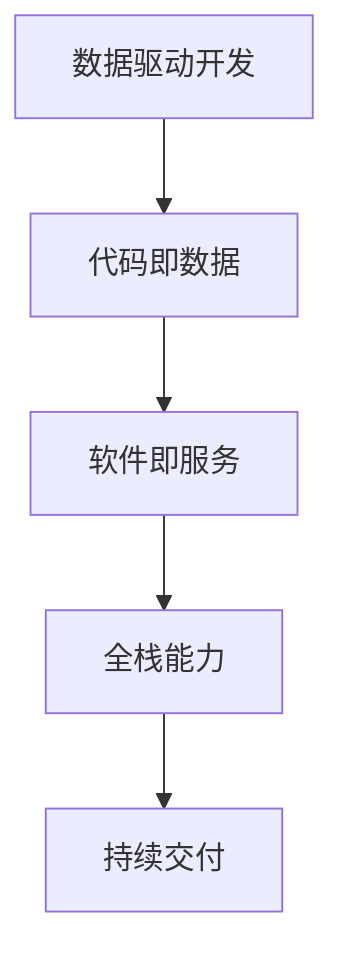

                 

# 软件2.0时代的程序员技能要求

在信息技术迅速发展的今天，程序员的角色和需求已经发生了巨大的变化。传统的软件开发模式已经难以适应当前的技术环境和社会需求，软件2.0时代的到来呼唤着程序员技能体系的全面升级。本文将深入探讨软件2.0时代程序员所必须具备的技能要求，帮助开发者更好地适应新的发展趋势，抓住未来的机遇。

## 1. 背景介绍

### 1.1 背景由来
随着信息技术的不断进步，特别是云计算、人工智能、物联网等技术的成熟和普及，软件开发环境和技术栈发生了翻天覆地的变化。传统的软件工程模式已经难以满足新时期的需求，软件2.0时代的到来成为了必然趋势。软件2.0时代强调代码即数据，开发者需要具备更全面、更深入的技术能力和思维方式，以实现更高效、更智能的软件开发和应用。

### 1.2 背景核心关键点
软件2.0时代与传统软件时代的主要区别在于：
- 数据驱动：软件2.0时代，数据是核心资源，开发过程以数据为中心，软件的功能和价值紧密围绕数据展开。
- 代码即数据：在软件2.0时代，代码不仅是实现功能的手段，更是数据的载体和表现形式。
- 软件即服务：软件2.0时代，软件不再仅仅是一种产品，而是一种服务，需要具备更高的灵活性和可扩展性。
- 全栈能力：软件2.0时代，开发者需要具备跨技术栈的能力，能够在不同技术领域之间无缝切换，实现更高层次的系统设计。
- 持续交付：软件2.0时代，软件开发需要追求高效和连续性，持续交付和快速迭代成为核心要求。

## 2. 核心概念与联系

### 2.1 核心概念概述
在软件2.0时代，程序员需要掌握以下几个核心概念：
- 数据驱动开发：以数据为中心，围绕数据进行需求分析、设计和实现。
- 代码即数据：将代码视为数据的一种表现形式，关注代码的可读性和可维护性。
- 软件即服务：将软件看作一种服务，关注服务的接口和交互方式。
- 全栈能力：具备跨技术栈的能力，包括前端、后端、数据库、人工智能等。
- 持续交付：强调高效、连续的软件开发和部署，追求快速迭代和高质量的软件交付。

### 2.2 概念间的关系

我们可以通过以下Mermaid流程图来展示这些核心概念之间的关系：

这个流程图展示了软件2.0时代程序员技能要求的基本框架：以数据为核心，将代码视为数据的表现形式，围绕服务进行设计，具备全栈能力，追求持续交付。

## 3. 核心算法原理 & 具体操作步骤

### 3.1 算法原理概述
软件2.0时代的核心算法原理主要围绕数据和服务的协同运作展开。以下是对这些原理的简要概述：

1. **数据驱动开发**：
   - 核心算法：数据流图建模、数据分析、数据可视化。
   - 原理：通过数据流图建模，明确数据的流动路径和处理过程，利用数据分析和可视化技术，对数据进行深入理解和展示。

2. **代码即数据**：
   - 核心算法：代码生成、代码注释、代码版本控制。
   - 原理：利用代码生成技术，自动生成高效、可维护的代码，通过代码注释和版本控制技术，确保代码的可读性和可追溯性。

3. **软件即服务**：
   - 核心算法：RESTful API设计、微服务架构、容器化部署。
   - 原理：利用RESTful API设计技术，实现系统各部分之间的通信和协作，通过微服务架构和容器化部署技术，实现服务的灵活扩展和高效运维。

4. **全栈能力**：
   - 核心算法：跨技术栈编程、数据库设计、API设计。
   - 原理：在多个技术栈之间切换自如，能够设计高效的数据库和API，实现跨领域的协同开发。

5. **持续交付**：
   - 核心算法：CI/CD流程、自动化测试、代码审查。
   - 原理：通过CI/CD流程和自动化测试技术，实现高效的软件交付，通过代码审查技术，确保代码质量和安全性。

### 3.2 算法步骤详解
以下是对每个核心算法的详细步骤详解：

1. **数据驱动开发**：
   - **步骤1**：收集和整理数据。使用ETL（Extract, Transform, Load）技术，从多个数据源中提取数据，并进行清洗和转换。
   - **步骤2**：建模和分析数据。使用数据流图建模技术，明确数据的流动路径和处理过程，利用数据分析技术，对数据进行深入理解和展示。
   - **步骤3**：可视化数据。使用数据可视化技术，将数据以图表、报表等形式展示，帮助开发者和用户更好地理解数据。

2. **代码即数据**：
   - **步骤1**：生成代码。使用代码生成技术，自动生成高效、可维护的代码。
   - **步骤2**：注释代码。为代码添加详细注释，解释代码的功能和实现细节，提高代码的可读性和可维护性。
   - **步骤3**：版本控制。使用版本控制工具，如Git，记录代码的变更历史，确保代码的可追溯性。

3. **软件即服务**：
   - **步骤1**：设计API。使用RESTful API设计技术，设计符合REST架构风格的API接口。
   - **步骤2**：实现服务。利用微服务架构和容器化部署技术，实现服务的灵活扩展和高效运维。
   - **步骤3**：测试和部署。使用自动化测试技术，确保服务的稳定性和可靠性，通过容器化部署技术，实现服务的快速部署和扩展。

4. **全栈能力**：
   - **步骤1**：跨技术栈编程。在多个技术栈之间切换自如，设计高效、可维护的代码。
   - **步骤2**：设计数据库。使用数据库设计技术，设计高效、可扩展的数据库结构。
   - **步骤3**：设计API。使用API设计技术，设计高效、可维护的API接口。

5. **持续交付**：
   - **步骤1**：设置CI/CD流程。设置持续集成和持续交付流程，实现高效的软件交付。
   - **步骤2**：编写自动化测试。编写自动化测试用例，确保代码的质量和稳定性。
   - **步骤3**：代码审查。通过代码审查技术，确保代码的质量和安全性。

### 3.3 算法优缺点
1. **数据驱动开发**：
   - **优点**：提升数据分析和处理效率，有助于发现数据中的潜在价值。
   - **缺点**：对数据质量和数据源的依赖较大，需要具备较强的数据分析能力。

2. **代码即数据**：
   - **优点**：提高代码的可读性和可维护性，提升开发效率。
   - **缺点**：代码生成和注释需要投入较多时间和精力，对开发者的技术要求较高。

3. **软件即服务**：
   - **优点**：实现服务的灵活扩展和高效运维，提升系统的可扩展性和稳定性。
   - **缺点**：需要具备一定的架构设计和运维经验，技术门槛较高。

4. **全栈能力**：
   - **优点**：能够在多个技术栈之间切换自如，实现跨领域的协同开发。
   - **缺点**：需要具备较强的跨技术栈编程和设计能力，学习成本较高。

5. **持续交付**：
   - **优点**：实现高效的软件交付，提升开发效率和质量。
   - **缺点**：需要设置和维护CI/CD流程，对团队协作和项目管理的要求较高。

### 3.4 算法应用领域
软件2.0时代的核心算法和操作步骤在多个领域都有广泛的应用：

- **大数据分析**：数据驱动开发和代码即数据在数据分析和数据处理中发挥重要作用。
- **云计算和分布式系统**：软件即服务和全栈能力在云计算和分布式系统的设计和部署中至关重要。
- **人工智能和机器学习**：数据驱动开发和全栈能力在人工智能和机器学习项目中得到广泛应用。
- **Web开发**：代码即数据和软件即服务在Web开发中得到了广泛应用，提高了开发效率和系统性能。
- **移动应用开发**：全栈能力和持续交付在移动应用开发中得到了广泛应用，提升了开发质量和用户满意度。

## 4. 数学模型和公式 & 详细讲解 & 举例说明

### 4.1 数学模型构建
在软件2.0时代，数学模型和公式的应用主要体现在数据驱动开发和持续交付两个方面：

- **数据驱动开发**：
  - 数学模型：使用数据流图建模技术，构建数据流图，描述数据的流动路径和处理过程。
  - 公式推导：使用图论算法，推导数据流图中的节点和边关系，确保数据的正确流动和处理。

- **持续交付**：
  - 数学模型：使用统计学方法，构建CI/CD流程的数学模型，描述软件的交付和部署过程。
  - 公式推导：使用概率论和统计学公式，推导CI/CD流程中各个环节的概率和可靠性，确保软件的稳定性和高效性。

### 4.2 公式推导过程
以下是对数据驱动开发和持续交付中常用数学模型和公式的推导过程：

1. **数据驱动开发**：
   - **数据流图建模**：使用图论算法，推导数据流图中的节点和边关系，确保数据的正确流动和处理。
   - **数据分析**：使用统计学方法，推导数据的分布和统计特征，进行数据分析和可视化。

2. **持续交付**：
   - **CI/CD流程建模**：使用图论算法，推导CI/CD流程中的各个环节，确保软件的连续交付和高效部署。
   - **自动化测试**：使用统计学方法，推导测试数据的分布和统计特征，进行自动化测试。

### 4.3 案例分析与讲解
以下是对数据驱动开发和持续交付中数学模型和公式的实际应用案例：

- **案例1：数据流图建模**：
  - **问题**：某电商平台希望通过数据流图建模技术，优化其数据处理流程，提高数据分析效率。
  - **解决方案**：使用图论算法，构建数据流图，明确数据的流动路径和处理过程，使用统计学方法，分析数据的分布和统计特征，实现高效的数据处理。

- **案例2：持续交付流程建模**：
  - **问题**：某互联网公司希望通过持续交付流程建模技术，优化其软件交付过程，提高软件质量和交付效率。
  - **解决方案**：使用图论算法，构建CI/CD流程，明确软件的交付和部署环节，使用统计学方法，分析测试数据的分布和统计特征，确保软件的稳定性和高效性。

## 5. 项目实践：代码实例和详细解释说明

### 5.1 开发环境搭建
在软件2.0时代，开发环境搭建需要考虑以下几个方面：

- **操作系统**：建议使用Linux操作系统，如Ubuntu、CentOS等，确保开发环境的稳定性和可靠性。
- **开发工具**：建议使用IDE工具，如IntelliJ IDEA、Visual Studio Code等，提供开发效率和功能支持。
- **版本控制**：建议使用Git等版本控制工具，确保代码的可追溯性和协作性。

### 5.2 源代码详细实现
以下是对软件2.0时代程序员需要掌握的代码实现方法：

1. **数据驱动开发**：
   - **代码示例**：使用Python的Pandas库，进行数据流图建模和数据分析。
   - **详细解释**：利用Pandas库的数据处理功能，对数据进行清洗、转换和分析，使用Matplotlib库进行数据可视化。

2. **代码即数据**：
   - **代码示例**：使用Python的MyPy库，进行代码生成和注释。
   - **详细解释**：利用MyPy库的代码生成功能，自动生成高效、可维护的代码，使用Sphinx库进行代码注释，确保代码的可读性和可维护性。

3. **软件即服务**：
   - **代码示例**：使用Python的Flask库，进行RESTful API设计和微服务部署。
   - **详细解释**：利用Flask库的RESTful API设计功能，设计符合REST架构风格的API接口，使用Docker和Kubernetes等容器化工具，实现微服务的部署和扩展。

4. **全栈能力**：
   - **代码示例**：使用Python的Flask和Django框架，进行全栈开发。
   - **详细解释**：利用Flask和Django框架的前端和后端开发功能，实现高效、可维护的Web应用。

5. **持续交付**：
   - **代码示例**：使用Jenkins和GitLab等工具，进行CI/CD流程的配置和管理。
   - **详细解释**：利用Jenkins和GitLab等工具的CI/CD功能，配置自动化测试和部署流程，确保软件的稳定性和高效性。

### 5.3 代码解读与分析
以下是对软件2.0时代程序员需要掌握的代码解读与分析方法：

1. **数据驱动开发**：
   - **代码示例**：使用Python的Pandas库，进行数据流图建模和数据分析。
   - **详细解释**：利用Pandas库的数据处理功能，对数据进行清洗、转换和分析，使用Matplotlib库进行数据可视化。

2. **代码即数据**：
   - **代码示例**：使用Python的MyPy库，进行代码生成和注释。
   - **详细解释**：利用MyPy库的代码生成功能，自动生成高效、可维护的代码，使用Sphinx库进行代码注释，确保代码的可读性和可维护性。

3. **软件即服务**：
   - **代码示例**：使用Python的Flask库，进行RESTful API设计和微服务部署。
   - **详细解释**：利用Flask库的RESTful API设计功能，设计符合REST架构风格的API接口，使用Docker和Kubernetes等容器化工具，实现微服务的部署和扩展。

4. **全栈能力**：
   - **代码示例**：使用Python的Flask和Django框架，进行全栈开发。
   - **详细解释**：利用Flask和Django框架的前端和后端开发功能，实现高效、可维护的Web应用。

5. **持续交付**：
   - **代码示例**：使用Jenkins和GitLab等工具，进行CI/CD流程的配置和管理。
   - **详细解释**：利用Jenkins和GitLab等工具的CI/CD功能，配置自动化测试和部署流程，确保软件的稳定性和高效性。

### 5.4 运行结果展示
以下是对软件2.0时代程序员需要掌握的运行结果展示方法：

1. **数据驱动开发**：
   - **结果展示**：使用Matplotlib库绘制的数据可视化图表。
   - **详细解释**：通过Matplotlib库绘制的数据可视化图表，展示数据分析结果，帮助开发者和用户更好地理解数据。

2. **代码即数据**：
   - **结果展示**：自动生成的代码和详细的注释。
   - **详细解释**：通过自动生成的代码和详细的注释，确保代码的可读性和可维护性。

3. **软件即服务**：
   - **结果展示**：API接口的文档和API的使用示例。
   - **详细解释**：通过API接口的文档和API的使用示例，帮助用户更好地理解和使用API。

4. **全栈能力**：
   - **结果展示**：Web应用的用户界面和交互效果。
   - **详细解释**：通过Web应用的用户界面和交互效果，展示全栈开发的应用成果。

5. **持续交付**：
   - **结果展示**：软件的发布版本和部署日志。
   - **详细解释**：通过软件的发布版本和部署日志，展示持续交付的成果，确保软件的稳定性和高效性。

## 6. 实际应用场景

### 6.1 智能推荐系统
智能推荐系统是软件2.0时代的重要应用场景之一。通过数据驱动开发和代码即数据技术，可以实现对用户行为数据的深入分析，自动生成推荐算法代码，实现高效、精准的推荐服务。

### 6.2 金融风控系统
金融风控系统需要处理大量的金融数据，通过数据驱动开发和代码即数据技术，可以实现对金融数据的深入分析，自动生成风控算法代码，提高金融风控的准确性和效率。

### 6.3 智能医疗系统
智能医疗系统需要处理大量的医疗数据，通过数据驱动开发和代码即数据技术，可以实现对医疗数据的深入分析，自动生成医疗算法代码，提高医疗诊断的准确性和效率。

### 6.4 未来应用展望
软件2.0时代，程序员的技能要求将随着技术的发展不断提升。未来，软件2.0时代程序员需要掌握更多新兴技术，如区块链、物联网、人工智能等，具备更高的跨技术栈能力和创新能力。

## 7. 工具和资源推荐

### 7.1 学习资源推荐
以下是一些推荐的用于学习软件2.0时代编程技能的学习资源：

- **《深入浅出软件工程》**：介绍软件工程的基本原理和开发方法，适合初学者和进阶者阅读。
- **《软件2.0时代：云计算、大数据与人工智能的革命》**：详细阐述软件2.0时代的核心技术和应用，适合技术人员阅读。
- **《Python编程：从入门到实践》**：介绍Python编程的基本原理和应用，适合初学者阅读。
- **《机器学习实战》**：介绍机器学习的基本原理和应用，适合技术人员阅读。

### 7.2 开发工具推荐
以下是一些推荐的用于开发软件2.0时代编程技能的工具：

- **IDE工具**：如IntelliJ IDEA、Visual Studio Code等，提供开发效率和功能支持。
- **版本控制工具**：如Git、SVN等，确保代码的可追溯性和协作性。
- **数据库工具**：如MySQL、MongoDB等，确保数据的管理和访问效率。
- **容器化工具**：如Docker、Kubernetes等，确保服务的灵活扩展和高效运维。

### 7.3 相关论文推荐
以下是一些推荐的用于了解软件2.0时代编程技能的相关论文：

- **《软件2.0时代的编程挑战》**：介绍软件2.0时代的编程挑战和解决方案。
- **《基于数据驱动的软件开发方法》**：介绍数据驱动开发的基本原理和应用。
- **《持续交付：构建高质量的软件》**：介绍持续交付的基本原理和应用。

## 8. 总结：未来发展趋势与挑战

### 8.1 研究成果总结
软件2.0时代，程序员的技能要求已经发生了巨大的变化。数据驱动开发、代码即数据、软件即服务、全栈能力和持续交付等技术，成为了程序员必备的核心技能。通过学习和实践，程序员可以更好地适应软件2.0时代的发展需求，实现更高效、更智能的软件开发和应用。

### 8.2 未来发展趋势
未来，软件2.0时代的发展将呈现以下几个趋势：
- **数据驱动**：数据驱动将成为软件开发的核心，数据成为开发过程的关键资源。
- **代码即数据**：代码将成为数据的载体和表现形式，开发者需要更加注重代码的可读性和可维护性。
- **软件即服务**：软件将更多地以服务的形式存在，需要具备更高的灵活性和可扩展性。
- **全栈能力**：开发者需要具备跨技术栈的能力，能够在多个技术领域之间无缝切换。
- **持续交付**：软件开发需要追求高效和连续性，持续交付和快速迭代成为核心要求。

### 8.3 面临的挑战
软件2.0时代，程序员面临的挑战也越来越多：
- **技术更新快**：新技术不断涌现，需要不断学习和适应。
- **跨领域需求高**：需要具备跨技术栈和跨领域的能力。
- **数据质量要求高**：数据驱动开发对数据质量的要求较高，需要具备数据处理和分析的能力。
- **开发效率要求高**：持续交付和快速迭代需要高效的软件交付和运维能力。

### 8.4 研究展望
未来的研究需要围绕以下几个方向展开：
- **新兴技术的融合**：将新兴技术如区块链、物联网、人工智能等与软件2.0时代技术进行深度融合，提升系统的性能和应用范围。
- **全栈能力的提升**：提升开发者的全栈能力，使其能够在多个技术领域之间无缝切换。
- **持续交付的优化**：优化持续交付流程，实现高效的软件交付和运维。
- **数据驱动的优化**：优化数据驱动开发方法，提高数据分析和处理的效率。
- **代码即数据的优化**：优化代码生成和注释方法，提高代码的可读性和可维护性。

## 9. 附录：常见问题与解答

### Q1: 数据驱动开发和代码即数据有什么不同？
A: 数据驱动开发强调以数据为中心，围绕数据进行需求分析、设计和实现。而代码即数据则强调将代码视为数据的一种表现形式，关注代码的可读性和可维护性。

### Q2: 软件即服务为什么重要？
A: 软件即服务强调软件不再仅仅是一种产品，而是一种服务，需要具备更高的灵活性和可扩展性。这使得软件能够更好地满足用户的个性化需求，提高系统的稳定性和可靠性。

### Q3: 全栈能力为什么要跨技术栈编程？
A: 全栈能力要求开发者具备跨技术栈的能力，能够在多个技术领域之间无缝切换，实现跨领域的协同开发。这有助于开发者全面掌握软件开发的各个环节，提高开发效率和系统性能。

### Q4: 持续交付为什么需要自动化测试？
A: 持续交付需要实现高效的软件交付，而自动化测试可以确保代码的质量和稳定性。通过自动化测试，可以及时发现和修复代码中的问题，避免发布不稳定的软件。

### Q5: 未来软件2.0时代会发展成什么样？
A: 未来软件2.0时代将更加数据驱动、代码即数据、软件即服务、全栈能力和持续交付。开发者需要不断学习和适应新技术，提升跨技术栈和跨领域的能力，确保软件的高效、稳定和可扩展性。

通过本文的系统探讨，相信你一定能够更好地适应软件2.0时代的发展需求，掌握必备的核心技能，抓住未来的机遇，实现更高效、更智能的软件开发和应用。

---

作者：禅与计算机程序设计艺术 / Zen and the Art of Computer Programming

